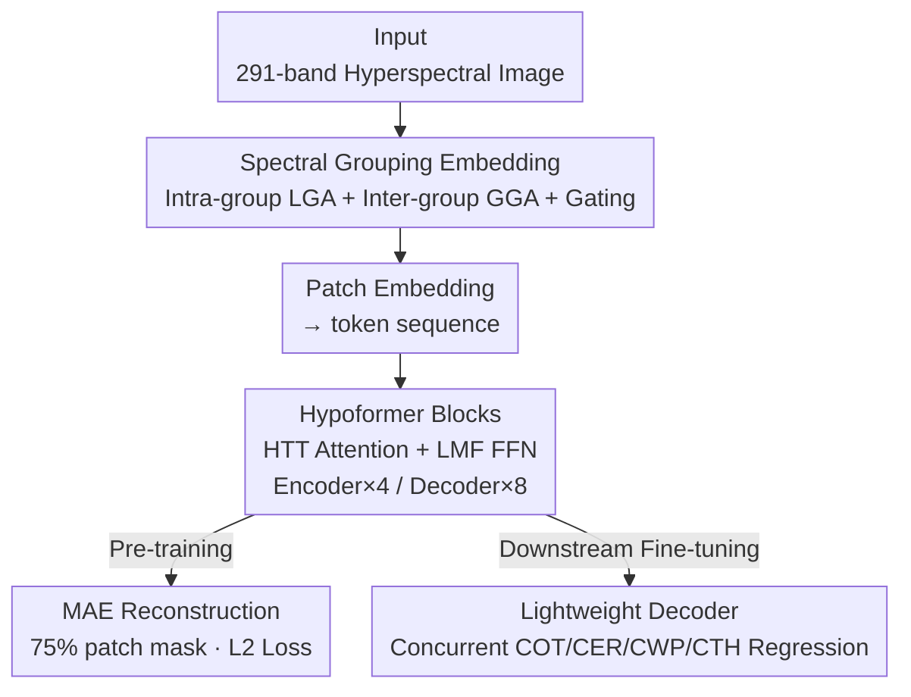

# HyperFM: An Efficient Hyperspectral Foundation Model with Spectral Grouping

**Conference**: CVPR 2026  
**arXiv**: [2604.21127](https://arxiv.org/abs/2604.21127)  
**Code**: https://github.com/umbc-sanjaylab/HyperFM (Available)  
**Area**: Remote Sensing / Hyperspectral Foundation Models  
**Keywords**: Hyperspectral, Foundation Model, Spectral Grouping, Parameter-Efficient, Cloud Property Retrieval

## TL;DR
Targeting the 291-band hyperspectral data from the NASA PACE satellite, this work proposes HyperFM, a parameter-efficient foundation model. It alleviates the information bottleneck when compressing high-dimensional bands into tokens using "Spectral Grouping Attention" (Intra-group LGA + Inter-group GGA + MoE Gating). By utilizing "Hypoformer blocks" (Hybrid Tensor Train Attention + Low-rank FFN), it reduces parameter count by half. Combined with the HyperFM250K dataset—the first featuring over 60% cloud cover—for MAE pre-training, it achieves an average 32.36% reduction in MSE across four cloud property retrieval tasks compared to existing hyperspectral foundation models while doubling parameter efficiency.

## Background & Motivation
**Background**: Following the success of foundation models like CLIP and DALL-E in RGB vision and NLP, the remote sensing community has begun developing multimodal foundation models (RGB, SAR, Multispectral, Hyperspectral). In the hyperspectral field, pioneers like HyperSigma and SpectralEarth have built large-scale corpora and achieved strong results on small HSI benchmarks.

**Limitations of Prior Work**: Existing hyperspectral foundation models suffer from three major flaws. First, they deliberately use only **cloud-free scenes** (cloud cover <10%) for pre-training, meaning they lack exposure to spectral features of cloud pixels and cannot serve tasks like cloud, aerosol, and atmospheric microphysics retrieval. Second, constrained by spectral inconsistencies between sensors, most models are locked into a single sensor's data. Third, they are generally **parameter-heavy and computationally expensive** (often 88M–102M parameters), making large-scale operational deployment difficult.

**Key Challenge**: Hyperspectral data contains hundreds of contiguous bands (291 for PACE-OCI). Standard ViT directly projects a $291\times8\times8$ patch into a 768-dimensional token, causing severe **compression loss** where spectral details are lost as high-dimensional inputs are forced into a fixed token size. Reducing patch size to match token dimensions results in the loss of spatial information. There is a direct trade-off between expressive power and computational efficiency.

**Goal**: To address two sub-problems: (1) create a hyperspectral dataset with high cloud pixel density covering land/sea/polar regions to fill the pre-training gap; (2) design a foundation model architecture that preserves spectral-spatial details while remaining parameter-efficient.

**Key Insight**: The 291 bands of OCI are naturally distributed across three spectrometers (Blue, Red, SWIR) with distinct structures. The authors propose **grouped processing** based on spectral adjacency rather than feeding everything into a single patch embedding. Simultaneously, they adapt Hypoformer tensor train decomposition from language models to vision tasks for the first time to compress parameters.

**Core Idea**: Replace the information-losing single-layer patch embedding with "Spectral Grouped Local+Global Attention," and replace costly standard attention projections with "Hybrid Tensor Train Decomposition" to maintain full-rank expressiveness at a lower cost.

## Method
### Overall Architecture
HyperFM is an MAE foundation model tailored for "large-scale cloudy hyperspectral data." The input is a $C\times H\times W$ ($C=291$) hyperspectral image, and the output is the reconstructed masked area (pre-training) or pixel-wise regression maps for four cloud properties (fine-tuning). The pipeline flows as follows: raw hyperspectral images pass through the **Group Embed module** for spectral grouped feature extraction and patchification, then enter patch embedding to become tokens. These are encoded by a sequence of **Hypoformer blocks** (Encoder $N_e=4$, Decoder $N_d=8$). Pre-training uses the **MAE framework** with a 75% spatial patch mask, feeding only visible tokens to the encoder for reconstruction. In downstream tasks, the encoder is frozen, and a lightweight convolutional decoder is attached to regress four cloud properties simultaneously.

### Key Designs
**1. Group Embed Module: Replacing patch embedding with Spectral Grouping Attention**

Feeding 291 bands into a single patch embedding causes severe compression loss. Group Embed splits the spectral dimension into $k$ groups, $X_1,\dots,X_k\in\mathbb{R}^{\frac{C}{k}\times H\times W}$. Each group passes through a **Local Group Attention (LGA)** block for intra-group features $G_1,\dots,G_k$. These are concatenated and fed into a **Global Group Attention (GGA)** block to model inter-group relationships, outputting $Z\in\mathbb{R}^{C\times H\times W}$. LGA and GGA are implemented with MaxViT blocks—running block attention (local) and grid attention (global) simultaneously. Additionally, a **trainable gating function** (MoE-inspired) is added after LGA to select the most informative feature groups for GGA, focusing computation on the most useful spectral bands.

**2. Hypoformer Blocks: Compressing attention parameters via Hybrid Tensor Train Decomposition**

Standard ViT QKV projection has $\mathcal{O}(N^2)$ complexity, which scales poorly for high-dimensional hyperspectral data. Hypoformer replaces standard blocks with compact modules. First is **HTT (Hybrid Tensor Train) Attention**: instead of a single dense matrix, it combines a dense layer $W_{dense}\in\mathbb{R}^{d\times 3\alpha d}$ and a tensor train linear layer $W_{tt}\in\mathbb{R}^{d\times 3(1-\alpha)d}$ to generate Q/K/V: $q=\text{concat}(q_1,q_2)$, $k=\text{concat}(k_1,k_2)$, $v=\text{concat}(v_1,v_2)$. Second is **LMF (Low Matrix Factorization) FFN**, which uses four low-rank decomposed dense layers: $\text{LMF-FFN}(X)=\text{ReLU}(XU_1V_1+b_1)U_2V_2+b_2$, where rank $R$ controls compression. The hybrid structure maintains **full-rank expressiveness**, distinguishing it from standard low-rank decomposition. With $\alpha=0.5$ and TT rank $R=3$, the model uses only 32.06M parameters, roughly 1/3 of HyperSigma.

**3. HyperFM250K Dataset + MAE Pre-training: Exposing the model to clouds**

The authors collected 2,262 Level-1B granules from NASA PACE-OCI (2024.05–2025.04). After pre-processing, they generated 250,000 patches ($96\times96$) forming the HyperFM250K dataset with **>60% cloud cover**. Pre-training uses MAE with a 75% spatial mask and L2 reconstruction loss. MAE was chosen for its computational efficiency, allowing for a larger encoder capacity without disproportionately increasing training costs.

### Loss & Training
Pre-training uses L2 reconstruction loss with a 75% masking ratio, training for 250 epochs (AdamW, batch size 4). Downstream cloud attributes (COT/CER/CWP/CTH) are handled via **multi-task learning**. During fine-tuning, the encoder is frozen, and only a lightweight decoder (convolutions + upsampling + LayerNorm) is updated. COT and CWP are log-transformed before training. All evaluation metrics use MSE.

## Key Experimental Results

### Main Results
Pixel-wise cloud property retrieval (MSE, lower is better). The table shows **full fine-tuning** results, where HyperFM leads with minimal parameters:

| Model | COT ↓ | CER ↓ | CWP ↓ | CTH ↓ | Parameters |
|------|-------|-------|-------|-------|--------|
| **HyperFM (Ours)** | **0.2615** | **62.40** | **1.01** | **4.05** | 32.06M |
| SpectralEarth | 0.3404 | 84.29 | 1.25 | 5.17 | 88.78M |
| CAM (Task-specific) | 0.3367 | 74.45 | 1.51 | 6.63 | 0.47M |
| UNet (Task-specific) | 0.3928 | 84.73 | 1.57 | 7.68 | 31.04M |
| HyperSigma | 0.4649 | 117.51 | 1.75 | 10.33 | 100.16M |

Compared to the strongest foundation model baseline (HyperSigma), HyperFM reduces MSE by an average of **32.36%** across the four tasks.

### Decoder-only Ablation
To compare representation quality fairly, encoders are frozen and only lightweight decoders are trained. HyperFM still outperforms all competitors:

| Model | COT ↓ | CER ↓ | CWP ↓ | CTH ↓ | Trainable Params |
|------|-------|-------|-------|-------|-----------|
| **HyperFM (Ours)** | **0.3124** | **73.70** | **1.22** | **5.10** | 1.48M |
| HyperSigma | 0.3212 | 95.49 | 1.33 | 8.49 | 0.69M |
| SpectralEarth | 0.4699 | 97.92 | 1.71 | 7.67 | 0.54M |

### Key Findings
- **Data is the Ceiling**: Existing FM fails in zero-shot scenarios for cloud tasks because they haven't seen cloudy pixels; HyperFM250K is a core contribution.
- **Superior Representations**: HyperFM's frozen version (decoder-only) outperforms the full fine-tuning results of other models.
- **Efficiency**: HTT's sub-quadratic complexity $\mathcal{O}(\alpha N^2 + D(\max[\alpha N,(1-\alpha)N])^{1+\frac{1}{D}}R^2)$ allows better scalability than standard ViT.
- **CTH Gains**: The 52.31% improvement in Cloud Top Height suggests large benefits for tasks requiring full spectral information.

## Highlights & Insights
- **Spectral Grouping + MoE**: This hierarchy (LGA/GGA) with gating is a clever way to mitigate compression loss and can be transferred to any high-channel input (e.g., multimodal medical data).
- **Hypoformer Adaptation**: Bringing tensor train decomposition to vision provides an alternative path for efficient pre-training backbones beyond pruning or LoRA.
- **Dataset Impact**: Architecture is secondary to data; "having seen the clouds" is why performance jumped. HyperFM250K fills a critical gap in atmospheric hyperspectral research.

## Limitations & Future Work
- Hyperparameters for compression (alpha/rank) are fixed; systematic ablation is needed.
- Downstream fine-tuning used only 2,000 images due to compute limits.
- Ground truth comes from Level-2 products, which may contain inherent biases; future work aims to use active sensor data for cross-validation.
- Reconstructions show artifacts at patch boundaries, requiring overlapping sampling.

## Related Work & Insights
- **vs. HyperSigma**: HyperSigma uses separate spatial/spectral modules and pre-trains on cloud-free GF/EO-1 data. HyperFM uses 1/3 the parameters to significantly outperform it on cloud tasks.
- **vs. UNet/CAM**: These task-specific models use only 2–8 bands. HyperFM uses all 291 bands, demonstrating the advantage of foundation models.
- **Insight**: When input channels exceed token capacity, "grouping to preserve detail, gating to select info" is more robust than single-layer compression.

## Rating
- Novelty: ⭐⭐⭐⭐ (Spectral grouping + Hypoformer adaptation + novel dataset)
- Experimental Thoroughness: ⭐⭐⭐ (Comprehensive baselines, but needs architecture-specific ablation)
- Writing Quality: ⭐⭐⭐⭐ (Clear motivation and detailed math/complexity analysis)
- Value: ⭐⭐⭐⭐ (Open-sourced code and dataset provide immediate utility for remote sensing)

<!-- RELATED:START -->

## Related Papers

- [\[CVPR 2026\] Local Precise Refinement: A Dual-Gated Mixture-of-Experts for Enhancing Foundation Model Generalization against Spectral Shifts](local_precise_refinement_a_dual-gated_mixture-of-experts_for_enhancing_foundatio.md)
- [\[CVPR 2026\] ORSATR-X: A Foundation Model based on Differential-and-Excitation Networks for Optical Remote Sensing Object Recognition](orsatr-x_a_foundation_model_based_on_differential-and-excitation_networks_for_op.md)
- [\[ICCV 2025\] RS-vHeat: Heat Conduction Guided Efficient Remote Sensing Foundation Model](../../ICCV2025/remote_sensing/rs-vheat_heat_conduction_guided_efficient_remote_sensing_foundation_model.md)
- [\[CVPR 2026\] GeoBridge: A Semantic-Anchored Multi-View Foundation Model Bridging Images and Text for Geo-Localization](geobridge_a_semantic-anchored_multi-view_foundation_model_bridging_images_and_te.md)
- [\[AAAI 2026\] M3SR: Multi-Scale Multi-Perceptual Mamba for Efficient Spectral Reconstruction](../../AAAI2026/remote_sensing/m3sr_multi-scale_multi-perceptual_mamba_for_efficient_spectral_reconstruction.md)

<!-- RELATED:END -->
