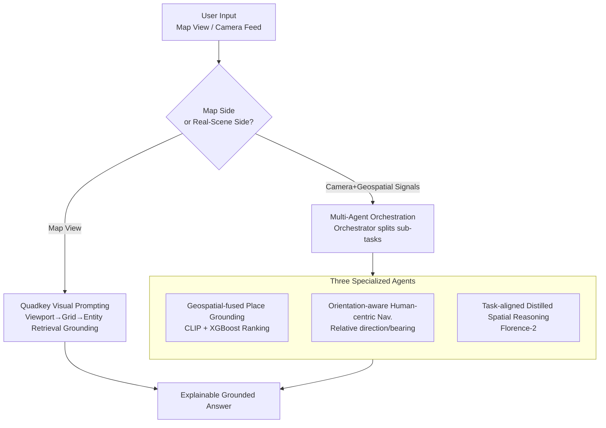

# IMAIA: Interactive Maps AI Assistant for Travel Planning and Geo-Spatial Intelligence

**Conference**: CVPR 2026  
**Paper**: [CVF Open Access](https://openaccess.thecvf.com/content/CVPR2026/html/Deng_IMAIA_Interactive_Maps_AI_Assistant_for_Travel_Planning_and_Geo-Spatial_CVPR_2026_paper.html)  
**Code**: None  
**Area**: Multi-Agent / Geo-Spatial Intelligence / Multimodal VLM  
**Keywords**: Interactive Maps, Multi-Agent Orchestration, Visual Prompting, Place Grounding, Model Distillation

## TL;DR
IMAIA unifies "desktop map viewing" and "real-scene navigation for the last 100 meters to the destination" into a framework coordinated by a lightweight multi-agent orchestrator: on the map side, a quadkey grid converts the viewport into structured visual prompts to enable viewpoint-conditioned reasoning for the VLM (improving place detection from <43% to ~90%); on the real-scene side, the orchestrator schedules three specialized agents for "Location Intelligence", "Interactive Navigation", and "Spatial Understanding", among which the distilled Florence-2 spatial reasoning module achieves an 84% accuracy while yielding a 7.3× speedup compared to the agent pipeline.

## Background & Motivation
**Background**: Modern map applications are essentially based on "point-and-click" interactions, where users pan, zoom, and issue limited, fixed queries. The rise of LLMs/VLMs makes "conversational, multimodal map assistants" possible, where models can convert vague requests into precise coordinates and describe images.

**Limitations of Prior Work**: Existing tools fail in two main scenarios. First, **viewpoint-conditioned queries on the map side**, such as "What is the name of the flower-shaped building next to the park in the top right that I am looking at?". Pure-text LLMs cannot provide spatial answers based on the current viewport, and general VLMs can describe images but lack explicit grounding with map states (viewport, zoom, nearby entities) and geographical signals (GPS coordinates, orientation, distance), making them fragile when encountering ambiguous visual cues. Second, **last-100-meter navigation and local exploration in real scenes**: standing in front of unfamiliar buildings, users need to link camera views with the surrounding geographical context, but travel planning, navigation, and local discovery are typically treated as isolated modules with awkward handovers.

**Key Challenge**: Map-based spatial reasoning, egocentric real-scene perception, and human-centric navigation occur continuously in real-world usage, yet they are processed in silos by current systems. At the same time, powerful spatial VLMs (such as ASMv2, SpatialVLM, SpatialRGPT) either suffer from high latency or are trained for benchmarks rather than embodied navigation tasks, preventing direct deployment.

**Goal**: To build an end-to-end, deployable interactive geospatial assistant that unifies three core capabilities: (1) map-centric spatial understanding, (2) camera-to-place grounding, and (3) human-centric, orientation-aware navigation.

**Key Insight**: Rather than relying on a single large model to solve everything, this work focuses on **system design**. Specifically, the map viewport is discretized into a quadkey grid to serve as structured visual prompting for the VLM; real-scene understanding is distributed to a multi-agent backend; and expensive spatial reasoning is distilled into a small model for real-time performance. Both the VLM and visual backends are hot-swappable, without altering overall system behavior.

**Core Idea**: Seamlessly integrate map exploration and camera-grounded last-100-meter navigation into a single model-agnostic framework using "quadkey visual prompting + multi-agent orchestration + task-aligned distillation".

## Method

### Overall Architecture
IMAIA consists of two interoperable components, supplemented by a lightweight multi-agent orchestration layer. **Maps Plus** handles desktop-style map interactions: it converts the current viewport into quadkey index grids, attaches visual and semantic properties to each tile, and forms structured visual prompts. This allows the VLM to perform viewpoint-conditioned reasoning on vector/satellite maps and ground answers via entity retrieval using geographic indexes (Azure Maps). **PAISA** (Places AI Smart Assistant) handles AR-style real-space interactions: centered around an orchestrator, it schedules three specialized agents—Location Intelligence (for location understanding and grounding), Interactive Navigation (for orientation-aware navigation), and Spatial Understanding (for spatial reasoning)—fusing camera streams with geographic signals like position, orientation, and distance to comprehend the scene and generate human-centric navigation. The entire architecture is modular, meaning swapping the VLM or visual backends does not alter the system's behavior.

### Key Designs

**1. Quadkey Visual Prompting: Converting Map Viewports into Structured Spatial Prompts for VLMs**

The core challenge lies in the fact that when a VLM directly views a map screenshot to perform viewpoint-conditioned queries (such as "What is the name of the lake in the top right?"), locate accuracy relies purely on guesswork due to the lack of explicit spatial indices. Maps Plus tackles this by first determining the geographical focus and zoom level of the user's current view, and then mapping the viewport onto a **quadkey index grid** overlaid on a simplified map. Each quadkey tile is treated as a structured element in the visual prompt fed to the multimodal LLM, allowing the model to identify which tiles contain salient entities like roads, parks, or bodies of water. This quadkey discretization binds detected entities to precise spatial coordinates on the map, enabling tile-level spatial correlation analysis. Complex layouts are carved into manageable units, allowing indicative spatial terms like "top right" to be mapped to specific tiles. Finally, geographic entities (e.g., Bonnet Lake, Abi's Park) are retrieved within the specified region using the Azure Maps API, and the detected entities are appended back to the user query and re-fed into GPT-4o for contextual reasoning, producing an accurate answer. This pipeline requires no LLM fine-tuning, relying solely on "injecting retrieved geographic entities into the LLM context + breaking down queries into sub-questions," which raises POI detection accuracy from <43% to 89.83%.

**2. Multi-Agent Orchestration: Combining Fragmented 'Search-Compare-Navigate' Steps into an End-to-End Command**

Modern map applications perform poorly when addressing user-centric queries like "Find the closest bubble tea shop"—users must manually search, sort by distance, and select navigation through several discrete steps. The PAISA backend addresses this through a multi-agent system: an **orchestrator** first analyzes and breaks down the query into simpler sub-queries, routes them to the **location intelligence agent** to retrieve candidate entities and attributes, passes this enriched information to the **navigation agent** to generate optimal routes, and finally returns the navigation plan to the orchestrator to deliver to the user. The paper emphasizes that this is not LLM hallucination—the system's internal decision-making can be audited (searching for entities in the target area, calculating user-to-candidate distance, and sorting by distance, e.g., "Boba Express" wins because it is the closest at 1.6 miles), ensuring grounded and explainable reasoning. Each agent is driven by an LLM and equipped with a set of functional tools, dividing the responsibility for the three capability targets identified in the framework.

**3. Geospatial-Fused Place Grounding + XGBoost Re-ranking: Directing 'Camera Shots' to Real-World Venues**

Relying solely on image-text similarity or distance is unreliable. The location intelligence agent encodes the user's camera image using a CLIP visual encoder and encodes candidate places with a structured descriptor ("name + category + coordinates") using a CLIP text encoder. It then constructs a feature vector containing: (i) the cosine similarity between the image and place embeddings, (ii) the distance from the user to the place, and (iii) an **orientation consistency term**—the absolute angular difference between the user device's compass heading and the "user-to-place" bearing. Local popularity priors derived from Azure Maps search activity are added as data quality signals. These features are fed into an **XGBoost ranking model** to score relevance and re-rank the initial candidate set. The top candidates are then passed to the downstream LLM agent to provide a compact, high-recall context. Learning these four signals together ("looks similar + close by + facing it + locally popular") is far more robust than relying on any single signal, showing the most significant gains in Top-3 Recall.

**4. Orientation-Aware Human-Centric Navigation: Solving the Last 100 Meters with Relative Directions Instead of Rigid Turn-by-Turn Instructions**

Traditional turn-by-turn (TBT) navigation follows map topologies and predefined road graphs, which often introduces detours, whereas pedestrians tend to cross plazas and take shortcuts. Aiming at the last 100 meters, the navigation agent (INA) computes the **bearing** using the user's coordinates, orientation, and target destination coordinates:

$$\theta = \arctan\!\big(\sin(\Delta\lambda)\cdot\cos(\phi_2),\ \cos(\phi_1)\cdot\sin(\phi_2) - \sin(\phi_1)\cdot\cos(\phi_2)\cdot\cos(\Delta\lambda)\big)$$

where $\phi_1,\phi_2$ represent the latitudes of the user and the destination, respectively, and $\Delta\lambda=\lambda_2-\lambda_1$ is the difference in longitude. The bearing is adjusted using the user's orientation $\alpha$ into a relative direction: $\text{Relative Direction} = \theta - \alpha$, which is normalized into a compass-friendly $0\text{–}360°$ range. The AR interface overlays a circular compass to draw a red arrow pointing toward the destination (relative to the green True North arrow) in real time; users can navigate simply by following the guidance in their first-person camera view. It can also trigger street-view previews of the destination. This orientation-aware guidance aligns better with natural human spatial cognition than fixed-path navigation, significantly reducing detours in testing.

**5. Task-Aligned Distilled Spatial Reasoning: Distilling GPT-4o into Florence-2 for Real-Time Performance**

Existing spatial VLMs are either slow or misaligned with fine-grained urban cues. The spatial understanding agent employs a three-stage pipeline to **distill GPT-4o into Florence-2**: in stage (i), GPT-4o-mini extracts candidate key entities from 40k street view images and keeps the most frequent elements as prominent landmarks; in stage (ii), YOLO-World and Depth Anything V2 provide 2D bounding boxes and depth cues, while GPT-4o generates paired spatial relations using Set-of-Mark style prompting; in stage (iii), each annotated image is paired with diverse spatial relation queries reflecting real-world urban navigation needs to form a supervised instruction-tuning set, which is used to fine-tune Florence-2 in a dense captioning format. This yields a compact, fast spatial reasoning module. Given a single street view image, the agent extracts salient objects (signs, facades, structural features) and their spatial relations (scene graphs or natural language) to support two system features: generating relational descriptions when retrieving destination-side street view cache ("The café entrance is to the left of the red awning") to help users confirm their location; and converting user-uploaded photos into structured spatial records for downstream grounding, matching, and disambiguation. This bidirectional spatial grounding on both the destination and user sides enhances the explainability and reliability of last-mile navigation.

## Key Experimental Results

### Main Results
**POI Detection Accuracy in Maps Plus**: Evaluated on 4,300 synthetic queries generated by GPT-4o (e.g., "What is the lake in the top left of the map?") using POIs within a 20 km radius of downtown across 10 US cities, tested on the same LLM backbone without fine-tuning.

| Method | POI Detection Accuracy |
|------|----------------|
| Single Model (query + map screenshot only) | 39.30% |
| Model + Location (with GPS coordinates) | 41.46% |
| Model + Verbose Location (with city/landmark descriptions) | 42.74% |
| **Maps Plus (quadkey visual prompting + entity grounding)** | **89.83%** |

**Spatial Understanding Module (Distilled Florence-2)**: Evaluated on a test set of 400 street view images, using o1 as the LLM-as-judge.

| Baselines | Accuracy / Metrics | Ours (Distilled Model) |
|----------|------------|--------------|
| Florence-VL 8B (~10× parameter general multimodal LLM) | 27% accuracy | **84%** accuracy |
| ASM v2 (Scene graph model) | Avg. ~4 objects per scene | Avg. ~7 objects |
| Agent Pipeline (V100 32GB) | 12.4s / image | **1.7s / query (7.3× speedup)** |

### Ablation Study
**Place Candidate Ranking (XGBoost ranker)**: Trained on 500 image queries, with 50 held out for evaluation.

| Ranking Method | P@Top-1 | R@Top-1 | P@Top-3 | R@Top-3 |
|----------|---------|---------|---------|---------|
| **XGBoost Ranker** | **80.4%** | **72.5%** | **36.2%** | **92.8%** |
| Distance-only | 76.1% | 69.2% | 30.4% | 77.5% |
| Similarity-only | 65.2% | 58.3% | 25.4% | 68.1% |

**Human-Centric Navigation vs. TBT Walking Navigation** (measured against standard TBT runtime on 10 last-100-meter scenarios, with 4 requiring turns and the destination being invisible, and 6 visible but subject to temporary occlusion):

| Scenario | TBT Walking Time | Human-Centric Time | % of TBT |
|------|-------------|-------------|--------|
| Needs Turn (Destination Invisible) | 3.28 min | 2.08 min | 63.5% |
| Directly Visible | 3.36 min | 1.07 min | 32.1% |

### Key Findings
- **Grounded data injection is the primary factor for Maps Plus's performance gain**: Feeding coordinates or place names alone to the LLM yielded only a ~2-3% improvement. In contrast, injecting retrieved geographical entities into the context and decomposing queries into sub-questions doubled the accuracy to ~90%, demonstrating that structured spatial grounding is vastly more effective than merely stacking location texts.
- **Task-aligned distillation overperforms scaling parameters**: Achieving 84% accuracy compared to Florence-VL 8B's 27% suggests that a small model fine-tuned on task-aligned distilled data can outperform a general VLM containing nearly 10× more parameters. Additionally, the 7.3× speedup (1.7s vs. 12.4s) is critical for implementing real-time navigation.
- **The XGBoost ranker brings the largest gain in Top-3 Recall** (92.8% vs. 77.5% for distance-only). This suggests that integrating multiple signals primarily improves the coverage of early candidate retrieval without sacrificing Top-1 precision.
- **Human-centric navigation yields larger gains in visible scenarios** (taking only 32.1% of TBT navigation time). This is because TBT is constrained by road network topologies and forces detours, whereas direct orientation guidance allows pedestrians to take straight paths.

## Highlights & Insights
- **Using quadkeys as visual prompts** is the most ingenious design: maps already possess a mature, native quadkey tile indexing system. Reusing it directly as structured grid prompts for the VLM enables spatial anchor terms like "top right" to be mapped to precise coordinates with virtually zero extra modeling—seamlessly borrowing established geospatial infrastructure for multimodal reasoning.
- **Leveraging explainability as a key selling point**: The paper dedicates analysis to proving that PAISA's responses are not hallucinations (demonstrating its internal decision chain: e.g., sorting candidates by distance and resolving that "Boba Express" is selected because it is closest at 1.6 miles). For user-facing assistant systems, such auditable reasoning paths are more crucial than raw accuracy.
- **Model-agnostic modularity** is highly transferable: The VLM and visual backends are hot-swappable without changing system behaviors. This ensures that the overall system automatically benefits from future iterations of foundational models. This "system-first, model-supporting" design philosophy is highly replicable for other multimodal assistants.
- **The orientation consistency term** is a highly practical feature: treating the angular difference between "user device heading vs. user-to-place bearing" as a ranking feature encodes the physical intuition of whether a user is "actually facing" the venue. This is a crucial cue that pure image-text similarity cannot capture.

## Limitations & Future Work
- **Small-scale and highly synthetic evaluation**: The POI detection uses synthetic queries generated by GPT-4o, the navigation is tested on only 10 scenarios, spatial understanding uses 400 images, and ranking is evaluated on a held-out set of 50. Coupled with informal feedback from only ~15 participants, this resembles an engineering proof-of-concept rather than a rigorous large-scale benchmark, casting doubt on its generalizability.
- **Heavy reliance on closed-source/commercial components**: The tight integration of GPT-4o, Azure Maps, CLIP, YOLO-World, and Depth Anything creates high reproduction barriers, and the quality of the commercial geographic index directly caps the system's grounding capabilities.
- **"Accuracy" measured via LLM-as-judge (o1)** for verifying spatial descriptions may introduce evaluation biases; hence, the 84% accuracy figure should be taken with a grain of salt (⚠️ please refer to the original paper for precise evaluation details).
- **Bearing-based navigation assumes reliable device orientation**: Phone compasses frequently drift in urban canyons or under magnetic interference, which can cause relative direction failures—the exact environments where last-100-meter guidance is most needed. The paper does not thoroughly discuss this robustness challenge.
- **Future Work**: Unifying distilled spatial reasoning with the map-side quadkey visual prompting into a shared representation, introducing online learning to update local popularity priors, and using real-world user trajectories instead of synthetic queries for large-scale evaluation.

## Related Work & Insights
- **vs. Geospatial LLM works (map search / conversational retrieval)**: Previous studies have shown that LLMs can answer queries like "What attractions are in X" using internal memory or external tools. However, they rarely address the interface challenge of "how to efficiently feed existing geographic indexing system outputs into LLMs." IMAIA's quadkey visual prompting + entity injection directly bridges this gap.
- **vs. Spatial VLMs (ASMv2 / SpatialVLM / SpatialRGPT)**: These models enhance spatial reasoning through synthetic spatial Q&A, scene graphs, and metric distance estimation. However, they suffer from high latency and are trained for benchmarks rather than embodied tasks. IMAIA's distilled Florence-2 trading generalizability for a 7.3× speedup and task-alignment makes it far more viable for real-time navigation deployment.
- **vs. Traditional TBT Navigation**: TBT navigation strictly follows road network topologies, causing detours. IMAIA's orientation-aware human-centric guidance calculates relative directions using the first-person camera and device orientation, closely mimicking natural pedestrian shortcuts.

## Rating
- Novelty: ⭐⭐⭐⭐ The system combination of quadkey visual prompting + multi-agent geographic assistant is practical, though individual components are largely engineering integrations of existing technologies.
- Experimental Thoroughness: ⭐⭐⭐ While each module includes comparative baselines with distinct improvements, the evaluation dataset is small, contains synthetic queries, and relies on LLM-as-judge, resembling a demo-level validation.
- Writing Quality: ⭐⭐⭐⭐ The three-tier capability structure is clear, diagrams complement the text well, and the explainability arguments are solid.
- Value: ⭐⭐⭐⭐ Provides an interactive map experience oriented towards real-world deployment, offering strong guidelines for engineering implementation and productization.

<!-- RELATED:START -->

## Related Papers

- [\[CVPR 2026\] WRIVINDER: Towards Spatial Intelligence for Geo-locating Ground Images onto Satellite Imagery](wrivinder_towards_spatial_intelligence_for_geo-locating_ground_images_onto_satel.md)
- [\[CVPR 2026\] RoadGIE: Towards A Global-Scale Aerial Benchmark for Generalizable Interactive Road Extraction](roadgie_towards_a_global-scale_aerial_benchmark_for_generalizable_interactive_ro.md)
- [\[CVPR 2026\] Orthogonal Spatial-Aware Multi-View Anchor Graph Clustering for Incomplete Remote Sensing Data](orthogonal_spatial-aware_multi-view_anchor_graph_clustering_for_incomplete_remot.md)
- [\[ICML 2025\] MapEval: A Map-Based Evaluation of Geo-Spatial Reasoning in Foundation Models](../../ICML2025/remote_sensing/mapeval_a_map-based_evaluation_of_geo-spatial_reasoning_in_foundation_models.md)
- [\[CVPR 2026\] NeighborMAE: Exploiting Spatial Dependencies between Neighboring Earth Observation Images in Masked Autoencoders Pretraining](neighbormae_exploiting_spatial_dependencies_between_neighboring_earth_observatio.md)

<!-- RELATED:END -->
