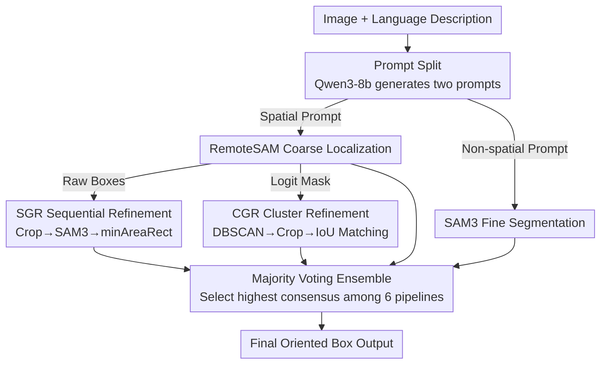

# Improving Visual Grounding in Remote Sensing via Cluster-Guided Refinement and Model Ensemble Voting

**Conference**: CVPR 2026  
**arXiv**: [2606.00556](https://arxiv.org/abs/2606.00556)  
**Code**: https://github.com/PanavShah1/LG-SAM (Available)  
**Area**: Remote Sensing Visual Grounding / Segmentation / Model Ensemble  
**Keywords**: Visual Grounding, Remote Sensing Imagery, RemoteSAM, SAM3, DBSCAN Clustering, Majority Voting Ensemble

## TL;DR
Addressing the individual shortcomings of visual grounding models in remote sensing, this paper chains the specialized RemoteSAM and the general segmentation model SAM3 into two refinement pipelines (SGR/CGR). These, along with other models, are integrated using a majority voting formula that considers spatial consistency and differences in the number of detected boxes. The resulting ensemble achieves a higher mIoU than any single model on VRS Bench and NWPU-VHR-10.

## Background & Motivation

**Background**: Visual Grounding identifies specific regions in an image based on natural language descriptions, serving as a key component for interpretable vision systems. In remote sensing, several strong models have recently emerged, such as RemoteSAM (specialized for remote sensing with language-conditioned segmentation), SAM3 (a general strong segmentation backbone), EarthMind, and Falcon.

**Limitations of Prior Work**: Specific challenges in remote sensing include cluttered backgrounds, extreme object scale variance, and multiple similar-looking targets in a single image. Existing models have structural weaknesses: RemoteSAM is proficient at "locating the general area" but produces coarse, fragmented outputs with overlapping boxes for single targets; SAM3 generates high-quality masks but fails to localize accurately in large, complex images—its mIoU on VRS Bench is only 0.1635, making it almost unusable on its own. EarthMind and Falcon also involve trade-offs.

**Key Challenge**: Localization capability ("where") and segmentation quality ("boundaries") are scattered across different models; no single model masters both. Furthermore, the diversity of remote sensing scenarios makes a "one-model-fits-all" approach impractical.

**Goal**: (1) Complementarily combine models strong in localization with those accurate in segmentation; (2) Suppress redundant segmentations caused by RemoteSAM's fragmented boxes; (3) Use an ensemble to prevent single-model failure and improve robustness.

**Key Insight**: Instead of training new models, the authors treat existing models as composable "capability blocks." They stitch their strengths together during the inference phase using pipelines and voting—a low-cost, plug-and-play approach that benefits directly from future upgrades of the base models.

**Core Idea**: Utilize RemoteSAM for coarse localization and SAM3 for refinement, then integrate multiple complementary pipelines through a "consensus-seeking" majority vote for the final output.

## Method

### Overall Architecture
The paper presents two separate refinement pipelines and one ensemble layer. Both pipelines share a "Prompt Split" frontend: Qwen3-8b rewrites the original user description into two prompts—a version retaining spatial information for RemoteSAM's coarse localization, and a version stripped of spatial cues, keeping only target categories, for SAM3's fine segmentation. The difference lies in how RemoteSAM's output is used: **SGR** directly uses each RemoteSAM candidate box to crop images for sequential refinement by SAM3; **CGR** distrusts raw boxes and instead applies DBSCAN clustering to RemoteSAM's logit mask to obtain cleaner candidate regions, followed by SAM3 segmentation and IoU matching. Finally, **Majority Voting** aggregates predictions from six pipelines (RemoteSAM, SAM3, EarthMind, Falcon, SGR, CGR), scoring them based on "consistency with others" to select the best final output.

### Key Designs

**1. Prompt Split: Directing models to preferred prompts**

Providing the original description to both models is sub-optimal—RemoteSAM requires spatial cues like "the yellow car on the left" for localization, whereas SAM3's segmentation quality can degrade when processing high-level directional language. Qwen3-8b rewrites the query into two versions: the first retains spatial/directional information (e.g., "the yellow car on the left side of the road") for RemoteSAM; the second strips all spatial terms (e.g., "yellow car") for SAM3 to use with local crops. This allows RemoteSAM to focus on "where" while SAM3 focuses on "boundary precision" without interference from high-level spatial language.

**2. SGR Sequential Refinement: Narrowing search space for SAM3**

SAM3 fails to localize on large images due to the massive search space and background noise. SGR uses RemoteSAM to produce oriented candidate boxes for a query, crops these areas from the original image, and feeds them to SAM3. Local cropping reduces interference and constrains the search space, enabling SAM3 to segment precise boundaries on focused inputs. The SAM3 mask is converted back to an oriented box via thresholding, connected component extraction, and OpenCV's `minAreaRect`. This is essentially a "Coarse Localization Crop → Fine Segmentation → Box Conversion" serial chain.

**3. CGR Cluster Refinement: Replacing fragmented boxes with Logit Mask + DBSCAN**

The weakness of SGR is its reliance on RemoteSAM's raw boxes, which are often fragmented or redundant for a single target, forcing SAM3 to process multiple overlapping areas. CGR ignores the boxes and uses RemoteSAM's segmentation logit mask instead, which provides dense pixel-level information regarding spatial structure. DBSCAN clustering is applied to this mask to merge spatially close, dense pixels into coherent segments while discarding isolated noise, filtering out fragmented predictions. Each cluster is cropped (with extra padding) and segmented by SAM3; since a crop might contain other targets, IoU is calculated between each SAM3 mask and the original cluster points to select the highest matching mask as the final output.

**4. Majority Voting Ensemble: Selecting the most reliable pipeline via consensus and box count consistency**

Since single pipelines can fail, the authors use an ensemble. Rather than a brute-force merge of boxes (which is difficult for heterogeneous predictions), they **select** the most reliable pipeline: for each pipeline $i$, consensus with all other pipelines $j$ is calculated. Spatial consistency is measured by the average IoU of best-matched box pairs; additionally, differences in box counts are considered—extreme variances often indicate noise or misses—applying an exponential penalty to the score:

$$\text{score}[i] = \sum_{j\neq i}\exp\!\big(-\lambda\,|\text{boxes}(i)-\text{boxes}(j)|\big)\cdot \text{IoU}(i,j),\qquad i^{*}=\arg\max_i\ \text{score}[i]$$

The pipeline with the highest $\text{score}$ is selected. The intuition is that a prediction aligning with multiple independent models and having a reasonable box count is more likely to be correct.

### A Case Example: CGR running one query

Input: "the yellow car on the left side of the road." Qwen3-8b splits this into a spatial prompt for RemoteSAM and "yellow car" for SAM3. RemoteSAM generates a logit mask where the yellow car region is a cluster of high-response pixels with surrounding noise. DBSCAN clusters these pixels and discards the noise. The cluster is cropped and sent to SAM3, which segments several candidate masks in the crop. The mask with the highest IoU relative to the cluster points is chosen and fitted as an oriented box. Unlike SGR, which might process 2-3 overlapping fragments, CGR processes one clean candidate, avoiding redundancy.

## Key Experimental Results

Datasets: **VRS Bench** (29,614 images, 52,472 referring annotations) and **NWPU-VHR-10** (800 images, 10 classes, high resolution, many small targets). Metrics: mIoU, Acc@0.5, Acc@0.7, and Avg Cnt Diff (closer to 0 is better).

### Main Results (VRS Bench)

| Model / Combination | mIoU | Acc@0.5 | Acc@0.7 |
|------|------|---------|---------|
| RemoteSAM (Strongest baseline) | 0.6283 | 0.7812 | 0.3931 |
| SAM3 (Fails alone) | 0.1635 | 0.2051 | 0.0887 |
| EarthMind | 0.5961 | 0.7414 | 0.3732 |
| Falcon | 0.5802 | 0.7221 | 0.4709 |
| **CGR (Ours, single pipeline)** | 0.6315 | 0.7807 | 0.3909 |
| SGR (Ours, single pipeline) | 0.5671 | 0.6827 | 0.3303 |
| RemoteSAM + SGR + Falcon (Voting) | **0.6430** | **0.7978** | 0.4217 |
| Full 6-pipeline Majority Voting | **0.6494** | 0.7928 | 0.4121 |

Key findings: The CGR single pipeline (0.6315) slightly outperforms the strongest single model RemoteSAM (0.6283). Full 6-pipeline voting reaches the highest mIoU of 0.6494. Although SAM3 alone is poor (mIoU 0.1635), it contributes positively when integrated into the pipeline.

### Main Results (NWPU-VHR-10)

| Model / Combination | mIoU | Acc@0.5 | Acc@0.7 |
|------|------|---------|---------|
| RemoteSAM | 0.5662 | 0.6624 | 0.2484 |
| SAM3 | 0.5009 | 0.6352 | 0.1683 |
| CGR (Ours) | 0.5719 | 0.6953 | 0.2686 |
| **RemoteSAM + SAM3 + CGR (Voting)** | **0.6321** | 0.7219 | **0.4051** |
| Full 6-pipeline Majority Voting | 0.6031 | 0.7293 | 0.3329 |

Key findings: On NWPU with dense small targets, the three-model vote (RemoteSAM + SAM3 + CGR) significantly outperforms any single model. Acc@0.7 increases from 0.27 to 0.41, showing that CGR's clustering refinement yields the highest gains at high-precision thresholds.

### Key Findings
- **Complementary Assembly is Effective**: SAM3, despite its poor standalone performance, becomes a useful component for refining accuracy once the search space is constrained by RemoteSAM.
- **CGR > SGR**: Using logit mask + DBSCAN clustering consistently outperforms raw boxes on both datasets, confirming that box fragmentation is the primary bottleneck for SGR.
- **No Universal Best Combination**: Full voting is best for VRS, but a three-model subset is better for NWPU. Including weaker models in the pool can sometimes dilute consensus, suggesting that optimal ensembles may be dataset-dependent.

## Highlights & Insights
- **Training-free Capability Stitching**: Gains come entirely from inference-time pipelines and voting. It requires no new training and can immediately utilize upgrades to base models—a highly practical engineering approach.
- **Logit Mask Clustering**: Using logit masks instead of discrete boxes is clever. Logit masks provide dense spatial signals, allowing DBSCAN to merge targets and discard noise more naturally than NMS at the box level.
- **Weighted Voting Formula**: The exponential penalty for box count differences explicitly encodes "unusual box counts = potential noise" into the scoring, which is transferable to other multi-detector consensus scenarios.

## Limitations & Future Work
- **Selection Over Fusion**: Majority voting selects a single pipeline rather than fusing local complementary advantages of multiple models; if every pipeline is wrong for a query, voting cannot fix it.
- **Dependency on External LLM**: Qwen3-8b’s rewriting quality directly impacts inputs. The gain from "split vs. original prompt" is not fully ablated, and LLM failure rates are not reported.
- **Sensitive Hyperparameters**: DBSCAN parameters, $\lambda$, and CGR padding are manually tuned. The balance between "separating adjacent objects" and "de-fragmentation" lacks a systematic sensitivity study.
- **Ensemble Plasticity**: The optimal ensemble pool varies by dataset, indicating a lack of an adaptive pool selection mechanism.
- **Inference Cost**: Running multiple large models for one query entails high latency and low throughput, questioning the cost-efficiency of large-scale deployment.

## Related Work & Insights
- **vs. RemoteSAM**: RemoteSAM has strong localization but fragmented boxes and coarse boundaries. Ours uses its logit mask for better clustering and delegates boundary refinement to SAM3.
- **vs. SAM3**: SAM3 is accurate but localizes poorly on large images. Ours uses RemoteSAM to crop local patches, allowing SAM3 to focus on its strength.
- **vs. EarthMind / Falcon**: These models are treated as peers in the voting pool to guard against individual failure modes through consensus.
- **vs. Direct Output Merging**: Instead of complex heterogeneous box alignment/NMS, "selecting the consensus pipeline" is a lighter and more effective integrated paradigm.

## Rating
- Novelty: ⭐⭐⭐ No new training, but the "logit mask + DBSCAN" and "box-count penalized voting" are clever integration strategies.
- Experimental Thoroughness: ⭐⭐⭐ Solid comparisons across two datasets, though missing ablations on prompt splitting and latency.
- Writing Quality: ⭐⭐⭐⭐ Clear motivation, complete tables, and well-defined notation.
- Value: ⭐⭐⭐⭐ High practical value for engineering-ready fusion of off-the-shelf remote sensing grounding models.

<!-- RELATED:START -->

## Related Papers

- [\[CVPR 2026\] GeoViS: Geospatially Rewarded Visual Search for Remote Sensing Visual Grounding](geovis_geospatially_rewarded_visual_search_for_remote_sensing_visual_grounding.md)
- [\[CVPR 2026\] SegEarth-R2: Towards Comprehensive Language-guided Segmentation for Remote Sensing Images](segearth-r2_towards_comprehensive_language-guided_segmentation_for_remote_sensin.md)
- [\[CVPR 2026\] Local Precise Refinement: A Dual-Gated Mixture-of-Experts for Enhancing Foundation Model Generalization against Spectral Shifts](local_precise_refinement_a_dual-gated_mixture-of-experts_for_enhancing_foundatio.md)
- [\[CVPR 2026\] ORSATR-X: A Foundation Model based on Differential-and-Excitation Networks for Optical Remote Sensing Object Recognition](orsatr-x_a_foundation_model_based_on_differential-and-excitation_networks_for_op.md)
- [\[CVPR 2026\] VLM4RSDet: Collaborative Optimization with Vision-Language Model for Enhancing Remote Sensing Object Detection](vlm4rsdet_collaborative_optimization_with_vision-language_model_for_enhancing_re.md)

<!-- RELATED:END -->
