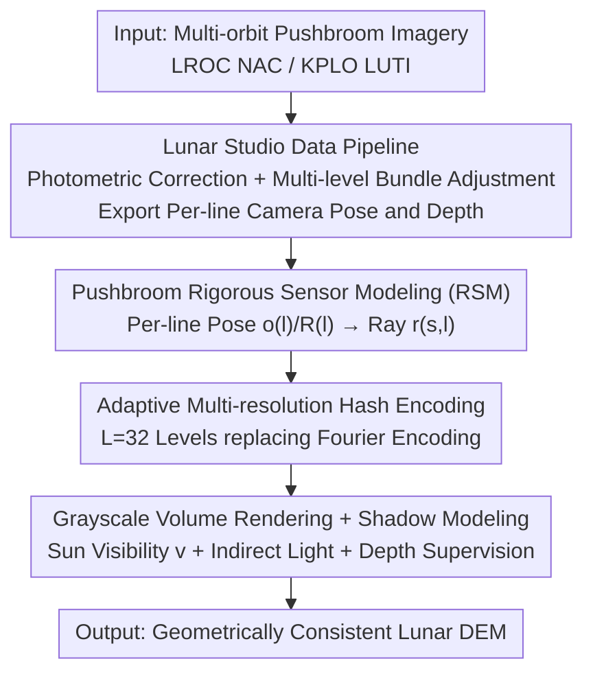

# LNEM: Lunar Neural Elevation Model

**Conference**: CVPR 2026  
**Paper**: [CVF Open Access](https://openaccess.thecvf.com/content/CVPR2026/html/Lee_LNEM_Lunar_Neural_Elevation_Model_CVPR_2026_paper.html)  
**Code**: https://viewlab-group.github.io/LNEM/ (Project Page)  
**Area**: Remote Sensing / Planetary Mapping / Neural Volume Rendering  
**Keywords**: Lunar DEM, Pushbroom Camera, Rigorous Sensor Model, Neural Volume Rendering, Shadow Modeling

## TL;DR
The first lunar DEM reconstruction framework to explicitly embed a pushbroom camera's Rigorous Sensor Model (RSM) into neural volume rendering. It is accompanied by the Lunar Studio data pipeline, which generates geometrically consistent inputs from raw orbital imagery to reconstruct high-fidelity lunar elevation models under multi-sensor and multi-illumination conditions.

## Background & Motivation
**Background**: One of the most critical tasks in planetary exploration is generating Digital Elevation Models (DEM) from satellite imagery. Lunar DEMs are directly related to landing site selection, rover navigation, and geological mapping. The traditional approach involves photogrammetric pipelines using stereo matching on overlapping images.

**Limitations of Prior Work**: (1) Traditional stereo matching struggles in **textureless regions** and with **pushbroom geometry**—where the pushbroom camera scans line-by-line, changing its pose for every line, which breaks epipolar constraints and complicates correspondence searching; (2) Cross-orbit lighting variations violate the brightness consistency assumption in stereo matching, and terrain registration often requires LOLA laser altimeter correction; (3) Recent NeRF-based methods applied to the Moon almost entirely use simple **pinhole cameras** or Rational Polynomial Coefficients (RPC) to approximate the pushbroom camera, failing to faithfully capture true lunar 3D geometry; (4) The entire satellite imagery pipeline suffers from geometric mismatches, distribution bias, and heavy manual preprocessing.

**Key Challenge**: Neural volume rendering can reconstruct high-fidelity geometry, but its standard assumption is a "static pinhole camera." Conversely, lunar orbital imagery is essentially "pushbroom imaging with per-line pose variations + sparse viewpoints + extreme lighting." These two imaging models do not align. Furthermore, there is a lack of a standardized lunar dataset that is geometrically consistent and suitable for neural rendering.

**Goal**: To truly adapt neural volume rendering to lunar pushbroom imaging—requiring correct per-line sensor geometry while handling grayscale imagery, low albedo contrast, sparse views, and intense lighting variations.

**Key Insight**: Rather than using pinhole/RPC approximations, the **Rigorous Sensor Model (RSM)** is embedded directly into the volume rendering. This involves modeling the camera position, orientation, and illumination line-by-line, allowing each camera ray to march through a learnable 3D volume.

**Core Idea**: LNEM = Pushbroom RSM Volume Rendering + Lunar Shadow Modeling + Adaptive Hash Encoding + Depth Supervision. This is supported by Lunar Studio, which integrates fragmented ISIS3/ASP toolchains into a standardized pipeline that exports per-line camera rotations and depths.

## Method

### Overall Architecture
LNEM feeds "pushbroom lunar imagery with per-line pose variations" into volume rendering to reconstruct a geometrically consistent DEM. The entire workflow is as follows: raw multi-orbit images first enter Lunar Studio for photometric correction + multi-level bundle adjustment, exporting per-line camera poses and ground-truth depth. Then, using pushbroom RSM, each pixel $(s,l)$ is converted into a ray with a per-line origin and direction. Ray sampling points are encoded into the network via adaptive multi-resolution hash encoding. Finally, a continuous elevation field is optimized using grayscale volume rendering + shadow modeling + depth supervision. The input consists of multi-orbit NAC/LUTI pushbroom images, and the output is a geometrically consistent lunar DEM.

Unlike the "image-to-depth" paradigm that trains a single network to generalize across many images, LNEM optimizes a **voxel implicit representation**. It encodes the DEM into network weights as a continuous "coordinate → density" function. This non-linearly fuses heterogeneous orbital observations in a unified coordinate system, remains robust to illumination and albedo changes, and is more memory-efficient than explicit elevation grids.

### Key Designs

**1. Lunar Studio: Integrating Fragmented ISIS3/ASP Toolchains into a Standardized Pipeline**

This addresses the "geometric mismatch + distribution bias + manual preprocessing" pain points. Existing ISIS3/ASP tools are powerful but fragmented, and they do not explicitly output key intermediate products like camera rotation matrices, making large-scale consistent processing difficult. Lunar Studio integrates necessary operations into an end-to-end pipeline: it first performs radiometric correction (removing detector bias/dark current, flat-field normalization), followed by photometric correction using an empirical reflectance model fitted from over 760,000 NAC tiles. Geometric consistency is achieved via **multi-level bundle adjustment**—using SLDEM2015 as a shape model to initialize SPICE geometry, refining multi-image control networks, and running Jigsaw, which significantly improves cross-orbit registration. Finally, it exports per-line camera rotations and ground-truth camera depths for downstream neural rendering. It also includes a region → site → image three-tier dataset hierarchy, all co-registered to a unified geodetic coordinate system.

**2. Pushbroom Rigorous Sensor Modeling: Per-line Pose and Ray Calculation**

This is the core of the paper, addressing the "NeRF defaults to pinhole and fails to match pushbroom geometry" issue. In a pinhole camera, all pixels share a single projection center. In a pushbroom camera, however, each scanning line is captured at a different time with its own camera position and orientation. For each pushbroom line $l\in\{0,\dots,n\}$, the ephemeris time is $t_l = t_0 + l\,\Delta t$ (where $\Delta t$ is the line exposure duration). The camera center $\mathbf{o}(l)$ is taken from the spacecraft position in the SPK kernel at $t_l$ (Moon Fixed Coordinate System MOON_ME). The rotation from the camera to the Moon $\mathbf{R}_{\mathrm{C2M}}(l)$ is derived from CK/FK kernels following SPICE conventions, yielding per-line poses. Given a pixel $(s,l)$, the line-of-sight direction in the camera frame first converts sample coordinates to focal plane coordinates, applies distortion correction to get $(x_u,y_u)$, and then normalizes: $\mathbf{d}(s)=\frac{(x_u,y_u,-f)}{\sqrt{x_u^2+y_u^2+f^2}}$. The full ray is $\mathbf{r}(s,l)=\mathbf{o}(l)+\lambda\,\mathbf{R}_{\mathrm{C2M}}(l)\,\mathbf{d}(s)$, where $\lambda\ge0$ is depth. This per-line RSM allows volume rendering to bypass the failure of epipolar constraints in stereo matching.

**3. Adaptive Multi-resolution Hash Encoding: Replacing Problematic Fourier Positional Encoding**

Standard fixed Fourier feature encoding requires manual per-site tuning of high frequencies for lunar pushbroom imagery, leading to slow convergence and inaccurate geometry. LNEM switches to multi-resolution hash encoding: mapping grid corners to trainable entries shared across $L$ levels, concatenating interpolated features $\mathbf{y}(\mathbf{x})=(\mathbf{y}_1(\mathbf{x}),\dots,\mathbf{y}_L(\mathbf{x}))$, and feeding them into an MLP. The authors use $L=32$ levels (twice the default) to capture fine-scale geometric variations, resulting in more stable convergence and sharper reconstructions—with a fixed set of parameters working across all sites without per-site tuning.

**4. Grayscale Volume Rendering + Shadow Modeling + Depth Supervision: Stabilizing Geometry**

This targets the "NAC provides only grayscale, low lunar albedo contrast, and sparse views" challenge. Volume rendering integrates radiance along the ray weighted by density: $\hat C(\mathbf{r})=\sum_i T_i(1-\exp(-\sigma_i\delta_i))\,c_i$. By replacing color $c_i$ with a single-band scalar, a radiance field can be learned from grayscale pixels. Shadow modeling draws from irradiance modeling in Earth satellites: using the solar azimuth/incidence angles from Lunar Studio to derive the solar direction $\boldsymbol\omega$, predicting solar visibility $v$ and indirect light $I_{\mathrm{ind}}$ for each sample point to modulate the base gray level: $c_i=c_{g,i}\big(v(\mathbf{x}_i,\boldsymbol\omega)+(1-v(\mathbf{x}_i,\boldsymbol\omega))\,I_{\mathrm{ind}}(\boldsymbol\omega)\big)$. A shadow correction loss aligns the solar ray transmittance $T_{\mathrm{SR},i}$ with the visibility: $\mathcal{L}_{\mathrm{SC}}=\sum_{\mathbf{r}}\sum_i (T_{\mathrm{SR},i}-v_i)^2$. Depth supervision uses the highest-resolution NAC DTM (falling back to SLDEM if missing) to provide ground-truth depth, which supplements geometric constraints for sparse views and provides a metric scale anchor to eliminate scale ambiguity in purely photometric training.

### Loss & Training
The total objective is $\mathcal{L}=\sum_{\mathbf{r}}\big\|\hat C(\mathbf{r})-C(\mathbf{r})\big\|_2^2 + w_{\mathrm{D}}\big\|\hat D(\mathbf{r})-D(\mathbf{r})\big\|_2^2 + w_{\mathrm{SC}}\,\mathcal{L}_{\mathrm{SC}}(\mathcal{R}_{\mathrm{SR}})$, representing grayscale photometric loss, depth supervision loss, and shadow correction loss, with weights $w_{\mathrm{D}}=300$ and $w_{\mathrm{SC}}=0.02$. For each camera ray, $N=512$ points are sampled, and $N_{\mathrm{SR}}=512$ points for solar rays. Optimization uses Adam (lr $5\times10^{-4}$, CosineAnnealing to $5\times10^{-6}$), with a batch of 1024 rays, training for 50k–100k steps per site, taking approximately 4–8 hours on a single RTX 4090.

## Key Experimental Results

### Main Results
The framework was evaluated on 8 NAC regions from Lunar Studio, using the LOLA laser altimeter as ground truth for elevation error (meters, lower is better). $\mathrm{RMSE}_{\mathrm{LOLA}}$ represents the raw error, while $\mathrm{RMSE}_{\mathrm{corr}}$ is the error after removing global vertical bias (reflecting local terrain shape fidelity). The table below compares debiased $\mathrm{RMSE}_{\mathrm{corr}}$:

| Region | LNEM (Ours) | Sat-NeRF | EO-NeRF | ASP Stereo |
| :--- | :--- | :--- | :--- | :--- |
| Apollo 15 | **1.565** | 39.196 | 58.386 | 3.103 |
| Apollo 17 | **1.228** | 24.169 | 29.824 | 1.986 |
| Tycho | **0.979** | 11.207 | 46.951 | 0.672 |
| Lacus Mortis Pit | **2.025** | 8.734 | 62.296 | 109.961 |
| Marius Hills Pit | 0.673 | 6.209 | 38.243 | 1.891 |

Across all 8 regions, LNEM's $\mathrm{RMSE}_{\mathrm{corr}}$ ranged from 0.67 to 5.67 m. EO-NeRF suffered from scale ambiguity due to lack of depth supervision, sometimes reconstructing pits as convex surfaces. Sat-NeRF included depth supervision but remained significantly less accurate than LNEM in most areas. ASP was competitive in regions with good geometric conditions (Apollo 16/Tycho) but failed catastrophically in Lacus Mortis Pit due to unstable triangulation on a narrow baseline ($\mathrm{RMSE}_{\mathrm{corr}}$ reaching 109.96 m).

### Ablation Study

| Configuration | Key Metric | Description |
| :--- | :--- | :--- |
| LNEM (with SM) | $\mathrm{RMSE}_{\mathrm{LOLA}}$ Tycho 2.117 / V.Schröteri 4.248 | Full model (with shadow modeling) |
| LNEM (without SM) | Tycho 3.886 / V.Schröteri 10.904 | Without shadow modeling; higher error in most regions |
| Hash Encoding (LNEM) | PSNR Apollo15 48.41 / Apollo17 48.39 | Adaptive multi-resolution hash encoding |
| Fourier Encoding (Opt. $M$) | PSNR Apollo15 29.01 / Apollo17 33.38 | Requires per-site $M$ tuning; inconsistent results |

### Key Findings
- **Shadow Modeling (SM) generally reduces error**: Improvements were significant across Apollo 15 (10.6→8.6), Tycho (3.89→2.12), V. Schröteri (10.90→4.25), and Marius Hills (1.53→0.68) (⚠️ although gains were unstable in a few regions like Apollo 16).
- **Hash encoding far outperforms Fourier encoding**: PSNR increased from ~29–33 to ~48, and a single set of parameters worked across all sites, eliminating the need for per-site high-frequency tuning.
- **Main error source is often global vertical bias**: The large gap between $\mathrm{RMSE}_{\mathrm{LOLA}}$ and $\mathrm{RMSE}_{\mathrm{corr}}$ indicates that much raw error comes from total offset. On KPLO LUTI, even after debiasing, Apollo 15 still had $\mathrm{RMSE}_{\mathrm{corr}}=29.07$ m, which the authors attribute to high pointing uncertainty in the reconstructed SPICE kernels (a data quality issue) rather than the method itself.
- **View count determines accuracy**: Sites with three views reached 0.67–3.69 m, while dual-view sites (Apollo 16/Eimmart A) rose to 4.10–5.67 m. Eimmart A had weaker geometric constraints due to large orbital altitude differences and low cross-track overlap.

## Highlights & Insights
- **Embedding the "Rigorous Sensor Model" directly into volume rendering**: This is the first work to implement per-line RSM volume rendering for lunar pushbroom imaging. It directly solves the fundamental mismatch between NeRF's pinhole assumption and pushbroom geometry, a concept applicable to any line-scan/pushbroom remote sensing sensor.
- **The data pipeline as a contribution**: Lunar Studio's integration of the ISIS3/ASP workflow and explicit export of per-line camera rotations + depth bridges the gap between "planetary remote sensing → learning-based reconstruction," offering high reuse value.
- **Honest evaluation using debiased RMSE**: reporting global vertical bias and local shape error separately (bias / $\mathrm{RMSE}_{\mathrm{corr}}$ / std) and identifying LUTI's errors as kernel-related demonstrates a rigorous approach to remote sensing reconstruction.

## Limitations & Future Work
- Reconstruction is a per-site optimization (training one implicit field per site for 4–8 hours), not a generalizable feed-forward model, making large-scale lunar coverage costly.
- Accuracy is strictly constrained by the number of input views and SPICE kernel quality: errors amplify significantly with dual-view, narrow-baseline, or uncertain kernel pointing.
- Shadow modeling does not always reduce error in all regions (e.g., Apollo 16); ⚠️ gain is tied to terrain/lighting conditions, and criteria for failure cases are not yet defined.
- It still relies on existing DEMs (NAC DTM/SLDEM) for depth supervision and scale anchoring; its applicability in new regions with zero prior DEM remains to be verified. The authors position LNEM as a "scalable supplement" to traditional DEM pipelines rather than a replacement.

## Related Work & Insights
- **vs LunarNRM**: LunarNRM brought NeRF to the Moon but used RPC cameras and lacked a rigorously verified multi-orbit pushbroom benchmark. LNEM uses per-line RSM directly in volume rendering with the Lunar Studio benchmark, providing inherently different geometric fidelity.
- **vs EO-NeRF / Sat-NeRF (Earth Satellite NeRF)**: These use RPC camera models + illumination modeling for Earth observations, but RPC approximations accumulate geometric errors under sparse views. This paper proves that rigorous pushbroom modeling + depth supervision is significantly superior on the Moon, where EO-NeRF even reconstructed pits as convex shapes.
- **vs ASP Stereo Pipeline**: ASP is competitive under good stereo geometry but collapses during triangulation in narrow-baseline lunar scenarios. LNEM's volume rendering is more robust to narrow baselines.
- **vs Learning-based DEM Refinement (image-to-depth)**: Those methods train a single network to generalize but lack strong geometric constraints during testing. LNEM optimizes a continuous implicit elevation field, allowing non-linear fusion of heterogeneous orbital observations decoupled from image appearance.

## Rating
- Novelty: ⭐⭐⭐⭐⭐ First lunar DEM framework embedding per-line RSM into volume rendering with a multi-orbit benchmark.
- Experimental Thoroughness: ⭐⭐⭐⭐⭐ Tested on dual sensors (NAC/LUTI), 8 regions, evaluated against LOLA ground truth, compared with NeRF/Stereo baselines + ablation.
- Writing Quality: ⭐⭐⭐⭐ Rigorous physical modeling and evaluation; some formulas slightly difficult to read due to OCR; some details require checking the original text.
- Value: ⭐⭐⭐⭐⭐ High demand for landing site selection/geological mapping; open-source dataset+pipeline advances the planetary remote sensing community.

<!-- RELATED:START -->

## Related Papers

- [\[CVPR 2026\] PiLoT: Neural Pixel-to-3D Registration for UAV-based Ego and Target Geo-localization](pilot_neural_pixel-to-3d_registration_for_uav-based_ego_and_target_geo-localizat.md)
- [\[CVPR 2026\] GeoDiT: A Diffusion-based Vision-Language Model for Geospatial Understanding](geodit_a_diffusion-based_vision-language_model_for_geospatial_understanding.md)
- [\[CVPR 2026\] UniChange: Unifying Change Detection with Multimodal Large Language Model](unichange_unifying_change_detection_with_multimodal_large_language_model.md)
- [\[CVPR 2026\] SinGeo: Unlock Single Model's Potential for Robust Cross-View Geo-Localization](singeo_unlock_single_models_potential_for_robust_cross-view_geo-localization.md)
- [\[ICCV 2025\] Information-Bottleneck Driven Binary Neural Network for Change Detection](../../ICCV2025/remote_sensing/information-bottleneck_driven_binary_neural_network_for_change_detection.md)

<!-- RELATED:END -->
