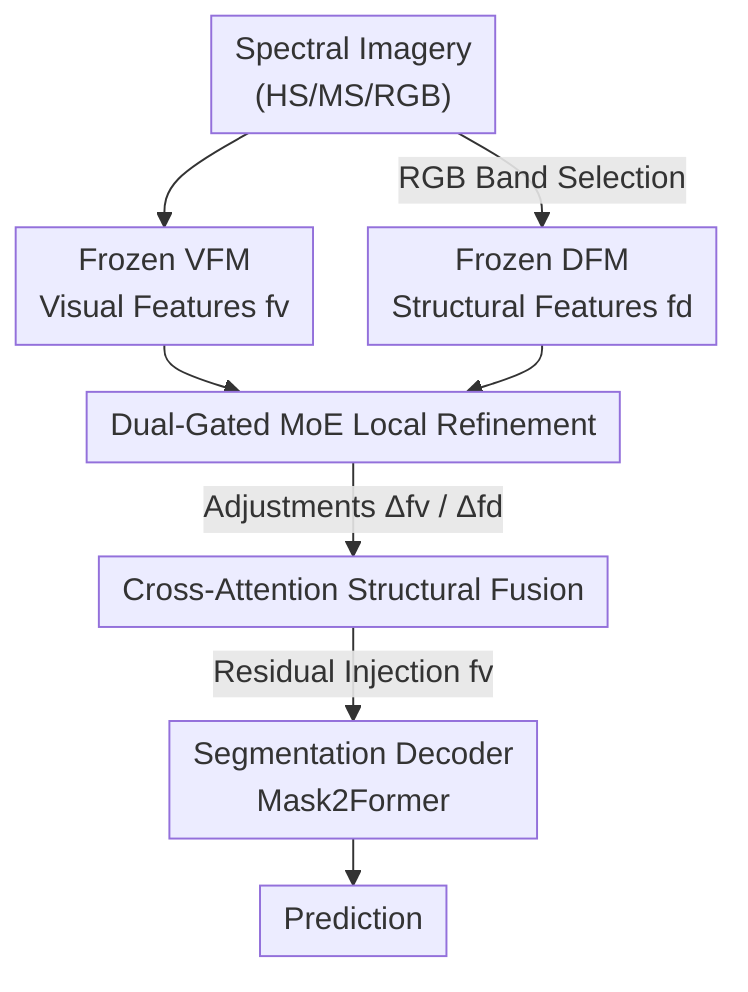

# Local Precise Refinement: A Dual-Gated Mixture-of-Experts for Enhancing Foundation Model Generalization against Spectral Shifts

**Conference**: CVPR 2026  
**Paper**: [CVF Open Access](https://openaccess.thecvf.com/content/CVPR2026/html/Chen_Local_Precise_Refinement_A_Dual-Gated_Mixture-of-Experts_for_Enhancing_Foundation_Model_CVPR_2026_paper.html)  
**Code**: Project Page https://nudt-sawlab.github.io/SpectralMoE/ (Code to be released)  
**Area**: Remote Sensing / Domain Generalization Semantic Segmentation / Foundation Model Fine-tuning  
**Keywords**: Spectral Remote Sensing, Domain Generalization Segmentation, Mixture-of-Experts, Depth Prior, Foundation Model Fine-tuning

## TL;DR
SpectralMoE feeds per-layer features of frozen foundation models (DINOv3/DOFA) into a **dual-gated MoE** for per-pixel fine-grained modulation, while injecting structural depth priors estimated from RGB bands via cross-attention to achieve SOTA across seven remote sensing domain generalization benchmarks.

## Background & Motivation
**Background**: Semantic segmentation in spectral remote sensing (hyperspectral/multispectral/RGB) faces severe "spectral shifts"—spectral features of the same land category vary significantly due to different sensors, seasons, or lighting. Domain Generalization (DGSS) aims to generalize to unseen domains using only source data. Current paradigms often fine-tune frozen vision foundation models (VFMs like DINOv3) or remote sensing foundation models (RSFMs like DOFA).

**Limitations of Prior Work**: Existing fine-tuning methods (e.g., REIN, DepthForge) perform **global, homogeneous** adjustments—all spatial positions share the same adapter tokens. However, remote sensing land cover is spatially heterogeneous. Spectrally similar but semantically different categories (e.g., "paddy fields" and "ponds") are often adjacent. Global adjustments fail to distinguish these, leading to inter-class confusion.

**Key Challenge**: Spectral signals are unstable across domains, yet current fine-tuning methods lack the ability to treat features differently per position or introduce more robust cross-domain cues.

**Goal**: (1) Replace global homogeneous fine-tuning with **per-spatial-position conditional computation**, assigning "tailored experts" to each location. (2) Introduce more robust structural priors to resolve spectral ambiguities.

**Key Insight**: Structural information (height, contours, spatial relationships) is more robust than spectral features across varying sensors or seasons. Structural priors can be inferred from RGB bands using depth foundation models (DFMs).

**Core Idea**: Use a "dual-gated MoE for local refinement + cross-attention for structural depth injection" instead of global fine-tuning to transform unstable spectral adaptation into spatially adaptive, structurally-anchored modulation.

## Method

### Overall Architecture
SpectralMoE is a **plug-and-play fine-tuning framework**. Lightweight SpectralMoE modules are inserted into each layer of a frozen VFM and DFM. Only the SpectralMoE modules and segmentation head are updated. The pipeline extracts visual features $f^v$ via VFM and depth features $f^d$ via DFM. Both undergo **dual-gated MoE** per-token routing for refinement, followed by a **cross-attention fusion** where structural cues are injected into visual features.

### Key Designs

**1. Dual-Gated MoE: Localized Expert Specialization**  
SpectralMoE instantiates $N_e$ experts per layer, performing routing **per token (spatial position)** rather than globally. "Dual-gating" ensures visual and depth modalities have independent routing matrices to avoid interference. For the $i$-th position of modality $j$, routing uses a distance-based noisy gating:  
$$(h^j_i)_e = -\lVert f^j_i - w^j_{gate,e}\rVert_p + \epsilon_e \cdot \mathrm{Softplus}\big((f^j_i)^\top w^j_{noise,e}\big)$$  
This maps spatial positions to experts based on feature similarity (prototypes), solving class confusion caused by homogeneous global updates.

**2. Low-Rank Expert + Perceptual Map Modulation**  
Experts use low-rank decomposition ($T_e = A_e \cdot B_e$) for parameter efficiency. They compute a "perceptual map" between input tokens and expert adaptive tokens to determine the degree of knowledge absorption, making the adjustment content-adaptive.

**3. Cross-attention Structural Prior Injection**  
Since spectral data is unreliable, the model queries robust structural features via cross-attention. Visual adjustment maps $\Delta\hat f^v$ serve as queries to aggregate structural cues from depth adjustments $\Delta\hat f^d$. This helps distinguish semantically different but spectrally similar regions.

### Loss & Training
The total loss includes the Mask2Former segmentation loss and a **load-balancing loss** for MoE experts to prevent "expert collapse" where only a few experts are utilized. AdamW is used with 20 epochs of training.

## Key Experimental Results

### Main Results
SpectralMoE achieved SOTA on seven DGSS benchmarks. For hyperspectral tasks, it outperformed strong baselines by **+3.22 mIoU**. On multispectral cross-sensor tasks, it achieved a massive gain of **+7.13 mIoU**. Notably, frozen DINOv3 backbones adapted to multispectral data significantly outperformed RS-specific RSFMs like DOFA, highlighting the value of VFM scale.

### Ablation Study
- **w/o MoE (Global Homogeneous)**: Significant performance drop (up to 2.78 mIoU), validating that local refinement is crucial.
- **w/o Dual Gating**: Shared gates for vision and depth degraded performance, proving modality-independent routing is necessary.
- **w/o Cross-Attention**: Replacing fusion with simple addition led to a 1.97 mIoU loss, confirming that aggregation of structural cues must be targeted.

### Key Findings
- **MoE is the primary driver**: Local adaptation solves class confusion at class boundaries.
- **Backbone Robustness**: SpectralMoE consistently outperforms SOTA peers across multiple VFMs (CLIP, SAM, DINOv2).
- **Expert Capacity**: $N_e=6$ provides the best balance between performance and parameter efficiency.

## Highlights & Insights
- **MoE as a Spatial Tuner**: SpectralMoE reinterprets MoE as a mechanism for spatial adaptivity in remote sensing, which naturally addresses land cover heterogeneity.
- **Structural Anchoring**: Utilizing depth as a rubust cross-domain signal compensates for unstable spectral features.
- **VFM Dominance**: Billion-scale natural vision foundations provide better generalization than million-scale remote sensing models.

## Limitations & Future Work
- **Inference Overhead**: Running dual foundation model backbones and per-layer MoE increases computational and VRAM demands.
- **RGB Reliance**: Structural priors depend on RGB bands; results may vary in non-optical or low-quality spectral data.

## Related Work & Insights
SpectralMoE outperforms previous global adapters (REIN/DepthForge) by introducing content-aware local gating. It moves the focus from "global uniform tuning" to "spatially adaptive modulation," which is particularly effective for complex ground scenes.

## Rating
- Novelty: ⭐⭐⭐⭐ (MoE for spatial adaptivity is well-motivated).
- Experimental Thoroughness: ⭐⭐⭐⭐⭐ (Tested on seven benchmarks and four VFMs).
- Writing Quality: ⭐⭐⭐⭐ (Clear formulas and framework).
- Value: ⭐⭐⭐⭐ (High engineering utility for spectral cross-domain deployment).

## Related Papers

- [\[CVPR 2026\] HyperFM: An Efficient Hyperspectral Foundation Model with Spectral Grouping](hyperfm_an_efficient_hyperspectral_foundation_model_with_spectral_grouping.md)
- [\[CVPR 2026\] VLM4RSDet: Collaborative Optimization with Vision-Language Model for Enhancing Remote Sensing Object Detection](vlm4rsdet_collaborative_optimization_with_vision-language_model_for_enhancing_re.md)
- [\[CVPR 2026\] Improving Visual Grounding in Remote Sensing via Cluster-Guided Refinement and Model Ensemble Voting](improving_visual_grounding_in_remote_sensing_via_cluster-guided_refinement_and_m.md)
- [\[CVPR 2026\] ORSATR-X: A Foundation Model based on Differential-and-Excitation Networks for Optical Remote Sensing Object Recognition](orsatr-x_a_foundation_model_based_on_differential-and-excitation_networks_for_op.md)
- [\[CVPR 2026\] GeoBridge: A Semantic-Anchored Multi-View Foundation Model Bridging Images and Text for Geo-Localization](geobridge_a_semantic-anchored_multi-view_foundation_model_bridging_images_and_te.md)

<!-- RELATED:END -->

<!-- RELATED:START -->

## Related Papers

- [\[CVPR 2026\] HyperFM: An Efficient Hyperspectral Foundation Model with Spectral Grouping](hyperfm_an_efficient_hyperspectral_foundation_model_with_spectral_grouping.md)
- [\[CVPR 2026\] GeoBridge: A Semantic-Anchored Multi-View Foundation Model Bridging Images and Text for Geo-Localization](geobridge_a_semantic-anchored_multi-view_foundation_model_bridging_images_and_te.md)
- [\[CVPR 2026\] Spatial-Spectral Residuals Informed Diffusion Neural Operator for Pan-sharpening](spatial-spectral_residuals_informed_diffusion_neural_operator_for_pan-sharpening.md)
- [\[CVPR 2026\] LNEM: Lunar Neural Elevation Model](lnem_lunar_neural_elevation_model.md)
- [\[CVPR 2026\] GeoDiT: A Diffusion-based Vision-Language Model for Geospatial Understanding](geodit_a_diffusion-based_vision-language_model_for_geospatial_understanding.md)

<!-- RELATED:END -->
