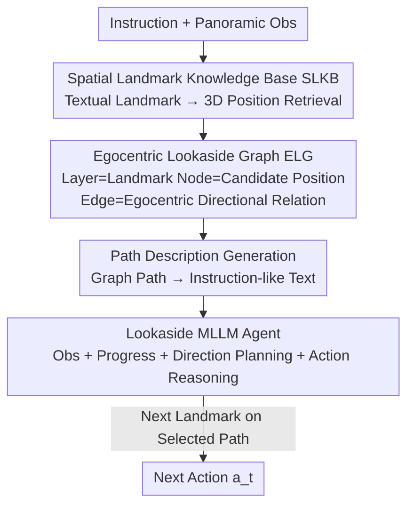

# LookasideVLN: Direction-Aware Aerial Vision-and-Language Navigation

**Conference**: CVPR2026  
**arXiv**: [2604.17190](https://arxiv.org/abs/2604.17190)  
**Code**: To be confirmed  
**Area**: Remote Sensing / Aerial Vision-and-Language Navigation (Aerial VLN)  
**Keywords**: Aerial VLN, Directional Cues, Egocentric Graph, MLLM Navigation, Zero-shot

## TL;DR
Addressing the issues of "high ambiguity in landmark descriptions and expensive global scene graph maintenance" in UAV aerial navigation, LookasideVLN proposes a "lookaside" paradigm. It constructs a lightweight egocentric landmark graph using directional cues (left turn/right turn/ascend) naturally present in instructions. By translating candidate paths into "instruction-like" text for MLLM semantic alignment, it outperforms SOTA methods (CityNavAgent) that require global sequence lookahead, even under zero-shot and single-layer lookahead conditions.

## Background & Motivation

**Background**: Aerial Vision-and-Language Navigation (Aerial VLN) enables UAVs to fly in city-scale environments following natural language instructions. Recent mainstream approaches adopt the "lookahead" strategy from ground VLN—maintaining a large-scale memory graph or scene graph to align **landmark description sequences** from instructions with UAV observations, followed by path planning via graph search (e.g., CityNavAgent, LM-Nav).

**Limitations of Prior Work**: ① Landmark descriptions in urban scenes are highly ambiguous—terms like "tree," "wall," or "traffic light" correspond to numerous instances, making it impossible to locate a unique position from a single description, which leads to navigation errors during landmark-by-landmark alignment. ② To mitigate ambiguity, existing methods assume "landmark **sequences** are unique" and maintain city-scale global scene graphs, which incur extremely high computational and memory costs in large environments. ③ These methods focus solely on semantic similarity of landmarks and **completely ignore directional cues** in instructions, resulting in a shallow understanding of the commands.

**Key Challenge**: Landmark semantics alone provide insufficient discriminative power (one-to-many), while relying on pure landmark sequences for disambiguation necessitates the heavy cost of global graphs—creating a trade-off between ambiguity resolution and computational efficiency.

**Goal**: To eliminate landmark ambiguity and achieve accurate path planning without maintaining global scene graphs, while significantly reducing computational overhead.

**Key Insight**: The author notes that human navigation instructions inherently carry dense directional cues—"turn left," "go past the building on your right," "fly straight ahead." These cues are **egocentric** (relative to the navigator's orientation rather than global coordinates), encoding rich spatial context that can distinguish "which landmark is correct" among similar instances without global maps.

**Core Idea**: Use directional cues from instructions instead of "global landmark sequence alignment" for disambiguation. Dynamically build a small egocentric graph for the current instruction, translate graph paths into "instruction-like" textual descriptions, and let the MLLM perform semantic-level, direction-aware path selection.

## Method

### Overall Architecture

LookasideVLN is a zero-shot (training-free) UAV navigation system that takes natural language instructions $\mathcal{I}$ and current panoramic observations as input to output discrete next-step actions. The pipeline is: first, retrieve 3D positions of candidate landmarks from a lightweight **Spatial Landmark Knowledge Base (SLKB)** based on descriptions extracted from the instruction; then, dynamically construct an **Egocentric Lookaside Graph (ELG)** using these positions, where each layer corresponds to an unvisited landmark and edges record "egocentric directional relations" (rotation angle, altitude change, forward distance); next, translate each possible path on the graph into **instruction-like direction-aware path descriptions**; finally, the **Lookaside MLLM Navigation Agent** combines the instruction, these path descriptions, and panoramic observations to perform chain-of-thought reasoning to select the best path and determine the next action.

### Key Designs

**1. Spatial Landmark Knowledge Base (SLKB): Replacing Expensive Global Scene Graphs with Text-Position Pairs**

Global scene graphs are heavy and slow as they explicitly model relative relationships between landmarks, leading to exploding maintenance costs in city-scale environments. SLKB takes the opposite approach, designed as a hierarchical, lightweight, and scalable memory module: $\mathcal{K}=\{l^{kb}_i:\{p^{kb}_{i,0},p^{kb}_{i,1},\dots\}\}$, where each landmark description $l^{kb}_i$ is associated with several 3D candidate positions $p^{kb}_{i,j}$ in the scene. It **only stores (description, position) pairs, not inter-landmark relationships**. New entries are built from RGB observations: an MLLM landmark recognizer $\mathrm{LR}(\cdot)$ generates text descriptions, GroundingDINO $\mathrm{LD}(\cdot)$ provides bounding boxes, and after NMS deduplication, pixel coordinates are back-projected to world coordinates $p^{kb}_i=\frac{\bar d_i}{\|K^{-1}p^{pixel}_i\|_2}\cdot RK^{-1}p^{pixel}_i+T$ (where $\bar d_i$ is the average depth within the box after removing outliers beyond $2\sigma$, and $K, R, T$ are camera parameters).

Why is "using only text descriptions and discarding fine-grained visual features" reasonable? The author uses **Liebig's Law of the Minimum (Barrel Theory)** to argue that the upper bound of information for vision-language alignment is capped by the **information content of the instruction itself**. Since instructions only provide text-level cues like "bridge" or "intersection," fine-grained visual features are redundant and discarding them reduces memory and computation. Retrieval is fast: word embeddings of extracted landmarks $l^{instr}_i$ are compared with all $l^{kb}_j$ via cosine similarity: $l^{ret}_i=\arg\max_{l^{kb}_j\in\mathcal{K}}\mathrm{sim}(\mathrm{emb}(l^{instr}_i)$, $\mathrm{emb}(l^{kb}_j))$.

**2. Egocentric Lookaside Graph (ELG): Explicitly Encoding Directional Cues as Edges**

This is the core of disambiguation. ELG construction starts from the UAV's current position and only includes the next $N_{ahead}$ unvisited landmarks $\mathcal{L}^{unvis}$ (rather than the whole city), making it much smaller than global scene graphs. Each layer $i$ corresponds to the $i$-th unvisited landmark in the instruction, with nodes representing candidate positions $p^{unvis}_{i,j}$. Edges between adjacent layers represent "egocentric lookaside directional relations."

The essence of "egocentric lookaside" is that directions are calculated relative to **future headings**. For three consecutive landmark candidates $(p^{unvis}_{i-1,j},p^{unvis}_{i,k},p^{unvis}_{i+1,m})$, the heading vector $\mathbf{p}^{i,k}_{i-1,j}=\frac{p^{unvis}_{i,k}-p^{unvis}_{i-1,j}}{\|\cdot\|_2}$ is estimated upon reaching $p^{unvis}_{i,k}$. Based on this heading, the horizontal deflection angle $\theta$, vertical change $e$, and horizontal distance $d$ to $p^{unvis}_{i+1,m}$ are calculated (where $\theta=\mathrm{hangle}(\cdot)$ uses $\mathrm{atan2}$ in the $xy$ plane). Thus, a "right turn" is strictly defined as the deflection relative to the agent's orientation after reaching the previous landmark, aligning perfectly with the semantics of human instructions like "turn right at the intersection."

**3. Path Description Generation + Lookaside MLLM Agent: Translating Paths for Direction-Aware Planning**

To ensure the MLLM fully utilizes geometric relations, each possible path on the ELG is **translated back into natural language**, making it isomorphic to user instructions for easier semantic alignment. The first unvisited landmark uses fine-grained descriptions: "Turn left/right $|\theta|$ degrees, move forward $d$ meters and ascend/descend $e$ meters to reach $l^{unvis}_{i+1}$"; subsequent steps use coarser descriptions. Traversal of all ELG paths yields a set of candidate paths $\mathcal{P}$.

The Lookaside MLLM Agent (based on Qwen2.5-VL-72B) takes $\mathcal{I}$, descriptions $\mathcal{P}$, and panoramic observations $O_t=\{o_{t,i}\}_{i=1}^6$ as input. It performs Chain-of-Thought reasoning: ① Generate **observation descriptions** to understand the surroundings; ② Summarize **navigation progress** to determine the current task step; ③ Perform **direction-aware path planning** by matching candidate paths with instruction segments; ④ Execute **action reasoning** to decide the next action $a_t$ based on the selected path. This design makes planning both robust and interpretable.

### Loss & Training
The method is **zero-shot / training-free**, relying entirely on the zero-shot capabilities of off-the-shelf MLLMs (Qwen2.5-VL-72B for planning, Qwen-VL-Max for recognition, and GroundingDINO for detection). Key hyperparameters: $N_{ahead}=2$; 6 discrete actions (Turn Left/Right 15°, Ascend/Descend 2m, Move Forward 5m, Stop); SLKB is constructed from 50 random trajectories per seen scene.

## Key Experimental Results

### Main Results

AerialVLN benchmark (8446 trajectories, 25 city-scale UE4 scenes, average path length 661.8m) comparison with learning-based methods:

| Dataset | Metric | LookasideVLN | Zhao'25 | Seq2Seq |
|--------|------|------|----------|------|
| Val Seen | SR↑ | 5.7 | **7.5** | 2.9 |
| Val Seen | OSR↑ | **26.1** | 12.6 | 10.2 |
| Val Unseen | SR↑ | **6.4** | 3.2 | 1.1 |
| Val Unseen | OSR↑ | **21.3** | 8.1 | 5.6 |

Ours significantly leads in OSR. Notably, SR on Unseen (6.4) surpasses Seen (5.7), whereas learning-based methods collapse on Unseen data (Zhao'25 drops from 7.5 to 3.2), highlighting the generalization advantage of the zero-shot paradigm.

AerialVLN-S (17 compact scenes) comparison with zero-shot SOTA:

| Dataset | Metric | LookasideVLN (Qwen2.5-VL-72B) | CityNavAgent (GPT-4V) | STMR (GPT-4o) |
|--------|------|------|----------|------|
| Val Seen | SR↑ | **14.7** | 13.9 | 12.6 |
| Val Seen | SDTW↑ | **5.4** | 5.1 | - |
| Val Seen | NE↓ | **77.1** | 80.8 | 96.3 |
| Val Unseen | SR↑ | **12.6** | 11.7 | 10.8 |
| Val Unseen | OSR↑ | **36.0** | 35.2 | 23.0 |

Using a relatively smaller Qwen2.5-VL-72B and only single-layer lookaside, it outperforms CityNavAgent (which uses full-sequence lookahead) on most key metrics.

### Ablation Study

Module ablation (AerialVLN-S Val Seen):

| Config | SR↑ | SDTW↑ | NE↓ | Description |
|------|---------|------|------|------|
| w/o ELG & Agent | 2.4 | 1.0 | 405.5 | Direct action prediction, worst performance |
| + ELG (No Agent Reasoning) | 13.8 | 4.6 | 81.6 | Significant gain from ELG alone |
| Full (ELG + Agent) | 14.7 | 5.4 | 77.1 | Best performance |

Lookahead steps $N_{ahead}$ ablation: $N_{ahead}=2$ is the sweet spot. 1 is too short (no lookahead), while 3 is too complex for MLLM reasoning.

MLLM selection: LLaVA-7B failed (outputting only obs descriptions); Qwen2.5-VL-7B achieved SR 9.0; 32B achieved 14.1; and 72B reached 14.7.

### Key Findings
- **ELG is the most significant contributor**: Adding ELG alone boosted SR from 2.4 to 13.8, proving directional cues are invaluable for disambiguation.
- **Lookahead is not "the more the better"**: $N_{ahead}=2$ balances spatial modeling and reasoning complexity.
- **Generalization is a highlight**: SR on Unseen being higher than Seen contrasts sharply with the "Unseen collapse" of learning-based models.

## Highlights & Insights
- **Directional Cues = Free Disambiguation Signals**: The "Aha!" moment is defining "left turn/right turn" as explicit egocentric geometric relations and feeding them as language to the MLLM. Direction is a severely undervalued context in Aerial VLN.
- **Barrel Theory Guided "Subtraction"**: Using Liebig’s Law to justify that redundant visual features can be discarded since instructions only provide text-level cues. This is a powerful engineering trade-off.
- **Language-izing Structure**: Translating geometric paths back to instruction-isomorphic text allows generic MLLMs to perform spatial planning without "understanding" graph structures directly.
- **Egocentric vs. Global**: Using the agent’s own heading as a reference frame instead of global coordinates ensures alignment with human cognitive patterns.

## Limitations & Future Work
- **Low Absolute Success Rate**: Even SOTA SR is in the single digits on the main benchmark, indicating city-scale long-range navigation remains extremely challenging.
- **Dependency on Large MLLMs**: Methods rely on 72B+ models; 7B models fail. This raises concerns regarding real-time deployment and inference costs.
- **High NE on Unseen**: While SR is high, higher Navigation Error (NE) on Unseen data suggests that in failed cases, the agent stops further from the goal than competitors.
- **Instructions with Sparse Cues**: Performance degrades when instructions lack directional info or when landmarks are too homogeneous for ELG to disambiguate.

## Related Work & Insights
- **vs. CityNavAgent**: CityNavAgent uses expensive global graphs and full-sequence lookahead. Ours uses a lightweight egocentric graph and directional cues, achieving better metrics with less computation.
- **vs. STMR**: STMR uses top-down text mats which compress vertical data; ours explicitly maintains altitude change $e$, making it more suitable for 3D aerial tasks.
- **vs. Learning-based (Zhao’25)**: End-to-end models suffer from error accumulation and Unseen degradation; ours generalizes better due to its zero-shot nature.

## Rating
- Novelty: ⭐⭐⭐⭐⭐ "Lookaside paradigm + ELG + Language-izing paths" is a novel combination.
- Experimental Thoroughness: ⭐⭐⭐⭐ Extensive benchmarks and ablations, though lacks quantification of latency and computation costs.
- Writing Quality: ⭐⭐⭐⭐ Clear motivation and clever use of Liebig's Law; formulaic descriptions are precise.
- Value: ⭐⭐⭐⭐ Provides a portable "lightweight + direction-aware" paradigm for aerial navigation.

<!-- RELATED:START -->

## Related Papers

- [\[CVPR 2026\] AVION: Aerial Vision-Language Instruction from Offline Teacher to Prompt-Tuned Network](avion_aerial_visionlanguage_instruction_from_offli.md)
- [\[CVPR 2026\] Beyond Matching to Tiles: Bridging Unaligned Aerial and Satellite Views for Vision-Only UAV Navigation](beyond_matching_to_tiles_bridging_unaligned_aerial_and_satellite_views_for_visio.md)
- [\[CVPR 2026\] APEX: A Decoupled Memory-based Explorer for Asynchronous Aerial Object Goal Navigation](apex_a_decoupled_memory-based_explorer_for_asynchronous_aerial_object_goal_navig.md)
- [\[CVPR 2026\] GeoDiT: A Diffusion-based Vision-Language Model for Geospatial Understanding](geodit_a_diffusion-based_vision-language_model_for_geospatial_understanding.md)
- [\[CVPR 2026\] ZoomEarth: Active Perception for Ultra-High-Resolution Geospatial Vision-Language Tasks](zoomearth_active_perception_for_ultra-high-resolution_geospatial_vision-language.md)

<!-- RELATED:END -->
