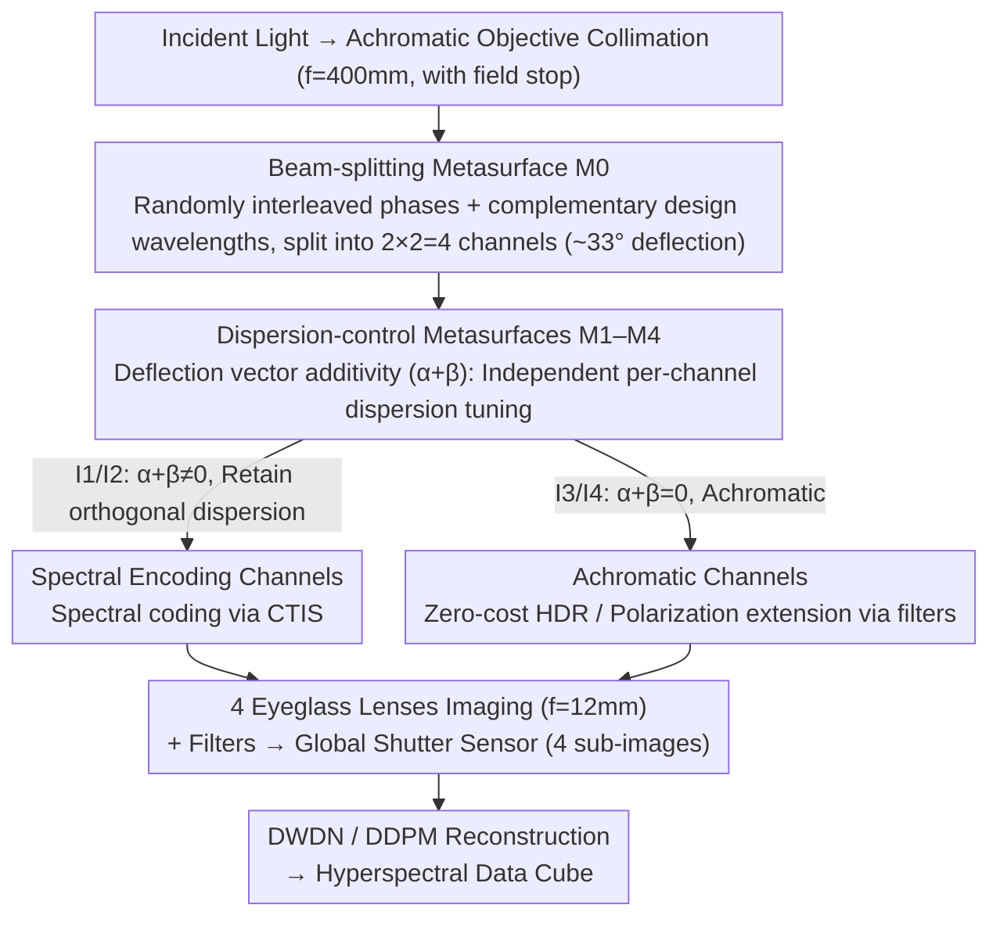

# MetaSpectra+: A Compact Broadband Metasurface Camera for Snapshot Hyperspectral+ Imaging

**Conference**: CVPR 2026  
**arXiv**: [2603.09116](https://arxiv.org/abs/2603.09116)  
**Code**: [https://meta-imaging.qiguo.org](https://meta-imaging.qiguo.org)  
**Area**: Remote Sensing / Computational Hyperspectral Imaging  
**Keywords**: Metasurface Imaging, Hyperspectral Reconstruction, Snapshot Imaging, HDR, Polarization Imaging

## TL;DR

MetaSpectra+ proposes a metasurface-refractive lens hybrid optical paradigm. By independently controlling 4-channel dispersion, exposure, and polarization via double-layer metasurfaces, it achieves 250nm broadband snapshot hyperspectral+ HDR/polarization imaging within a minimal 17mm optical path. It reaches a PSNR of 33.31dB on the KAUST benchmark, outperforming existing snapshot hyperspectral systems.

## Background & Motivation

**Background**: Snapshot Hyperspectral Imaging (Snapshot HSI) aims to recover 3D hyperspectral data cubes from single 2D sensor measurements. Existing solutions include sampling-based methods (coded apertures, lens arrays, spectral filter arrays) and encoding-based methods (embedding spectral information into the spatial domain via wavelength-dependent PSF using DOEs, gratings, or prisms). Simultaneously, multifunctional metasurfaces have gained attention for obtaining multimodal information such as depth, polarization, and spectrum in a monocular form factor.

**Limitations of Prior Work**: Metasurface optical components suffer from severe chromatic aberration. Most multifunctional metasurface systems can only operate within extremely narrow bands of 10-100nm, failing to cover the full visible spectrum. Furthermore, existing schemes couple beam splitting and imaging functions into a single metasurface, leading to large F-numbers and bulky systems.

**Key Challenge**: The strong dispersion of metasurfaces is a double-edged sword; it is the physical basis for spectral regulation but also strictly limits the usable bandwidth. In multifunctional imaging, one must utilize dispersion to encode spectral information while eliminating it when necessary (e.g., achromatic designs for HDR/polarization channels). These requirements are mutually exclusive in traditional single-layer metasurface designs.

**Goal**: (1) How to extend the working bandwidth of multifunctional metasurfaces from dozens of nanometers to 250nm to cover the entire visible spectrum? (2) How to independently control the dispersion of each channel in the same system—where some channels have controllable dispersion for spectral encoding and others are achromatic for HDR/polarization? (3) How to reduce the F-number while maintaining compactness?

**Key Insight**: The authors observe that dispersion is essentially the algebraic sum of the deflection vectors of two optical elements ($\Delta \mathbf{x}_i(\lambda) = \frac{\lambda f}{\lambda_c}(\boldsymbol{\alpha}_i + \boldsymbol{\beta}_i)$). Therefore, if beam splitting and dispersion control are assigned to two separate metasurface layers, the dispersion of each channel can be independently controlled by adjusting the second layer's deflection vector $\boldsymbol{\beta}_i$. When $\boldsymbol{\alpha}_i + \boldsymbol{\beta}_i = 0$, it is fully achromatic; otherwise, controllable dispersion is retained. Simultaneously, the imaging function is delegated to refractive lenses to achieve functional decoupling.

**Core Idea**: Use double-layer metasurfaces for beam splitting and dispersion control respectively, combined with refractive lenses for imaging. Leverage the additivity of deflection vectors to make each channel's dispersion independently adjustable, enabling broadband multifunctional hyperspectral imaging in a compact form.

## Method

### Overall Architecture

MetaSpectra+ aims to simultaneously acquire broadband hyperspectral data and HDR/polarization within a compact camera with a 17mm total optical path. The mechanism involves decoupling "beam splitting," "dispersion control," and "imaging" into different optical components rather than compressing them into a single metasurface. The light follows a five-stage pipeline: it is first collimated by an achromatic doublet objective ($f=400$mm) with a field stop; it then hits the beam-splitting metasurface M0, which splits the light into 2×2=4 independent channels with approximately 33° deflection angles; each channel passes through a dispersion-control metasurface M1–M4, which determines whether that path is achromatic or retains controllable dispersion; following this, four achromatic doublet "eyeglass lenses" ($f=12$mm) perform imaging; finally, the light passes through optical filters onto a 7.1mm×7.1mm global shutter sensor. Among the 4 channels, I1/I2 carry orthogonal dispersion to encode spectra via Computed Tomography Imaging Spectrometer (CTIS) patterns, while I3/I4 are achromatic for HDR or polarization extension. The four sub-images on the sensor are reconstructed into a full hyperspectral data cube by DWDN or DDPM.

### Key Designs

**1. Functional Decoupling via Double-layer Metasurfaces + Refractive Lenses: Tuning Dispersion like a Knob**

The fundamental dilemma of single-layer metasurfaces is the total coupling of beam splitting, imaging, and dispersion, where strong dispersion both enables spectral coding and locks the bandwidth to dozens of nanometers. The key observation of MetaSpectra+ is that the PSF shift with respect to wavelength is essentially the algebraic sum of the deflection vectors of two optical layers. The beam-splitting metasurface applies deflection $\boldsymbol{\alpha}_i$ to channel $i$, and the dispersion-control metasurface adds $\boldsymbol{\beta}_i$, resulting in a wavelength displacement of:

$$\Delta \mathbf{x}_i(\lambda) = \frac{\lambda f}{\lambda_c}(\boldsymbol{\alpha}_i + \boldsymbol{\beta}_i).$$

This step reduces the chromatic aberration problem, which originally required wave-optics optimization, to a vector algebra problem: setting $\boldsymbol{\alpha}_i + \boldsymbol{\beta}_i = 0$ ensures the PSF no longer drifts with wavelength, achieving achromatic focusing (I3/I4); making the sum non-zero retains a controllable dispersion with a set direction (matching the orthogonal dispersion of I1/I2). Dispersion and direction can be set independently for each channel. By delegating "imaging" to refractive lenses, the system overcomes the bandwidth limits and large F-numbers of single-layer metasurfaces, which is the root cause of its compact broadband multifunctional performance.

**2. Beam-splitting Metasurface M0: Random Interleaved Phases + Complementary Designed Wavelengths for Full Visible Bandwidth**

To split light into four 33° high-angle channels, a regular 2×2 mosaic arrangement is simplest, but regular arrangements at high angles excite strong higher-order diffraction artifacts. M0 addresses this by randomly interleaving four sub-phase profiles using an equal-weight multinomial distribution: each channel's individual phase is a linear phase $M_{0,i}(\mathbf{x}, \lambda_c) = \exp(j\frac{2\pi}{\lambda_c} \boldsymbol{\alpha}_i \cdot \mathbf{x})$, while the entire M0 is $M_0(\mathbf{x}, \lambda_c) = M_{0,k}(\mathbf{x}, \lambda_c),\ k \sim \text{Multinomial}(1/4)$. Although dispersion causes multi-order diffraction at non-design wavelengths, measurements show only the 0th and 1st orders are significant; the 0th order is blocked by the field stop, so the effective modulation is $M_{0,i}(\mathbf{x}, \lambda) \approx a_1(\lambda) M_{0,i}(\mathbf{x}, \lambda_c)$. Random interleaving suppresses artifacts at the cost of slight light efficiency loss. Additionally, the four channels are designed with different wavelengths $\lambda_{c,1:4} = \{450, 550, 600, 750\}$ nm, ensuring the full visible spectrum is covered by at least one high-efficiency channel at any wavelength, extending the bandwidth to ~250nm.

**3. Zero-cost Multimodal Extension for Achromatic Channels: HDR or Polarization via Filters**

Because I3/I4 are achromatic and offer imaging quality closest to conventional cameras, they are naturally suited for extra modalities besides spectroscopy. This requires only inserting filters before the channels without changing the optical design. In HDR mode, I1–I3 are fitted with OD=0.3 and I4 with OD=0.9 ND filters to form an exposure bracket with a ~4:1 power ratio. Merging I3 and I4 using the Debevec–Malik method provides ~11dB more dynamic range than a single exposure. In polarization mode, 0° and 90° linear polarizers are placed in front of I3 and I4 respectively to calculate the degree of linear polarization $\text{DoLP}_{HV} = |I_3 - I_4| / |I_3 + I_4|$, while I1+I2 remain unaffected for spectral coding. This hardware can switch between "Hyperspectral + HDR" or "Hyperspectral + Polarization" without increasing optical complexity.

### Loss & Training

Two paths are used to reconstruct the hyperspectral cube from 4 sub-images: **DWDN** first performs Wiener deconvolution in the feature domain, followed by refinement via a multi-scale feed-forward convolutional network; **DDPM** patches the sub-images and reconstructs them patch-by-patch using a diffusion model, estimating normalization factors $a^{k,t}$ and bias $b^{k,t}$ at each step to maintain spatial consistency across patches (an improvement over Hazineh et al.). Training data is sourced from Harvard and ICVL datasets, with sub-images synthesized via the D-Flat simulator based on the actual optical design. Noise levels $\sigma$ are sampled uniformly from $[0.001, 0.01]$.

## Key Experimental Results

### Main Results

Comparison with existing snapshot hyperspectral imaging systems on the KAUST benchmark (450-700nm):

| Method | Conference | Optical Type | Sub-images | TTL(mm) | PSNR(dB)↑ | SSIM↑ | SAM↓ |
|------|------|----------|---------|---------|-----------|-------|------|
| **Ours (DDPM)** | – | MS+Lens | 4 | **17** | **33.31** | 0.92 | 0.23 |
| **Ours (DWDN)** | – | MS+Lens | 4 | **17** | 32.92 | **0.94** | **0.17** |
| 2-in-1 Cam | SIG'24 | DOE+Lens | 2 | 50 | 31.14 | 0.86 | 0.24 |
| SfD | arXiv'25 | Lens | 5 | 44.5 | 27.54 | 0.82 | 0.40 |
| Array-HSI | SIG Asia'24 | DOE+CFA | 4 | 20 | 27.44 | 0.89 | 0.20 |
| SCCD | Optica'21 | DOE+CCA | 1 | 50 | 26.78 | 0.81 | 0.36 |
| Baek et al. | ICCV'21 | DOE | 1 | 50 | 26.68 | 0.74 | 0.39 |
| HRNet | CVPRW'20 | Lens | 1 | – | 23.03 | 0.76 | 0.31 |
| MST++ | CVPRW'22 | Lens | 1 | – | 21.85 | 0.68 | 0.32 |

### Ablation Study

| Config | PSNR(dB) | SSIM | SAM | Description |
|------|----------|------|-----|------|
| Full System (DDPM) | 33.31 | 0.92 | 0.23 | Diffusion recovery, optimal PSNR |
| Full System (DWDN) | 32.92 | 0.94 | 0.17 | Non-diffusion, superior SSIM/SAM |
| Achromatic only (RGB→HSI) | 21-23 | ~0.7 | >0.3 | No dispersion coding, RGB upsampling, insufficient |
| Regular 2×2 M0 | – | – | – | Strong high-order artifacts at large angles |
| HDR Mode (I3+I4 merge) | – | – | – | ~11dB Dynamic range gain |

### Key Findings

- MetaSpectra+ **outperforms existing systems across all metrics** on the KAUST benchmark: PSNR is 2.17dB higher than the runner-up (2-in-1 Cam), while TTL is only 17mm (runner-up Array-HSI is 20mm, others ≥44.5mm).
- DWDN and DDPM offer different advantages: DDPM has higher PSNR (33.31 vs 32.92), but DWDN excels in SSIM (0.94 vs 0.92) and SAM (0.17 vs 0.23), indicating DDPM is sharper while DWDN offers better spectral fidelity.
- Achromaticity is vital: Reconstructing HSI using only achromatic channels (RGB upsampling) causes PSNR to drop by ~10dB, proving that spectral information provided by controllable dispersion is key to high-precision reconstruction.
- Complementary designed wavelengths work: The 4-channel $\lambda_c = \{450, 550, 600, 750\}$ nm ensures high-efficiency acquisition across the 450-700nm band.
- Real-world experiments verify the 11dB dynamic range gain in HDR mode and DoLP measurements in polarization mode, all while maintaining hyperspectral reconstruction quality.

## Highlights & Insights

- **Innovation in Metasurface-Refractive Hybrid Paradigm**: Decoupling beam splitting and imaging into metasurfaces and refractive lenses breaks the bandwidth and F-number constraints of single metasurface designs. This paradigm is generalizable to other diffractive/metasurface optical systems.
- **Elegant Use of Deflection Vector Additivity**: The simple mathematical relationship $\Delta \mathbf{x} \propto (\boldsymbol{\alpha} + \boldsymbol{\beta})$ is the core of the system, simplifying complex wave-optics dispersion control into vector algebra. This makes switching between achromatic and controllable dispersion trivial.
- **Zero-cost Design for Multimodal Expansion**: Achromatic channels are naturally suited for HDR and polarization expansions. Inserting filters without modifying the optical design reflects excellent modular thinking.

## Limitations & Future Work

- **Limited Depth of Field (DOF)**: The prototype DOF is only 0.2-0.7m due to the 400mm objective focal length; far-field applications would require changing optical components.
- **High Metasurface Manufacturing Barriers**: SiN nanopillar arrays (300nm wide, 775nm high) rely on professional nanofabrication, making mass production cost and consistency a bottleneck.
- **Random Interleaving Sacrifices Light Efficiency**: While suppressing artifacts, random sampling means each channel only gets ~1/4 of incident light, which may limit performance in low-light scenarios.
- **Slow DDPM Inference**: Diffusion models reconstruct patch-by-patch with multi-step denoising, which is impractical for real-time applications.
- **Verified only for 450-700nm**: Although called broadband, it does not cover Near-Infrared (700-1000nm), limiting its use in agriculture, remote sensing, etc.

## Related Work & Insights

- **vs 2-in-1 Cam (SIGGRAPH'24)**: The most similar work, also using a DOE+Lens hybrid scheme, but with only 2 sub-images, 50mm TTL, and 31.14dB PSNR. MetaSpectra+ is superior across the board with 4 channels, higher compactness, and higher accuracy.
- **vs Array-HSI (SIGGRAPH Asia'24)**: Also uses 4 sub-images but with DOE+CFA and a 20mm TTL with 27.44dB PSNR. MetaSpectra+ achieves 5.5dB higher PSNR with a shorter TTL, demonstrating that metasurface dispersion control is superior to DOE+CFA.
- **vs SCCD/Baek (Optica'21/ICCV'21)**: Single sub-image DOE schemes with PSNR of only 26-27dB. The multi-channel broadband strategy of MetaSpectra+ holds a clear advantage.

## Rating

- Novelty: ⭐⭐⭐⭐⭐ The metasurface-refractive hybrid paradigm and deflection vector additivity for dispersion control are fundamental innovations in optical design.
- Experimental Thoroughness: ⭐⭐⭐⭐ Simulation comparisons, real-world prototypes, and HDR/polarization demos are comprehensive, though outdoor/dynamic scene verification is missing.
- Writing Quality: ⭐⭐⭐⭐⭐ Rigorous derivation of optical models; logic is clear from physical principles to system design.
- Value: ⭐⭐⭐⭐⭐ Sets a new benchmark for snapshot multimodal imaging by achieving the most compact form factor and highest reconstruction accuracy simultaneously.

<!-- RELATED:START -->

## Related Papers

- [\[CVPR 2026\] HyperFM: An Efficient Hyperspectral Foundation Model with Spectral Grouping](hyperfm_an_efficient_hyperspectral_foundation_model_with_spectral_grouping.md)
- [\[CVPR 2026\] Lumosaic: Hyperspectral Video via Active Illumination and Coded-Exposure Pixels](lumosaic_hyperspectral_video_via_active_illumination_and_coded-exposure_pixels.md)
- [\[CVPR 2026\] Orthogonal Spatial-Aware Multi-View Anchor Graph Clustering for Incomplete Remote Sensing Data](orthogonal_spatial-aware_multi-view_anchor_graph_clustering_for_incomplete_remot.md)
- [\[CVPR 2026\] MM-OVSeg: Multimodal Optical-SAR Fusion for Open-Vocabulary Segmentation in Remote Sensing](mm-ovseg_multimodal_optical-sar_fusion_for_open-vocabulary_segmentation_in_remot.md)
- [\[CVPR 2026\] Prompt-Free Unknown Label Generation for Open World Detection in Remote Sensing](prompt-free_unknown_label_generation_for_open_world_detection_in_remote_sensing.md)

<!-- RELATED:END -->
