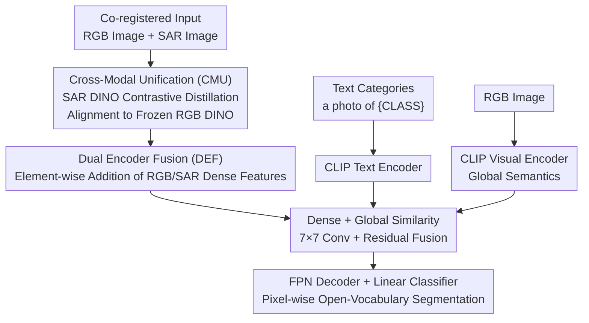

# MM-OVSeg: Multimodal Optical-SAR Fusion for Open-Vocabulary Segmentation in Remote Sensing

**Conference**: CVPR 2026  
**Paper**: [CVF Open Access](https://openaccess.thecvf.com/content/CVPR2026/html/Wei_MM-OVSeg_Multimodal_Optical-SAR_Fusion_for_Open-Vocabulary_Segmentation_in_Remote_Sensing_CVPR_2026_paper.html)  
**Code**: https://github.com/Jimmyxichen/MM-OVSeg  
**Area**: Remote Sensing / Open-Vocabulary Segmentation / Multimodal Fusion  
**Keywords**: Open-vocabulary segmentation, Optical-SAR fusion, Remote sensing, Cross-modal alignment, Cloud-occlusion robustness

## TL;DR
MM-OVSeg introduces SAR into open-vocabulary segmentation (OVS) for remote sensing. It utilizes contrastive distillation to align SAR features into the representation space of an RGB visual foundation model (CMU) and employs a dual-encoder fusion module to align CLIP global semantics and DINO dense structural features with text (DEF). This enables pixel-level segmentation according to arbitrary text categories even under cloudy or hazy weather conditions, achieving an average mIoU of 51.7% across six benchmarks, outperforming the best previous single-modal methods by 6.1 points.

## Background & Motivation
**Background**: Open-vocabulary segmentation (OVS) allows models to recognize arbitrary text categories unseen during training, which is particularly valuable for remote sensing (RS) to facilitate flexible land cover understanding across geographical regions without dense pixel annotations or fixed class lists. Recent RS OVS works (e.g., CAT-Seg, EBSeg, SegEarth-OV, GSNet) are mostly based on CLIP, associating arbitrary text concepts with visual regions.

**Limitations of Prior Work**: These methods are almost entirely limited to clear-sky optical RGB imagery, assuming clean, cloud-free inputs. However, real-world remote sensing observations are frequently contaminated by clouds and haze. Once optical inputs degrade, existing OVS methods fail significantly under low-visibility conditions (as shown in Figure 1 where CAT-Seg / EBSeg / SegEarth-OV fail on cloudy images), directly limiting their usability in time-sensitive tasks like disaster response and long-term continuous monitoring.

**Key Challenge**: Optical images provide rich spectral semantics but cannot penetrate clouds; SAR (Synthetic Aperture Radar) can penetrate clouds and haze to capture structural backscatter but lacks semantic texture. While the modalities are complementary, existing SAR-optical segmentation methods are primarily closed-set (fixed categories) and lack open-vocabulary generalization. Integrating SAR into an OVS framework faces two major hurdles: ① Visual Foundation Models (VFMs, like DINO) are trained almost exclusively on RGB, and SAR's microwave backscatter statistics differ vastly from optical textures, creating a massive RGB↔SAR domain gap; ② Vision-language models (CLIP/ALIGN) are trained with image-level supervision and possess weak dense prediction capabilities, a weakness further exacerbated by the SAR domain gap.

**Goal**: To perform robust open-vocabulary segmentation under cloudy/adverse weather by solving two sub-problems: how to encode SAR into a format compatible with text-aligned RGB representations, and how to robustly fuse both modalities into OVS.

**Key Insight**: Although SAR and RGB have significant low-level statistical differences, unlabeled, co-registered RGB-SAR pairs can be used to "pull" SAR features into the feature space of a pre-trained RGB foundation model (similar to how ImageBind unifies multimodal embeddings via paired data), avoiding the need to collect a DINO-scale SAR corpus from scratch.

**Core Idea**: Use cross-modal contrastive distillation to align SAR features with frozen RGB DINO representations (CMU), followed by a dual-encoder fusion module that aligns CLIP global semantics + DINO (RGB/SAR) dense features with CLIP text embeddings (DEF), resulting in a remote sensing segmentation framework that is both cloud-penetrating and open-vocabulary.

## Method

### Overall Architecture
MM-OVSeg receives a pair of co-registered images—an optical RGB image $I \in \mathbb{R}^{H\times W\times 3}$ and a SAR image $S \in \mathbb{R}^{H\times W\times 1}$—along with a set of text categories ($C_{train}$ during training, expanding to $C_{test}=C_{train}\cup C_{novel}$ during inference), and outputs a pixel-wise semantic map. The model consists of four encoders: CLIP's visual encoder $\phi_V$ and text encoder $\phi_T$ handle global semantic-text alignment; a frozen RGB DINO encoder $F_{rgb}$ extracts dense local features from RGB; and a DINO encoder $F_{sar}$, specifically tuned for SAR, extracts dense SAR features.

Training is performed in two sequential stages: **Stage 1 (CMU)** trains only the SAR DINO encoder using contrastive distillation to align it with frozen RGB DINO features; **Stage 2 (DEF)** freezes both DINO encoders and trains the CLIP encoder and fusion module to align RGB/SAR dense features with CLIP text embeddings, followed by an FPN decoder and linear classifier for the final segmentation.

### Key Designs

**1. Cross-Modal Unification (CMU): Bringing SAR into the RGB Foundation Model Feature Space**

The core issue is that DINO is powerful for dense features but only understands RGB. SAR's backscatter texture is statistically distinct, making standard DINO features from SAR useless, while training from scratch on a DINO-scale SAR dataset is infeasible. CMU solves this using unlabeled co-registered RGB-SAR pairs for contrastive distillation: each RGB image passes through the frozen RGB DINO $F_{rgb}$ to generate $f_{rgb}$ as a "teacher," while the corresponding SAR image passes through the learnable $F_{sar}$ to generate $f_{sar}$. An InfoNCE contrastive loss is used to pull paired SAR/RGB embeddings together and push negative samples apart:

$$L_{CMU} = -\log \frac{\exp(f_{sar} f^{+}_{rgb}/\tau)}{\exp(f_{sar} f^{+}_{rgb}/\tau) + \sum_{j=1}^{N}\exp(f_{sar} f^{-j}_{rgb}/\tau)}$$

where $f^{+}_{rgb}$ is the paired RGB embedding, $f^{-j}_{rgb}$ represents negative embeddings from other samples, and $\tau$ is the temperature. Both encoders use ViT-B/16, extracting multi-scale features from transformer blocks 4/8/12 and averaging the losses across layers. The authors constructed CMU-Data: 25,087 co-registered RGB-SAR pairs (0.5–3m resolution) from SpaceNet6 and DFC2023. The effectiveness lies in converting "how to encode SAR" into "aligning to an established RGB space," allowing frozen RGB foundation models to reuse SAR cues effectively.

**2. Dual Encoder Fusion (DEF): Combining CLIP Global Semantics and DINO Dense Structure in Text Space**

Stage 2 addresses the limitation where CLIP global semantics are strong but dense predictions are coarse (blurry attention maps), while DINO dense features are strong but lack text alignment. DEF explicitly fuses their complementarity. First, **Multimodal Dense Feature Aggregation**: RGB and SAR dense features $f^i_{rgb}, f^i_{sar}$ from ViT blocks 4/8/12 are projected via block-specific convolutions $\sigma_i(\cdot)$ and added element-wise: $f^i_d = \sigma_i(f^i_{rgb}) + \sigma_i(f^i_{sar})$. This fused feature contains both RGB spectral-texture and SAR structural backscatter. Second, **Vision-Text Alignment**: The RGB image generates a global visual embedding $z_{rgb}=\Phi_V(I_{rgb})$ via CLIP, and text prompts $z_T=\Phi_T(T)$ (using "{a photo of CLASS}") generate text embeddings. Dense similarity maps $h^i_{dt}=f^i_d\cdot z_T$ and global similarity maps $h_{gt}=z_{rgb}\cdot z_T$ are calculated via cosine similarity, then processed by 7×7 convolutions $\sigma_7$ and sigmoid $\varphi$. Finally, **Fusion with Residuals**:

$$h^i_{fuse} = \varphi(\sigma_7([h^i_{dt}; h_{gt}])) + h_{gt}$$

The global similarity map acts as a residual, which is critical for preserving CLIP's general semantic structure and preventing feature drift during multimodal training, thereby maintaining open-vocabulary generalization. The fused $h^i_{fuse}$ is bilinear upsampled (FPN-style) and concatenated with DINO/CLIP features for pixel-wise prediction via cross-entropy $L_{ce}$.

### Loss & Training
The two stages are trained separately. Stage CMU: Only SAR DINO is trained with a batch size of 8, AdamW optimizer, learning rate $3\times10^{-4}$, and weight decay $1\times10^{-4}$. Stage DEF: DINO encoders are frozen, new parameters are randomly initialized, and the model is trained for 120k iterations with a batch size of 8. The initial learning rate is $2.5\times10^{-4}$ while the CLIP encoder uses a smaller rate of $2\times10^{-6}$ to preserve pre-trained alignment. All training was conducted on a single NVIDIA A100 (80GB). Backbone weights are taken from CLIP and DINO v1 (ViT-B/16).

## Key Experimental Results

### Main Results
Performance comparison across six evaluation settings (covering clear vs. cloudy, various cloud thicknesses, and cross-domain). Settings: ① PIE-cloud→PIE-cloud; ② DDHR-SK→DDHR-SK; ③ OEM-thick→OEM-thick; ④ OEM-thin→OEM-thin; ⑤ PIE-clean→PIE-clean; ⑥ DDHR-SK→DDHR-CH (cross-domain). Metric: mIoU.

| Method | Source | ① | ② | ③ | ④ | ⑤ | ⑥ | Average |
|------|------|----|----|----|----|----|----|------|
| CAT-Seg | CVPR'24 | 54.5 | 54.2 | 33.8 | 29.5 | 55.8 | 27.8 | 42.6 |
| EBSeg | CVPR'24 | 50.8 | 51.1 | 27.2 | 25.6 | 51.0 | 26.7 | 38.7 |
| GSNet | AAAI'25 | 57.0 | 55.0 | 35.2 | 37.0 | 57.2 | 32.4 | 45.6 |
| SegEarth-OV | CVPR'25 | 45.1 | 17.6 | 28.9 | 18.5 | 51.8 | 24.2 | 31.0 |
| FGAseg | arXiv'25 | 51.6 | 51.6 | 26.0 | 32.8 | 52.1 | 40.6 | 42.5 |
| **MM-OVSeg (Ours)** | – | **57.7** | **73.1** | **36.6** | **40.2** | **59.7** | **42.6** | **51.7** |

Ours achieves first place across all settings, with an average mIoU of 51.7% compared to 45.6% for the second-best GSNet (+6.1%). The gain is particularly significant in setting ② (+18.1). It even remains superior in clear-sky conditions (setup ⑤), outperforming GSNet by 2.5%.

### Ablation Study
Ablation analysis on DDHR-SK→DDHR-SK (Table 3):

| Configuration | Forest | City | Farmland | Road | Water | mIoU | Description |
|------|--------|------|----------|------|-------|------|------|
| Full MM-OVSeg | 87.3 | 86.8 | 85.6 | 21.2 | 84.8 | **73.1** | CMU + DEF enabled |
| w/o CMU | 57.2 | 83.7 | 81.2 | 16.8 | 81.4 | 64.1 | No cross-modal alignment (-9.0) |
| w/o CMU & DEF | 80.0 | 90.3 | 79.0 | 6.8 | 19.1 | 55.0 | Single-modal optical baseline |

Comparison of CMU stage loss functions (Table 4):

| CMU Loss Type | mIoU |
|--------------|------|
| Baseline (w/o CMU) | 64.1 |
| MSE | 67.7 |
| L1 | 69.0 |
| InfoNCE | **73.1** |

### Key Findings
- **DEF and CMU are complementary**: The optical baseline (55.0%) improves to 64.1% with DEF alone, and to 73.1% when adding CMU (allowing SAR features to be truly usable). The sequence must be CMU alignment followed by DEF fusion.
- **InfoNCE is optimal for CMU**: Contrastive relative structural alignment outperformed point-wise regression (MSE/L1), as it respects modal differences rather than forcing SAR embeddings to match RGB values numerically.
- **Huge gain for "water" class**: Without SAR (w/o CMU&DEF), the water class dropped from 84.8 to 19.1. SAR provides characteristic low, uniform backscatter for water surfaces, serving as an extremely reliable discriminant cue.
- **Seen vs. Unseen Gap**: Accuracy for seen classes remains significantly higher than for novel classes (e.g., Road at 21.2 in setup ②), indicating that maintaining vision-text alignment in RS OVS is still challenging.

## Highlights & Insights
- **Repurposing RGB Foundations for SAR**: CMU uses ImageBind-style paired distillation to bypass the lack of massive SAR pre-training datasets. This approach is transferable to any modality lacking large-scale labels (Hyperspectral, LiDAR, Thermal) provided co-registered RGB pairs exist.
- **Residuals Protect CLIP Alignment**: The DEF residual $h_{fuse}=\dots+h_{gt}$ and the minimal learning rate for CLIP allow for the surgical injection of multimodal dense information without destroying CLIP's existing open-vocabulary generalization.
- **First Cloudy OVS Framework in RS**: This work establishes the problem definition and the Optical-SAR solution. The provision of CMU-Data (25k pairs) and code is a significant contribution to the infrastructure of the RS community.
- **Physical Prior Explanations**: The performance boost on the "water" class is grounded in the physical properties of SAR sensors, making the results highly interpretable.

## Limitations & Future Work
- **Unseen Class Accuracy**: novel categories like Road show low IoU (10–32), suggesting open-vocabulary generalization is still a bottleneck.
- **Dependency on Co-registration**: CMU and inference assume strictly co-registered RGB-SAR data. The impact of temporal differences or geometric registration errors was not stress-tested.
- **Synthetic Clouds**: Most clouds in OEM/DDHR are synthesized; generalization to real-world thick precipitation/storm clouds remains an open question.
- **Limited Categories**: Benchmarks contain 4–8 classes, which is too small to fully test generalization to a truly long-tail open-vocabulary scale.

## Related Work & Insights
- **vs. CAT-Seg / EBSeg**: These methods use similarity matrices as pseudo-masks or frozen SAM encoders for spatial info but rely only on single-modal RGB, failing under cloud occlusion. Ours introduces SAR as a transparent second modality.
- **vs. SegEarth-OV / GSNet**: SegEarth-OV is training-free and weak in robustness. GSNet combines CLIP and DINO for local cues but remains single-modal. Ours is the first to perform multimodal Optical-SAR fusion for OVS.
- **vs. Traditional SAR-Optical Fusion**: Prior fusion works are mostly closed-set. Ours performs fusion directly within the text-aligned space, naturally supporting open-vocabulary reasoning.

## Rating
- Novelty: ⭐⭐⭐⭐⭐ First to push OVS into cloudy RS scenarios with an Optical-SAR fusion recipe.
- Experimental Thoroughness: ⭐⭐⭐⭐ Six settings and detailed ablations, though class counts and real-cloud scenarios are limited.
- Writing Quality: ⭐⭐⭐⭐ Clear motivation, complete visuals, and physical interpretations.
- Value: ⭐⭐⭐⭐⭐ 25k CMU-Data pairs + code provide a strong baseline for the community.

<!-- RELATED:START -->

## Related Papers

- [\[CVPR 2026\] UniGeoSeg: Towards Unified Open-World Segmentation for Geospatial Scenes](unigeoseg_towards_unified_open-world_segmentation_for_geospatial_scenes.md)
- [\[CVPR 2026\] Prompt-Free Unknown Label Generation for Open World Detection in Remote Sensing](prompt-free_unknown_label_generation_for_open_world_detection_in_remote_sensing.md)
- [\[CVPR 2026\] ORSATR-X: A Foundation Model based on Differential-and-Excitation Networks for Optical Remote Sensing Object Recognition](orsatr-x_a_foundation_model_based_on_differential-and-excitation_networks_for_op.md)
- [\[CVPR 2026\] SegEarth-R2: Towards Comprehensive Language-guided Segmentation for Remote Sensing Images](segearth-r2_towards_comprehensive_language-guided_segmentation_for_remote_sensin.md)
- [\[CVPR 2026\] ChangeBridge: Spatiotemporal Image Generation with Multimodal Controls for Remote Sensing](changebridge_spatiotemporal_image_generation_with_multimodal_controls_for_remote.md)

<!-- RELATED:END -->
