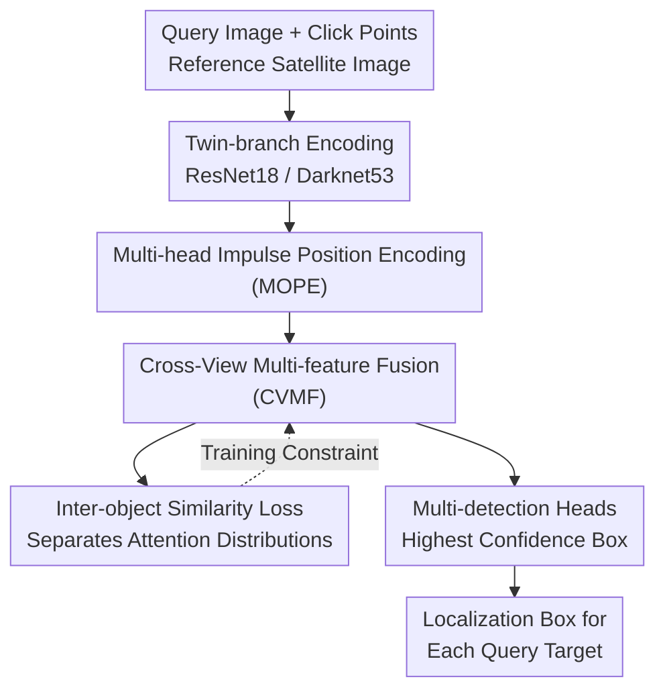

# MOGeo: Beyond One-to-One Cross-View Object Geo-localization

**Conference**: CVPR 2026  
**Paper**: [CVF Open Access](https://openaccess.thecvf.com/content/CVPR2026/html/Lv_MOGeo_Beyond_One-to-One_Cross-View_Object_Geo-localization_CVPR_2026_paper.html)  
**Code**: https://github.com/LV-BO001/MOGeo (Committed to open source)  
**Area**: Remote Sensing / Cross-View Geo-localization  
**Keywords**: Cross-View Localization, Multi-Object, Impulse Position Encoding, Satellite-Ground Matching, Attention

## TL;DR
Addressing the unrealistic assumption that existing Cross-View Object Geo-localization (CVOGL) can only locate a single target per image, this paper proposes a new multi-target task CVMOGL and the accompanying CMLocation benchmark (25,520 image pairs, 63,888 instances). It designs MOGeo, an end-to-end method whose core is to ground each query target into sharp attention peaks using Dirac-like one-hot position encoding, combined with cross-view multi-feature fusion and inter-object similarity loss, significantly surpassing DetGeo/VAGeo in multi-target scenarios.

## Background & Motivation
**Background**: The goal of Cross-View Geo-localization (CVGL) is to determine the geographic location of a ground/UAV query image within geo-tagged satellite reference images, with applications in autonomous driving, urban navigation, and disaster monitoring. This field has evolved from center-aligned to non-center-aligned, coarse-grained to fine-grained, and supervised to unsupervised, moving toward increasingly detailed and realistic scenarios. To push localization from "entire images" to "specific objects in images" (buildings, bridges, roads), the community proposed **Cross-View Object Geo-localization (CVOGL)**, represented by works like DetGeo, VAGeo, TROGeo, and GeoFormer.

**Limitations of Prior Work**: All CVOGL methods idealize scenes as having "only one target per query image." However, real query images often contain multiple buildings, roads, or bridges simultaneously—the single-target assumption prevents these methods from being practical. Furthermore, image-level CVGL methods (FRGeo, Sample4Geo, GeoDTR+) cannot provide object-level results, and their accuracy drops to single digits when forced into multi-target scenarios.

**Key Challenge**: Multi-target localization is not as simple as "running a single-target model $N$ times." it introduces two new difficulties: (1) simultaneously locating multiple targets in one image; (2) establishing a one-to-one correspondence between "query points $\leftrightarrow$ reference boxes"—even if every box is detected correctly, matching it to the wrong query point results in failure. When multiple targets coexist, traditional smooth position encodings (Gaussian or Euclidean distance decay) cause attention maps to diffuse and interfere with each other, making it difficult for the model to distinguish which target to focus on.

**Goal**: Generalize CVOGL from single-target to multi-target (CVMOGL) and solve the root cause: attention dispersion and difficulty in distinguishing objects under multi-target coexistence.

**Key Insight**: The authors observe that smooth position encodings generate **diffusion-type attention** (Fig. 2) with low peaks and large side lobes, causing the attention of multiple targets to blur together. If the position prior is constructed as an **extremely sharp impulse**, it can provide highly discriminative spatial anchors for each query target.

**Core Idea**: Inspired by the Dirac delta function, a one-hot binary mask is used instead of smooth encoding to provide an "impulse" position prior for each target. Cross-view feature fusion and inter-object similarity loss are then used to explicitly separate the attention distributions of different targets.

## Method

### Overall Architecture
MOGeo is an end-to-end detection-based method. The input consists of a query image $I_q$ (ground or UAV view) containing an arbitrary number of targets (each marked with a click point $p_j$) and a satellite reference image $I_r$. The output is the corresponding bounding box $b_j$ in the reference image for each query point. The pipeline consists of four parts: twin-branch feature extraction $\rightarrow$ Multi-head Object Position Encoding (MOPE) $\rightarrow$ Cross-View Multi-feature Fusion (CVMF) $\rightarrow$ detection heads for bounding boxes. An inter-object similarity loss is added during training to constrain the attention distribution.

The twin-branch encoders extract features independently: ResNet18 with 16× downsampling for $F_q$ (query), and Darknet53 with 16× downsampling, a fully connected layer, and reshaping to $V_r \in \mathbb{R}^{4096\times 512}$ for the reference image. Each query point is encoded via MOPE into a highly discriminative feature vector, matched with reference features in CVMF to generate attention maps and weighted fusion, and finally sent to multiple detection heads to predict the box with the highest confidence.

### Key Designs

**1. Multi-head Impulse Position Encoding (MOPE): Grounding Each Query Target with Dirac Impulses**

This is the core module and the one that contributes most to performance. It directly addresses the diffusion and cross-target interference caused by smooth encoding. Instead of using "soft" priors like Gaussian or Euclidean decay, the authors encode each query point as a one-hot binary mask $E_j \in \{0,1\}^{H'_q\times W'_q}$: only the grid cell where the target falls on the feature map is set to 1, while all others are 0 ($E_j(h,w)=1$ iff $(h,w)=\lfloor\phi(p_j)\rfloor$, where $\phi$ maps original coordinates to feature map coordinates). This is equivalent to a discrete Dirac impulse, providing a sharp prior with no side lobes for attention to diffuse, resulting in high discriminative power.

After obtaining the mask, it is concatenated with visual features and fused via $1\times1$ convolution: $F'_{qj}=\mathrm{Conv}_{1\times1}([F_q\Vert E_j])$. To prevent the position information from being "submerged" by the numerous semantic channels of $F_q$, the authors add **position-driven feature enhancement**: the mask is expanded along the channel dimension and element-wise multiplied with the fused features $F''_{qj}=F'_{qj}\odot E_j$. This acts as a second "gating" mechanism with the impulse, forcing the response back to the target grid cell. Finally, it is pooled into $m$ query vectors $V_q\in\mathbb{R}^{m\times d}$ (512 dimensions). Ablations show that removing MOPE causes acc@0.25 on CVOGL-Drone to plummet by 11.51%, confirming that the "sharp impulse prior" is the key to multi-target localization.

**2. Cross-View Multi-feature Fusion (CVMF): Matching Query Targets to Satellite Regions**

CVMF solves the cross-view correspondence between query points and reference boxes. $V_q$ and $V_r$ are L2-normalized for robust matching, then multiplied to obtain cross-view similarity $\{V_p\}=\{V_q\}\times\{V_r\}$. Reshaping each $V_{pj}$ to $H_r\times W_r$ yields the attention map $F_{aj}$ for the $j$-th target in the satellite image, characterizing its potential corresponding region. The reference features are then weighted by the attention maps $\{F'_r\}=\{F_a\}\odot\{F_r\}$, and the attention features $F_{ai}$ are concatenated with the corresponding fusion features $F'_r$ to form $F''_r$ for the detection head. This serial fusion ensures each target has its own exclusive response map, decoupling multiple targets by mechanism rather than sharing a single blurred map.

**3. Inter-object Similarity Loss $L_s$: Explicitly Pushing Apart Different Attention Distributions**

Even with sharp impulses, attention distributions for different targets might be similar and confusing. Based on the prior that attention distributions for different images or different targets in the same image should be distinct, the authors add a contrastive similarity loss:

$$L_s=\sum_{i=1}^{n}\sum_{k=1}^{m_i}\log\!\Big(1+e^{(d_{pos}-d_{neg})}\Big)$$

where $d_{pos}$ is the Euclidean distance between a target's attention map and itself, and $d_{neg}$ is the distance to attention maps of other query targets. Since $d_{pos}$ is minimized by design, this loss effectively **maximizes the attention distance between different targets** (both within the same image and across images), further tightening the diffused attention. It is optimized alongside the total loss $L=L_{cn}+L_{reg}+L_s$ ($L_{cn}$ confidence loss and $L_{reg}$ regression loss follow DetGeo).

### Loss & Training
Total loss $L=L_{cn}+L_{reg}+L_s$: regression loss aligns predicted boxes with GT, confidence loss estimates object presence in grid cells, and $L_s$ separates inter-object attention. Implemented in PyTorch, single V100 GPU, Adam optimizer, initial learning rate $1\times10^{-4}$, batch size 8, 24 training epochs. Evaluation covers both Ground→Satellite (CMLocation, CVOGL-SVI) and Drone→Satellite (CVOGL-Drone) scenarios.

## Key Experimental Results

### Indicators
Single-target acc@t (correct if IoU > t) cannot characterize whether all targets in an image are correct. The authors introduce **image-level localization accuracy** $accI@t$: an image is successfully localized if and only if **all** targets' predicted boxes have an IoU > t with their GT. Thresholds are set at $t=0.25$ and $0.5$. This upgrades the task from "per-object statistics" to "full-image success rate," which is stricter and more meaningful for multi-target scenarios.

### Main Results
Main results on CMLocation test sets (V1: strict center + north alignment; V2: random crop/flip/scale, more realistic and difficult):

| Dataset | Metric | MOGeo | Runner-up VAGeo | DetGeo | Image-level Gain |
|--------|------|-------|-----------|--------|-----------|
| CMLocation-V1 | acc@0.25 | **63.85** | 57.79 | 56.03 | +6.06 vs VAGeo |
| CMLocation-V1 | accI@0.25 | **46.66** | 43.03 | 39.68 | +3.63 vs VAGeo |
| CMLocation-V2 | acc@0.25 | **37.87** | 33.51 | 32.39 | +4.36 vs VAGeo |
| CMLocation-V2 | accI@0.25 | **30.23** | 29.18 | 28.05 | +1.05 vs VAGeo |

Image-level CVGL methods (FRGeo 8.06 / GeoDTR+ 7.44 / Sample4Geo 29.19 in acc@0.25) nearly collapse under the multi-target setting, confirming they are unsuitable for CVMOGL. MOGeo also remains competitive on degraded single-target CVOGL benchmarks: CVOGL-SVI test acc@0.25 reaches 50.98 (VAGeo 48.21, DetGeo 45.43), and acc@0.25 on CVOGL-Drone is on par with SOTA, while acc@0.5 is slightly lower than VAGeo.

### Ablation Study
逐个移除组件 on the two most difficult datasets, CVOGL-Drone and CMLocation-V2 (test acc@0.25):

| Configuration | CVOGL-Drone | CMLocation-V2 | Description |
|------|-------------|---------------|------|
| Full (Ours) | **66.39** | **37.87** | Complete Model |
| w/o $L_s$ | 65.98 | 37.56 | No similarity loss, slight drop |
| w/o CVMF | 65.78 | 37.19 | No fusion module, slight drop |
| w/o MOPE | 54.88 | 32.74 | No impulse encoding, drop of 11.51 / 5.13 |

### Key Findings
- **MOPE is the Key**: Removing it causes an 11.51% drop on CVOGL-Drone and a 5.13% drop on CMLocation-V2, far exceeding the impact of removing CVMF/$L_s$. This directly validates that the "sharp impulse position encoding" is the core of multi-target precision localization.
- **Superior Handling of Complexity**: When grouped by target count (N≤3 / 3<N≤6 / N>6), all methods degrade as targets increase, but MOGeo degrades the least. Its lead over the second-best method on CMLocation-V2 expands from +4.28% in the simplest case to +7.25% in the most complex case, showing it is more robust to dense multi-target scenarios.
- **No Efficiency Loss**: MOGeo's parameter count is comparable to the lightest model, GeoDTR+, while being faster in inference. Although VAGeo has fewer parameters, it can only locate one target at a time, making its total time higher in multi-target scenarios. MOGeo's one-forward-multi-output design is more efficient.
- **Visualization**: For the same image, MOGeo locates all targets while VAGeo only catches 2. Heatmaps show MOGeo precisely fits targets and suppresses background noise, whereas VAGeo's attention shows spatial dislocation, sometimes falling on non-target areas.

## Highlights & Insights
- **Replacing "Soft Priors" with "Hard Impulses"**: While most position encodings assume smoother is better, this paper does the opposite, using Dirac one-hot masks to create extremely sharp priors. This eliminates multi-target attention interference at the root—a "less is more sharp" counter-intuitive design that could be valuable for other multi-instance decoupling tasks.
- **Position Enhancement Trick**: Using masks for element-wise multiplication after concatenation provides a second gating mechanism, specifically counteracting the "position channel dilution" caused by semantic channels. This is a reusable engineering trick.
- **Metric Innovation**: $accI@t$ uses "all correct or nothing" to evaluate multi-target performance at a stricter and more practical level, exposing method weaknesses more effectively than per-object averages.
- **Task Over Method**: The true contribution is identifying the unrealism of the single-target assumption and creating the CMLocation benchmark. The method follows naturally from this shift.

## Limitations & Future Work
- The authors admit that alignment and precision localization of "query target $\leftrightarrow$ reference target" in complex scenes remain the primary open challenge.
- CMLocation is built by manually labeling CVUSA; urban/feature types and regional diversity are limited. The "realism" of V2 is synthesized via random cropping/flipping/scaling of V1, which still differs from true natural collection distributions.
- Impulse encoding relies on accurate click points. If the query point has noise or falls on an target edge, the "hard" nature of one-hot anchoring might amplify errors. Robustness to point noise is not discussed.
- Future Directions: Upgrade from "independent target matching" to joint matching with inter-object relationship modeling (e.g., graph constraints for click-box global consistency) or introduce hybrid soft-hard position priors to balance discriminative power and robustness.

## Related Work & Insights
- **vs DetGeo / VAGeo (Single-target CVOGL)**: These pioneered object-level cross-view localization but assume one target per image. MOGeo generalizes the task and uses impulse encoding + CVMF + $L_s$ to solve attention dispersion, remaining competitive even on their single-target benchmarks.
- **vs Image-level CVGL (FRGeo / Sample4Geo / GeoDTR+)**: These provide no object-level results and fail in multi-target settings, highlighting the gap between image-level and object-level tasks.
- **vs Smooth Position Encoding (Gaussian/Euclidean)**: Traditional soft priors cause diffused attention and interference. MOGeo uses Dirac one-hot impulses for sharp discriminative power, marking a key shift in position prior design.

## Rating
- Novelty: ⭐⭐⭐⭐ Proposed a new multi-target task + counter-intuitive impulse encoding. The problem definition and method are innovative, though individual modules are clever combinations of existing ideas.
- Experimental Thoroughness: ⭐⭐⭐⭐ Covered two self-built and two public benchmarks, grouped by target count, efficiency comparisons, ablations, and visualizations. Lacks data diversity and point-noise robustness tests.
- Writing Quality: ⭐⭐⭐⭐ Logic flows well, Fig. 2/5 clearly explain the core intuition, and formulas are complete.
- Value: ⭐⭐⭐⭐ Pushes CVOGL toward more realistic multi-target settings and open-sources the benchmark and code, significantly contributing to the community.

<!-- RELATED:START -->

## Related Papers

- [\[CVPR 2026\] RHO: Robust Holistic OSM-Based Metric Cross-View Geo-Localization](rho_robust_holistic_osm-based_metric_cross-view_geo-localization.md)
- [\[CVPR 2026\] Geo2: Geometry-Guided Cross-view Geo-Localization and Image Synthesis](geo2_geometry-guided_cross-view_geo-localization_and_image_synthesis.md)
- [\[CVPR 2026\] SinGeo: Unlock Single Model's Potential for Robust Cross-View Geo-Localization](singeo_unlock_single_models_potential_for_robust_cross-view_geo-localization.md)
- [\[CVPR 2026\] UniGeoRS: A Unified Benchmark for Tri-view Geo-Localization](unigeors_a_unified_benchmark_for_tri-view_geo-localization.md)
- [\[CVPR 2026\] PAUL: Uncertainty-Guided Partition and Augmentation for Robust Cross-View Geo-Localization under Noisy Correspondence](paul_uncertainty-guided_partition_and_augmentation_for_robust_cross-view_geo-loc.md)

<!-- RELATED:END -->
