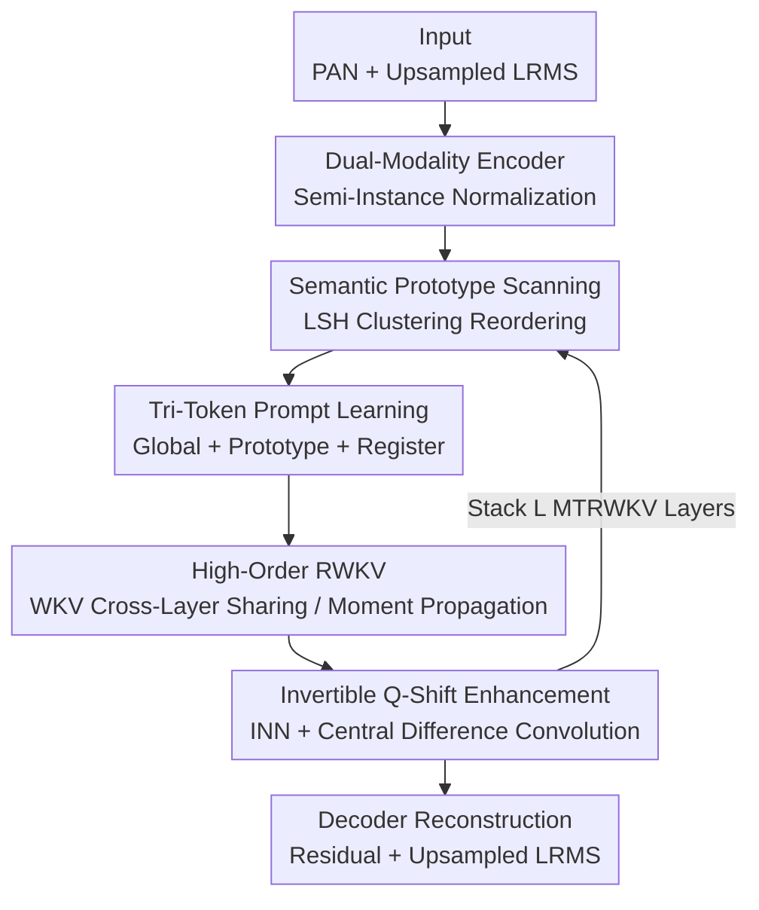

# Multigrain-aware Semantic Prototype Scanning and Tri-Token Prompt Learning Embraced High-Order RWKV for Pan-Sharpening

**Conference**: CVPR 2026  
**Paper**: [CVF Open Access](https://openaccess.thecvf.com/content/CVPR2026/html/Li_Multigrain-aware_Semantic_Prototype_Scanning_and_Tri-Token_Prompt_Learning_Embraced_High-Order_CVPR_2026_paper.html)  
**Code**: Not mentioned  
**Area**: Remote Sensing / Pan-sharpening  
**Keywords**: Pan-sharpening, Vision RWKV, Semantic Prototype Scanning, Prompt Learning, Invertible Neural Network

## TL;DR
Addressing the pan-sharpening task, this paper replaces the "semantic-agnostic fixed raster scanning" of Vision RWKV with a semantic prototype scanning driven by Locality Sensitive Hashing (LSH) clustering. Combined with a "Global + Prototype + Register" tri-token prompt mechanism and an invertible Q-shift high-frequency enhancement, it achieves new SOTA results across PSNR, SSIM, SAM, and ERGAS on three datasets: WorldView and GaoFen2.

## Background & Motivation
**Background**: Pan-sharpening aims to fuse a single-band panchromatic (PAN) image with rich textures and a low-resolution multispectral (LRMS) image with rich spectral information into a high-resolution multispectral image. Recently, Transformers have become the mainstream backbone due to long-range dependency modeling, pushing fusion quality to new heights.

**Limitations of Prior Work**: The $O(N^2)$ complexity of self-attention in Transformers is a hard bottleneck for high-resolution remote sensing imagery. The emerging Vision RWKV provides an attractive alternative with its linear-complexity recursive structure (spatial mixing + channel mixing). However, its Bi-directional WKV scanning (Bi-WKV) follows a **rigid raster order** (row-by-row and column-by-column), which introduces positional bias and remains entirely agnostic to the semantic structure of the image content.

**Key Challenge**: While the linear efficiency of RWKV is appealing, its "scanning order" is a hardcoded geometric sequence. Semantically related regions may be scanned far apart, leading to incoherent global interactions. Furthermore, high-order interactions typically rely on stacking blocks—recalculating WKV at every layer—which increases overhead. Additionally, linear attention is inherently a low-pass filter, leading to a natural loss of high-frequency details. These three issues combined limit the potential of RWKV in pan-sharpening.

**Goal**: To make RWKV scanning "semantic-aware," achieve "stack-free" high-order interactions, and ensure "lossless preservation" of high-frequency details.

**Key Insight**: The authors observe that since the scanning order can be rearranged, semantically similar tokens can be grouped together in the sequence before being fed into Bi-WKV. Moreover, WKV is mathematically equivalent to a first-order expectation, allowing for cross-layer sharing or moment summation to save computational resources.

**Core Idea**: Transforming RWKV with a "Semantic Prototype Scanning + Tri-token Prompting + Invertible Q-shift" trio to achieve semantic-aware global modeling and high-frequency fidelity while maintaining linear complexity.

## Method

### Overall Architecture
The input consists of a panchromatic image $I_P \in \mathbb{R}^{H\times W\times 1}$ and a low-resolution multispectral image $I_M \in \mathbb{R}^{h\times w\times C}$. They first pass through modality encoders with semi-instance normalization to obtain $F_P$ and $F_M$. Then, $L$ layers of MTRWKV (Multigrain-aware Scanning & Tri-token Prompting High-Order RWKV) modules are used for layer-wise refinement. Finally, a decoder reconstructs the residual and adds it to the upsampled $I_M$ to produce the fusion result $I_F$. The core modifications are concentrated within the MTRWKV module: it reorders tokens using semantic scanning, guides Bi-WKV fusion with three types of prompt tokens, and balances efficiency with high-frequency detail through cross-layer WKV sharing and invertible Q-shift.

### Key Designs

**1. Multigrain-aware Semantic Prototype Scanning: Making Scanning "Semantic-Aware" Instead of Row/Column Based**

Traditional RWKV Bi-WKV follows fixed raster scanning, which can separate semantically related regions at opposite ends of a sequence, causing incoherent global interactions. This paper employs **Locality Sensitive Hashing (LSH)** to cluster the value matrix $V_s$. LSH ensures that vectors with small Euclidean distances likely fall into the same hashing bucket. Using hash functions like $h(\vec v) = \lfloor \frac{\vec a\cdot \vec v + b}{r}\rfloor$ and running $L$ rounds of independent hashing, the space is partitioned into semantic cells. The sequence is rearranged using $\text{Reorder}(V_s, I)$ so that semantically related tokens enter the Bi-WKV consecutively, followed by an inverse reordering to restore the original spatial layout. Each cluster is also weighted by query density $w_j = \frac{\log(1+\sum_{i:G_i=j}1)}{\sum_k \log(1+\sum_{i:G_i=k}1)}$ to emphasize dense semantic clusters. This content-driven scanning path eliminates positional bias inherent in fixed grids.

**2. Tri-Token Prompt Learning: Guiding Fusion and Suppressing Artifacts with Global/Prototype/Register Priors**

Beyond reordering, the authors append three types of prompt tokens to inject semantic priors. **Prototype tokens** $P_c = \frac{1}{|G_c|}\sum_{i\in G_c} V_s^{(i)}$ represent the mean of each semantic cluster. The **Global token** $g = \frac{1}{T}\sum_i V_s^{(i)}$ provides the global context of the entire image. **Register tokens** $r = W_r V_s^I + b_r$ are learnable and specifically designed to absorb and discard noise or artifacts. The enhanced sequence $V_s^{enh} = [V_s^I; P_1,\dots,P_C; g; r]$ is fed into Bi-WKV. Outputs are then decomposed hierarchically: Global features $O^{global}$ are broadcast to all tokens, Prototype features $O^{proto}_c$ are broadcast back to their respective clusters, and Register outputs $O^{reg}$ are discarded to purify the representation.

**3. High-Order WKV Sharing and Moment Propagation: Achieving High-Order Interaction Without Stacking Blocks**

The authors re-examine the WKV structure as a first-order weighted function: $O_s = \sigma(R_s)\odot \text{WKV}(K_s, V_s)$, where $0<\sigma(R_s(i))<1$ and $\sum_i\sigma(R_s(i))=1$. Since $\sigma(R_s)$ satisfies constraints of a probability mass function, WKV is mathematically equivalent to a first-order expectation $O_s = \mathbb{E}_{v\sim p(R_s)}[v]\approx \mathbb{E}[V_s]$. Based on this, instead of stacking blocks for higher orders, they propose: **WKV Cross-Layer Sharing**, where adjacent layers in the same group reuse computed $\text{wkv}$ to save computation; and **Moment Propagation**, which uses a learnable momentum $\alpha$ to fuse WKV across groups: $\text{wkv}^{(1)}_{(j+1)} \leftarrow \alpha\cdot \text{wkv}^1_{(j)} + (1-\alpha)\cdot \text{wkv}^{\frac12}_{(j+1)}$, enabling high-order statistical interaction efficiently.

**4. Invertible Q-shift High-Frequency Enhancement: Compensating Details with Lossless Transformations**

Linear attention acts as a low-pass filter, removing high-frequency details; existing methods often rely on parameter-heavy operators for spatial enhancement. Noting that Q-shift is functionally equivalent to a depthwise separable $3\times 3$ convolution, this paper wraps **multi-scale Q-shift within an Invertible Neural Network (INN)**, making feature transformations lossless and efficient without excessive parameters. To actively restore high frequencies, **Central Difference Convolution (CDC)** is introduced in the value path: $O_h = O_s + \text{CDC}(K_s)$. This dual-path design (INN Invertible Q-shift + CDC) preserves spatial details while avoiding parameter explosion.

## Key Experimental Results

### Main Results
Evaluation was conducted on WorldView-II, WorldView-III, and GaoFen2 datasets, comparing against traditional methods (SFIM/GS/Brovey/IHS/GFPCA) and deep learning methods (PNN/PANNet/MSDCNN/SRPPNN/GPPNN/MutNet/SFINet/PanFlowNet). Metrics include PSNR↑, SSIM↑, SAM↓ (Spectral Angle Mapper), and ERGAS↓ (Relative Global Error).

| Dataset | Metric | Ours | Prev. SOTA | Note |
|--------|------|------|----------|------|
| WorldView-II | PSNR↑ | **42.3751** | 41.8548 (PanFlowNet) | +0.52 dB |
| WorldView-II | SSIM↑ | **0.9737** | 0.9725 (SFINet) | Higher structural similarity |
| WorldView-III | PSNR↑ | **31.3113** | 30.5971 (SFINet) | +0.71 dB, most significant gain |
| WorldView-III | SAM↓ | **0.0685** | 0.0741 (SFINet) | Better spectral fidelity |
| GaoFen2 | PSNR↑ | **47.8941** | 47.4712 (SFINet) | +0.42 dB |
| GaoFen2 | ERGAS↓ | **0.5115** | 0.5462 (SFINet) | Lower global error |

The proposed method achieves optimal performance across almost all metrics on the three datasets, with the largest PSNR improvement (~0.71 dB) on the challenging WorldView-III dataset, indicating the significance of semantic-driven scanning in complex scenes.

### Ablation Study
The paper validates the effectiveness of the three core components: Semantic Prototype Scanning, Tri-token Prompting, and Invertible Q-shift + High-order Sharing.

| Configuration | Function | Impact of Removal (Qualitative) |
|------|------|---------------------|
| Full model | Complete Model | Optimal across all three datasets |
| w/o Semantic Prototype Scan | Revert to fixed raster scan | Reintroduces positional bias; incoherent global interaction |
| w/o Tri-token Prompt | Lose semantic priors & artifact suppression | Fusion lacks semantic conditions; prone to artifacts |
| w/o Invertible Q-shift / CDC | Lose high-frequency compensation | Blurred spatial details; loss of high-frequency info |
| w/o WKV Sharing/Moment Prop | Revert to pure block stacking | Increased computational overhead |

### Key Findings
- **Semantic Scanning is the Primary Engine**: Replacing fixed raster scanning with LSH semantic clustering-driven scanning eliminates positional bias and ensures global coherence, serving as the most direct source of accuracy gain.
- **Register Tokens for "Purification"**: Within the tri-token setup, the register output is explicitly discarded after absorbing noise/artifact information, reflecting a "capture and discard" denoising strategy.
- **Efficiency via Mathematical Equivalence**: Viewing WKV as a first-order expectation allows cross-layer sharing and moment propagation to achieve high-order interactions without stacking blocks, keeping computation low.

## Highlights & Insights
- **Semanticizing the "Scanning Order"**: While sequence order is usually a fixed geometric prior, this paper treats it as a content-driven semantic reordering problem using LSH. This "reorder $\rightarrow$ model $\rightarrow$ restore" paradigm is transferable to any RWKV/linear attention vision task.
- **Clean Division of Tri-token Prompting**: Global tokens provide context, Prototype tokens handle regional semantics, and Register tokens specialize in denoising. Their roles are distinct, and the "disposable" register token is a clever trick for artifact suppression.
- **WKV = First-order Expectation Perspective**: Deriving the equivalence of WKV to a first-order expectation justifies cross-layer sharing and moment propagation, providing a fresh analytical angle for the linear attention family.
- **Lossless Invertible Q-shift**: Leveraging the equivalence of Q-shift to depthwise convolution within an INN achieves lossless feature transformation, offering an elegant compromise between high-frequency restoration and parameter efficiency.

## Limitations & Future Work
- **Dependency on LSH Quality**: The scanning path depends entirely on hash clustering. Improper hash parameters (bucket width $r$, rounds $L$) could lead to unstable clustering, affecting scanning order and fusion quality.
- **Specific to Pan-sharpening**: While the method is general, experiments are limited to three remote sensing pan-sharpening datasets. Transferability to other fusion/restoration tasks (e.g., hyperspectral super-resolution, deblurring) remains to be verified.
- **Lack of Comprehensive Quantitative Ablations**: Some parts of the text lack full numerical ablation tables and real-world inference speed/memory comparisons; the "linear complexity" advantage remains largely theoretical.
- **Future Directions**: Could replace LSH with stable learnable clustering or design differentiated scanning strategies for different modalities.

## Related Work & Insights
- **vs. Traditional CS/MRA/VO**: While traditional methods are efficient or theoretically sound, they often introduce spectral distortion or require manual tuning. This paper presents a data-driven deep learning method for end-to-end fusion.
- **vs. Transformer-based Pan-sharpening**: Transformers capture long-range dependencies well via $O(N^2)$ attention but struggle with high-res imagery. This paper utilizes linear-complexity RWKV while adding semantic awareness.
- **vs. Standard Vision RWKV**: Standard RWKV uses fixed raster Bi-WKV with positional bias. This paper systematically transforms it for fusion tasks via semantic prototype scanning and tri-token prompting.

## Rating
- Novelty: ⭐⭐⭐⭐⭐ Systematically grafting semantic clustering, prompt learning, and invertible transformations onto RWKV is highly innovative.
- Experimental Thoroughness: ⭐⭐⭐⭐ SOTA across three datasets/four metrics, though some quantitative speed/ablation details are missing from the summary.
- Writing Quality: ⭐⭐⭐⭐ Theoretical derivations (WKV as expectation) are clear, despite dense notation.
- Value: ⭐⭐⭐⭐ Provides a reusable semantic paradigm for linear attention backbones in remote sensing fusion.

<!-- RELATED:START -->

## Related Papers

- [\[ICCV 2025\] Pan-Crafter: Learning Modality-Consistent Alignment for Pan-Sharpening](../../ICCV2025/remote_sensing/pan-crafter_learning_modality-consistent_alignment_for_pan-sharpening.md)
- [\[CVPR 2026\] PhenoYieldNet: Learning Crop-Aware Phenological Responses for Multi-Crop Yield Prediction](phenoyieldnet_learning_crop-aware_phenological_responses_for_multi-crop_yield_pr.md)
- [\[CVPR 2026\] UniGeoRS: A Unified Benchmark for Tri-view Geo-Localization](unigeors_a_unified_benchmark_for_tri-view_geo-localization.md)
- [\[CVPR 2026\] Prompt-Free Unknown Label Generation for Open World Detection in Remote Sensing](prompt-free_unknown_label_generation_for_open_world_detection_in_remote_sensing.md)
- [\[CVPR 2026\] AVION: Aerial Vision-Language Instruction from Offline Teacher to Prompt-Tuned Network](avion_aerial_visionlanguage_instruction_from_offli.md)

<!-- RELATED:END -->
