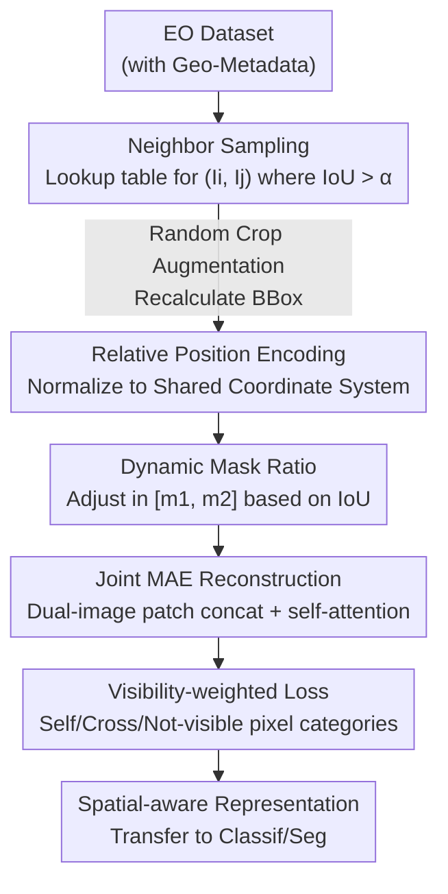

# NeighborMAE: Exploiting Spatial Dependencies between Neighboring Earth Observation Images in Masked Autoencoders Pretraining

**Conference**: CVPR 2026  
**Paper**: [CVF Open Access](https://openaccess.thecvf.com/content/CVPR2026/html/Zeng_NeighborMAE_Exploiting_Spatial_Dependencies_between_Neighboring_Earth_Observation_Images_in_CVPR_2026_paper.html)  
**Code**: https://github.com/LeungTsang/NeighborMAE  
**Area**: Remote Sensing / Self-supervised Learning  
**Keywords**: Masked Image Modeling, Earth Observation, Self-supervised Pretraining, Spatial Dependency, MAE

## TL;DR
NeighborMAE transforms MAE from "reconstructing a single remote sensing image" to "jointly reconstructing a pair of geographically adjacent images." By utilizing relative position encoding, an adaptive masking ratio based on IoU, and a reconstruction loss weighted by visibility, the model explicitly learns spatial dependencies between neighboring geographic features. It consistently outperforms baselines like SatMAE and ScaleMAE across multiple downstream remote sensing classification and segmentation tasks.

## Background & Motivation

**Background**: In the field of Earth Observation (EO), Masked Image Modeling (MIM) has become the dominant self-supervised paradigm. The MAE series (SatMAE, ScaleMAE, SatMAE++, CROMA, DOFA, etc.) learns transferable representations from massive unlabeled satellite imagery by masking most patches of a single satellite image and tasking the model with their reconstruction. This has been widely extended to multispectral, multi-temporal, and multi-modal data.

**Limitations of Prior Work**: Almost all MIM frameworks treat each image tile **as an isolated sample**—masking and reconstructing one tile at a time. However, the Earth's surface is continuous; a single satellite image is merely one small piece of a vast, spatially coherent "mosaic puzzle." Adjacent regional images (from satellite revisits, overlapping captures of different tasks, or spatial cropping) share significant contextual information such as terrain structures, land-use continuity, and man-made facility extensions, yet these are entirely ignored by existing MIM methods. While contrastive learning often utilizes these neighbor tiles as positive samples, they are rarely exploited in MIM reconstruction.

**Key Challenge**: Learning spatial dependencies between neighboring images is **not equivalent** to simply enlarging the input into a larger static image. Neighboring views often involve different acquisition times, varying viewing geometries, and different sensors, introducing actual "spatial relationships in change" rather than just different regions of the same image. Simply concatenating two neighboring images for joint reconstruction introduces **shortcut learning**: if a masked pixel is visible and relatively unchanged in the corresponding location of the neighbor image, the model can simply "copy-paste" from the neighbor to pass the task without learning meaningful features.

**Goal**: (1) Explicitly model spatial (and incidentally temporal) dependencies between adjacent EO images within the MIM framework; (2) Ensure the pretraining task remains sufficiently challenging to prevent the model from becoming "lazy" due to additional information from neighbor images.

**Core Idea**: Change the MAE reconstruction target from "one image" to "a pair of neighboring images." All visible patches are concatenated into the encoder to establish cross-image relationships via self-attention for joint reconstruction. Shortcut learning is prevented through IoU-driven dynamic masking and visibility-weighted loss.

## Method

### Overall Architecture
NeighborMAE is built upon the original MAE: the encoder processes only visible patches, the decoder uses mask tokens to complete masked regions, and reconstruction occurs in the pixel space. Its key modification is **jointly processing a pair of neighboring images as a single training sample**. The pipeline is as follows: first, a pair of neighbor images $(I_i, I_j)$ is sampled from the dataset based on Geographical Intersection over Union (IoU). After augmentations like random cropping, their respective geographic bounding boxes are recalculated. The relative positions of both images are encoded into a shared coordinate system. The masking ratio is determined by the overlap degree of the pair. Then, the visible patches from both images are concatenated into the MAE for joint reconstruction via self-attention. Finally, the reconstruction loss for cross-image visible pixels is scaled using weights designed based on "input visibility" to prevent shortcut learning. After pretraining, the encoder serves as a backbone for downstream classification/segmentation.

### Key Designs

**1. Neighbor Image Sampling: Defining "Neighbor" via Geo-IoU and Pre-computed Lookups**

To jointly reconstruct a pair of neighbor images, "neighboring" must be defined. This paper uses the most direct standard: overlap in surface coverage. Given a dataset $D$ with metadata, the geo-referenced bounding box $(\phi_{min}, \phi_{max}, \lambda_{min}, \lambda_{max})$ (latitude/longitude range) is used to calculate pairwise IoU. Images are neighbors if IoU exceeds a threshold $\alpha$:

$$\mathcal{N}(I_i) = \{I_j \mid I_j \in D,\ IoU(I_i, I_j) > \alpha\},\ I_i \in D$$

This neighbor set is **pre-computed offline and stored as a lookup table**. During training, for each sampled $I_i$, an $I_j$ is randomly drawn from $\mathcal{N}(I_i)$, avoiding slow online searches. The threshold $\alpha$ is tuned per dataset: 0.1 for object-centric fMoW (excluding weak dependencies where one image is a tiny crop of another) and 0.0 for windowed Satellogic (allowing adjacent patches as neighbors). Notably, sampling **only considers spatial coverage**, without constraints on time, mission, or cloud cover—these differences provide useful diversity.

**2. Relative Position Encoding: Integrating Relative Positions into a Shared Coordinate System**

To learn spatial dependencies, the model must know the relative positions and overlap of the two images. However, since downstream applications may lack geo-metadata, absolute coordinates cannot be used directly. The paper **normalizes the bounding boxes of the pair to $[0,1]$ using their own combined min/max coordinates**, obtaining $top_i, bottom_i, left_i, right_i$ in a shared system. For single-image input, this reverts to a constant $(0,1,0,1)$. These relative positions are calculated entirely in the image coordinate system. After normalization, patch-level bounding boxes are mapped to ViT dimensions via standard sine-cosine encoding, supplemented with a **learnable image-level embedding** to distinguish which image a token belongs to. Since random cropping changes coverage, bounding boxes are recalculated post-crop to ensure that even originally identical images (temporal revisits) provide real spatial offsets to learn from.

**3. Dynamic Mask Ratio: Higher Overlap, Heavier Masking to Maintain Difficulty**

Introducing a neighbor image provides extra information, making reconstruction easier—especially when images overlap significantly, similar to applying MAE to video which often requires higher masking rates. A fixed masking rate would make high-overlap samples too easy and low-overlap ones potentially too hard. The masking ratio is **linearly interpolated based on the IoU of the augmented image pair**:

$$mask\_ratio = m_1 + IoU(A(I_i), A(I_j)) \cdot (m_2 - m_1)$$

As overlap (redundancy) increases, the masking ratio moves toward the upper bound $m_2$ to maintain task difficulty; with no overlap, it reverts to $m_1$ (consistent with original MAE). Experiments show $m_1=0.75$ and $m_2=0.85$ are optimal.

**4. Visibility-weighted Loss: Discounting Cross-visible Pixels to Block Copy Shortcuts**

This is the core mechanism for preventing shortcuts. During joint reconstruction, pixels in $I_i$ are divided into three categories: **self-visible** (not masked in the current image), **cross-visible** (masked in $I_i$ but visible in the corresponding location of $I_j$), and **not-visible** (masked in both). The risk lies in cross-visible pixels: if they are visible in the neighbor and haven't changed much, the model can "copy-paste" from the neighbor, bypassing spatial reasoning.

The paper establishes pixel correspondence via coordinate transformation. If $I_i'$ and $I_j'$ are the augmented images, a pixel $p_i$ in $I_i'$ corresponds to $p_i^j = T_j^{-1} T_i\, p_i$ in the neighbor. The MSE reconstruction loss for each pixel is then scaled by a weight:

$$weight = \begin{cases} 0 & p_i \in P_{self} \\ \min\!\left(\dfrac{MSE(I_j'(p_i^j),\, I_i'(p_i))}{MSE(R_i(p_i),\, I_i'(p_i))},\ 1\right) & p_i \in P_{cross} \\ 1 & p_i \in P_{not} \end{cases}$$

Self-visible pixels have a weight of 0 (consistent with MAE not reconstructing seen areas). Not-visible pixels have a weight of 1. For cross-visible pixels, the weight's numerator is the error of "using the neighbor's corresponding pixel as the prediction," while the denominator is the model's "actual prediction error." If the neighbor pixel is nearly identical to the target (low numerator), it is a "copyable" shortcut, and the loss weight is suppressed; if the neighbor differs significantly (high numerator), the weight is capped at 1 for normal reconstruction. This weight is **detached from the gradient graph**.

### Loss & Training
Reconstruction uses MSE, summed after visibility weighting. The backbone is ViT-Large-16, trained for 800 epochs on fMoW-RGB or 50 epochs on Satellogic-RGB with a batch size of 2048 and a learning rate of $1.5\text{e-}4 \times bs/256$. To ensure a fair "computation per epoch" comparison with standard MAE, epochs are defined by the total number of processed images equaling the dataset size.

## Key Experimental Results

### Main Results
ViT-Large-16 pretrained on fMoW-RGB or Satellogic-RGB, transferred to 7 RGB remote sensing downstream tasks (5 classification + 2 segmentation). Results are reported as "Frozen Backbone / Fine-tuned" (mean of 3 runs).

| Task (Metric) | MAE (fMoW) | NeighborMAE (fMoW) | NeighborMAE (Satl.) | DOFA |
|---|---|---|---|---|
| fMoW Classif. (Acc) | 66.8 / 78.2 | **68.8 / 79.3** | 58.8 / 77.9 | 62.6 / 78.0 |
| UC Merced (Acc) | 87.8 / 94.5 | 91.4 / 97.6 | 88.8 / 96.2 | **96.4 / 98.3** |
| RESISC45 (Acc) | 89.8 / 96.0 | 91.0 / 96.6 | 88.5 / 95.6 | **94.5 / 97.4** |
| FireRisk (Acc) | 60.7 / 63.5 | 61.4 / 64.2 | 60.4 / 64.0 | 60.3 / 64.0 |
| ForestNet (Acc) | 50.1 / 55.5 | **52.4 / 57.0** | 51.5 / 56.8 | 43.8 / 54.0 |
| FBP Seg. (mIoU) | 58.8 / 63.9 | **60.3 / 66.6** | 58.4 / 63.7 | 59.7 / 66.2 |
| PASTIS-HD Seg. (mIoU) | 31.1 / 33.9 | 31.8 / **36.1** | 32.5 / 35.4 | 32.2 / 35.6 |

Compared to the direct MAE baseline: fMoW classification linear probe +2.0%, fine-tuning +1.1%; FBP segmentation fine-tuning +2.7% mIoU, PASTIS-HD +2.2% mIoU. Within its research line (SatMAE/ScaleMAE/SatMAE++/CrossScale), NeighborMAE leads in in-domain fMoW, fire risk, and deforestation tasks. Compared to DOFA (pretrained on large-scale multi-modal/spectral data), it remains competitive on RGB tasks and even slightly leads on fMoW.

### Ablation Study

**Source of Gains (Comparing different "extended inputs" under the same token budget, ViT-Base)**:

| Input Type | fMoW Acc | FBP mIoU |
|---|---|---|
| (a) Base single image | 58.0 / 76.5 | 53.5 / 58.2 |
| (b) Pure image enlargement | 58.2 / 76.7 | 53.8 / 58.6 |
| (c) Spatially adjacent images | 58.7 / 76.8 | 54.1 / 58.9 |
| (d) Multi-temporal images (same loc) | 58.2 / 77.0 | 54.5 / 58.7 |
| (e) Multi-temporal neighbor images | **61.7 / 77.7** | **56.0 / 60.4** |

**Component Ablation**:

| Component | Config | fMoW Acc | Description |
|---|---|---|---|
| Dynamic Mask | Fixed 0.75 | 61.0 / 77.4 | Performance drops |
| Dynamic Mask | Fixed 0.80 | 60.8 / 77.3 | Worse than dynamic |
| Dynamic Mask | **m1=0.75, m2=0.85** | **61.7 / 77.7** | Optimal |
| Weighted Loss (Satl.) | full reconstruction | 50.2 / 74.1 | Includes all non-masked pixels; severe degradation |
| Weighted Loss (Satl.) | cross weight=1 | 51.8 / 75.1 | No discounting; performance drops |
| Weighted Loss (Satl.) | **ours** | **52.4 / 75.8** | Suppresses cross-visible weights |

### Key Findings
- **Gains stem from "neighbors" rather than "more tokens"**: Simply enlarging the image size (b) yields negligible gains. Using neighbor images (c) starts to show improvement, while combining spatial and temporal neighbors (e) yields the highest gain (fMoW Acc 58.0→61.7). This suggests the "spatial diversity in change" provided by neighbor images is the key factor.
- **Weighted loss is critical for low-change data**: fMoW contains significant multi-temporal variance, making cross-visible pixels naturally hard to copy. However, Satellogic has fewer revisits; neighbor images often come from the same image's crops, making "copy shortcuts" a high risk. Here, suppressing cross-visible weights improves accuracy from 51.8 to 52.4.
- **Low overhead**: Compared to MAE, joint encoding/decoding of two images slightly increases overhead due to $O(n^2)$ self-attention complexity (batch time 0.122s→0.134s, VRAM 15.5→19.6 GB/GPU). However, it remains much cheaper than the multi-scale reconstruction of SatMAE++ (0.381s, 58.7 GB).

## Highlights & Insights
- **Redefining the "Sample Unit" in MIM**: Upgrading the training sample from an "isolated tile" to a "geographically adjacent pair" taps into the spatial continuity signals inherently present in EO data, which were previously exclusive to contrastive learning.
- **Visibility-weighted loss is a highly reusable trick**: Using the error of "using the baseline as prediction" as a numerator to adaptively judge whether a pixel can be "copied" is more nuanced than binary exclusion of cross-visible pixels. This idea of "inverse weighting based on baseline difficulty" is transferable to any reconstruction task with redundant correspondences.
- **Dynamic masking quantifies the "more information, easier task" intuition**: Linearly controlling difficulty via IoU is simple and interpretable. The optimal range [0.75, 0.85] aligns with the intuition that 0.75 is for zero overlap and 0.85 is for full overlap.
- **Relative Position Encoding bypasses absolute geo-metadata dependency**: Normalizing to a shared coordinate system allows the model to work without latitude/longitude during downstream tasks.

## Limitations & Future Work
- **RGB Only**: The authors explicitly leave multispectral and multi-modal extensions for future work to isolate spatial dependency gains. Since the true value of EO lies largely in multispectral data, current results do not represent the full potential.
- **Limited to two neighbor images**: The $O(n^2)$ complexity of self-attention makes scaling to more neighbors very expensive; token reduction or new architectures would be required.
- **Dependency on geo-metadata for sampling**: Pretraining requires geo-referenced bounding boxes to build lookup tables, making it inapplicable to datasets without metadata (though downstream tasks are unaffected).
- **Comparison with large-scale models**: NeighborMAE only "matches" DOFA on certain tasks, suggesting that the ceiling for RGB-only, medium-scale data is limited.

## Related Work & Insights
- **vs MAE / SatMAE**: These reconstruct single images. NeighborMAE employs joint reconstruction with cross-image self-attention to learn spatial dependencies, consistently outperforming them under identical settings.
- **vs ScaleMAE / SatMAE++**: The latter capture spatial information through multi-scale reconstruction based on synthetic scaling, which is computationally expensive. NeighborMAE uses the natural spatial continuity of real neighbor images, which is cheaper and more direct.
- **vs Cross-Scale MAE**: While it uses neighbor images via augmentation, it processes them separately with an auxiliary contrastive objective. NeighborMAE models them jointly within the reconstruction objective.
- **vs Contrastive Learning (SeCo / Tile2Vec / GASSL)**: These treat nearby tiles as positive samples, relying on similarity assumptions that can fail at geographic boundaries. NeighborMAE avoids similarity assumptions via the reconstruction target, making it more robust.

## Rating
- Novelty: ⭐⭐⭐⭐ First to jointly model real neighboring EO images in an MIM reconstruction target with supporting anti-shortcut mechanisms.
- Experimental Thoroughness: ⭐⭐⭐⭐ Extensive testing across 2 datasets, 7 tasks, and both frozen/fine-tuned settings. Clear ablation of gain sources.
- Writing Quality: ⭐⭐⭐⭐ Clear motivation, complete formulas, and convincing ablation designs.
- Value: ⭐⭐⭐⭐ Provides a practical, cost-effective direction for EO self-supervised learning with a reusable weighted loss trick.

<!-- RELATED:START -->

## Related Papers

- [\[CVPR 2026\] RAMEN: Resolution-Adjustable Multimodal Encoder for Earth Observation](ramen_resolution-adjustable_multimodal_encoder_for_earth_observation.md)
- [\[CVPR 2026\] OlmoEarth: Stable Latent Image Modeling for Multimodal Earth Observation](olmoearth_stable_latent_image_modeling_for_multimodal_earth_observation.md)
- [\[ICLR 2026\] Earth-Agent: Unlocking the Full Landscape of Earth Observation with Agents](../../ICLR2026/remote_sensing/earth-agent_unlocking_the_full_landscape_of_earth_observation_with_agents.md)
- [\[CVPR 2026\] WRIVINDER: Towards Spatial Intelligence for Geo-locating Ground Images onto Satellite Imagery](wrivinder_towards_spatial_intelligence_for_geo-locating_ground_images_onto_satel.md)
- [\[ECCV 2024\] Masked Angle-Aware Autoencoder for Remote Sensing Images](../../ECCV2024/remote_sensing/masked_angle-aware_autoencoder_for_remote_sensing_images.md)

<!-- RELATED:END -->
