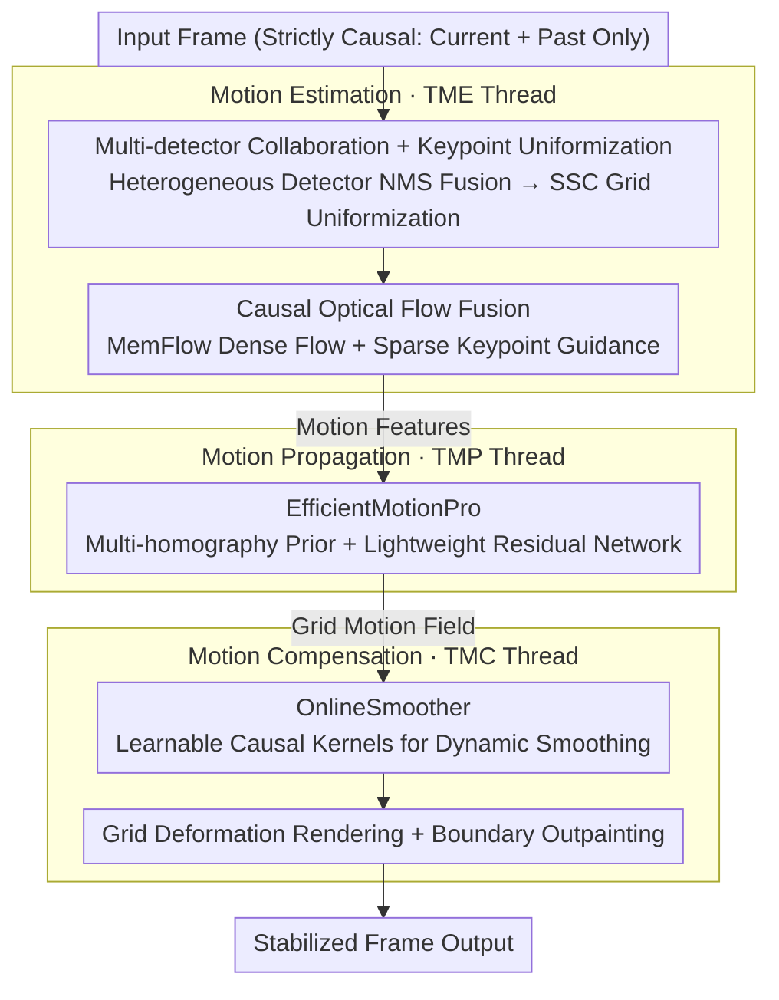

# No Labels, No Look-Ahead: Unsupervised Online Video Stabilization with Classical Priors

**Conference**: CVPR 2026  
**arXiv**: [2602.23141](https://arxiv.org/abs/2602.23141)  
**Code**: [GitHub](https://github.com/liutao23/LightStab.git)  
**Area**: Remote Sensing  
**Keywords**: Video Stabilization, Unsupervised, Online Processing, Optical Flow Estimation, UAV

## TL;DR

The authors propose LightStab, an unsupervised online video stabilization framework. By combining a classical three-stage pipeline (motion estimation → motion propagation → motion compensation) with multi-threaded asynchronous buffering, it achieves performance comparable to offline SOTA for the first time across five benchmarks. Additionally, the first multi-modal UAV aerial stabilization dataset, UAV-Test (including visible and infrared light), is released.

## Background & Motivation

**Background**: Video stabilization aims to suppress camera jitter and improve visual quality. Classical methods follow a three-stage pipeline: motion estimation → motion smoothing → frame compensation. Based on the motion model dimension, these are categorized into 2D (affine/homography/optical flow), 2.5D (limited 3D cues), and 3D (depth + point clouds) methods. Deep learning methods (DUT, NNDVS, RStab, etc.) directly generate stabilized frames through end-to-end learning.

**Limitations of Prior Work**:
   - **Perceptual Limitations**: Classical methods rely on handcrafted feature detectors (SIFT, ORB), which are not robust in weakly textured, occluded, or large-motion scenarios. Uneven keypoint distribution leads to biased motion estimation.
   - **Smoothing Limitations**: Fixed smoothing strategies fail to generalize, resulting in residual jitter. Learning-based smoothing lacks geometric interpretability and may cause over-smoothing or distortion.
   - **Online Processing Limitations**: Most high-quality stabilizers (both classical and learning-based) rely on offline batch processing or future frames, introducing latency. Learning-based methods also require large amounts of paired labeled data and computational resources.

**Key Challenge**: It is difficult to simultaneously achieve unsupervised, online, and high-quality results. The best existing online method (NNDVS) still shows significant gaps in certain scenarios, and current benchmarks primarily focus on handheld visible-light videos, failing to cover practical needs like nighttime UAV remote sensing.

**Goal**: Design a completely unsupervised, strictly causal (no future frames used) online video stabilization framework that matches or exceeds offline SOTA in quality while extending to multi-modal UAV scenarios.

**Key Insight**: Instead of an end-to-end approach, the authors return to the classical three-stage pipeline but strengthen each stage with modern components—using multi-detector collaboration and optical flow instead of single handcrafted features, a lightweight self-supervised network instead of fixed filters, and multi-threaded parallelism to eliminate serial latency bottlenecks.

**Core Idea**: Classical three-stage pipeline + modern components (multi-detector collaboration, causal optical flow fusion, self-supervised motion propagation network, online smoothing with dynamic kernels) + system-level multi-threaded optimization = high-quality unsupervised online stabilization.

## Method

### Overall Architecture

LightStab avoids the end-to-end black box, returning to the "motion estimation → motion propagation → motion compensation" framework. Each step is strictly causal, utilizing only current and past frames. For an incoming frame, the **motion estimation** stage uses multi-detector collaboration for uniform keypoint distribution, followed by causal optical flow from MemFlow to supplement sparse keypoints with dense cues, outputting a motion feature vector $\mathbf{m}_t = [x_{kp}; y_{kp}; u; v]$. Next, in the **motion propagation** stage, EfficientMotionPro diffuses these sparse motions into a grid-based motion field $\Delta g_t$ covering the entire frame. Finally, in the **motion compensation** stage, OnlineSmoother uses a set of learnable causal kernels to smooth the grid trajectories, calculating compensation displacement and rendering the stabilized frame.

To ensure causality without being hindered by serial latency, the three stages are split into three independent threads (TME/TMP/TMC) for asynchronous pipelining, with intermediate results passed via FIFO shared queues. This reduces the total pipeline latency from "serial accumulation of three stages" to "governed by the slowest stage"—a system-level design critical for real-time execution on edge devices.

### Key Designs

**1. Multi-detector Collaboration + Keypoint Uniformization: Correcting Motion Estimation Bias**

Classical methods use a single handcrafted detector (e.g., SIFT, ORB), causing keypoints to cluster in texture-rich areas. This results in biased motion estimation insensitive to global jitter. This framework employs a heterogeneous detector set $\mathcal{D} = \{D_m^{trad}\} \cup \{D_n^{deep}\}$. Traditional and deep detectors extract keypoints, which are fused via NMS after confidence normalization: $\tilde{K}_t = \text{NMS}(\bigcup_j w_j \cdot \tilde{K}_t^{(j)})$. 

To further prevent clustering, SSC (Spatial Selective Clustering) partitions the image into $G_x \times G_y$ grids, keeping only the top-$k$ points per grid and enforcing a minimum distance $\tau$ between points. This ensures uniform spatial coverage, correcting the motion estimation bias. Causal dense flow from MemFlow (relying only on $\{I_{t-1}, I_t\}$) is then fused using the keypoint neighborhood mask $M_t$, resulting in a re-weighted flow field $\hat{\mathbf{f}}_{t\leftarrow t-1}$ and motion features $\mathbf{m}_t$.

**2. EfficientMotionPro: Diffusing Sparse Motion via "Rigid Prior + Non-rigid Residual"**

The challenge in generating a dense grid motion field from sparse keypoints is fitting complex dynamic scenes with a lightweight network. The approach follows two steps: first, generating a base displacement via **multi-homography priors** (clustering keypoints via K-means and estimating per-cluster homographies via RANSAC); second, using a lightweight Ghost+ECA backbone to predict the non-rigid residual $\Delta g_{res,t}$ relative to the base $\Delta g_{base,t}$. 

This reduces the learning task to "non-rigid residuals relative to a rigid model," significantly lowering training difficulty. The module has only ~22.9K parameters. Multi-homography allows for inconsistent motion patterns (foreground vs. background). Training uses three self-supervised losses: keypoint consistency $\mathcal{L}_{kp}$ (Charbonnier penalty with adaptive weights), projection consistency $\mathcal{L}_{proj}$, and grid structure preservation $\mathcal{L}_{struct}$.

**3. OnlineSmoother: Learnable Causal Kernels for Adaptive Smoothing**

This module eliminates high-frequency jitter while preserving intentional camera motion. Unlike fixed filters (Gaussian or Mean) that over-smooth large motions, this uses a Lite LS-3D encoder for spatio-temporal features and a Star-gated decoder to predict 3-tap causal kernels ($k^x, k^y$). Smoothing is applied recursively:

$$S_t^x = \frac{\lambda \sum_r k_{t,r}^x S_{t-r}^x + O_t^x}{1 + \lambda \sum_r |k_{t,r}^x|}$$

where $\lambda=100$ controls intensity and $L=7$ frames is the causal window. Kernels are calculated in real-time, allowing adaptive smoothing. A frequency domain loss $\mathcal{L}_{freq}$ (DFT weighted) suppresses high-frequency oscillations. Training also includes time-adaptive second-order penalties $\mathcal{L}_{time}$, spatial distortion constraints $\mathcal{L}_{spatial}$, and projection consistency $\mathcal{L}_{proj}$.

**4. Multi-threaded Asynchronous Pipeline: Optimizing for Edge Real-time Execution**

The causal constraint typically forces serial execution. LightStab binds the three stages to independent threads (TME/TMP/TMC) using FIFO shared queues. This allows different frames to be processed at different stages simultaneously. The steady-state throughput is determined by the slowest stage:

$$S = \frac{t_{est} + t_{prop} + t_{smooth}}{\max\{t_{est}, t_{prop}, t_{smooth}\}}$$

A back-pressure mechanism prevents memory overflow by blocking upstream threads if a downstream stage slows down. This design enables ~13 FPS (78.94ms/frame) on Jetson AGX Orin, over 4x faster than NNDVS (2.94 FPS).

### Loss & Training

**EfficientMotionPro**: $\mathcal{L} = 10\mathcal{L}_{kp} + 40\mathcal{L}_{proj} + 40\mathcal{L}_{struct}$, Adam optimizer, OneCycleLR (peak lr $2\times10^{-4}$), 100 epochs, batch=64, ~12h on RTX 4090.

**OnlineSmoother**: $\mathcal{L}_{total} = \mathcal{L}_{temp} + 10\mathcal{L}_{spatial} + 5\mathcal{L}_{proj}$, where $\mathcal{L}_{temp} = 20\mathcal{L}_{time} + \mathcal{L}_{freq}$. Batch=1 to maintain causality, gradient clipping threshold 5.0, ~2.5h.

Black frame boundaries are filled using ProPainter as a post-processing outpainting step.

## Key Experimental Results

### Main Results

Comparison across 5 datasets using Cropping Ratio (C), Distortion Value (D), and Stability Score (S) (higher is better):

| Method | Type | NUS (C/D/S) | DeepStab (C/D/S) | Selfie (C/D/S) | GyRo (C/D/S) | UAV-Test (C/D/S) |
|------|------|------------|-----------------|---------------|-------------|-----------------|
| DUT | Offline | 0.98/0.88/0.85 | 0.99/0.95/0.95 | 0.99/0.98/0.93 | 0.99/0.98/0.89 | 0.95/0.89/0.94 |
| RStab | Offline | 1.00/0.99/0.94 | 1.00/0.98/0.96 | 1.00/0.92/0.95 | 1.00/0.95/0.92 | 1.00/0.96/0.94 |
| NNDVS | Online | 0.92/0.98/0.87 | 0.93/0.91/0.84 | 0.97/0.92/0.91 | 0.99/0.93/0.88 | 0.89/0.87/0.84 |
| Liu et al. | Online | 0.72/0.89/0.89 | 0.89/0.88/0.85 | 0.79/0.89/0.85 | 0.99/0.94/0.89 | 0.82/0.89/0.85 |
| **Ours** | **Online** | **0.95/0.98/0.90** | **0.94/0.91/0.85** | **0.98/0.93/0.91** | **0.99/0.96/0.93** | **0.94/0.90/0.89** |

### Ablation Study

| Configuration | Description |
|------|------|
| w/o MP (A1) | Removing motion propagation reduces D and PSNR; global motion modeling degrades |
| w/o TS (A2) | Removing smoothing reduces structural stability and hurts D |
| w/o MP&TS (A3) | Removing both leads to the worst performance, proving complementarity |
| w/o Loss_kp (A4) | Removing keypoint consistency weakens motion supervision |
| w/o Homo (A6) | Replacing multi-homography with single homography causes jitter/distortion |
| w/o KPC (A7) | Excluding collaborative detection results in uneven keypoints and lower D |
| Window L=5/7/9 | L=5 improves stability but lowers fidelity; L=7 is optimal |
| Full model (A10) | All modules + L=7 achieves the highest composite score |

### Key Findings

- **Online Rivals Offline**: On the GyRo dataset (C=0.99, D=0.96, S=0.93), the proposed online performance competes with the strongest offline method, Gavs.
- **Superiority on UAV-Test**: Significant improvements over existing online methods (vs NNDVS: +0.05 C, +0.03 D, +0.05 S) on the new UAV dataset.
- **Edge Deployment Ready**: Achieves ~13 FPS (78.94ms/frame) on Jetson AGX Orin, over 4x faster than NNDVS.
- **Complementary Components**: Motion propagation and trajectory smoothing are highly complementary; removing both (A3) results in the most significant degradation.

## Highlights & Insights

- **Hybrid Strategy of Classical Pipeline + Modern Components**: Retains the interpretability and controllability of the three-stage pipeline while replacing weak links with learning-based components. This "principled engineering hybrid" is better suited for deployment than pure end-to-end black boxes.
- **Data Independence via Self-Supervised Training**: Both core networks (EfficientMotionPro and OnlineSmoother) are trained with self-supervised objectives, eliminating the need for paired stable/unstable video data.
- **Sophisticated Multi-threaded Design**: Reduces serial latency from $t_1+t_2+t_3$ to $\max(t_1,t_2,t_3)$, ensuring resource safety via back-pressure.

## Limitations & Future Work

- **Dependence on External Optical Flow**: Relies on MemFlow for causal flow; its accuracy in complex scenes may be limited. Investigating more efficient flow models is a future direction.
- **Non-Online Outpainting**: Frame boundary filling uses ProPainter as post-processing. A lighter, online-friendly outpainting technology is needed.
- **Lambertian Camera Model**: Uses a simple 2D motion model, which may fail in scenes with extreme parallax or 3D structural changes.
- **Limited UAV-Test Scale**: With only 92 sequences, the dataset is small and lacks scene diversity; it serves as a starting point for larger UAV benchmarks.

## Related Work & Insights

- **vs DUT**: DUT also combines classical pipelines with neural networks but is an offline method relying on global smoothing. LightStab's causal design (no future frames) is the key differentiator.
- **vs NNDVS**: NNDVS lacks robustness in complex scenes and relies on inaccessible motion estimation frameworks. LightStab significantly enhances perception robustness via multi-detector collaboration.
- **vs RStab**: RStab is a powerful offline method using neural rendering; LightStab achieves comparable quality under online constraints with much faster inference.

## Rating

- Novelty: ⭐⭐⭐⭐ Systematic innovation in component design (multi-detector, multi-homography, causal kernels), though the core idea is a modernization of classical pipelines.
- Experimental Thoroughness: ⭐⭐⭐⭐⭐ Extremely comprehensive: 5 datasets, full ablation, user study, edge device testing, and rich visualization.
- Writing Quality: ⭐⭐⭐⭐ Clear structure, complete derivations, and very detailed supplementary materials.
- Value: ⭐⭐⭐⭐ Strong practical value: first online method rivaling offline performance, unsupervised training, and a new dataset.

<!-- RELATED:START -->

## Related Papers

- [\[CVPR 2026\] Exploring Spatiotemporal Feature Propagation for Video-Level Compressive Spectral Reconstruction](exploring_spatiotemporal_feature_propagation_for_video-level_compressive_spectra.md)
- [\[CVPR 2026\] Revisiting the Necessity of Full Accuracy: Weakly Supervised Object-Level Offset Correction for Misaligned Building Labels](revisiting_the_necessity_of_full_accuracy_weakly_supervised_object-level_offset_.md)
- [\[AAAI 2026\] UniABG: Unified Adversarial View Bridging and Graph Correspondence for Unsupervised Cross-View Geo-Localization](../../AAAI2026/remote_sensing/uniabg_unified_adversarial_view_bridging_and_graph_correspondence_for_unsupervis.md)
- [\[ECCV 2024\] Cross-Platform Video Person ReID: A New Benchmark Dataset and Adaptation Approach](../../ECCV2024/remote_sensing/cross-platform_video_person_reid_a_new_benchmark_dataset_and_adaptation_approach.md)
- [\[CVPR 2026\] Cross-modal Fuzzy Alignment Network for Text-Aerial Person Retrieval and A Large-scale Benchmark](cross-modal_fuzzy_alignment_network_for_text-aerial_person_retrieval_and_a_large.md)

<!-- RELATED:END -->
