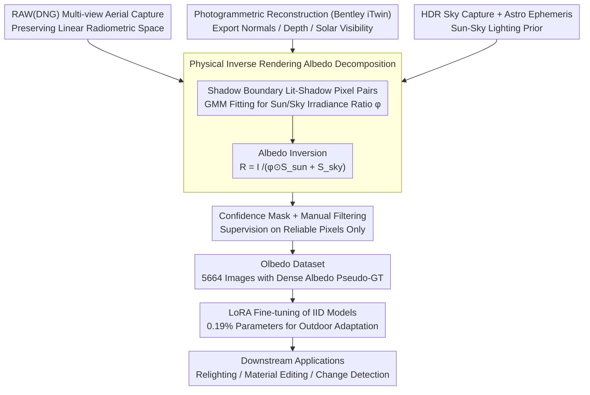

# Olbedo: An Albedo and Shading Aerial Dataset for Large-Scale Outdoor Environments

**Conference**: CVPR 2026  
**arXiv**: [2602.22025](https://arxiv.org/abs/2602.22025)  
**Code**: [Project](https://gdaosu.github.io/olbedo/)  
**Area**: Remote Sensing  
**Keywords**: Intrinsic Image Decomposition, Albedo, Aerial Dataset, Inverse Rendering, Urban Digital Twin

## TL;DR

Olbedo proposes the first large-scale real-world aerial albedo-shading decomposition dataset (5,664 UAV images, 4 landscapes, multi-illumination across years). It generates multi-view consistent pseudo-ground truth annotations through a physical inverse rendering pipeline. The study demonstrates that synthetic pre-training combined with Olbedo LoRA fine-tuning significantly improves outdoor albedo prediction and supports downstream applications such as relighting, material editing, and scene change analysis.

## Background & Motivation

**Background**: Intrinsic Image Decomposition (IID) aims to separate an image into albedo $R$ and shading $S$, satisfying $I = R \cdot S$. This serves as the foundation for relighting, material editing, and 3D content creation. Deep learning has recently advanced IID from CNNs (NIID-Net) to diffusion models (Intrinsic Image Diffusion, RGB↔X, Marigold-IID), but these advances are almost entirely limited to **indoor or synthetic environments**.

**Limitations of Prior Work**: The core obstacle to advancing real-world outdoor IID is the **lack of large-scale dense ground-truth datasets**. Existing datasets fall into three categories:
   - **Synthetic Datasets** (MPI Sintel, CGIntrinsics, InteriorVerse, Hypersim): Perfect ground truth but suffer from sim-to-real gaps and are mostly indoor/object-level.
   - **Real Controlled Datasets** (MIT Intrinsics, MID, DIR): Use multiple lighting conditions to compute pseudo-ground truth, but are limited to small-scale indoor scenes.
   - **Real In-the-wild Datasets** (IIW): Real images with only sparse relative judgments rather than dense albedo maps.
   
   **Key Blank**: No large-scale, real-world, densely annotated outdoor aerial IID dataset exists.

**Key Challenge**: Outdoor scenes are affected by dynamic and complex lighting (sun + sky), making it impossible to control lighting as in indoor settings to obtain ground truth. An alternative method is required to generate reliable outdoor albedo supervision signals.

**Goal**: To construct the first large-scale real-world aerial albedo-shading dataset providing dense pseudo-ground truth supervision, enabling existing IID models to adapt to outdoor aerial scenarios.

**Key Insight**: Photogrammetric reconstruction provides precise 3D geometry (normals, depth, shadow maps), combined with astronomical ephemeris to determine solar positions. A physical sun-sky lighting model can then estimate albedo from lit-shadow pixel pairs at shadow boundaries—obtaining physically consistent albedo annotations without controlled lighting.

**Core Idea**: Use a physical inverse rendering pipeline to generate dense albedo pseudo-ground truth from multi-view aerial RAW images, building the first outdoor aerial IID dataset. This allows models pre-trained on synthetic data to adapt to real outdoor scenes via lightweight fine-tuning.

## Method

### Overall Architecture

The lack of ground truth in outdoor IID stems from the inability to toggle lights to separate albedo and illumination. Olbedo's strategy replaces "controlled lighting" with "leveraging geometry + physical lighting model inversion." The data production pipeline operates as follows: multi-view aerial acquisition is performed using DJI Phantom 4 Pro in RAW (DNG) format to preserve the linear radiometric space; photogrammetric reconstruction via Bentley iTwin Capture (~3cm precision) extracts normals, depth, and shadow maps; meanwhile, HDR full-sky radiance is captured as a lighting prior using fish-eye cameras with 11-stop bracketed exposure during 2025 flights. With geometry and lighting established, a physical sun-sky inverse rendering optimization is run for each image to output albedo/shading maps and a confidence mask. This results in 5,664 aerial images with dense albedo pseudo-ground truth, covering 4 landscapes and multiple lighting conditions, used for downstream IID model LoRA fine-tuning and applications.

### Key Designs

**1. Physical Inverse Rendering Albedo Decomposition: Replacing Lighting Control with Shadow Boundaries**

Outdoor lighting consists of solar and sky components that change drastically over time. Olbedo formulates image formation as $I = R \odot (\phi \odot S_{sun} + S_{sky})$: where $S_{sun} = V_{sun} \cdot \langle \mathbf{n}, \theta_{sun} \rangle^+$ is solar shading determined by normals $\mathbf{n}$, solar direction $\theta_{sun}$, and visibility $V_{sun}$; $S_{sky}$ is sky shading; and $\phi = \psi_{sun}/\psi_{sky}$ is the irradiance ratio to be estimated.

The solution relies on a physical observation: adjacent lit-shadow pixel pairs at shadow boundaries share the same material and thus the same albedo. Dividing the equations cancels $R$, yielding a constraint for $\phi$: $\frac{I_{lit} - I_{shadow}}{I_{shadow}} = \frac{\phi \odot S_{sun}}{S_{sky}}$. By collecting lit-shadow pairs across the image and fitting a two-component GMM, the optimal $\phi$ is found and used to back-calculate $R = I / (\phi \odot S_{sun} + S_{sky})$. This process requires only one flight at a single time, using shadow physics as a substitute for multi-illumination control.

**2. Data Quality Assurance: RAW Capture + Confidence Masks**

Inverse rendering annotations are not reliable everywhere (e.g., geometry holes, shadow edges, specular reflections). Olbedo shields the training signal in three ways. First, RAW capture: DNG preserves linear radiometric space, avoiding the tone curves and gamma of JPEG that break the $I = R \cdot S$ relationship. Second, confidence masks: binary masks are automatically generated from geometric boundaries and shadow projections; supervision is only applied in high-confidence regions. Finally, manual filtering retains a cleaner subset of 2.49K images.

**3. LoRA Lightweight Fine-tuning: Olbedo as a Supplement to Synthetic Data**

Olbedo's size is relatively small compared to synthetic datasets. Full fine-tuning could lead to overfitting on pseudo-GT flaws. For diffusion models (Intrinsic Image Diffusion, Marigold-IID, RGB↔X), LoRA is applied only to the Q/K/V/O projections in the U-Net attention modules, involving only ~1.66M parameters (0.19% of the U-Net). This allows Olbedo to inject outdoor lighting diversity rather than replacing the model's learned priors, creating a complementarity where synthetic data provides the base and Olbedo adapts it to outdoor reality.

### Loss & Training

Models follow their original training pipelines with hyperparameter adjustments. LoRA for diffusion models is trained for 3 epochs with learning rates of 5e-6 (IID, Marigold) or 5e-7 (RGB↔X). Confidence masks restrict the supervision during the entire process. Images are downsampled 8× to 683×455, and albedo is normalized by the 98th percentile intensity to maintain chromatic consistency.

## Key Experimental Results

### Main Results

Evaluation on the MatrixCity synthetic outdoor benchmark (520 images, 1920×1080) assessing albedo prediction accuracy:

| Model | PSNR↑ | SSIM↑ | LPIPS↓ |
|------|-------|-------|--------|
| Pretrained IntrinsicAnything | 12.155 | 0.436 | 0.564 |
| Pretrained Colorful Diffuse | 10.437 | 0.449 | 0.590 |
| Pretrained NIID-Net | 12.782 | 0.549 | 0.793 |
| **Fine-tuned NIID-Net** | **16.152** | **0.594** | **0.769** |
| Pretrained Intrinsic Image Diffusion | 15.598 | 0.493 | 0.554 |
| **Fine-tuned IID** | **17.249** | **0.531** | **0.485** |
| Pretrained Marigold-IID | 10.152 | 0.508 | 0.591 |
| **Fine-tuned Marigold** | **17.118** | **0.570** | **0.461** |
| Pretrained RGB↔X | 15.054 | 0.559 | 0.472 |
| **Fine-tuned RGB↔X** | **17.735** | **0.611** | **0.413** |

### Ablation Study

| Model | PSNR Gain | SSIM Gain | LPIPS Gain | Note |
|------|----------|----------|-----------|------|
| NIID-Net | +3.37 (26.4%) | +0.045 (8.2%) | -0.024 (3.0%) | CNN Direct Fine-tune |
| Intrinsic Image Diffusion | +1.65 (10.6%) | +0.038 (7.7%) | -0.069 (12.5%) | LoRA + Latent Encoder |
| Marigold-IID | **+6.97 (68.6%)** | +0.062 (12.2%) | -0.130 (22.0%) | Largest Gain |
| RGB↔X | +2.68 (17.8%) | +0.052 (9.3%) | -0.059 (12.5%) | Best Overall |

### Key Findings

- **Consistent Improvement Across All Models**: Regardless of architecture (CNN vs. Diffusion) or pre-training data, Olbedo fine-tuning brings significant gains, proving the dataset effectively bridges the indoor-to-outdoor domain gap.
- **Marigold-IID Shows Maximum Gain** (PSNR +68.6%): Its original pre-training was heavily biased toward indoors, leading to a low baseline, but fine-tuning brings it near the SOTA performance.
- **RGB↔X Achieves Best Overall Performance**: Attributed to richer synthetic pre-training data and text-conditioned modality selection.
- **Effective 0.19% Parameter Fine-tuning**: LoRA's efficiency proves Olbedo's role is to inject outdoor lighting diversity rather than retraining the model from scratch.

## Highlights & Insights

- **Filling a Critical Data Gap**: As the first real-world aerial IID dataset, it solves the fundamental bottleneck of lacking dense outdoor albedo ground truth.
- **Utility of Physical Inverse Rendering**: The pipeline demonstrates that physical constraints can extract albedo from single-flight multi-view imagery, a path transferable to other remote sensing tasks.
- **Rich Downstream Value**:
    - **Relighting**: Rendering with albedo textures instead of RGB yields consistent shadows and shading.
    - **Segmentation Assistance**: SAM segmentation on albedo maps is more stable by eliminating false edges from shadows.
    - **Material Editing**: Modifying albedo and applying inverse Retinex ($S = I/R$) preserves authentic lighting and texture better than standard AI editing.
    - **Change Detection**: Albedo differencing is more robust to illumination changes than RGB differencing, reducing false positives caused by shadows.

## Limitations & Future Work

- **Lambertian Assumption**: Assuming all surfaces are diffuse leads to artifacts on specular roofs and glass.
- **Limited Scene Diversity**: Only 4 locations (Office, Arena, Residential, Park) are covered.
- **Pseudo-GT Accuracy**: Annotation quality is limited in geometry holes and complex vegetation compared to synthetic ground truth.
- **Overcast Degradation**: Under heavy overcast conditions, the lack of distinct lit-shadow pairs reduces albedo estimation accuracy.
- **Resolution Constraints**: Downsampling for processing may lose fine details.

## Related Work & Insights

- **vs. InteriorVerse / Hypersim**: These provide perfect ground truth for synthetic interiors. Olbedo provides the real outdoor complement.
- **vs. IIW**: IIW offers sparse relative judgments. Olbedo provides dense pixel-wise albedo/shading suitable for training.
- **vs. RGB↔X**: RGB↔X is the current strongest IID method; its text-conditioned architecture proves highly suitable for cross-domain adaptation using Olbedo.

## Rating

- Novelty: ⭐⭐⭐⭐ 
- Experimental Thoroughness: ⭐⭐⭐⭐ 
- Writing Quality: ⭐⭐⭐⭐ 
- Value: ⭐⭐⭐⭐⭐ 

<!-- RELATED:START -->

## Related Papers

- [\[CVPR 2026\] Cross-modal Fuzzy Alignment Network for Text-Aerial Person Retrieval and A Large-scale Benchmark](cross-modal_fuzzy_alignment_network_for_text-aerial_person_retrieval_and_a_large.md)
- [\[ICCV 2025\] CityNav: A Large-Scale Dataset for Real-World Aerial Navigation](../../ICCV2025/remote_sensing/citynav_a_large-scale_dataset_for_real-world_aerial_navigation.md)
- [\[CVPR 2026\] RoadGIE: Towards A Global-Scale Aerial Benchmark for Generalizable Interactive Road Extraction](roadgie_towards_a_global-scale_aerial_benchmark_for_generalizable_interactive_ro.md)
- [\[CVPR 2026\] Data Leakage Detection and De-duplication in Large Scale Geospatial Image Datasets](data_leakage_detection_and_de-duplication_in_large_scale_geospatial_image_datase.md)
- [\[CVPR 2026\] UniChange: Unifying Change Detection with Multimodal Large Language Model](unichange_unifying_change_detection_with_multimodal_large_language_model.md)

<!-- RELATED:END -->
