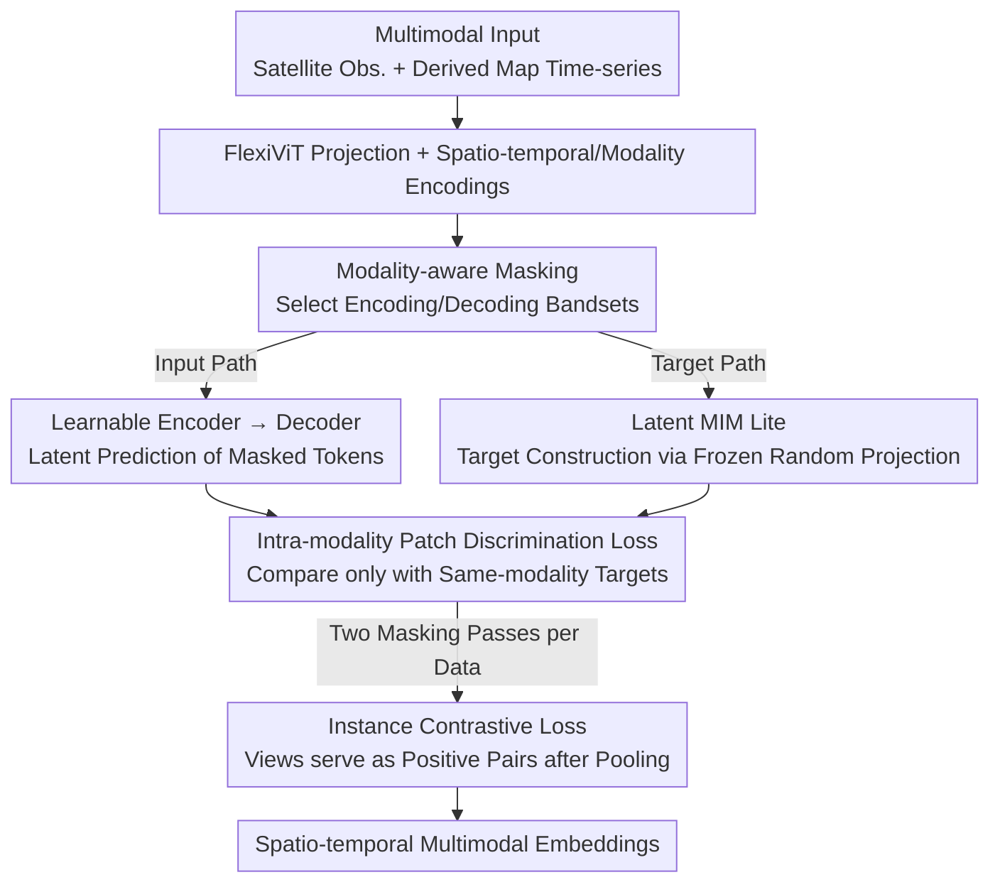

# OlmoEarth: Stable Latent Image Modeling for Multimodal Earth Observation

**Conference**: CVPR 2026  
**Paper**: [CVF Open Access](https://openaccess.thecvf.com/content/CVPR2026/html/Herzog_OlmoEarth_Stable_Latent_Image_Modeling_for_Multimodal_Earth_Observation_CVPR_2026_paper.html)  
**Code**: https://github.com/allenai/olmoearth_pretrain  
**Area**: Remote Sensing / Earth Observation Foundation Models / Self-supervised Representation Learning  
**Keywords**: Earth Observation, Foundation Models, Latent Masked Modeling, Multimodal, Stable Training

## TL;DR
OlmoEarth utilizes a self-supervised recipe designed specifically for Earth Observation (Latent MIM Lite with frozen random projections as target encoders + modality-aware masking + intra-modality contrastive loss). This approach stably trains spatio-temporal multimodal foundation models in latent space. It outperforms 12 other foundation models on 15 out of 24 embedding tasks and 19 out of 29 fine-tuning tasks, and has been deployed as an end-to-end platform for non-profit organizations.

## Background & Motivation

**Background**: Earth Observation (EO) data is unique—it possesses spatial structures like images, temporal sequences like video/text, and is naturally multimodal (multiple satellites + various derived layers). Recently, EO foundation models (Galileo, TerraMind, CROMA, Prithvi, etc.) have shown impressive results on research benchmarks. The mainstream approach has shifted from "pixel-space reconstruction" to "latent-space masked modeling."

**Limitations of Prior Work**: The authors encountered three recurring issues when reproducing existing work: training instability, representation collapse, and actual model performance significantly lower than claimed potential. Latent-space methods (I-JEPA, Latent MIM) offer high feature quality but are prone to collapse; pixel-space MAE is stable but limited in feature quality. Both ends are suboptimal. Furthermore, these large models are "too large, hard to train, and expensive" for non-profit organizations to use.

**Key Challenge**: A trade-off exists between stability and feature quality. Methods like Latent MIM rely on an online-updated target encoder to generate prediction targets, but this dynamic target is the source of collapse and instability. Switching to pixel reconstruction provides stability but loses the expressive power of latent-space modeling.

**Goal**: ① Find a training recipe that is both stable and retains latent representation power; ② Explicitly encode EO's multimodal characteristics (multiple satellites, bandsets, observations vs. maps) into self-supervised targets; ③ Build an open, end-to-end platform accessible to NGOs.

**Key Insight**: The authors discovered that "random projection" itself can extract non-trivial features from raw inputs that are useful for prediction. Therefore, the target encoder does not need to be a shifting, collapsible learnable network—a frozen random linear projection is sufficient.

**Core Idea**: Replace the "online/momentum-updated target encoder" with a "frozen randomly initialized linear projection" for masked modeling in latent space (Latent MIM Lite) to fundamentally eliminate collapse, combined with EO-specific modality-aware masking and intra-modality contrastive loss.

## Method

### Overall Architecture
OlmoEarth uses a ViT-based encoder-decoder architecture. The input is a sequence of "aligned multimodal satellite imagery + derived maps." In short: multi-source data is tokenized, with modality-aware logic determining which tokens serve as inputs and which as reconstruction targets. The encoder predicts masked target tokens in latent space, supplemented by an instance-level contrastive loss to pull global representations into the same space.

Process: A FlexiViT-style projection layer converts pixels to tokens (variable patch sizes; each patch $\times$ timestep $\times$ bandset produces one token), combined with 2D sincos spatial encoding, sinusoidal temporal encoding, and learnable modality encoding. Tokens are split into input/target paths via modality-aware masking: the input path passes through the learnable encoder → decoder for prediction; the target path passes through the frozen random projection to obtain target tokens. An intra-modality patch discrimination loss is calculated between them. The entire masking + encoding/decoding cycle runs twice (with different random masks), and the pooled global representations from both passes are used for instance contrastive loss. During inference, only observation data is used (no maps).

### Key Designs

**1. Latent MIM Lite: Eliminating Collapse via Frozen Random Projections**
Masking in latent space (Latent MIM, I-JEPA) is effective but unstable due to online/momentum target updates—if the target itself moves, the model can "cheat" by collapsing all representations into constants. OlmoEarth uses a **randomly initialized and frozen** copy of the online encoder's embedding layer as the target encoder. Random projections theoretically and practically extract non-trivial features; since the target is fixed, collapse is avoided. An extra benefit: supervised data (maps) and self-supervised data (observations) are unified—both pass through the same frozen projection, using identical loss algorithms without specialized heads. This was the critical step from collapse (PASTIS mIoU 7.9) to usability (35.2).

**2. Modality-Aware Masking: Reconstructing Missing Bandsets**
EO data is grouped into "bandsets" based on native resolution (e.g., 2 groups for Landsat, 3 for Sentinel-2). Each bandset is tagged with one of four labels: Not Used / Encode Only / Decode Only / Both. This reframes the task from "filling in masked pixels" to "reconstructing missing bandsets from partial views of others." Reason: tokens within the same bandset are highly correlated; reconstructing them requires extremely high mask rates (e.g., 90%). Masking entire groups increases difficulty, allowing for more balanced mask rates. Crucially, **maps are either "Decode Only" or "Not Used" and never enter the encoder**—since only observations are available at inference, and maps change over time (which downstream tasks often aim to detect), maps serve only as training targets. Ablations show that including maps in the encoder (Encode Maps) degrades performance (m-eurosat 92.9 → 91.8).

**3. Intra-modality Patch Discrimination Loss: Filtering Cross-modality "Easy Negatives"**
Latent prediction uses contrastive Patch Discrimination (rather than Smooth L1 reconstruction). A predicted token is compared against its target token via cosine similarity while being pushed away from other target tokens using cross-entropy. However, target tokens in OlmoEarth can come from different modalities/timesteps. Since distributions differ significantly across modalities, cross-modality "easy negatives" dominate the loss. The authors' fix: **Only compare with target tokens of the same modality**, effectively boosting performance (m-so2sat 53.6 → 55.3).

**4. Instance Contrastive Loss: Ensuring Reasonable Global Representations**
Patch discrimination works locally. For global tasks like classification, OlmoEarth average-pools all output tokens. However, tokens from different modalities vary greatly; direct averaging might be incoherent. A SimCLR-style contrastive loss pulls them into a shared space. Instead of data augmentation, views are generated via **two different random masks** on the same input. The two pooled representations are positive pairs, with others in the batch (micro-batch=32) as negatives. This loss is added with a 0.1 weight, providing a stable gain (m-so2sat 55.3 → 56.8).

### Loss & Training
Total Loss = Intra-modality Patch Discrimination Loss + 0.1 $\times$ Instance Contrastive Loss. Training uses AdamW, base lr $1\times10^{-4}$, weight decay 0.02, batch size 512 (micro-batch 32), 8000-step linear warm-up, and cosine annealing to 0.1 over 667,200 steps. Random valid patches $\in \{1\dots8\}$, square crops $\in \{1\dots12\}$ tokens, and timesteps 3–12. Approx. 100 billion tokens processed per run. Four sizes: Nano/Tiny/Base/Large (1.4M–300M parameters, decoder depth fixed at 4).

## Key Experimental Results

Pre-training data consists of 285,288 samples (2.56km $\times$ 2.56km over 1 year), 3 satellite observations (Sentinel-1/2, Landsat-8) + 6 derived maps, resampled to 10m/pixel. Samples were drawn from OpenStreetMap地物 (120 classes), up to 10k tiles per class. Evaluation compares 12 foundation models across 18 research benchmarks + 19 datasets from 7 partner organizations, using both kNN/Linear Probing (frozen) and Full Fine-tuning protocols.

### Main Results (Average Embedding Task Scores, OlmoEarth Base Highest)

| Model | Architecture | Avg. Embedding Score ⚠️ |
|------|------|------|
| Anysat | ViT-Base | 55.8 |
| CROMA | ViT-Base | 68.2 |
| Galileo | ViT-Base | 67.3 |
| Panopticon | ViT-Base | 65.2 |
| **OlmoEarth** | **ViT-Base** | **74.7** |
| OlmoEarth | ViT-Large | 73.6 |

> ⚠️ The "Average Score" in the table above is derived from the rightmost column of Table 2 in the paper. Detailed task-wise alignment may vary; refer to the original text for precise values. Overall performance: Best on 15/24 kNN/LP embedding tasks and 19/29 full fine-tuning tasks.

### Ablation Study (Table 4, Base Model, kNN/LP on Validation Set, 140k steps)

| Configuration | m-so2sat | m-eurosat | PASTIS | Note |
|------|----------|-----------|--------|------|
| Full Latent MIM* | 32.2 | 68.4 | 7.9 | Collapsed during training |
| Latent MIM Lite | 42.2 | 87.2 | 35.2 | Use frozen random proj.; immediately usable |
| + Modality Masking | 53.6 | 90.2 | 46.6 | Add modality-aware masking |
| + Modality Patch Disc. | 55.3 | 91.5 | 48.1 | Only same-modality contrast |
| + Contrastive Loss | 56.8 | 92.3 | 49.0 | Add instance contrastive |
| + Maps | 62.4 | 92.9 | 50.7 | Include supervised maps (Full Model) |
| Encode Maps | 54.7 | 91.8 | 45.9 | Maps in encoder → Drop in performance |

### Key Findings
- **Latent MIM Lite is the lynchpin**: Standard Latent MIM collapses (PASTIS 7.9). Switching to frozen random projections provides the largest performance jump.
- **Maps belong in targets, not inputs**: Encoding maps consistently dropped scores, validating the decode-only design.
- **Base vs. Large Scaling Anomaly**: OlmoEarth Large is one of the strongest models in literature but trails Base on some per-pixel temporal tasks. This phenomenon (Base > Large) is also noted in CROMA and DINOv3, suggesting fundamental scaling challenges in EO.
- **Real-world Impact**: Collaborated with Global Mangrove Watch, improving mangrove mapping from a Random Forest F1 of 95.3% to 98.1%, enabling monthly rather than annual monitoring.

## Highlights & Insights
- **"Random Projection as Target" for stability**: By avoiding momentum encoders or complex stop-grad mechanisms and only using a frozen linear layer, the model achieves both stability and latent expressiveness.
- **Encoding Domain Structure into Masking**: The four-state bandset masking + decode-only maps explicitly model the asymmetry of EO sensors/observations without relying purely on high mask rates.
- **"Easy Negative" Perspective**: In multimodal contrastive learning, cross-modal negatives are too easy and dilute gradients. Restricting contrast to intra-modality is a low-cost, high-gain improvement.
- **Unified Supervision/Self-supervision**: All modalities share the same projection and loss, simplifying the engineering pipeline.

## Limitations & Future Work
- **Scaling Difficulty**: Large does not consistently outperform Base, especially in per-pixel temporal tasks.
- **Simplistic Targets**: The authors note that frozen random projections might be too simple for diverse domains like natural images.
- **Limited Sensor Coverage**: Focuses on high-frequency sensors (Sentinel-1/2, Landsat); doesn't yet achieve the arbitrary sensor compatibility of DOFA.
- **Future Work**: Plans to integrate climate/weather data and ground-level natural images to support fine-grained recognition like crop types.

## Related Work & Insights
- **vs. Latent MIM / I-JEPA**: Shares the latent prediction goal but avoids their instability by using "Lite" frozen projections instead of momentum targets.
- **vs. Galileo / TerraMind**: Both use supervised and self-supervised data, but OlmoEarth limits maps to "Decode Only," which likely simplifies the encoder's learning task.
- **vs. TerraMind (Anti-collapse)**: TerraMind uses a pre-trained VQ-VAE as a tokenizer; OlmoEarth is more efficient, using random projections without needing a pre-trained tokenizer.

## Rating
- Novelty: ⭐⭐⭐⭐ "Latent MIM Lite" is simple yet effective; components are clever adaptations of existing ideas.
- Experimental Thoroughness: ⭐⭐⭐⭐⭐ Comparing 12 models across 37+ tasks is exceptionally solid.
- Writing Quality: ⭐⭐⭐⭐ Clear motivation, though dense tables impact readability.
- Value: ⭐⭐⭐⭐⭐ Open-source weights/data and real-world impact on NGO work.

<!-- RELATED:START -->

## Related Papers

- [\[CVPR 2026\] RAMEN: Resolution-Adjustable Multimodal Encoder for Earth Observation](ramen_resolution-adjustable_multimodal_encoder_for_earth_observation.md)
- [\[CVPR 2026\] NeighborMAE: Exploiting Spatial Dependencies between Neighboring Earth Observation Images in Masked Autoencoders Pretraining](neighbormae_exploiting_spatial_dependencies_between_neighboring_earth_observatio.md)
- [\[ICLR 2026\] Earth-Agent: Unlocking the Full Landscape of Earth Observation with Agents](../../ICLR2026/remote_sensing/earth-agent_unlocking_the_full_landscape_of_earth_observation_with_agents.md)
- [\[CVPR 2026\] UniChange: Unifying Change Detection with Multimodal Large Language Model](unichange_unifying_change_detection_with_multimodal_large_language_model.md)
- [\[ICML 2025\] High-Resolution Live Fuel Moisture Content (LFMC) Maps for Wildfire Risk from Multimodal Earth Observation Data](../../ICML2025/remote_sensing/high-resolution_live_fuel_moisture_content_lfmc_maps_for_wildfire_risk_from_mult.md)

<!-- RELATED:END -->
