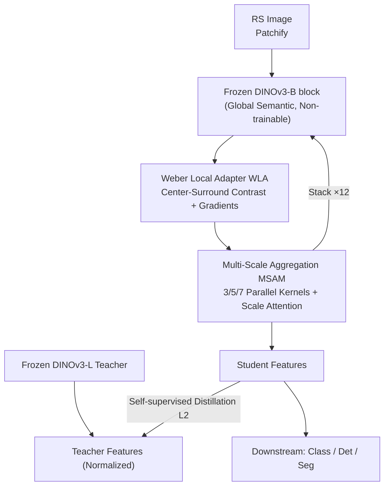

# ORSATR-X: A Foundation Model based on Differential-and-Excitation Networks for Optical Remote Sensing Object Recognition

**Conference**: CVPR 2026  
**Paper**: [CVF Open Access](https://openaccess.thecvf.com/content/CVPR2026/html/Mo_ORSATR-X_A_Foundation_Model_based_on_Differential-and-Excitation_Networks_for_Optical_CVPR_2026_paper.html)  
**Code**: https://github.com/Ayniiii/ORSATR-X  
**Area**: Remote Sensing Foundation Models / Object Recognition  
**Keywords**: RSFM, DINOv3, Weber Local Contrast, Multi-scale Aggregation, Self-supervised Distillation

## TL;DR
ORSATR-X utilizes a frozen DINOv3 as its backbone, attaching side adapters to each Transformer block: a Weber Local Adapter (WLA) inspired by Weber's Law to amplify boundaries of low-contrast targets, and a Multi-Scale Aggregation Module (MSAM) to handle extreme scale variations in remote sensing (RS) objects. Trained via distillation from DINOv3-L, it achieves SOTA results for single-modal RS foundation models across scene classification, detection, and segmentation (75.30% mAP50 on DIOR-R, surpassing SkySense V2 which was pre-trained on 21M images).

## Background & Motivation
**Background**: The mainstream path for Remote Sensing Foundation Models (RSFM) involves large-scale self-supervised pre-training on multi-source RS data (e.g., SkySense with 21M images, RingMoE with 0.4B). However, due to high acquisition costs, a more efficient alternative is adapting foundation models pre-trained on natural images (e.g., SAM, DINO) to RS tasks. DINOv3 has shown strong transferability and is a natural candidate backbone.

**Limitations of Prior Work**: Comparison experiments show that directly fine-tuning DINOv3 matches recent SOTA but ignores the fundamental domain shift in RS data. In RS imagery, target edges and textures are often suppressed by complex backgrounds (shadows, vegetation). While DINOv3 detects vehicles accurately in high-contrast scenes, it suffers from significant missed and false detections when targets blend into shadows or vegetation (low-contrast scenarios, as seen in Fig. 1).

**Key Challenge**: DINOv3's strength lies in semantic representation through **global self-attention**, but global attention is insensitive to **local boundary contrast**—it tends to drown out subtle boundary responses of low-contrast targets. RS tasks specifically require enhanced perception of local contrast, directional edges, and cross-scale features.

**Goal**: Explicitly recover the perception of low-contrast boundaries and extreme scale variations without discarding DINOv3's universal representations or requiring massive RS-specific pre-training.

**Key Insight**: Since global attention is inherently unsuitable for local contrast, the authors propose a **parallel side-pathway for local contrast** instead of modifying the backbone. Low contrast is essentially a small relative brightness difference between target and background, which corresponds to the center-surround antagonism mechanism in the visual system and Weber’s Law (perception depends on relative differences rather than absolute intensity).

**Core Idea**: Freeze the DINOv3 backbone and insert side networks consisting of "Weber Local Adapters + Multi-scale Aggregation." These use learnable differential convolution kernels to explicitly encode center-surround contrast and directional gradients. Distillation from DINOv3-L is used to train these lightweight adapters, injecting RS-specific inductive biases into a universal model with minimal training cost.

## Method

### Overall Architecture
The skeleton of ORSATR-X is a **frozen DINOv3-B** (12-layer ViT). The core modification involves concatenating two trainable sub-modules after each DINOv3 block: the **WLA** (Weber Local Adapter) for local contrast/boundary enhancement and the **MSAM** (Multi-Scale Aggregation Module) for integrating multi-scale context. Each "adapter block" follows the sequence: `Frozen DINOv3 block → WLA → MSAM`. Backbone parameters remain frozen, while only WLA/MSAM are optimized.

The training phase uses **self-supervised distillation** rather than massive RS pre-training: using DINOv3-L as the teacher and the adapter-enhanced DINOv3-B as the student, token-wise features are aligned (L2) with the normalized teacher features to cultivate RS-specific inductive biases.

### Key Designs

**1. Weber Local Adapter (WLA): Explicitly amplifying low-contrast boundaries**

WLA addresses the loss of low-contrast boundaries in DINOv3. It runs **in parallel** with self-attention to enhance local structures without disrupting global representations. It consists of two complementary branches:

*   *Center-Surround Contrast Branch*: Inspired by retinal receptor fields, a learnable depthwise convolution kernel $\mathbf{K}_{cs}^i \in \mathbb{R}^{C \times 1 \times 3 \times 3}$ is designed with a **fixed center weight of -1 and learnable surround weights**. This forces an antagonistic structure: $\mathbf{F}_{cs}^i = \alpha^i \cdot \text{DWConv}(\mathbf{F}_i; \mathbf{K}_{cs}^i)$. By encoding **relative contrast** (Weber's Law), it is sensitive to boundaries regardless of global lighting. The response is split into positive and negative branches $\mathbf{F}_{cs}^{i,+}=\text{ReLU}(\mathbf{F}_{cs}^i)$ and $\mathbf{F}_{cs}^{i,-}=\text{ReLU}(-\mathbf{F}_{cs}^i)$, modeling both bright-on-dark and dark-on-bright polarities common in RS.
*   *Directional Gradient Branch*: Uses antisymmetric kernels $\mathbf{K}_h$ and $\mathbf{K}_v$ (horizontal/vertical gradients with learnable weights) to capture structured objects like roads and buildings.
*   *Adaptive Fusion*: A channel-spatial attention mechanism dynamically weights the branches to generate spatial masks $\mathbf{A}_1^i, \mathbf{A}_2^i$. The output uses **multiplicative modulation**: $\mathbf{F}_{\text{WLA}}^i = \mathbf{F}_i \odot \mathcal{W}_{\text{out}}^i(\mathbf{F}_{\text{fused}^i})$, highlighting local structures while preserving feature integrity.

**2. Multi-Scale Aggregation Module (MSAM): Closing the "Local-to-Global" scale gap**

MSAM handles the extreme scale differences of RS objects by applying parallel depthwise convolutions with $k \in \{3,5,7\}$. **Scale attention** adaptively weights these scales: $\mathbf{w}_s^i = \text{Softmax}(\mathcal{G}^i(\text{GAP}(\mathbf{F}_{\text{WLA}}^i)))$. A **dual-residual** structure ensures stable training and integration into the frozen backbone.

**3. Self-supervised Distillation: Adapters as "Selective Feature Filters"**

To train the adapters without massive RS data, DINOv3-L acts as the teacher. Unlike traditional distillation, **WLA/MSAM act as learnable filters** that selectively amplify RS-relevant patterns from the teacher's universal semantics. The loss function is the normalized L2 distance of token features:
$$\mathcal{L}_{\text{distill}} = \frac{1}{N}\sum_{i=1}^{N} \left\| \mathbf{f}_i^{s} - \frac{\mathbf{f}_i^{t}}{\|\mathbf{f}_i^{t}\|_2} \right\|_2^2$$

### Loss & Training
- Pre-training Dataset: Million-AID (~1M samples), single-modal optical.
- Hardware: 8×A100.
- Strategy: Optimization only for WLA/MSAM parameters. **Layer-wise** insertion was found superior to block-wise insertion for capturing fine-grained features of targets in complex backgrounds.

## Key Experimental Results

### Main Results
Backbone: ViT-B (single-modal, 1M data). Gains relative to the DINOv3-B baseline are in parentheses.

| Task / Dataset | Metric | Baseline (DINOv3-B) | ORSATR-X | Ref SOTA |
|---|---|---|---|---|
| Classification RESISC-45 (TR=20%) | Acc | 96.03 | **96.33** (+0.30) | SkySense V2 97.24 (21M Multi-modal) |
| Classification AID (TR=20%) | Acc | 96.53 | **97.07** (+0.54) | RVSA 97.03 |
| Horizontal Detection DIOR | mAP50 | 79.70 | **80.20** (+0.50) | MTP(ViT-L+RVSA) 81.10 |
| Rotation Detection DIOR-R | mAP50 | 74.64 | **75.30** (+0.66) | SkySense V2 75.29 (21M) / MTP 74.54 |
| Segmentation Potsdam | mF1 | 91.13 | **91.36** (+0.23) | SkySense V2 95.86 (21M) |

In DIOR-R rotation detection, ORSATR-X reaches 75.30% in **single-modal** settings, outperforming MTP (+0.76%) and even slightly surpassing the multi-modal SkySense V2 (75.29%) despite using 21x less data.

### Ablation Study
Ablations on DIOR-R under consistent settings.

| Configuration | DIOR-R mAP50 | Convex Area | Intra-class Dist | Effective Dim |
|---|---|---|---|---|
| Baseline | 74.64 | 8,214 | 29.73 | 14.23 |
| + WLA | 74.97 | 41,387 | 56.18 | 14.41 |
| + MSAM | 74.81 | 138,752 | 175.64 | 13.78 |
| Full (+ Distillation) | **75.30** | 147,293 | 215.42 | 12.35 |

MSAM+WLA shows significant gains for small objects (+2.47%), validating robustness to scale variations.

### Key Findings
- **Complementarity**: WLA enhances local discriminative patterns while MSAM integrates cross-scale context.
- **Feature Space Analysis**: PCA results show that the convex hull area increases 17.9x while effective dimensionality drops from 14.2 to 12.4. This suggests the architecture allows features to expand along **task-relevant subspaces** while suppressing irrelevant variations.
- **Small Target Benefit**: WLA's contrast encoding is more suited for RS perception than standard convolutions, particularly for small objects.
- **Segmentation**: Shows the smallest gain (+0.23%), likely because the current pre-training strategy is patch-centric rather than pixel-centric.

## Highlights & Insights
- **Engineering Neuroscience Priors**: Translating center-surround antagonism and Weber's Law into concrete, trainable differential operators is more effective than generic "inspired" designs.
- **Efficiency Paradigm**: The "Frozen Backbone + Side Adapters + Distillation" approach is a highly portable paradigm for transforming universal foundation models into domain-specific experts with minimal data and compute.
- **Balanced Logic**: Clear division of labor (WLA for contrast/edges, MSAM for scale) supported by ablation studies.

## Limitations & Future Work
- **Segmentation**: Gains are marginal. Future work should introduce pixel-level objectives or multi-scale feature learning.
- **Data Gap**: Performance in classification and segmentation still lags behind 21M multi-modal models like SkySense V2.
- **Modality**: Currently limited to optical imagery; the effectiveness of differential kernels on SAR or Infrared is yet to be verified.

## Related Work & Insights
- **vs. Large-scale RSFMs (SkySense, RingMoE)**: While they rely on massive datasets, ORSATR-X is **data and compute-efficient**, outperforming SkySense V2 on DIOR-R.
- **vs. Foundation Model Tuning (MTP, RVSA)**: Direct tuning often ignores domain-specific shifts. WLA/MSAM explicitly target these shifts.
- **vs. MIM-based RS Self-supervision**: Rather than training from scratch with mask reconstruction, this distillation route migrates teacher semantics into a domain-aware student at lower cost.

## Rating
- Novelty: ⭐⭐⭐⭐ Engineering Weber's Law into learnable kernels is a concrete and novel approach.
- Experimental Thoroughness: ⭐⭐⭐⭐ Comprehensive tasks and feature space analysis, though segmentation gains are limited.
- Writing Quality: ⭐⭐⭐⭐ Logical flow from motivation to mechanism with strong visual/spectral analysis.
- Value: ⭐⭐⭐⭐ Provides a repeatable paradigm for domain adaptation in data-scarce fields.

## Related Papers

- [\[CVPR 2026\] VLM4RSDet: Collaborative Optimization with Vision-Language Model for Enhancing Remote Sensing Object Detection](vlm4rsdet_collaborative_optimization_with_vision-language_model_for_enhancing_re.md)
- [\[CVPR 2026\] MM-OVSeg: Multimodal Optical-SAR Fusion for Open-Vocabulary Segmentation in Remote Sensing](mm-ovseg_multimodal_optical-sar_fusion_for_open-vocabulary_segmentation_in_remot.md)
- [\[NeurIPS 2025\] GeoLink: Empowering Remote Sensing Foundation Model with OpenStreetMap Data](../../NeurIPS2025/remote_sensing/geolink_empowering_remote_sensing_foundation_model_with_openstreetmap_data.md)
- [\[CVPR 2026\] Rotation Invariant and Symmetry Aware Pixel Difference Network for Remote Sensing Object Detection](rotation_invariant_and_symmetry_aware_pixel_difference_network_for_remote_sensin.md)
- [\[ICCV 2025\] SkySense V2: A Unified Foundation Model for Multi-Modal Remote Sensing](../../ICCV2025/remote_sensing/skysense_v2_a_unified_foundation_model_for_multi-modal_remote_sensing.md)

<!-- RELATED:END -->

<!-- RELATED:START -->

## Related Papers

- [\[CVPR 2026\] MM-OVSeg: Multimodal Optical-SAR Fusion for Open-Vocabulary Segmentation in Remote Sensing](mm-ovseg_multimodal_optical-sar_fusion_for_open-vocabulary_segmentation_in_remot.md)
- [\[NeurIPS 2025\] GeoLink: Empowering Remote Sensing Foundation Model with OpenStreetMap Data](../../NeurIPS2025/remote_sensing/geolink_empowering_remote_sensing_foundation_model_with_openstreetmap_data.md)
- [\[ICLR 2026\] Object Fidelity Diffusion for Remote Sensing Image Generation](../../ICLR2026/remote_sensing/object_fidelity_diffusion_for_remote_sensing_image_generation.md)
- [\[ICCV 2025\] SkySense V2: A Unified Foundation Model for Multi-Modal Remote Sensing](../../ICCV2025/remote_sensing/skysense_v2_a_unified_foundation_model_for_multi-modal_remote_sensing.md)
- [\[CVPR 2026\] GeoBridge: A Semantic-Anchored Multi-View Foundation Model Bridging Images and Text for Geo-Localization](geobridge_a_semantic-anchored_multi-view_foundation_model_bridging_images_and_te.md)

<!-- RELATED:END -->
