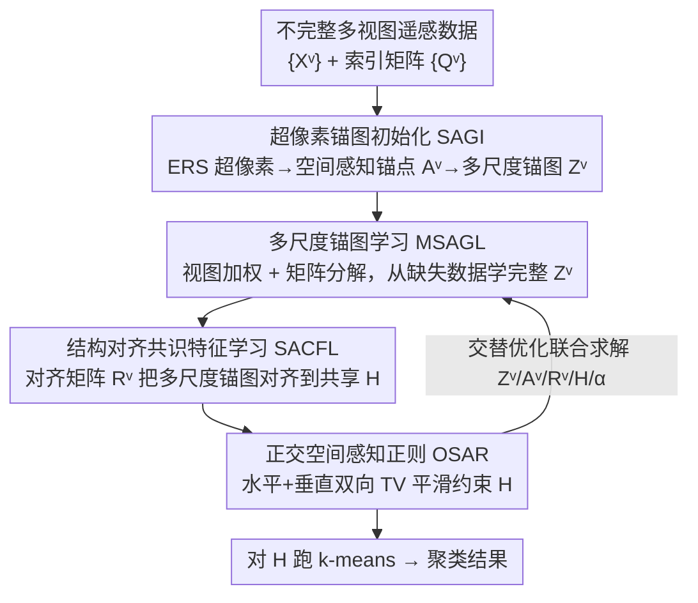

# Orthogonal Spatial-Aware Multi-View Anchor Graph Clustering for Incomplete Remote Sensing Data

**Conference**: CVPR 2026  
**Paper**: [CVF Open Access](https://openaccess.thecvf.com/content/CVPR2026/html/Zhang_Orthogonal_Spatial-Aware_Multi-View_Anchor_Graph_Clustering_for_Incomplete_Remote_Sensing_CVPR_2026_paper.html)  
**Code**: https://github.com/ZhangYongshan/OSMAGC  
**Area**: Remote Sensing / Multi-view Clustering  
**Keywords**: Multi-view clustering, Incomplete data, Anchor graph learning, Remote sensing, Spectral-spatial structure

## TL;DR
Addressing the novel scenario of incomplete remote sensing multi-view clustering where "certain views contain missing pixels," OSMAGC initializes multi-scale spatial-aware anchor graphs using superpixels. It then unifies multi-scale anchor graph learning, structure-aligned consensus feature learning, and orthogonal spatial-aware regularization into a single objective function for alternating optimization. The method consistently outperforms SOTA methods across four remote sensing datasets under various missing rates while achieving the fastest execution speed.

## Background & Motivation

**Background**: Remote sensing data inherently possesses multiple representations—the same region can be observed simultaneously by multiple sensors such as Hyperspectral (HS), Multispectral (MS), Synthetic Aperture Radar (SAR), and Digital Surface Models (DSM), or several descriptors like texture and contour can be extracted from a single sensor. Multi-view clustering utilizes consistency and complementarity across these views to partition pixels into land-cover categories without labels, becoming a mainstream unsupervised approach for remote sensing scene understanding.

**Limitations of Prior Work**: Almost all existing remote sensing multi-view clustering methods (e.g., FPFC, SAMVGC) assume that **every pixel is fully observed in all views**. However, in reality, sensor failures or cloud occlusion can lead to missing pixels in certain views (as shown in Figure 1 of the paper). Performance of these methods drops sharply when encountering such incomplete data. On the other hand, general-purpose incomplete multi-view clustering methods (relying on imputation, graph reconstruction, or matrix factorization) do not account for the **spectral-spatial structure of remote sensing data**, likewise yielding poor results.

**Key Challenge**: Incomplete remote sensing clustering must simultaneously resolve three interrelated issues: (1) heterogeneous spectral information across views and how to exploit complementary information across missing views; (2) the intrinsic consistency of land-cover representations across views and how to capture this consensus during missingness; and (3) how to ensure spatial-spectral continuity and smoothness, as missingness in a single view breaks spatial continuity and introduces cross-view inconsistency. Existing works either focus solely on imputation or only on remote sensing structure, failing to integrate the two.

**Goal**: To propose the first **incomplete multi-view clustering framework specifically designed for remote sensing data**, unifying "missing data completion" with "spectral-spatial structure utilization."

**Key Insight**: The authors observe that the spatial texture of remote sensing data is crucial for anchor graph initialization. Anchor graphs (which model "sample-to-anchor" relationships rather than full pixel similarity matrices) are inherently suitable for incomplete, large-scale scenarios due to their efficiency and scalability. Therefore, they tailor multi-scale anchor graphs for each view based on superpixel textures and perform completion and alignment at the anchor graph level.

**Core Idea**: A **view-weighted matrix factorization** is used to learn complete multi-scale anchor graphs from incomplete data. These graphs are then **structure-aligned** into a shared latent space to obtain consensus features. Finally, a **dual-direction (horizontal and vertical) orthogonal spatial-aware regularization** is applied to ensure spatial smoothness. These three modules are integrated into a unified objective function for joint alternating optimization and mutual enhancement.

## Method

### Overall Architecture

The input to OSMAGC consists of $V$ views of incomplete remote sensing data $\{X^v\}_{v=1}^V$ (where $X^v \in \mathbb{R}^{B_v \times N}$ for the $v$-th view, $N=H\times W$ pixels, and $B_v$ spectral channels). The missing patterns vary across views, marked by index matrices $Q^v$. The output partitions the $N$ pixels into $C$ land-cover categories. The pipeline consists of four modules: first, Spatial-Aware Anchor Graph Initialization (SAGI) uses superpixels to initialize spatial-aware anchors and multi-scale anchor graphs (preprocessing). Then, three core modules—Multi-Scale Anchor Graph Learning (MSAGL) to learn complete anchor graphs from missing data, Structure-Aligned Consensus Feature Learning (SACFL) to align multi-scale anchor graphs into a shared latent space $H$, and Orthogonal Spatial-Aware Regularization (OSAR) to constrain the spatial smoothness of $H$—are integrated into a unified objective function. These are solved using an alternating optimization algorithm for **mutual enhancement**, followed by k-means on the consensus features $H$.

### Key Designs

**1. SAGI (Spatial-Aware Anchor Graph Initialization): Tailoring multi-scale anchor graphs with per-view textures**

The limitation is that spectral info is heterogeneous and spatial textures differ across views. Using the same anchor graph size/topology for all views ignores view-specific traits. SAGI performs ERS (Entropy Rate Superpixel) segmentation on the first principal component of each view image, partitioning it into $M_v$ superpixels—a number that adapts per view, hence "multi-scale." The average of all pixels within each superpixel forms a spatial-aware anchor, resulting in $A^v=\{a_1^v,\dots,a_{M_v}^v\}\in\mathbb{R}^{B_v\times M_v}$. The anchor graph $Z^v\in\mathbb{R}^{M_v\times N}$ is constructed column-wise, describing the relationship between a pixel and its neighboring anchors:

$$z_{ij}^v=\begin{cases}\dfrac{d_{k+1,j}^v-d_{ij}}{k\,d_{k+1,j}^v-\sum_{i=1}^{k}d_{ij}^v},&\forall i\in\Phi_j\\[2mm]0,&\text{otherwise}\end{cases}$$

where $\Phi_j$ is the set of $k$ nearest anchors for pixel $x_j^v$, and $d_{ij}=\|x_j^v-a_i^v\|_2$ is the Euclidean distance. Graphs initialized this way carry both spatial and spectral information, capturing inter-view heterogeneity and providing a high-quality starting point. Removing SAGI (using k-means for anchors) results in the largest performance drop on the MDAS dataset, highlighting the importance of texture-driven initialization.

**2. MSAGL (Multi-Scale Anchor Graph Learning): View-weighted matrix factorization to recover complete anchor graphs**

The challenge is that initialized graphs are based on incomplete data, and information quality varies across views. MSAGL performs matrix factorization learning based on initialized anchors/graphs and introduces adaptive view weights to emphasize informative views while suppressing noisy ones:

$$\min_{A^v,Z^v,\alpha}\sum_{v=1}^{V}\frac{1}{\alpha^v}\|X^vQ^v-A^vZ^vQ^v\|_F^2,\quad \text{s.t. } Z^v\ge 0,\ Z^{v\top}\mathbf{1}=\mathbf{1},\ A^{v\top}A^v=I,\ \alpha^{\top}\mathbf{1}=1,\ \alpha^v>0$$

Reconstruction error is only calculated on **available pixels** $X^vQ^v$ using $Z^vQ^v$, bypassing missing entries. The term $\frac{1}{\alpha^v}$ measures the contribution of the $v$-th view; views with high reconstruction error (noisier info) automatically receive lower weights. Orthogonality constraints $A^{v\top}A^v=I$ ensure the anchor bases do not degenerate. This module performs "completion" at the low-dimensional anchor graph level rather than on raw high-dimensional pixels, ensuring efficiency and scalability.

**3. SACFL (Structure-Aligned Consensus Feature Learning): Aligning multi-scale graphs into a latent space via alignment matrices**

Since each view has a different scale $M_v$, anchor graphs cannot be directly concatenated. Significant structural inconsistencies also make consensus feature extraction difficult. SACFL introduces an alignment matrix $R^v\in\mathbb{R}^{D\times M_v}$ for each view (with orthogonality constraint $R^{v\top}R^v=I$) to project anchor graphs of different scales into a unified $D$-dimensional space, approximating a shared consensus representation $H\in\mathbb{R}^{D\times N}$:

$$\min_{R^v,H}\sum_{v=1}^{V}\|R^vZ^v-H\|_F^2,\quad \text{s.t. } R^{v\top}R^v=I$$

$H$ aggregates discriminative information from all multi-scale anchor graphs. By using "structural alignment + consensus features" simultaneously, the model preserves view-specific multi-scale structures while merging them into a unified representation. MUUFL is found to be most sensitive to the removal of SACFL in ablation studies.

**4. OSAR (Orthogonal Spatial-Aware Regularization): Dual-direction TV constraints for spatial continuity**

Missing data disrupts spatial continuity, scattering semantics of adjacent pixels. In remote sensing, neighboring pixels often belong to the same land-cover, a prior that should be reflected in $H$. OSAR uses total variation (TV) regularization to compute finite differences between adjacent pixels in horizontal and vertical directions, suppressing abrupt changes while preserving texture boundaries:

$$R(H)=\sum_{d=1}^{D}\sum_{\{i,j\}\in\mathcal{N}}\|h_d^i-h_d^j\|_2^2=\|D_xH^{\top}\|_F^2+\|D_yH^{\top}\|_F^2$$

where $\mathcal{N}=\mathcal{N}_x\cup\mathcal{N}_y$ are the horizontal and vertical neighbor sets, and $D_x,D_y$ are forward finite difference operators. This term ensures $H$ is spatially smooth and continuous, repairing fragmentation caused by missing pixels. It provides the "spatial-aware" aspect of the method's name, while "orthogonal" refers to the constraints on $A^v$ and $R^v$.

The overall objective combines the three modules (Eq 2, 3, and 5):

$$\min_{Z^v,A^v,R^v,H,\alpha}\sum_{v=1}^{V}\frac{1}{\alpha^v}\|X^vQ^v-A^vZ^vQ^v\|_F^2+\lambda\sum_{v=1}^{V}\|R^vZ^v-H\|_F^2+\gamma\big(\|D_xH^{\top}\|_F^2+\|D_yH^{\top}\|_F^2\big)$$

$\lambda, \gamma$ are trade-off coefficients. Integrating these into one objective avoids suboptimal solutions caused by disjoint processing.

### Loss & Training

The authors designed an **alternating optimization** algorithm to update variables one by one:
- **Updating $Z^v$**: This reduces column-wise to a capped-simplex projection problem with $z_j^v\ge 0,\ z_j^{v\top}\mathbf{1}=1$, solved efficiently in closed form where $S^v=Q^vQ^{v\top}$.
- **Updating $A^v$**: Becomes $\max_{A^v}\mathrm{Tr}(A^{v\top}M^v)$ where $M^v=X^vS^vZ^{v\top}$. The optimal solution $A^v=U^vV^{v\top}$ is given by the SVD of $M^v$.
- **Updating $R^v$**: Similarly $\max_{R^v}\mathrm{Tr}(R^{v\top}B^v)$ where $B^v=HZ^{v\top}$, solved via rank-$D$ truncated SVD.
- **Updating $H$**: Closed-form solution $H=\dfrac{\lambda\sum_{v=1}^{V}R^vZ^v}{\lambda V I+\gamma D}$, where $D=D_x^{\top}D_x+D_y^{\top}D_y$.
- **Updating view weights $\alpha$**: Using the Cauchy-Schwarz inequality, $\alpha^v=\dfrac{e^v}{\sum_{v=1}^{V}e^v}$ where $e^v=\|X^vQ^v-A^vZ^vQ^v\|_F^2$, meaning larger reconstruction errors lead to smaller weights.

Complexity analysis shows that spatial and per-iteration time complexity are nearly linear with respect to the number of samples $N$ (since $M_v, B_v, D \ll N$), explaining the method's superior speed.

## Key Experimental Results

Experiments used four remote sensing datasets: MUUFL (2 views), Berlin (2 views), Augsburg (3 views), and MDAS (4 views), with missing rates from 0.1 to 0.9. Eight SOTA methods were compared: four RS-specific multi-view clustering (FPFC/AMKSC/MSSAGF/SAMVGC) and four general incomplete multi-view clustering (SIMVC-SA/DIVIDE/ASCR/PMIMC). Metrics included ACC, NMI, Purity, and ARI.

### Main Results (ACC at 0.5 Missing Rate, Selected)

| Dataset | FPFC | SAMVGC | SIMVC-SA | ASCR | Ours (OSMAGC) | Gain |
|--------|------|--------|----------|------|------|------|
| MUUFL | 0.3410 | 0.3279 | 0.3999 | 0.4036 | **0.5002** | +9.66% |
| Berlin | 0.4010 | 0.3928 | 0.3649 | 0.4015 | **0.4410** | +3.95% |
| Augsburg | 0.6009 | 0.4550 | 0.4923 | 0.4962 | **0.6120** | +1.11% |
| MDAS | 0.4171 | 0.3804 | 0.3480 | 0.3823 | **0.4345** | +1.74% |

OSMAGC consistently performs best across all datasets and metrics. At a 0.3 missing rate on MUUFL, the four metrics are 5.00%/3.61%/4.63%/11.64% higher than the runner-up. Even at a 0.7 missing rate, it maintains a significant ACC lead.

### Runtime (at 0.5 Missing Rate, Seconds)

| Method | MUUFL | Berlin | Augsburg | MDAS |
|------|-------|--------|----------|------|
| SAMVGC | 145.07 | 145.92 | 52.56 | 169.79 |
| DIVIDE | 1735.34 | 1809.31 | 2548.46 | 1277.68 |
| PMIMC | 1890.5 | OOM | 19744.62 | 20084.99 |
| **Ours** | **14.01** | **68.38** | **31.6** | **14.78** |

OSMAGC is remarkably faster than all competitors, confirming the near-linear complexity analysis.

### Ablation Study (ACC at 0.5 Missing Rate)

| Configuration | MUUFL | Berlin | Augsburg | MDAS | Description |
|------|-------|--------|----------|------|------|
| V1 (w/o SAGI) | 0.4591 | 0.4129 | 0.5325 | 0.3220 | Replaced with k-means anchors |
| V2 (w/o MSAGL) | 0.4713 | 0.4281 | 0.5530 | 0.4240 | Same superpixel scale for all views |
| V3 (w/o SACFL) | 0.4463 | 0.4355 | 0.5249 | 0.3360 | Fixed alignment matrices |
| V4 (w/o OSAR) | 0.4661 | 0.4375 | 0.5689 | 0.4211 | Removed spatial regularization |
| **Full Model** | **0.5002** | **0.4410** | **0.6120** | **0.4345** | — |

### Key Findings
- The four modules contribute differently across datasets: MDAS is most sensitive to SAGI (V1), Augsburg drops most without MSAGL (V2), and MUUFL is most affected by SACFL (V3). This indicates the framework adaptively covers various complexities.
- View weighting $\alpha$ automatically down-weights noisy views, serving as a core mechanism for handling heterogeneous missingness.
- Superpixel count, $\lambda$, and $\gamma$ have data-dependent sweet spots: MUUFL prefers more superpixels, while Berlin prefers fewer. Moderate $\gamma$ values are optimal for smoothing without losing discriminability.

## Highlights & Insights
- **First incomplete multi-view clustering for RS**: Integrates "missing completion" and "spectral-spatial utilization," filling a gap for real-world scenarios (sensor failure/clouds).
- **Completion at the anchor graph level**: $Z^vQ^v$ calculates reconstruction only on available pixels, bypassing missing data while maintaining near-linear calculation—this is the source of the "high accuracy and speed."
- **Combination of multi-scale structure and alignment matrices**: Allows views to maintain their own anchor scales (respecting heterogeneity) while using orthogonal matrices $R^v$ to project into a shared space—more elegant than forcing uniform scales.
- **TV regularization as a "spatial repairer"**: Leverages total variation from low-level vision as a prior in the clustering objective to fix spatial disruptions caused by missingness.

## Limitations & Future Work
- The method is a shallow optimization framework (matrix factorization + alternating optimization) without deep representation learning. Performance under extreme missingness (>0.9) or more views remains to be further tested.
- Hyperparameters ($M_v, \lambda, \gamma$) require per-dataset tuning, lacking an adaptive selection mechanism, which increases deployment costs for new sensors.
- Missing patterns were simulated using "sequential assignment, cross-view mutual exclusion"; whether this covers real-world spatially-blocked or cross-view correlated cloud occlusion requires further validation.
- Future directions: explicitly coupling $\alpha$ with the missing rate or replacing manual superpixel scales with learnable ones.

## Related Work & Insights
- **vs RS-specific methods (FPFC, etc.)**: These assume complete views; while they use spectral-spatial structures, they fail with missing data. This work upgrades them for incomplete scenarios.
- **vs General incomplete methods (SIMVC-SA, etc.)**: These rely on generic imputation/factorization but ignore spatial continuity in RS data, yielding poor results and occasionally causing OOM on large datasets. This work ensures linear efficiency and spatial structural recovery.
- **vs Fixed-scale anchor methods**: Most anchor methods use the same number of anchors for all views. This work's multi-scale approach respects view heterogeneity, with ablation studies (V2) confirming the benefit.

## Rating
- Novelty: ⭐⭐⭐⭐⭐ First specialized framework for incomplete RS, combining multi-scale anchors and dual-direction TV.
- Experimental Thoroughness: ⭐⭐⭐⭐ Extensive testing on four datasets and 9 missing levels, though lacks comparison with deeper models.
- Writing Quality: ⭐⭐⭐⭐ Logical structure and complete derivations, though notation is dense.
- Value: ⭐⭐⭐⭐ Addresses real sensor failure/cloud pain points; fast and accurate with strong deployment potential.

<!-- RELATED:START -->

## Related Papers

- [\[CVPR 2026\] HySeg: Learning Generative Priors for Structure-Aware Remote Sensing Segmentation](hyseg_learning_generative_priors_for_structure-aware_remote_sensing_segmentation.md)
- [\[CVPR 2026\] SkySense-VITA: Towards Universal In-context Segmentation of Multi-modal Remote Sensing Imagery](skysense-vita_towards_universal_in-context_segmentation_of_multi-modal_remote_se.md)
- [\[CVPR 2026\] Remote Sensing Image Super-Resolution for Imbalanced Textures: A Texture-Aware Diffusion Framework](remote_sensing_image_super-resolution_for_imbalanced_textures_a_texture-aware_di.md)
- [\[CVPR 2026\] Rotation Invariant and Symmetry Aware Pixel Difference Network for Remote Sensing Object Detection](rotation_invariant_and_symmetry_aware_pixel_difference_network_for_remote_sensin.md)
- [\[CVPR 2026\] PhenoYieldNet: Learning Crop-Aware Phenological Responses for Multi-Crop Yield Prediction](phenoyieldnet_learning_crop-aware_phenological_responses_for_multi-crop_yield_pr.md)

<!-- RELATED:END -->
