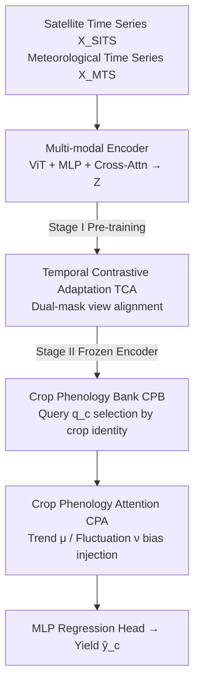

# PhenoYieldNet: Learning Crop-Aware Phenological Responses for Multi-Crop Yield Prediction

**Conference**: CVPR 2026  
**Paper**: [CVF Open Access](https://openaccess.thecvf.com/content/CVPR2026/html/Luo_PhenoYieldNet_Learning_Crop-Aware_Phenological_Responses_for_Multi-Crop_Yield_Prediction_CVPR_2026_paper.html)  
**Code**: https://github.com/roroyo/PhenoYieldNet  
**Area**: Remote Sensing / Agricultural Crop Yield Prediction  
**Keywords**: Multi-crop yield prediction, crop phenology, temporal attention, remote sensing foundation models, contrastive adaptation

## TL;DR
PhenoYieldNet utilizes a unified model for multi-crop county-level yield prediction: it assigns learnable query vectors via a "Crop Phenology Bank" to each crop, decomposes temporal features into long-term trends and short-term fluctuations via "Crop Phenology Attention" (injecting them into attention biases), and utilizes two-stage Temporal Contrastive Adaptation to transfer remote sensing foundation models to agricultural time series. It consistently outperforms single-crop and multi-crop SOTA on CropNet and MODIS.

## Background & Motivation
**Background**: Mainstream crop yield prediction relies on remote sensing satellite image time series (capturing vegetation development) + meteorological time series (drivers like temperature and precipitation) for spatio-temporal feature extraction. Architectures have evolved from CNN-RNN, 3D CNN, and TCN to Transformers, with a recent rise in using Remote Sensing Foundation Models (RSFM, e.g., SpectralGPT) for large-scale pre-training and transfer.

**Limitations of Prior Work**: Almost all methods are **single-crop**, training separate models for corn, cotton, or soybean, and often separate models for different regions. While effective in isolated scenarios, these models cannot generalize across crops or adapt to unseen regions. However, crops worldwide often face similar environmental factors, nutrient stresses, and climate trends; single-crop modeling wastes this transferable common knowledge, especially for data-scarce crops.

**Key Challenge**: The essence of yield prediction is the "meteorological change → phenological response → yield" chain, but different crops respond oppositely to the same meteorological variables. Empirical evidence shows that yield responses of wheat and cotton to mean temperature (trend) are opposite, and their sensitivities to temperature standard deviation (fluctuation) also differ. Existing methods often simply concatenate satellite and meteorological modalities, **failing to explicitly model how weather modulates phenology** at different growth stages, thus failing to accommodate cross-crop differences.

**Goal**: Construct a unified yield prediction model using a single framework that simultaneously captures **common patterns** across crops and their respective **phenological specificities**.

**Key Insight**: Explicitly parameterize "crop-specific phenological signatures" as a set of learnable vectors, and enable the model to explicitly decompose temporal sequences into **long-term trends** and **short-term fluctuations**.

**Core Idea**: Replace simple modality concatenation with a "Crop Phenology Bank + Phenology Attention." A shared encoder's latent space is "pulled" by each crop's query vector toward its most relevant phenological stages, using trend/fluctuation biases to correct the attention focus.

## Method

### Overall Architecture
PhenoYieldNet is an encoder-decoder framework. Input consists of two streams: satellite image time series $X_{\text{SITS}} \in \mathbb{R}^{T\times H\times W\times B}$ ($T$ time steps, spatial $H\times W$, $B$ spectral bands) and meteorological time series $X_{\text{MTS}} \in \mathbb{R}^{T\times N_d\times M}$ ($N_d$ high-frequency records per satellite observation period, $M$ variables). The output is the county-level yield estimate $\hat{y}_c$ for a given crop type $c$.

The **multi-modal encoder** first encodes satellite images via ViT and meteorological data via MLP, then fuses them into unified temporal features $Z\in\mathbb{R}^{T\times d}$ using cross-attention, i.e., $Z=E(X_{\text{SITS}}, X_{\text{MTS}})$. The **crop-aware temporal decoder** then processes $Z$ to model crop-specific phenological dynamics for output $\hat{y}_c=D(Z)$.

The framework is trained in two stages: **Stage I** uses Temporal Contrastive Adaptation (TCA) to continue pre-training the encoder for agricultural sensitivity; **Stage II** freezes the encoder and fine-tunes the decoder and regression head using MSE loss. MSE is calculated in log-space and transformed back to mitigate scale differences between crops:

$$\mathcal{L}_{\text{MSE}} = \frac{1}{N}\sum_{i=1}^{N}\|\log\hat{y}_c^{(i)} - \log y_c^{(i)}\|_2^2$$

### Key Designs

**1. Crop Phenology Bank (CPB): Providing each crop a "phenology key" to retrieve the shared latent space**

A shared encoder learns a "crop-agnostic" latent space, but phenological responses vary significantly. CPB encodes typical phenological characteristics of each crop into a set of learnable vectors $Q=\{q_c\in\mathbb{R}^d \mid c\in C\}$, where each $q_c$ is independently initialized from $\mathcal{N}(0,1)$. During decoding, $q_c$ is retrieved based on crop identity $c$ to serve as a query. It acts as a proxy for the crop's phenological signature, guiding interaction with multi-modal features $Z$ to **focus only on temporal features most relevant to that crop's development**. This is the key to multi-crop unification.

**2. Crop Phenology Attention (CPA): Decomposing time series into Trend + Fluctuation and injecting attention biases**

CPA uses **temporal decomposition** to split features into multi-scale trends and fluctuations. For $Z$ covering the annual cycle, multi-scale moving average pooling with windows $k\in\{3,6,12\}$ captures trends across time scales. These are adaptively aggregated using learnable weights $w_k$ to obtain the trend component $\mu$, with the residual as the fluctuation component $\nu$:

$$\mu = \sum_{k\in\{3,6,12\}} w_k(Z)\cdot \text{Pool}_k(Z), \qquad \nu = Z - \mu$$

Trend and fluctuation are projected into self-attention to generate a bias vector $b_{ph} = \frac{1}{\sqrt{d}}\big(\lambda_\mu (W^Q_\mu\mu)(W^K_\mu\mu)^T + \lambda_\nu (W^Q_\nu\nu)(W^K_\nu\nu)^T\big)$, where $\lambda_\mu, \lambda_\nu$ are weights. Finally, $b_{ph}$ is injected into the phenology-guided attention: with $Q_c=W^Q q_c$ as query and $Z$ as K/V, the output is $h^{pa}_c = \sigma\big(\frac{Q_c K^T}{\sqrt{d}} + b_{ph}\big)V$. Here, $q_c$ determines "where this crop usually focuses," while $b_{ph}$ recalibrates based on the "specific trend/fluctuation of the current year."

**3. Temporal Contrastive Adaptation (TCA): Aligning RSFMs with agricultural time series**

The encoder is initialized from an RSFM (SpectralGPT) pre-trained on general remote sensing data. While it transfers large-scale representations, it is insensitive to crop phenology and temporal dependencies. TCA serves as Stage I, using self-supervised contrastive learning to align representations with temporal dynamics. For each sample in a batch, two masked views are generated (random independent temporal mask $m\in\{0,1\}^T$ and cross-modality shared mask). Views of the same sample (same location and year) are positive pairs, while others are negative pairs, aligned via contrastive loss with temperature $\tau$:

$$\mathcal{L}_{\text{TCA}} = -\log\frac{\exp(\text{sim}(Z, Z^+)/\tau)}{\sum_{Z'\in Z^+\cup\{Z^-\}}\exp(\text{sim}(Z, Z')/\tau)}$$

Masking is applied to the time dimension to force the model to infer missing phenological stages, learning temporal continuity.

### Loss & Training
Two stages: Stage I pre-trains the encoder for 200 epochs via $\mathcal{L}_{\text{TCA}}$ (AdamW, $\beta=(0.9,0.95)$, weight decay 0.05, initial lr 1e-4). Stage II freezes the encoder and fine-tunes the decoder and regression head for 100 epochs using log-space MSE (initial lr 3e-4). CropNet includes $C=4$ crops; single-crop MODIS discards CPB.

## Key Experimental Results

Datasets: CropNet (Sentinel-2 + HRRR meteorology, 2017–2022, Corn/Soybean/Cotton/Winter Wheat) and MODIS (MODIS + meteorology, 2003–2015, Corn only); both cover 11 US states with USDA ground truth. Metrics: RMSE↓, $R^2$↑, Pearson Corr↑.

### Main Results (MODIS Single-Crop)

| Dataset | Method | RMSE↓ | $R^2$↑ | Corr↑ |
|--------|------|-------|--------|-------|
| MODIS | MMST-ViT (2023) | 8.12 | 0.400 | 0.632 |
| MODIS | UNet-ConvLSTM (2024) | 6.33 | 0.586 | 0.766 |
| MODIS | MMVF (2025) | 10.13 | 0.260 | 0.510 |
| MODIS | **PhenoYieldNet** | **5.95** | **0.663** | **0.814** |

Compared to the runner-up UNet-ConvLSTM, RMSE decreases by 0.38 and $R^2$ increases by 0.077.

### Main Results (CropNet Multi-Crop)

| Method | Corn RMSE↓ | Cotton RMSE↓ | Soybean RMSE↓ | Winter Wheat RMSE↓ |
|------|-----------|-----------|-----------|-------------|
| RF (2001) | 21.96 | 85.32 | 6.76 | 10.98 |
| MMST-ViT (2023) | 25.98 | 88.25 | 6.58 | 10.16 |
| PhenoYieldNet-SC (Single-crop) | 17.27 | 71.22 | 6.22 | 8.20 |
| YieldNet (2021, Multi-crop) | 30.96 | 87.41 | 9.23 | 9.46 |
| **PhenoYieldNet-MC (Unified $C=4$)** | **16.52** | **54.88** | 5.91 | 8.32 |

The unified PhenoYieldNet-MC outperforms its single-crop version on Corn/Cotton, significantly reducing Cotton RMSE from 71.22 to 54.88. It leads across all categories compared to YieldNet. ⚠️ Cotton units are lb/ac; others are bu/ac.

### Ablation Study (CropNet, Corn Example)

| Configuration | Corn RMSE↓ | Corn $R^2$↑ | Description |
|------|-----------|------------|------|
| (1) Training from scratch | 21.28 | 0.363 | No RSFM knowledge |
| (2) RSFM only (no TCA) | 18.23 | 0.331 | Direct fine-tuning; gains lost on Cotton/Soybean |
| (3) w/o CPB & CPA | 17.93 | 0.365 | No crop-aware decoder |
| (4) w/o CPA (Standard Attn) | 17.83 | 0.482 | CPB retained |
| (\*) **Full PhenoYieldNet** | **16.52** | **0.516** | All components |

### Key Findings
- **RSFM requires alignment**: Direct fine-tuning of RSFM (Config 2) degrades performance on Cotton/Soybean due to domain gaps; TCA is essential.
- **CPA contribution**: Moving from (4) to the full model reduces Cotton RMSE from 61.60 to 54.88, validating the explicit trend/fluctuation decomposition.
- **Robustness in volatile areas**: PhenoYieldNet shows greater improvement in regions with high meteorological variance compared to stable regions.
- **In-season prediction**: Performance improves as the season progresses, though winter wheat shows a temporary RMSE spike in April as the model integrates late-planted crop signals.

## Highlights & Insights
- **Parameterizing Identity as Queries**: CPB uses query vectors as phenological signatures, enabling the shared encoder to serve multiple crops via "token switching."
- **Trend/Fluctuation Decomposition**: Instead of concatenating weather, the model decomposes it into trend $\mu$ and residual $\nu$, which are injected as attention biases.
- **Temporal Masking for Contrastive Learning**: TCA applies masks to the temporal dimension rather than spatial patches, forcing the model to learn temporal continuity.

## Limitations & Future Work
- CPB is built at the **crop species** level, which may not generalize to unseen crops. Vector quantization could be used to select phenological primitives adaptively.
- The multi-crop paradigm is sensitive to class imbalance (e.g., Winter Wheat performance gap).
- Evaluation is limited to 11 US states and four staples; generalization to tropical crops or different continents remains unverified.

## Related Work & Insights
- **vs YieldNet**: YieldNet uses a shared CNN and independent heads. PhenoYieldNet uses Transformer + CPB/CPA to capture weather-phenology interactions, avoiding the $R^2$ collapse seen in YieldNet's CNN.
- **vs MMST-ViT / MMVF**: These methods treat weather as a standard modality; PhenoYieldNet decomposes weather into trend/fluctuation and achieves multi-crop coverage.
- **vs RSFM**: RSFMs lack phenological and meteorological knowledge; TCA bridges this domain gap more effectively than direct fine-tuning.

## Rating
- Novelty: ⭐⭐⭐⭐ Explicitly parameterizing phenology as queries and using trend/fluctuation bias is a solid approach for unified prediction.
- Experimental Thoroughness: ⭐⭐⭐⭐ Comprehensive datasets, single/multi-crop settings, and robustness analysis; however, geographic scope is narrow.
- Writing Quality: ⭐⭐⭐⭐ Motivation is empirically driven, and methodology is clearly described.
- Value: ⭐⭐⭐⭐ Unified modeling for data-scarce crops has significant practical value for agricultural decision-making.

<!-- RELATED:START -->

## Related Papers

- [\[CVPR 2026\] YieldSAT: A Multimodal Benchmark Dataset for High-Resolution Crop Yield Prediction](yieldsat_a_multimodal_benchmark_dataset_for_high-resolution_crop_yield_predictio.md)
- [\[CVPR 2026\] GeoSANE: Learning Geospatial Representations from Models, Not Data](geosane_learning_geospatial_representations_from_models_not_data.md)
- [\[CVPR 2026\] Orthogonal Spatial-Aware Multi-View Anchor Graph Clustering for Incomplete Remote Sensing Data](orthogonal_spatial-aware_multi-view_anchor_graph_clustering_for_incomplete_remot.md)
- [\[CVPR 2026\] HySeg: Learning Generative Priors for Structure-Aware Remote Sensing Segmentation](hyseg_learning_generative_priors_for_structure-aware_remote_sensing_segmentation.md)
- [\[CVPR 2026\] QuCNet: Quantum Deep Learning Driven Multi-Circuit Network for Remote Sensing Image Classification](qucnet_quantum_deep_learning_driven_multi-circuit_network_for_remote_sensing_ima.md)

<!-- RELATED:END -->
