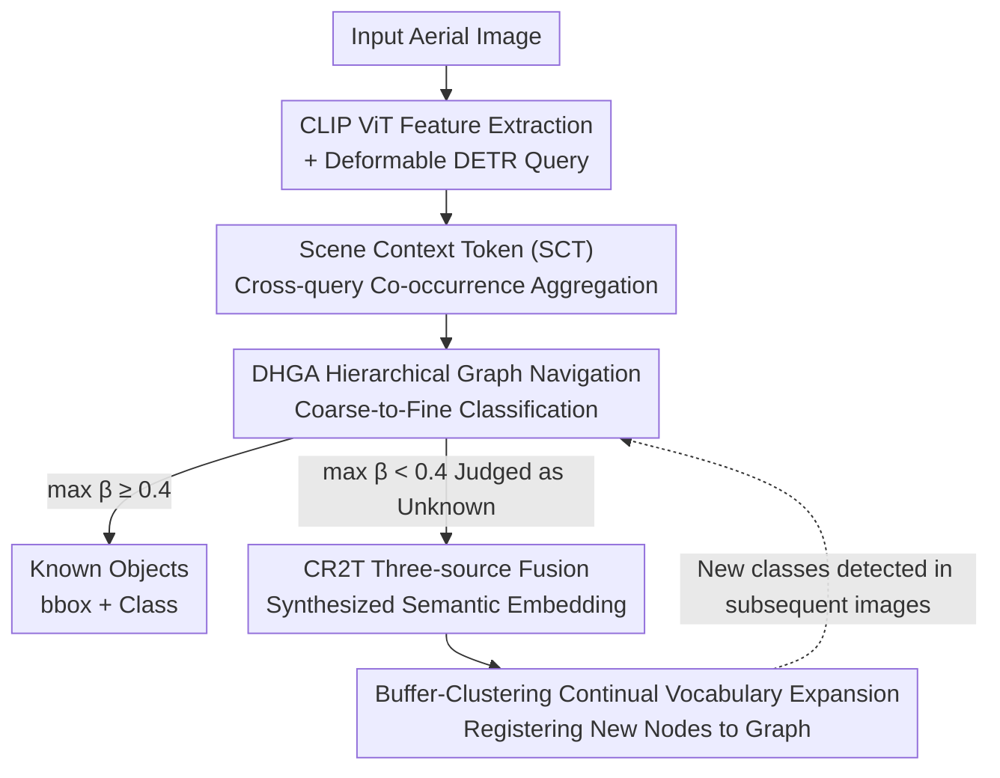

# Prompt-Free Unknown Label Generation for Open World Detection in Remote Sensing

**Conference**: CVPR 2026  
**Paper**: [CVF Open Access](https://openaccess.thecvf.com/content/CVPR2026/html/Azeem_Prompt-Free_Unknown_Label_Generation_for_Open_World_Detection_in_Remote_CVPR_2026_paper.html)  
**Code**: None  
**Area**: Remote Sensing / Open World Object Detection  
**Keywords**: Open World Detection, Remote Sensing, Hierarchical Semantic Graph, Contextual Co-occurrence, Prompt-free Annotation

## TL;DR
HSGDet enables remote sensing detectors to discover unknown objects during deployment without any text prompts. By utilizing a "Hierarchical Semantic Graph + Scene Co-occurrence Context," it automatically synthesizes CLIP semantic labels for unknowns and integrates new classes into the vocabulary. It outperforms SOTA by 6.6 points in Known mAP, 9.9 points in Unknown Recall, and reduces Wilderness Impact by 36%.

## Background & Motivation
**Background**: Remote sensing object detection typically follows two paths: Open-Vocabulary Detection (OVD), which uses vision-language pre-training like CLIP to recognize arbitrary "prompted" categories at test time; or Open-World Object Detection (OWOD), which focuses on discovering new instances outside the training set and labeling them as "unknown" without prompts. Recently, unified models (OW-OVD) have emerged to combine both, identifying prompted known classes while marking unprompted instances as unknown.

**Limitations of Prior Work**: Each of the three routes has deficiencies. OVD requires pre-defined vocabularies and prompts; it remains "blind" to truly unexpected objects (e.g., "street lamps" in aerial images). OWOD can discover unknowns but cannot name them, leaving anonymous placeholders that require manual labeling. While unified models mitigate prompt dependency, naming unknowns still relies on external LLMs for attribute generation or foundation models for pseudo-labeling, hindering true autonomy during deployment.

**Key Challenge**: Concurrent "autonomous discovery" and "autonomous naming" have not been achieved within the same test-time moment without external assistance. Remote sensing adds complexity: the same visual pattern can have different semantics depending on the environment (e.g., small targets near airport runways are planes, while those near docks are ships). Flat vision-language alignment fails to leverage such context.

**Goal**: Build an end-to-end detector that can simultaneously detect known classes, mark unknown regions, synthesize usable semantic labels for unknowns, and register new classes into the vocabulary for continuous expansion without external prompts, external models, or manual annotation.

**Key Insight**: The author observes that "nearby co-occurrence" in remote sensing is a strong discriminative signal. Instead of viewing visual features of a region in isolation, categories are organized into a Hierarchical Semantic Graph (WordNet IS-A tree). This allows detection queries to "navigate" the graph from coarse to fine levels guided by scene context, letting semantics be determined by the environment rather than appearance alone.

**Core Idea**: Replace "flat prompted classification" with "scene-co-occurrence-guided hierarchical graph navigation." For low-confidence regions, synthesize semantic embeddings directly in the CLIP space using triple-source fusion (visual + hierarchical parent + scene context), allowing discovered unknowns to be named and registered immediately.

## Method

### Overall Architecture
HSGDet is built on Deformable DETR. A frozen CLIP ViT-B/32 extracts multi-scale features $\{F_1,F_2,F_3,F_4\}$. The decoder takes $N=300$ learnable object queries $Q\in\mathbb{R}^{N\times d}$, passing through self-attention, deformable spatial attention, **Deformable Hierarchical Graph Attention (DHGA)**, and an FFN at each layer. All categories are pre-organized into a Hierarchical Semantic Graph $G=(V,E)$, where nodes are categories (with CLIP text embeddings $t_v$ and learnable key embeddings $e_v$) and edges represent "is-a" parent-child relationships.

The pipeline operates as follows: queries are first injected with co-occurrence information via a global **Scene Context Token (SCT)**. Then, in DHGA, they perform navigation-based classification along the hierarchical graph from coarse (parent) to fine (child) levels. The final layer's attention weights $\beta_{i,v}$ serve directly as classification scores, eliminating the need for an independent head. When the maximum attention for a query across all known classes $\max_v\beta_{i,v}<\tau_{unk}=0.4$, it is identified as unknown and sent to **CR2T**. CR2T synthesizes a text embedding by fusing the visual query, scene context, and the nearest parent node to serve as the semantic label. Finally, a "buffer-clustering" strategy registers consistent unknown embeddings as new nodes in the graph for continuous vocabulary expansion.

### Key Designs

**1. Hierarchical Semantic Graph: Upgrading Vocabulary to a Navigable IS-A Tree**

This addresses the limitation where flat vision-language alignment provides neither "coarse-to-fine" reasoning paths nor a structure for new classes. Categories are built into a directed graph $G=(V,E)$. Each node $v$ possesses a CLIP text embedding $t_v$ (for semantic alignment) and a learnable key embedding $e_v$ (for query retrieval during navigation). Edges encode parent-child "is-a" relationships, with an adjacency matrix $A_{uv}=1$ if $(u,v)\in E$. This graph serves three functions: providing a hierarchical skeleton for DHGA, offering "nearest parent" anchors for unknowns, and enabling seamless expansion by attaching new nodes $v_{new}$ (with $t_{new}$ and $e_{new}$) under parent nodes $v_p$ during deployment.

**2. DHGA: Coarse-to-Fine Classification via Scene-Co-occurrence-Conditioned Graph Attention**

This addresses the issue where standard Deformable Graph Attention treats all nodes equally and ignores hierarchy or scene context. DHGA introduces a learnable Scene Context Token $c$, which aggregates co-occurrence information from all queries via cross-attention in each decoder layer: $c_{new}=\mathrm{CrossAttn}(c_{prev},q_i,q_i)$, followed by residual injection: $\tilde q_i=q_i+c_{new}$. This process embeds global "surroundings" clues into each query. Subsequently, semantic-related nodes are selected via Top-K sampling: correlation scores are calculated as $\delta_{i,v}=\tilde q_i^T e_v$, and $S_i=\mathrm{Top\text{-}K}(\mathrm{softmax}(\delta_i),K)$ is selected, reducing complexity from $O(N|V|)$ to $O(NK)$. Attention fusion uses the CLIP text embeddings of selected nodes: $\beta_{i,v}=\mathrm{softmax}(\tilde q_i^T t_v/\sqrt d)$, $q_i^{next}=q_i+\sum_{v\in S_i}\beta_{i,v}t_v$. Since weights depend on $\tilde q_i$ (containing scene context), semantic fusion naturally biases towards "contextually appropriate" categories. Coarse-to-fine behavior emerges across decoder layers: shallow layers focus on coarse parent nodes due to weak visual detail, while deeper layers shift to fine-grained child nodes, constrained by a hierarchical loss $L_{hier}$ for ancestral path consistency.

**3. CR2T: Triple-Source Fusion for Unknown Semantic Label Synthesis**

This addresses the naming problem in OWOD and unified models. CR2T synthesizes labels using internal graph information as anchors. For an unknown query, the node with the highest attention among sampled nodes is selected as the "nearest parent" $v_p=\arg\max_{v\in S_i}\beta_{i,v}$. Although the score is below the unknown threshold, $v_p$ indicates the general branch of the classification tree (e.g., visually resembles a ship but doesn't match known types; the parent might be "ship" or "vehicle"). A learnable MLP fusion function $f$ combines three sources: $t_{new}=f([q_i^{final};c;t_{v_p}])$, representing the refined visual query, scene context token, and parent text embedding. Since $t_{new}$ resides in the CLIP embedding space, it serves as a semantic label without a fixed vocabulary. Human-readable names are retrieved via "hierarchically constrained nearest neighbor search" within the children of $v_p$, which is a post-hoc output conversion; internal detection and expansion run entirely on continuous embeddings.

**4. Buffer-Clustering for Continual Vocabulary Expansion**

To prevent noisy or false detections from polluting the graph, HSGDet uses a "buffer-then-cluster" threshold. During inference, $t_{new}$ is accumulated in a buffer. When a cluster of $M=5$ embeddings appears with a pairwise cosine similarity exceeding $\tau_{sim}=0.7$, a new node $v_{new}$ is created. Its text embedding is the cluster average $t_{new}=\frac1M\sum_i t_i$, its visual prototype inherits the parent $e_{new}=e_{v_p}$, and it is assigned a parent $p(v_{new})=v_p$. Once established, the new class is immediately available for subsequent images, ensuring growth filtered by consistent observation.

### Loss & Training
The end-to-end multi-task loss is $L=L_{det}+\lambda_1 L_{hier}+\lambda_2 L_{CR2T}$, with $\lambda_1=0.5, \lambda_2=0.3$. $L_{det}$ retains only bbox regression (L1 + GIoU), as classification is replaced by graph navigation. The hierarchical navigation loss $L_{hier}$ supervises path traversal, ensuring high attention for all ancestor nodes from the root to the ground-truth class $\hat c$:

$$L_{hier}=-\frac{1}{N_{gt}}\sum_{i=1}^{N_{gt}}\sum_{v\in P(c_i)}\log\beta_{i,v}$$

For CR2T training, 30% of known classes are randomly masked as "pseudo-unknowns." Supervision uses L1 alignment and sibling contrastive constraints: $L_{CR2T}=\frac{1}{N_{mask}}\sum_i\big[(1-\cos(t_i^{pred},t_i^{gt}))+\lambda_c L_i^{contrast}\big]$, where $L_i^{contrast}=\max(0,\cos(t_i^{pred},t_i^{neg})-\cos(t_i^{pred},t_i^{gt})+\gamma)$ (with $t^{neg}$ sampled from sibling classes, $\lambda_c=0.1, \gamma=0.2$). This prevents semantic collapse and forces the network to learn transferable rules of how objects combine with their parent classes. Training utilizes AdamW (lr=1e-4, weight decay=1e-5), 50 epochs with cosine annealing, 5 epoch warmup, $L=4$ decoder layers, $N=300$ queries, and a 3-layer MLP for CR2T with 0.1 dropout.

## Key Experimental Results

### Main Results
Evaluated on DOTA-v2 (18 classes), FAIR1M (37 classes), DIOR (20 classes), and COCO (80 classes) using Known mAP (K-mAP↑), Unknown Recall (U-R↑), and Wilderness Impact (WI↓). DOTA-v2/COCO use a 4-task incremental setup. Comparison on DOTA-v2 (Task 1):

| Method | Source | K-mAP ↑ | U-R ↑ | WI ↓ |
|------|------|---------|-------|------|
| ORE | CVPR-21 | 42.3 | 18.5 | 15.2 |
| PROB | CVPR-23 | 45.7 | 24.3 | 10.8 |
| OrthogonalDet | CVPR-24 | 47.8 | 28.6 | 09.3 |
| OW-OVD | CVPR-25 | 48.3 | 29.5 | 08.9 |
| SkySense-O† | CVPR-25 | 50.2 | 31.5 | 08.1 |
| **HSGDet** | CVPR-26 | **54.8** | **41.2** | **05.8** |

Compared to SkySense-O, HSGDet achieves +4.6 K-mAP, +9.7 U-R, and reduces WI from 8.1 to 5.8. Across all tasks in the incremental setup, K-mAP increases (Task 1→4: 54.8→57.9→60.1→62.3), proving the cumulative benefit of continuous vocabulary expansion.

### Ablation Study
Component ablation (DOTA-v2 Task 1; baseline is CLIP-Vision Deformable DETR with ORE-style energy detection):

| Configuration | K-mAP ↑ | U-R ↑ | WI ↓ | Description |
|------|---------|-------|------|------|
| Baseline | 44.7 | 20.5 | 14.3 | Unknown marking without naming |
| + DHGA | 48.9 | 28.0 | 11.2 | Hierarchical navigation, U-R +7.5 |
| + DHGA + SCT | 52.1 | 33.8 | 08.4 | Adding scene context, U-R +5.8 |
| + DHGA + SCT + CR2T (Full) | 54.8 | 41.2 | 05.8 | Full model, K-mAP +10.1 / U-R +20.7 vs baseline |

CR2T source fusion ablation (TA = Textual Alignment via cosine similarity with GT CLIP; SMC = Semantic Member Consistency):

| CR2T Variant | TA ↑ | SMC ↑ | U-R ↑ | WI ↓ |
|-----------|------|-------|-------|------|
| Visual-Only | 0.56 | 0.67 | 37.4 | 07.5 |
| + Hierarchical Parent (HP) | 0.63 | 0.71 | 38.6 | 06.7 |
| + Scene Context (SC) | 0.66 | 0.74 | 39.1 | 06.4 |
| Full | 0.79 | 0.82 | 41.2 | 05.8 |

### Key Findings
- Each component provides consistent gains: DHGA primarily boosts U-R (+7.5) by assisting "unknown discovery." SCT pushes U-R to 33.8, confirming co-occurrence as a vital signal in RS. CR2T finalizes the U-R gain to 41.2 while minimizing WI.
- All three sources in CR2T are essential: Textual alignment is only 0.56 with visual features alone, increasing by 0.07 with HP and further with SC. The structural anchors (HP + SC) contribute more than visual features alone.
- CR2T synthesizes embeddings with 0.79 alignment to ground truth text embeddings without any external language models, validating "prompt-free autonomous naming."

## Highlights & Insights
- **Naming as Synthesis rather than Retrieval**: By synthesizing CLIP space vectors directly, HSGDet treats human-readable names as post-hoc conversions, bypassing fixed vocabulary constraints.
- **Efficient Scene Context**: A single global token cross-aggregating and residually injecting co-occurrence information provides essential disambiguation cues for RS with near-zero overhead.
- **Quality-Controlled Expansion**: The "buffer-clustering" mechanism (M=5, similarity threshold) filters noise before graph integration, offering a robust paradigm for online discovery.
- **Emergent Coarse-to-Fine Classification**: Hierarchical behavior emerges naturally through decoder layers without explicit path planning or multiple heads.

## Limitations & Future Work
- Vocabulary expansion relies on hyperparameters ($M=5, \tau_{sim}=0.7, \tau_{unk}=0.4$), yet the paper lacks sensitivity analyses ⚠️, which may limit generalization to scenarios with different co-occurrence statistics.
- The mechanism assumes a hierarchical graph based on WordNet and stable co-occurrence. If a new class falls far outside the taxonomy (out-of-taxonomy), the "parent anchor" logic might fail.
- Readable labels depend on correct parent node selection. With 0.79 alignment, a 20% error margin exists, which could lead to misnaming among fine-grained similar classes (e.g., specific ship types).
- While COCO is evaluated, the core benefits are demonstrated in RS. The relative advantage in natural images with less structured co-occurrence requires further validation.

## Related Work & Insights
- **vs OVD**: OVD requires pre-defined vocabularies and prompts; HSGDet discovers and names autonomously.
- **vs OWOD**: Traditional OWOD leaves anonymous placeholders; HSGDet adds CR2T for semantic generation and vocabulary expansion.
- **vs OW-OVD**: OW-OVD relies on LLMs or attributes for naming; HSGDet uses an internal, autonomous synthesis mechanism and hierarchical reasoning.
- **vs Standard Deformable Graph Attention**: DHGA upgrades node aggregation with hierarchical navigation, learnable keys, and scene conditioning.

## Rating
- Novelty: ⭐⭐⭐⭐⭐ First OWOD to perform concurrent discovery and naming at test time without external LLMs.
- Experimental Thoroughness: ⭐⭐⭐⭐ Extensive across four datasets and incremental tasks; lacks analysis for out-of-taxonomy scenarios.
- Writing Quality: ⭐⭐⭐⭐ Clear motivation and good correspondence between text and figures; some minor OCR artifacts in formulas.
- Value: ⭐⭐⭐⭐⭐ Addresses the "discovery is easy, naming is hard" pain point in RS; the prompt-free expansion paradigm is highly valuable for open-world deployment.

<!-- RELATED:START -->

## Related Papers

- [\[CVPR 2026\] ReAttnCLIP: Training-Free Open-Vocabulary Remote Sensing Image Segmentation via Re-defined Attention in CLIP](reattnclip_training-free_open-vocabulary_remote_sensing_image_segmentation_via_r.md)
- [\[CVPR 2026\] UniGeoSeg: Towards Unified Open-World Segmentation for Geospatial Scenes](unigeoseg_towards_unified_open-world_segmentation_for_geospatial_scenes.md)
- [\[CVPR 2026\] MM-OVSeg: Multimodal Optical-SAR Fusion for Open-Vocabulary Segmentation in Remote Sensing](mm-ovseg_multimodal_optical-sar_fusion_for_open-vocabulary_segmentation_in_remot.md)
- [\[CVPR 2026\] VLM4RSDet: Collaborative Optimization with Vision-Language Model for Enhancing Remote Sensing Object Detection](vlm4rsdet_collaborative_optimization_with_vision-language_model_for_enhancing_re.md)
- [\[CVPR 2026\] Rotation Invariant and Symmetry Aware Pixel Difference Network for Remote Sensing Object Detection](rotation_invariant_and_symmetry_aware_pixel_difference_network_for_remote_sensin.md)

<!-- RELATED:END -->
