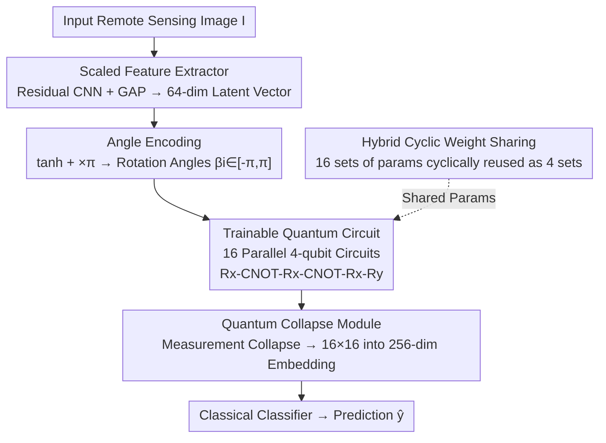

# QuCNet: Quantum Deep Learning Driven Multi-Circuit Network for Remote Sensing Image Classification

**Conference**: CVPR 2026  
**Paper**: [CVF Open Access](https://openaccess.thecvf.com/content/CVPR2026/html/Komal_QuCNet_Quantum_Deep_Learning_Driven_Multi-Circuit_Network_for_Remote_Sensing_CVPR_2026_paper.html)  
**Code**: None  
**Area**: Remote Sensing Image Classification / Quantum Deep Learning  
**Keywords**: Hybrid Quantum-Classical Networks, Trainable Quantum Circuits, Expressibility Analysis, Weight Sharing, Remote Sensing Scene Classification

## TL;DR
QuCNet integrates an ultra-lightweight convolutional encoder with 16 parallel 4-qubit Trainable Quantum Circuits (TQCs). It employs "Hybrid Cyclic Weight Sharing (HCWS)" to manage 16 circuits with only 64 independent parameters and utilizes KL divergence expressibility analysis to select gate sequences that avoid barren plateaus. Ultimately, it achieves higher accuracy than classical CNNs on 7 remote sensing benchmarks using only 87k parameters (85× smaller than similar hybrid models) and completes hardware inference on real IBM quantum processors.

## Background & Motivation
**Background**: Remote Sensing Image Scene Classification (RSISC) is a foundational task for land use, urban monitoring, and disaster response. While classical CNNs and ViTs achieve high accuracy, they struggle to generalize across heterogeneous geographic data with varying sensors, resolutions, and lighting. Lightweight networks like MobileNet/EfficientNet reduce computational costs but suffer from limited representational capacity.

**Limitations of Prior Work**: Quantum Deep Learning (QDL) leverages entanglement and superposition to theoretically encode richer feature interactions with fewer parameters. However, Noisy Intermediate-Scale Quantum (NISQ) hardware faces constraints: limited qubits, gate noise, and decoherence. As circuits grow deeper or parameters increase, gradient variance decays exponentially (barren plateaus), making training impossible.

**Key Challenge**: Current hybrid quantum-classical schemes for RSISC typically attach a shallow Variational Quantum Circuit (VQC) as an isolated classifier behind a pre-trained CNN. These quantum components rarely exchange features and suffer from parameter redundancy, limiting scalability and choking gradient flow. This creates a direct conflict between "Expressibility" and "Trainability"—increasing depth/width to improve expression leads to gradient disappearance, while reducing them to stabilize gradients sacrifices performance.

**Goal**: To build a unified hybrid network where quantum components actively participate in feature learning rather than serving as mere add-ons, while maintaining extremely low parameter counts, stable gradients, and feasibility for real-world hardware execution.

**Core Idea**: Instead of stacking one deep circuit, the model uses **16 parallel shallow 4-qubit circuits** for quantum feature mixing. **Cyclic Weight Sharing** compresses the parameters (from 16 sets to 4), and **expressibility (KL divergence) metrics** guide the gate sequence design to maintain a stable balance between expressibility and trainability.

## Method

### Overall Architecture
QuCNet follows a "Classical Domain → Quantum Domain → Classical Domain" pipeline consisting of three main modules: the **Scaled Feature Extractor (SFE)** compresses input images into 64-dimensional latent vectors; the **Trainable Quantum Circuit (TQC)** partitions these vectors into 16 segments, each fed into a 4-qubit quantum circuit for entangled feature mixing, with parameters shared via **HCWS**; and the **Quantum Collapse Module (QCM)** concatenates the 16-dimensional probability vectors from each circuit into a 256-dimensional quantum-enhanced embedding for final prediction. The hybrid parameters are jointly optimized via PennyLane/PyTorch.

### Key Designs

**1. Scaled Feature Extractor (SFE): Compressing images into 64-dimensional phases**

Since a 4-qubit circuit cannot process raw images, a classical front-end is required to compress the image into low-dimensional latent vectors without losing critical information. SFE uses a lightweight residual CNN: the main branch consists of two $3\times3$ convolutions with AvgPool, and the residual branch uses a $1\times1$ convolution + AvgPool. The sum $F = F_{main} + F_{res} \in \mathbb{R}^{C'\times H'\times W'}$ ($C'=64$, stride=1, padding=1) is passed through Global Average Pooling (GAP) to obtain a 64-dimensional channel descriptor $f_c = \frac{1}{H'W'}\sum_{h,w} F_{c,h,w}$, forming $f'_c \in \mathbb{R}^{64}$.

A crucial step is normalization before "quantization": $f^{final}_c = \tanh(f'_c)$ maps values to $[-1,1]$, then multiplying by $\pi$ yields valid rotation angles $\beta_i = \pi f^{final}_c[i] \in [-\pi,\pi]$, used as phases for $R_z(\beta_i)$ encoding gates. This ensures unambiguous mapping of classical features into quantum phase space.

**2. Trainable Quantum Circuit (TQC): Parallel shallow circuits guided by expressibility**

This is the core of the architecture. The 64-dimensional output from SFE is split into 16 segments, each fed to one TQC. Each TQC contains only 4 qubits and 30 gates (4-H, 4-Rz, 12-Rx, 4-Ry, 6-CNOT) with a circuit depth of 12. 

The evolution of a single circuit starts by applying Hadamard gates to four $|0\rangle$ states to create a uniform superposition $|\psi_0\rangle = H^{\otimes 4}|0000\rangle = \frac{1}{\sqrt{16}}\sum_{x=0}^{15}|x\rangle$, allowing the circuit to explore all 16 basis states. SFE features are encoded via $R_z$ gates: $|\psi_{f(i)}\rangle = R_z(f_3)\otimes R_z(f_2)\otimes R_z(f_1)\otimes R_z(f_0)\cdot H^{\otimes 4}|0000\rangle$. Then, trainable $R_x$ variational gates and CNOT entanglement chains are applied. Entanglement uses a linear CNOT chain $U_{CNOT} = CNOT(2,3)\cdot CNOT(1,2)\cdot CNOT(0,1)$ to correlate adjacent qubits, capturing dependencies impossible for classical systems. The final state is:

$$|\psi_{final}\rangle = U''\cdot U_{CNOT}\cdot U'\cdot U_{CNOT}\cdot U\,|\psi_{f(i)}\rangle$$

where $U''=\bigotimes_{i=0}^{3} R_x(\theta_{2i+8})\cdot R_y(\theta_{2i+9})$ introduces non-Clifford $R_y$ transformations to expand the reachable Hilbert space. Measurement collapses the state into a 16-dimensional probability vector $p(x) = |\langle x|\psi_{final}\rangle|^2$.

The gate sequence was chosen based on **Expressibility metrics**, defined as the KL divergence between the TQC's fidelity distribution $\hat{P}_{TQC}(F;\theta)$ and the Haar random distribution $P_{Haar}(F)$: $\mathrm{Expr} = D_{KL}(\hat{P}_{TQC}\,\|\,P_{Haar})$. As rotation and entanglement gates were added, $D_{KL}$ dropped from 0.694 to 0.01, correlating positively with accuracy.

**3. Hybrid Cyclic Weight Sharing (HCWS): 64 independent parameters for 16 circuits**

If 16 TQCs were independent, the parameters $\Theta_{full} \in \mathbb{R}^{16\times 16}$ would cause over-parameterization, leading to barren plateaus where gradient variance decays as $\mathrm{Var}[\partial L/\partial\theta_j] \propto \exp(-\alpha\,n_{active})$. HCWS adopts parameter sharing from CNNs: only 4 sets of independent parameters $\Theta_{HCWS} \in \mathbb{R}^{4\times 16}$ are maintained. These are reused following a cyclic rule $q1\!\to\!q2\!\to\!q3\!\to\!q4$ repeated four times, such that the $r$-th set is shared by circuits $\{r, r{+}4, r{+}8, r{+}12\}$. 

This strategy balances "Fully Shared" (stable gradients but low diversity) and "Fully Independent" (flexible but redundant/prone to over-fitting). It maintains expressibility while keeping $n_{active}$ low to stabilize gradients and is the key to achieving the 87k parameter count.

**4. Quantum Collapse Module (QCM): Concatenating quantum-enhanced embeddings**

Each TQC acts as a variational mapping $Q_\theta: \mathbb{R}^4 \to \mathbb{R}^{16}$. After evolution and measurement, the 16-dimensional probability vectors $z^{(i)}$ are concatenated along the channel dimension: $z = [z^{(1)}\|z^{(2)}\|\dots\|z^{(16)}]\in\mathbb{R}^{256}$. This 256-dimensional quantum-enhanced embedding is fed to a final classical layer.

### Loss & Training
The model is trained end-to-end using Cross-Entropy loss with the Adam optimizer (lr=0.001, cosine decay) for 200 epochs. Training uses an 80/20 stratified split. Classical and quantum parameters are joint-optimized via PennyLane (0.28.0) and PyTorch (2.0.1) using the `qml.qnn.TorchLayer` interface and exact state-vector simulation (`default.qubit`). For hardware inference, the trained parameters are migrated to Qiskit and executed on IBM processors using Qiskit Runtime SamplerV2 with 512 shots per image.

## Key Experimental Results

### Main Results
QuCNet was tested on 7 remote sensing benchmarks (AID, AIDER, UCM, NPU-45, EuroSAT, USTC SmokeRS, IIITDMJ Smoke). It outperformed both classical CNNs and existing hybrid models with 1–3 orders of magnitude fewer parameters.

| Dataset | Metric | Ours | Comparison Method | Notes |
|--------|------|--------|----------|------|
| EuroSAT | Acc% | **97.56** (0.08M) | HQNNC 97.00 (0.098M) / ResNet50 96.72 (25.6M) | 320× smaller than ResNet50 |
| UCM | Acc% | **98.00** (0.081M) | HybridQC 95.89 (1.89M) | +2.11% gain, 24× smaller |
| AID | Acc% | 88.84 (0.083M) | HybridQC 86.13 / GoogleNet 83.44 | +3.14% over HybridQC |
| NPU-45 | Acc% | 86.60 (0.087M) | HybridQC 79.32 | +9.17% gain, 89× smaller than MobileNetV2 |
| AIDER | Acc% | **92.38** (0.077M) | WATT-EffNet 88.50 / EfficientNet 80.00 | +4.38% / +12.38% gain |
| USTC SmokeRS | Acc% | **95.75** (0.077M) | FireClassNet 86.14 / MAIN 85.61 | Significant lead |
| IIITDMJ Smoke | Acc% | **99.28** (0.077M) | MAIN 97.68 | Outperforms all CNN baselines |

**Cross-domain Validation**: On CIFAR-10, with the same parameter budget, QuCNet (86.78%) outperformed the classical-only baseline (84.27%). Performance: ~123.82s per epoch, 1.2ms inference per image, only 0.17 GFLOPs.

### Ablation Study

**Effectiveness of TQC Module (w/i vs w/o TQC)**

| Dataset | w/i TQC | w/o TQC | Gain |
|--------|---------|---------|------|
| USTC SmokeRS | 95.75 | 92.23 | +3.52% |
| AID | 88.84 | 86.26 | +2.58% |
| AIDER | 92.38 | 90.47 | +1.91% |
| NPU-45 | 86.60 | 84.75 | +1.85% |
| UCM | 98.00 | 96.71 | +1.29% |
| EuroSAT | 97.56 | 96.78 | +0.78% |

**Gate Sequence & Weight Sharing (AID Dataset)**

| Category | Configuration | Acc% |
|------|------|------|
| TQC (Ours) | Rx-CNOT-Rx-CNOT-Rx-Ry | **88.84** |
| TQC-3 | Rx-CNOT-Rx-Ry | 87.05 |
| All Shared | q1→q1×16 | 88.05 |
| All Independent | q1→…→q16 | 87.59 |
| HCWS (Ours) | q1→q2→q3→q4 ×4 | **88.84** |

**Hardware Backend Migration**: From noiseless simulation to real hardware, AID accuracy dropped from 88.84% (Ideal) → 77.53% ($ibm\_torino$) / 76.21% ($ibm\_fez$), a ~12.63% drop. USTC SmokeRS maintained 86% on real hardware. Transpilation to IBM's native gate set increased circuit depth from 12 to 43.

### Key Findings
- TQC provides higher gains on "challenging" datasets (USTC SmokeRS +3.52%), proving quantum transformations assist in learning complex high-level representations.
- The terminal $R_y$ rotation is critical for expressibility, introducing non-Clifford transformations. Removing it (TQC-3) drops accuracy to 87.05%.
- HCWS outperforms both Full-Sharing (+0.79%) and Full-Independence (+1.25%), confirming cyclic reuse as a superior trade-off for stability and diversity.
- HCWS helps mitigate accuracy drops on real hardware by limiting parameter redundancy and reducing cumulative gate noise.

## Highlights & Insights
- **Expressibility-Guided Architecture**: Using KL divergence as a "design compass" to validate gates ($D_{KL}$ 0.694 → 0.01) creates a reusable paradigm for VQC design.
- **Quantum Weight Sharing**: HCWS effectively adapts the classical CNN weight-sharing concept to solve parameter count, barren plateaus, and hardware noise issues simultaneously.
- **Wide & Shallow > Deep**: Opting for a parallel wide/shallow structure over a single deep circuit avoids barren plateaus while maintaining capacity—a key architectural lesson for the NISQ era.
- **Real-World Closure**: Reporting full performance drops on real IBM hardware establishes the actual feasibility and limitations of 4-qubit shallow circuits.

## Limitations & Future Work
- The model is trained using exact state-vector simulation; parameters are frozen before hardware inference. There is still a 9–13% accuracy gap between simulation and real hardware.
- Transpilation to IBM's native gates expands depth from 12 to 43. For scaling to more qubits or complexity, gate decomposition noise will become a major bottleneck.
- While highly efficient, absolute SOTA accuracy (e.g., ATMFormer 99.46%) is often achieved by models with 100x–1000x more parameters.

## Related Work & Insights
- **vs HybridQC / HQNN**: Prior works used VQCs as isolated, weakly-coupled classifiers with redundant parameters. Ours uses 16 parallel TQCs with HCWS for deep coupling, achieving higher accuracy on AID/NPU-45 with 24× fewer parameters.
- **vs QuanV4EO / RemoteQ-ResNet**: These models utilize deep backbones or single-circuit modules but remain restricted to simulation. Ours uses "multi-circuit + weight sharing" and provides real hardware validation.
- **vs Classical Lightweight Nets**: QuCNet leverages quantum entanglement to improve inter-class separability under strict parameter budgets, particularly in low-contrast scenarios like smoke detection.

## Rating
- Novelty: ⭐⭐⭐⭐ Expressibility-driven design + HCWS is a fresh combination; individual techniques are strong engineering integrations.
- Experimental Thoroughness: ⭐⭐⭐⭐⭐ 7 benchmarks + cross-domain tests + real IBM hardware backends.
- Writing Quality: ⭐⭐⭐⭐ Clear pipeline, though some critical details (like parameter breakdown) are moved to supplementary materials.
- Value: ⭐⭐⭐⭐ Provides a hardware-feasible lightweight RSISC path with significant reference value for quantum remote sensing.

<!-- RELATED:START -->

## Related Papers

- [\[CVPR 2026\] Uncertainty-Guided Edge Learning for Deep Image Regression in Remote Sensing](uncertainty-guided_edge_learning_for_deep_image_regression_in_remote_sensing.md)
- [\[CVPR 2026\] Robust Remote Sensing Image–Text Retrieval with Noisy Correspondence](robust_remote_sensing_image-text_retrieval_with_noisy_correspondence.md)
- [\[CVPR 2026\] Rotation Invariant and Symmetry Aware Pixel Difference Network for Remote Sensing Object Detection](rotation_invariant_and_symmetry_aware_pixel_difference_network_for_remote_sensin.md)
- [\[CVPR 2026\] SkySense-VITA: Towards Universal In-context Segmentation of Multi-modal Remote Sensing Imagery](skysense-vita_towards_universal_in-context_segmentation_of_multi-modal_remote_se.md)
- [\[CVPR 2026\] Orthogonal Spatial-Aware Multi-View Anchor Graph Clustering for Incomplete Remote Sensing Data](orthogonal_spatial-aware_multi-view_anchor_graph_clustering_for_incomplete_remot.md)

<!-- RELATED:END -->
