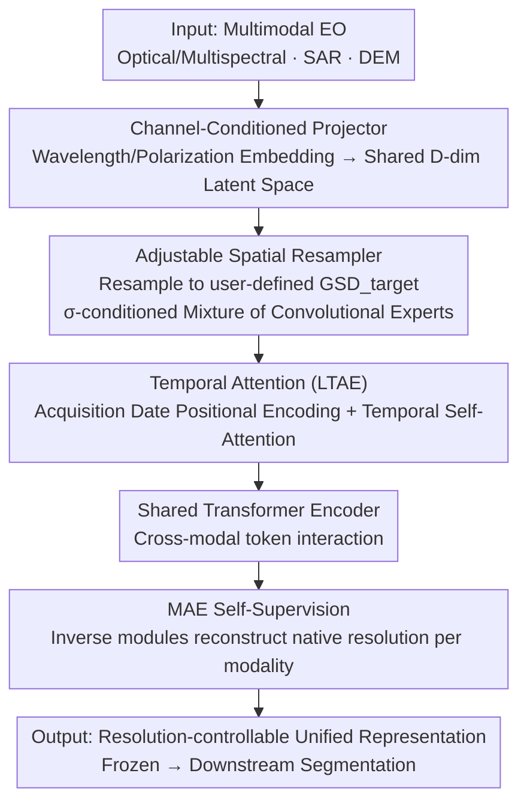

# RAMEN: Resolution-Adjustable Multimodal Encoder for Earth Observation

**Conference**: CVPR 2026  
**Paper**: [CVF Open Access](https://openaccess.thecvf.com/content/CVPR2026/html/Houdre_RAMEN_Resolution-Adjustable_Multimodal_Encoder_for_Earth_Observation_CVPR_2026_paper.html)  
**Code**: https://github.com/nicolashoudre/RAMEN (Available)  
**Area**: Remote Sensing / Multimodal Foundation Models for Earth Observation  
**Keywords**: Earth Observation, Resolution-Adjustable, Multimodal Encoder, Sensor-Agnostic, Masked Self-Supervised Learning

## TL;DR
RAMEN is a "sensor-agnostic, resolution-adjustable" unified Transformer encoder: it explicitly encodes modality, spatial resolution (GSD), and temporal resolution as input features into a shared latent space. It **treats spatial resolution as a controllable output parameter during inference**, allowing users to balance precision and computation. Pre-trained on heterogeneous Earth Observation (EO) corpora using masked reconstruction, it outperforms larger state-of-the-art (SOTA) models like TerraMind-L on 8 downstream tasks in the PANGAEA benchmark using a frozen ViT-Base backbone.

## Background & Motivation
**Background**: Earth Observation (EO) data is inherently heterogeneous—ranging from 0.2m aerial RGB to 10–30m multispectral satellite imagery, SAR, and digital elevation models (DEM), with massive differences in channel meanings, Ground Sampling Distance (GSD), and temporal sampling. Most existing multimodal EO foundation models utilize **sensor-specific encoders** to integrate multi-modalities.

**Limitations of Prior Work**: (1) Sensor-specific encoders require architectural changes and retraining of parts of the network when switching to new modalities, limiting generalization; (2) Recent improvements focus on either spectral (DOFA, SMARTIES), spatial (Scale-MAE, FlexiMo), or temporal (AnySat, Galileo) aspects, but **none handle modality, space, and time axes simultaneously**; (3) Almost all models output features at a **fixed resolution**, making it impossible to adjust spatial detail or computational cost per task.

**Key Challenge**: The heterogeneity of EO is both a source of value (supporting diverse applications) and a modeling barrier—inputs with different GSDs, channels, and temporal samplings cannot be directly aligned or concatenated; meanwhile, downstream tasks have varying needs for spatial detail (large-scale homogeneous fires vs. small maritime pollutants), meaning fixed resolutions inevitably underperform on certain tasks.

**Goal**: Train a single unified encoder capable of processing any sensor and configuration without retraining, while allowing users to explicitly select the target spatial resolution at inference time.

**Key Insight**: Treat "modality, spatial resolution, and temporal resolution" as critical input features to be explicitly encoded, preserving their physical meanings (wavelength, polarization, GSD, acquisition date); specifically, flip spatial resolution from a "fixed attribute" to a "controllable output parameter."

**Core Idea**: Use three resolution-aware modules (channel-conditioned projection + adjustable spatial resampling + temporal attention) to project heterogeneous inputs into a unified "resolution-aware" latent space, followed by a shared Transformer + MAE self-supervision to learn modality-agnostic and resolution-consistent representations.

## Method

### Overall Architecture
RAMEN passes a set of geographically aligned multimodal images $(x_1, \dots, x_M)$ (where each $x_m \in \mathbb{R}^{T_m \times C_m \times H_m \times W_m}$ represents time/channel/height/width) through three resolution-aware modules per modality to unify them into a shared latent space. These are concatenated into a multimodal token sequence processed by a shared Transformer. Pre-training uses Masked Autoencoder (MAE) to reconstruct masked pixels at the **native** spectral/spatial/temporal resolutions. Crucially, each iteration randomly samples a dataset, a subset of modalities, and a target GSD ($\text{GSD}_{target}$), forcing the model to learn cross-scale generalization; this GSD is selected by the user based on the task during inference.

### Key Designs

**1. Channel-Conditioned Projector: Enabling physical understanding of bands**

EO sensors vary not just in channel counts but in physical interpretation (RGB, NIR, SWIR, SAR polarization, Elevation). RAMEN unifies heterogeneous channels using per-channel embeddings carrying physical meaning: for optical/multispectral modalities, it follows DOFA by embedding the **center wavelength** $\lambda^i_m$ (nm) using sinusoidal positional encoding, $\text{PE}(\lambda^i_m, 2k) = \sin(\lambda^i_m / 10000^{2k/D})$ (with $\cos$ for odd dimensions); for non-optical modalities (SAR VV/VH/HH/HV, DEM DSM/DTM/Slope), specialized learnable embeddings are used. These encodings are concatenated and passed through a lightweight MLP to produce a channel projection matrix $M_m \in \mathbb{R}^{C_m \times D}$, mapping raw input to the latent space: $x^S_m(t, d, h, w) = \sum_{c=1}^{C_m} x_m(t, c, h, w) M_m(c, d)$. This ensures any channel configuration is projected into the same $D$-dimensional space, the first step toward being "sensor-agnostic."

**2. Adjustable Spatial Resampler: Resolution as a controllable output parameter**

This is the core methodological contribution, addressing the "fixed resolution" pain point. It maps projected features $x^S_m$ (at native $\text{GSD}_m$) to a user-defined $\text{GSD}_{target}$. Since sensor resolutions can differ by orders of magnitude, the authors introduce a **Mixture of Convolutional Experts** (MoE) for scale-adaptive resampling: a log-scale interpolation ratio $\sigma_m = \log(\text{GSD}_m / \text{GSD}_{target})$ is defined to symmetrically characterize the magnitude and direction of up/down-sampling. Each expert is a $1 \times 1$ convolution, and the final aligned representation is $x^R_m = I_{\sigma_m}(x^S_m) + \sum_{n=1}^{N_{conv}} w_n \text{Conv}_n(I_{\sigma_m}(x^S_m))$, where $I_{\sigma_m}$ is bilinear interpolation parameterized by $\sigma_m$, and $H_{target} = \exp(\sigma_m) H_m$. $\sigma_m$ is processed via sinusoidal encoding + MLP + softmax to generate normalized expert weights $\sum w_n = 1$. This design lightweightly corrects post-interpolation feature statistics based on scale magnitude and direction without changing spatial structure—supporting continuous interpolation across resolutions and allowing users to trade precision for compute by selecting the GSD during fine-tuning/inference.

**3. Temporal Attention: Aggregating multi-temporal observations via date encoding**

Many EO applications (crop monitoring, disaster response) rely on multi-date observations. RAMEN uses a Lightweight Temporal Attention Encoder (LTAE) to process time series: to maintain temporal continuity, a sine-cosine positional encoding based on the **acquisition date** is added to each timestamp. Self-attention is then applied along the time axis for the spectral/spatial projected features $x^R_m$, resulting in a temporally aggregated representation $x^T_m = \text{LTAE}(x^R_m) \in \mathbb{R}^{D \times H_{target} \times W_{target}}$. This allows both single-temporal and multi-temporal modalities to enter the same framework.

**4. Shared Transformer + Resolution-adjustable MAE: One set of parameters for all**

After temporal aggregation, each modality yields a feature map where each spatial position is treated as a token (one $\text{GSD}_{target}$ pixel corresponds to one $D$-dim embedding). Similar to Scale-MAE, GSD positional encodings are added to carry target resolution information. All modality tokens are concatenated into a sequence $Z \in \mathbb{R}^{N \times D}$ ($N = M \cdot H_{target} \cdot W_{target}$), processed by a **shared** Transformer for cross-modal interaction without modality-specific branches—all parameters are shared except for three input-type-aware embeddings (Optical/Radar/Elevation). Pre-training uses MAE: $Z$ is randomly masked at a 75% rate. The ViT encoder processes visible tokens + [CLS], and the decoder uses "inverse modules" to project representations back to native resolution for three-step reconstruction (time expansion to $T_m$ → spatial resampling to $\text{GSD}_m$ → transposed channel projection), supervised by MSE on masked pixels: $L = \frac{1}{M} \sum_{m=1}^{M} \frac{(\hat{x}^{masked}_m - x^{masked}_m)^2}{H_m W_m}$. The strategy of randomly sampling datasets/modalities/GSDs per iteration forces the model to learn resolution-consistent representations while saving compute by only occasionally processing high-resolution sequences.

### Loss & Training
ViT-Base backbone, $N_{conv} = 4$ experts, 75% mask rate, AdamW optimizer, base learning rate $1.5 \times 10^{-4}$, 20-epoch warmup + cosine decay, 100 epochs total, 16×H100. Pre-training uses three complementary datasets: FLAIR-HUB (France High-res RGB-NIR + S2 time series + S1 + Elevation, GSD 3–20m), WorldStrat (Global RGB-NIR + Low-res S2 time series, 5–20m), MMEarth64 (1.2M locations with S2/S1/Elevation, 20–100m, 60% stratified sampling by biome). Inputs are standardized per channel to mitigate distribution shifts across sensors/datasets.

## Key Experimental Results

### Main Results
Evaluated on 8 downstream semantic segmentation tasks in the PANGAEA benchmark (covering Aerial/Multispectral/SAR, 0.2–30m, single/time-series). Following standard protocol, the pre-trained encoder is frozen, and only a UPerNet decoder is fine-tuned.

| Model | Scale | Avg. mIoU | Avg. Rank |
|------|------|-----------|-----------|
| U-Net (From scratch) | — | 57.22 | 4.25 |
| CROMA | Large | 55.72 | 6.50 |
| DOFA | Base | 54.89 | 7.50 |
| TerraMind v1-B | Base | 58.18 | 4.25 |
| TerraMind v1-L | Large | 59.10 | 3.75 |
| **RAMEN (Ours)** | **Base** | **60.03** | **2.63** |

Ours achieves the highest average mIoU (60.03) and best average rank (2.63) using a lighter ViT-Base, placing in the top 2 for 6 out of 8 tasks. Notably, it reaches 38.78 mIoU on AI4SmallFarms, where all fixed-resolution foundation models previously plateaued below ~30 mIoU.

### Ablation Study

| Analysis | Task | Setting | mIoU |
|------|------|------|------|
| GSD Adjustment (Coarser is better) | HLS BurnScars | GSD 30→360 / 240 | 87.07 / **88.30** |
| GSD Adjustment (Finer is better) | MADOS (Pollutants) | GSD 80→10 | 57.09→**78.07** |
| Multimodal Fusion | Sen1Floods11 | S2 → S2+S1 | 89.96→**91.20** |
| Multimodal Fusion | Pastis | S2 → S2+S1 | 40.99→**44.25** |
| Compute-Performance Tradeoff | Pastis | 359 GFLOPs (Coarse GSD) | 33.26 (≈80% peak, ~7.4× speedup) |

### Key Findings
- **Optimal resolution varies by task and is not necessarily "finer is better"**: Large homogeneous areas like burn scars benefit from **coarser** GSD (88.30 at 240m), while small targets like ocean pollutants improve significantly with **finer** GSD (78.07 at 10m). This demonstrates the value of "controllable resolution," allowing a single model to cover everything from rapid disaster response to precision monitoring.
- **Adjustable resolution breaks the fixed-resolution ceiling**: Accessing finer resolutions allowed RAMEN to surpass the performance ceiling of all fixed-resolution models on AI4SmallFarms.
- **Plug-and-play Multimodal Fusion**: The shared latent space naturally supports S2+S1 fusion, yielding consistent gains across three tasks without modality-specific architecture changes.
- **Proactive Computation Management**: While Transformer complexity grows quadratically with token count, selecting a coarser GSD for the Pastis task achieved ~80% of peak performance with a ~7.4× speedup. On BurnScars, it reached 85.02 mIoU using 817 GFLOPs, outperforming TerraMind-L (82.93 at 980 GFLOPs).

## Highlights & Insights
- **Resolution as a "Knob"**: The core paradigm shift—spatial resolution becomes an inference-time controllable parameter. Users can freely trade off between precision and compute, a capability missing in previous fixed-resolution EO models.
- **$\sigma$-conditioned Mixture of Conv Experts**: Using a log-scale ratio $\sigma_m$ to encode both scaling magnitude and direction allows the model to condition expert weights. This lightweight mechanism ($1 \times 1$ convolutions) symmetrically handles up/down-sampling and corrects interpolation statistics.
- **Physical Meaning in Encoding**: Wavelength, polarization, and acquisition dates are explicitly encoded. The model understands the physical significance of channels rather than treating them as anonymous dimensions, which is key to zero-retraining sensor-agnostic generalization.
- **All-Modality Single-Parameter Set**: All parameters are shared except for three type-specific embeddings. Combined with random modality/GSD sampling, this encourages compute efficiency and modality-agnostic representations.

## Limitations & Future Work
- **Quadratic Complexity**: Being Transformer-based, GFLOPs scale quadratically with token count (∝ resolution). While adjustability mitigates this, it does not eliminate the fundamental bottleneck at very high resolutions.
- **Downstream Bias**: Evaluation was limited to semantic segmentation in the PANGAEA benchmark. Generalization to detection, regression (e.g., biomass), or retrieval remains to be fully verified.
- **Pre-training Corpus Bias**: The three datasets cover Europe/Global regions well, but GSD range and biome sampling ratios (e.g., 60% of MMEarth) may introduce biases.
- **Future Directions**: Implementing linear attention or sparse tokens to alleviate quadratic complexity; expanding to non-segmentation downstream tasks; and automating GSD selection (task-adaptive rather than manual).

## Related Work & Insights
- **vs DOFA / SMARTIES (Spectral-aware)**: These use center wavelength for spectral-aware projection or channel attention to solve spectral heterogeneity; RAMEN adopts wavelength encoding but simultaneously covers space and time axes.
- **vs Scale-MAE / FlexiMo (Spatial-aware)**: Scale-MAE uses GSD positional encoding, and FlexiMo adapts patch weights, but outputs remain fixed; RAMEN makes GSD a controllable output parameter via MoE resampling.
- **vs AnySat / Galileo (Temporal-aware)**: These model temporal dynamics (AnySat uses LTAE but introduces modality-specific projectors, reducing generalization); RAMEN also uses LTAE but maintains full parameter sharing.
- **vs TerraMind**: A strong SOTA including a Large version; RAMEN's ViT-Base outperforms it in average mIoU and rank by leveraging resolution-adjustability and unified multimodal pre-training.

## Rating
- Novelty: ⭐⭐⭐⭐⭐ First design to simultaneously unify modality/space/time axes with "resolution as a controllable output + $\sigma$-conditioned MoE."
- Experimental Thoroughness: ⭐⭐⭐⭐ Solid multi-angle ablation on PANGAEA tasks, though downstream tasks are limited to segmentation.
- Writing Quality: ⭐⭐⭐⭐ Clear modules and formulas; well-defined motivation.
- Value: ⭐⭐⭐⭐⭐ Sensor-agnostic + inference-time resolution adjustment + lightweight SOTA performance; high practical value for EO deployment.

<!-- RELATED:START -->

## Related Papers

- [\[CVPR 2026\] OlmoEarth: Stable Latent Image Modeling for Multimodal Earth Observation](olmoearth_stable_latent_image_modeling_for_multimodal_earth_observation.md)
- [\[CVPR 2026\] NeighborMAE: Exploiting Spatial Dependencies between Neighboring Earth Observation Images in Masked Autoencoders Pretraining](neighbormae_exploiting_spatial_dependencies_between_neighboring_earth_observatio.md)
- [\[ICLR 2026\] Earth-Agent: Unlocking the Full Landscape of Earth Observation with Agents](../../ICLR2026/remote_sensing/earth-agent_unlocking_the_full_landscape_of_earth_observation_with_agents.md)
- [\[CVPR 2026\] YieldSAT: A Multimodal Benchmark Dataset for High-Resolution Crop Yield Prediction](yieldsat_a_multimodal_benchmark_dataset_for_high-resolution_crop_yield_predictio.md)
- [\[ICML 2025\] High-Resolution Live Fuel Moisture Content (LFMC) Maps for Wildfire Risk from Multimodal Earth Observation Data](../../ICML2025/remote_sensing/high-resolution_live_fuel_moisture_content_lfmc_maps_for_wildfire_risk_from_mult.md)

<!-- RELATED:END -->

## Related Papers

- [\[CVPR 2026\] OlmoEarth: Stable Latent Image Modeling for Multimodal Earth Observation](olmoearth_stable_latent_image_modeling_for_multimodal_earth_observation.md)
- [\[CVPR 2026\] NeighborMAE: Exploiting Spatial Dependencies between Neighboring Earth Observation Images in Masked Autoencoders Pretraining](neighbormae_exploiting_spatial_dependencies_between_neighboring_earth_observatio.md)
- [\[ICLR 2026\] Earth-Agent: Unlocking the Full Landscape of Earth Observation with Agents](../../ICLR2026/remote_sensing/earth-agent_unlocking_the_full_landscape_of_earth_observation_with_agents.md)
- [\[CVPR 2026\] YieldSAT: A Multimodal Benchmark Dataset for High-Resolution Crop Yield Prediction](yieldsat_a_multimodal_benchmark_dataset_for_high-resolution_crop_yield_predictio.md)
- [\[ICML 2025\] High-Resolution Live Fuel Moisture Content (LFMC) Maps for Wildfire Risk from Multimodal Earth Observation Data](../../ICML2025/remote_sensing/high-resolution_live_fuel_moisture_content_lfmc_maps_for_wildfire_risk_from_mult.md)

<!-- RELATED:END -->
