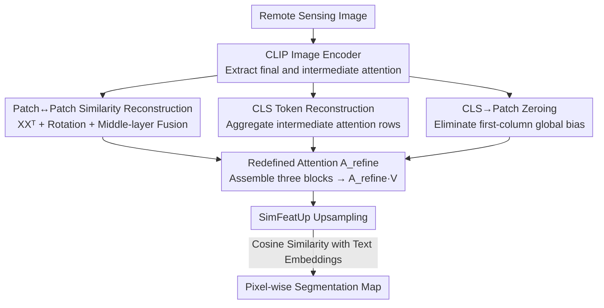

# ReAttnCLIP: Training-Free Open-Vocabulary Remote Sensing Image Segmentation via Re-defined Attention in CLIP

**Conference**: CVPR 2026  
**Paper**: [CVF Open Access](https://openaccess.thecvf.com/content/CVPR2026/html/Niu_ReAttnCLIP_Training-Free_Open-Vocabulary_Remote_Sensing_Image_Segmentation_via_Re-defined_Attention_CVPR_2026_paper.html)  
**Code**: None  
**Area**: Remote Sensing / Open-Vocabulary Segmentation  
**Keywords**: Remote Sensing Segmentation, Open-Vocabulary, CLIP, Attention Redefinition, Training-Free

## TL;DR
This paper decomposes the attention map of the last CLIP layer into three components: "patch↔patch," "CLS→patch," and "patch→CLS." By reconstructing patch-level relationships using the cosine similarity of raw patch embeddings (with rotation augmentation), rebuilding a more category-informative global representation from intermediate layers, and zeroing out the [CLS]-to-patch column, ReAttnCLIP achieves SOTA performance in training-free remote sensing open-vocabulary segmentation (+1.7% average across eight datasets).

## Background & Motivation
**Background**: Traditional remote sensing image segmentation (e.g., building/road extraction, disaster monitoring, precision agriculture) relies on large-scale pixel-level labeled training with fixed categories. Open-vocabulary segmentation—which uses natural language to describe arbitrary classes without retraining—has emerged as a flexible paradigm. Among these, the **training-free** approach is particularly attractive as it leverages pre-trained models like CLIP to eliminate annotation and training costs.

**Limitations of Prior Work**: CLIP's pre-training objective is **image-level** alignment (utilizing the [CLS] token for global representation), whereas segmentation requires **patch-level** discriminative features. This creates a fundamental misalignment. Existing training-free adaptations (such as SCLIP’s query-query similarity or SegEarth-OV’s QKV weighted sum) "reconstruct" the CLIP attention map as a **single entity** without analyzing the roles of its internal components.

**Key Challenge**: The attention map actually blends several different information streams: mutual relationships between patches, how [CLS] aggregates the global scene, and how [CLS] in turn "pollutes" individual patches. Rewriting them as a whole makes it impossible to balance "global semantics" and "local details," which is particularly detrimental to remote sensing images characterized by drastic scale variations, heterogeneous landscapes, and complex object distributions.

**Key Insight**: By expanding the last layer attention update $x_i = A_{i0}v_{\text{CLS}} + \sum_{j=1}^{196} A_{ij}v_j$ row-wise, the authors find that the sources of information for each patch embedding can be **explicitly decomposed into three interpretable components**: (i) the patch↔patch sub-matrix, (ii) the [CLS] row (how [CLS] is composed of tokens), and (iii) the [CLS] column (the contribution of [CLS] back to each patch). Since they can be separated, they can be refined individually.

**Core Idea**: Instead of reconstructing the entire attention map, it is **decomposed into three blocks, each undergoing targeted modification**, before being reassembled into a "re-defined" attention matrix $A_{\text{refine}}$. This matrix is used in $X = A_{\text{refine}}V$ to obtain clean, dense features.

## Method

### Overall Architecture
ReAttnCLIP is a **pure-inference, training-free** pipeline. A remote sensing image is passed through a CLIP ViT-B/16 image encoder. **Modifications are only made in the final transformer block**: the attention matrix is decomposed into [CLS] row/column and patch sub-blocks. After replacement, reconstruction, and zeroing, these components are reassembled into $A_{\text{refine}}$ to produce dense patch features through $A_{\text{refine}}V$. These features are upsampled using SimFeatUp (a **pre-trained** module for remote sensing) and classified pixel-wise by calculating cosine similarity with text embeddings obtained by averaging 80 CLIP templates. Inference is performed using a $224 \times 224$ sliding window on $448 \times 448$ images.

The core of the framework is the redefined attention matrix:

$$A_{\text{refine}} = \begin{pmatrix} \bar{A}^{(l)}_{0,0} & \bar{A}^{(l)}_{0,1:196} \\ 0 & S \end{pmatrix}$$

where $S$ is the reconstructed patch↔patch similarity, $\bar{A}^{(l)}_{0,:}$ is the [CLS] row aggregated from **intermediate layers**, and the first column ([CLS]→patch) is zeroed out.

### Key Designs

**1. Patch↔Patch Similarity Reconstruction: Removing projections, adding rotation, and fusing middle layers.**

Standard query-key attention $A=\mathrm{softmax}(QK^\top/\sqrt{d})$ introduces projection bias because Q and K have independent learned projections, making patch-to-patch similarity less reliable. While SegEarth-OV uses a weighted sum of $QQ^\top$, $KK^\top$, and $VV^\top$, the authors take a more radical approach: **eliminating all learnable projections and using raw patch embeddings** for similarity $\mathrm{Attention}^{\text{raw}}_{i,j} = x_i^\top x_j/\sqrt{d}$ (i.e., $XX^\top$). This symmetric, projection-free form provides an interpretable geometric baseline.

Two enhancements are added: First, **rotation augmentation**. To handle diverse orientations in remote sensing, the image is rotated by $0^\circ, 90^\circ, 180^\circ,$ and $270^\circ$. Similarity matrices $S^{(r,k)}=X^{(r,k)}X^{(r,k)\top}$ are calculated for each rotation $r$ and intermediate layer $k$, then aggregated: $S_{\text{rot}}=\frac{1}{|K|}\sum_{k\in K}\sum_r \lambda_r S^{(r,k)}$ (where $K$ is layers 9–11). Second, query-key attention $A^{(l)}$ from intermediate layers is fused: $S=\alpha S_{\text{rot}}+\sum_{l\in L}\beta_l A^{(l)}$.

**2. CLS Token Reconstruction: Rebuilding a more informative global representation from intermediate layers.**

Patch tokens repeatedly interact with [CLS] during pre-training, absorbing global context that "pollutes" dense discrimination. While SegEarth-OV performs debiasing via $\tilde{x}_i = x_i - x_{\text{cls}}$, the authors argue that the **final layer [CLS] is information-poor**. Visualization shows that the attention entropy of [CLS] decreases monotonically as the network deepens, meaning the deeper [CLS] focuses only on a few patches. 

The authors **reconstruct the [CLS] row from intermediate layers**. For selected intermediate layers $l \in L$, they take the first row $A^{(l)}_{0,:}$ (representing [CLS] attention weights) and average them: $\bar{A}^{(l)}_{0,:}=\frac{1}{|L|}\sum_{l\in L}A^{(l)}_{0,:}$ (using layers 6–9). This reconstructed global attention row integrates spatial and semantic information across depths, providing a more robust debiasing reference.

**3. CLS→Patch Zeroing: Directly eliminating global bias injection.**

The contribution of [CLS] to each patch is given by the **first column** $A_{i0}$ of the attention matrix. This global-to-local injection introduces unwanted bias. The authors **zero out this entire column**: $A_{\text{refine}}[i,0]=0$ for $i=1,\dots,N$. This serves as a complementary debiasing path to the CLS reconstruction, cutting off direct pollution of local features by the final layer [CLS].

## Key Experimental Results

### Main Results
Open-vocabulary semantic segmentation (mIoU) compared with six training-free SOTA methods shows **comprehensive leadership** across eight datasets (+1.7% on average):

| Dataset | CLIP | SCLIP | ClearCLIP | ResCLIP | SegEarth-OV | Ours |
|---------|------|-------|-----------|---------|-------------|------|
| OpenEarthMap | 12.0 | 29.3 | 31.0 | 34.3 | 40.3 | **41.1** |
| iSAID | 7.5 | 16.1 | 18.2 | 8.8 | 21.7 | **23.2** |
| Potsdam | 14.5 | 36.6 | 40.9 | 42.6 | 47.1 | **48.7** |
| UAVid | 10.9 | 31.4 | 36.2 | 36.0 | 42.5 | **44.0** |
| UDD5 | 9.5 | 38.7 | 41.8 | 41.9 | 50.6 | **53.7** |
| VDD | 14.2 | 37.9 | 39.3 | 39.6 | 45.3 | **49.7** |
| Avg (8 sets) | 11.4 | 31.1 | 33.4 | 32.6 | 39.2 | **40.9** |

### Ablation Study
Incremental activation of the three modules (UDD5 / VDD / WHUSAT.II):

| Configuration | UDD5 | VDD | WHUSAT.II | Description |
|---------------|------|-----|-----------|-------------|
| baseline | 50.4 | 45.3 | 28.4 | No modifications |
| +P-P | 53.1 | 47.8 | 29.0 | Patch↔Patch similarity alone provides highest gain |
| +CLS | 52.5 | 46.8 | 28.9 | Reconstructed global representation |
| +CLS-Patch | 51.5 | 46.7 | 28.8 | First-column zeroing |
| Combined | **53.7** | **49.7** | **29.5** | Complementary superposition |

### Key Findings
- **P-P Module contributes most**: Activating only this module yields significant gains (+2.7 for UDD5), indicating that solidifying patch relationships is the primary bottleneck for training-free RS segmentation.
- **$XX^\top$ Projection-free approach is a core trick**: This alone improves UDD5 by +2.8%, validating that independent Q/K projections introduce bias.
- **Rotation augmentation handles small objects**: The largest gain is seen on VDD, where small objects are prevalent.
- **LoveDA Challenge**: Only a +0.1% gain was observed on LoveDA due to blurred images and small objects, likely exacerbated by the domain gap between natural image pre-training and remote sensing.

## Highlights & Insights
- **From Holistic Reconstruction to Component-level Surgery**: Decomposing the attention flow before optimization is more interpretable and allows for systematic combinations of adjustments.
- **Empirical Evidence of CLS Information Poverty**: The observation that [CLS] entropy decreases as layers deepen challenges the standard practice of using the final [CLS] for debiasing.
- **Effective Resource Exploitation**: ReAttnCLIP outperforms CVPR'25 methods (SegEarth-OV) without any training, proving there is substantial untapped "dense discriminative power" in CLIP.

## Limitations & Future Work
- **Domain Gap**: ViT-B/16 pre-trained on natural images struggles with specific RS characteristics like blurring and dense small objects; a backbone pre-trained on RS data might yield better results.
- **Per-dataset Tuning**: The selection of intermediate layers $l$ depends on the [CLS] entropy map of each dataset, meaning it is not yet a perfectly universal zero-shot rule.
- **Computational Overhead**: The rotation augmentation increases latency and FLOPs compared to previous methods.

## Related Work & Insights
- **Comparison with SegEarth-OV (CVPR25)**: While both use SimFeatUp, SegEarth-OV treats attention holistically. ReAttnCLIP’s decomposition approach leads to a 1.7% average improvement.
- **Comparison with SCLIP / ResCLIP**: SCLIP uses query-query similarity, and ResCLIP explores intermediate layer attention. This work goes further by removing projections ($XX^\top$) and using intermediate layers for both patches and [CLS] reconstruction.

## Rating
- **Novelty**: ⭐⭐⭐⭐ Decomposing the attention map by information flow is a clear perspective with empirical support.
- **Experimental Thoroughness**: ⭐⭐⭐⭐⭐ Robust across ten datasets, three tasks, and multi-dimensional ablations.
- **Writing Quality**: ⭐⭐⭐⭐ Clear derivations and effective visualizations.
- **Value**: ⭐⭐⭐⭐ Sets a new SOTA for training-free open-vocabulary RS segmentation with high deployment potential.

<!-- RELATED:START -->

## Related Papers

- [\[CVPR 2026\] MM-OVSeg: Multimodal Optical-SAR Fusion for Open-Vocabulary Segmentation in Remote Sensing](mm-ovseg_multimodal_optical-sar_fusion_for_open-vocabulary_segmentation_in_remot.md)
- [\[CVPR 2026\] HarmoniDiff-RS: Training-Free Diffusion Harmonization for Satellite Image Composition](harmonidiff-rs_training-free_diffusion_harmonization_for_satellite_image_composi.md)
- [\[CVPR 2026\] Prompt-Free Unknown Label Generation for Open World Detection in Remote Sensing](prompt-free_unknown_label_generation_for_open_world_detection_in_remote_sensing.md)
- [\[CVPR 2026\] UniGeoSeg: Towards Unified Open-World Segmentation for Geospatial Scenes](unigeoseg_towards_unified_open-world_segmentation_for_geospatial_scenes.md)
- [\[CVPR 2026\] HySeg: Learning Generative Priors for Structure-Aware Remote Sensing Segmentation](hyseg_learning_generative_priors_for_structure-aware_remote_sensing_segmentation.md)

<!-- RELATED:END -->
