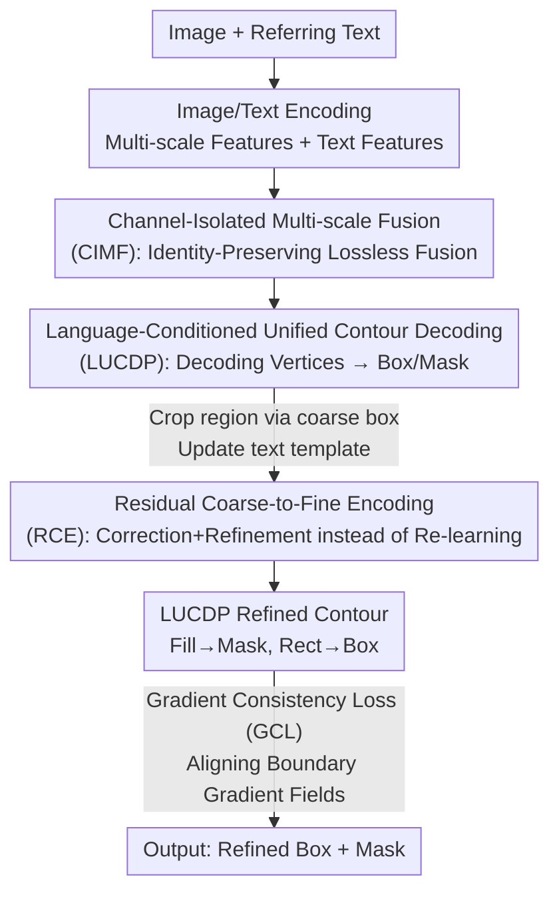

# RECS4R: Bridging Semantics and Geometry for Referring Remote Sensing Interpretation

**Conference**: CVPR 2026  
**Paper**: [CVF Open Access](https://openaccess.thecvf.com/content/CVPR2026/html/Chai_RECS4R_Bridging_Semantics_and_Geometry_for_Referring_Remote_Sensing_Interpretation_CVPR_2026_paper.html)  
**Code**: https://github.com/IPIU-XDU/RSFM (To be released)  
**Area**: Remote Sensing / Multimodal VLM  
**Keywords**: Referring Expression Comprehension and Segmentation, Remote Sensing, Unified Contour Decoding, Coarse-to-Fine, Multi-scale Fusion

## TL;DR
RECS4R unifies Referring Visual Grounding (VG) and Referring Image Segmentation (RIS) in remote sensing by "decoding a sequence of language-conditioned polygon contour vertices"—where the contour's bounding box serves as the box and the filled region as the mask. By integrating residual coarse-to-fine encoding, channel-separated multi-scale fusion, and gradient-domain boundary supervision, it achieves new state-of-the-art RECS scores across six datasets, including RefDIOR, RRSIS-D, and the RefCOCO series.

## Background & Motivation
**Background**: Referring Expression Comprehension and Segmentation (RECS) in remote sensing aims to enable a single model to perform two tasks simultaneously: locating the target with a bounding box (Visual Grounding, VG) and segmenting the target mask (Referring Image Segmentation, RIS) based on a free-text prompt. The mainstream approach is the "multi-head" paradigm, which shares a backbone and multimodal encoder but attaches two task-specific decoding heads, often supplemented by cross-task collaboration modules (e.g., consistency energy maximization in MCN).

**Limitations of Prior Work**: The multi-head paradigm optimizes boxes and masks in **two separate branches**, which disperses the alignment between geometry (box focusing on location) and semantics (mask focusing on texture). This is particularly detrimental for complex shapes such as tiny objects, non-convex, elongated, or multi-part structures, leading to reduced learnability and interpretability. Even the "unified head" paradigm in the Transformer era (e.g., PolyFormer using seq2seq for coordinate regression) essentially regresses a concatenated sequence of sub-tasks. This "implicit multi-head" approach still suffers from misaligned optimization directions and fails to share structural knowledge in a unified representation space.

**Key Challenge**: RECS is bottlenecked by **insufficient representation**—specifically, the lack of a **unified and constrainable geometric intermediate** to bridge semantic and geometric spaces. Combined with the extreme scales (large/tiny objects) and complex shapes unique to remote sensing, existing coarse-to-fine strategies fail to fully exploit multi-scale information, provide unreliable coarse localization, and suffer from semantic blurring caused by traditional FPN-style summation.

**Goal**: To enable RECS to achieve both "structural correctness" (geometric/semantic consistency) and "sufficient perception" (handling extreme scales and complex contours) while remaining lightweight and efficient.

**Core Idea**: A **single geometric representation—polygon contour vertices**—is used to carry both detection and segmentation. By construction, "box = contour bounding box" and "mask = contour filled area" are naturally consistent. The framework is built around this representation using four innovations (the 4 Rs): Representation (LUCDP), Refinement (RCE), Reaggregation (CIMF), and Regularization (GCL).

## Method

### Overall Architecture
RECS4R is built upon PolyFormer and adopts a **two-stage coarse-to-fine** workflow. In the coarse stage: an input image $I_c \in \mathbb{R}^{B\times3\times H\times W}$ and text $L$ pass through image/text encoders to produce multi-scale visual features $\{F^i_{global}\}_{i=1}^4$ and text features $T_c$. **CIMF** fuses the four scales losslessly into $F'_{global}$ (guided by $T_c$), which is fed into a multimodal Transformer. **LUCDP** then autoregressively outputs a contour vertex sequence $P_c$, and $\text{Rect}(P_c)$ provides the coarse box $B_c$. In the fine stage: the target region is cropped from the original image based on $B_c$ and resized to original resolution as $I_f$, while text is updated using a template (e.g., "The large {category} in the middle {position} of the image") as $T_f$. The fine stage follows the same pipeline, but visual features are enhanced by **RCE** using $F_{global}$ and $B_c$ from the coarse stage as residuals. Finally, LUCDP outputs the refined contour $P_f$, yielding the mask via $\text{Fill}(P_f)$ and the box via $\text{Rect}(P_f)$. Optimization is supported by **GCL** for boundary reinforcement and a coarse-stage localization constraint $\mathcal{L}_{coarse}$ to correct deviations before refinement.

### Key Designs

**1. LUCDP: Decoding Box and Mask via a Language-Conditioned Contour Vertex Stream**

Addressing the conflict between geometry and semantics in multi-head designs, LUCDP unifies the decoding target into a single interface: **contour vertices**. The decoding layers share the same representation where the filled region $\text{Fill}(\cdot)$ is the segmentation mask and the bounding box $\text{Rect}(\cdot)$ is the detection box. Structural constraints enforce consistency between the box and mask by design, rather than relying on additional collaboration losses. The process is conditioned on language to strengthen "language $\leftrightarrow$ region" alignment and reduce ambiguity. Two additional benefits are noted: ① Localization risk is **distributed across $n$ contour points** rather than just 4 box corners, stabilizing REC; ② The interface is extensible for scaling and complex shape constraints. Ablation shows that adding LUCDP alone improves VG mIoU from 40.10% to 78.63%.

**2. RCE: Shifting the Fine Stage from "Learning from Scratch" to "Correction + Refinement"**

To address unreliable coarse localization and the inefficiency of re-learning in second stages, RCE explicitly injects global visual-language features from the coarse stage as **residuals**. Global features $F_{global}$ are weighted by the coarse box $B_c$ to focus the model. Channel modulation uses global semantics to generate scale $\gamma$ and shift $\beta$ for local features: $f=(1+\gamma)\cdot F_{global}+\beta$. Spatial modulation employs an attention gate to enhance key regions based on coarse cues. A lightweight cross-attention module then aligns global features into the local representation. Finally, spatial modulation features $F_{spatial}$, cross-attention features $F_{CA}$, and original local features $F_{local}$ are fused residually. The associated $\mathcal{L}_{coarse}$ propagates errors back to the fine stage, creating a closed-loop for localization optimization. This improves RIS mIoU by 10.42%, primarily benefiting tiny objects.

**3. CIMF: Preventing Semantic Blurring via Channel-Isolated Subspaces**

Remote sensing contains objects at extreme scales; traditional FPN-style summation or naive concatenation often dilutes scale-specific information. CIMF projects each of the four scales into a **dedicated channel subspace** of dimension $C_m$, concatenating them into a $4\times C_m$ feature map. Scale identity is preserved in the channel dimension, preventing semantic confusion. Learnable scale weights and cross-modal attention, guided by both linguistic semantics and target size, adaptively select and enhance different scales. This allows the same module to handle both ultra-large and tiny objects.

**4. GCL: Aligning Predicted and Ground Truth Boundary Fields in the Gradient Domain**

Standard IoU/CE losses are insensitive to edge orientation, resulting in blurry complex contours (high curvature, non-convex, elongated). GCL moves supervision to the **gradient domain**. For the predicted mask $M^p$ (obtained from the contour) and ground truth $M^g$, gradient magnitudes are calculated using fixed Sobel operators $E_x, E_y$: $\nabla M=\sqrt{(E_x*M)^2+(E_y*M)^2}$. The loss is $\mathcal{L}_{gcl}=\lVert\nabla M^p-\nabla M^g\rVert_1$. Gradients are backpropagated from the mask to the vertices $P_f$ via SoftRas (soft rasterization), driving the decoder to align boundary intensity. This significantly improves fidelity for complex structures and provides the largest single-item gain for RIS oIoU.

### Loss & Training
The complete loss is $\mathcal{L}=\mathcal{L}_{cls}+\lambda_1\mathcal{L}^{\ell_1}_{reg}+\lambda_2\mathcal{L}^{smooth\text{-}\ell_2}_{reg}+\lambda_3\mathcal{L}_{coarse}+\lambda_4\mathcal{L}_{gcl}$. $\mathcal{L}_{cls}$ classifies each decoding token (separator/start/end/coordinate), while $\ell_1$ and smooth-$\ell_2$ oversee vertex sequence regression. $\mathcal{L}_{coarse}$ supervises coarse box correction. Training uses $\lambda_1:\lambda_2:\lambda_3:\lambda_4=1:1:0.1:0.1$. Hyperparameters include: batch size 4, 50 epochs, Adam optimizer ($\beta_1=0.9, \beta_2=0.999$, weight decay 0.01), and a learning rate warmup to $5\times10^{-4}$. The model is pre-trained on Visual Genome, RefCOCO series, and Flickr30k-entities. Image encoders supported include Swin-Transformer, ConvNeXt, and VMamba; BERT is used for text.

## Key Experimental Results

### Main Results
Comparison with SOTA on the RefDIOR test set (Swin-Tiny backbone; Sum = VG+RIS oIoU+mIoU):

| Method | VG oIoU | VG mIoU | RIS oIoU | RIS mIoU | RECS Sum | FLOPs |
|------|---------|---------|----------|----------|----------|-------|
| PolyFormer (CVPR'23, baseline) | 61.59 | 40.10 | 82.40 | 55.30 | 239.39 | 49.53G |
| CCFormer (GRSM'25, Prev. SOTA) | 82.39 | 74.09 | 80.89 | 70.96 | 308.33 | 119.39G |
| **RECS4R (Ours)** | **94.69** | **82.68** | **90.01** | **74.45** | **341.83** | **45.37G** |

RECS4R not only surpasses CCFormer by 33.5 points in Sum but also reduces FLOPs from 119.39G to 45.37G. Performance remains robust across ConvNeXt-Tiny (Sum 346.36) and VMamba-Tiny (Sum 339.64) backbones.

Results on the natural-domain RefCOCO series for VG (Precision@0.5, Swin-Tiny):

| Dataset | PolyFormer-L (val) | RECS4R Swin-T (val) | Gain |
|--------|--------------------|--------------------|------|
| RefCOCO | 90.38 | 94.24 | +3.86 |
| RefCOCO+ | 84.98 | 94.51 | +9.53 |
| RefCOCOg | 81.5 | 92.85 | +11.35 |

### Ablation Study
On the RefDIOR test set, using PolyFormer as the baseline, evaluating each 4R component:

| LUCDP | RCE | CIMF | GCL | VG mIoU | RIS mIoU | RECS Sum |
|:-:|:-:|:-:|:-:|---------|----------|----------|
| ✗ | ✗ | ✗ | ✗ | 40.10 | 55.30 | 239.39 |
| ✓ | ✗ | ✗ | ✗ | 78.63 | 60.86 | 318.49 |
| ✗ | ✓ | ✗ | ✗ | 42.90 | 65.72 | 260.34 |
| ✗ | ✗ | ✓ | ✗ | 45.62 | 62.11 | 264.54 |
| ✗ | ✗ | ✗ | ✓ | 48.09 | 60.78 | 266.33 |
| ✓ | ✓ | ✓ | ✓ | **82.68** | **74.45** | **341.83** |

Ablation on decoding paradigms suggests that the "Unified Head" is only effective when paired with "Polygon Contour" as the unified geometric intermediate; mask-based unified heads show much smaller gaps compared to multi-head setups.

### Key Findings
- **LUCDP is the foundation**: It provides the largest contribution by eliminating optimization conflicts between geometry and semantics.
- **Specialized Roles**: RCE mainly enhances RIS (tiny objects, +10.42% mIoU), CIMF boosts overall Sum (extreme scales), and GCL improves boundary sharpness (RIS oIoU).
- **Efficiency Gains**: The model achieves superior results with less than half the FLOPs of CCFormer, proving that unified representation is more efficient than parameter stacking.

## Highlights & Insights
- The unified contour representation (**Box = Rect, Mask = Fill**) is ingenious: it converts cross-task consistency from a "loss-driven constraint" into a "structural guarantee."
- **Risk distribution**: Distributing localization risk across $n$ contour points provides better robustness against jitter and occlusion in remote sensing than 4 box corners.
- **Gradient-domain supervision** combined with SoftRas backpropagation bypasses the limitations of IoU/CE regarding edge orientation, which is crucial for the complex structures common in remote sensing.

## Limitations & Future Work
- The absolute inference latency and the impact of the number of vertices $n$ on real-time application remain to be fully explored (the paper primarily reports FLOPs) ⚠️.
- The fine stage relies on coarse stage cropping; if the coarse stage completely fails to detect the target, residual priors may propagate errors.
- Polygon contours have inherent limitations in representing **hollow or multi-connected** targets (e.g., ring shapes or fragmented structures), as a single outer contour struggle to capture internal holes.

## Related Work & Insights
- **vs. PolyFormer**: While both use polygon vertices, PolyFormer's sequence is a concatenation of sub-tasks. RECS4R truly unifies the box and mask and outperforms PolyFormer-L across datasets while being smaller.
- **vs. CCFormer**: CCFormer follows a multi-head plus cross-task Transformer route. RECS4R's unified representation achieves a Sum score 33.5 points higher with approximately 1/3 of the FLOPs.
- **vs. MCN/WeakMCN**: These models "pull" consistency after decoding via energy losses or knowledge transfer; RECS4R moves consistency into the representation construction phase.

## Rating
- Novelty: ⭐⭐⭐⭐⭐ Unified contour representation effectively hardcodes geometric-semantic consistency into the architecture.
- Experimental Thoroughness: ⭐⭐⭐⭐⭐ 6 datasets, 3 backbone types, and comprehensive ablations.
- Writing Quality: ⭐⭐⭐⭐ The 4R framework is well-defined; some minor OCR-related details in the source required manual verification.
- Value: ⭐⭐⭐⭐⭐ Significant practical and methodological value for multi-task referring interpretation in remote sensing.

<!-- RELATED:START -->

## Related Papers

- [\[CVPR 2026\] Sparsely Timing the Change: A Spiking Temporal Framework for Remote Sensing Interpretation](sparsely_timing_the_change_a_spiking_temporal_framework_for_remote_sensing_inter.md)
- [\[CVPR 2026\] Geo2: Geometry-Guided Cross-view Geo-Localization and Image Synthesis](geo2_geometry-guided_cross-view_geo-localization_and_image_synthesis.md)
- [\[CVPR 2026\] ChangeBridge: Spatiotemporal Image Generation with Multimodal Controls for Remote Sensing](changebridge_spatiotemporal_image_generation_with_multimodal_controls_for_remote.md)
- [\[CVPR 2026\] GeoCoT: Towards Reliable Remote Sensing Reasoning with Manifold Perspective](geocot_towards_reliable_remote_sensing_reasoning_with_manifold_perspective.md)
- [\[CVPR 2026\] Robust Remote Sensing Image–Text Retrieval with Noisy Correspondence](robust_remote_sensing_image-text_retrieval_with_noisy_correspondence.md)

<!-- RELATED:END -->
