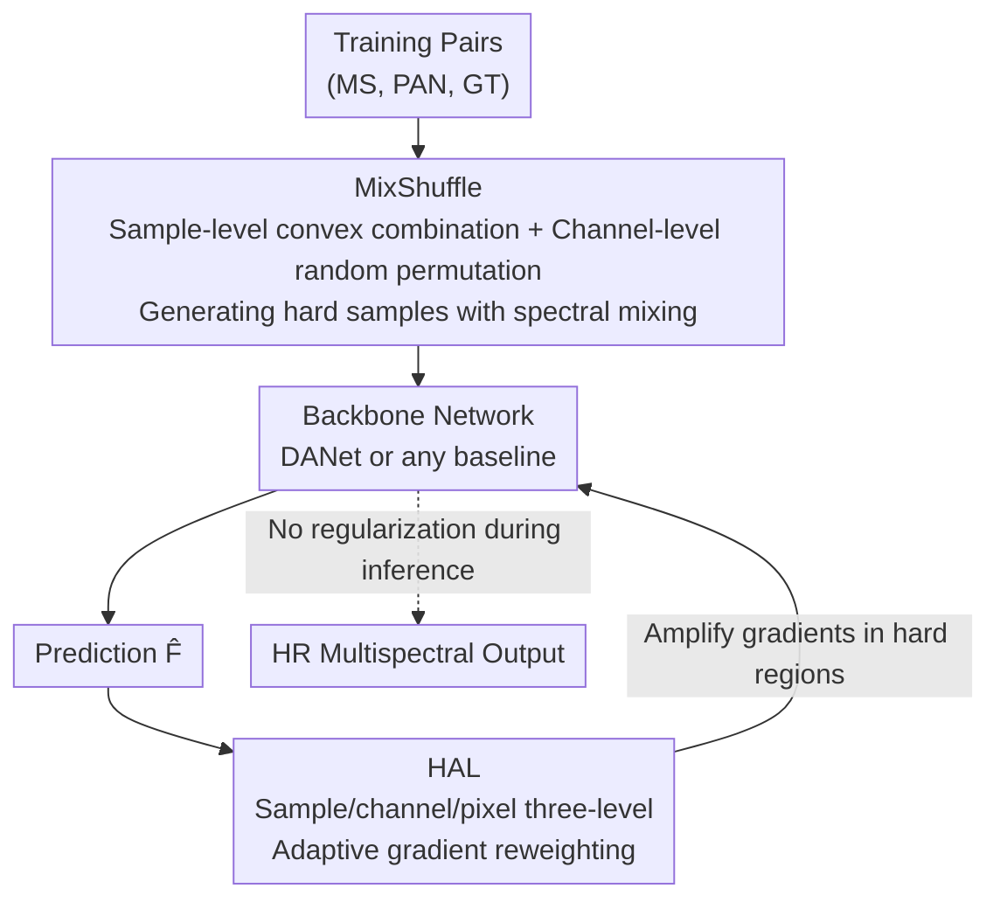

# Regulating Rather than Constraining: Adaptive Guidance for Complex Spectral Reconstruction in Pansharpening

**Conference**: CVPR 2026  
**Paper**: [CVF Open Access](https://openaccess.thecvf.com/content/CVPR2026/html/Wen_Regulating_Rather_than_Constraining_Adaptive_Guidance_for_Complex_Spectral_Reconstruction_CVPR_2026_paper.html)  
**Code**: https://github.com/Geo-Tell/DANet  
**Area**: Remote Sensing / Pansharpening  
**Keywords**: Pansharpening, spectral reconstruction, data augmentation, gradient reweighting, regularization

## TL;DR
To address the poor reconstruction performance in "spectral mixing zones" (object boundaries, internal textures) in pansharpening, this paper proposes an **architecture-agnostic regularization framework**: on the data side, MixShuffle is used to construct "hard samples" via cross-sample and cross-spectral-channel convex combinations; on the loss side, HAL is used to adaptively amplify gradients in hard regions at sample, channel, and pixel levels. This is coupled with a dual-scale attention network, DANet, serving as the backbone, achieving SOTA on WV3/GF2/QB and consistently boosting various baselines plug-and-play.

## Background & Motivation

**Background**: Pansharpening aims to fuse a high-resolution panchromatic (PAN) image with a low-resolution multispectral (MS) image to generate a high-resolution multispectral image. Unlike companion natural image super-resolution tasks that pursue visual plausibility, remote sensing fusion requires **numerically precise** spectral fidelity. Existing deep learning methods generally follow two pathways: first, stacking larger network architectures (CNN/Transformer/Mamba, e.g., the learnable kernel ARConv); second, embedding **physical constraints** into the network (wavelet decomposition, contourlet decomposition, Fourier domain priors, etc.) to enhance specific features.

**Limitations of Prior Work**: While these methods reconstruct well in **homogeneous land-cover regions** (large spans of the same surface type), they suffer from significantly increased reconstruction errors, blurred edges, and spectral distortion in **spectral mixing zones** (e.g., land-cover boundaries, transition zones between building roofs and the ground, and complex internal textures). These pixels present complex structures but occupy only a small fraction of the entire image, which leads to them being "averaged out" during standard optimization.

**Key Challenge**: The authors argue that the root cause lies in the fact that **the optimization process treats all regions equally**, preventing the low-proportion mixing zones from receiving sufficient attention and learning. Furthermore, both mainstream pathways have their own Achilles' heels: relying purely on inductive bias makes it difficult to directly learn generalized mixing patterns, while preset physical constraints, though reinforcing specific features, **rigidly confine the model** within priors, limiting its capability to explore spectral combinations beyond those constraints. This motivates the title "Regulating Rather than Constraining."

**Goal**: Without modifying (or even relying on) specific network architectures, to **adaptively** shift the model's focus during learning toward hard-to-reconstruct spectral mixing zones, thereby improving generalization stability across different datasets and architectures.

**Key Insight**: Regularization methods based on data and loss functions can inject inductive hypotheses in a more flexible manner and **dynamically adjust intensity according to training needs**, which complements the rigidity of architectural and physical constraints.

**Core Idea**: The task of "focusing on hard regions" is split into **data** and **loss** components. On the data side, harder spectral mixed samples are actively synthesized (MixShuffle); on the loss side, gradients are actively reallocated to hard regions (HAL). Both act as "regulators" instead of "constraints," introducing almost zero extra training overhead and zero inference overhead.

## Method

### Overall Architecture
The proposed method consists of a **regularization framework during training + a backbone network**. Given training sample pairs, the data side first applies MixShuffle to generate augmented samples rich in spectral mixing, which are then fed into a backbone network (which can be any baseline, or the specially designed DANet) to obtain predictions. On the loss side, standard L1 is replaced by HAL, which applies polynomial weighting to errors at the sample, channel, and pixel levels to adaptively amplify gradients in hard-to-reconstruct regions. This regularization framework is plug-and-play, infers with zero extra cost, and can be attached to various existing networks to boost performance. DANet provides a stable structural foundation for this regularization through cross-scale spatial-spectral attention interactions. The relationships among the three components are shown below:

### Key Designs

**1. MixShuffle: Cross-sample and cross-spectral-channel convex combination augmentation for synthesizing hard spectral-mixing samples**

The limitation is straightforward: spectral mixing samples are naturally scarce in training sets. Curriculum learning only schedules difficulty but does not create it, while classic Mixup only performs linear mixing between samples without changing the spectral dimension, failing to generate the cross-boundary spectral mixing response that pansharpening genuinely lacks. MixShuffle breaks down mixing into two steps. The first step is at the **sample level**: given two samples $(M^\alpha,P^\alpha,F^\alpha)$ and $(M^\beta,P^\beta,F^\beta)$, a convex combination is performed as $M^{\alpha\beta}=\lambda_1 M^\alpha+(1-\lambda_1)M^\beta$, with PAN and GT mixed synchronously, where $\lambda_1\sim\mathrm{Beta}(\theta_1,\theta_1)$. The second step is at the **spectral channel level**: within the pre-mixed samples, each channel $i$ is further mixed via a convex combination with channel $\pi(i)$ selected by a random permutation $\pi$:

$$\tilde m_i=\lambda_2 m_i^{\alpha\beta}+(1-\lambda_2)m_{\pi(i Münster)}^{\alpha\beta},\quad \tilde f_i=\lambda_2 f_i^{\alpha\beta}+(1-\lambda_2)f_{\pi(i)}^{\alpha\beta}$$

where $\lambda_2\sim\mathrm{Beta}(\theta_2,\theta_2)$ and $\pi\sim\mathrm{Uniform}(S_C)$ ($S_C$ is all random permutations from $1{\sim}C$). The combination of these two steps is equivalent to "Mixup-style sample mixing" superimposed on "Channel Shuffle-style channel disorder mixing." The former expands the spatial distribution diversity of objects, while the latter directly simulates the spectral mixing response between different land-cover types. MS and GT are transformed synchronously using the same set of $\lambda,\pi$ to ensure the augmented sample pairs remain self-consistent and supervisable. This allows the network to repeatedly practice mixing zone reconstruction on a large volume of synthetically constructed "hard samples," rather than passively waiting for boundary pixels to occasionally appear in real data.

**2. Hierarchical Attention Loss HAL: Reallocating gradients to hard regions at the sample, channel, and pixel levels**

Having hard samples alone is insufficient: standard L1 loss weights all pixels equally, so mixing zones would still be drowned out in the loss computation. The idea of HAL is to **weight the loss according to magnitude**: regions with larger errors (harder) receive higher weights. It first defines Mean Absolute Error (MAE) at three granularities: pixel-level $e_{i,j}^{(c)}=|f_{i,j}^{(c)}-\hat f_{i,j}^{(c)}|$, channel-level $e^{(c)}=\frac{1}{HW}\sum_{i,j}e_{i,j}^{(c)}$, and sample-level $e=\frac{1}{C}\sum_c e^{(c)}$ (notably, standard L1 equals $e$). Then, a polynomial weighting function $W(x)=x(1+x)^\gamma,\ \gamma\ge 0$ is applied to each of the three levels to produce $L_{\text{pixel}},L_{\text{channel}},L_{\text{sample}}$, which are finally combined:

$$L_{\text{HAL}}=\lambda_{\text{pixel}}L_{\text{pixel}}+\lambda_{\text{channel}}L_{\text{channel}}+\lambda_{\text{sample}}L_{\text{sample}}$$

The key lies in the gradient behavior: taking the derivative with respect to the loss, each level's gradient is multiplied by a weighting term $\varphi(x)=(1+x)^\gamma\!\left(1+\frac{\gamma x}{1+x}\right)$. This brings two elegant adaptive properties: **when errors are large in the early stage of training**, $\varphi$ significantly amplifies the gradient, strongly reinforcing updates in hard regions; **when errors decrease in the late stage of training**, as $\varphi\to 1$, HAL automatically degenerates to standard L1, avoiding overfitting on difficult areas that might harm overall convergence. The joint operation of these three levels allows the model to simultaneously reallocate learning efforts across three dimensions—"which sample is difficult, which spectral channel is difficult, and which pixel is difficult"—perfectly aligning with the dual demands of pansharpening to preserve both spatial details and spectral fidelity.

**3. DANet: Direct cross-scale spatial-spectral attention interaction for a stable backbone**

The first two designs are architecture-agnostic plug-ins, but the authors also construct a strong backbone that can maximize the ceiling when combined with the regularization. The pain point in previous methods is that the spatial structures of PAN and spectral transitions of MS reside at different scales. Existing networks easily suffer from **spatial-spectral misalignment** when up/downsampling to align features, causing blurred boundaries. DANet (Dual-scale Attention Network) consists of convolutional layers, cascaded Dual-scale Attention Interaction Modules (DAIM), and a Dual-scale Attention Fusion Module (DAFM). Its core is to allow spatial-spectral features at different scales to **interact directly via attention** rather than relying on resampling for hard alignment. Inside DAIM, Swin Transformer (ST) blocks are used for self-attention refinement, and each token is then split into two sub-tokens to undergo ST self-interaction and SCT cross-modal interaction, gradually fusing stage-by-stage. Among these, the SCT (Shared Cross Transformer) is a parameter-efficient design: standard cross-attention requires preparing distinct query/key matrices for both branches, whereas SCT uses a **shared query-key matrix** $I_m, I_p$. The attention matrices are directly formulated as $A_m=\mathrm{Softmax}(I_m I_p^\top/\sqrt{C})$ and $A_p=\mathrm{Softmax}(I_p I_m^\top/\sqrt{C})$, computing bidirectional attention (which are transposes of each other) using a single set of shared matrices, significantly reducing parameters without sacrificing performance. DANet alone is a concise and efficient fusion network, and achieves SOTA when combined with MixShuffle+HAL.

### Loss & Training
The training loss is formulated as HAL (Eq. 6), which is a convex combination of weighted L1 terms at the pixel, channel, and sample levels, where the polynomial exponent $\gamma$ regulates the amplification intensity in hard regions ($\gamma=0$ degenerates to standard L1). MixShuffle operates only on training data augmentation, with mixing coefficients $\lambda_1, \lambda_2$ sampled from $\mathrm{Beta}(\theta, \theta)$ and channel permutation $\pi$ sampled uniformly. Both regularization components are only active during training, introducing zero extra computation during inference.

## Key Experimental Results

### Main Results
On three classic datasets: WV3 (8 bands, WorldView-3), GF2 (4 bands, GaoFen-2), and QB (4 bands, QuickBird), the proposed method is evaluated against 14 baselines (2 traditional + 12 deep methods covering CNN/Transformer/Mamba). The table below displays the comparison with representative SOTA methods on the WV3 and GF2 datasets (reduced-resolution metrics):

| Dataset | Method | SAM↓ | ERGAS↓ | Q2n↑ | SCC↑ |
|--------|------|------|--------|------|------|
| WV3 | FusionMamba | 2.82 | 2.11 | 0.920 | 0.989 |
| WV3 | ARNet | 2.89 | 2.14 | 0.910 | 0.989 |
| WV3 | **Ours** | **2.69** | **1.91** | **0.921** | **0.991** |
| GF2 | FusionMamba | 0.71 | 0.62 | 0.984 | 0.995 |
| GF2 | ADWM | 0.68 | 0.60 | 0.984 | 0.996 |
| GF2 | **Ours** | **0.58** | **0.53** | **0.987** | **0.998** |

Compared to the second-best methods, SAM improves by 4.6% / 14.7% on WV3 / GF2, respectively, while ERGAS improves by 3.5% / 5.4%, respectively.

**Plug-and-play Generalization**: Incorporating MixShuffle+HAL into various baselines (on the QB dataset, where `*` indicates the addition of the proposed method) consistently yields gains. For instance, LAGNet's ERGAS improves from 3.87 to 3.69, and Invformer's SAM improves by 4.7%, demonstrating that the regularization adaptively fits the inductive biases of different architectures.

**Boundary Areas Evaluation** (Table 4, focusing on regions with the most severe spectral mixing) — the performance gain of the proposed method on boundary ERGAS is highly significant:

| Method | WV3 Overall Gain% | WV3 Boundary Gain% | QB Boundary Gain% |
|------|------|------|------|
| FusionNet* | 11.02 | 18.74 | 19.03 |
| FusionMamba* | 6.70 | 15.13 | 4.21 |
| Invformer* | 6.69 | 7.24 | 8.41 |

The improvements in boundary regions are generally larger than the overall improvements, which strongly aligns with the motivation of targeting spectral mixing zones.

### Ablation Study
Ablation results on DANet decomposing MixShuffle and HAL (reduced-resolution metrics):

| Dataset | MixShuffle | HAL | SAM↓ | ERGAS↓ | Q2n↑ | SCC↑ |
|--------|:---:|:---:|------|--------|------|------|
| WV3 | | | 2.85 | 2.07 | 0.912 | 0.988 |
| WV3 | ✓ | | 2.74 | 1.96 | 0.918 | 0.990 |
| WV3 | | ✓ | 2.78 | 1.99 | 0.916 | 0.989 |
| WV3 | ✓ | ✓ | **2.69** | **1.91** | **0.921** | **0.991** |
| QB | | | 4.60 | 4.10 | 0.926 | 0.979 |
| QB | ✓ | ✓ | **4.38** | **3.67** | **0.935** | **0.984** |

### Key Findings
- **Both regularizations are independently effective and optimal when combined**: Adding only MixShuffle or only HAL consistently boosts performance across all metrics on the three datasets. Combining them further reduces WV3's ERGAS from 2.07 to 1.91. These two components complement each other, with one augmenting data and the other refining the loss.
- **Gains are concentrated in hard regions**: The improvement margins in boundary/texture zones (up to ~19%) are significantly larger than the overall gains. Qualitative error maps also demonstrate that the proposed method yields the lowest errors in transition zones such as roof-ground and roof-wall, validating the core hypothesis of shifting learning focus toward spectral mixing zones.
- **Almost zero extra cost**: Both regularization components incur negligible training overhead and zero inference overhead, while consistently boosting performance across various backbones from CNNs to Mamba, demonstrating broad generalizability.

## Highlights & Insights
- **The methodology of "regulating rather than constraining" holds significant transfer value**: Instead of rigidly embedding physical priors into network architectures, placing priors into data augmentation and loss weighting allows the intensity to be dynamically adjusted according to training needs, while remaining naturally architecture-agnostic. This philosophy can be extended to other low-level vision tasks where hard regions constitute a small proportion and are prone to being averaged out (e.g., denoising, dehazing, and edge super-resolution).
- **The "spectral channel-wise mixing" in MixShuffle is a masterstroke**: Standard Mixup only blends across samples and fails to construct cross-spectral mixing responses. Introducing a random channel-wise convex combination inspired by Channel Shuffle precisely addresses the lack of hard samples in pansharpening, and the synchronous transformation of MS and GT ensures self-consistent supervision.
- **The self-degeneration property of HAL is elegant**: The weight term $\varphi$ amplifies gradients in hard regions during the early training phase and automatically approaches 1 in the late phase, reverting to standard L1. This behaves as an implicit curriculum of "first focusing on hard regions, then overall convergence" without requiring manual difficulty schedulers.
- **SCT's shared query-key matrix**: Computing bidirectional cross-modal attention as transposes of each other via a shared set of query-key matrices saves parameter count without sacrificing accuracy, serving as a highly reusable lightweight cross-attention trick.

## Limitations & Future Work
- The paper does not provide sensitivity analyses for critical hyperparameters such as $\theta_1, \theta_2$ in MixShuffle or $\gamma, \lambda_{\text{pixel/channel/sample}}$ in HAL (stating they are provided in the supplementary material). The tuning costs and robustness of these weights during actual deployment remain unclear.
- MixShuffle's "convex combination" assumes that spectral mixing can be approximated as linearly additive. Whether this holds for highly non-linear mixing responses (e.g., complex reflections of specific materials) is not thoroughly explored in the paper.
- The method is specifically tailored for pansharpening and remote sensing numerical fidelity. Its generalizability to non-numerical natural image low-level tasks, as well as to diverse sensor/spectral configurations, still requires validation.
- Evaluations are primarily conducted under reduced-resolution and full-resolution protocols on three classic datasets (WV3, GF2, QB). Real-world cross-domain/cross-sensor generalization (rather than in-distribution testing) requires support from more benchmarks.

## Related Work & Insights
- **vs Architecture Improvement Methods (ARConv / FusionMamba / various Transformers)**: These methods improve feature representation by stacking stronger network designs. In contrast, the proposed method is architecture-agnostic, guiding optimization via data and loss regularizations, and can plug-and-play to conversely enhance these backbones—making them orthogonal and complementary.
- **vs Physical Constraint Methods (GPPNN / CDFInet / FAFNet, wavelet/contourlet/Fourier priors)**: Physical constraints are effective for specific features but rigidly confine the model and tend to fail cross-domain. This paper replaces "rigid" constraints with "soft," dynamically adjustable regularizations, achieving better cross-dataset generalization.
- **vs Mixup / Channel Shuffle**: MixShuffle is a task-specific combination of both—retaining the cross-sample convex combination of Mixup while borrowing the Channel Shuffle concept to perform random spectral-channel mixing, specializing in generating hard spectral-mixing samples needed for pansharpening.
- **vs Adversarial Data Augmentation / Curriculum Learning**: Adversarial augmentation mostly generates generic perturbations, and curriculum learning merely schedules difficulty without generating new hard cases. This work emphasizes "custom-creating hard samples for the task (MixShuffle) + adaptively amplifying gradients in hard regions (HAL)," which better aligns with the dual requirements of pansharpening for spatial details and spectral fidelity.

## Rating
- Novelty: ⭐⭐⭐⭐ The regularization paradigm of "regulating rather than constraining" paired with MixShuffle's cross-spectral-channel mixing is well-motivated and targeted.
- Experimental Thoroughness: ⭐⭐⭐⭐ Generalizability validated across 3 datasets and 7+ architectures. Rich boundary-specific evaluations and ablation studies, though hyperparameter sensitivities are left to the supplementary materials.
- Writing Quality: ⭐⭐⭐⭐ Solid motivation derivation, exhaustive formulas, and clear charts.
- Value: ⭐⭐⭐⭐ Plug-and-play, near-zero cost, and easily transferable to other low-level vision tasks where hard regions occupy a minor proportion.

<!-- RELATED:START -->

## Related Papers

- [\[CVPR 2026\] Exploring Spatiotemporal Feature Propagation for Video-Level Compressive Spectral Reconstruction](exploring_spatiotemporal_feature_propagation_for_video-level_compressive_spectra.md)
- [\[AAAI 2026\] M3SR: Multi-Scale Multi-Perceptual Mamba for Efficient Spectral Reconstruction](../../AAAI2026/remote_sensing/m3sr_multi-scale_multi-perceptual_mamba_for_efficient_spectral_reconstruction.md)
- [\[CVPR 2026\] Cross-Scale Pansharpening via ScaleFormer and the PanScale Benchmark](cross-scale_pansharpening_via_scaleformer_and_the_panscale_benchmark.md)
- [\[CVPR 2026\] Semantic-Adaptive Diffusion for Dynamic Spatiotemporal Fusion](semantic-adaptive_diffusion_for_dynamic_spatiotemporal_fusion.md)
- [\[CVPR 2026\] Local Precise Refinement: A Dual-Gated Mixture-of-Experts for Enhancing Foundation Model Generalization against Spectral Shifts](local_precise_refinement_a_dual-gated_mixture-of-experts_for_enhancing_foundatio.md)

<!-- RELATED:END -->
