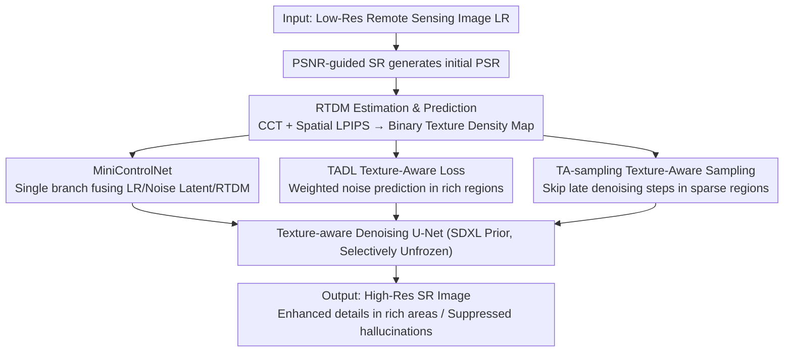

# Remote Sensing Image Super-Resolution for Imbalanced Textures: A Texture-Aware Diffusion Framework

**Conference**: CVPR 2026  
**Paper**: [CVF Open Access](https://openaccess.thecvf.com/content/CVPR2026/html/Zhang_Remote_Sensing_Image_Super-Resolution_for_Imbalanced_Textures_A_Texture_Aware_Diffusion_CVPR_2026_paper.html)  
**Code**: https://github.com/ZezFuture/TexAdiff  
**Area**: Remote Sensing / Super-Resolution / Diffusion Models  
**Keywords**: RSISR, Imbalanced Textures, Diffusion Prior, RTDM, Texture-Aware Sampling

## TL;DR
To address the "globally random but locally clustered" nature of textures in remote sensing images—which leads to extreme texture imbalance compared to natural images—this paper proposes TexADiff. The framework estimates a Relative Texture Density Map (RTDM) to characterize texture distribution and injects it into the diffusion super-resolution process via a threefold strategy: "spatial condition + loss modulation + sampling schedule." This ensures the model generates realistic high-frequency details in texture-rich regions while suppressing hallucinations in texture-sparse regions, achieving superior perceptual metrics across multiple remote sensing benchmarks.

## Background & Motivation

**Background**: Remote Sensing Image Super-Resolution (RSISR) reconstructs high-resolution images from low-resolution inputs to support downstream tasks like object detection, semantic segmentation, and change detection. Recent integrations of pre-trained Text-to-Image (T2I) diffusion priors into super-resolution have demonstrated a powerful ability to generate sharp, realistic details under unknown degradations.

**Limitations of Prior Work**: Remote sensing images possess a unique characteristic not found in natural images—**extreme spatial heterogeneity**. A few texture-rich areas (road networks, built-up areas) carry the majority of high-frequency energy, while vast texture-sparse areas (water, snow, farmland) have simple structures. Texture distributions are highly imbalanced and locally clustered, with cluster locations varying by scene without global position priors. Existing diffusion RSISR methods apply a **uniform restoration intensity** across the entire image. This leads to two predictable failures: "over-generation" in texture-sparse areas, creating redundant artifacts/hallucinations (e.g., ripples on water), and "under-generation" in texture-rich areas, causing blur and detail loss.

**Key Challenge**: The requirement for detail generation in remote sensing images is spatially varying, yet spatially-invariant uniform processing fails to recognize regional texture differences or adaptively allocate the model's representation capacity.

**Goal**: Equip diffusion super-resolution with "texture-aware" capabilities—enabling the model to recognize regional texture differences in low-resolution images and adaptively allocate generative capacity to where details are truly needed.

**Key Insight**: Utilize a Relative Texture Density Map (RTDM) that quantifies pixel-wise texture density as a unified texture prior. This explicitly informs the diffusion model about texture locations and utilizes this information across training conditions, losses, and sampling.

**Core Idea**: Synergistically "command" the diffusion process using RTDM across three components: as a spatial condition, a loss modulation term, and a sampling step scheduler. This strengthens details in rich areas and suppresses hallucinations in sparse areas.

## Method

### Overall Architecture
TexADiff is built upon a pre-trained T2I diffusion prior (SDXL) and consists of three components: ① **RTDM Estimation and Prediction Module**—estimates texture density maps from HR-LR pairs during training, and uses a prediction network during inference to estimate RTDM from LR/PSR. ② **Lightweight MiniControlNet**—integrates multiple heterogeneous conditions (LR, noisy latent, RTDM) in a single efficient branch to avoid parameter/memory explosion associated with multiple individual ControlNets. ③ **Texture-Aware Denoising Diffusion Model**—uses RTDM simultaneously as a spatial condition, for loss modulation (TADL), and for sampling scheduling (TA-sampling). The workflow: LR first passes through a PSNR-guided SR to obtain a denoised PSR; RTDM is predicted from PSR and LR; the binarized RTDM, LR, and noisy latent are injected into the U-Net backbone via MiniControlNet. Training and sampling are then differentiated by texture density, resulting in the final SR output.

### Key Designs

**1. RTDM (Relative Texture Density Map): Quantifying "Texture Richness" via Statistical + Perceptual Criteria**

This serves as the prior source, directly addressing the model's inability to distinguish regional texture differences. RTDM captures local texture density differences between HR ($I_{HR}$) and LR ($I_{LR}$), representing high-frequency details lost during degradation. To calculate this during training, two complementary criteria are used: a Local Contrast Consistency term $M_{CCT}=\mathrm{CCT}(I_{PSR},I_{HR})$ based on SSIM (sensitive to localized degradation) and a Spatial LPIPS response $M_{SL}$ (capturing perceptual differences and robust to anisotropic textures). These combine as $M=(1-M_{SL})\cdot M_{CCT}$, where lower values indicate higher texture density. To ensure stability, $M$ is binarized to $M_b$ via a threshold $\tau \in [0.35, 0.4]$, followed by morphological refinement and 8× max-pooling to latent resolution to obtain $\hat M_b$. For inference, a prediction network using LR and PSR as inputs is trained via L1 loss using continuous $M$ as pseudo-labels.

**2. MiniControlNet: Efficient Multi-Condition Fusion in a Single Branch**

Introducing RTDM requires the model to process two types of conditions (LR and RTDM). Conventional methods using multiple ControlNets would cause parameters and memory to skyrocket. Inspired by ControlNext, a lightweight MiniControlNet is designed: it uses parallel condition embedding branches to encode different conditions, paired with time-aware residual blocks and Spatial Feature Transform (SFT) layers to inject RTDM features. These fused control features are aligned with the backbone via Cross Normalization and injected after the first U-Net block. The control branch contains only ~20M parameters. To compensate for the reduced guidance and bridge the domain gap between natural and remote sensing data, **Ours** selectively unfreezes parts of the U-Net (first down-sampling block and all up-sampling blocks).

**3. Texture-Aware Denoising: RTDM for Loss Modulation (TADL) and Sampling Scheduling (TA-sampling)**

The RTDM is further utilized at both ends of the pipeline. For training, the **Texture-Aware Diffusion Loss (TADL)** assigns higher weights to noise prediction errors in texture-rich regions: $L_{TADL}=\mathbb{E}\big[(1+\alpha \hat M_b) \odot \|\epsilon - \epsilon_\theta(z_t, c, t, I_{LR}, \hat M_b)\|^2\big]$ (with $\alpha=1$). This forces the model to allocate capacity to high-texture areas. For inference, **Texture-Aware Dynamic Sampling (TA-sampling)** is proposed: early steps establish global layout, while later steps inject high-frequency details. Since sparse regions require fewer details, intermittent updates are used for sparse region latents in late-stage time intervals (e.g., $t \in [100, 500]$)—latents in regions marked by $\hat M_b$ are updated every other step, while global updates proceed normally.

### Loss & Training
The backbone is trained using TADL (as shown above). The RTDM prediction network is trained separately using L1 loss on continuous pseudo-labels $M$. The model is trained for 30,000 steps with a batch size of 256 on ~300k remote sensing images (subsets of LoveDA, DOTA, and MillionAID). Degradations follow the Real-ESRGAN pipeline.

## Key Experimental Results

### Main Results
Evaluation is performed on synthetic (AID, DOTA-Test, LoveDA-Val, RSC11) and real-world (SIRI-WHU) datasets. Key perceptual metrics are as follows:

| Dataset | Metric | Ours | Prev. SOTA | Description |
|--------|------|------|------|------|
| LoveDA-Val | LPIPS↓ | **0.3253** | 0.3548 (PASD) | Leading in perceptual metrics |
| LoveDA-Val | DISTS↓ | **0.1751** | 0.1594 (PASD)* | *PASD slightly lower, Ours second |
| RSC11 | LPIPS↓ | **0.4693** | 0.4861 (FaithDiff) | — |
| RSC11 | DISTS↓ | **0.2364** | 0.2586 (FaithDiff) | — |
| AID | DISTS↓ | **0.1939** | 0.2065 (FaithDiff) | — |
| SIRI-WHU (Real) | User Study↑ | **46.4%** | 36.7% (PASD) | Blindly selected as clearest by 18 RS experts |

Note: Diffusion methods typically have lower PSNR/SSIM as they sacrifice pixel alignment for perceptual realism. **Ours** consistently ranks in the top two for perceptual metrics like LPIPS/DISTS.

### Ablation Study
Incremental strategy evaluation on AID (Baseline is diffusion prior only):

| RTDM Condition | TADL | TA-sampling | PSNR↑ | LPIPS↓ | DISTS↓ |
|------|------|------|-------|--------|--------|
| – | – | – | 21.86 | 0.4173 | 0.2042 |
| ✓ | – | – | 22.58 | 0.4023 | 0.2049 |
| ✓ | – | ✓ | 22.59 | 0.4001 | 0.2039 |
| ✓ | ✓ | – | 22.78 | 0.3887 | 0.2044 |
| ✓ | ✓ | ✓ | 22.78 | 0.3883 | 0.2038 |

RTDM Mask Variants (at inference):

| Mask Variant | PSNR↑ | LPIPS↓ | DISTS↓ | Description |
|------|-------|--------|--------|------|
| All 1s (All Rich) | 21.82 | 0.4098 | 0.2059 | Full image as texture-rich |
| All 0s (All Sparse) | 23.70 | 0.4205 | 0.2142 | High PSNR but poor perception |
| Inverted RTDM | 23.16 | 0.4305 | 0.2115 | Swapped rich/sparse |
| Predicted RTDM (Ours) | 22.62 | 0.3823 | 0.1953 | Best perception |
| GT RTDM (Oracle) | 22.84 | 0.3493 | 0.1831 | Upper bound |

### Key Findings
- **Cumulative Strategy Effectiveness**: Adding RTDM, TADL, and TA-sampling improves LPIPS from 0.4173 to 0.3883, with TADL contributing the most to perceptual quality.
- **"Step Allocation" over sheer step count**: TA-sampling shows that reducing steps in sparse areas actually improves perception, challenging the intuition that more steps are always better.
- **Directional Accuracy of RTDM**: Inverting the RTDM severely degrades perceptual metrics, proving that correct texture guidance is essential.
- **Downstream Benefits**: On LoveDA segmentation, **Ours** achieves 44.06 mIoU, outperforming PASD and FaithDiff, proving quality gains translate to downstream value.
- **Efficiency**: Only 1.3B trainable parameters (vs 2.6B for FaithDiff) while exceeding its performance.

## Highlights & Insights
- **Economic "one map, three uses" design**: Synergizing RTDM across conditions, loss, and sampling provides a holistic solution for spatial heterogeneity rather than localized patches.
- **Decoupled Training/Inference RTDM**: Using HR for estimation during training and a prediction network for inference elegantly solves the lack of ground truth during deployment.
- **Sampling steps as a resource**: TA-sampling treats diffusion steps as a resource to be allocated spatially, providing insights for balancing diffusion speed and quality.
- **MiniControlNet with 20M parameters** demonstrates an efficient way to fuse multiple conditions without the massive cost of standard ControlNets.

## Limitations & Future Work
- Ablation strength was limited by computational constraints (smaller batches/iterations).
- No-reference metrics (NIQE/BRISQUE) are designed for natural images and may be unreliable for remote sensing.
- RTDM prediction accuracy (71%–80%) remains the bottleneck for closing the gap with Oracle performance.
- Inference is slightly slower than FaithDiff (9.0s vs 7.8s) due to RTDM prediction and alternating sampling overhead.

## Related Work & Insights
- **vs FaithDiff / PASD**: These apply uniform restoration; **Ours** uses RTDM for spatial adaptation, yielding better LPIPS/DISTS and user preference with fewer trainable parameters.
- **vs ResShiftL / SRDiff**: These lack pre-trained generative priors; **Ours** leverages SDXL for superior detail synthesis.
- **vs Real-ESRGAN (GAN-based)**: GANs suffer from mode collapse; diffusion with RTDM provides better structural consistency and realistic detail.
- **vs Multi-ControlNet**: **Ours** uses MiniControlNet (20M params) to fuse multi-conditions, adhering to the efficiency of ControlNext.

## Rating
- Novelty: ⭐⭐⭐⭐ Explicitly modeling the unique texture imbalance of remote sensing into a triple-threat RTDM strategy is highly innovative.
- Experimental Thoroughness: ⭐⭐⭐⭐ Extensive testing across 5 datasets and downstream tasks, though ablations had some computational compromises.
- Writing Quality: ⭐⭐⭐⭐ Clear motivation-method-experiment chain with excellent diagrams.
- Value: ⭐⭐⭐⭐ The concept of spatially-adaptive generation based on texture density is transferable to other heterogeneous super-resolution tasks.

<!-- RELATED:START -->

## Related Papers

- [\[CVPR 2026\] Sparsely Timing the Change: A Spiking Temporal Framework for Remote Sensing Interpretation](sparsely_timing_the_change_a_spiking_temporal_framework_for_remote_sensing_inter.md)
- [\[ICLR 2026\] Object Fidelity Diffusion for Remote Sensing Image Generation](../../ICLR2026/remote_sensing/object_fidelity_diffusion_for_remote_sensing_image_generation.md)
- [\[CVPR 2026\] ChangeBridge: Spatiotemporal Image Generation with Multimodal Controls for Remote Sensing](changebridge_spatiotemporal_image_generation_with_multimodal_controls_for_remote.md)
- [\[CVPR 2026\] Robust Remote Sensing Image–Text Retrieval with Noisy Correspondence](robust_remote_sensing_image-text_retrieval_with_noisy_correspondence.md)
- [\[CVPR 2026\] Orthogonal Spatial-Aware Multi-View Anchor Graph Clustering for Incomplete Remote Sensing Data](orthogonal_spatial-aware_multi-view_anchor_graph_clustering_for_incomplete_remot.md)

<!-- RELATED:END -->
