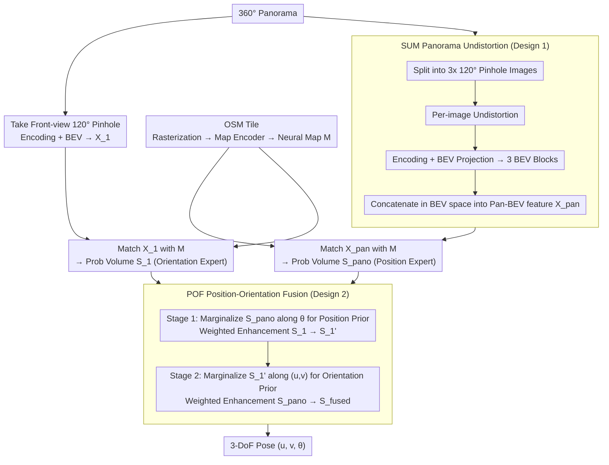

# RHO: Robust Holistic OSM-Based Metric Cross-View Geo-Localization

**Conference**: CVPR 2026  
**arXiv**: [2603.27758](https://arxiv.org/abs/2603.27758)  
**Code**: [https://github.com/InSAI-Lab/RHO](https://github.com/InSAI-Lab/RHO)  
**Area**: Remote Sensing / Visual Localization  
**Keywords**: Cross-View Geo-Localization, OpenStreetMap, Panorama, Robustness, BEV

## TL;DR

This work presents CV-RHO, the first OSM-based metric-level cross-view localization benchmark targeting adverse weather and sensor noise (2.7M+ images). A dual-branch Pin-Pan architecture model, RHO, is proposed, incorporating Split-Undistort-Merge (SUM) and Position-Orientation Fusion (POF) mechanisms, achieving up to a 20% improvement in localization performance under various degradation conditions.

## Background & Motivation

Cross-View Geo-Localization (CVGL) is a fundamental task in computer vision, categorized into large-scale retrieval (LCVGL) and metric-level fine-grained localization (MCVGL). MCVGL identifies meter-level position and orientation starting from coarse GPS priors by matching ground-to-satellite images, which holds significant value for autonomous driving and remote sensing.

However, existing research faces three key limitations:

**Lack of Robustness**: Current MCVGL methods predominantly assume ideal lighting and weather conditions. In real-world scenarios, degradations such as rain, snow, fog, and nighttime are common. Experiments show that OrienterNet trained on ideal conditions suffers a sharp drop in Position Recall under degraded conditions (average -8.22%@1m).

**Underutilization of Panoramic Information**: Compared to pinhole images, 360° panoramas provide richer visual information beneficial for position and orientation estimation. However, direct panoramic input introduces severe distortion issues.

**Underutilized OSM Advantages**: Compared to satellite imagery, OpenStreetMap is updated more frequently and has storage overhead only 1/15th of satellite maps (4.8MB/km² vs 75MB/km²). Yet, no large-scale OSM-MCVGL robustness benchmark currently exists.

## Method

### Overall Architecture

RHO aims to locate a camera with meter-level position and degree-level orientation under adverse weather and sensor noise using only a ground image and an OpenStreetMap tile. Instead of a single image source, it accepts both a 360° panorama and a 120° pinhole image as inputs in a dual-branch Pin-Pan architecture. OSM tiles are rasterized and processed by a map encoder to produce a neural map $M$, serving as the shared reference for both branches. The panoramic branch uses SUM undistortion followed by "encoding → BEV projection" to match $M$ and generate a probability volume $S_{pano}$ (specializing in positioning). The pinhole branch takes the front-view 120° image, undergoes a similar encoding-BEV-matching process to obtain $S_1$ (specializing in orientation). Both probability volumes cover 3D pose $(u, v, \theta)$. Finally, the POF module fuses them into $S_{fused}$ to derive the final 3-DoF camera pose. Dual branches are employed because panoramas and pinhole images have complementary strengths in positioning vs. orientation estimation.

### Key Designs

**1. Split-Undistort-Merge (SUM): Mitigating Equirectangular Distortion**

While panoramas provide a 360° field of view, feeding them directly into networks is ineffective. Empirical tests show that inputting raw 360° equirectangular panoramas into OrienterNet yields a PR@1m of only 3.79%, significantly lower than the 21.83% of the pinhole version, due to severe geometric deformation preventing correct BEV projection learning. SUM splits a panorama into three 120° pinhole images (covering 0°–120°, 120°–240°, 240°–360°), applies standard panorama-to-pinhole undistortion, and generates three BEV features which are then merged into a complete 360° BEV feature map. This design introduces no new parameters and requires no extra training, simply replacing "distorted panoramas" with a "geometric assembly of three undistorted pinholes."

**2. Position-Orientation Fusion (POF): Complementary Dual-Branch Enhancement**

The authors provide an information-theoretic explanation using Shannon entropy: as a panorama's field of view is spatially closed, the observed content remains invariant as the camera rotates in place (entropy remains constant under rotation), making it more sensitive to "where I am." Conversely, a pinhole image's content changes significantly with rotation (entropy varies with rotation), making it sensitive to "where I am facing." POF implements a two-stage mutual enhancement. Stage 1 uses LogSumExp to marginalize $S_{pano}$ along the orientation dimension $\theta$ to obtain a 2D spatial prior, which is used to enhance the pinhole probability volume (Equations 2–5). Stage 2 reverses the process: marginalizing the enhanced $S_1'$ along spatial dimensions $(u, v)$ to obtain an orientation prior to enhance $S_{pano}$ (Equations 6–8). Learnable weights $\alpha$ and $\beta$ control the fusion intensity.

**3. CV-RHO Dataset: Large-Scale Robust OSM-MCVGL Benchmark**

CV-RHO addresses the lack of robust OSM-based benchmarks. It covers 7 cities in the US, Germany, and France, containing 114k panoramas and 342k pinhole images. Eight types of degradations are systematically generated: four semantic-level degradations (rain, snow, fog, night) using FLUX.1 Kontext (consuming 30.7k A100 GPU hours) and three sensor-level degradations (overexposure, underexposure, motion blur) using OpenCV. The total dataset exceeds 2.7M images. Cross-region (Mount Vernon) and Sim2Real test sets are included to evaluate generalization to real-world degradation.

### Loss & Training

- Training Objective: Maximize the probability estimation of 3-DoF camera pose using NLL loss.
- Training Resources: 12×A100 GPUs.
- Rotation Sampling: 64 for training, 256 for evaluation.
- Batch size: 36, Learning rate: 2e-5, Optimizer: Adam + ReduceLROnPlateau scheduler.
- Optimal models typically converge between 2-4 epochs (~20k-40k steps).

## Key Experimental Results

### Main Results

**Clean Conditions** (Table 3)

| Method | FoV | PR@1m | PR@3m | PR@5m | OR@1° | OR@3° | OR@5° |
|------|-----|-------|-------|-------|-------|-------|-------|
| OrienterNet | 90° | 18.02 | 58.37 | 71.04 | 27.72 | 63.86 | 77.50 |
| OrienterNet | 120° | 21.83 | 66.16 | 78.03 | 35.02 | 74.89 | 85.62 |
| OrienterNet | 360° | 3.79 | 19.35 | 28.78 | 10.29 | 28.43 | 36.87 |
| **RHO** | **360°** | **24.59** | **73.55** | **84.36** | **43.46** | **83.61** | **90.44** |

**Robustness under Degradation** (Table 4, Clean Train → Condition Test)

| Method | Train/Avg Degrade (AV) | PR@1m Drop | OR@1° Drop |
|------|-------------|----------|----------|
| OrienterNet | Clean→AV | -8.22 | -10.98 |
| **RHO** | **Clean→AV** | **-5.97** | **-9.95** |

**Degraded Train → Test** (Table 4 Bottom)

| Method | Match Condition Train→Test | PR@1m | OR@1° |
|------|----------------------|-------|-------|
| OrienterNet | AV→AV | -2.04 | -1.82 |
| **RHO** | **AV→AV** | **+0.03** | **-1.10** |

Ours (RHO) shows almost no performance degradation under matching conditions, with PR@1m even showing slight gains.

### Ablation Study

| Configuration | PR@3m | OR@3° | Note |
|------|-------|-------|------|
| Pinhole Only | ~66 | ~75 | Baseline OrienterNet 120° |
| Pan Only (No SUM) | ~19 | ~28 | Severe distortion |
| Pan + SUM | ~70 | ~80 | SUM effectively handles distortion |
| Pan + SUM + POF | **73.55** | **83.61** | POF adds +3.5/+3.6 gain |

### Key Findings

- Direct training on 360° panoramas is ineffective (PR@1m ~3.79%); the SUM module is critical for the panoramic branch.
- POF two-stage fusion significantly outperforms simple probability volume concatenation or single-branch solutions.
- Trained on matching degraded conditions, RHO's average degradation is near zero, demonstrating extreme robustness.
- Motion blur remains the most challenging degradation; RHO shows the most significant drop in this condition.

## Highlights & Insights

1. **Information-Theoretic Architecture**: Utilizing Shannon entropy to analyze the complementarity of panorama/pinhole images for pose estimation provides a theoretical basis for the dual-branch design.
2. **Lightweight Distortion Handling**: The SUM module requires no extra training, utilizing standard projections to resolve distortion.
3. **First OSM-MCVGL Robustness Benchmark**: CV-RHO fills a significant gap in the field, facilitating future research on robust localization.
4. **Sim2Real Feasibility**: Models trained on FLUX.1 Kontext generated degradations show strong zero-shot performance in real-world degraded scenarios.

## Limitations & Future Work

- Performance drop under motion blur suggests a need for targeted data augmentation or anti-blur feature design.
- SUM's fixed 3x120° split could be evolved into an adaptive segmentation strategy.
- Domain gaps between synthetic and real degradation persist, inviting domain adaptation techniques.
- Computational overhead of the dual-branch architecture may limit real-time deployment.
- OSM data is not real-time; localization may fail in rapidly changing environments like construction zones.

## Related Work & Insights

- RHO is a robust and panoramic extension of OrienterNet, evolving from single-branch pinhole to dual-branch panorama+pinhole.
- The POF two-stage injection strategy is transferable to other multi-modal probability fusion tasks.
- The CV-RHO dataset construction pipeline (FLUX.1 Kontext + OpenCV) serves as a reference for creating other vision robustness benchmarks.

## Rating

- **Novelty**: ⭐⭐⭐⭐ — Dual-branch and POF designs are novel, though built on the BEV matching framework.
- **Experimental Thoroughness**: ⭐⭐⭐⭐⭐ — Extensive coverage of conditions, settings, cross-region, and Sim2Real tests.
- **Writing Quality**: ⭐⭐⭐⭐ — Clear structure and informative visualizations.
- **Value**: ⭐⭐⭐⭐ — High contribution via the benchmark dataset and robustness analysis.

<!-- RELATED:START -->

## Related Papers

- [\[CVPR 2026\] SinGeo: Unlock Single Model's Potential for Robust Cross-View Geo-Localization](singeo_unlock_single_models_potential_for_robust_cross-view_geo-localization.md)
- [\[CVPR 2026\] Geo2: Geometry-Guided Cross-view Geo-Localization and Image Synthesis](geo2_geometry-guided_cross-view_geo-localization_and_image_synthesis.md)
- [\[CVPR 2026\] UniGeoRS: A Unified Benchmark for Tri-view Geo-Localization](unigeors_a_unified_benchmark_for_tri-view_geo-localization.md)
- [\[CVPR 2026\] MOGeo: Beyond One-to-One Cross-View Object Geo-localization](mogeo_beyond_one-to-one_cross-view_object_geo-localization.md)
- [\[ECCV 2024\] ConGeo: Robust Cross-View Geo-Localization Across Ground View Variations](../../ECCV2024/remote_sensing/congeo_robust_cross-view_geo-localization_across_ground_view_variations.md)

<!-- RELATED:END -->
