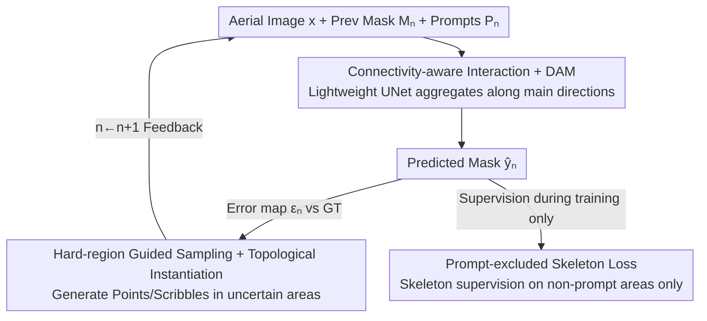

# RoadGIE: Towards A Global-Scale Aerial Benchmark for Generalizable Interactive Road Extraction

**Conference**: CVPR 2026  
**Paper**: [CVF Open Access](https://openaccess.thecvf.com/content/CVPR2026/html/Peng_RoadGIE_Towards_A_Global-Scale_Aerial_Benchmark_for_Generalizable_Interactive_Road_CVPR_2026_paper.html)  
**Code**: https://github.com/chaineypung/RoadGIE  
**Area**: Remote Sensing  
**Keywords**: Road Network Extraction, Interactive Segmentation, Remote Sensing Benchmark, Topological Connectivity, Scribble Prompt

## TL;DR
Ours first constructs WorldRoadSeg-360K—a global aerial road network segmentation benchmark covering 223 cities in 38 countries with 367,000 pixel-level annotations. Based on this, RoadGIE is proposed: a real-time road extraction framework with only 3.7M parameters that supports "connectivity-aware" interaction (clicks/scribbles), achieving Prev. SOTA in segmentation accuracy and topological consistency while reducing manual annotation time by approximately 79%.

## Background & Motivation

**Background**: Extracting roads from aerial/satellite imagery is a fundamental task for map updates, spatial structure analysis, and GIS construction. Existing datasets fall into two categories: graph-based annotations (vector centerline, e.g., Global-Scale, SpaceNet) and segmentation annotations (pixel mask, e.g., DeepGlobe, LSRV).

**Limitations of Prior Work**: No single dataset simultaneously addresses scene diversity, semantic granularity, and structural continuity. While Global-Scale offers global coverage, it uses OSM vector centerlines, losing road width and boundary continuity, making it unsuitable for fine-grained segmentation. LSRV provides high-precision pixel masks but has few samples and almost exclusively covers urban areas, lacking diverse terrains and complex morphologies. Most pixel-level datasets are limited to a single country or city.

**Key Challenge**: Roads are slender structures with high aspect ratios, strong continuity, and topological sensitivity. Purely automatic segmentation models are prone to outputting fragmented road networks. While interactive foundation models like SAM possess strong generalization, point/box prompts only provide coarse spatial cues that are **naturally misaligned with road network topology**. Coupled with high latency and user intent ambiguity, the interactive experience remains suboptimal.

**Goal**: (1) Construct a truly global-scale, pixel-level, and terrain-diverse road segmentation benchmark; (2) Design an interactive paradigm where prompt forms align with road morphology and maintain structural consistency across multiple interaction rounds without degradation.

**Key Insight**: The authors observe that **the form of visual prompts should match the morphological characteristics of the target object**. Scribbles inherently encode shape, continuity, and connectivity, making them more suitable for slender roads than isolated points and closer to the actual habits of annotators.

**Core Idea**: Replace point/box prompts with "connectivity-aware prompts (clicks + scribbles) + hard-region guidance + topology-aware loss" for interactive road extraction, supported by a global-scale dataset to maximize generalization.

## Method

### Overall Architecture

This work follows a dual track of "Benchmark + Method." On the benchmark side is **WorldRoadSeg-360K**: 366,947 satellite images (512×512, 0.8–1.1m resolution) across 223 cities in 38 countries (all continents except Antarctica), with an additional 1,789 images from LSRV (Boston/Birmingham/Shanghai) as an OOD test set. Data was collected via Google Static Maps and OSM, then refined using a fusion of SAM/HQ-SAM/RobustSAM outputs, followed by manual classification into high/low-quality subsets.

On the method side is the iterative interaction workflow of **RoadGIE**: At round $n$, the input consists of the current image $x$, the previous prediction $M_n=\hat{y}_{n-1}$ ($M_0=\mathbf{0}$), and a set of prompts $P_n$. The network outputs an updated prediction $\hat{y}_n = f_\theta(x, M_n, P_n)$. Comparison with the GT yields an error map, from which a simulated annotator generates corrective prompts in erroneous regions to feed into the next round, cycling until accuracy meets requirements.

### Key Designs

**1. WorldRoadSeg-360K: A Global-Scale Pixel-Level Road Benchmark**

To address the limitations of existing datasets, the authors systematically selected 15–45km rectangular areas covering cities of various scales, including dense urban, rural, and mountainous terrains. The construction involves a semi-automatic pipeline: Google Static Maps for high-res imagery, OSM for coarse labels, and feeding coarse labels as prompts into multiple SOTA models (SAM, HQ-SAM, RobustSAM). The **fusion of multi-model outputs and original labels** generates refined masks, which are manually verified. Its value lies not just in "size," but in simultaneously achieving pixel-level precision, terrain diversity, and cross-domain evaluation capabilities.

**2. Connectivity-Aware Interaction + DAM: Aligning Prompts and Networks with Topology**

To solve the misalignment between points/boxes and road morphology, RoadGIE injects connectivity priors into both ends. For prompts, it supports clicks and scribbles. During training, prompt simulation synthesizes "user-like corrections": error maps $\varepsilon_n = y - \hat{y}_{n-1}$ are calculated, and samples are taken from corrective regions $V$. Point prompts use center-biased distance transform sampling $P(x)=\dfrac{\exp(\alpha E(x))}{\sum_{z\in V}\exp(\alpha E(z))}$, while scribbles include center scribbles (from $V$'s skeleton), straight lines, and Bézier curves, with displacement fields added to simulate real shaking. For the network, a Directional Aggregation Module (DAM) follows the lightweight UNet decoder: 1D convolutions capture long-range dependencies across four directions $D\in\{(1,0),(0,1),(1,1),(-1,1)\}$. Aggregating features along main directions effectively repairs fractures in occluded road sections.

**3. Expert-Guided Prompts and Topological Semantic Instantiation: Redirecting Supervision and Resolving Ambiguity**

**Expert-guided prompts (EG-Prompt)** use the Mean Absolute Error of an ensemble of pre-trained models $\{M_j\}_{j=1}^N$ as an uncertainty map $U(x)$, defining prompt sampling probability as $P(u{=}{+}1\mid x)=\dfrac{U(x)^\beta}{\sum_{z\in\Omega} U(z)^\beta}$. This forces positive prompts into high-uncertainty occluded/blurry segments. **Topological Semantic Coupled Instantiation** addresses user intent ambiguity (e.g., extracting only main roads vs. all roads). Instead of direct mask output, the model regularizes structure via $F_{clean}$, extracts centerlines via $F_{thin}$, and calculates segment-level attributes via $F_{attr}$. A prompt-conditioned ranker then selects candidate segments based on prompt relevance, followed by iterative expansion.

**4. Prompt-Excluded Skeleton Loss: Preserving Connectivity Across Rounds**

The authors observed a counter-intuitive phenomenon: multi-round interaction can lead to performance degradation where subsequent prompts overwrite previously correct regions, leaving only sparse traces. The root cause is that skeleton-based losses, when applied globally, overfit in regions already well-supervised by prompts. The solution is **Prompt-excluded Skeleton Loss**, which restricts skeleton recall calculations to non-prompt areas $\bar{\mathcal{M}}_n = 1 - \mathcal{M}_n$. The total loss combines Focal, Soft Dice, and the Prompt-excluded Skeleton term: $\dfrac{\sum_i \bar{\mathcal{M}}_n[i]\cdot\hat{y}_i\cdot \text{Skel}(y_i)+\epsilon}{2\sum_i \bar{\mathcal{M}}_n[i]\cdot \text{Skel}(y_i)+\epsilon}$.

### Loss & Training
The total loss $\mathcal{L}_{total}$ is the sum of Focal Loss, Soft Dice Loss, and Prompt-excluded Skeleton Loss. Each training batch runs 5 interaction rounds with 1–3 prompts per round. Data augmentation includes rotation, flipping, contrast/brightness adjustments, and Gaussian blur. Training uses bf16 precision, AdamW, a 0.0003 initial learning rate, and cosine scheduling on 4×RTX 3090 (24GB).

## Key Experimental Results

### Main Results
Comparison of interactive segmentation models on the Baseline dataset and WorldRoadSeg-360K (after 5 interaction rounds):

| Method | Baseline Dice↑ | Baseline APLS↑ | WorldRoadSeg Dice↑ | WorldRoadSeg APLS↑ |
|------|------|------|------|------|
| EISeg | 0.701 | 0.511 | 0.706 | 0.515 |
| ScribbleSeg-B3 | 0.761 | 0.556 | 0.788 | 0.580 |
| SAM (ViT-h) | 0.738 | 0.539 | 0.756 | 0.553 |
| PRISM-2D | 0.622 | 0.463 | 0.643 | 0.481 |
| ScribblePrompt | 0.791 | 0.584 | 0.809 | 0.592 |
| **RoadGIE** | **0.807** | **0.593** | **0.835** | **0.620** |

RoadGIE ranks first on both datasets, significantly outperforming ScribblePrompt.

### Ablation Study

**Dataset Generalization (LSRV as test set, 5 rounds)**—Verifying WorldRoadSeg-360K as a pre-training set:

| Pre-training Dataset | Dice↑ | Recall↑ | clDice↑ | APLS↑ | β0↓ | β1↓ |
|------|------|------|------|------|------|------|
| Global-Scale | 0.686 | 0.605 | 0.783 | 0.512 | 13.582 | 37.886 |
| Baseline dataset | 0.807 | 0.897 | 0.869 | 0.593 | 8.150 | 3.061 |
| **WorldRoadSeg-360K** | **0.835** | **0.934** | **0.905** | **0.620** | **5.823** | **2.752** |

**Loss Strategy Ablation (5-round mean)**—Verifying where prompt-exclusion works best:

| Prompt-exclude Config | Dice↑ | APLS↑ | Description |
|------|------|------|------|
| Entire Map | 0.818 | 0.603 | Baseline |
| Exclude on Focal | 0.806 | 0.595 | Performance drops |
| Exclude on Dice | 0.823 | 0.609 | Slight gain |
| **Exclude on Skeleton-recall** | **0.829** | **0.615** | Best fit for structural supervision |

### Key Findings
- **WorldRoadSeg-360K is superior for pre-training**: Compared to Global-Scale, β0 (connected components) dropped from 13.58 to 5.82, and β1 (cycles) dropped from 37.89 to 2.75. Models trained on vector centerlines exhibit the worst connectivity.
- **EG-Prompt provides higher gains in later rounds**: At the 5th round, Dice improved by +2.7. This aligns with the design to focus supervision on difficult samples as the interaction progresses.
- **Bézier scribbles are the strongest prompt type**: After 10 rounds, Dice reached 87.1, significantly better than click-only prompts (<80), confirming that prompt morphology must match target morphology.
- **Efficiency**: Only 3.7M parameters with a GPU inference time of 39.52ms. In user studies, manual annotation Dice improved from 0.827 to 0.885, while annotation time per image dropped from 73s to 15s (Gain: ~79%).

## Highlights & Insights
- **"Prompt symmetry with target morphology"** is the unifying theme of the paper, from scribble design to DAM and skeleton loss. This logic is transferable to other tubular structures like vessels or rivers.
- **Prompt-excluded skeleton loss is a clever trick**: By masking out already annotated regions, it forces the model's attention toward unannotated road geometry, preventing multi-round degradation.
- **"Abstraction before Instantiation"**: Using a structured representation (centerline/segment attributes) before applying user-conditioned ranking effectively mitigates noise from inconsistent annotation criteria.
- **Semi-automatic Data Engine**: Using the SAM family to refine OSM coarse labels into pixel masks provides a practical engineering paradigm for constructing large-scale, high-precision datasets at low cost.

## Limitations & Future Work
- **Limitations**: Both data and models are based on 0.8–1.1m resolution; generalization to higher resolutions is unverified. Training is limited to 6 interaction rounds due to VRAM constraints.
- **Observation**: Quantitative evidence for topological instantiation is relegated to supplementary materials. The semi-automatic annotation quality is capped by the performance of the SAM family in the remote sensing domain.
- **Future Work**: Explore resolution-adaptive training and adaptive early-stopping for interaction rounds based on uncertainty.

## Related Work & Insights
- **vs ScribblePrompt**: Both use scribble simulation, but RoadGIE injects road-specific connectivity priors (DAM + skeleton loss + topological instantiation), outperforming it on road networks while using fewer parameters.
- **vs SAM family**: SAM uses points/boxes for category-agnostic segmentation; RoadGIE uses connectivity-aware prompts to better align with road topology.
- **vs Global-Scale**: Global-Scale uses vector centerlines (losing width); WorldRoadSeg-360K provides pixel masks with 4x higher scale and significantly better topological metrics.

## Rating
- Novelty: ⭐⭐⭐⭐ Global-scale pixel-level benchmark + connectivity-aware interactive paradigm.
- Experimental Thoroughness: ⭐⭐⭐⭐ Multi-dimensional ablation studies including user studies and runtime; independent quantization of topological instantiation is slightly lacking in the main text.
- Writing Quality: ⭐⭐⭐⭐ Clear correspondence between motivation and design.
- Value: ⭐⭐⭐⭐⭐ High practical value for the remote sensing community with a 79% efficiency gain and 3.7M real-time model.

<!-- RELATED:START -->

## Related Papers

- [\[CVPR 2026\] Beyond Endpoints: Path-Centric Reasoning for Vectorized Off-Road Network Extraction](beyond_endpoints_path-centric_reasoning_for_vectorized_off-road_network_extracti.md)
- [\[CVPR 2026\] Cross-modal Fuzzy Alignment Network for Text-Aerial Person Retrieval and A Large-scale Benchmark](cross-modal_fuzzy_alignment_network_for_text-aerial_person_retrieval_and_a_large.md)
- [\[CVPR 2026\] Cross-Scale Pansharpening via ScaleFormer and the PanScale Benchmark](cross-scale_pansharpening_via_scaleformer_and_the_panscale_benchmark.md)
- [\[CVPR 2026\] Olbedo: An Albedo and Shading Aerial Dataset for Large-Scale Outdoor Environments](olbedo_an_albedo_and_shading_aerial_dataset_for_large-scale_outdoor_environments.md)
- [\[CVPR 2026\] WHU-MARS: A Multispectral Aerial-Ground Benchmark Towards Any-Scenario Person Re-Identification](whu-mars_a_multispectral_aerial-ground_benchmark_towards_any-scenario_person_re-.md)

<!-- RELATED:END -->
