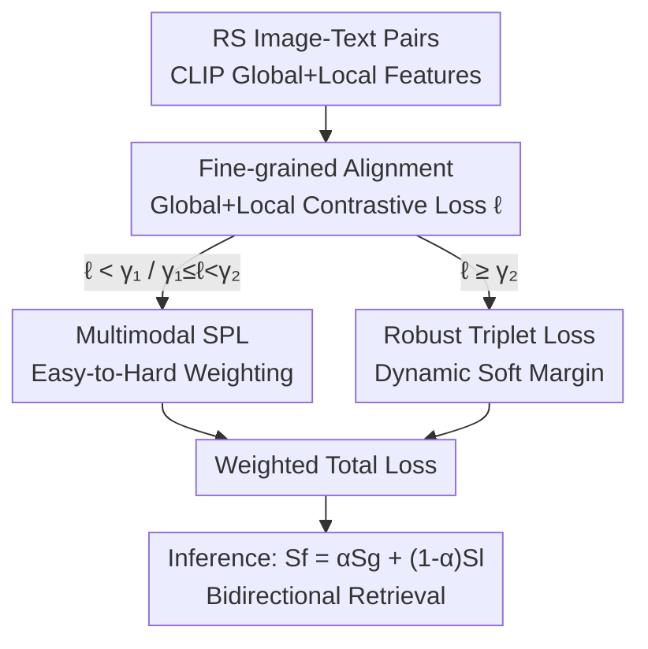

# Robust Remote Sensing Image–Text Retrieval with Noisy Correspondence

**Conference**: CVPR 2026  
**Paper**: [CVF Open Access](https://openaccess.thecvf.com/content/CVPR2026/html/Song_Robust_Remote_Sensing_Image-Text_Retrieval_with_Noisy_Correspondence_CVPR_2026_paper.html)  
**Code**: https://github.com/MSFLabX/RRSITR  
**Area**: RS Image-Text Retrieval / Multimodal VLM  
**Keywords**: Noisy Correspondence, RSITR, Self-paced Learning, Robust Triplet Loss, CLIP

## TL;DR
This paper investigates the "Noisy Correspondence" issue (misaligned image-text pairs) in Remote Sensing Image-Text Retrieval (RSITR) for the first time and proposes the RRSITR framework. By categorizing training pairs into clean, fuzzy, and noisy sets based on contrastive loss, the method utilizes multimodal self-paced learning for easy-to-hard scheduling and applies a robust triplet loss with dynamic soft margins to noisy pairs. It significantly outperforms existing SOTA, particularly under high noise rates.

## Background & Motivation
**Background**: Remote Sensing Image-Text Retrieval (RSITR) aims to map satellite/aerial images and natural language descriptions into a shared embedding space for bidirectional retrieval. Mainstream methods include CNN+RNN based approaches (e.g., SIRS for fine-grained alignment via semantic segmentation, MSA for multi-scale alignment) and Transformer/Vision-Language Pre-training based models (e.g., RemoteCLIP, CUP).

**Limitations of Prior Work**: Almost all RSITR methods **assume that training image-text pairs are perfectly matched**. However, remote sensing images, characterized by top-down/nadir views, lack the egocentric visual priors (like front/side views) common in natural scenes, leading to inherent ambiguity in text descriptions. Furthermore, large-scale precise annotation is extremely costly or infeasible. The authors observe that mainstream datasets like RSITMD **do contain misaligned pairs**—for instance, an image featuring houses and ponds paired with the text "This is a beautiful lake like a sapphire." Such erroneous supervision signals mislead the model and degrade retrieval performance.

**Key Challenge**: Prior work, even if sensing the presence of "weakly correlated/meaningless pairs," **lacks an explicit method to identify and differentiate these noisy pairs**. Models treat misaligned pairs as correct supervision during training, leading to biased representations.

**Goal**: To make models robust to noisy correspondence in training data without relying on additional clean labels—specifically, by distinguishing noisy pairs and preventing them from polluting the alignment learning process.

**Key Insight**: Drawing from the "easy-to-hard" cognitive learning pattern in humans (Self-Paced Learning, SPL), the authors hypothesize that noisy pairs manifest **higher contrastive losses** during early training stages. Consequently, loss magnitude can serve as a signal to determine sample reliability and schedule training order and weights.

**Core Idea**: Training pairs are dynamically categorized into clean, fuzzy, and noisy sets based on loss. A multimodal self-paced function manages dynamic weighting and scheduling (discarding noisy pairs), while a "dynamic soft margin" robust triplet loss is applied to potential noisy pairs.

## Method

### Overall Architecture
The input to RRSITR consists of RS image-text pairs $(I_i, T_i)$, and the output is cross-modal similarity for retrieval. The process follows four steps: first, extracting features via CLIP dual encoders and performing **global + local dual-path fine-grained alignment** to obtain the contrastive loss $\ell_i$ for each pair; second, **dynamically dividing** the batch into clean, fuzzy, and noisy pairs based on $\ell_i$; third, using **multimodal self-paced learning** to assign weights and training order for clean/fuzzy pairs (noisy pairs are temporarily excluded with zero weight); and fourth, employing **robust triplet loss** for controlled learning on suspected noisy pairs using adaptive soft margins. The three loss components are optimized jointly via weighted summation. During inference, global and local similarities are weighted to form the fine-grained similarity $S_f$.

### Key Designs

**1. Fine-grained Alignment: Using Global+Local Contrastive Loss as Alignment Objective and Noise Probe**

Global similarity alone may miss local details. This method extracts global features $f_v^g, f_t^g$ and local features $\{f_v^1,\dots\}, \{f_t^1,\dots\}$ using CLIP encoders. Global similarity is $S^g = \cos(f_v^g, f_t^g)$. Local similarity is computed via $S_{ij}^l = \cos(f_v^i, f_t^j)$, followed by **two consecutive L2-normalizations** $S^l = \|S_{ij}^l\|_{2,2}$ to aggregate into a pair-level local similarity. Both paths use symmetric InfoNCE loss to pull positive samples closer and push negative samples away, resulting in $L^{gl}_{info} = L^g_{info} + L^l_{info}$. This design is ingenious: it fulfills the alignment task while **producing the total contrastive loss $\ell_i = L^g_i + L^l_i$** for each pair, which the subsequent modules use as a reliability signal—larger losses indicate higher likelihood of misalignment.

**2. Multimodal SPL: Loss-based Tri-classification with Self-paced Regularizer for Progressive Training**

To address the issue where "the model does not know which pairs are noisy," this design uses two thresholds $\gamma_1, \gamma_2$ to categorize samples by $\ell_i$: $\ell_i < \gamma_1$ as clean (reliable, easy, included early); $\gamma_1 \le \ell_i < \gamma_2$ as fuzzy (relatively reliable but difficult, prioritized later); and $\ell_i \ge \gamma_2$ as noisy (weight $w_i$ set to zero, excluded). The loss for clean/fuzzy pairs is $L_{S}= \frac{1}{N}\sum_i w_i \ell_i + \frac{1}{N}\sum_i R(w_i, \gamma)$, where $R(w_i,\gamma)$ is the self-paced regularizer.

The regularizer is designed as $R(w_i,\gamma) = -\frac{2}{\pi}\gamma\big[w_i\arccos(w_i) - \sqrt{1-w_i^2}\big]$ (when $\ell_i < \gamma$, else 0). By fixing parameters and optimizing $w_i$, the closed-form optimal weight is:

$$w_i^* = \cos\!\Big(\frac{\pi}{2}\cdot\frac{\ell_i}{\gamma}\Big), \quad \ell_i < \gamma; \qquad w_i^* = 0, \quad \ell_i \ge \gamma.$$

This $\cos$ form ensures $w_i \in [0,1]$. Smaller losses (easier samples) receive higher weights, which increase monotonically as loss decreases during training. This allows the model to master simple, reliable samples before gradually including harder ones, suppressing interference from noisy correspondence. Unlike traditional SPL that requires manual weight function design, this weight is determined adaptively by the loss.

**3. Robust Triplet Loss: Using Dynamic Soft Margins for Noisy Pairs to Avoid Over-confidence**

Pairs identified as noisy are not simply discarded but handled via Robust Triplet Loss (RTL) for controlled learning. Conventional triplet loss uses fixed margins and hard negative mining. However, when positive pairs are misaligned and $S^g(v_i,t_i)$ is low, the fixed margin forces the model to use overly strict criteria, leading to over-confidence on easy samples and under-learning on hard ones. RTL introduces an **adaptive soft margin**:

$$\hat{\mu}_i = \sigma\cdot\big(1 + \max(0,\, S^g(v_i,\hat{t}_h) - S^g(v_i,t_i))\big),$$

with $\hat{\zeta}_i$ defined symmetrically, where $\hat{v}_h, \hat{t}_h$ are the hardest negative samples within the batch and $\sigma$ is the base margin hyperparameter. The loss $L_{soft}$ follows a bidirectional $[\hat{\mu}_i - S^g(v_i,t_i) + S^g(v_i,\hat{t}_h)]_+$ form. Intuitively, when positive similarity is abnormally low (suspected noise), the soft margin adaptively expands so the model is not misled by misaligned pairs.

### Loss & Training
The overall objective is $L_{overall} = L_{S1} + \lambda_1 L_{S2} + \lambda_2 L_{soft}$, where $L_{S1}$ and $L_{S2}$ are self-paced losses for clean and fuzzy pairs, respectively. Inference uses the fused similarity $S_f = \alpha S^g + (1-\alpha)S^l$. The backbone is OpenCLIP's ViT-B/32, optimized with Adam for 50 epochs, batch size 100, learning rate $7\times10^{-6}$, and weight decay 0.7. Hyperparameters are fixed across datasets: $\gamma_1=5, \gamma_2=18, \sigma=0.6, \lambda_1=0.8, \lambda_2=0.9, \alpha=0.9$ on a single A800 GPU.

## Key Experimental Results

Tests were conducted on three benchmarks: RSITMD, RSICD, and NWPU (split 8:1:1). Synthetic noisy correspondence was created by randomly shuffling text at rates of 20%, 40%, 60%, and 80%. Metrics include R@1/5/10 and mean Recall (mR).

### Main Results (RSITMD, mR, Higher is Better)

| Noise Rate | CUP (Runner-up) | RRSITR (Ours) | Gain |
| :--- | :--- | :--- | :--- |
| 20% | 38.99 | **45.58** | +6.59 |
| 40% | 36.73 | **43.64** | +6.91 |
| 60% | 33.68 | **42.06** | +8.38 |
| 80% | 27.59 | **35.93** | +8.34 |

Key observation: As noise rates increase from 20% to 80%, almost all baselines experience severe performance collapse (e.g., KAMCL, MSA, and S-CLIP drop to near zero or single-digit mR at 60%~80%). RRSITR maintains an mR of 35.93 even under 80% noise, showing that the lead increases with the noise level.

### Ablation Study (RSITMD, 80% Noise, mR)

| Configuration | mR | Description |
| :--- | :--- | :--- |
| #1 w/o Local Contrastive Learning | 33.38 | Loss of fine-grained alignment |
| #2 w/o SPL Module | 29.80 | **Largest drop**, verifies SPL is most critical |
| #3 w/o RTL Module | 30.21 | Noisy pairs lose soft margin protection |
| #4 w/o All Components | 32.24 | Degenerates to base alignment |
| #5 Reverse SPL (Hard-to-Easy) | 1.22 | Total collapse due to wrong order |
| #6 SPL with Random Weighting | 26.52 | Weight loses loss-based reliability |
| #7 SPL w/o Fuzzy Category | 1.10 | Tri-classification is essential |
| #8 RTL with Fixed Margin | 33.90 | Verifies dynamic soft margin effectiveness |
| **RRSITR (Full)** | **35.93** | — |

### Key Findings
- **SPL contribution is paramount**: Removing it drops mR from 35.93 to 29.80. Reversing the order (#5) or removing the fuzzy category (#7) leads to total collapse (mR ≈ 1), proving that the "easy-to-hard + tri-classification" logic is the framework's core.
- **Random weighting (#6, 26.52)** is significantly worse than loss-driven weighting, confirming that contrastive loss magnitude effectively captures noisy pair characteristics.
- **Dynamic soft margins outperform fixed margins** (#8 33.90 → 35.93), with synergistic gains from all modules combined.

## Highlights & Insights
- **Dual-purpose Alignment Loss**: The InfoNCE contrastive loss serves as both an optimization objective and a probe for noise detection—no extra noise-detection network is needed, ensuring efficiency.
- **Closed-form Solution for SPL**: The $w_i^* = \cos(\frac{\pi}{2}\cdot\frac{\ell_i}{\gamma})$ weight naturally falls in $[0,1]$ and varies monotonically with loss, which targets "noisy correspondence" rather than just general outliers.
- **Growth with Noise**: Superiority increases at extreme noise levels (80%), making it highly practical for real-world RS data where labels are often inconsistent.

## Limitations & Future Work
- Noise in evaluations is **synthetically generated** by shuffling text. This may not perfectly match the distribution of real-world "weakly correlated" noise. ⚠️
- Three hyperparameters ($\gamma_1, \gamma_2, \sigma$) are fixed constants. The paper does not explore adaptive thresholding if noise rates or distributions shift significantly.
- The method is tied to CLIP-like dual-encoder architectures and contrastive loss paradigms; its performance on single-tower or non-contrastive frameworks is unknown.
- Some training details are relegated to supplementary materials, making standalone replication slightly difficult. ⚠️

## Related Work & Insights
- **vs. CUP (Next best baseline)**: CUP uses "context + uncertainty-aware prompts" to reduce costs but assumes clean data; RRSITR treats "misaligned data" as a primary problem and significantly outperforms it at high noise levels.
- **vs. Traditional SPL**: Traditional SPL is mostly unimodal and uses manual weight functions; this work extends it to multimodal contrastive learning with adaptive closed-form weighting.
- **vs. Hard Triplet Loss**: While hard triplet loss pulls strictly based on hard negatives, RTL uses dynamic soft margins to avoid overfitting to incorrectly supervised noisy pairs.

## Rating
- Novelty: ⭐⭐⭐⭐⭐ 
- Experimental Thoroughness: ⭐⭐⭐⭐ 
- Writing Quality: ⭐⭐⭐⭐ 
- Value: ⭐⭐⭐⭐⭐ 

<!-- RELATED:START -->

## Related Papers

- [\[CVPR 2026\] TriSim: Tri-Dimensional Similarity Modeling with Extreme Value Theory for False-Negative Mitigation in Remote Sensing Image-Text Retrieval](trisim_tri-dimensional_similarity_modeling_with_extreme_value_theory_for_false-n.md)
- [\[CVPR 2026\] Cross-modal Fuzzy Alignment Network for Text-Aerial Person Retrieval and A Large-scale Benchmark](cross-modal_fuzzy_alignment_network_for_text-aerial_person_retrieval_and_a_large.md)
- [\[CVPR 2026\] ChangeBridge: Spatiotemporal Image Generation with Multimodal Controls for Remote Sensing](changebridge_spatiotemporal_image_generation_with_multimodal_controls_for_remote.md)
- [\[CVPR 2026\] Remote Sensing Image Super-Resolution for Imbalanced Textures: A Texture-Aware Diffusion Framework](remote_sensing_image_super-resolution_for_imbalanced_textures_a_texture-aware_di.md)
- [\[CVPR 2026\] QuCNet: Quantum Deep Learning Driven Multi-Circuit Network for Remote Sensing Image Classification](qucnet_quantum_deep_learning_driven_multi-circuit_network_for_remote_sensing_ima.md)

<!-- RELATED:END -->
