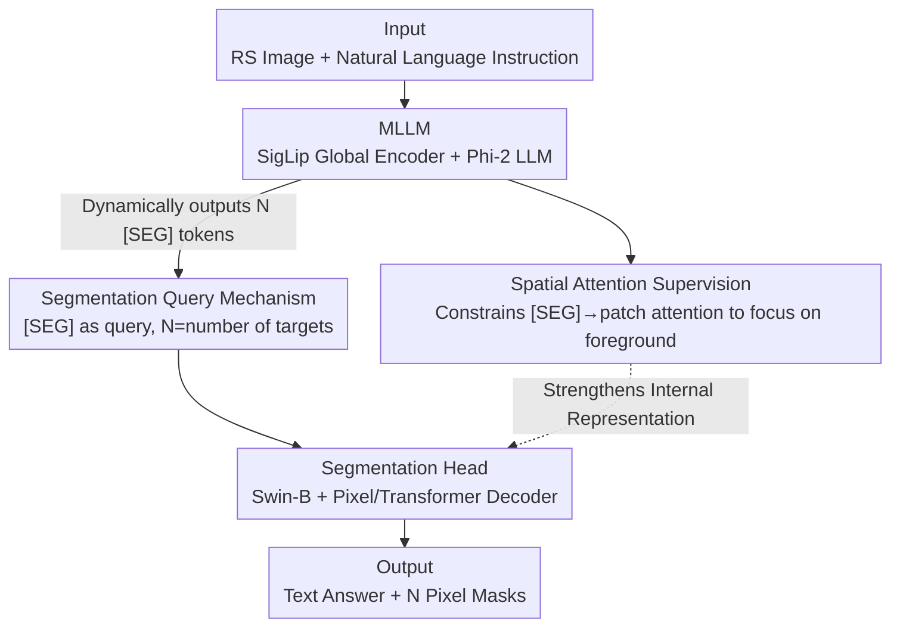

# SegEarth-R2: Towards Comprehensive Language-guided Segmentation for Remote Sensing Images

**Conference**: CVPR 2026  
**Paper**: [CVF Open Access](https://openaccess.thecvf.com/content/CVPR2026/html/Xin_SegEarth-R2_Towards_Comprehensive_Language-guided_Segmentation_for_Remote_Sensing_Images_CVPR_2026_paper.html)  
**Code**: https://github.com/earth-insights/SegEarth-R2  
**Area**: Remote Sensing / Language-guided Segmentation / Multimodal VLM  
**Keywords**: Remote Sensing Segmentation, Reasoning Segmentation, Language-guided, Multi-object Segmentation, Attention Supervision

## TL;DR
Addressing four complex requirements in remote sensing (small objects, multi-granularity, multi-object, and implicit instructions), this work introduces LaSeRS, the first large-scale dataset systematically covering these dimensions (40k masks, 122 classes, 30k QA triplets). It proposes SegEarth-R2, a 3B-parameter MLLM segmentation model that surpasses 7B, 8B, and even 13B models across multiple benchmarks using spatial attention supervision and flexible segmentation queries.

## Background & Motivation
**Background**: Language-guided segmentation in remote sensing (referring/reasoning segmentation) aims to map natural language to pixel-level masks for disaster response, urban planning, and environmental monitoring. Current mainstream methods utilize MLLMs as reasoning engines to output a `[SEG]` token, which then drives segmentation heads like SAM or Mask2Former.

**Limitations of Prior Work**: Existing models primarily handle single-target, explicit instructions (e.g., "airplane in the image"). They often fail in real geographic scenarios requiring multi-granularity (semantic/instance/part-level, such as a few-pixel engine on a wing), multi-object extraction from a single prompt, and understanding implicit intent (e.g., "where to seek shelter during an earthquake").

**Key Challenge**: The root problem is twofold. First, the data level: existing datasets (RRSIS-D, RefSegRS, EarthReason) only cover single-target explicit queries with limited categories (≤28), making models sensitive to complex real-world instructions. Second, the model level: remote sensing targets vary drastically in scale. When using only the "final mask" for supervision, gradients backpropagated to shallow layers are diluted, leading to poor localization of small/fine-grained targets. Furthermore, "propose-then-select" query designs are slow and lack native support for multi-object segmentation.

**Goal**: (1) To build a training and evaluation benchmark systematically covering four dimensions (hierarchical granularity, object multiplicity, reasoning requirements, and language diversity); (2) To design an efficient model capable of precise small-object localization and dynamic single/multi-object segmentation.

**Core Idea**: For data, a semi-automatic pipeline is used to construct LaSeRS. For the model, **spatial attention supervision** directly constrains internal MLLM attention (instead of relying solely on the final mask), while a **flexible segmentation query** mechanism capable of outputting multiple `[SEG]` tokens replaces the cumbersome candidate-matching paradigm.

## Method
Ours consists of a dataset and a model. SegEarth-R2 takes a remote sensing image and an instruction as input, producing a text response and corresponding pixel masks. It comprises two main components: an MLLM for reasoning and outputting `[SEG]` tokens, and an independent segmentation head to translate these tokens into masks.

### Overall Architecture
The global vision encoder (SigLip-so400M, 384×384→27×27 image tokens) and instruction text are fed into the LLM (Phi-2-2.7B). The LLM autoregressively generates a text answer and `[SEG]` tokens where segmentation is required. Simultaneously, attention maps from `[SEG]` tokens to image patches are constrained by **spatial attention supervision**. The `[SEG]` tokens serve as queries for the segmentation head, where a Swin-B encoder extracts multi-scale features, a Pixel Decoder (Mask2Former) fuses them, and a Transformer Decoder (Mask2Former) enables interaction between queries and features. Each `[SEG]` token produces one mask. The 3B model freezes the vision encoder, uses LoRA (rank 8) for the LLM, and fully finetunes both decoders.

### Key Designs

**1. Spatial Attention Supervision: Directly supervising MLLM internal attention for small object localization**

To address the signal dilution in small-object localization caused by final-mask-only supervision, Ours intervenes in the reasoning path. It constrains the attention map $A^{(m,n)}\in\mathbb{R}^{d\times d}$ from the `[SEG]` token to patch tokens. A unified attention grid $A_S=\frac{1}{MN}\sum_{m}\sum_{n}A^{(m,n)}$ is computed by averaging across all $M$ layers and $N$ heads. Using the downsampled GT mask $\hat G\in\{0,1\}^{d\times d}$, the mean attention score for background regions is calculated:

$$a=\frac{\sum_{i,j}A_S(i,j)\cdot(1-\hat G(i,j))}{\sum_{i,j}(1-\hat G(i,j))}$$

A loss is then applied to maximize the distance between foreground attention and the background mean $a$:

$$L_S=-\log\frac{\sum_{i,j}\big(A_S(i,j)-a\big)^2\cdot\hat G(i,j)}{\sum_{i,j}\hat G(i,j)}$$

This sharpens the attention on the foreground targets by providing a clear, localized learning signal to intermediate layers, which is crucial for the significant performance gains observed in part-level segmentation.

**2. Flexible Segmentation Query: Dynamic [SEG] tokens for native multi-target support**

Current "propose-then-select" designs (like InstructSeg) generate hundreds of candidates and perform redundant matching, which is computationally expensive. SegEarth-R1's "instruction-as-query" assumes a one-to-one mapping, failing at multi-object tasks. Ours allows the model to **dynamically output an arbitrary number of `[SEG]` tokens based on context** (e.g., "the `
building
[SEG]` far from the `
ground track field
[SEG]`" yields two tokens). Each `[SEG]` token acts as an independent query in the Transformer Decoder. This natively supports multi-target segmentation where the number of targets equals the number of `[SEG]` tokens.

### Loss & Training
The total loss is a weighted sum: $L=L_t+L_b+L_d+\lambda_S L_S$, where $L_t$ is the text cross-entropy, $L_b$ (pixel-wise BCE) and $L_d$ (DICE) provide mask supervision, and $L_S$ is the spatial attention supervision (with $\lambda_S=0.01$). The backbone is Mipha-3B; the vision encoder is frozen, LLM uses LoRA (rank 8), and both decoders are fully finetuned.

## Key Experimental Results

### Main Results
On the LaSeRS benchmark across four dimensions (gIoU/cIoU):

| Dimension / Model | LISA-13B | PixelLM-13B | GeoPixel-8B | SegEarth-R2-3B (Ours) |
|------|------|------|------|------|
| Part | 17.7/13.1 | 15.8/17.6 | 43.9/52.4 | **64.8/68.3** |
| Single | 38.4/34.2 | 42.2/40.5 | 55.0/45.8 | **55.1/69.2** |
| Multiple | 19.9/23.5 | 20.9/22.4 | **49.2/49.7** | 38.3/56.2 |
| Implicit | 22.6/25.8 | 25.9/22.1 | 41.1/58.3 | **42.8/59.7** |
| Avg. | 27.6/26.1 | 29.9/29.4 | 50.4/55.2 | **57.2/67.9** |

On public referring benchmarks (gIoU):

| Method | RRSIS-D test | RefSegRS test | RISBench test |
|------|------|------|------|
| GeoPixel-8B | 67.3 | - | - |
| SegEarth-R1 | 66.4 | 72.5 | - |
| SegEarth-R2 (Ours) | **67.9** | **74.8** | **70.5** |

### Ablation Study
Ablation of attention supervision intensity $\lambda_S$ (gIoU):

| Configuration | RRSIS-D test | EarthReason test | Description |
|------|------|------|------|
| $\lambda_S=0$ | 66.6 | 72.9 | Without attention supervision |
| $\lambda_S=0.1$ | 67.3 | 71.8 | Over-constraint hurts LLM reasoning |
| $\lambda_S=0.01$ (Ours) | **67.9** | **73.5** | Optimal balance |
| M2F + Swin-B Head | - | **73.5** | Significantly outperforms SAM/SAM2 bases |

### Key Findings
- **Spatial attention supervision provides massive gains for fine-grained tasks**: Part-level segmentation improved by ~20 points over the runner-up, proving that direct signals to intermediate layers solve small-object localization issues.
- **Fewer, accurate queries outperform massive candidates**: Reducing query count lowered TFLOPs and inference time while slightly increasing gIoU, validating that redundant candidates are unnecessary.
- **Head selection is critical**: Mask2Former with Swin-B is far superior to SAM/SAM2 for remote sensing, as multi-scale hierarchical features are vital for small objects.
- **Multi-object bottleneck**: The 3B model is less effective at multi-object tasks than the 8B GeoPixel, likely due to parameter scale limitations.

## Highlights & Insights
- **Direct Supervision at Attention Layers**: By-passing the "wait for final mask backpropagation" path with a simple foreground/background separation loss provides a lightweight trick transferable to any `[SEG]`-based MLLM.
- **Elegant Query Design**: Allowing the LLM context to determine the target count solves the multi-object problem while saving the computational cost of candidate matching.
- **Data/Model Synergy**: The LaSeRS dataset formalizes remote sensing instruction complexity, providing a quantifiable difficulty scale for the community.

## Limitations & Future Work
- **Multi-object Weakness**: The 3B model underperforms 8B models in multi-object scenarios, suggesting a sensitivity to model capacity.
- **Dependence on Gemini Pro for QA**: Semi-automated data generation poses risks of residual hallucinations, requiring high manual filtering costs.
- **Hyperparameter Sensitivity**: $\lambda_S$ has a narrow optimal range (around 0.01); its generalizability across diverse datasets needs further verification.

## Related Work & Insights
- **vs SegEarth-R1**: The predecessor assumed single-target segmentation; SegEarth-R2 introduces dynamic `[SEG]` queries and spatial attention supervision, outperforming it across all benchmarks.
- **vs GeoPixel**: While GeoPixel benefits from an 8B base in multi-object tasks, SegEarth-R2 (3B) achieves higher performance in part-level and implicit tasks, demonstrating the efficiency of "small model + clever supervision."
- **vs LISA / InstructSeg**: Borrowing the `[SEG]` token from LISA but discarding InstructSeg's redundant matching, Ours uses M2F+Swin-B features specifically for remote sensing target scales.

## Rating
- Novelty: ⭐⭐⭐⭐ 
- Experimental Thoroughness: ⭐⭐⭐⭐⭐ 
- Writing Quality: ⭐⭐⭐⭐ 
- Value: ⭐⭐⭐⭐⭐ 

<!-- RELATED:START -->

## Related Papers

- [\[CVPR 2026\] CrossEarth-Gate: Fisher-Guided Adaptive Tuning Engine for Efficient Adaptation of Cross-Domain Remote Sensing Semantic Segmentation](crossearth-gate_fisher-guided_adaptive_tuning_engine_for_efficient_adaptation_of.md)
- [\[CVPR 2026\] SkySense-VITA: Towards Universal In-context Segmentation of Multi-modal Remote Sensing Imagery](skysense-vita_towards_universal_in-context_segmentation_of_multi-modal_remote_se.md)
- [\[CVPR 2026\] UniGeoSeg: Towards Unified Open-World Segmentation for Geospatial Scenes](unigeoseg_towards_unified_open-world_segmentation_for_geospatial_scenes.md)
- [\[CVPR 2026\] MM-OVSeg: Multimodal Optical-SAR Fusion for Open-Vocabulary Segmentation in Remote Sensing](mm-ovseg_multimodal_optical-sar_fusion_for_open-vocabulary_segmentation_in_remot.md)
- [\[CVPR 2026\] Asking like Socrates: Socrates helps VLMs understand remote sensing images](asking_like_socrates_socrates_helps_vlms_understand_remote_sensing_images.md)

<!-- RELATED:END -->
