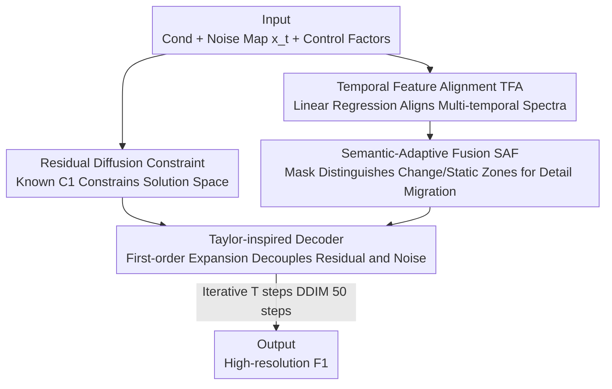

# Semantic-Adaptive Diffusion for Dynamic Spatiotemporal Fusion

**Conference**: CVPR 2026  
**Paper**: [CVF Open Access](https://openaccess.thecvf.com/content/CVPR2026/html/Zhang_Semantic-Adaptive_Diffusion_for_Dynamic_Spatiotemporal_Fusion_CVPR_2026_paper.html)  
**Code**: None  
**Area**: Remote Sensing / Spatiotemporal Fusion / Diffusion Models  
**Keywords**: Spatiotemporal Fusion, Residual Diffusion, Semantic Adaptation, Temporal Alignment, Remote Sensing Imagery

## TL;DR
SA-STF utilizes a residual diffusion framework constrained by low-resolution observations and decoupled through Taylor expansion to separate residuals from noise. Combined with Temporal Feature Alignment (TFA) and Semantic-Adaptive Fusion (SAF) modules, it fuses multi-source satellite imagery (e.g., MODIS/Landsat) into high-spatiotemporal resolution images, particularly excelling at recovering semantic changes in dynamic land covers that traditional or data-driven methods fail to capture.

## Background & Motivation

**Background**: Individual satellites cannot simultaneously achieve high temporal and high spatial resolution—MODIS revisits every 1–2 days but offers only 250–1000 m spatial resolution, while Landsat provides 30 m spatial resolution but revisits approximately every 16 days. Spatiotemporal Fusion (STF) aims to break this trade-off: using two pairs of "coarse-fine" reference images $(F_0,C_0)$ and $(F_2,C_2)$ along with a target coarse image $C_1$ to reconstruct the missing target fine image $F_1$, thereby generating continuous observations that are both frequent and detailed.

**Limitations of Prior Work**: Traditional methods (weighting functions like ESTARFM, unmixing, Bayesian, dictionary learning, and hybrid strategies like FSDAF) rely on linear models and handcrafted features, which work for minor land changes but fail under complex long-term dynamics. Deep learning methods (CNN/Transformer/GAN/Mamba-STF) can model non-linearities automatically but are purely data-driven and lack explicit constraints. In complex dynamic regions with large scale differences, they encounter three issues: ① **Artifacts**—without explicit constraints, large scale gaps lead to obvious artifacts; ② **Spectral Distortion**—different acquisition times and phenological stages cause temporal spectral inconsistency, which distorts spectra if temporal dynamics are not explicitly modeled; ③ **Insensitivity to Semantic Changes**—land cover transitions (driven by nature or human activity) cause semantic changes that data-driven frameworks struggle to reconstruct using high-frequency information from reference images.

**Key Challenge**: A huge scale gap exists between coarse and fine images (up to dozens of times in resolution), and the most difficult parts to recover are "change zones" where semantic transitions occur. Purely data-driven approaches lack constraints to suppress artifacts and cannot distinguish between "unchanged regions that can be copied directly" and "changed regions that need detail migration from semantically matched reference blocks."

**Key Insight**: The authors adopt the idea of Residual Denoising Diffusion Models (RDDM)—treating known low-resolution (LR) observations $C_1$ as a strong constraint on the solution space. Instead of blind generation from pure noise, the diffusion process performs reverse reconstruction from a degraded state of "$F_1$ + residual + noise." Furthermore, they observe that noise and residuals are non-linearly entangled in the feature space within residual diffusion; a first-order Taylor expansion can decouple them at the feature level.

**Core Idea**: Use "low-resolution observations + intermediate fusion features" to explicitly constrain the diffusion solution space. Apply a Taylor-inspired decoder to decouple residuals and noise for stable reconstruction. Use TFA to align temporal spectra and SAF to adaptively migrate high-frequency details based on semantic similarity, accurately recovering semantic changes in dynamic objects.

## Method

### Overall Architecture
SA-STF is a conditional residual diffusion network aimed at modeling $p(F_1\mid \mathrm{Cond})$, where the condition set $\mathrm{Cond}=\{C_1,F_0,C_0,F_2,C_2\}$. The forward process simultaneously injects residual and noise into the target fine image $F_1$:

$$x_t = F_1 + \bar\alpha_t x_{res} + \bar\beta_t\,\varepsilon,\qquad x_{res} = C_1 - F_1$$

where $\varepsilon\sim\mathcal N(0,I)$, $\bar\alpha_t$ is the residual weight, and $\bar\beta_t$ is the noise variance. When $t$ is large enough, $x_t$ approximates a linear combination of noise and the LR observation $C_1$. Unlike RDDM, which uses two independent networks to estimate $\varepsilon_\theta$ and $x_{res}^\theta$ respectively, SA-STF introduces an intermediate variable $F_1^t$ to unify their reverse processes into a single network. The reverse iteration is:

$$x_{t-1} = \tfrac{\bar\beta_{t-1}}{\bar\beta_t}x_t + \gamma_t F_1^t + \lambda_t\,(C_1 - F_1^t)$$

Estimating $F_1^t$ with a single network improves training stability and reduces computational costs. The network consists of three components: **Noise Encoder** (extracting multi-scale features from $x_t$), **Fusion Encoder** (including shallow and deep fusion, with TFA and SAF embedded in the deep layers), and **Taylor-inspired Decoder** (including a Deep Residual Removal module De-Res and a Denoising Decoder). The Fusion Encoder projects $\mathrm{Cond}$ into a unified latent space to produce reliable semantic guidance features $F_d$. The decoder subtracts the residual from $f_\theta(x_t)$ based on the Taylor expansion and then denoises to reconstruct $F_1^t$ step-by-step.

### Key Designs

**1. Residual Diffusion Constraint: Treating LR observations as "anchors" rather than generating blindly from noise**

To address the lack of constraints and issues with artifacts and spectral drift in pure generative models, SA-STF does not reconstruct from pure Gaussian noise. Instead, it explicitly defines the degraded state as $x_t = F_1 + \bar\alpha_t x_{res} + \bar\beta_t\varepsilon$, where the residual $x_{res}=C_1-F_1$ represents the difference between the target fine image and the known coarse image. Since $C_1$ is known during inference, the reverse process is naturally guided by the LR observation, compressing the solution space to a manifold consistent with the spectrum of $C_1$. This suppresses artifacts and spectral distortion at the source. By coupling the updates into a single network prediction via $F_1^t$, the residual and noise removal share features, leading to more stable training.

**2. Taylor-inspired Decoder: Decoupling entangled residuals and noise via first-order expansion in feature space**

Residuals and noise are linearly additive at the pixel level but become non-linearly entangled in the feature space after passing through a network. Direct denoising accumulates errors. The authors apply a first-order Taylor expansion to the feature extractor around $x_t=F_1$:

$$f_\theta(x_t) = f_\theta(F_1) + \eta_{res}x_{res} + \eta_\varepsilon\varepsilon + o(F_1),\quad \eta_\varepsilon=\bar\beta_t\nabla f_\theta(F_1),\ \eta_{res}=\bar\alpha_t\nabla f_\theta(F_1)$$

where $\nabla f_\theta(F_1)$ acts as the Jacobian for local linear approximation. Accordingly, the "De-Res" module first estimates and subtracts the residual term $\eta_{res}x_{res}$. Specifically, it subtracts deep fusion features $F_d$ from $C_1$ to get $\nabla f_\theta(F_1)x_{res}$, and uses two TE-Blocks (residual convolution + MLP) with explicitly embedded residual intensity $\bar\alpha_t$ to predict the residual component. The remaining "clean + noise" features are then processed by the denoising decoder to progressively remove noise based on the noise intensity $\bar\beta_t$.

**3. Temporal Feature Alignment (TFA): Aligning multi-temporal spectra with linear regression to eliminate phenological distortion**

Due to different acquisition times and phenology, multi-temporal feature spectra are inconsistent. TFA models pixel-wise changes using linear regression and aligns fine-resolution features to the target time:

$$a_l = f_a(\mathrm{Concat}(C_1^5, C_0^5)),\quad b = f_b(F_0^5 - C_0^5),\quad HR_0^5(i,j)=a_h(i,j)\times F_0^5(i,j)+b$$

where $a$ is the temporal dynamic coefficient and $b$ is the difference coefficient. To correct alignment biases caused by the scale gap, a cross-attention adaptation module $a_h=g(a_l,C_0^5,F_0^5)$ establishes semantic correspondence across scales to refine the coefficients. This step specifically targets "spectral distortion" and uses a cosine warmup scheduler for the loss to gradually activate temporal modeling, avoiding early interference with the main objective.

**4. Semantic-Adaptive Fusion (SAF): Using similarity masks to distinguish change/static zones and migrating high-frequency only from semantically matched blocks**

The core idea of SAF is to "copy directly from static zones and pick details carefully for change zones." It calculates Euclidean similarity $S^{hr}$ (between $F_0^5$ and $F_2^5$) and $S_0^{lr}/S_2^{lr}$ (between $F_0^5/F_2^5$ and $C_1^5$) to construct a region mask:

$$M(i,j)=\begin{cases}1 & \text{if } S^{hr}<\min(S_0^{lr},S_2^{lr})\\0 & \text{if } S^{hr}>\min(S_0^{lr},S_2^{lr})\end{cases}$$

If a region is highly similar at reference times $t_0$ and $t_2$, it is likely unchanged ($M=1$), and the prior fine feature $F_0^5$ is used. Otherwise, it is marked as a potential change zone. For change zones, it compares aligned $HR_0^5$ and $HR_2^5$ with current $C_1^5$ and selects the more similar reference:

$$F_d = \begin{cases}M\times F_0^5 + (1-M)\times HR_0^5 & \text{if } S_0^r<S_2^r\\ M\times F_0^5 + (1-M)\times HR_2^5 & \text{if } S_0^r>S_2^r\end{cases}$$

This ensures deep semantic features $F_d$ migrate high-frequency details only from the "best semantic match," preventing interference and providing precise semantic guidance.

### Loss & Training
The total loss integrates three terms: reconstruction loss $L_{rec}=\frac{1}{CHW}\|F_1-F_1^t\|_1$ (L1), perceptual loss $L_{per}$ (L2 distance of VGG-16 features), and temporal alignment loss $L_{time}=\frac1N\|f_{C_1}-\hat f_{C_1}\|_2^2$ (constraining TFA's predicted target-time coarse features):

$$L_{overall}=\lambda_{rec}L_{rec}+\lambda_{per}L_{per}+\lambda_{time}L_{time}$$

$\lambda_{time}$ follows a cosine warmup over epochs. Implementation details: $T=100$ diffusion steps, 50-step DDIM sampling for inference; 200 epochs, batch=4, Adam, $\lambda_{rec}=1,\lambda_{per}=0.01,\lambda_{lr}=10^{-4}$, initial learning rate $10^{-4}$ decaying by half every 40 epochs.

## Key Experimental Results

### Main Results
Evaluated on three heterogeneous regional benchmarks: CIA (irrigated rice in NSW), LGC (flooded area in NSW), and AHB (mixed agriculture-pasture in Inner Mongolia), comparing with ESTARFM, MLFF-GAN, SwinSTFM, STFDiff, and STFMamba. Metrics: CC↑, SSIM↑, ERGAS↓, RMSE↓, SAM↓.

| Dataset | Metric | SA-STF (Ours) | Runner-up | Note |
|:---:|:---:|:---:|:---:|:---:|
| CIA | SSIM↑ / ERGAS↓ / SAM↓ | 0.8924 / 0.8910 / 0.0538 | 0.8885 / 0.9293 / 0.0611 (ESTARFM) | Short span; traditional ESTARFM beats many DL methods, but ours remains best. |
| LGC | CC↑ / RMSE↓ / SAM↓ | 0.9360 / 0.0169 / 0.0531 | 0.9284 / 0.0174 / 0.0565 (STFMamba) | Large flood dynamics; ours ranks first across all metrics. |
| AHB | CC↑ / SSIM↑ / RMSE↓ | 0.8729 / 0.8962 / 0.0283 | 0.8658 / 0.8830 / 0.0314 | Multi-seasonal phenology; ours ranks first across all metrics. |

In CIA, where changes are minimal, the linear ESTARFM outperforms several deep methods (which suffer blurriness from scale gaps), yet SA-STF still achieves the best performance due to semantic adaptive migration. Advantages are more pronounced in LGC and AHB with large changes and strong phenology.

### Ablation Study (LGC Dataset)
| Config | CC↑ | SSIM↑ | ERGAS↓ | RMSE↓ | SAM↓ | Description |
|:---:|:---:|:---:|:---:|:---:|:---:|:---:|
| RDDM | 0.9194 | 0.9319 | 0.8504 | 0.0191 | 0.0683 | Baseline Residual Diffusion |
| Taylor Framework | 0.9194 | 0.9387 | 0.8486 | 0.0180 | 0.0652 | Taylor Decoder only, no TFA/SAF |
| +TFA | 0.9262 | 0.9386 | 0.8083 | 0.0177 | 0.0621 | Add Temporal Alignment |
| +SAF | 0.9271 | 0.9432 | 0.7230 | 0.0172 | 0.0562 | Add Semantic Fusion |
| **Ours (Full)** | **0.9360** | **0.9440** | **0.6751** | **0.0169** | **0.0531** | Full components |
| Only TFA+SAF | 0.9306 | 0.9437 | 0.7045 | 0.0178 | 0.0545 | No diffusion, modules only |

### Key Findings
- Using only the Taylor decoder performs similarly to RDDM (except for ERGAS) because residuals cannot be accurately estimated without SAF/TFA. TFA and SAF individually bring stable improvements, with SAF contributing significantly to SAM/ERGAS (ERGAS 0.8083→0.7230).
- "Only TFA+SAF" without diffusion is still competitive, meaning these modules can be plug-and-play components for other STF methods. However, in large scale-gap scenarios, removing diffusion leads to worse ERGAS and weaker detail recovery.
- In low-change, short-span data (CIA), traditional linear methods are strong, indicating that diffusion/deep methods prove their value in long-interval, strong semantic change scenarios.

## Highlights & Insights
- **Modeling diffusion degradation as "residual + noise" with Taylor decoupling**: This is a clever step—instead of black-box learning, the network follows an analytical structure $f_\theta(x_t)=f_\theta(F_1)+\eta_{res}x_{res}+\eta_\varepsilon\varepsilon$. De-Res removes residuals while the decoder denoises, making it stable and interpretable.
- **Unified Single-Network Reverse Process**: Merging the RDDM dual networks into one via the intermediate variable $F_1^t$ reduces costs and increases stability—a practical refinement for deploying diffusion in remote sensing.
- **Transferable logic of similarity masks**: SAF's logic—judging stability based on temporal similarity before deciding whether to "copy" or "migrate"—is applicable to other time-series reconstruction tasks like video interpolation or medical imaging.
- **TFA using linear regression + cross-attention**: Acknowledge that pixel-wise temporal changes can be modeled linearly while using cross-attention to fix scale gaps—a good example of "simple model + targeted patches" over just increasing capacity.

## Limitations & Future Work
- The authors admit that for **rare mutations without matching references**, SA-STF maintains spectral trends via learned distributions but has limited ability to reconstruct fine details. Future work involves introducing additional priors.
- SAF's mask assumes "similarity at two reference times implies no change in between," which might fail for reciprocating changes or when a reference happens to occur during a change.
- Evaluation is limited to three MODIS-Landsat datasets with fixed reference pairs; generalization to multi-source sensors, larger time spans, or missing data (cloud cover) requires further validation.
- Inference overhead for 50-step diffusion sampling compared to single-forward models like GAN/Mamba was not quantified.

## Related Work & Insights
- **vs. ESTARFM (Traditional)**: ESTARFM excels in short-span, low-change scenarios but fails under complex dynamics; SA-STF outperforms it in dynamic scenes via diffusion constraints and adaptive migration, at the cost of complexity.
- **vs. STFMamba (Data-driven SOTA)**: STFMamba efficiently models global dependencies but purely data-driven approaches struggle with sharp semantic changes. SA-STF wins by explicitly modeling temporal alignment (TFA) and distinguishing change zones (SAF).
- **vs. STFDiff / RDDM (Diffusion-based)**: STFDiff lacks constraints, causing spectral drift. RDDM uses dual networks. SA-STF unifies the process into a single network and adds Taylor decoupling and TFA/SAF for remote sensing adaptation.
- **vs. MLFF-GAN / SwinSTFM (Generative)**: These produce details but lack constraints, leading to spectral distortion in change zones. SA-STF uses LR observations as anchors and semantic matching to ensure consistency.

## Rating
- Novelty: ⭐⭐⭐⭐ Combining residual diffusion + Taylor decoupling + TFA + SAF for STF is original, though individual components draw on existing concepts.
- Experimental Thoroughness: ⭐⭐⭐⭐ Robust evaluation across three datasets and five metrics; however, quantitative comparison of runtime/parameters and cross-sensor generalization is missing.
- Writing Quality: ⭐⭐⭐⭐ Clear challenges and complete derivations (diffusion, Taylor, masks). Methods align well with experiments, though symbol notation is dense.
- Value: ⭐⭐⭐⭐ Practical for remote sensing applications like precision agriculture and disaster monitoring. TFA/SAF are valuable plug-and-play components.

<!-- RELATED:START -->

## Related Papers

- [\[CVPR 2026\] CrossEarth-Gate: Fisher-Guided Adaptive Tuning Engine for Efficient Adaptation of Cross-Domain Remote Sensing Semantic Segmentation](crossearth-gate_fisher-guided_adaptive_tuning_engine_for_efficient_adaptation_of.md)
- [\[CVPR 2026\] Exploring Spatiotemporal Feature Propagation for Video-Level Compressive Spectral Reconstruction](exploring_spatiotemporal_feature_propagation_for_video-level_compressive_spectra.md)
- [\[CVPR 2025\] SGFormer: Satellite-Ground Fusion for 3D Semantic Scene Completion](../../CVPR2025/remote_sensing/sgformer_satellite-ground_fusion_for_3d_semantic_scene_completion.md)
- [\[CVPR 2026\] Fast Kernel-Space Diffusion for Remote Sensing Pansharpening](fast_kernel-space_diffusion_for_remote_sensing_pansharpening.md)
- [\[CVPR 2026\] GeoDiT: A Diffusion-based Vision-Language Model for Geospatial Understanding](geodit_a_diffusion-based_vision-language_model_for_geospatial_understanding.md)

<!-- RELATED:END -->
