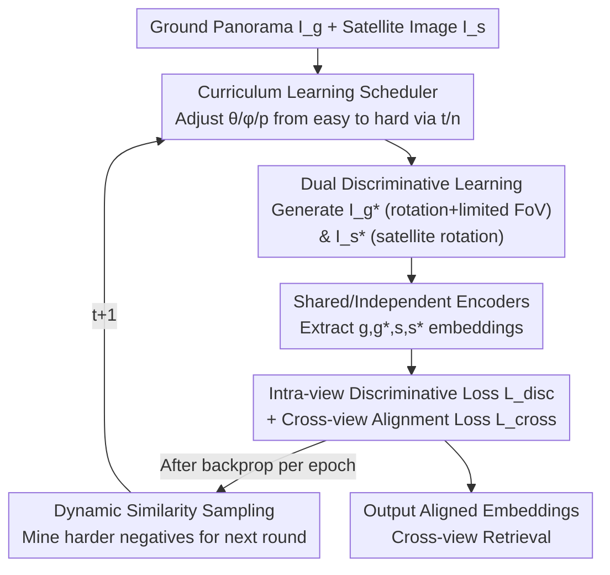

# SinGeo: Unlock Single Model's Potential for Robust Cross-View Geo-Localization

**Conference**: CVPR 2026  
**Paper**: [CVF Open Access](https://openaccess.thecvf.com/content/CVPR2026/html/Chen_SinGeo_Unlock_Single_Models_Potential_for_Robust_Cross-View_Geo-Localization_CVPR_2026_paper.html)  
**Code**: https://github.com/Yangchen-nudt/SinGeo  
**Area**: Remote Sensing / Cross-View Geo-Localization  
**Keywords**: Cross-View Geo-Localization, Robustness, Curriculum Learning, Contrastive Learning, Self-Supervised

## TL;DR
SinGeo utilizes "Dual Discriminative Learning + Curriculum Learning" to enable a **single model** to simultaneously adapt to cross-view geo-localization with arbitrary orientations and FoVs, eliminating the need to train separate models for different FoVs. It pushes R@1 past 70%/50% for extreme narrow fields (FoV=90°/70°) on CVUSA for the first time and provides plug-and-play robustness improvements for ViT/CNN/hybrid architectures.

## Background & Motivation

**Background**: The task of Cross-View Geo-Localization (CVGL) involves using a ground-view query image to retrieve matching matches from a GPS-tagged satellite image gallery to infer the shooting location, which is used for robot navigation, autonomous driving, and AR. The mainstream approach utilizes two encoders to extract feature embeddings for ground and satellite images, respectively, and aligns the cross-view similarity using contrastive losses (e.g., InfoNCE).

**Limitations of Prior Work**: In classic benchmarks (CVUSA, CVACT), ground-view images are **north-aligned panoramas**, where performance is already saturated. However, in real-world scenarios, images captured by mobile phones or vehicle cameras have **unknown orientations and limited FoV** (typically 70°–180°), causing existing methods to collapse. Current robust methods have drawbacks: one category relies on explicit view transformations (polar transforms, BEV projections) to reduce cross-view differences, which introduces image distortion and depends on preset parameters; another category relies on data augmentation by cropping samples with a **fixed FoV** from panoramas for training.

**Key Challenge**: The fixed FoV training paradigm creates a fundamental dilemma—**the model performs well only on the FoV used for training and significantly degrades on unseen FoVs**. Consequently, multiple models must be deployed to cover various FoVs. Some have attempted random FoV training (e.g., ConGeo and TransGeo tried 0°–360° randomly), but these often underperform compared to their own fixed FoV versions because this approach **implicitly assumes all FoVs have the same difficulty**, treating simple panoramas and extremely difficult narrow views equally. Furthermore, previous works generally **focus only on the ground branch**, neglecting the discriminative power of the satellite branch itself.

**Goal**: Enable a **single model** to maintain consistent high performance under varying orientations and FoVs without relying on any explicit transformations or additional modules.

**Key Insight**: The authors analogize the human process of geo-localization to a progressive learning process—when arriving at a new location, one first performs a 360° panoramic scan to localize, and as one becomes more familiar, a small field of view is sufficient to find the corresponding position on a map. This inspired a curriculum learning strategy that schedules difficulty from easy to hard. Additionally, the authors believe that **intra-view discriminative power** in narrow FoVs is key to extracting meaningful features, requiring simultaneous reinforcement of both ground and satellite branches.

**Core Idea**: Replace "training a single model for each FoV" with a "Dual Discriminative Learning architecture + Curriculum-guided progressive training," allowing a single backbone to adaptively perform robust localization across FoVs and orientations.

## Method

### Overall Architecture

The input to SinGeo is a pair consisting of a ground panorama $I_g$ and a satellite image $I_s$, and the output is aligned feature embeddings for retrieval. The entire pipeline revolves around two **module-free** designs, allowing it to be integrated into any CVGL backbone (ViT / CNN / CNN+Attention).

The first component is **Dual Discriminative Learning (DDL)**: on the ground branch, positive samples $I_g^*$ are generated by applying "random rotation + limited FoV" to the panorama; on the satellite branch, positive samples $I_s^*$ are generated by rotating the satellite image. This constructs intra-view self-supervised pairs $(I_g, I_g^*)$, $(I_s, I_s^*)$ along with cross-view pairs, forcing the model to learn discriminative regions for each branch before performing cross-view alignment. The second component is **Curriculum Learning (CL)**: difficulty-controlling augmentation parameters (FoV angle $\theta$, satellite rotation angle $\phi$, and probability $p$) are defined as scheduling functions that change monotonically with training progress $t/n$. This transitions training smoothly from "easy" (near panorama) to "hard" (narrow FoV, large rotation). After backpropagation updates the encoder each epoch, the updated encoder performs Dynamic Similarity Sampling to mine harder negative samples for the next round, forming a closed loop of "progressive difficulty + progressive negative samples."

### Key Designs

**1. Dual Discriminative Learning (DDL): Simultaneously reinforcing intra-view discriminative power for both branches**

Addressing the issue that "previous methods only optimize the ground branch, and pure cross-view alignment like InfoNCE easily takes shortcuts," SinGeo performs self-supervision on both branches. The ground branch uses transformations $T_g^1(\alpha, \theta)$ / $T_g^2(\alpha, \theta)$ to generate $I_g^*$: the CNN version randomly shifts the panorama horizontally by angle $\alpha$ and crops a view with FoV $\theta$; the ViT version further pads the cropped view back to the original panorama size with zeros. The satellite branch rotates $I_s$ to generate $I_s^*$, providing continuous rotations $T_s^1(\phi)$, $T_s^2(\phi)$ and discrete rotations $T_s^3(p)$ (rotating 90°/180°/270° clockwise with probability $p$), supplemented by color augmentations like brightness and saturation.

The discriminative loss performs intra-view contrastive learning for each branch: $L(g^*, G) = -\log \frac{\exp(g^*\cdot g^+/\tau)}{\sum_{g_i\in G}\exp(g^*\cdot g_i/\tau)}$, with the satellite loss $L(s^*, S)$ defined similarly. Together, $L_{disc}=L(g^*, G)+L(s^*, S)$. Here, $g^+$ is the unique positive match for $g^*$, and others in $G$ are negatives. The key is that the model is forced to focus on **genuinely important regions within each branch** (discriminative regions in satellite images) rather than just "where the ground and satellite images match," avoiding over-fitting bias towards a single branch. Cross-view alignment uses more diverse sample combinations:

$$L_{cross} = L(g, S) + \omega_1 L(g^*, S) + \omega_2 L(g, S^*) + \omega_3 L(g^*, S^*)$$

The total objective is $L_{total} = L_{cross} + \gamma L_{disc}$, where $\gamma$ balances discriminability and cross-view alignment.

**2. Curriculum Learning (CL) driven Progressive Training: Replacing the "all FoVs are equal" assumption with a difficulty scheduler**

Addressing the issue that "random FoV training implicitly assumes all FoVs have the same difficulty and underperforms fixed FoV," SinGeo defines augmentation parameters as functions of training progress, allowing the model to master foundations under easy, near-panoramic conditions before approaching difficult, narrow-FoV, and large-rotation conditions. Formally, for any difficulty parameter $\eta \in \{\theta, \phi, p\}$ (initial value $\eta_{init}$ for easy, final value $\eta_{final}$ for hard):

$$\eta(t) = \eta_{init} + (\eta_{final}-\eta_{init})\cdot f(t/n)$$

Where $f(\cdot)$ is a monotonically increasing scheduling function. In experiments, FoV decreases from $\theta_{init}=360°$ to $\theta_{final}=70°$ ($\eta_{init} > \eta_{final}$, so $\theta$ decreases), and discrete rotation probability $p$ increases from 25% to 100%. Three variants of $f$ correspond to different human learning rhythms: linear $f_1(x)=x$ (constant speed); fast-to-slow exponential $f_2(x)=\frac{1-\exp(-\lambda x)}{1-\exp(-\lambda)}$; and slow-to-fast exponential $f_3(x)=\frac{\exp(\lambda x)-1}{\exp(\lambda)-1}$ (linear $f_1$ is used for main results). Curriculum works because knowledge acquired at easier FoVs early on significantly facilitates learning for extreme FoVs later—explaining why SinGeo outperforms models specifically trained for extreme FoVs at 90°/70°. Each epoch also includes Dynamic Similarity Sampling, which uses the updated encoder to mine negatives based on visual similarity, synchronizing negative sample difficulty with the curriculum.

### Loss & Training
The main experiment uses ConvNeXt-B as the backbone, with weights $\omega_1=\omega_2=\omega_3=0.25$ and $\gamma=0.5$. InfoNCE uses label smoothing of 0.1. On the satellite side, discrete rotation $T_s^3(p)$ is used with the linear $f_1$ scheduler. Using Sample4Geo as the baseline, training lasts 80 epochs with a batch size of 16, using AdamW (initial LR 1e-4) and a cosine scheduler.

## Key Experimental Results

### Main Results: CVUSA / CVACT Single Model Comparison (Unknown Orientation + Limited FoV, R@1)

| Dataset | FoV | Sample4Geo | SinGeo | ConGeo (FoV-specific, grey ref) |
|--------|-----|-----------|--------|------------------------------|
| CVUSA | 360° | 93.3 | **96.8** | 96.6 |
| CVUSA | 180° | 84.6 | **91.8** | 92.3 |
| CVUSA | 90° | 55.1 | **70.1** | 55.5 |
| CVUSA | 70° | 40.9 | **58.0** | 49.1 |
| CVUSA | Avg. | 68.5 | **79.1** | 73.4 |
| CVACT | 90° | 27.9 | **42.6** | 40.6 |
| CVACT | 70° | 18.8 | **29.0** | 24.6 |

The single-model SinGeo sets new SOTAs in almost all scenarios and **pushes R@1 for FoV=90°/70° beyond 70%/50% for the first time on CVUSA**. It even outperforms ConGeo's multiple models trained for specific FoVs (except slightly at 180°). On the harder non-center-aligned VIGOR dataset (Same-Area, FoV=90°), R@1 improved from ConGeo's 8.5 to **24.0**. It also outperforms ConGeo/LPN in data-scarce, panorama-free scenarios like University-1652.

### Ablation Study: DDL Components + CL (CVUSA, R@1)

| $I_g^*$ | $I_s^*$ | CL | 360° | 180° | 90° | Note |
|:---:|:---:|:---:|------|------|-----|------|
| × | × | × | 93.3 | 84.6 | 55.1 | baseline |
| ✓ | × | × | 85.2 | **92.3** | 55.9 | Ground samples only: 180° gains, 360°/90° drop |
| ✓ | ✓ | × | 91.5 | 80.6 | 47.8 | Satellite samples but no CL: Limited FoV suffers |
| ✓ | × | ✓ | 96.2 | 92.1 | 66.9 | Adding CL: Overall recovery |
| ✓ | ✓ | ✓ | **96.8** | 91.8 | **70.1** | Full model, best 90° |

### Key Findings
- **CL is key to "realizing" dual-branch discriminability as robustness**: Using DDL alone ($I_g^*+I_s^*$ without CL) even results in performance drops under limited FoV (only 47.8 at 90°); only when combined with CL does performance surge under extreme FoVs (90° → 70.1), verifying the synergy between DDL and CL.
- **Cross-architecture plug-and-play**: Migrating SinGeo's strategy to Sample4Geo's ViT variant boosted 360° R@1 from 16.7 to **76.0**; migrating to GeoDTR improved 360° R@1 by over 47 points, both outperforming the plug-and-play ConGeo.
- **Consistency strongly correlates with robustness**: The authors define Orientation Consistency (OC) and FoV Consistency (FC) using normalized SSIM of Grad-CAM heatmaps. SinGeo leads in $OC_{grd}=0.81$, $OC_{sat}=0.92$, and $FC_{grd}=0.66$ (ConGeo $OC_{grd}$ is only 0.38), indicating SinGeo's attention regions are more stable under view changes.
- **No sacrifice in traditional scenarios**: SinGeo remains competitive (CVUSA R@1=97.3) in standard north-aligned settings, with the minor gap to Sample4Geo resulting from the latter's specialized sampling strategy.

## Highlights & Insights
- **"Single model replaces multiple models" paradigm shift**: Previously, multiple specialized models were needed to cover different FoVs; SinGeo uses one backbone for all, even outperforming specialized models on extreme FoVs—highly practical for real-world deployment (arbitrary FoVs in phones/vehicles).
- **First use of Curriculum Learning for robust CVGL**: Scheduling FoV/rotation difficulty as a monotonic function per epoch, synchronized with Dynamic Similarity Sampling, is a clean, transferable training paradigm rather than a module stack.
- **Insights on satellite branch self-supervision**: Rotating satellite images for self-supervision forces the model to focus on genuinely discriminative regions in satellite images rather than blindly matching "ground-satellite blocks." This "don't just focus on one branch" logic is transferable to other cross-domain retrieval tasks.
- **Consistency metrics (OC/FC) as explainable tools**: Quantifying "why it is more robust" through heatmap SSIM consistency provides an objective perspective for measuring robustness beyond just recall.

## Limitations & Future Work
- The authors acknowledge that SinGeo **requires panorama priors during training**; achieving similar performance on datasets without aligned panoramas (e.g., University-1652) remains a challenge.
- ⚠️ The ablation "adding $I_s^*$ without CL" harms limited FoV performance (90° dropped to 47.8), indicating DDL and CL are strongly coupled and DDL is not stable when used alone; both are indispensable.
- Detailed ablations of the three scheduling function variants, three satellite rotation variants, and various weights are placed in the supplementary materials; users should refer there for hyperparameter confirmation.
- Future work: Making curriculum difficulty scheduling adaptive (adjusting $\theta/p$ dynamically based on the current batch difficulty) instead of a preset $f(t/n)$, or exploring curriculum construction without panorama priors.

## Related Work & Insights
- **vs ConGeo (Plug-and-play alignment)**: ConGeo aligns embeddings of panoramas with their crops but only supports **fixed FoV** training, degrading when FoV changes; SinGeo uses a curriculum to cover all FoVs with one model and generally outperforms ConGeo as a plug-and-play enhancer.
- **vs Sample4Geo (Strong baseline)**: Sample4Geo uses a single CNN + InfoNCE + hard negative mining but does not specialize in robust CVGL; SinGeo uses it as a baseline, adopting its Dynamic Similarity Sampling and adding DDL+CL to lead significantly in limited FoV scenarios.
- **vs DSM / ArcGeo / GAL (Explicit transforms / Fixed FoV augmentation)**: These methods rely on polar transforms, BEV projections, or fixed FoV crops, which introduce distortion or are effective only for a single FoV; SinGeo wins through its training paradigm without explicit transforms or extra modules.

## Rating
- Novelty: ⭐⭐⭐⭐ First application of curriculum learning to robust CVGL, proposing dual-branch discrimination + OC/FC consistency metrics; novel combination.
- Experimental Thoroughness: ⭐⭐⭐⭐⭐ Four datasets, cross-architecture migration, consistency quantification, and complete ablations; solid verification.
- Writing Quality: ⭐⭐⭐⭐ Clear motivation and complete diagrams; some key hyperparameters and variant ablations are relegated to supplementary materials.
- Value: ⭐⭐⭐⭐⭐ "Single model covers all FoVs" directly addresses real-world deployment pain points and provides a plug-and-play enhancement for existing methods.

<!-- RELATED:START -->

## Related Papers

- [\[CVPR 2026\] RHO: Robust Holistic OSM-Based Metric Cross-View Geo-Localization](rho_robust_holistic_osm-based_metric_cross-view_geo-localization.md)
- [\[CVPR 2026\] GeoBridge: A Semantic-Anchored Multi-View Foundation Model Bridging Images and Text for Geo-Localization](geobridge_a_semantic-anchored_multi-view_foundation_model_bridging_images_and_te.md)
- [\[CVPR 2026\] Geo2: Geometry-Guided Cross-view Geo-Localization and Image Synthesis](geo2_geometry-guided_cross-view_geo-localization_and_image_synthesis.md)
- [\[ECCV 2024\] ConGeo: Robust Cross-View Geo-Localization Across Ground View Variations](../../ECCV2024/remote_sensing/congeo_robust_cross-view_geo-localization_across_ground_view_variations.md)
- [\[CVPR 2026\] UniGeoRS: A Unified Benchmark for Tri-view Geo-Localization](unigeors_a_unified_benchmark_for_tri-view_geo-localization.md)

<!-- RELATED:END -->
