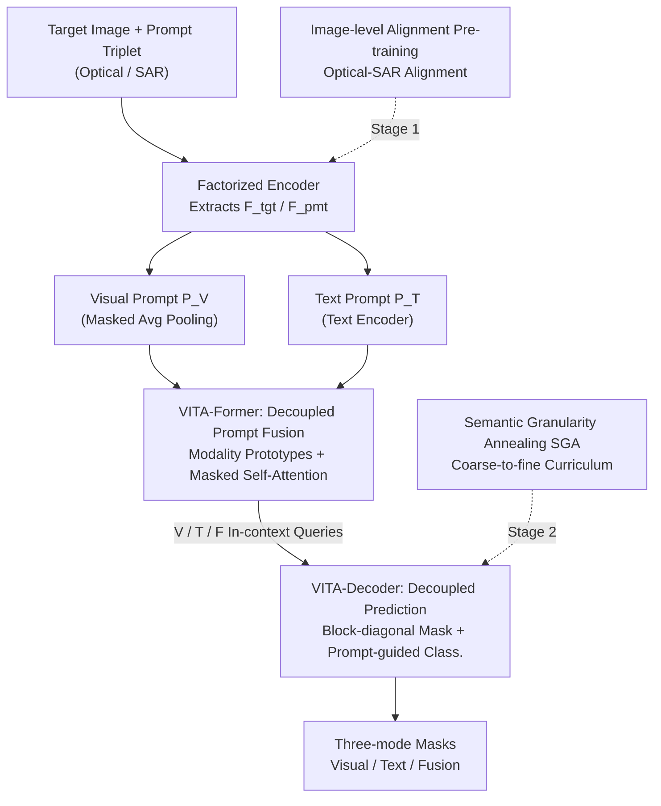

# SkySense-VITA: Towards Universal In-context Segmentation of Multi-modal Remote Sensing Imagery

**Conference**: CVPR 2026  
**Paper**: [CVF Open Access](https://openaccess.thecvf.com/content/CVPR2026/html/Wu_SkySense-VITA_Towards_Universal_In-context_Segmentation_of_Multi-modal_Remote_Sensing_Imagery_CVPR_2026_paper.html)  
**Code**: https://kang-wu.github.io/SkySense-VITA (Project Page)  
**Area**: Remote Sensing / Universal Segmentation  
**Keywords**: Remote Sensing Segmentation, In-context Segmentation, Multi-modal Prompting, Optical-SAR, Semantic Hierarchy

## TL;DR
SkySense-VITA utilizes a "prompt-and-prediction decoupling" architecture to unify visual prompts, text prompts, and their fusion into a single tuning-free in-context segmentation model. It natively supports both optical and SAR imagery while employing a coarse-to-fine semantic granularity annealing pre-training strategy, leading to an average mIoU improvement of over 10% across 18 remote sensing datasets.

## Background & Motivation

**Background**: Remote sensing semantic segmentation has long followed a "one model per task" paradigm—training dedicated models for each dataset/category, which relies on expensive large-scale annotations. Recently, two paths have emerged: Remote Sensing Foundation Models (RSFM) rely on self-supervised pre-training to learn general representations but still require downstream fine-tuning; universal segmentation models like SAM are tuning-free but rely on manual per-image interactions.

**Limitations of Prior Work**: The authors summarize the limitations of existing universal remote sensing segmentation methods into three points. **First, single modality support**—remote sensing is inherently multi-modal (optical provides texture details, while SAR offers all-weather, all-day capability), but current methods are almost exclusively designed for optical data and cannot process SAR. **Second, single prompt types**—pure visual prompts suffer from "task granularity ambiguity" (labeling a car: does it refer to that specific car, the car category, or the vehicle super-category?), while pure text prompts have "semantic ambiguity" (e.g., "plant" can mean vegetation or a factory) and cannot encode huge intra-class visual variances (e.g., houses look vastly different across continents). **Third, ignoring semantic hierarchy**—remote sensing categories are naturally hierarchical (car $\subset$ vehicle), yet existing methods treat categories as flat lists, forcing models to learn fine-grained classes from scratch, which loses coarse-grained contextual priors and exacerbates inter-class confusion.

**Key Challenge**: To enable a tuning-free model to accept both visual and text prompts, simple "early fusion" causes interference between prompt types, often performing worse than unimodal modes. Simultaneously supporting visual-only, text-only, and fused inference modes leads to branch competition within a shared decoder. In other words, there is a tension between **fusion** and **maintaining unimodal specificity**.

**Goal**: To create a unified in-context segmentation model that (1) supports both Optical and SAR, (2) flexibly supports visual, text, and fused prompts, and (3) leverages semantic hierarchies. Here, "in-context" refers to segmenting conditioned on external prompts (visual examples, text descriptors, or combinations) without task-specific fine-tuning.

**Key Insight**: Thoroughly decouple "prompt fusion" and "prediction generation." The fusion phase maintains independent paths for each modality, using a specialized fusion path to absorb cross-modal information. The decoding phase employs independent query branches for the three modes, isolated by block-diagonal masks to avoid mutual interference.

**Core Idea**: Using "prompt-and-prediction decoupling" as the framework, VITA-Former is employed for decoupled prompt fusion, VITA-Decoder for decoupled prediction, supplemented by optical-SAR alignment pre-training and a coarse-to-fine semantic granularity annealing curriculum.

## Method

### Overall Architecture

SkySense-VITA consists of two data streams: the **target flow** encodes the target image for segmentation and ultimately produces masks; the **prompt flow** encodes visual and/or text prompts to produce "in-context queries." The pipeline is divided into three stages: multi-modal feature extraction $\rightarrow$ VITA-Former multi-modal prompt fusion $\rightarrow$ VITA-Decoder prompt-guided decoupled decoding. The backbone follows the factorized encoder of SkySense and introduces learnable "modality prototypes" to bridge the optical-SAR gap. Training follows a progressive two-stage approach: image-level optical-SAR alignment first, followed by pixel-level in-context pre-training (with semantic granularity annealing). The model has 1.1B parameters, with 969M for the image encoder and 149M for the text encoder (CLIP), while VITA-Former + VITA-Decoder together total only 18M, making them very lightweight.

Given a target image $x_{tgt}$ and a prompt triplet $(x_{pmt}, v_{pmt}, t_{pmt})$ (prompt image, visual annotation, class name): the factorized encoder extracts $F_{tgt}$ and $F_{pmt}$. For the prompt side, masked average pooling generates visual prompt tokens $P_V$, and the text encoder generates text prompt tokens $P_T$ for class names.

### Key Designs

**1. VITA-Former: Decoupled Prompt Fusion—Absorbing cross-modal information without polluting unimodal branches**

Simply concatenating visual and text tokens for attention causes interference, leading to fusion modes being inferior to unimodal ones. VITA-Former solves this with carefully designed masked self-attention. First, learnable **modality prototypes** $P_M$ (one each for Optical/SAR, shared across layers and updated end-to-end) are injected into visual tokens via cross-attention to obtain domain-adapted $P'_V$. Then, $[P'_V, P_T, P_F]$ are concatenated (where fusion token $P_F$ is initialized by linear projection of $P_T$), using a **masked self-attention** to enforce: (i) isolation between $P'_V$ and $P_T$ to preserve unimodal specificity, and (ii) only $P_F$ can attend to both visual and text tokens to absorb cross-modal cues. Finally, cross-attention with target features $F_{tgt}$ produces three in-context queries $\{Q^k_{ctx}\}_{k\in\{V,T,F\}}$. This ensures the fusion branch gains complementary information without feeding noise back into unimodal branches.

**2. VITA-Decoder: Decoupled Prediction—Independent training for three modes within a single model**

Even with correct fusion, sharing a decoder among three modes causes conflict. VITA-Decoder follows a query-based (Mask2Former-style) design but replicates learnable segmentation queries into three sets $Q^V_{seg}, Q^T_{seg}, Q^F_{seg}$, each paired with its corresponding in-context query $Q^k_{ctx}$. All queries pass through a Query Embedding layer for modality/type encoding before entering the decoder stack. Crucially, **block-diagonal masked self-attention** strictly separates the three modes (reducing cross-branch interference) while performing cross-attention on $F_{tgt}$. Mask prediction follows Mask2Former: $M_k = \mathcal{F}_{mask}(Q'^k_{seg}, \phi(F_{tgt}))$. Classification abandons fixed classifiers for **prompt-guided classification**, using similarity between segmentation and in-context queries:

$$\mathcal{P}_k = \mathrm{softmax}\!\left(\mathrm{norm}(Q'^k_{seg})\,\mathrm{norm}(Q'^k_{ctx})^{\top}/\tau\right)$$

where $\mathrm{norm}(\cdot)$ is $\ell_2$ normalization and $\tau$ is temperature. The final output is a combination of $M_k$ and $\mathcal{P}_k$.

**3. Image-level Alignment Pre-training: Brining SAR into the Optical-Text space via indirect alignment**

The domain gap between SAR and optical images is the root cause of SAR learning difficulties. The first stage uses **indirect alignment**: freezing the optical encoder $E_{opt}$ and training only the SAR encoder $E_{SAR}$. For registered $(x_{opt}, x_{SAR})$, two SAR augmented views $x^a_{SAR}, x^b_{SAR}$ are created. Global average pooling yields $\{f_{opt}, f^a_{SAR}, f^b_{SAR}\}$, optimizing two targets—an intra-SAR contrastive loss $\mathcal{L}_{CL}(f^a_{SAR}, f^b_{SAR})$ to learn robust SAR features, and a cross-modal alignment loss $\mathcal{L}_{CMA}(f^a_{SAR}, f_{opt})$ to anchor SAR to the fixed optical space: $\mathcal{L}_{img} = \lambda_{CL}\mathcal{L}_{CL} + \lambda_{CMA}\mathcal{L}_{CMA}$.

**4. Semantic Granularity Annealing SGA: Coarse-to-fine hierarchical learning via smooth probability curriculum**

Remote sensing categories are naturally hierarchical (e.g., car $\subset$ vehicle). The authors build a semantic tree of depth $L$ for $C$ classes using Qwen3. SGA avoids hard stage switching (which causes catastrophic forgetting of coarse classes) by using a **smooth probability curriculum**. A continuous target granularity $\mu(t)\in[1,L]$ is defined, transitioning from 1 (coarse) to $L$ (fine) via a cosine schedule:

$$\gamma(t)=\frac{1-\cos(\pi\cdot\min(1,t/T))}{2},\quad \mu(t)=1+\gamma(t)(L-1)$$

At each step, a discrete granularity $l$ is sampled from a distribution $p(l\mid t)\propto\exp(-|l-\mu(t)|/\tau_{SGA})$ centered at $\mu(t)$. Pixels with leaf labels $c_i$ then predict their ancestor $c^{(l)}_i$ at level $l$.

### Loss & Training

Two-stage progressive pre-training: Stage 1 involves image-level alignment (80×A100), Stage 2 involves pixel-level in-context pre-training (8×A100, 10,000 steps on Sky-VT-300k, batch 64). The pixel-level loss for the three modes $k\in\{V,T,F\}$ is:

$$\mathcal{L}_{pixel}=\sum_{k\in\{V,T,F\}}\sum_{i=1}^{N_q}\big[\lambda_{cls}\mathcal{L}_{cls}(\mathcal{P}_k(i),c^{(l)}_{\hat\sigma(i)})+\lambda_{mask}\mathcal{L}_{mask}(M_k(i),a^{(l)}_{\hat\sigma(i)})\big]$$

The target at level $l$ is provided by SGA, and unmatched queries are supervised as "no-object." To support training, the authors constructed the **Sky-VT-300k** dataset: 300k+ samples, 176 classes, across 7 satellite platforms, containing both optical and SAR modalities with pixel-level masks and aligned text descriptors.

## Key Experimental Results

### Main Results

In-distribution mIoU (1-shot visual / zero-shot text settings):

| Dataset | SkySense++ (V) | SkySense-O (T) | VITA (V) | VITA (T) | VITA (V+T) |
| :--- | :--- | :--- | :--- | :--- | :--- |
| Potsdam | 62.70 | 23.42 | 71.34 | 81.53 | **81.94** |
| FBP | 41.62 | 8.09 | 47.04 | **58.87** | 57.26 |
| LoveDA | 47.25 | 34.61 | 56.11 | 60.54 | **62.08** |
| iSAID | 47.74 | 20.93 | 56.07 | 61.55 | 59.89 |
| ETCI-Flood (SAR) | — | — | 27.40 | 29.27 | **29.58** |

Out-of-distribution (Domain & Category Generalization):

| Dataset | Type | SkySense++ (V) | VITA (V) | VITA (T) | VITA (Fused) |
| :--- | :--- | :--- | :--- | :--- | :--- |
| GLH-Water | Domain | 74.28 | 82.02 | 86.09 | **86.85** |
| Vaihingen | Domain | 55.37 | 51.62 | 60.94 | **62.75** |
| FloodNet | Category | 54.92 | 53.19 | 57.52 | **62.19** |
| GLVM-Post | Category | 18.50 | 14.20 | 44.97 | **46.08** |

### Ablation Study

| Configuration | FloodNet V-only | T-only | Fused | Function |
| :--- | :--- | :--- | :--- | :--- |
| w/o VITA-Former (Naive Fusion) | 49.48 | 55.19 | 47.96 | Fusion is worst |
| w/ VITA-Former | 53.19 | 57.52 | **62.19** | All modes improve |
| w/o Decoupled (Fused only training) | 33.12 | 34.57 | 59.31 | Unimodal collapse |
| w/ Decoupled | 53.19 | 57.52 | 62.19 | Unimodal stays strong |

### Key Findings
- **Decoupled decoding is critical to prevent unimodal collapse**: Without decoupling, mIoU for unimodal inference drops by over 24%. With it, text-only inference on FloodNet remains strong at 57.52%.
- **Naive fusion often loses to unimodal modes**: Simple channel concatenation plus convolution performs worse than the best unimodal mode across multiple datasets.
- **Visual prompt quality matters**: The mIoU for V-only on iSAID increases from 23.97 to 56.07 as the prompt improves from Point(5) $\rightarrow$ Box $\rightarrow$ Mask.
- **SAR Alignment Works**: The image-level alignment provides a significant boost, yielding +2.76 mIoU on ETCI-Flood and +3.14 on C2S-SAR.

## Highlights & Insights
- **"Decoupling" across fusion and decoding**: Masked isolation on the prompt side preserves unimodal specificity while a dedicated fusion path absorbs cross-modal data. The block-diagonal mask in the decoder prevents branch interference.
- **Modality prototypes as learnable "Translation Plugs"**: Only two layer-shared modality tokens and cross-attention are needed to pull SAR into the optical space.
- **SGA as a continuous probability schedule**: Using a cosine $\mu(t)$ and soft sampling avoids catastrophic forgetting during hierarchical training, proving more stable than discrete curricula.
- **Extremely lightweight task head**: VITA-Former + Decoder occupy only 1.6% of the 1.1B parameters, showing that logic can be kept thin if pre-training is powerful.

## Limitations & Future Work
- Visual prompt quality for small object classes is low in 1-shot scenarios, where fusion occasionally underperforms text-only prompts (can be mitigated by increasing visual examples).
- Intra-image visual-only performance still lags behind SAM, as VITA focuses on inter-image in-context flexibility rather than single-image fine-grained interactive refinement.
- SGA relies on Qwen3-built semantic trees; tree quality or hierarchical partitioning directly impacts curriculum effectiveness.
- The 1.1B parameters and two-stage pre-training (Stage 1 with 80×A100) indicate a high resource barrier for reproduction.

## Related Work & Insights
- **vs SkySense++**: Both are for remote sensing in-context, but SkySense++ only supports visual prompts and lacks SAR support. Ours achieves a 18%+ average lead.
- **vs SkySense-O / SegEarth-OV**: These are text-only (Open-Vocabulary), missing visual context for intra-class variance. Ours supplements this with visual-text synergy.
- **vs SAM/SAM2**: SAM is optimized for intra-image interactive segmentation, while Ours targets inter-image tuning-free in-context segmentation with native SAR and text support.

## Rating
- Novelty: ⭐⭐⭐⭐⭐ Decoupled fusion/prediction and multi-modal unification is a top-tier design for universal remote sensing models.
- Experimental Thoroughness: ⭐⭐⭐⭐⭐ Comprehensive coverage across 18 datasets and detailed ablation of all components.
- Writing Quality: ⭐⭐⭐⭐ Clear mapping between pain points and design solutions.
- Value: ⭐⭐⭐⭐⭐ Highly meaningful for practical remote sensing deployment given its tuning-free and SAR-native capabilities.

<!-- RELATED:START -->

## Related Papers

- [\[CVPR 2026\] SegEarth-R2: Towards Comprehensive Language-guided Segmentation for Remote Sensing Images](segearth-r2_towards_comprehensive_language-guided_segmentation_for_remote_sensin.md)
- [\[CVPR 2026\] HySeg: Learning Generative Priors for Structure-Aware Remote Sensing Segmentation](hyseg_learning_generative_priors_for_structure-aware_remote_sensing_segmentation.md)
- [\[ICCV 2025\] SkySense V2: A Unified Foundation Model for Multi-Modal Remote Sensing](../../ICCV2025/remote_sensing/skysense_v2_a_unified_foundation_model_for_multi-modal_remote_sensing.md)
- [\[CVPR 2026\] ReAttnCLIP: Training-Free Open-Vocabulary Remote Sensing Image Segmentation via Re-defined Attention in CLIP](reattnclip_training-free_open-vocabulary_remote_sensing_image_segmentation_via_r.md)
- [\[CVPR 2026\] CrossEarth-Gate: Fisher-Guided Adaptive Tuning Engine for Efficient Adaptation of Cross-Domain Remote Sensing Semantic Segmentation](crossearth-gate_fisher-guided_adaptive_tuning_engine_for_efficient_adaptation_of.md)

<!-- RELATED:END -->
