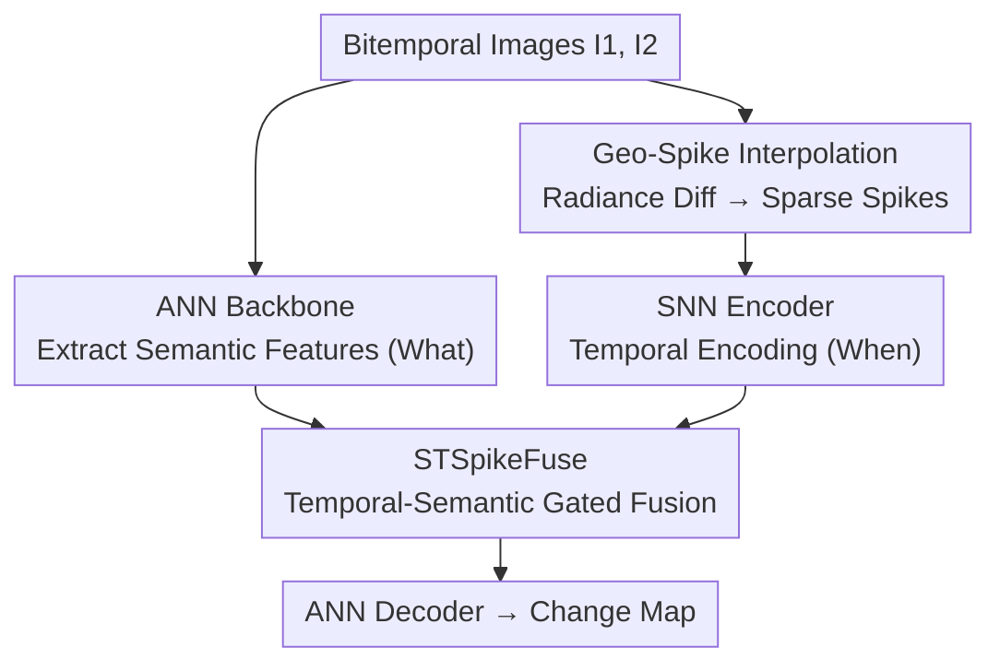

# Sparsely Timing the Change: A Spiking Temporal Framework for Remote Sensing Interpretation

**Conference**: CVPR 2026  
**Paper**: [CVF Open Access](https://openaccess.thecvf.com/content/CVPR2026/html/Li_Sparsely_Timing_the_Change_A_Spiking_Temporal_Framework_for_Remote_CVPR_2026_paper.html)  
**Code**: None  
**Area**: Remote Sensing Change Detection  
**Keywords**: Change Detection, Spiking Neural Networks, Time-to-First-Spike, Bitemporal, Spatiotemporal Fusion

## TL;DR
Addressing the pain point in remote sensing change detection where "only two temporal images are available, making it difficult to model sparse temporal evolution," this paper proposes SpikeAdapter. It utilizes a brain-inspired "Time-to-First-Spike" mechanism to encode bitemporal radiation differences into sparse spike sequences (GSI-P). It then uses a Spiking Neural Network (SNN) to extract temporal cues and STSpikeFuse to adaptively fuse them with semantic features from an ANN backbone. On LEVIR-CD, CLCD, and SYSU-CD, it outperforms CNN, Transformer, Mamba, and pseudo-video methods in F1/IoU metrics.

## Background & Motivation

**Background**: Remote sensing change detection characterizes the dynamic changes of ground objects between different temporal phases at the same location, serving as a fundamental task for urban planning, ecological monitoring, and disaster assessment. The mainstream approach follows a Siamese dual-branch architecture, extracting features from two images separately and performing feature differencing to locate changed areas. Later, Transformers (ChangeFormer, BIT) and State Space Models (ChangeMamba, CDMamba) were introduced to enhance global spatial modeling.

**Limitations of Prior Work**: In reality, a location often has **only two temporal images**, making temporal information extremely sparse. Three existing approaches have their respective issues: (1) Siamese differencing is essentially "static subtraction," failing to explicitly model the temporal order and structural relationships of changes; (2) Sequential models (LSTM, Mamba) excel at long sequences but degenerate into extracting instantaneous differences when given only two frames, failing to construct meaningful sparse temporal cues; (3) Pseudo-video interpolation methods (P2V-CD, Change3D) attempt to reconstruct continuous change processes, but in high-resolution remote sensing images, changes usually occur in **small local patches**. Dense interpolation introduces redundant and physically inconsistent "fake changes" in many unchanged pixels, losing sparsity and increasing computational cost.

**Key Challenge**: Under bitemporal constraints, a trade-off exists between **the lack of temporal information** and **redundancy brought by dense interpolation**—too little supplementation lacks temporal cues, while too much is overwhelmed by unchanged pixels.

**Key Insight**: The authors draw inspiration from the brain's sensory response to stimuli—giving a fast excitatory response to newly appeared information and a delayed inhibitory response to receding signals. This is naturally "sparse + temporal": only areas where real changes occur "fire" at a specific moment, and more drastic changes lead to earlier firing.

**Core Idea**: Use "Time-to-First-Spike" (TfS) to map radiation differences to discharge delays, constructing sparse and interpretable pseudo-temporal spike sequences. Then, use SNN to extract "when it changed" and ANN to extract "what changed," fusing them after decoupled coordination—replacing dense interpolation with sparse spike encoding to recover the missing temporal dimension.

## Method

### Overall Architecture
SpikeAdapter is a lightweight enhancement framework built upon a conventional ANN backbone (ViT-SAM Large + LoRA). Inputs are bitemporal images $I_1, I_2$ of the same location, and the output is a binary change map. The process consists of four steps: ① The ANN backbone extracts strong semantic features ("what changed"); ② **GSI-P** converts bitemporal radiation differences into a sparse spike sequence $E' \in \{0,1\}^{B \times T \times 2C \times H \times W}$ with Time-to-First-Spike characteristics; ③ An SNN encoder encodes these spikes along the temporal axis to capture "when it changed" cues; ④ **STSpikeFuse** adaptively fuses SNN temporal features into ANN semantic features, followed by an ANN decoder to output the change map. The core components are GSI-P (generating spikes) and STSpikeFuse (fusing spikes).

### Key Designs

**1. Geo-Spike Interpolation (GSI-P): Encoding Radiation Differences into Sparse "Time-to-First-Spike" Sequences**

As the core of the framework, this addresses how to create sparse and structured temporal cues under bitemporal constraints. GSI-P is a differentiable mapping $E' = F_{\text{GSIP}}(I_1, I_2)$, following a physical intuition: **pixels that change faster fire earlier, while slower changes fire later**, and unchanged pixels do not fire at all. It involves five steps:

- **Step 1 Radiation Difference Calculation**: Take the per-channel absolute difference $M = |I_2 - I_1|$, then normalize it to $\tilde{M} = M / (\max_{x,y} M + \epsilon)$ for numerical stability.
- **Step 2 Geo-Consistency Modulation**: Directly mapping $\tilde{M}$ to delay assumes all objects change at the same rate, but vegetation/water change gradually while urban construction/bare soil change abruptly. The authors introduce a geographical response map $G(x,y) = \tanh(\lambda_s S(x,y) + \lambda_g C(x,y))$, where $S$ is the spectral index difference (reflecting spectral material changes) and $C$ is gradient direction similarity (reflecting structural consistency). An exponential term modulates delay: $\hat{M}(x,y,c) = \tilde{M}(x,y,c) \cdot e^{-\alpha G(x,y)}$—higher geo-consistency $G$ leads to lower response delay, prioritizing the firing of structurally significant changes and suppressing noise.
- **Step 3 Local Temporal Correction**: Geo-modulation cannot handle local "fake changes" caused by lighting/viewpoint. A lightweight learnable correction network $\tilde{M}'= \hat{M}\cdot\sigma(f_\theta(I_1,I_2)) + \tanh(g_\theta(I_1,I_2))$ generates scale/bias factors via convolutions to inhibit false positives.
- **Step 4 Delay Mapping and Polarity Modeling**: Map corrected differences linearly to delay $\tau(x,y,c) = \text{round}\big((1-\tilde{M}')(T-1)\big)$, where each pixel triggers an event at $t=\tau$. **Positive and negative polarities** distinguish enhancement and attenuation: $E^{\text{on}}$ captures $D>0$ (appearance), while $E^{\text{off}}$ captures $D<0$ (disappearance), combined with temporal alignment $\mathbb{1}\{t=\tau\}$ and significance $\mathbb{1}_{\text{pres}}$ to form $E = \text{concat}(E^{\text{on}}, E^{\text{off}})$.
- **Step 5 Temporal Smoothing and Sparsification**: Discrete triggers create isolated spikes, breaking temporal continuity. A triangular smoothing kernel $w_\delta \propto (k-|\delta|+1)$ is convolved along the time axis. The kernel width $k$ adaptively adjusts based on global statistics of $G$ (wider for continuity in dynamic areas, narrower for sparsity in static areas). Finally, threshold binarization $E' = \mathbb{1}\{E'_t > \varepsilon\}$ suppresses weak responses to maintain sparsity.

The fundamental difference from dense interpolation: Dense interpolation fills every time gap with frames, processing unchanged pixels repeatedly; GSI-P lets real changes fire only at the "right moment," being naturally sparse, interpretable, and encoding geographical priors into the delay.

**2. STSpikeFuse: Decoupled SNN ↔ ANN Spatiotemporal Fusion**

Spike signals from GSI-P exist in the "spike domain," differing from the semantic representation of the ANN backbone. Without coordination, temporal cues would degenerate into static statistics during propagation. STSpikeFuse maps temporal spike features into the semantic space for cross-modal fusion in two stages:

The first stage is **Temporal Extraction**, with two parallel paths: **Soft-TfS** (Softened Time-to-First-Spike) uses softargmin over the time axis $t_{\text{soft}}(x,y) = \sum_t t \cdot \text{softmax}(-M_t/\tau_{\text{temp}})$ (temperature $\tau_{\text{temp}}=0.1$) to differentiably approximate "the first discharge time," answering "when it changed." Unchanged locations are assigned $T$ for distinction. **TIMR** (Temporal Integration Membrane Representation) assigns a learnable decay rate $\delta_c=\sigma(\theta_c)\in(0,1)$ to each spike channel, performing normalized exponential weighting $\alpha_{t,c}=\delta_c^t / (\sum_u \delta_c^u + \varepsilon)$, and then $\text{TIMR}(x,y,c)=\sum_t \alpha_{t,c} s_t(x,y,c)$ to characterize "how long the change lasted"—larger $\alpha$ focuses on long-term stable evolution, while smaller $\alpha$ is sensitive to short-term abrupt changes.

The second stage is **Spatiotemporal Alignment Fusion**: $t_{\text{soft}}$ first inversely modulates backbone features $x' = x \odot (1 - \text{norm}(t_{\text{soft}}))$, making positions that fire earlier (faster change) have stronger responses. Then, $x'$ generates the query $Q$, and TIMR serves as key/value, with a temporal bias added to the attention: $\text{Attn} = \text{softmax}(QK^\top/\sqrt{d} + \beta e^{-\gamma t_{\text{soft}}})\cdot V$. Finally, a lightweight convolutional gate $g=\sigma(\text{Conv}([x;\text{Attn}]))$ and $\hat{x}=g\cdot x + (1-g)\cdot \text{Attn}$ adaptively balance semantic stability and temporal sensitivity. This decoupled coordination, where "SNN handles when, ANN handles what, and the gate injects as needed," is more robust than simple Add (collapsing temporal cues) or Concat (lacking dynamic significance guidance).

**3. Design Philosophy of SNN/ANN Dual-Path Decoupled Coordination**

Viewing the framework as a whole, the true innovation is the paradigm of "decoupling time and semantics, managing them separately, then fusing": the SNN branch is event-driven and sparse, specifically carrying temporal significance (when), while the ANN backbone uses dense activations to carry high-level semantic discrimination (what). GSI-P "translates" physical radiation differences into spike language for SNN while injecting geographical priors, and STSpikeFuse "translates" the results back into semantic space. Compared to Siamese static differencing or dense pseudo-videos, this route recovers the missing temporal dimension using extremely sparse spikes, where every step (delay, polarity, decay) has an interpretable physical counterpart.

## Key Experimental Results

### Main Results
Three datasets: LEVIR-CD (building change), CLCD (farmland change), SYSU-CD (complex multi-class change). Backbone: ViT-SAM Large + LoRA, single RTX 4090, AdamW, 100 epochs with cosine annealing.

| Dataset | Metric | SpikeAdapter | Prev. SOTA | Description |
|--------|------|--------------|----------|------|
| LEVIR-CD | F1 / IoU | **93.08 / 87.05** | 92.06 / 85.29 (DWTCD-Net, Video) | Outperforms Video/Mamba/Transformer categories |
| CLCD | F1 / IoU | **82.96 / 70.88** | 78.03 / 63.97 (Change3D, Video) | Significant lead of ~+4.9 F1 |
| SYSU-CD | F1 / IoU | **84.11 / 72.58** | 82.66 / 70.44 (CD-Lamba, Mamba) | Best even in complex scenes |

Cross-paradigm comparison shows: CNNs (FC-Siam-Di, SNUNet) perform average due to limited receptive fields; Transformers (ChangeFormer, TTP) improve via global modeling; Mamba and pseudo-video methods further enhance temporal modeling; however, SpikeAdapter achieves top F1/IoU results across all three datasets, with the most notable lead in CLCD where changes are sparse and land types diverse.

### Ablation Study
Four sets of ablations on LEVIR-CD (256 resolution):

| Ablation Dimension | Configuration | F1 (%) | IoU (%) | Conclusion |
|----------|------|-------|--------|------|
| Delay Mapping | Inverse | 92.84 | 86.63 | Over-aggregation in early stages |
| | Learned-MLP | 92.88 | 86.71 | Unstable multi-modal distribution |
| | **Linear** | **93.08** | **87.05** | Smooth unimodal, most consistent temporal progress |
| Smoothing Kernel | No / Mean / Gaussian | 92.65–92.85 | 86.31–86.66 | Poorer noise/boundary handling |
| | **Triangular** | **93.08** | **87.05** | Sharpest temporal boundaries |
| STSpikeFuse Strategy | Baseline (TTP) | 92.10 | 85.60 | No spikes |
| | +GSI-P (Add) | 92.40 | 85.87 | Temporal collapse |
| | +GSI-P (Concat) | 92.87 | 86.69 | Lacks dynamic guidance |
| | **+GSI-P (STSpikeFuse)** | **93.08** | **87.05** | F1/IoU +0.21 / +0.7 |

### Key Findings
- **Delay mapping form is critical**: Analysis of $\tau$ distribution shows the inverse form clusters delays in early steps, and MLP produces unstable multi-modal peaks. Only linear mapping $\tau=(1-\tilde{M}')(T-1)$ provides a smooth unimodal distribution and consistent temporal progression—simplicity best fits the "faster change → earlier firing" intuition.
- **Fusion strategy determines the preservation of temporal cues**: Direct Add causes temporal information to collapse (only +0.3 F1), while Concat lacks dynamic significance guidance. STSpikeFuse using Soft-TfS + temporal decay for cross-domain alignment is essential to realize the value of GSI-P.
- **Gated fusion outperforms direct output**: In another fusion ablation, Direct Output dropped the F1 to 75.67%, whereas learnable gating achieves the best trade-off between spatial stability and temporal sensitivity.

## Highlights & Insights
- **Using SNN "Time-to-First-Spike" to supplement the temporal dimension**: Directly mapping the neuroscience concept of "fast excitatory for new stimuli, slow inhibitory for old stimuli" to "fast changes fire early, slow changes fire late" is both sparse and interpretable, cleverly avoiding the redundancy of dense pseudo-videos.
- **Polarity modeling distinguishes "Appearance vs. Disappearance"**: Explicitly encoding change direction with $E^{\text{on}}/E^{\text{off}}$ provides information lost in ordinary difference maps, particularly useful for tasks like "new construction vs. demolition."
- **Decoupled "when / what" is transferable**: The paradigm where SNN handles temporal significance, ANN handles semantics, and gating injects as needed can be generalized to any scene requiring temporal cues with few frames (e.g., medical follow-up images, low-frame-rate monitoring).
- **Lightweight deployment**: As an adapter attached to a frozen ViT-SAM backbone + LoRA, SpikeAdapter is easy to reuse with existing strong backbones in engineering practice.

## Limitations & Future Work
- **Limited to bitemporal binary change detection**: The method is designed around "two images." Its superiority over mature sequential models in multi-temporal sequences (>2 frames) has not been verified. It also only produces binary maps, not semantic change detection (what class it became).
- **Backbone dependency**: The use of a large ViT-SAM backbone + SAM pre-training makes it difficult to fully isolate how much improvement comes from spike encoding versus the backbone (though the TTP same-backbone baseline addresses this to some extent on LEVIR).
- **Details in Appendix**: Multiple formulas and hyperparameter details (polarity modeling, SNN encoder structure, impact of $T$) are relegated to supplementary materials, limiting immediate reproducibility. ⚠️ Precise definitions of certain formulas (like polarity $\mathbb{1}_{\text{pres}}$) should follow the original paper/appendix.
- **Sensitivity of Geograhpical Response Map**: The spectral/gradient priors might be sensitive to sensors and bands, potentially requiring re-tuning of $\lambda_s, \lambda_g, \alpha$ across datasets.

## Related Work & Insights
- **vs. Siamese Differencing (FC-Siam-Di / SNUNet)**: While they perform static feature differencing, Ours uses spike sequences to explicitly model temporal order and direction, shifting from "what is the difference" to "when and how fast did it change," leading significantly across all datasets.
- **vs. Sequential Models (ChangeMamba / CDMamba)**: Mamba types excel at long sequence accumulation but degenerate in bitemporal cases; Ours "constructs" sparse temporal cues via TfS encoding rather than relying on sequence length, leading by over 10 points in F1 on CLCD.
- **vs. Pseudo-video Interpolation (P2V-CD / Change3D)**: They supplement time via dense interpolation, which introduces redundant fake changes in local high-res areas. GSI-P fires only at real changes, ensuring sparsity and physical consistency, resulting in better F1/IoU.

## Rating
- Novelty: ⭐⭐⭐⭐⭐ First use of SNN TfS + Polarity + Geo-modulation for RS change detection.
- Experimental Thoroughness: ⭐⭐⭐⭐ Solid results over three datasets and four ablations, though key analysis is in the appendix and backbone contribution is not fully decoupled.
- Writing Quality: ⭐⭐⭐⭐ Clear motivation and methodology; dense formulas but logic is sound.
- Value: ⭐⭐⭐⭐ Provides an interpretable, lightweight new approach for "supplementing temporal cues with few frames," with good transferability.

<!-- RELATED:START -->

## Related Papers

- [\[CVPR 2026\] RECS4R: Bridging Semantics and Geometry for Referring Remote Sensing Interpretation](recs4r_bridging_semantics_and_geometry_for_referring_remote_sensing_interpretati.md)
- [\[CVPR 2026\] Remote Sensing Image Super-Resolution for Imbalanced Textures: A Texture-Aware Diffusion Framework](remote_sensing_image_super-resolution_for_imbalanced_textures_a_texture-aware_di.md)
- [\[CVPR 2026\] ChangeBridge: Spatiotemporal Image Generation with Multimodal Controls for Remote Sensing](changebridge_spatiotemporal_image_generation_with_multimodal_controls_for_remote.md)
- [\[CVPR 2026\] UniChange: Unifying Change Detection with Multimodal Large Language Model](unichange_unifying_change_detection_with_multimodal_large_language_model.md)
- [\[CVPR 2026\] GeoCoT: Towards Reliable Remote Sensing Reasoning with Manifold Perspective](geocot_towards_reliable_remote_sensing_reasoning_with_manifold_perspective.md)

<!-- RELATED:END -->
