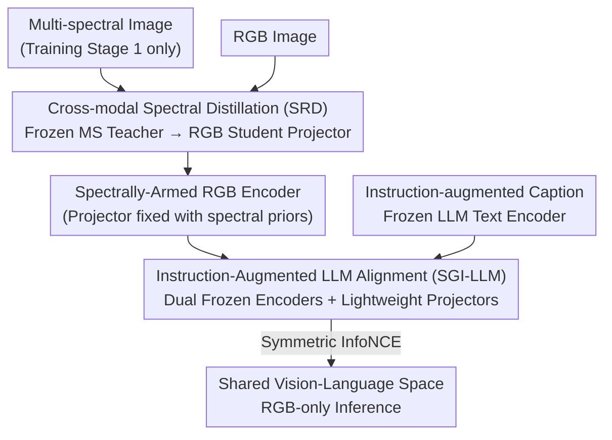

# Spectrally Distilled Representations Aligned with Instruction-Augmented LLMs for Satellite Imagery

**Conference**: CVPR 2026  
**Paper**: [CVF Open Access](https://openaccess.thecvf.com/content/CVPR2026/html/Kha_Spectrally_Distilled_Representations_Aligned_with_Instruction_Augmented_LLMs_for_Satellite_Imagery_CVPR_2026_paper.html)  
**Code**: https://ikhado.github.io/sattxt/ (Project Page)  
**Area**: Remote Sensing / Vision-Language Foundation Models  
**Keywords**: Satellite Imagery, Spectral Distillation, Vision-Language Alignment, Instruction-Augmented LLM, RGB Inference

## TL;DR
SATtxt employs a two-stage training process—"Spectral Representation Distillation + Instruction-Augmented LLM Alignment"—to inject multi-spectral (MS) priors into an **RGB-only** vision encoder and align it with frozen LLM text embeddings. By training only lightweight projectors, it outperforms multi-spectral SOTA models across zero-shot classification, retrieval, open-vocabulary segmentation, and linear probing tasks.

## Background & Motivation
**Background**: Vision-Language Foundation Models (VLFMs, e.g., CLIP, SigLIP, DINOtxt) leverage large-scale contrastive learning to align images and text. This is particularly useful in Earth Observation (EO) where satellite imagery labels are scarce and require domain expertise; zero-shot classification/retrieval via text prompts is a near-essential capability. Existing remote sensing models include RemoteCLIP, GeoRSCLIP, SkyCLIP, and MS-supporting models like Llama3-MS-CLIP and DOFA-CLIP.

**Limitations of Prior Work**: Two specific issues hinder deployment. First, while satellite imagery is naturally multi-spectral, current models **fail to utilize these bands effectively**. Additional bands introduce complementary info but also redundancy and inter-band misalignment. Empirical evidence shows diminishing or unstable returns as bands increase (e.g., Llama3-MS-CLIP performance degrades beyond 10 bands). Furthermore, atmospheric conditions or sensor degradation often lead to incomplete spectral stacks, making RGB-only inference more desirable for operational systems. Second, VLFMs remain bottlenecked by the **expressive power of CLIP-style text encoders**. Whether through dual-encoder pre-training, frozen text encoders (DOFA-CLIP), or frozen vision backbones (LiT design in DINOv3txt), the text side limits fine-grained cross-modal alignment.

**Key Challenge**: Incorporating spectral priors (for discriminative power) typically requires MS inputs at inference (costly and prone to missing bands); achieving strong semantic alignment requires stronger text encoders, but traditional CLIP text towers have a 77-token budget and shallow semantics that cannot handle long descriptions in satellite captions. Both needs are restricted by "input modality" and "text tower capacity."

**Goal**: To create a satellite VLFM that uses only RGB at inference but **retains spectral knowledge**, while possessing high semantic expressivity on the text side.

**Key Insight**: Spectral knowledge does not need to be repeatedly fed via MS inputs during inference; it can be **distilled once** during training into the RGB encoder. The text bottleneck can be overcome using instruction-augmented LLMs (proven to be powerful text encoders), which can be frozen and pre-cached to minimize training costs.

**Core Idea**: Use "frozen MS teacher → RGB student" cross-modal distillation to inject spectral priors into the RGB space, then replace the CLIP text tower with a "frozen instruction-augmented LLM." By training only lightweight projectors, the model achieves RGB-only inference with rich semantic alignment.

## Method

### Overall Architecture
SATtxt is a two-stage pre-training pipeline. Both stages follow the principle: **freeze the large encoders at both ends and only train the lightweight projectors in between**. The first stage, SRD (Spectral Representation Distillation), trains a vision projector to **reconstruct** the output distribution of a multi-spectral teacher from RGB features. MS inputs are used only in this stage. The second stage, SGI-LLM (Spectrally Grounded Alignment with Instruction-Augmented LLMs), freezes the spectrally-armed RGB encoder and an instruction-augmented LLM text encoder. It trains two projectors using a symmetric contrastive loss to pull visual descriptors and LLM sentence vectors into a shared space. At inference, text label embeddings can be pre-cached, leaving only one RGB forward pass and a projector.

### Key Designs

**1. Cross-modal Spectral Distillation (SRD): One-time injection of spectral priors into an RGB-only encoder**

To address the high cost and instability of MS inputs at inference, SRD treats spectral knowledge as a **distillable one-time asset**. It uses a frozen pre-trained MS encoder $E_{ms}$ (SpectralGPT) as a teacher and a frozen pre-trained RGB encoder $E_{rgb}$ (DINOv3 ViT-L trained on satellite data) as the student backbone. Only a lightweight vision projector $G_v$ and a temporary linear head $W_{ms}$ are trainable. For an MS image, two sets of views are constructed: full-resolution global views for MS, and multi-crop (local + global) for RGB. The three representations are defined as:

$$z^{rgb}_v = E_{rgb}(\tilde x^{(v)}_{rgb}),\quad z^{ms}_u = \mathrm{Pool}(E_{ms}(\tilde x^{(u)}_{ms})),\quad \hat z^{ms}_v = W_{ms}(G_v(z^{rgb}_v))$$

The projector maps RGB features **back to the MS teacher's representation space**. Training follows DINO-style centering and temperature sharpening, but crucially, the teacher remains **fixed** (unlike DINO's EMA update). This provides a stable spectral reference and prevents RGB features from drifting when capturing information beyond their spectral range. Specifically, given EMA center $\mu$ and temperatures $\tau_t < \tau_s$:

$$q_u = \mathrm{softmax}\!\left(\frac{z^{ms}_u-\mu}{\tau_t}\right),\quad p_v = \mathrm{softmax}\!\left(\frac{\hat z^{ms}_v}{\tau_s}\right)$$

The loss minimizes $L_{SRD}=\frac{1}{|V_{rgb}||V_{ms}|}\sum_{v}\sum_{u}(-q_u^\top \log p_v)$. This design is effective because the fixed teacher provides a stable target, frozen backbones focus capacity on cross-modal mapping, and the asymmetric cropping increases RGB view diversity while maintaining spectral consistency. After distillation, $G_v$ is used as the initialization for stage two.

**2. Instruction-Augmented LLM Alignment (SGI-LLM): Replacing CLIP text towers with frozen LLMs**

To overcome the shallow semantics and token limits of CLIP, the text side is replaced with a **frozen instruction-augmented LLM** (Llama-3.1-8B initialized via LLM2Vec). Mirroring the "frozen encoders + trained projectors" philosophy, both ends are frozen. For an RGB image $x_{rgb}$ and a "caption $C$ + instruction $I$" prompt, the vision side generates $H_v = G_v(E_{rgb}(x_{rgb}))\in\mathbb{R}^{(1+n)\times d_v}$. Using DINOtxt style, the class token and mean patch tokens are concatenated:

$$z_v = [\,H^{\langle cls\rangle}_v;\ \mathrm{mean}(H^{patch}_v)\,]\in\mathbb{R}^{2d_v}$$

The text side encodes the instruction-augmented prompt using the frozen LLM, followed by mean pooling to get sentence vector $\tilde z_t = \mathrm{mean}(H_t)$. A linear projector $G_t$ maps it to the shared space $z_t = G_t(\tilde z_t)\in\mathbb{R}^{2d_v}$. Benefits include: (1) $H_t$ can be **pre-calculated and cached** per prompt; (2) support for long instructions beyond CLIP’s 77-token limit, enabling richer semantics and task-aware signals. This results in sharper responses for categories like "river" or "residential" in similarity maps.

**3. Symmetric InfoNCE Alignment: Bi-directional cross-modal consistency**

In the shared space, $z_v$ and $z_t$ are aligned using symmetric InfoNCE. Given cosine similarity $s(\cdot,\cdot)$ and temperature $\tau$:

$$L_{v\to t}=-\frac{1}{|B|}\sum_{i\in B}\log\frac{\exp(s(z_{v,i},z_{t,i})/\tau)}{\sum_{j\in B}\exp(s(z_{v,i},z_{t,j})/\tau)},\quad L_{t\to v}\ \text{is symmetric}$$

The final objective is $L_{SGI\text{-}LLM}=\tfrac12(L_{v\to t}+L_{t\to v})$. Bi-directional alignment ensures performance for both zero-shot classification (text-to-image) and caption retrieval (image-to-text). This stage grounds the spectral priors into a rich semantic text space.

### Loss & Training
The two stages are trained independently with $L_{SRD}$ and $L_{SGI\text{-}LLM}$. The dataset is SSL4EO-S12 (~1M Sentinel-2 scenes). Captions are from the public Llama3-SSL4EO-S12 v1.1. The vision projector utilizes 2 transformer blocks, while the text projector is linear. Training on 8×H200 GPUs takes ~4 hours for Stage 1 and ~3 hours for Stage 2, totalling **~7 hours**. Frozen backbones and cached LLM embeddings make pre-training highly efficient.

## Key Experimental Results

### Main Results
Evaluation on EuroSAT, BigEarthNet, and ForestNet benchmarks for zero-shot classification and retrieval (Accuracy / mAP@100):

| Model | Input | EuroSAT-CLS | BigEarthNet-CLS | ForestNet-CLS | EuroSAT-Retrieval | ForestNet-Retrieval |
|------|------|------|------|------|------|------|
| CLIP | RGB | 46.90 | 54.85 | 8.30 | 56.92 | 11.78 |
| GeoRSCLIP | RGB | 52.92 | 58.80 | 8.33 | 51.36 | 15.84 |
| FT-DINOv3txt | RGB | 58.58 | 58.14 | 16.74 | 70.60 | 16.25 |
| DOFA-CLIP | MS | 59.04 | 56.58 | 17.02 | 71.54 | 19.55 |
| Llama3-MS-CLIP | MS | 67.86 | 59.63 | – | 75.26 | – |
| **SATtxt (Ours)** | **RGB** | **73.40** | **60.18** | **17.61** | **78.97** | **22.59** |

Average gains: zero-shot classification +4.2%, retrieval +5.9%, linear probing +2.7%, open-vocabulary segmentation +2.8%. On open-vocabulary segmentation, SATtxt reaches **31.23 mIoU**, surpassing Llama3-MS-CLIP (28.58). Linear probing (mAP/Acc) shows significant advantages in low-data regimes:

| Model | Input | EuroSAT | BigEarthNet-10% | BigEarthNet-100% | ForestNet |
|------|------|------|------|------|------|
| Terramind (MIM) | MS | 96.13 | 75.84 | 84.68 | 48.64 |
| DOFA-CLIP | MS | 94.59 | 78.63 | 81.98 | 47.33 |
| Llama3-MS-CLIP | MS | 95.00 | 78.90 | 82.44 | – |
| **SATtxt (Ours)** | **RGB** | **98.04** | **80.73** | **84.80** | **53.27** |

### Ablation Study
Component ablation (progressive additions to FT-DINOv3txt baseline):

| Configuration | EuroSAT-CLS | BigEarthNet-CLS | ForestNet-Retrieval | Note |
|------|------|------|------|------|
| Baseline (FT-DINOv3txt) | 58.6 | 58.1 | 16.3 | Starting Point |
| + SRD + CLIPtext | 65.4 | 58.3 | 19.7 | Add Spectral Distillation |
| + SRD + Mistral-7B | 68.2 | 59.1 | 20.1 | Replace text tower w/ LLM |
| + SRD + Llama-3.1-8B | 70.1 | 59.9 | 22.2 | Use stronger LLM |
| Llama-3.1-8B + Inst. (no SRD) | 65.3 | 58.3 | 22.0 | No Spectral Distillation |
| **+ SRD + Llama-3.1-8B + Inst. (Full)** | **73.4** | **60.2** | **22.6** | Final Model |

### Key Findings
- **Components are complementary**: SRD alone improves EuroSAT classification from 58.6 to 65.4. Replacing the text tower with Llama-3.1-8B raises it further to 70.1, and instruction-augmented prompts reach 73.4. Without SRD, performance drops to 65.3, proving **both spectral distillation and LLM text towers are essential**.
- **Mean pooling is best for text**: Compared to [bos]/[eos]/mean, mean pooling is more balanced and robust to prompt length changes, consistent with LLM2Vec findings.
- **Robustness to MS teacher**: Swapping SpectralGPT for a weaker teacher (SatMAE) barely affected performance (EuroSAT 73.40 vs 71.65), showing SRD reliably transfers spectral priors regardless of the specific teacher.
- **Cross-sensor generalization**: SATtxt remains optimal on ForestNet (Landsat-8) despite being trained on Sentinel-2, indicating that learned spectral-spatial representations generalize across sensors.

## Highlights & Insights
- **"Spectral knowledge can be distilled once for permanent benefit"**: Treating multi-spectral data as a one-time training prior rather than an inference-time burden avoids band redundancy/misalignment while maintaining discriminative power. RGB-only inference outperforming multi-spectral models is a compelling, counter-intuitive result.
- **Frozen LLMs + Cacheable Embeddings**: This trick provides longer token budgets and stronger semantics at almost zero additional training cost (~7 hours total). This paradigm can be applied to any contrastive learning task where the text tower is a bottleneck.
- **"Dual Frozen + Projector" design**: Elegantly avoids the computational wall of fine-tuning LLMs or large ViTs by using DINOtxt-style descriptors and linear projections to bridge two high-capacity, disparate encoders.
- The adaptation of DINO's self-distillation into a "fixed teacher, cross-modal, unidirectional" distillation is a reusable strategy for any scenario where a strong teacher exists in modality A but a cheaper student is needed for modality B.

## Limitations & Future Work
- **Limitations**: The current design is limited to optical imagery and does not yet cover SAR or thermal infrared. While text embeddings are cacheable, using an 8B-parameter LLM increases **memory footprint** compared to CLIP text towers.
- **Observations**: In 100% supervised linear probing on BigEarthNet, SATtxt is "comparable" to MS models like Terramind (84.80 vs 84.68), suggesting spectral distillation's marginal gains narrow when data is abundant. Absolute scores on ForestNet remain low (17.61), indicating room for improvement on complex cross-sensor samples.
- **Future Directions**: Expanding SRD to multi-teacher distillation (SAR + Infrared + Optical); exploring smaller LLM text towers or distilling LLM embeddings for efficiency; and adaptively generating instructions $I$ for downstream tasks.

## Related Work & Insights
- **vs Llama3-MS-CLIP**: While it uses rich captions, it **requires MS inputs at inference** and relies on the CLIP text framework. SATtxt distills spectral info into RGB and uses frozen LLMs directly, outperforming it (e.g., EuroSAT zero-shot 73.40 vs 67.86).
- **vs DOFA-CLIP**: Uses wavelength-based patch embeddings for variable bands and freezes the text encoder, but MS gains are unstable. SATtxt uses distillation to circumvent band issues and uses LLMs to bolster semantic expressivity.
- **vs DINOv3txt / LiT**: LiT freezes the image backbone and trains the text encoder. SATtxt **freezes both ends** and trains only projectors, outsourcing semantic power to off-the-shelf instruction-augmented LLMs with lower training costs.
- **vs MIM Foundation Models (SatMAE/SpectralGPT/Terramind)**: These learn spectral-spatial priors via reconstruction but are low-level and lack language semantics. SATtxt uses them as **frozen teachers** during distillation to inherit spectral priors and layer cross-modal semantics on top.

## Rating
- Novelty: ⭐⭐⭐⭐⭐ The combination of "one-time spectral distillation + frozen LLM text tower" is a clean and persuasive new paradigm for satellite VLFMs.
- Experimental Thoroughness: ⭐⭐⭐⭐ Solid performance across four tasks and benchmarks with three-dimensional ablations (component/pooling/teacher), though more sensors (SAR/Thermal) would be ideal.
- Writing Quality: ⭐⭐⭐⭐ Clear motivation, complete formulas, and well-aligned figures.
- Value: ⭐⭐⭐⭐⭐ RGB-only inference and 7-hour training cost offer direct practical value for scalable Earth Observation deployment.

<!-- RELATED:START -->

## Related Papers

- [\[CVPR 2026\] WRIVINDER: Towards Spatial Intelligence for Geo-locating Ground Images onto Satellite Imagery](wrivinder_towards_spatial_intelligence_for_geo-locating_ground_images_onto_satel.md)
- [\[ICCV 2025\] WildSAT: Learning Satellite Image Representations from Wildlife Observations](../../ICCV2025/remote_sensing/wildsat_learning_satellite_image_representations_from_wildlife_observations.md)
- [\[CVPR 2026\] AVION: Aerial Vision-Language Instruction from Offline Teacher to Prompt-Tuned Network](avion_aerial_visionlanguage_instruction_from_offli.md)
- [\[ECCV 2024\] Learning Representations of Satellite Images From Metadata Supervision](../../ECCV2024/remote_sensing/learning_representations_of_satellite_images_from_metadata_supervision.md)
- [\[ICLR 2026\] SatDreamer360: Multiview-Consistent Generation of Ground-Level Scenes from Satellite Imagery](../../ICLR2026/remote_sensing/satdreamer360_multiview-consistent_generation_of_ground-level_scenes_from_satell.md)

<!-- RELATED:END -->
