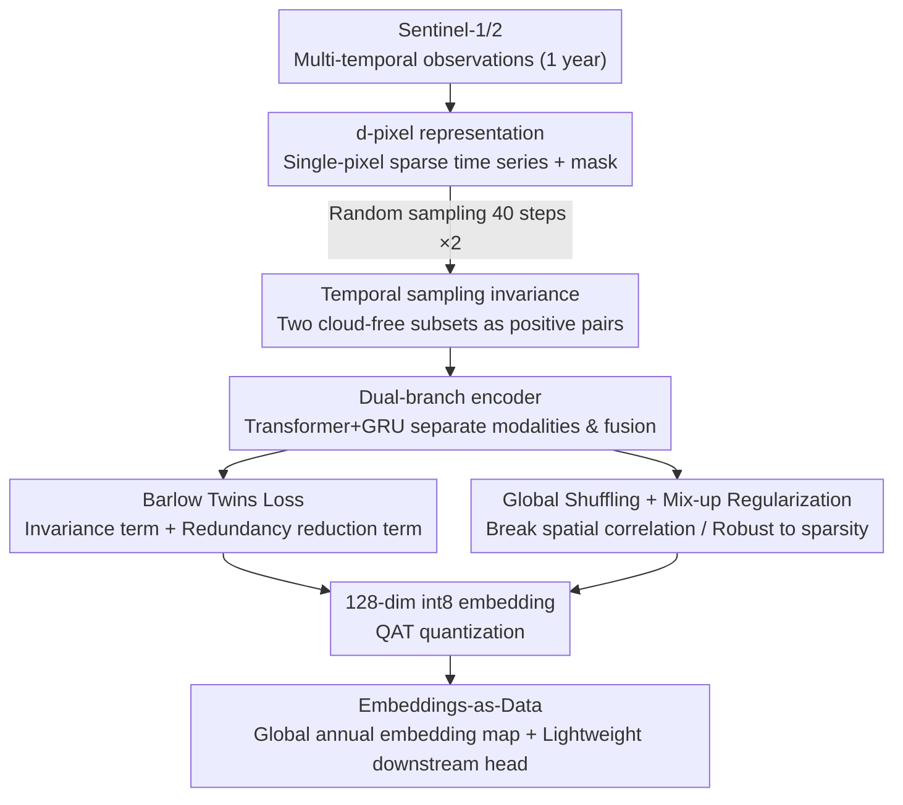

# TESSERA: Temporal Embeddings of Surface Spectra for Earth Representation and Analysis

**Conference**: CVPR 2026  
**Paper**: [CVF Open Access](https://openaccess.thecvf.com/content/CVPR2026/html/Feng_TESSERA_Temporal_Embeddings_of_Surface_Spectra_for_Earth_Representation_and_CVPR_2026_paper.html)  
**Code**: https://github.com/ucam-eo/tessera  
**Area**: Remote Sensing / Earth Observation Foundation Models  
**Keywords**: Earth Observation, Pixel-level Foundation Models, Temporal Sampling Invariance, Barlow Twins, Embeddings-as-Data  

## TL;DR
TESSERA encodes multi-year Sentinel-1/2 time series of each 10m surface pixel into a 128-dimensional int8 embedding vector. By leveraging a self-supervised objective invariant to random temporal sampling, it learns robust phenological representations. Released as a global "embeddings-as-data" product, downstream tasks only need a lightweight MLP/UNet head to achieve SOTA performance on classification, segmentation, and regression tasks, showing significant advantages under extremely low annotation regimes.

## Background & Motivation
**Background**: Satellite Earth Observation (EO) data consists of continuous optical (Sentinel-2) and radar (Sentinel-1) time series. Recently, Remote Sensing Foundation Models (RSFMs) have flourished. Most models employ patch-based contrastive learning or masked reconstruction (e.g., SatMAE, CROMA, SkySense) and fine-tune these models as backbones for downstream tasks.

**Limitations of Prior Work**: Satellites suffer from cloud cover, irregular orbital revisit cycles, and varying sensor resolutions, resulting in highly sparse and incomplete raw time series. Common practices rely on **compositing (creating cloud-free mosaics)** or temporal averaging to regularize the data. However, this step flattens phenological dynamics (seasonal vegetation changes) and transient events—the exact signals crucial for agriculture, forestry, and environmental monitoring. Consequently, RSFMs learn representations biased toward "idealistic cloud-free conditions," rendering them vulnerable to irregular real-world sampling. Furthermore, patch-based training combined with the need to fine-tune the backbone for every task demands high computational and label budgets for typical EO users.

**Key Challenge**: A trade-off exists between information fidelity and data regularity. Regularizing data via compositing yields dense, cloud-free data suitable for training but discards temporal phase information. Preserving phenology, on the other hand, requires confronting sparse and irregular raw sequences directly.

**Goal**: Learn a pixel-level EO representation that is robust to irregular sampling and label-efficient, and release it as a "ready-to-use product" so that downstream users do not need to process raw satellite data or fine-tune backbones.

**Key Insight**: Instead of filtering out imperfect observations, the model is forced to remain invariant to the choice of observation subsets. The authors observe that since physical processes at a given location are consistent, embeddings derived from two randomly sampled, cloud-free observation subsets from this location should be identical. Treating this invariance as a training signal naturally enables the model to generalize across sensors, seasons, and regions.

**Core Idea**: Utilize Barlow Twins coupled with sparse, random temporal sampling to construct "temporal sampling invariance," compressing the sparse, multimodal time-series of each pixel into a robust 128-dimensional embedding. This is published as "Embeddings-as-Data" rather than another backbone requiring fine-tuning.

## Method

### Overall Architecture
The input to TESSERA is a full year of Sentinel-1 (radar backscatter) and Sentinel-2 (optical bands) observations for a given 10m surface location, and the output is a 128-dimensional int8 embedding vector representing the annual phenological features of that pixel. The pipeline operates in four steps: (1) Spatiotemporally aligned multi-temporal images are extracted at a single pixel location into a masked, sparse time series (referred to as a **d-pixel**). (2) During training, two augmented views are independently and randomly sampled from the same d-pixel (each taking 40 valid time steps) and fed into a **dual-branch encoder** (optical/radar) to be fused into a 128-dimensional embedding. (3) The embeddings of the two views are aligned and decorrelated using three objectives: **Barlow Twins loss**, **mix-up regularization**, and **global shuffling**. (4) During inference, the encoder is frozen to generate embedding maps for every pixel globally. Downstream tasks only train a lightweight head on top of these frozen embeddings.

### Key Designs

**1. d-pixel and Temporal Sampling Invariance: Turning "Missing Data" from a Flaw into a Training Signal**

A key limitation is that cloud cover and irregular revisit cycles make time series sparse and unaligned. Traditional approaches rely on compositing to fill missing values, discarding phenological information. TESSERA directly defines a **d-pixel** at a spatial coordinate $(i,j)$ by collecting all spectral channel values across time into a set $P_{i,j}(c)=S(i,j,c)$, along with a mask vector $m_{i,j}$ of length $T$ indicating valid time steps. A d-pixel naturally preserves full phenological phase information and elegantly accommodates irregular sampling. The key training signal is: **independently and randomly sample twice** from the same d-pixel to extract two augmented views $(Y_A, Y_B)$, each with 40 valid time steps, forcing the model to remain invariant to "which specific cloud-free observations were selected." Since the physical processes at a given location are consistent, this invariance constrains the model to encode only stable phenological regularities and discard noise from sampling selection, enabling robust generalization across sensors, seasons, and regions. Consequently, "missing data/irregular sampling" is inverted from a preprocessing flaw to a source of self-supervised augmentation.

**2. Dual-Branch Temporal Encoder: Separate Encoding and Fusion of Optical and Radar Modalities**

Optical (S2) and radar (S1) imaging mechanisms are fundamentally different; forcing them into a single encoder can cause mutual interference. TESSERA employs a simple yet highly effective dual-branch architecture to process each modality separately. Each branch receives a masked time series, projects each valid observation linearly via $\phi: \mathbb{R}^C \to \mathbb{R}^d$, and injects a learnable **Day-of-Year positional encoding** $\psi(\text{DoY}(t))$ to represent when the observation occurred in the calendar year: $e_t = \phi(P^{(t)}_{i,j}) + \psi(\text{DoY}(t))$. Sequences are padded or resampled to a fixed length of $L=40$, passed through a 4-layer Transformer encoder, and aggregated into a fixed-length vector $z_{\text{mod}} \in \mathbb{R}^{128}$ via **GRU pooling**. The modalities $z_{S2}$ and $z_{S1}$ are concatenated and fused into $z \in \mathbb{R}^{128}$ via a 2-layer MLP. The DoY positional encoding is crucial: it informs the Transformer of the actual calendar positions of the observations, allowing the model to align phenological phases even (or especially) when observations are sparsely distributed, rather than treating them as equally spaced sequences.

**3. Barlow Twins + mix-up Regularization + Global Shuffling: A Trio for Robust Invariance Under Sparsity**

This combination of training objectives makes "sampling invariance" work in practice. The foundation is the **Barlow Twins loss**, which constrains the cross-correlation matrix $C$ (computed after batch-normalization) of the two view embeddings:

$$\mathcal{L}_{BT} = \sum_i (1 - C_{ii})^2 + \lambda_{BT}\sum_i \sum_{j \neq i} C_{ij}^2$$

The first term (invariance term) forces the diagonal to approach 1, ensuring consistent embeddings for views of the same pixel. The second term (redundancy reduction term) forces off-diagonal elements to approach 0, decorrelating different embedding dimensions to maximize information efficiency ($\lambda_{BT}=5\times10^{-3}$). However, Barlow Twins alone can overfit in extremely sparse scenarios. To address this, **mix-up regularization** $\mathcal{L}_{MIX}$ is added: a shuffled version of the views $Y_S$ along the batch dimension is generated, and a linear mix $Y_M = \alpha_{mix}Y_A + (1-\alpha_{mix})Y_S$ (where $\alpha_{mix}\sim U(0,1)$) is constructed. This penalizes deviations between actual cross-correlations $C^{MA}, C^{MS}$ and target interpolation values, requiring linear interpolation in the input space to correspond to linear interpolation in the embedding space. The total loss is $\mathcal{L}_{total} = \mathcal{L}_{BT} + \lambda_{mix}\mathcal{L}_{MIX}$ ($\lambda_{mix}=1.0$). The third component is **global shuffling**: prior to batch compilation, d-pixels from all geographic tiles are randomly shuffled to disrupt spatial autocorrelation—otherwise, a batch would contain highly redundant adjacent pixels, causing noisy loss curves and poor generalization. Ablation studies show these three components are complementary: removing shuffling or mix-up drops the F1 score by 9.2 and 11.1 points respectively, and removing both drops it by 14.7.

### Loss & Training
Pre-training is performed on approximately 800 million d-pixels sampled from 3,012 global MGRS tiles (from 2017 to 2024), utilizing 16 AMD MI300X GPUs (192GB each). Two 40-step views are independently sampled for each d-pixel. The model is trained for only **one epoch** with a massive global batch size of 32,768, optimized using AdamW ($\eta=0.002$, weight decay $10^{-6}$) with a linear warmup and cosine decay. During training, $z$ is projected to 16,384 dimensions via a deep projector MLP to compute the loss; the projector is discarded during inference. Finally, **Quantization-Aware Training (QAT)** is applied to compress $z$ to an 8-bit integer, saving ~4x storage with negligible performance loss. During inference, the dual encoders are frozen, and embeddings are generated for every 10m pixel globally by sampling 40 steps from their annual S1/S2 series. For pixels with fewer than 40 valid observations, sampling with replacement is used to ensure seamless coverage.

## Key Experimental Results

### Main Results
TESSERA is compared against a large suite of RSFMs (CROMA, Prithvi, SkySense, Galileo, Presto, Google AlphaEarth, etc.) across 6 cross-task benchmarks (classification, segmentation, regression). For all downstream tasks, only a lightweight head (MLP / UNet) is trained on top of the frozen embeddings.

| Task / Dataset | Metric | TESSERA | Second Best (AlphaEarth) | Strong Fine-tuned Baseline |
|--------------|------|---------|------------------|-----------|
| Classification TreeSatAI-TS (Full labels) | F1 ↑ | **77.96** | 76.90 | UNet 73.30 |
| Classification TreeSatAI-TS (1% labels) | F1 ↑ | **60.58** | 52.79 | — |
| Classification Austrian Crop (1% labels) | F1 ↑ | **66.15** | 37.22 | Presto 32.74 |
| Segmentation PASTIS-R (Full labels) | mIoU ↑ | 50.68 (Second) | **51.08** | ViT 42.57 |
| Segmentation Austrian Crop (Full labels) | mIoU ↑ | **53.12** | 25.70 | ViT 31.77 |
| Regression Biomassters (Full labels) | RMSE ↓ | **27.43** | 29.59 | SkySense 30.78 |
| Regression Borneo CHM (Full labels) | RMSE ↓ | **12.21** | 16.11 | SkySense 15.58 |

Key takeaways: The performance advantage is most pronounced in **extremely low annotation** regimes. On Austrian Crop with only 1% labels, TESSERA achieves 66.15 F1, outperforming AlphaEarth by 28.9 points and Presto by 33.4 points. In few-shot settings with only 4 samples per class, it still reaches ~0.5 F1 while other models score below 0.4. On Biomassters, after removing outliers >500 t/ha, TESSERA with 4% labels (26.61 t/ha) almost catches up with competition-winning task-specific supervised models (25.90 t/ha). Moreover, TESSERA's encoder has only 45.7M / 30.2M parameters, which is significantly smaller than AlphaEarth's 480M / 30.1M (Note: there are minor discrepancies in parameter counts in the original text; ⚠️ refer to the original paper for precise numbers).

### Ablation Study
Validation F1 and RankMe (higher is better) on Austrian Crop classification are verified for different designs:

| Configuration | Val. F1 ↑ | RankMe ↑ | Description |
|------|----------|----------|------|
| Baseline (Full Model) | 77.3 | 0.963 | Full Model |
| w/o Global Shuffling | 68.1 (−9.2) | 0.847 | Spatial autocorrelation remains unbroken, degrading generalization |
| w/o Mix-up Regularization | 66.2 (−11.1) | 0.857 | Overfitting on features under high sparsity |
| w/o Sentinel-1 Data | 74.2 (−3.1) | 0.931 | Radar modality contributes but is not the primary driver |
| w/o Shuffling & Mix-up | 62.6 (−14.7) | 0.867 | Removing both results in the largest drop |
| w/o int8 Quantization | 77.9 (+0.6) | 0.972 | Quantization incurs almost no degradation |
| w/o Pre-training | 43.8 (−33.5) | — | Self-supervised pre-training is indispensable |

### Key Findings
- **Pre-training contributes the most**: Removing pre-training leads to a catastrophic drop of 33.5 F1, showing it is the most critical factor. Furthermore, **fine-tuning after pre-training offers no benefit**—frozen and fine-tuned encoders perform equally well, indicating that the learned embeddings are already highly generalized, eliminating backbone fine-tuning costs.
- **Shuffling and mix-up are complementary**: Individually removing either drops the F1 score by 9–11 points, while removing both drops it by 14.7, showing that they address different issues (spatial autocorrelation vs. sparsity overfitting).
- **Quantization is virtually free**: int8 quantization loses only 0.6 F1 but reduces storage to ~25% of fp32, which is highly practical for global products and edge deployment.
- **Cloud robustness has a threshold**: Macro-F1 only degrades sharply when the count of valid cloud-free observations per year falls below 10–20. Since most regions globally receive 70+ observations per orbit annually, the model is highly robust in practice.
- **A global model is sufficient**: Region-specific retrained models offer negligible improvement, demonstrating that a single global model performs exceptionally well across various geographies, validating the "embeddings-as-data" paradigm's independence from expensive regional customization.
- **L=40 is the sweet spot**: Among $L\in\{20,40,96,365\}$, L=40 yields the optimal accuracy-efficiency trade-off, and repeated random sampling shows minimal variance (confirming that the sampling invariance training target works as intended).

## Highlights & Insights
- **Turning data flaws into self-supervised augmentations**: The most elegant aspect is the "temporal sampling invariance" objective. While others treat cloud cover as noise and try to clean it, TESSERA directly leverages the randomness of sparse sampling as a form of data augmentation. More occlusion provides more view diversity, which is highly suited for the task.
- **"Embeddings-as-Data" product mindset**: Instead of releasing a backbone that still requires fine-tuning, the authors publish global, annual, 10m, int8, pixel-level, ready-to-use embedding maps along with the `GeoTessera` Python library. Downstream users can simply `pip install` and train a lightweight MLP on top. This lowers the entry barrier for utilizing RSFMs from "knowing how to train large models" to "running a small MLP," thoroughly putting FAIR principles into practice.
- **Frozen is optimal**: The ablation finding that fine-tuning yields no benefit over freezing is counter-intuitive. It shows that self-supervised phenological representations are already sufficiently generalized, which is a major advantage for practical deployment—this finding is transferable to any scenario that releases generic embeddings for downstream lightweight heads.
- **DoY positional encoding for irregular time-series**: Using day-of-year rather than sequence indices as positional encoding is a simple and elegant solution for irregular time series, transferable to any sparse sequence modeling with real timestamps.

## Limitations & Future Work
- **Pixel-level, without spatial context**: Pre-training is strictly pixel-level, ignoring spatial structure between adjacent d-pixels. Although downstream UNet heads can recover spatial context (showing larger gains with more labels), it means classification/segmentation/regression tasks must rely on the downstream head to learn spatial relations. Indeed, TESSERA ranks only second on PASTIS-R (behind AlphaEarth).
- **Coarse temporal granularity of annual embeddings**: The default product is an annual embedding, which may not suffice for tasks requiring intra-annual fine-grained dynamics or multi-year trends. The paper mentions inference with shorter seasonal windows, but details are relegated to the supplementary material.
- **Dependence on the availability of Sentinel-1/2 dual modalities**: The method relies on paired S1+S2. If a region lacks one modality over long periods, the advantages of dual-branch fusion will be compromised (ablation reveals that removing S1 drops F1 by 3.1, which is a minor but notable drop).
- **Substantial analysis deferred to supplementary material**: Critical details regarding global shuffling, seasonal windows, selection of $L$, and spatial head architectures are deferred to the supplementary material, limiting the self-contained reproducibility of the main text.
- **Future directions**: Advancing from pixel-level pre-training to lightweight spatiotemporal patch-level pre-training could natively encode spatial context without dramatically increasing cost, addressing the limitations on segmentation tasks.

## Related Work & Insights
- **vs patch-based RSFM (SatMAE / CROMA / SkySense)**: These models train on spatial patches, implicitly assume that inputs are already cloud-free mosaics through prior compositing, and require fine-tuning the backbone for each downstream task. In contrast, TESSERA trains on pixel time-series, directly ingests sparse raw observations, and locks the backbone while training only lightweight downstream heads. TESSERA preserves phenology and avoids backbone fine-tuning, at the expense of ignoring spatial context during pre-training.
- **vs Presto / Google AlphaEarth (Embeddings-as-Data Paradigm)**: These models also release ready-to-use embeddings but either lack global-scale pixel-level granularity, are not fully open-source, or do not explicitly handle irregular temporal sampling. TESSERA bridges these gaps: global 10m pixel-level, fully open-source (weights, code, and library), and targets temporal sampling invariance as its core objective. Under low annotation budgets, TESSERA significantly outperforms AlphaEarth (with an encoder an order of magnitude smaller).
- **vs Lisaius et al. (Direct predecessor)**: Prior work utilized Sentinel-2 single-modality for Barlow Twins EO embeddings. TESSERA expands this in four ways: a new dual-modality S1+S2 fusion architecture, two complementary regularizers (global shuffling + mix-up), global-scale int8 pixel-level embeddings, and comprehensive evaluation across classification, segmentation, and regression tasks.

## Rating
- Novelty: ⭐⭐⭐⭐ The combination of temporal sampling invariance and the "embeddings-as-data" paradigm is highly targeted, though the underlying components (Barlow Twins, mix-up) are clever assemblies of existing methods.
- Experimental Thoroughness: ⭐⭐⭐⭐⭐ 6 cross-task benchmarks, multiple labeling ratios, comparison with over ten SOTA baselines, comprehensive ablations, scaling analyses, and introduction of two new benchmarks.
- Writing Quality: ⭐⭐⭐⭐ Clear motivation and an easy-to-read Q&A style ablation section. However, many critical analyses are deferred to the supplementary material, leaving minor gaps in the main text.
- Value: ⭐⭐⭐⭐⭐ Fully open-sourced global pixel-level embedding product and dominant performance under extremely low annotation regimes make this a highly practical and immediately useful resource for the remote sensing community.

<!-- RELATED:START -->

## Related Papers

- [\[CVPR 2026\] RAMEN: Resolution-Adjustable Multimodal Encoder for Earth Observation](ramen_resolution-adjustable_multimodal_encoder_for_earth_observation.md)
- [\[CVPR 2026\] OlmoEarth: Stable Latent Image Modeling for Multimodal Earth Observation](olmoearth_stable_latent_image_modeling_for_multimodal_earth_observation.md)
- [\[ICLR 2026\] MoRA: Mobility as the Backbone for Geospatial Representation Learning at Scale](../../ICLR2026/remote_sensing/mora_mobility_as_the_backbone_for_geospatial_representation_learning_at_scale.md)
- [\[CVPR 2026\] Sparsely Timing the Change: A Spiking Temporal Framework for Remote Sensing Interpretation](sparsely_timing_the_change_a_spiking_temporal_framework_for_remote_sensing_inter.md)
- [\[ICLR 2026\] Earth-Agent: Unlocking the Full Landscape of Earth Observation with Agents](../../ICLR2026/remote_sensing/earth-agent_unlocking_the_full_landscape_of_earth_observation_with_agents.md)

<!-- RELATED:END -->
