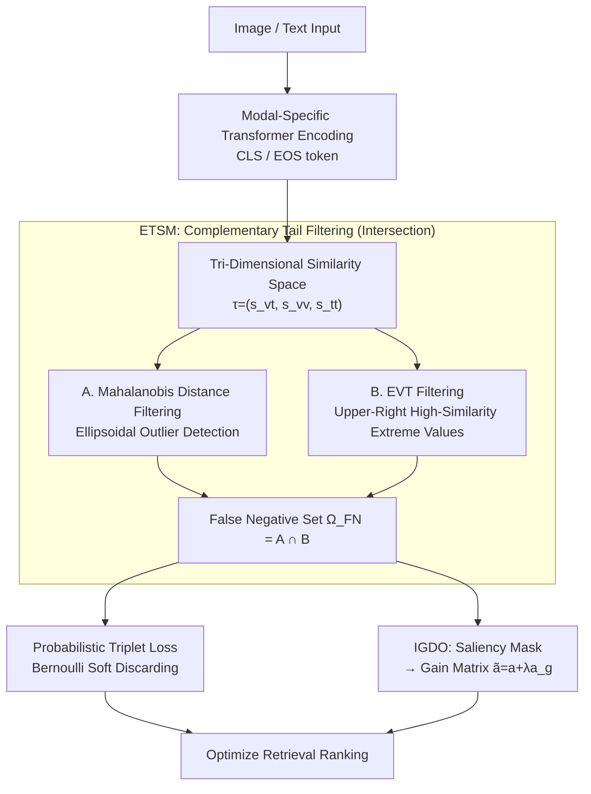

# TriSim: Tri-Dimensional Similarity Modeling with Extreme Value Theory for False-Negative Mitigation in Remote Sensing Image-Text Retrieval

**Conference**: CVPR 2026  
**Paper**: [CVF Open Access](https://openaccess.thecvf.com/content/CVPR2026/html/Zheng_TriSim_Tri-Dimensional_Similarity_Modeling_with_Extreme_Value_Theory_for_False-Negative_CVPR_2026_paper.html)  
**Code**: None  
**Area**: Remote Sensing Image-Text Retrieval / Cross-Modal Retrieval  
**Keywords**: Remote Sensing Image-Text Retrieval, False Negative Samples, Extreme Value Theory, Tri-Dimensional Similarity Space, Contrastive Learning

## TL;DR
To address the vulnerability of relying on a single cross-modal similarity threshold to identify false negatives in remote sensing image-text retrieval, TriSim maps each sample pair to a tri-dimensional similarity space of ⟨image-text, image-image, text-text⟩. It uses two complementary tail detection strategies—Mahalanobis distance and Extreme Value Theory (EVT)—to identify true false negatives. It then incorporates an intra-modal saliency-guided gain matrix to refine discriminative regions, outperforming the strongest baselines on RSICD and RSITMD by 1.51% and 2.25% in mR, respectively.

## Background & Motivation

**Background**: The mainstream approach in Remote Sensing Image-Text Retrieval (RSITR) is contrastive learning, which pulls the anchor and positive samples closer while pushing negative samples apart. However, remote sensing images exhibit high visual and semantic homogeneity (e.g., a field and a coastline can look highly similar). Consequently, many "negative samples" in a mini-batch are actually semantically related to the anchor, representing mislabeled **False Negative Samples (FNS)**. Blindly pushing them away as negatives degrades representation consistency by dispersing semantically similar samples.

**Limitations of Prior Work**: Existing approaches to mitigate FNS almost exclusively rely on **a single cross-modal similarity threshold**. They compute image-text similarity for negative pairs, and if it exceeds the threshold, they treat them as FNS and discard them with a certain probability. However, this single-threshold approach is highly unreliable for remote sensing data due to two intrinsic properties: ① **Cross-modal semantic overlap**—unmatched image-text pairs share partial semantics (e.g., both containing "buildings" or "roads"), inflating their similarity and causing true negatives to be misclassified as FNS and discarded. ② **Cross-modal semantic gap**—the features of matched image-text pairs are poorly aligned, yielding low similarity, so the missed FNS continue to be pushed away as true negatives. A one-size-fits-all threshold causes both the erroneous deletion of true negatives and the missed detection of false negatives.

**Key Challenge**: Determining whether an image-text pair is a false negative **cannot rely on the single dimension of image-text information alone**. The authors' key observation is that abnormally high image-text similarity is often not because they genuinely match, but because they are driven by strong **intra-modal** correlations (i.e., image-image or text-text similarity is very high). Looking only at cross-modal similarity hides this underlying cause.

**Goal**: Construct a space that simultaneously characterizes both cross-modal and intra-modal relationships, allowing for more robust identification of FNS from true negatives within this space, and further refining the discriminative features of these FNS.

**Key Insight**: Represent each sample pair as a tri-dimensional similarity triplet $\tau_{ij}=(s^{vt}_{ij}, s^{vv}_{ij}, s^{tt}_{ij})$. In this tri-dimensional space, FNS are no longer defined by "exceeding a single-dimensional threshold" but are instead modeled as **anomalies in the heavy right-tail of the global distribution**—they deviate from the main cluster and simultaneously exhibit high values across multiple dimensions. This can be directly formulated using anomaly detection and Extreme Value Theory (EVT).

**Core Idea**: Replace the "single cross-modal threshold" with "tail anomaly detection in a tri-dimensional similarity space" to identify FNS, and use intra-modal saliency differences to guide a gain matrix for amplifying discriminative regions.

## Method

### Overall Architecture
The input to TriSim is a batch of image-text pairs, and the output is the optimized retrieval model (providing more accurate image-text similarity ranking). The workflow consists of three sequential parts: ① **Encoding**—images and texts are encoded by modal-specific Transformers (based on a RemoteCLIP backbone), and the similarity is computed using the image's CLS token and the text's EOS token. ② **ETSM Module** (EVT-guided Tri-dimensional Similarity Modeling)—each sample pair is projected into a tri-dimensional similarity space. Two complementary strategies—Mahalanobis distance filtering and EVT filtering—are used to find the **intersection**, yielding the false negative set $\Omega_{FN}$. Bernoulli sampling is then performed on this set to drive a probabilistic triplet loss. ③ **IGDO Module** (Intra-modal Guided Discrimination Optimization)—for the selected FNS, intra-modal saliency differences are used to generate a mask, which supervises the learning of a gain matrix. This matrix amplifies discriminative regions and suppresses ambiguous ones. The model is optimized jointly using two losses: the probabilistic triplet loss and the mask loss.

### Key Designs

**1. Tri-Dimensional Similarity Space: Explicitly modeling "why the similarity is high"**

The fundamental limitation of a single threshold is its inability to distinguish whether "high similarity is due to a true match or driven by intra-modal correlation." TriSim constructs a triplet $\tau_{ij}=(s^{vt}_{ij}, s^{vv}_{ij}, s^{tt}_{ij})$ for each candidate pair: first, the cross-modal similarity $s^{vt}_{ij}=s(v_i,t_j)$ is computed using cosine similarity, which then acts as an index to compute the two intra-modal similarities: image-image $s^{vv}_{ij}=s(v_i,v_j)$ and text-text $s^{tt}_{ij}=s(t_i,t_j)$. Since the scale of cross-modal similarity is typically lower than intra-modal similarity, it is normalized as $s^{vt}_{ij}=s^{vt}_{ij}/s^{vt}_{ii}$. The authors observe that FNS cluster in the **heavy-tailed upper-right region** of this tri-dimensional space, where all three dimensions are simultaneously high. This reformulates "false negative detection" from a one-dimensional thresholding problem into a "tail anomaly detection in a tri-dimensional distribution," preserving the pairwise relational structure and fundamentally alleviating misclassification caused by semantic overlaps or gaps.

**2. Intersection of Mahalanobis Distance and EVT Complementary Tail Strategies**

To establish concrete criteria for finding "tail anomalies," TriSim employs two complementary strategies targeting different classes of tail samples and computes their intersection for robustness.

The first is **Mahalanobis Distance Filtering**, which detects **outliers** deviating from the dense ellipsoidal center. It computes the Mahalanobis distance of each triplet to the global mean $\mu$ and covariance $\Sigma$: $D_M(\tau_{ij})=\sqrt{(\tau_{ij}-\mu)^\top \Sigma^{-1}(\tau_{ij}-\mu)}$. Its square follows a chi-squared distribution with 3 degrees of freedom. Given a significance level $\beta$, samples with $D_M^2(\tau_{ij}) > \chi^2_{3,1-\beta}=c$ are collected into the set $\Omega_M$.

The second is **EVT (Extreme Value Theory) Filtering**, which specifically targets the **high-similarity extremes in the upper-right corner**. It first takes the minimum component of each triplet, $\min(\tau_{ij})$, and candidates exceeding a high-quantile threshold $u$ enter a candidate pool $\Upsilon$. The exceedance $y_{ij}=\min(\tau_{ij})-u$ is modeled using the Generalized Pareto Distribution (GPD):

$$f_{GPD}(y;\sigma,\xi)=\frac{1}{\sigma}\Big(1+\xi\frac{y}{\sigma}\Big)^{-1-1/\xi},\quad \xi\neq 0$$

By maximizing the log-likelihood, the scale $\sigma$ and shape $\xi$ are estimated, and the tail cumulative probability $\hat F_{GPD}(y_{ij})$ is computed for each sample. Those exceeding $1-p_g$ are classified as extreme values, forming $\Omega_{EVT}$. The final false negative set is the **intersection of both sets** $\Omega_{FN}=\Omega_M \cap \Omega_{EVT}$—requiring a sample to be both an outlier from the main cluster and a high-similarity extreme to be deemed a truly credible FNS. This is more conservative and accurate than either single strategy (as shown in the ablation where A+B significantly outperforms single strategies).

A **Probabilistic Triplet Loss** is then used to softly handle these FNS: for pairs within $\Omega_{FN}$, the discarding probability is set as $p^d_{ij}=(p_g+p_{ij}-1)/p_g$, which generates a Bernoulli indicator $r_{ij}$. This indicator is multiplied into the hinge triplet loss terms ($\mathcal{L}_{v2t}, \mathcal{L}_{t2v}$ with margin $\alpha$), yielding $\mathcal{L}_{tri}=\frac{1}{2}(\mathcal{L}_{t2v}+\mathcal{L}_{v2t})$. In this way, high-confidence FNS are "softly discarded" with high probability rather than being incorrectly pushed away as negatives, avoiding a hard threshold.

**3. IGDO: Learning a Gain Matrix with Intra-modal Saliency Differences to Refine Discriminative Regions**

Identifying FNS is not enough; some FNS actually contain unique detailed regions that can distinguish them, which should be emphasized rather than completely ignored. IGDO re-runs the EVT tri-dimensional modeling before the last Transformer layer to locate false negative pairs $(v_i, t_j)$ (where the true image of $t_j$ is $v_j$) and modifies the attention similarity of the final layer. Specifically, it computes the image self-attention $a=s_{att}(v_i,v_i)$ and cross-image similarity $a'=s_{att}(v_i,v_j)$, and sums along the columns to obtain patch-level saliency vectors $b,b'$. Patches that are highly salient in $b$ but not in $b'$ (i.e., discriminative regions unique to $v_i$ but absent in $v_j$) are recorded in a mask: $m_1=\mathbb{I}(b>\varepsilon)$, $m_2=\mathbb{I}(b'<\varepsilon')$, $m_{DSR}=(m_1\odot m_2)\cdot\mathbf{1}_{1\times N}$.

To make this filtering trainable rather than relying on hard thresholds, the self-saliency mask is integrated into the features $v_{gen}=m_1\odot v_i$, which are fed into a lightweight MLP to predict a latent mask $m_g=\text{MLP}(v_{gen})\cdot\mathbf{1}_{1\times N}$. This is supervised by $m_{DSR}$ via $\mathcal{L}_{mask}=\lVert m_g - m_{DSR}\rVert_2$. Furthermore, $m_g$ guides the learning of a gain matrix $a_g$, which is added back to the original similarity $\tilde a=a+\lambda a_g$. This replaces $a$ during Transformer training, amplifying discriminative areas and suppressing ambiguous ones. The joint loss is $\mathcal{L}=\mathcal{L}_{tri}+\gamma\mathcal{L}_{mask}$. This step allows the model to "adaptively discover regions that may not represent generic semantic categories but are crucial for distinguishing the current sample."

### Loss & Training
The total objective is $\mathcal{L}=\mathcal{L}_{tri}+\gamma\mathcal{L}_{mask}$. The backbone is a pre-trained RemoteCLIP with $L=2$ Transformer layers. Optimization is performed using Adam with an initial learning rate of $4\times10^{-4}$ and a decay of 0.7, with a batch size of 700. The hyperparameters differ between the two filtering stages: before the last layer, $q_u=0.9,\beta=0.1,p_g=0.1$; after the last layer, $q_u=0.99,\beta=0.01,p_g=0.01$.

## Key Experimental Results

### Main Results
Evaluations are conducted on RSICD (10,921 remote sensing images, 5 captions per image) and RSITMD (approx. 4,000 high-resolution image-text pairs), and compared against 25 baselines (5 general retrieval, 12 remote-sensing-specific, and 11 CLIP-based methods). Metrics used are R@1/5/10 and mean recall (mR).

| Dataset | Metric (mR) | Ours | Prev. SOTA | Gain |
|--------|------|------|----------|------|
| RSICD | mR | 37.55 | GLISA 36.99 | +1.51% |
| RSITMD | mR | 51.35 | AIR 50.22 | +2.25% |

On RSITMD, all text-to-image (T→I) retrieval metrics outperform all other methods (R@1 26.95 / R@5 61.86 / R@10 78.58), whereas the improvement in image-to-text (I→T) is smaller—which the authors attribute to the limited diversity of text descriptions, making them more prone to false negatives.

### Ablation Study
Conducted on the RSITMD dataset.

Module Ablation (Table 2):

| Configuration | mR | Description |
|------|---------|------|
| w/o all | 47.96 | Baseline without ETSM+IGDO |
| w/o IGDO | 49.86 | Only ETSM, +1.90 |
| TriSim (full) | 51.35 | With IGDO, additional +1.49 |

FNS Detection Strategy Ablation (Table 3):

| Strategy | mR | Description |
|------|---------|------|
| CT (Cross-modal Threshold) | 48.54 | Worst; easily affected by semantic overlap/gap |
| AT (Tri-dimensional space with quadrant threshold) | 49.16 | Moderate; still lacks precision |
| A+B (Mahalanobis ∩ EVT) | 51.35 | Best; balances outliers and upper-right extremes |

### Key Findings
- **ETSM is the primary contributor**: Integrating only ETSM (EVT-guided tri-dimensional modeling) increases mR from 47.96 to 49.86 (and up to a +3.96% improvement mentioned elsewhere in the text), proving that "tail detection in tri-dimensional space" is more effective than single-thresholding for FNS identification. IGDO further builds on this by recovering discriminative details.
- **Intersection of the two strategies outperforms either alone**: Performance increases monotonically from CT to AT to A+B. This indicates that dual criteria—requiring samples to be both "deviating from the ellipsoidal center" and "high-similarity extremes in the upper right"—are necessary to suppress misclassification caused by semantic overlaps or gaps.
- **Optimal hyperparameters vary by location**: The parameters $q_u, \beta, p_g$ require different values before and after the last layer (e.g., $q_u$ is 0.9 before and 0.99 after). Performance follows a bell curve around the peak of 51.35, indicating that tail quantile thresholds must be tuned independently based on the layer location.

## Highlights & Insights
- **Formulating "false negative determination" as an anomaly detection problem**: The key insight is that abnormally high cross-modal similarity is often driven by intra-modal correlation. Thus, representing image-image and text-text similarities as two additional dimensions allows FNS to stand out as heavy-tailed outliers in the upper-right quadrant. This perspective shift is more fundamental than simply stacking complex attention mechanisms.
- **Complementary and statistically interpretable Mahalanobis + EVT**: One manages the ellipsoidal periphery (via chi-squared test) while the other targets extreme tails (via GPD fitting). Their intersection acts as a robust "double verification," grounded in statistical theory rather than empirical thresholds, making it highly transferable to other contrastive learning tasks requiring soft-label FNS identification.
- **Trainable masks driven by saliency differences**: Using the difference between "salient in the target image but not in the reference image" patches to locate discriminative regions, and training a lightweight MLP to convert hard masks into learnable gains, offers an elegant intra-modal guidance paradigm that is widely applicable to fine-grained cross-modal retrieval.

## Limitations & Future Work
- **Evaluations are limited to two relatively small remote sensing datasets** (RSICD and RSITMD). Its generalization capability has not been tested on larger-scale datasets or on other modalities (such as hyperspectral or SAR, which were mentioned in the introduction but not experimented on).
- **Excessive hyperparameters requiring spatial tuning**: Sets of $q_u, \beta, p_g$ must be configured differently before and after the last layer. Along with $\lambda, \gamma, \varepsilon, \varepsilon'$, this introduces high tuning overhead, and no automated search space strategies are provided.
- **Limited improvement in I→T retrieval**: The gains in image-to-text retrieval are noticeably lower than those in text-to-image retrieval. While the authors attribute this to low textual diversity, it suggests that the current method does not process "text-side false negatives" as effectively, leaving room for improvement.
- In the ablation Table 2, some R@K metrics (such as R@1/R@5 for I→T) for the configuration `w/o IGDO` are higher than those of the full model. This indicates that IGDO primarily boosts T→I rather than yielding comprehensive improvements, and the full model wins overall through its mean recall (mR) average.

## Related Work & Insights
- **vs. Single-threshold Soft Labeling (FNE [23], [42, 53])**: These methods solely use cross-modal similarity thresholds to assign soft labels to FNS. TriSim introduces image-to-image/text-to-text dimensions paired with statistical tail detection, correcting both "false negatives missed due to semantic gaps" and "true negatives deleted due to semantic overlaps". Figure 4 in the paper visually demonstrates TriSim's ability to identify semantically related but low cross-modal similarity pairs as FNS, while treating high-similarity, non-matching pairs as true negatives.
- **vs. Dynamic Queue / Memory Bank Expansion ([17, 59])**: These approaches address the shortage of negative samples in mini-batches. TriSim, however, targets the "quality" of negative samples (identifying which are false negatives), making the two methods orthogonal and combinable.
- **vs. RemoteCLIP / GeoRSCLIP**: TriSim uses RemoteCLIP as its backbone. It optimizes negative samples and refines discriminative features on top of these representations, acting as a complementary enhancement rather than a replacement.

## Rating
- Novelty: ⭐⭐⭐⭐ The perspective of using a tri-dimensional similarity space combined with a dual-strategy EVT/Mahalanobis filter for FNS detection is highly novel, bringing statistical anomaly detection to cross-modal negative sample optimization.
- Experimental Thoroughness: ⭐⭐⭐⭐ Evaluating against 25 baselines on two datasets with comprehensive module, strategy, and hyperparameter ablations is solid, though the datasets are somewhat small and limited in modality.
- Writing Quality: ⭐⭐⭐⭐ The progression from motivation to methodology and experiments is logically clear. Formulas and pseudocode are complete, though some notations (normalization, threshold directions for $m_2$) are best understood when cross-referenced with the text.
- Value: ⭐⭐⭐⭐ Provides a robust, statistically interpretable solution to the false negative issue in remote sensing (and general homogeneous data) cross-modal retrieval, offering highly transferable concepts.

<!-- RELATED:START -->

## Related Papers

- [\[CVPR 2026\] Robust Remote Sensing Image–Text Retrieval with Noisy Correspondence](robust_remote_sensing_image-text_retrieval_with_noisy_correspondence.md)
- [\[CVPR 2026\] OlmoEarth: Stable Latent Image Modeling for Multimodal Earth Observation](olmoearth_stable_latent_image_modeling_for_multimodal_earth_observation.md)
- [\[CVPR 2026\] Cross-modal Fuzzy Alignment Network for Text-Aerial Person Retrieval and A Large-scale Benchmark](cross-modal_fuzzy_alignment_network_for_text-aerial_person_retrieval_and_a_large.md)
- [\[CVPR 2026\] ChangeBridge: Spatiotemporal Image Generation with Multimodal Controls for Remote Sensing](changebridge_spatiotemporal_image_generation_with_multimodal_controls_for_remote.md)
- [\[CVPR 2026\] GeoBridge: A Semantic-Anchored Multi-View Foundation Model Bridging Images and Text for Geo-Localization](geobridge_a_semantic-anchored_multi-view_foundation_model_bridging_images_and_te.md)

<!-- RELATED:END -->
