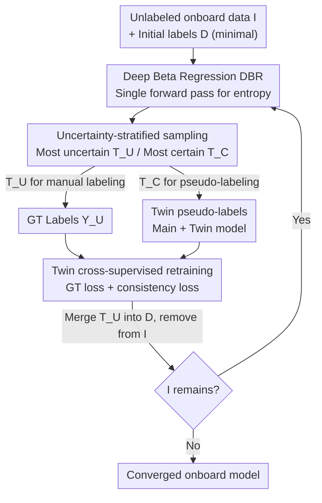

# Uncertainty-Guided Edge Learning for Deep Image Regression in Remote Sensing

**Conference**: CVPR2026  
**arXiv**: [2605.05590](https://arxiv.org/abs/2605.05590)  
**Code**: https://github.com/anh-vunguyen/UGEL  
**Area**: Remote Sensing  
**Keywords**: Edge learning, uncertainty estimation, deep Beta regression, active learning, semi-supervised learning

## TL;DR
Addressing the "edge learning" scenario with limited computational power on orbiting satellites, this paper proposes the UGEL algorithm: it utilizes "deep Beta regression" uncertainty, which can be calculated in a single forward pass, to select the most uncertain samples for manual labeling and the most certain samples for pseudo-labeling. This allows the onboard regression model to converge and retrain faster than traditional active learning or semi-supervised learning approaches.

## Background & Motivation

**Background**: Remote sensing satellites are increasingly equipped with neural network accelerators for direct onboard inference (e.g., predicting scalar regressions like cloud or land cover where $y\in[0,1]$). This enables space-based decision-making and avoids the cost of massive data downlink. However, deployed models suffer performance degradation due to sensor drift and domain gaps (mismatches between training and real-time data distribution), requiring periodic retraining—a process known as "Edge Learning" (EL).

**Limitations of Prior Work**: Onboard computational and power resources are severely constrained, limiting retraining to a tiny subset $\mathcal{T}\subset\mathcal{I}$ of the unlabeled data $\mathcal{I}$. Selecting the right samples and extracting supervisory signals from unlabeled data depends on "predictive uncertainty" estimation. Since $|\mathcal{I}|\gg|\mathcal{T}|$, the overhead of calculating uncertainty for the entire $\mathcal{I}$ can exceed the cost of the retraining itself. Current uncertainty methods are inefficient: MC Dropout requires 10~30 forward passes per sample, consuming significant power; Deep Evidential Regression (DER) works in one forward pass but assumes an unbounded Gaussian distribution, which is biased for cloud/land cover data constrained to $[0,1]$ with many samples clustered at the boundaries.

**Key Challenge**: Active Learning (AL, selecting uncertain samples for manual labeling) and Semi-Supervised Learning (SSL, using pseudo-labels for unlabeled data) both have merits. However, balancing their contributions is difficult when the model has not adapted to new environments and initial labels are extremely scarce (e.g., $M=12$). Furthermore, a precise, efficient, and boundary-respecting uncertainty estimator for $[0,1]$ is missing.

**Goal**: (1) Design an edge learning algorithm that unifies AL and SSL through a principled uncertainty framework; (2) provide a single-forward uncertainty estimator supporting bounded distributions.

**Key Insight**: Use the differential entropy of "Deep Beta Regression (DBR)" as a unified uncertainty measure. This allows partitioning samples into the "most uncertain" (for AL) and "most certain" (for SSL), enabling complementary supervisory signals to accelerate convergence with minimal labeling budget.

## Method

### Overall Architecture

UGEL addresses the problem of retraining a regression model $f_{\hat{\mathbf{w}}}$ to convergence using onboard unlabeled data $\mathcal{I}$ under a minimal labeling budget. It is an **iterative process**: in each round, the current model's uncertainty estimator $h_{\hat{\mathbf{w}}}$ scans $\mathcal{I}$ to select two disjoint subsets—the most **uncertain** $\mathcal{T}_U$ (size $B_U$, sent for manual labeling) and the most **certain** $\mathcal{T}_C$ (size $B_C$, labeled with pseudo-labels). The main model and a twin model are then updated using ground truth loss and pseudo-label consistency loss. Finally, the newly labeled $\mathcal{T}_U$ is merged into the labeled set $\mathcal{D}$ and removed from $\mathcal{I}$ before the next round.

The core of the pipeline is the uncertainty estimator provided by "Deep Beta Regression (DBR)", where the network outputs parameters for a Beta distribution, and the differential entropy serves as the uncertainty measure, calculable in a single forward pass. UGEL is uncertainty-agnostic, though DBR is the optimal choice for bounded $[0,1]$ remote sensing regression.

### Key Designs

**1. UGEL: Unifying AL and SSL with a Single Uncertainty Metric**

To address the difficulty of balancing AL and SSL when labels are scarce, UGEL uses a **single uncertainty measure $h_{\hat{\mathbf{w}}}$ to partition data**. Each round, the subset $\mathcal{T}=\mathcal{T}_U\cup\mathcal{T}_C$ is formed: $\mathcal{T}_U$ contains the $B_U$ most uncertain samples:

$$\mathcal{T}_U=\underset{\mathcal{S}\subset\mathcal{I},\,|\mathcal{S}|=B_U}{\arg\max}\sum_{x_i\in\mathcal{S}}h_{\hat{\mathbf{w}}}(x_i)$$

These are sent for manual labeling (acting as AL). $\mathcal{T}_C$ contains the $B_C$ most certain samples:

$$\mathcal{T}_C=\underset{\mathcal{S}\subset\mathcal{I},\,|\mathcal{S}|=B_C}{\arg\min}\sum_{x_i\in\mathcal{S}}h_{\hat{\mathbf{w}}}(x_i)$$

These are pseudo-labeled by the model (acting as SSL), ensuring $\mathcal{T}_U\cap\mathcal{T}_C=\emptyset$. This design provides a **unified framework**: setting $B_U>0, B_C=0$ reduces it to uncertainty-based AL; $B_U=0, B_C=N$ reduces it to cross-supervised SSL; and $B_U>0, B_C=N-B_U$ resembles standard ASSL. UGEL's benefit comes from selecting only the most certain samples for pseudo-labeling, preventing noise from diluting ground truth signals.

**2. Deep Beta Regression (DBR): Efficient Bounded Uncertainty**

Instead of expensive MC Dropout or unbounded DER, DBR forces the network $f_{\mathbf{w}}$ to output parameters for a Beta distribution, whose support is naturally $[0,1]$. Using mean-precision parameterization $\mu=\alpha/(\alpha+\beta)\in(0,1)$ and $\nu=\alpha+\beta>0$, the network outputs $(\hat{\mu},\hat{\nu})=f_{\mathbf{w}}(x)$. The prediction is $\hat{y} = \hat{\mu}$, and uncertainty is the **differential entropy** of the Beta distribution:

$$h_{\mathbf{w}}(x)=\log\frac{\Gamma(\hat{\mu}\hat{\nu})\Gamma((1-\hat{\mu})\hat{\nu})}{\Gamma(\hat{\nu})}+(\hat{\nu}-2)\psi(\hat{\nu})-(\hat{\mu}\hat{\nu}-1)\psi(\hat{\mu}\hat{\nu})-((1-\hat{\mu})\hat{\nu}-1)\psi((1-\hat{\mu})\hat{\nu})$$

where $\psi(\cdot)$ is the digamma function. Higher entropy indicates uncertainty, while lower indicates certainty. Unlike MC Dropout, $h_{\mathbf{w}}(x)$ requires only one pass. Unlike DER, the Beta density is strictly within $[0,1]$, crucial for remote sensing data with values clustered at 0 and 1.

**3. Twin Models and Cross-Supervision: Safe Exploitation of Pseudo-labels**

To utilize the certain subset $\mathcal{T}_C$ while avoiding self-reinforcement bias, UGEL maintains a **twin model** $f_{\mathring{\mathbf{w}}}$ on the edge. It shares the same architecture as $f_{\hat{\mathbf{w}}}$ and is pre-trained on the same $\mathcal{D}$, but with **different initialization** ($\hat{\mathbf{w}}\neq\mathring{\mathbf{w}}$). During retraining, a consistency term $\mathcal{L}_{RMSE}$ measures the disagreement between the two models on all samples. Minimizing this forces the models to "cross-supervise," utilizing unlabeled data more robustly than single-model self-training.

**4. Adaptive $B_C=|\mathcal{D}|$: Scaling Pseudo-labels with the Labeled Set**

Initially, both the labeled set $\mathcal{D}$ and the model accuracy are low. Incorporating a large number of pseudo-labels (e.g., $N=10k$) would cause divergence due to excessive noise. The authors set $B_C=|\mathcal{D}|$, ensuring the **pseudo-label subset grows in sync with the ground truth**. This coupling ensures pseudo-labels never overwhelm the ground truth, preventing the collapse seen in some ASSL methods.

### Loss & Training

DBR pre-training optimizes regression error and negative log-likelihood:

$$\mathcal{L}_s=\mathcal{L}_{RMSE}(\hat{\mathcal{U}},\mathcal{Y})+\lambda\,\mathcal{L}_{NLL}(\hat{\mathcal{U}},\hat{\mathcal{V}},\mathcal{Y})$$

The overall UGEL loss per round includes twin cross-supervision:

$$L=\mathcal{L}_s(\hat{\mathcal{Y}},\mathcal{Y})+\mathcal{L}_s(\mathring{\mathcal{Y}},\mathcal{Y})+\tau\,\mathcal{L}_{RMSE}(\hat{\mathcal{Y}}\cup\hat{\mathcal{Y}}_C,\mathring{\mathcal{Y}}\cup\mathring{\mathcal{Y}}_C)$$

The model uses $B_U=6$, $B_C=|\mathcal{D}|$, $\tau=2$, initial $M=12$, and light backbones (ResNet18 / MobileNetV3 / MobileNetV4). Adam optimizer (lr=0.001) is used to retrain from **random initialization for 12 epochs** each round to avoid catastrophic forgetting.

## Key Experimental Results

### Main Results

UGEL+DBR was compared with AL (Random, BALD), SSL, and ASSL on three remote sensing datasets. Metrics are RMSE (lower is better) with Wilcoxon p-values (< 0.05 indicates UGEL is significantly better):

| Dataset | Comparison | Rd.2/5 | Rd.4/10 | Rd.6/15 | Rd.8/20 |
|--------|------|--------|---------|---------|---------|
| RSRC-S2 | UGEL vs Rand | 0.019 | 0.001 | 0.005 | 0.002 |
| RSRC-S2 | UGEL vs BALD | 0.042 | 0.002 | 0.053 | 0.002 |
| RSRC-S2 | UGEL vs SSL | 0.014 | 0.001 | 0.005 | 0.001 |
| RSRC-S2 | UGEL vs ASSL | 0.016 | 0.008 | 0.008 | 0.008 |
| RSRC-L8 | UGEL vs SSL | 0.001 | 0.001 | 0.001 | 0.001 |
| RSRC-L8 | UGEL vs ASSL | 0.001 | 0.001 | 0.001 | 0.001 |
| RSLC | UGEL vs BALD | 0.002 | 0.001 | 0.001 | 0.001 |

**Key Findings**: AL reduces RMSE but fluctuates, and BALD is not consistently better than random sampling. ASSL shows early gains but plateaus quickly due to pseudo-label noise. UGEL+DBR maintains the lowest RMSE and variance by selecting only the most certain pseudo-labels.

### Ablation Study

**T1: Uncertainty Estimators in UGEL** (DBR vs Random / MCD P=10 / DER): DBR significantly outperforms others in early rounds.

**T3 Runtime** (Jetson Orin NX, RSRC-S2, seconds, min–max over 10 rounds):

| Method | Uncertainty Est. ↓ | Retraining ↓ |
|------|--------------|-----------|
| UGEL w. MCD | 495.84–514.18 | 7.18–12.54 |
| UGEL w. DER | 82.01–85.47 | 7.23–13.29 |
| UGEL w. DBR | 68.04–74.53 | 7.43–12.02 |

Uncertainty estimation is the dominant cost, being much slower than the actual retraining. DBR is significantly more efficient than MC Dropout and DER.

## Highlights & Insights
- **Leveraging both ends of uncertainty**: While traditional AL uses "most uncertain" samples, UGEL also utilizes "most certain" samples for SSL, unifying both approaches via a single metric.
- **Beta distribution for bounded regression**: It effectively handles $y\in[0,1]$ constraints where Gaussian assumptions fail, especially with data concentrated at boundaries.
- **Adaptive Pseudo-labeling**: The $B_C=|\mathcal{D}|$ rule prevents the training divergence common in semi-supervised learning when initial labels are scarce.

## Limitations & Future Work
- **Target Diversity**: Performance gains are less significant on datasets with high target variety (e.g., RSLC).
- **Twin Model Overhead**: Maintaining two models increases compute and memory usage on power-constrained satellites.
- **Scalar $[0,1]$ Constraint**: Currently limited to scalar bounded regression.

## Related Work & Insights
- **vs MC Dropout**: DBR is ~7x faster while maintaining better accuracy.
- **vs DER**: DBR respects the boundaries of the target space, avoiding the biased uncertainty of Gaussian assumptions in DER.
- **vs ASSL**: UGEL avoids "noise dilution" by selecting pseudo-labels selectively rather than using all available unlabeled data.

## Rating
- Novelty: ⭐⭐⭐⭐ Integrated AL/SSL via Beta entropy for edge learning.
- Experimental Thoroughness: ⭐⭐⭐⭐ Solid testing across datasets and real hardware, though absolute RMSE tables are partially in supplementary.
- Writing Quality: ⭐⭐⭐⭐ Clear motivation and well-explained unified framework.
- Value: ⭐⭐⭐⭐ Highly practical for onboard remote sensing and transferable to other bounded regression tasks.

<!-- RELATED:START -->

<!-- RELATED:END -->

## Related Papers

- [\[CVPR 2026\] QuCNet: Quantum Deep Learning Driven Multi-Circuit Network for Remote Sensing Image Classification](qucnet_quantum_deep_learning_driven_multi-circuit_network_for_remote_sensing_ima.md)
- [\[CVPR 2026\] PAUL: Uncertainty-Guided Partition and Augmentation for Robust Cross-View Geo-Localization under Noisy Correspondence](paul_uncertainty-guided_partition_and_augmentation_for_robust_cross-view_geo-loc.md)
- [\[CVPR 2026\] SegEarth-R2: Towards Comprehensive Language-guided Segmentation for Remote Sensing Images](segearth-r2_towards_comprehensive_language-guided_segmentation_for_remote_sensin.md)
- [\[CVPR 2026\] Robust Remote Sensing Image–Text Retrieval with Noisy Correspondence](robust_remote_sensing_image-text_retrieval_with_noisy_correspondence.md)
- [\[CVPR 2026\] Improving Visual Grounding in Remote Sensing via Cluster-Guided Refinement and Model Ensemble Voting](improving_visual_grounding_in_remote_sensing_via_cluster-guided_refinement_and_m.md)

<!-- RELATED:END -->
