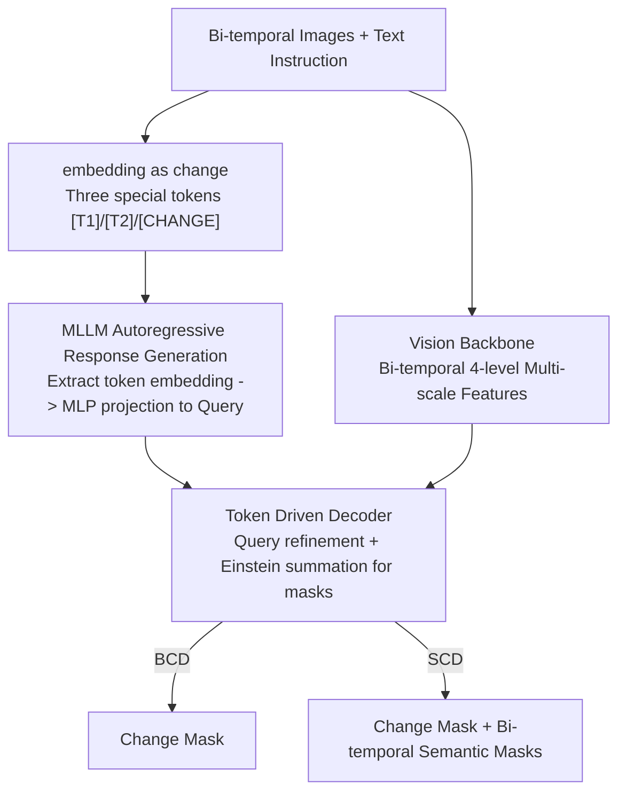

# UniChange: Unifying Change Detection with Multimodal Large Language Model

**Conference**: CVPR 2026  
**Paper**: [CVF Open Access](https://openaccess.thecvf.com/content/CVPR2026/html/Zhang_UniChange_Unifying_Change_Detection_with_Multimodal_Large_Language_Model_CVPR_2026_paper.html)  
**Code**: https://github.com/NKU-HLT/UniChange  
**Area**: Remote Sensing / Multimodal VLM  
**Keywords**: Change Detection, Multimodal Large Language Model, Special Tokens, Multi-source Joint Training, Semantic Change Detection

## TL;DR
UniChange unifies Binary Change Detection (BCD) and Semantic Change Detection (SCD) into a single MLLM-based framework. By utilizing the embeddings of three special tokens—`[T1]`, `[T2]`, and `[CHANGE]`—as "queries" to drive a segmentation decoder and replacing fixed classification heads with text prompts, it allows joint training on multi-source remote sensing datasets with conflicting category definitions. It achieves new SOTA performance on WHU-CD, S2Looking, LEVIR-CD+, and SECOND, with IoUs of 90.41, 53.04, 78.87, and 57.62 respectively.

## Background & Motivation
**Background**: Remote Sensing Change Detection (CD) compares two images of the same area at different times to identify surface cover changes. It consists of two sub-tasks: BCD, which only identifies "where it changed" (binary mask), and SCD, which also determines "from what to what" (e.g., forest to city, from-to semantic conversion). For over a decade, the dominant paradigm has been Siamese networks (FC-Siam-diff, IFN) with bi-temporal feature interaction (BiT, ChangeFormer, Changer). Recently, Vision Foundation Models (VFM) such as SAM and RSBuilding have been introduced.

**Limitations of Prior Work**: The authors highlight two unresolved structural problems. First, **dataset incompatibility**: the same ground object might be a positive sample in Dataset A (e.g., "building" change) but treated as negative background in Dataset B (e.g., a "vegetation" change dataset where buildings are not labeled). This semantic conflict prevents traditional models from training on multiple datasets simultaneously. Second, **architectural incompatibility**: BCD models only require a change decoder, whereas SCD models require dual encoders, dual decoders, and a change decoder (see Fig. 2a/2b in the original paper), resulting in structural misalignment.

**Key Challenge**: Due to these incompatibilities, the field has developed numerous "highly specialized" models—each learning limited knowledge from a single dataset with a single annotation type (either BCD or SCD), remaining independent and non-generalizable. This leads to poor generalization and weak versatility, requiring a specialized model to be retrained for every new dataset.

**Goal**: To create a single end-to-end model that **supports both BCD and SCD simultaneously and can be jointly trained on multi-source datasets with semantic conflicts**.

**Key Insight**: MLLMs inherently possess language priors and the capability to "unify different tasks"—they use the same autoregressive framework to handle heterogeneous tasks like captioning, VQA, and grounding. The authors observe that "task differences" in change detection are essentially differences in "what is being asked," which can be carried by language prompts. Text, rather than a fixed classification head, can specify the change categories to be identified.

**Core Idea**: Propose the **"embedding as change"** paradigm—reformulating both BCD and SCD as "querying changes through special token embeddings." Three special tokens—`[T1]`, `[T2]`, and `[CHANGE]`—are added to the MLLM vocabulary. The MLLM generates these tokens autoregressively in its response based on instructions. The final-layer embeddings of these tokens are then extracted as dynamic queries for the segmentation decoder. Thus, different tasks and datasets with conflicting categories are accommodated by a unified interface of "text instructions + token embeddings."

## Method

### Overall Architecture
UniChange consists of three main components: an **MLLM** (LLaVA-7B) for understanding changes, a **Vision Backbone** (RSBuilding-ViT-L, a SAM structure pre-trained on remote sensing imagery) for extracting bi-temporal features, and a **Token Driven Decoder** that translates high-level MLLM instructions into pixel-level masks.

The pipeline operates as follows: inputs are a bi-temporal remote sensing image pair $x_{img1}, x_{img2}$ and a text instruction $x_{txt}$ (e.g., "Please segment all changed areas and provide the semantic mask of the changed regions"). The MLLM uses these inputs to autoregressively generate a response sequence $y_{txt} = F_{MLLM}(x_{img1}, x_{img2}, x_{txt})$. When it intends to generate a mask for a specific change, it produces the corresponding special token at the appropriate position in the response. The system then extracts the MLLM final-layer embedding $h_{task}$ at that token's position, projects it into the visual space via a specialized MLP as $\hat{h}_{task} = \text{MLP}(h_{task})$ to serve as an "instruction-driven sparse query." Simultaneously, the Vision Backbone extracts four-level multi-scale bi-temporal features $\{F_1^i\}, \{F_2^i\}$. Finally, the query embedding and multi-scale visual features are fed into the Token Driven Decoder to produce the final mask $\hat{M}_{task} = F_{dec}(\{F_1^i\}, \{F_2^i\}, \hat{h}_{task})$. During training, only the MLLM language decoder is fine-tuned using LoRA, while the other components undergo full fine-tuning.

### Key Designs

**1. embedding as change: Unifying BCD and SCD with Three Special Token Embeddings**

This design directly addresses "BCD/SCD architectural incompatibility" and "multi-source dataset semantic conflict." Three special tokens are added to the MLLM vocabulary: `[T1]` and `[T2]` represent "a certain category of object in the T1 / T2 image," while `[CHANGE]` represents the "changed area." Under the conditional instruction $x_{txt}$, the MLLM autoregressively generates the response $y_{txt}$ and **embeds these tokens into sentences as required by the task**. For instance, a BCD task response might only contain `[CHANGE]` ("The changed building area is `[CHANGE]`"), while an SCD task would contain a sequence of categorized `[T1]`/`[T2]` ("The changed building area at time 1 is `[T1]`, the changed low vegetation area at time 1 is `[T1]`... the building area at time 2 is `[T2]`...").

The key is **using text prompts to specify the categories of change, completely discarding the fixed classification head**. Traditional models rely on a predefined N-class head; once N is fixed, "building = positive" in Dataset A and "building = background" in Dataset B clash on the same head, making joint training impossible. In UniChange, "what to find" is entirely determined by language instructions—the same `[T1]` token paired with different text can point to different categories. The model learns a unified ability to "query changes based on instructions," and category conflicts are naturally resolved at the textual level. This is why BCD (generating only `[CHANGE]` masks) and SCD (generating `[T1]`/`[T2]` semantic masks + `[CHANGE]` masks) can share the same end-to-end framework.

**2. Token Driven Decoder: Using Token Embeddings as Queries for Multi-level Refinement and Einstein Summation Masking**

Token embeddings alone are insufficient; they must be translated into pixel-level masks—the role of the Token Driven Decoder (inspired by RSBuilding). It first concatenates the three projected queries into an initial query $E^0 = \Phi_{Cat}(\hat{h}_{t1}, \hat{h}_{t2}, \hat{h}_{change})$, followed by four SAM-style decoding layers for step-by-step refinement. In each layer, bi-temporal features $F_1^i, F_2^i$ from level $i$ are flattened and concatenated into a unified visual sequence $T^i = \Phi_{Cat}(\Phi_{Flat}(F_1^i), \Phi_{Flat}(F_2^i))$. The queries and visual sequence then undergo **bi-directional interaction**:

$$E^i = FF_{FN}(A_{cross}(A_{self}(E^{i-1}), T^i)), \quad \hat{T}^i = A_{cross}(T^i, E^i)$$

Specifically, queries undergo self-attention, then cross-attention with the visual sequence, followed by an FFN. Conversely, the visual sequence is updated by the new queries (all attentions include positional encodings). After four levels of refinement, the refined visual sequences $\{\hat{T}^i\}$ are reshaped back to 2D feature maps $\{\hat{F}_1^i\}, \{\hat{F}_2^i\}$. Then, upsampling, concatenation, and fusion are performed on the T1 features, T2 features, and their element-wise difference $\hat{F}_1^i - \hat{F}_2^i$ to obtain $F_{t1}, F_{t2}, F_{change}$. Finally, the last-level refined query $E^4$ is split into $\hat{e}_{t1}, \hat{e}_{t2}, \hat{e}_{change}$, and **Einstein summation** is used to "filter" the corresponding features for mask generation: $\hat{M}_{task} = M_{gen}(F_{task}, \hat{e}_{task})$, where $task \in \{t1, t2, change\}$.

The ingenuity of this design lies in: **the change signal $F_{change}$ is explicitly constructed from the bi-temporal feature difference** (matching the physical intuition of CD), while T1/T2 semantic masks and the change mask share the same refined queries and features. The three paths of output emerge "on demand" from a single decoder—the user gets only the change path for BCD or all three for SCD. This is how the single structure flexibly generates different masks.

**3. Dual-temporal Semantic Supervision + Conditional Unified Loss: One Objective with Switchable Semantic Terms**

To enable a model to learn both binary and semantic constraints, the loss must be a "single interface adaptable to dataset types." The total loss is $L_{total} = L_{txt} + L_{mask}$, where $L_{txt}$ is the standard autoregressive cross-entropy for MLLM token generation. $L_{mask}$ is a sum of four terms:

$$L_{mask} = \lambda_{BCE}L_{BCE} + \lambda_{Dice}L_{Dice} + \lambda_{SS}L_{SS} + \lambda_{SC}L_{SC}$$

Here, $L_{BCE}$ and $L_{Dice}$ (weights 2.0 / 0.5) supervise the change mask. $L_{SS}$ (semantic segmentation cross-entropy, weight 0.5) penalizes pixel-wise bi-temporal semantic misclassification. $L_{SC}$ (semantic change loss, weight 1.0) is a highlight—it calculates the **cosine embedding distance** between bi-temporal semantic feature maps based on the binary GT mask, forcing features in unchanged regions to be similar and features in changed regions to diverge, thereby enhancing bi-temporal discriminability.

The key engineering trade-off is the **conditional switch**: when training on BCD datasets, $L_{SS}$ and $L_{SC}$ are set to zero, and they are only calculated for SCD datasets. This approach allows the same loss framework to handle both BCD data (change-only annotations) and SCD data (semantic annotations)—joint training succeeds because loss terms adaptively switch based on data type rather than requiring separate objectives.

### Loss & Training
The base model is LLaVA-7B-v1-1 with the RSBuilding-ViT-L vision backbone. Training was conducted on 4×H100(80G) for 10 epochs (400 steps per epoch) using AdamW with a base learning rate of $5\times10^{-5}$, per-device batch=1, and gradient accumulation of 8 via DeepSpeed. LoRA (rank=8, alpha=2×rank) was applied only to the language decoder, with all other components fully fine-tuned. Loss weights: $\lambda_{BCE}=2.0$, $\lambda_{Dice}=0.5$, $\lambda_{SS}=0.5$, $\lambda_{SC}=1.0$.

## Key Experimental Results

### Main Results
BCD comparison on WHU-CD / S2Looking / LEVIR-CD+ (IoU as primary metric):

| Dataset | Indicator | UniChange | Prev. SOTA | Gain |
|---------|-----------|-----------|------------|------|
| WHU-CD | IoU | 90.41 | 90.08 (ChangeCLIP) | +0.33 |
| WHU-CD | F1 | 94.96 | 94.78 (ChangeCLIP) | +0.18 |
| S2Looking | IoU | 53.04 | 50.96 (LSKNet) | +2.08 |
| S2Looking | F1 | 69.32 | 67.52 (LSKNet) | +1.80 |
| LEVIR-CD+ | IoU | 78.87 | 76.12 (SFCD-Net) | +2.75 |
| LEVIR-CD+ | F1 | 88.19 | 86.44 (SFCD-Net) | +1.75 |

SCD comparison on SECOND (including binary + semantic metrics):

| Method | IoU | mIoU | Fscd | Fbcd | SeK |
|--------|-----|------|------|------|-----|
| MambaSCD* | 57.24 | 72.73 | 62.83 | 72.81 | 21.31 |
| HGINet* | 56.13 | 71.73 | 62.88 | 71.90 | 21.83 |
| SCD-SAM* | 56.82 | 71.92 | 60.71 | 72.46 | 20.60 |
| **UniChange** | **57.62** | **72.85** | **63.50** | **73.12** | **23.02** |

UniChange ranks **first across all five metrics** on SECOND. Notably, SeK (a rigorous metric for semantic discriminability that suppresses the influence of unchanged classes) jumped from the second-best 21.83 to 23.02, the most significant improvement—indicating that the advantage is greatest in the most difficult "semantic discrimination" dimension, rather than just binary localization.

### Ablation Study

| Configuration | Key Indicator (WHU-CD IoU / S2Looking IoU) | Description |
|---------------|-----------------------------------------|-------------|
| Dual-temporal semantic supervision T1+T2 | 90.41 | Full configuration |
| T2 supervision only | 90.06 | Remove T1 supervision |
| T1 supervision only | 89.74 | Remove T2 supervision |
| No semantic supervision | 89.46 | Baseline, -0.95 drop |
| Vision Backbone: RSBuilding-ViT-L(ft) | 53.04 (S2L) | Full configuration, SeK 23.02 |
| SAM2(ft) | 50.85 (S2L) | Switch backbone, SeK 22.82 |
| SAM(frozen) | 42.36 (S2L) | Frozen backbone, SeK only 14.63 |
| LoRA rank=8 | 90.41 / 53.04 | Optimal |
| LoRA rank=32 | 90.13 / 51.70 | Excessive rank causes drop |

### Key Findings
- **Synergy effect of dual-temporal supervision**: Simultaneous supervision of T1 and T2 (90.41) > T2 only (90.06) > T1 only (89.74) > None (89.46). The monotonic increase shows that semantic constraints from both times are complementary and necessary to maximize feature discriminability.
- **RS pre-trained backbone + fine-tuning is critical**: RSBuilding-ViT-L(ft) consistently outperforms SAM/SAM2. Furthermore, fine-tuned versions crush frozen versions (Frozen SAM SeK is only 14.63 vs fine-tuned RSBuilding at 23.02), indicating that universal VFMs are insufficient for RS CD and require RS pre-training + unfreezing for adaptation.
- **Optimal LoRA rank**: rank=8 is optimal; increasing to 16/32 leads to performance drops, suggesting the language decoder requires only minor adaptation, and over-tuning harms its language priors.
- **More joint training data is better**: Adding datasets sequentially (A→A+B→A+B+C→A+B+C+D) leads to a monotonic rise in all metrics (WHU-CD IoU 89.68→90.41). This validates the core selling point: a unified interface allows joint benefits across semantically conflicting datasets.

## Highlights & Insights
- **"embedding as change" is a clean unified abstraction**: It resolves both "BCD vs SCD architectural split" and "multi-source category conflict" by using "special token embeddings + text instruction queries"—because categorization is moved to the language side, fixed classification heads disappear, and conflict is naturally resolved. This approach of replacing fixed output heads with language prompts can be transferred to any dense prediction task hindered by "inconsistent category sets" (e.g., cross-dataset semantic segmentation, open-vocabulary detection).
- **Practical explicit construction of change path**: $F_{change}$ is derived directly from $\hat{F}_1^i - \hat{F}_2^i$, hard-coding the physical prior of CD (change = difference between two moments) into the decoder. This is more stable and sample-efficient than expecting the model to learn it from scratch.
- **Conditional loss switching is an elegant trick**: Disabling semantic terms for BCD data and enabling them for SCD data allows a single objective to handle heterogeneous annotations, which is more refined than designing independent pipelines for each data type.
- **Significant SeK gains are telling**: The most pronounced advantage being in the most rigorous "semantic discrimination" metric counter-argues the criticism that MLLM methods only rely on large parameters for binary localization.

## Limitations & Future Work
- **Unacknowledged limitations**: The model is heavy (LLaVA-7B + ViT-L + SAM-style decoder, 4×H100 for training). Compared to lightweight CNN/Transformer CD models, inference costs and deployment barriers are much higher; the paper does not report inference speed or parameter count comparisons.
- **SCD validation is limited to one dataset**: Conclusions on semantic change generalization are based only on the SECOND dataset, leaving cross-domain SCD capabilities unverified. BCD tests, while covering three datasets, are focused on building/urban scenes.
- **Text instructions are human-templated**: SCD instructions involve enumerating categories (e.g., "building area is `[T1]`, vegetation is `[T1]`..."), making instructions long and dependent on prior knowledge of dataset categories. This is still a step away from "true open-vocabulary."
- **Improvement ideas**: Explore more lightweight bases (e.g., 1-3B MLLMs) with distillation; automate or hierarchize instruction generation to support more categories; verify the promise of "language priors bringing generalization" in zero-shot cross-domain and cross-sensor change detection.

## Related Work & Insights
- **vs Siamese BCD (FC-Siam-diff / BiT / Changer)**: These rely on bi-temporal feature differencing/interaction + fixed classification heads, requiring a specialized model per dataset. UniChange uses a MLLM + token query unified interface for joint multi-source training, yielding stronger generalization at the cost of being much heavier.
- **vs SCD Architectures (HRSCD / Bi-SRNet / SCD-SAM)**: These design dual-encoder-dual-decoder structures specifically for SCD, which align poorly with BCD architectures. UniChange uses the same Token Driven Decoder to output binary or semantic masks on demand, achieving true architectural unification.
- **vs RSBuilding**: RSBuilding also uses VFMs for joint training but is limited to "building" tasks. UniChange adopts its token-driven decoding idea but opens up categories via language instructions to cover any ground object changes.
- **vs Remote Sensing MLLMs (RSGPT / GeoChat / GeoPixel)**: These focused on single-image interpretation (caption/VQA/grounding), which is unsuitable for bi-temporal comparative analysis. UniChange is the first work to apply MLLM to bi-temporal pixel-level change detection grounding, filling this gap.

## Rating
- Novelty: ⭐⭐⭐⭐⭐ First MLLM framework to unify change detection. "embedding as change" resolves multi-source category conflicts using language prompts, providing a clean abstraction that bridges the long-standing split between BCD and SCD.
- Experimental Thoroughness: ⭐⭐⭐⭐ SOTA results across four benchmarks and solid ablation studies (supervision/backbone/LoRA/joint training). However, SCD is only validated on a single dataset, and inference cost comparisons are missing.
- Writing Quality: ⭐⭐⭐⭐ Motivations and derivations are clear, and framework diagrams are well-utilized. Some components (e.g., $\Phi$ operators) have slightly dense notation.
- Value: ⭐⭐⭐⭐⭐ Provides a new "unified interface + multi-source joint training" paradigm for RS CD. Open-sourced code makes it significant for cross-dataset dense prediction transfer.

<!-- RELATED:START -->

## Related Papers

- [\[CVPR 2026\] GeoDiT: A Diffusion-based Vision-Language Model for Geospatial Understanding](geodit_a_diffusion-based_vision-language_model_for_geospatial_understanding.md)
- [\[CVPR 2026\] Data Leakage Detection and De-duplication in Large Scale Geospatial Image Datasets](data_leakage_detection_and_de-duplication_in_large_scale_geospatial_image_datase.md)
- [\[ICCV 2025\] Information-Bottleneck Driven Binary Neural Network for Change Detection](../../ICCV2025/remote_sensing/information-bottleneck_driven_binary_neural_network_for_change_detection.md)
- [\[CVPR 2026\] FUSAR-GPT: A Spatiotemporal Feature-Embedded and Two-Stage Decoupled Visual Language Model for SAR Imagery](fusar-gpt_a_spatiotemporal_feature-embedded_and_two-stage_decoupled_visual_langu.md)
- [\[CVPR 2026\] ChangeBridge: Spatiotemporal Image Generation with Multimodal Controls for Remote Sensing](changebridge_spatiotemporal_image_generation_with_multimodal_controls_for_remote.md)

<!-- RELATED:END -->
