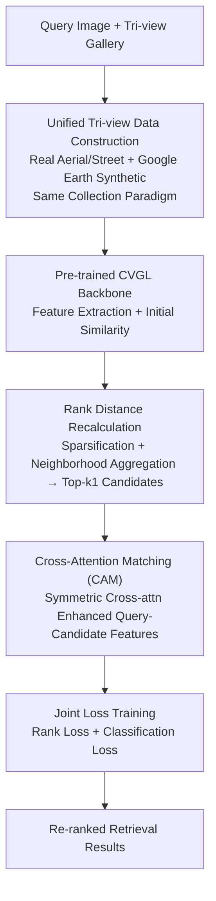

# UniGeoRS: A Unified Benchmark for Tri-view Geo-Localization

**Conference**: CVPR 2026  
**Paper**: [CVF Open Access](https://openaccess.thecvf.com/content/CVPR2026/html/Liang_UniGeoRS_A_Unified_Benchmark_for_Tri-view_Geo-Localization_CVPR_2026_paper.html)  
**Area**: Remote Sensing / Cross-View Geo-Localization  
**Keywords**: Cross-View Geo-Localization, Tri-view Dataset, Satellite-UAV-Ground, Cross-Attention Re-ranking, Real+Synthetic data

## TL;DR
UniGeoRS constructs the first cross-view geo-localization (CVGL) benchmark (1154 targets, approximately 140,000 images) that unifies satellite, UAV, and ground views while mixing real and synthetic imagery. It further proposes CAME, a plug-and-play two-stage re-ranking module that utilizes Rank Distance and cross-attention to mine inter-platform and intra-platform relationships within candidate sets, providing stable Recall@1 and AP gains across multiple mainstream CVGL models.

## Background & Motivation
**Background**: Cross-View Geo-Localization (CVGL) aims to match a query image (ground-level street view, UAV aerial view, etc.) with a set of reference images of known geographic coordinates (usually satellite imagery) based on visual similarity to infer geographic location without relying on GNSS signals, serving applications like autonomous driving, UAV navigation, and visual surveillance. Recent advances in deep learning and metric learning have matured pairwise matching for Ground↔Satellite and UAV↔Satellite.

**Limitations of Prior Work**: Issues exist in both data and task settings. Regarding data, collection costs are high; existing datasets either cover only two platforms (Ground+Satellite or UAV+Satellite) or, despite claiming tri-view status (e.g., University-1652), suffer from a severe lack of ground-view samples — averaging only 3.38 ground images per location, all of which are synthetic. Regarding tasks, most methods are designed for single sub-tasks (ground→satellite or drone→satellite) rather than joint reasoning across three platforms in a unified framework.

**Key Challenge**: The root cause is the disconnect between the "vast distribution differences across the three platforms" and the "fragmented nature of existing data/methods covering only two views." Satellite images emphasize large-scale structures, ground images capture fine textures, and UAVs serve as an intermediate perspective. This triple difference in viewpoint, content, and domain characteristics means unified tri-view CVGL lacks both training data and modeling methods. Furthermore, transferring purely synthetic UAV data to real-world scenarios involves significant domain gaps, while collecting multi-view real-world UAV imagery is expensive.

**Goal**: This work addresses two sub-problems: (1) Creating a large-scale benchmark truly covering three platforms with rich ground/UAV perspectives and a mix of real and synthetic data; (2) Designing a module that can be directly applied to existing CVGL models to explicitly utilize inter-/intra-platform relationships to improve matching.

**Key Insight**: The authors observe that after single-stage models calculate initial similarities, mismatches remain in the Top rankings because the gallery images are treated as isolated individuals, ignoring "affinity relationships" between candidates. Therefore, improvements should focus on a second-stage "re-ranking" to specifically mine internal relationships within the candidate set.

**Core Idea**: Use the unified tri-view benchmark UniGeoRS (real+synthetic) to fill the data gap, and use the CAME two-stage re-ranking module (Rank Distance recalculation + Cross-Attention feature enhancement) as a general plug-in attached to any CVGL backbone to improve matching accuracy.

## Method
As this paper is a "Dataset + Method" work, the "Method" section is divided into two parts: the **data construction pipeline** (collection and construction of UniGeoRS) and the **re-ranking algorithm** (CAME).

### Overall Architecture
UniGeoRS data side: Centered on 1154 target buildings, the authors collected satellite images (1 per target, 0.5m/pixel), UAV images (real flights + Google Earth virtual flights, average 90.17 per target), and ground images (tripod captures + Google Street View, average 32.39 per target). Real and synthetic data follow the **same collection paradigm and data format** to ensure cross-domain comparability. Images are cropped into standard blocks (satellite 1024×1024, UAV/ground 1920×1080), filtered for occlusions/low quality, and split into 854/300 targets for training/testing.

The CAME algorithm side is a two-stage re-ranker attached to existing CVGL models: The first stage uses a pre-trained CVGL backbone to extract features and compute initial similarities; the second stage uses a Rank Distance (RD) module to recalculate distances based on internal gallery relationships to produce Top-$k_1$ candidates. Then, Cross-Attention Matching (CAM) applies symmetric cross-attention to each query-candidate pair to enhance features and re-score, supervised by a joint rank loss and classification loss.

### Key Designs

**1. Unified Tri-view Data Construction: Unifying real/synthetic across three platforms using the same paradigm**

The core pain point UniGeoRS solves is that tri-view data either misses platforms, lacks diversity, or cannot mix real and synthetic data. The authors defined standard collection processes for all three platforms and ensured real and virtual paths used identical data formats and processing pipelines. Satellite images (0.5m/px) undergo radiometric correction and geometric registration before being cropped to 1024×1024. UAV images involve two paths: real UAV flights at three relative altitudes with circular paths (at least 18 images per target), and virtual paths in Google Earth 3D environments where flight radius and altitude are automatically adjusted based on building height/area (~90 images/target). Ground images are also split into real (tripod camera, ~20/target) and virtual (Google Street View API, ~30/target after filtering).

The resulting dataset contains 1154 targets, 104,051 UAV images, 1154 satellite images, and 37,376 ground street views. Compared to University-1652 (only 3.38 ground images/target and purely synthetic), UniGeoRS increases ground views to 32.39 per target and UAV views to 90.17 per target, co-existing with real data. The value lies in successfully integrating "tri-platform + real/synthetic mix + ground diversity" for unified CVGL training and evaluation.

**2. Rank Distance Module: Recalculating retrieval distance using internal gallery relationships**

Single-stage models rank directly by query-gallery Euclidean/cosine similarity, treating each gallery image as independent and ignoring affinity information. The RD module fixes this by jointly using the query-gallery similarity matrix $S_{qg}$ and the gallery-gallery similarity matrix $S_{gg}$ to revise distances. Specifically: first, **selective sparsification** keeps only Top-$k_1$ similarities per row, $\hat{S}^{ij}_{qg} = S^{ij}_{qg}$ if $S^{ij}_{qg} \ge v_i$ (where $v_i$ is the $k_1$-th largest value) else 0 (similarly for $S_{gg}$ to get $\hat{S}_{gg}$); second, **neighborhood aggregation** averages $\hat{S}_{gg}$ over Top-$k_2$ neighbors:

$$\tilde{S}^i_{gg} = \frac{1}{k_2}\sum_{l \in \mathcal{I}_i} \hat{S}^l_{gg},$$

suppressing outliers using gallery consistency. Finally, distances are recalculated as:

$$d_{RD} = 1 - S_{qg} - \hat{S}_{qg}\tilde{S}_{gg}$$

to select the Top-$k_1$ candidates $R_q$ for CAM. RD essentially embeds the "neighborhood voting" idea of k-reciprocal re-ranking into CVGL.

**3. Cross-Attention Matching: Symmetric cross-attention for alignment of cross-view features**

CAM narrows the feature gap between "Satellite—UAV—Ground" domains. For each query-candidate pair $(q, g_j)$ in $R_q$, features $f_q, f_{g_j}$ are projected via $W_Q, W_K, W_V$ for **symmetric** cross-attention: $r_q = \text{Attn}(f_q, f_{g_j})$ and $r_{g_j} = \text{Attn}(f_{g_j}, f_q)$, where $\text{Attn}(A,B) = \text{Softmax}\!\left(\frac{(AW_Q)(BW_K)^\top}{\sqrt{d}}\right)BW_V$. Residuals $\tilde{r}_q = r_q + f_q$ and $\tilde{r}_{g_j} = r_{g_j} + f_{g_j}$ maintain alignment with the original feature space. Final similarity is averaged over $s$ feature stripes:

$$S^{CAM}_{q,g_j} = \frac{1}{s}\sum_{i=1}^{s} \frac{\tilde{r}^{(i)}_q \cdot \tilde{r}^{(i)}_{g_j}}{\|\tilde{r}^{(i)}_q\|_2 \|\tilde{r}^{(i)}_{g_j}\|_2}.$$

This explicitly models semantic/geometric offsets between viewpoints, which is particularly effective for tasks like Satellite→Ground or Drone→Ground where viewpoint differences are extreme.

### Loss & Training
CAME is trained with two complementary objectives: a rank loss to enforce metric consistency (positive samples should be closer to the query than negatives in the refined space) and a cross-entropy (CE) loss on an MLP head to maintain feature discriminability. Total loss: $L_{sum} = \lambda_1 L_{Rank} + \lambda_2 L_{CE}$. Implementation details: $k_1=90, k_2=10$, 8-head cross-attention. Optimizer: AdamW (lr $1\times10^{-4}$, batch size 16, $\lambda_1=1, \lambda_2=0.5$), trained for 30 epochs on an RTX 3090.

## Key Experimental Results

### Dataset Comparison (UniGeoRS vs. Existing CVGL Datasets)

| Dataset | Year | UAV Images | UAV Source | Ground Images | Ground Img/Loc | Platforms |
| :--- | :--- | :--- | :--- | :--- | :--- | :--- |
| University-1652 | ACM2020 | 37,854 | Synthetic | 5,580 | 3.38 | Tri-platform |
| SUES200 | TCSVT2023 | 40,000 | Real | None | – | Two-platform |
| DenseUAV | TIP2024 | 18,198 | Real | None | – | Two-platform |
| GTA-UAV | AAAI2025 | 33,764 | Synthetic | None | – | Two-platform |
| VIGOR | ACM2021 | None | – | 238,696 | 1 | Two-platform |
| **UniGeoRS (Ours)** | – | **104,051** | **Real+Synthetic** | **37,376** | **32.39** | **Tri-platform** |

UniGeoRS maximizes both UAV scale (100k+, mixed) and ground diversity (32.39 ground imgs/target), and is the only mixed real/synthetic tri-platform set.

### Main Results: CAME as a plug-in for mainstream CVGL models (Selected R@1/AP)

| Model | Method | Drone→Ground AP | Satellite→Ground AP | Drone→Satellite AP |
| :--- | :--- | :--- | :--- | :--- |
| University-1652 | baseline | 10.05 | 3.47 | 58.72 |
| University-1652 | +CAME | **21.87** | **13.08** | 60.21 |
| LPN | baseline | 14.33 | 13.47 | 71.69 |
| LPN | +CAME | **24.04** | **23.73** | **72.19** |
| FSRA | baseline | 17.10 | 14.07 | 83.76 |
| FSRA | +CAME | **30.65** | **27.54** | 80.12 |
| Game4loc | baseline | 27.06 | 31.22 | 57.60 |
| Game4loc | +CAME | **37.77** | **44.35** | **58.62** |

Overall AP gains are most significant in "high-altitude↔ground" directions (Drone→Ground, Satellite→Ground).

### Ablation Study (LPN + CAME, selected Drone→Ground / Satellite→Ground AP)

| Configuration | Drone→Ground AP | Satellite→Ground AP | Description |
| :--- | :--- | :--- | :--- |
| baseline | 14.33 | 13.47 | Original LPN |
| extra training | 13.73 | 13.33 | Extended training only; no gain |
| w/o CAM | 18.44 | 14.03 | RD alone better than baseline |
| w/o RD | 23.87 | 23.71 | CAM alone (Euclidean input) also improves |
| **CAME (full)** | **24.04** | **23.73** | RD + CAM synergy is best |

### Key Findings
- **RD and CAM are complementary**: Removing either decreases performance compared to the full CAME, but both outperform the baseline, indicating that "distance recalculation via gallery relations" and "query-candidate cross-attention alignment" provide orthogonal gains.
- **Extended training is not the source of improvement**: Simply training the baseline for more epochs leads to slight performance degradation, proving CAME's gains stem from its architecture rather than longer training.
- **CAME yields highest returns on high-altitude↔ground tasks**: Perspectives with the largest semantic/viewpoint gaps (e.g., Drone→Ground AP 17.10→30.65 for FSRA) benefit most, aligning with the design goal of cross-attention matching.
- **Varied performance on 1-to-1 gallery tasks**: RD's effectiveness is limited in directions where the gallery has only one sample per location (e.g., Drone→Satellite), as neighborhood aggregation lacks sample variety.
- **UniGeoRS provides stronger generalization than SUES200**: When controlling for total sample size, training with UniGeoRS yields better results than SUES200, highlighting the value of its diversity.

## Highlights & Insights
- **Standardized real and synthetic paradigm**: By ensuring real and virtual data share image dimensions, processing pipelines, and annotation formats, the authors bridge the engineering gap that often hinders joint training.
- **Moving re-ranking into the training phase**: Unlike traditional k-reciprocal re-ranking used as post-processing during inference, CAME optimizes feature interactions during training, which could be generalized to other re-ranking tasks like person Re-ID.
- **Robust Symmetric Attention + Residual design**: The lightweight module (8-head attention) consistently improves multiple backbones (University-1652, LPN, FSRA, Samp4Geo, Game4loc) as a plug-and-play solution.
- **Empirical proof of high-altitude↔ground as the most difficult direction**: Experimental analysis of all six directions shows where current baselines are weakest and where re-ranking provides the most value.

## Limitations & Future Work
- **Scope**: Currently covers limited cities and lacks varied seasonal or weather conditions. Future work will aim for expansion and joint tri-platform feature fusion.
- **RD failure on 1-to-1 galleries**: In directions like Drone→Satellite, the neighborhood aggregation mechanism lacks enough gallery variety to be effective.
- **Real-world data ratio**: Real data covers only 42 targets (3645 images); the majority is still synthetic, which may not fully represent extreme real-world lighting or dynamic occlusions.
- **Cropping context loss**: The public version provides standardized cropped blocks, potentially losing global context layout cues utilized by some methods.
- **Pre-extracted features**: CAME relies on frozen backbone features; end-to-end joint optimization with the backbone might yield higher upper bounds.

## Related Work & Insights
- **vs. University-1652**: While both are tri-platform, UniGeoRS significantly enhances ground views (32.39 vs 3.38 images/target) and introduces real data.
- **vs. Two-view datasets (SUES200 / DenseUAV / GTA-UAV / VIGOR)**: UniGeoRS is the first to integrate all three platforms into a single benchmark for unified CVGL evaluation.
- **vs. k-reciprocal re-ranking**: CAME integrates neighborhood voting logic with learnable cross-attention during training, outperforming or complementing traditional inference-time re-ranking.
- **vs. Mainstream CVGL methods**: CAME serves as an orthogonal enhancement rather than a replacement for single-stage extraction architectures.

## Rating
- Novelty: ⭐⭐⭐⭐ The first real+synthetic unified tri-view CVGL benchmark fills a clear gap.
- Experimental Thoroughness: ⭐⭐⭐⭐ Extensive testing across 5 backbones and 6 directions, though real-world targets are limited.
- Writing Quality: ⭐⭐⭐⭐ Clear construction pipeline and mathematical formulations.
- Value: ⭐⭐⭐⭐ Dataset and plug-and-play module provide high practical value to the tri-view geo-localization community.

<!-- RELATED:START -->

## Related Papers

- [\[CVPR 2026\] RHO: Robust Holistic OSM-Based Metric Cross-View Geo-Localization](rho_robust_holistic_osm-based_metric_cross-view_geo-localization.md)
- [\[CVPR 2026\] Geo2: Geometry-Guided Cross-view Geo-Localization and Image Synthesis](geo2_geometry-guided_cross-view_geo-localization_and_image_synthesis.md)
- [\[AAAI 2026\] UniABG: Unified Adversarial View Bridging and Graph Correspondence for Unsupervised Cross-View Geo-Localization](../../AAAI2026/remote_sensing/uniabg_unified_adversarial_view_bridging_and_graph_correspondence_for_unsupervis.md)
- [\[CVPR 2026\] SinGeo: Unlock Single Model's Potential for Robust Cross-View Geo-Localization](singeo_unlock_single_models_potential_for_robust_cross-view_geo-localization.md)
- [\[CVPR 2026\] GeoBridge: A Semantic-Anchored Multi-View Foundation Model Bridging Images and Text for Geo-Localization](geobridge_a_semantic-anchored_multi-view_foundation_model_bridging_images_and_te.md)

<!-- RELATED:END -->
