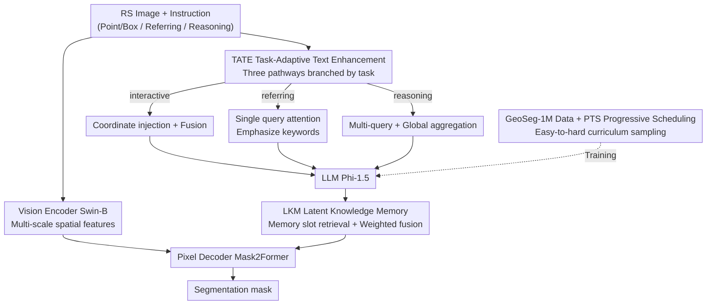

# UniGeoSeg: Towards Unified Open-World Segmentation for Geospatial Scenes

**Conference**: CVPR 2026  
**arXiv**: [2511.23332](https://arxiv.org/abs/2511.23332)  
**Code**: https://github.com/MiliLab/UniGeoSeg (Available)  
**Area**: Remote Sensing / Instruction-driven Segmentation / Multimodal  
**Keywords**: Remote sensing segmentation, Instruction-driven segmentation, Reasoning segmentation, Million-scale dataset, Unified multi-task framework

## TL;DR
The authors construct the first million-scale remote sensing instruction segmentation dataset, GeoSeg-1M (590K images, 117 categories, 1.1M triplets), along with the companion GeoSeg-Bench. They propose a unified framework, UniGeoSeg, which integrates referring, interactive, and reasoning segmentation into a single model using Task-Adaptive Text Enhancement (TATE), Latent Knowledge Memory (LKM), and Progressive Task Scheduling (PTS). It achieves state-of-the-art (SOTA) performance on GeoSeg-Bench and multiple public benchmarks with strong zero-shot generalization.

## Background & Motivation
**Background**: "Instruction-driven segmentation" in remote sensing (generating pixel masks using natural language/point/box prompts) is developing rapidly. Examples include RRSIS-D for referring segmentation, SegEarth-R1 for geographic reasoning segmentation, and SAM-inspired methods incorporating visual prompts. This paradigm makes geospatial analysis more accessible to non-professional users for urban planning, environmental monitoring, and disaster assessment.

**Limitations of Prior Work**: Existing works suffer from two major drawbacks. First, **fragmented task definitions**—most models focus on a single type (either referring, interactive, or reasoning), failing to utilize task complementarity and exhibiting poor cross-task transferability. Second, **insufficient data scale and diversity**—current remote sensing instruction segmentation datasets are small in terms of image volume, text complexity, and category coverage (the largest, RemoteSAM, contains only 71K images and 270K samples), making it difficult to support robust generalization in open-world scenarios requiring contextual reasoning.

**Key Challenge**: To achieve "unified open-world segmentation," there is a need for a large-scale dataset that **simultaneously covers three types of tasks with sufficiently rich text semantics**, as well as an architecture capable of **digesting heterogeneous instructions within a single model**. However, the semantic focus, difficulty, and data volume of these three tasks vary significantly (interactive requires spatial understanding with abundant data, while reasoning requires long text, global context, and external knowledge with scarce high-quality samples). Direct joint training causes the model to learn fragmented representations without mutual gain.

**Goal**: (1) Build a million-scale, three-task unified remote sensing instruction segmentation dataset; (2) Design a unified framework that allows heterogeneous instructions to be processed effectively while promoting cross-task knowledge sharing without separate models for each task.

**Key Insight**: The instructions for different segmentation paradigms differ fundamentally in "semantic focus" and "alignment with visual content"—interactive relies on coordinate prompts, referring focuses on keyword localization, and reasoning involves attributes, relationships, and causal inference. Therefore, rather than relying on a single text encoder, it's better to provide a **lightweight, task-specific** text enhancement pathway for each task type. Simultaneously, a shared memory can store cross-task knowledge, while curriculum-style sampling balances the difficulty gap between tasks.

**Core Idea**: "Million-scale three-task data + Task-Adaptive Text Enhancement + Shared Latent Memory + Progressive Task Scheduling" to unify fragmented remote sensing instruction segmentation into a strong baseline.

## Method

### Overall Architecture
The backbone of UniGeoSeg follows a standard vision-language segmentation design: a hierarchical vision encoder (Swin-B) for multi-scale spatial features, an LLM (Phi-1.5) for instruction parsing, and a pixel decoder (Mask2Former) for mask generation. The authors insert three mechanisms: input instructions are first processed by **TATE (Task-Adaptive Text Enhancement)** through different enhancement pathways based on task type to produce task-specific embeddings for the LLM. The LLM hidden state sequences then undergo attention-based retrieval with shared memory slots in **LKM (Latent Knowledge Memory)** to integrate cross-task knowledge. The fused representation, along with multi-scale visual features, is fed into the decoder. On the training side, **PTS (Progressive Task Scheduling)** dynamically adjusts the sampling ratio of the three tasks using curriculum learning. For the data, GeoSeg-1M is synthesized from public datasets via a "mask filtering + automatic instruction generation" pipeline.

### Key Designs

**1. GeoSeg-1M Data Construction: Mask Filtering + Tri-task Instruction Generation**

While public remote sensing datasets have pixel-level annotations, masks often contain fragmented regions, inaccurate boundaries, and inconsistent labels. The authors perform **systematic mask filtering**: decomposing masks into connected components, removing unreliable regions, and using InternVL3 with specific prompts to assess quality. From this, a **two-stage framework automatically generates instructions**—GPT-4o handles generation, while InternVL3-78B and QwenVL2-72B perform cross-scoring for quality control. Each task has a specific strategy: **Reasoning segmentation** generates "attribute reasoning" for unique regions and "contextual/relational reasoning" for similar regions (high semantic filtering, ~105K samples); **Referring segmentation** uses prompts to guide GPT-4o toward relative positions and neighborhood contexts (~336K); **Interactive segmentation** generates fixed-format prompts from mask geometry, simulating point/box interactions (~481K). The final dataset contains 590,413 images and 1,148,504 triplets across 117 semantic categories.

**2. TATE Task-Adaptive Text Enhancement: Lightweight Pathways for Heterogeneous Instructions**

Since semantic focuses differ, a single encoder might lose task-specific nuances. TATE shunts instructions: **Interactive** task projects spatial coordinates $\mathbf{C}_t$ to match text embeddings $\mathbf{E}_t$ and fuses them $\tilde{\mathbf{E}}_{\text{int}}=\mathrm{Fusion}(\mathbf{E}_t,\mathbf{Proj}(\mathbf{C}_t))$; **Referring** task uses a single learnable query $\mathbf{q}$ to attend to tokens and amplify task-relevant cues $\tilde{\mathbf{E}}_{\text{ref}}=\mathrm{softmax}\big(\frac{\mathbf{q}\cdot\mathbf{E}_t^\top}{\sqrt{d}}\big)\mathbf{E}_t$; **Reasoning** task uses $h$ queries for multi-head attention to capture multi-dimensional semantics (spatial relations, attributes, causality) followed by a global aggregation layer:

$$\mathbf{E}_{\text{res}}=\frac{1}{h}\sum_{i=1}^{h}\mathrm{softmax}\Big(\frac{\mathbf{q}_i\cdot\mathbf{E}_t^\top}{\sqrt{d}}\Big)\mathbf{E}_t+\mathbf{E}_t\mathbf{W}_G$$

These pathways allow the model to adapt without significant computational overhead.

**3. LKM Latent Knowledge Memory: Promoting Cross-Task Knowledge Transfer**

To prevent fragmented representations, LKM introduces $N$ learnable memory slots $\{\mathbf{M}_n\}_{n=1}^N$ to store task-agnostic latent representations distilled from historical pairs. For LLM output sequences $\mathbf{H}\in\mathbb{R}^{L\times d}$, it retrieves knowledge $\mathbf{Z}=\sum_{n=1}^N\mathrm{softmax}\mathbf{(H}\mathbf{M}_n^\top)\mathbf{M}_n$ and fuses it back via $\tilde{\mathbf{H}}=(1-\lambda)\mathbf{H}+\lambda\mathbf{Z}$, where $\lambda$ controls the reliance on the prior. This shared memory allows spatial localization skills from interactive/referring tasks to benefit the data-scarce reasoning task.

**4. PTS Progressive Task Scheduling: Curriculum Learning for Balanced Training**

Substantial imbalances exist in difficulty and data volume. PTS uses curriculum learning: **gradually decreasing the sampling ratio of interactive samples (eventually to 0.7), keeping referring stable, and dynamically increasing reasoning samples**. This ensures the model builds a foundational spatial reasoning capability early on via interactive tasks before focusing on complex reasoning, improving open-world generalization.

### Loss & Training
The LLM backbone is Phi-1.5, vision encoder is Swin-B (frozen), and decoder is Mask2Former (initialized with pre-trained weights). Trained using bfloat16, AdamW, initial LR $1\times10^{-4}$ with cosine decay. Images are resized to 512×512, batch size 16, 3 epochs on 8×A800 GPUs.

## Key Experimental Results

### Main Results
Evaluation metrics are gIoU (mean per-sample IoU) and cIoU (cumulative IoU).

GeoSeg-Bench (gIoU, with fine-tuned competitors):

| Method | Interactive gIoU | Referring gIoU | Reasoning gIoU |
|------|------|------|------|
| PSALM (FT) | 74.10 | 71.15 | 49.59 |
| Earthmind (FT) | 70.89 | 49.24 | 25.71 |
| LISAT (FT) | 73.00 | 62.46 | 31.25 |
| Segearth-R1 (FT) | 75.00 | 72.98 | 51.56 |
| **UniGeoSeg** | **75.56** | **74.58** | **53.12** |

Vanilla general/RS large models fail on GeoSeg-Bench reasoning (e.g., LISA gIoU of 5.77). On the EarthReason test set, Ours achieves a gain of **+6.65 cIoU / +2.16 gIoU** over the previous best; it also leads on RRSIS-D with 69.25 gIoU.

### Ablation Study
| Configuration | Interactive | Referring | Reasoning | Note |
|------|------|------|------|------|
| baseline | 82.51 | 64.62 | 32.88 | No TATE/LKM |
| + TATE | 84.61 (+2.10) | 64.70 | 35.64 (+2.76) | TATE only |
| + LKM | 81.97 (-0.54) | 65.21 (+0.59) | 33.85 (+0.97) | LKM only |
| + TATE + LKM | 84.84 (+2.33) | 66.37 (+1.75) | 37.06 (+4.18) | Full model |

Internal TATE branch ablation shows that using a single unified branch for all tasks performs worse, proving task-specific enhancement is key. PTS provides a modest boost to referring (+0.07) and reasoning (+0.31) gIoU without hurting interactive performance.

### Key Findings
- **TATE is the primary contributor**: It significantly improves both reasoning and interactive tasks. While LKM slightly hurts interactive performance when used alone, their combination results in the highest gain (+4.18 for reasoning).
- **Reasoning task remains the bottleneck**: Even fine-tuned SOTA models struggle to exceed 50-55 gIoU on reasoning, compared to 70+ for other tasks.
- **Strong zero-shot generalization**: Performs exceptionally well on zero-shot interactive segmentation (SIOR, gIoU 86.60 vs SAM2 76.45) and zero-shot localization (RSVG-DIOR gIoU 59.67).

## Highlights & Insights
- **"One dataset, three tasks" unified synthesis**: The pipeline using mask filtering (InternVL3 quality checks) and GPT-4o generation creates a high-quality million-scale factory for instruction-mask pairs.
- **Task-Adaptive Branching**: Recognizing that different instructions have different semantic focuses and providing lightweight pathways is more efficient than a single monolithic text encoder.
- **Shared Memory slots** explicitly store cross-task implicit knowledge, acting as a "knowledge commons" that allows skills learned in data-rich tasks to benefit data-sparse reasoning tasks.

## Limitations & Future Work
- **Reasoning performance still low**: gIoU of 53 is far from practical deployment; complex reasoning remains a bottleneck.
- **Dependence on closed-source GPT-4o**: Generation costs and controllability are concerns.
- **Modest PTS gains**: The curriculum scheduling strategy is currently simple (linear weighting); more sophisticated scheduling could provide better results.
- **Frozen Vision Encoder**: Freezing the Swin-B may limit adaptation to specific remote sensing textures; end-to-end fine-tuning or domain-specific pre-training might help.

## Related Work & Insights
- **vs SegEarth-R1**: SegEarth-R1 is specialized for reasoning; UniGeoSeg outperforms it on EarthReason by +6.65 cIoU, demonstrating the benefit of multi-task unified training.
- **vs RRSIS-D / RemoteSAM**: These are smaller in scale and task coverage; GeoSeg-1M provides a more comprehensive million-scale alternative.
- **vs PSALM / LISA**: While these general frameworks struggle with the domain gap of remote sensing, UniGeoSeg's customized TATE/LKM architectures handle geographic spatial relations more effectively.

## Rating
- Novelty: ⭐⭐⭐⭐ (First million-scale triple-task RS set; mechanism is a solid combination of innovations.)
- Experimental Thoroughness: ⭐⭐⭐⭐⭐ (Extensive benchmarks, zero-shot tests, and detailed ablations.)
- Writing Quality: ⭐⭐⭐⭐ (Clear structure and complete formulas.)
- Value: ⭐⭐⭐⭐⭐ (Open-source dataset and strong baseline provide a scalable foundation for the community.)

<!-- RELATED:START -->

<!-- RELATED:END -->

## Related Papers

- [\[CVPR 2026\] Prompt-Free Unknown Label Generation for Open World Detection in Remote Sensing](prompt-free_unknown_label_generation_for_open_world_detection_in_remote_sensing.md)
- [\[CVPR 2026\] ReAttnCLIP: Training-Free Open-Vocabulary Remote Sensing Image Segmentation via Re-defined Attention in CLIP](reattnclip_training-free_open-vocabulary_remote_sensing_image_segmentation_via_r.md)
- [\[CVPR 2026\] MM-OVSeg: Multimodal Optical-SAR Fusion for Open-Vocabulary Segmentation in Remote Sensing](mm-ovseg_multimodal_optical-sar_fusion_for_open-vocabulary_segmentation_in_remot.md)
- [\[CVPR 2026\] SegEarth-R2: Towards Comprehensive Language-guided Segmentation for Remote Sensing Images](segearth-r2_towards_comprehensive_language-guided_segmentation_for_remote_sensin.md)
- [\[CVPR 2026\] HySeg: Learning Generative Priors for Structure-Aware Remote Sensing Segmentation](hyseg_learning_generative_priors_for_structure-aware_remote_sensing_segmentation.md)

<!-- RELATED:END -->
