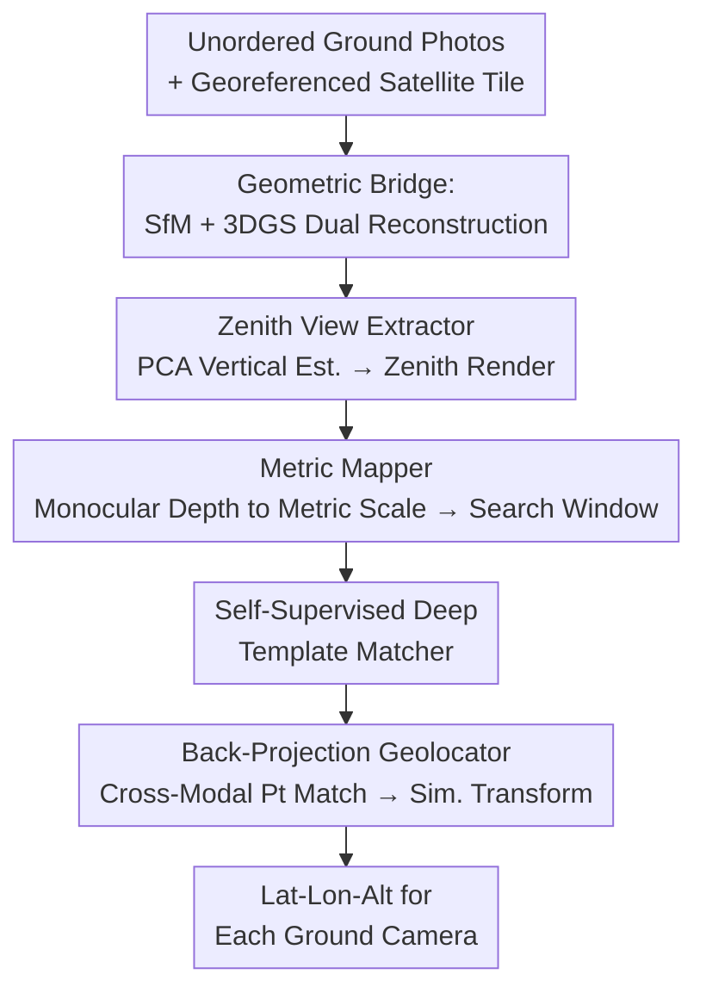

# WRIVINDER: Towards Spatial Intelligence for Geo-locating Ground Images onto Satellite Imagery

**Conference**: CVPR 2026  
**Paper**: [CVF Open Access](https://openaccess.thecvf.com/content/CVPR2026/html/Gudavalli_WRIVINDER_Towards_Spatial_Intelligence_for_Geo-locating_Ground_Images_onto_Satellite_CVPR_2026_paper.html)  
**Code**: https://github.com/Mayachitra-Inc/wrivinder  
**Area**: Remote Sensing / Cross-View Geo-Localization / 3D Reconstruction  
**Keywords**: Cross-view geo-localization, zero-shot, 3D Gaussian Splatting, SfM, satellite imagery alignment

## TL;DR
Wrivinder reconstructs a set of ground photos into a 3D scene using SfM+3DGS, renders a zenith view, and aligns it with georeferenced satellite imagery using a test-time self-supervised template matcher. This enables the estimation of GPS coordinates for each ground camera under **completely zero-shot and pairing-supervision-free** conditions, achieving sub-30-meter localization accuracy on MC-Sat.

## Background & Motivation
**Background**: Aligning ground images with satellite maps (cross-view geo-localization, CVGL) is a core capability for navigation, mapping, disaster response, and situational awareness in GPS-denied environments. The mainstream approach utilizes a large amount of **paired, georeferenced** ground-satellite data for supervised learning, casting the task as "retrieval": given a ground image, retrieve the most similar satellite crop from a database. For instance, Sample4Geo has achieved a Recall@1 of 97.83% on CVUSA, while methods like Set-CVGL and SeqGeo have extended retrieval to multi-view or sequential inputs.

**Limitations of Prior Work**: These methods face three major drawbacks. First, they rely heavily on **paired supervision**, whereas in unstructured real-world scenes like campuses, construction sites, and rural areas, paired georeferenced data is almost impossible to obtain, resulting in poor generalization under distribution shifts; they are also fundamentally not zero-shot. Second, they output a "nearest-neighbor satellite tile" instead of a **physically meaningful camera pose or GPS coordinate**. Third, they utilize 2D feature representations and lack explicit 3D reasoning, making them vulnerable to huge variations in perspective, scale, and appearance between ground and high-altitude viewpoints.

**Key Challenge**: The gap between the ground-level perspective and the overhead satellite perspective is massive; the same region can look completely different under different heights, orientations, and occlusions. One must either rely on massive paired data to force the model to learn this cross-domain correspondence (which is data-scarce and fails to generalize) or adopt a bridge **that does not rely on cross-domain learning**.

**Goal**: Given a set of unordered ground photos and a satellite tile, recover the metric GPS coordinates of all ground cameras under the conditions of zero training, zero paired data, and no assumption of a flat ground plane.

**Key Insight**: The authors propose using **geometry** instead of learning as the bridge. Since the perspective difference between the ground and satellite views is huge, the ground multi-views can first be reconstructed into a 3D scene, "rectified" to a top-down orientation to render a zenith view. This aligns the rendered view to the **same perspective** as the satellite overhead view, making alignment significantly easier. Aggregating multiple ground photos provides the multi-view constraints necessary for 3D reconstruction.

**Core Idea**: **Replace retrieval learning with geometric reconstruction + metric alignment.** The method reconstructs multi-view ground photos into a 3DGS scene with photorealistic appearance, renders a zenith view, recovers the metric scale using monocular depth to define a search window on the satellite image, and performs alignment using a test-time self-supervised template matcher to back-project and obtain the GPS coordinates of each camera.

## Method

### Overall Architecture
Wrivinder is a **zero-shot, training-free** five-stage pipeline. The input is a set of **unordered ground photos** and a **georeferenced satellite tile**, and the output is the **latitude, longitude, and altitude (Lat-Lon-Alt)** of each ground camera. The core philosophy of the entire pipeline is to "first project the ground scene to a zenith view, then compare it with the satellite":

First, standard SfM (HLOC+COLMAP / GLOMAP / VGGT-style) is applied to the unordered photos to estimate camera intrinsics/extrinsics and a sparse point cloud. Then, 3D Gaussian Splatting (Scaffold-GS / Octree-GS) densifies the scene in the **same coordinate system** into a dense scene with photorealistic appearance (§4.1). Next, PCA is applied to the sparse point cloud to estimate the vertical direction of the scene, constructing an orthogonal basis to place a virtual camera directly above the scene to render a geometrically consistent top-down (zenith) view (§4.2). After that, monocular depth (DepthPro / PatchFusion) is utilized to restore the **metric scale** of the unscaled SfM reconstruction, determining the physical dimensions (width and height in meters) covered by the zenith view. This is combined with the satellite Ground Sampling Distance (GSD) to compute the corresponding pixel search window on the satellite image (§4.3). A lightweight, **test-time self-supervised** Deep Template Matcher (Siamese ResNet-18) is then used to find the satellite region corresponding to the zenith view within this search window (§4.4). Finally, a satellite patch is cropped from the localized position and cross-modal keypoint matching is performed with the 3DGS zenith rendering. This assigns latitude and longitude coordinates to the 3DGS points, and a similarity transform propagates these coordinates to all SfM cameras, yielding the GPS for all cameras (§4.5).

### Key Designs

**1. Geometric Bridge: SfM + 3DGS Dual Reconstruction to Replace Sparse Point Clouds with Photorealistic Zenith Views**

This step directly addresses the pain point where "the gap between ground and satellite perspectives is too big for 2D features to learn cross-domain correspondences." Instead of learning cross-domain mapping, the ground scene is first reconstructed and then viewed from a different perspective. The authors use an off-the-shelf SfM solver to estimate camera poses and a sparse 3D point cloud in an **arbitrary relative coordinate system**, which is then densified using 3DGS in the **same coordinate system**. Why is 3DGS necessary instead of just using sparse point clouds? The problem with classic geometric methods (e.g., Kaminsky et al. which match sparse SfM points to satellite images using edges/free-space cues) is that sparse point clouds lack photorealistic appearance, making them extremely difficult to match under large viewpoint changes. 3DGS optimizes both the **geometry and appearance** of each Gaussian primitive, suppressing floaters and producing high-fidelity images suitable for stable zenith rendering. Compared to NeRF, 3DGS offers real-time rendering, fast convergence, and high fidelity, while preserving the geometric accuracy of SfM. Since SfM and 3DGS share the same coordinate system, zenith views rendered from either representation are geometrically consistent.

**2. Zenith View Extractor: Estimating Vertical Direction via PCA to Rectify the Scene**

To align the ground reconstruction with the satellite zenith view, one must first determine "which direction is vertically up" to render a true top-down view. The authors solve this purely geometrically: they compute the centroid $c=\frac{1}{N}\sum_i x_i$ for all 3D points $P=\{x_i\}_{i=1}^N$, and perform PCA on the mean-centered points. The covariance is $\Sigma=\frac{1}{N}\sum_i (x_i-c)(x_i-c)^\top$, yielding eigenvectors $v_1,v_2,v_3$ sorted by descending eigenvalues. **The direction of minimum variance $v_3$ typically corresponds to the ground plane normal in outdoor scenes** (since the scene extends horizontally but varies minimally in the vertical direction), so it is selected as the vertical axis. Sign ambiguity is resolved using the camera distribution: if most cameras lie in the negative hemisphere of $v_3$, it is flipped, establishing $\hat z=\mathrm{sign}\big((\bar c-c)^\top v_3\big)\,v_3$. Using the direction of maximum variance $v_1$ as the in-plane axis $\hat x$, and $\hat y=\hat z\times\hat x$, they construct the rotation $R_{\text{zenith}}=[\hat x,\hat y,\hat z]^\top$. The virtual camera is placed at $p=c+\delta\hat z$ (where $\delta$ is the 98th percentile radius in the PCA frame of the point cloud to ensure full-scene coverage) and rendered using a look-at approach. For semantic assistance, the authors also employ Mask2Former (BEiTv2 Adapter, pre-trained on COCO-Stuff, 172 classes) to segment ground classes like road, sidewalk, and grass, propagating these semantic labels to the SfM points. A consistent ground plane is then fitted jointly using "ground semantic points + camera centers" (assuming ground cameras are within ~2 meters of the ground), making the vertical/ground plane estimation much more robust.

**3. Metric Mapper: Restoring Metric Scale via Monocular Depth to Define a Satellite Search Window**

SfM reconstructions represent an **unscaled relative coordinate system**, preventing direct alignment with satellite imagery measured in meters—the precise pain point resolved here. The authors leverage monocular depth models (DepthPro / PatchFusion) to recover absolute scale. Given SfM point depths $z^{\text{sfm}}_k=e_3^\top(R_i X^{\text{sfm}}_k+t_i)$ and predicted metric depths $d^{\text{pred}}_k=D_i(u_k,v_k)$ for image $i$, they assume a global scale $s$ such that $d^{\text{pred}}_k\approx s\,z^{\text{sfm}}_k$. The scale for each image is computed via least squares as $s^\star_i=\frac{\sum_k z^{\text{sfm}}_k d^{\text{pred}}_k}{\sum_k (z^{\text{sfm}}_k)^2}$. RANSAC is implemented to handle noise, selecting the image with the lowest reconstruction error to determine the global scale $\hat s$ and scale all points via $X^{\text{metric}}_k=\hat s\,X^{\text{sfm}}_k$. Projecting the metric points into zenith coordinates and bounding the $(x,y)$ limits yields the physical dimensions $W_m, H_m$. Given the satellite Ground Sampling Distance $g$ (meters/pixel), these are converted to the target pixel dimensions $W_{px}\approx W_m/g$ and $H_{px}\approx H_m/g$. **These pixel dimensions directly define the search window size for subsequent matching**, simplifying blind full-image matching into a local search with scale priors, reducing computation and improving stability.

**4. Self-Supervised Deep Template Matcher + Back-Projection Geolocation: Coarse-to-Fine Alignment and GPS Injection**

Finally, the zenith render must be matched with the satellite image, but they exhibit severe appearance differences (3DGS rendering vs. real satellite images). The authors observed that off-the-shelf cross-modal matchers like RoMA or MatchAnything are unreliable here. The solution is a **test-time self-supervised** lightweight Deep Template Matcher (DTM), a Siamese ResNet-18 that takes two crops and outputs a similarity score. Crucially, **it requires no paired ground-satellite data** for training—it generates pseudo-GT directly from the satellite image itself. By sampling two crops matching the metric footprint of the zenith view, and applying Gaussian blur and local intensity variations ("blobby jitter") to one crop to simulate the 3DGS rendering appearance, the network is trained to predict the IoU between the two crops. This teaches the model a similarity metric invariant to viewpoint and modality changes. During inference, one branch takes the 3DGS zenith crop and the other takes all candidate crops in the satellite search window, producing a similarity heatmap where **the peak represents the coarse alignment position**. This is the "coarse" stage. For the "fine" stage (§4.5): a slightly larger satellite patch is cropped around the peak, and MatchAnything-RoMA is utilized for cross-modal keypoint matching (local matching is far more reliable than global matching). This maps latitude and longitude coordinates to the 3DGS zenith pixels $\rightarrow$ back-projects them to 3DGS points $\rightarrow$ inherits coordinates to SfM points via nearest neighbors $\rightarrow$ applies a RANSAC similarity transform to align the entire SfM reconstruction to world coordinates, outputting the GPS for all cameras. This successfully recovers the geographic poses of all cameras from only ground and satellite images.

## Key Experimental Results

### Main Results
Zero-shot evaluation was performed on the self-built **MC-Sat** benchmark (15 multi-view scenes, ~20K ground images, incorporating ULTRAA/VisymScenes/ACC-NVS/JHU-Ames, with satellite imagery from NAIP 0.6–1.0 m/px and ESRI World Imagery). The paper reports three localization metrics (Haversine distance in meters, lower is better) and SfM alignment quality (World2Model RMSE). The following table extracts representative scenes:

| Scene | Type | Satellite Source | Num. Images | World2Model RMSE | 67% RMSE | Mean RMSE | Centroid Error |
|------|------|--------|------|------------------|----------|-----------|----------|
| APL Front Door | Image Density | NAIP | 100 | 0.96 | 1.86 | 1.96 | 0.86 |
| APL Back Door | Image Density | NAIP | 100 | 1.13 | 2.56 | 2.82 | 0.76 |
| siteACC0003-finearts TR | Image Density | ESRI | 277 | 4.66 | 2.86 | 3.02 | 2.16 |
| siteSTR0003 (South America) | Reconstructed Area | ESRI | 2645 | NaN | 15.22 | 17.67 | 11.56 |
| MUTC A10 | Reconstructed Area | ESRI | 271 | 15.76 | 17.59 | 17.82 | 16.96 |
| siteSTR0008 (South America) | Reconstructed Area | ESRI | 2652 | NaN | 73.58 | 86.44 | 72.39 |

Key Observation: **Dense coverage / compact layout** Image Density scenes perform the best (the two APL entrances achieve a 67% RMSE of only 1.86–2.56 m, with centroid error < 1 m). **Large-scale Reconstructed Area** scenes show significantly higher errors, with the worst scene siteSTR0008 reaching a mean RMSE of 86.44 m. Note that the "sub-30-meter precision" mentioned in the abstract is a general summarization across dense and large-scale scenes ⚠️ refer to the original paper for exact details.

### Error Source Analysis

| Phenomenon | Associated Metric | Explanation |
|------|---------|------|
| High error in large-scale scenes | High / NaN World2Model RMSE | Roofs and tall structures are **never observed from the ground**, resulting in holes in the zenith rendering and reduced template matching reliability |
| Localization heavily relies on reconstruction stability | World2Model RMSE↑ $\rightarrow$ Localization Error↑ | Poor SfM alignment propagates to 3DGS rendering and final localization; if < 67% of images fail to register into the main cluster, this metric is marked as NaN |
| Run time scales nearly linearly with the number of images | Run Time 272–2170 min | **Computational overhead is dominated by the SfM phase** |
| Output exhibits jitter | — | Multiple pipeline stages, including SfM, utilize RANSAC, introducing some variance in results |

### Key Findings
- **Reconstruction quality defines the ceiling**: Scenes with high World2Model RMSE perform worst in localization, showing that localization accuracy is heavily constrained by the stability of SfM/3DGS reconstruction.
- **Observational coverage dictates success**: Roofs and top surfaces that cannot be captured from the ground manifest as holes in the zenith view, acting as the primary cause for elevated errors in large scenes (manifested as gaps/blurriness in Fig. 5 rendering).
- **Computational bottleneck lies in SfM**: Execution time scales nearly linearly with the number of input images, exceeding 36 hours (2170 min) for the largest scene, with SfM representing the primary cost.
- **Avenues for improvement**: Directly inject semantics into 3DGS (semantic Gaussians) to utilize semantic-enhanced splats to reduce zenith rendering artifacts and provide more robust data cues.

## Highlights & Insights
- **"Geometry as a Bridge" bypasses paired supervision**: The hardest part of cross-view alignment is cross-domain learning. This work bypasses it entirely by reconstructing the 3D scene first and then changing the viewpoint to zenith, reducing "cross-view matching" to "mono-view matching." This fundamentally eliminates dependency on paired geographic data—the most core "aha" moment.
- **Purely geometric estimation of vertical direction**: Estimating the ground plane normal using the axis of minimum variance from point cloud PCA, and resolving sign ambiguity using camera distribution, rectifies the scene with zero learning and zero annotation. This simple and robust method is directly transferable to any multi-view scene requiring top-down rendering.
- **Self-supervised training from satellite images**: DTM requires no paired ground-satellite data. It directly crops two patches from the satellite image and applies Gaussian blur and blobby jitter to one to mimic the rendered appearance, learning the correlation directly. This concept of "generating pseudo-GT from the target domain itself" serves as a valuable reference for any cross-modal matching lacking paired data.
- **Coarse-to-fine two-stage matching**: Using a lightweight Siamese network heatmap for coarse localization first, and then performing fine local keypoint matching with RoMA, effectively circumvents the unreliability of global cross-modal matching, representing a highly practical engineering trade-off.

## Limitations & Future Work
- **Heavily dependent on coverage completeness**: Roofs and high structures unobserved from the ground produce holes in zenith rendering, directly driving up error in large-scale scenes; fundamentally, the information gap from "ground to zenith" cannot be bridged by geometry alone.
- **High computational cost**: Dominated by SfM, execution time scales nearly linearly with the number of images, requiring dozens of hours for the largest scenes, which is far from real-time or online localization.
- **Metric scale relies on monocular depth quality**: Scale recovery depends on "noisy but consistent" monocular depth. Systematic depth bias can pollute the overall metric alignment (though partially mitigated by RANSAC).
- **Benchmark remains in its infancy**: MC-Sat currently only evaluates three localization RMSEs, lacking detailed evaluations such as template matching IoU accuracy or comparison across multi-resolution satellite images; the results also exhibit variance introduced by RANSAC.
- **Future directions**: Semantic-enhanced 3DGS to mitigate artifacts; more robust cross-view/cross-modal matchers; and incorporating learned geometric priors to fill unobserved surfaces.

## Related Work & Insights
- **vs Sample4Geo / Set-CVGL / SeqGeo (Supervised Retrieval-based CVGL)**: These approaches utilize massive paired data to learn ground-overhead correspondences, outputting the nearest-neighbor satellite tile. Though nearly saturated on road-centric benchmarks (CVUSA Recall@1 97.83%), they do not generalize, are not truly zero-shot, and provide no physical poses. Wrivinder requires no paired data, no fine-tuning, and no flat-ground assumptions, directly outputting metric GPS at the cost of being constrained by reconstruction quality and high compute.
- **vs Kaminsky et al. (Classic Geometric Alignment)**: Both follow the SfM + geometric cues path, but the former uses sparse point clouds + edge/free-space cost functions, which lacks appearance and is hard to match under large viewpoint changes. Wrivinder uses dense 3DGS to provide photorealistic appearance for photometric alignment.
- **vs NeRF-based Cross-View/Aerial Synthesis**: NeRF is slow to train and render. Wrivinder relies on 3DGS for real-time rendering, fast convergence, and high-fidelity output while maintaining SfM geometric accuracy.
- **vs BEV / Foundation Model Mapping**: BEV models rely on paired supervision and often assume flat ground, while foundation models have strong semantic prior but require task adaptation. Wrivinder uses explicit 3D geometric projection to obtain zenith views, enabling true zero-shot deployment and accommodating complex 3D structures.

## Rating
- Novelty: ⭐⭐⭐⭐⭐ Using "geometric reconstruction + metric alignment" instead of retrieval learning reduces cross-view matching to mono-view matching. The pipeline is novel and highly coherent.
- Experimental Thoroughness: ⭐⭐⭐⭐ Evaluated on the self-built MC-Sat across multi-source 15 scenes with detailed error analysis, but lacks direct same-benchmark comparison with supervised CVGL, and ablations are slightly limited.
- Writing Quality: ⭐⭐⭐⭐⭐ The five-stage pipeline is clearly explained with excellent correspondence between formulas and figures (Fig. 3/4/5), and failure cases are transparently discussed.
- Value: ⭐⭐⭐⭐ Establishes the first geometry-centric zero-shot ground-to-satellite baseline in realistic scenes without paired data. The dataset and code are open-sourced, offering high utility for application and follow-up research.

<!-- RELATED:START -->

## Related Papers

- [\[CVPR 2026\] IMAIA: Interactive Maps AI Assistant for Travel Planning and Geo-Spatial Intelligence](imaia_interactive_maps_ai_assistant_for_travel_planning_and_geo-spatial_intellig.md)
- [\[CVPR 2026\] GeoBridge: A Semantic-Anchored Multi-View Foundation Model Bridging Images and Text for Geo-Localization](geobridge_a_semantic-anchored_multi-view_foundation_model_bridging_images_and_te.md)
- [\[ICLR 2026\] SatDreamer360: Multiview-Consistent Generation of Ground-Level Scenes from Satellite Imagery](../../ICLR2026/remote_sensing/satdreamer360_multiview-consistent_generation_of_ground-level_scenes_from_satell.md)
- [\[CVPR 2026\] Spectrally Distilled Representations Aligned with Instruction-Augmented LLMs for Satellite Imagery](spectrally_distilled_representations_aligned_with_instruction-augmented_llms_for.md)
- [\[CVPR 2026\] NeighborMAE: Exploiting Spatial Dependencies between Neighboring Earth Observation Images in Masked Autoencoders Pretraining](neighbormae_exploiting_spatial_dependencies_between_neighboring_earth_observatio.md)

<!-- RELATED:END -->
