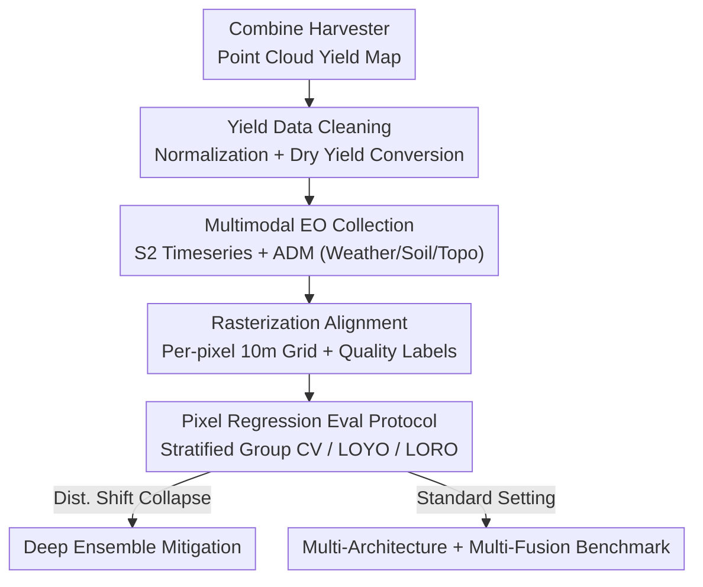

# YieldSAT: A Multimodal Benchmark Dataset for High-Resolution Crop Yield Prediction

**Conference**: CVPR 2026  
**Paper**: [CVF Open Access](https://openaccess.thecvf.com/content/CVPR2026/html/Miranda_YieldSAT_A_Multimodal_Benchmark_Dataset_for_High_Resolution_Crop_Yield_Prediction_CVPR_2026_paper.html)  
**Code**: https://yieldsat.github.io/ (Available)  
**Area**: Remote Sensing / Earth Observation / Multimodal Fusion  
**Keywords**: Crop Yield Prediction, Pixel Regression, Multimodal Remote Sensing, Sentinel-2, Distribution Shift

## TL;DR
YieldSAT formulates crop yield prediction as a "per-pixel regression" task, constructing the first multimodal remote sensing benchmark covering 4 countries and 4 crops, featuring 2,173 expert-validated fields and 12.2 million yield labels at 10m resolution. It integrates Sentinel-2 time series imagery with meteorological, soil, and topographic auxiliary data while systematically revealing model collapse caused by yield distribution shifts in real-world scenarios and providing mitigation via Deep Ensembles.

## Background & Motivation
**Background**: Digital agriculture identifies crop yield prediction as a critical capability for supporting yield insurance, policy-making, and climate adaptation. Technically, it is an image regression problem processing multimodal time-series data. Satellites like Sentinel-2 (S2) consistently provide high spatio-temporal resolution imagery that characterizes crop vegetation, water content, nutrients, and biochemical states from sowing to harvest. Consequently, "using remote sensing + deep learning to predict yield" has become a prominent research area.

**Limitations of Prior Work**: While Earth Observation (EO) data is massive and free, **labeled** EO data is extremely scarce, accounting for only 0.1% of the total unannotated volume. For yield prediction, existing public datasets either cover single crops/regions/years (e.g., SwissYield has only 73 fields in Switzerland) or have coarse resolutions (e.g., CropNet is limited to 9 km regional levels without pixel-level ground truth). Models trained on such data often collapse severely when applied to different regions or years, leading to significant industry skepticism regarding deployment.

**Key Challenge**: The cost of collecting ground truth yield data is extremely high (requiring point-by-point measurements by combine harvesters), data quality is inconsistent, and privacy regulations apply. Thus, a fundamental tension exists between the demand for large-scale, high-resolution, cross-regional, and cross-crop high-quality labels and the realities of collection. Without such a dataset, tasks like per-pixel yield regression remain stalled.

**Goal**: To release a large-scale, high-quality, multimodal dataset for sub-field level (pixel-level) yield prediction suitable for direct deep model training, and to systematically compare various deep learning architectures and fusion strategies to highlight the critical issue of distribution shift in the real world.

**Key Insight**: Explicitly model yield prediction as **per-pixel regression** (one yield label per 10m pixel). Use only globally accessible, free data with global coverage for inputs to ensure reproducibility and generalizability. Simultaneously, treat raw combine harvester measurements as "dirty data" requiring rigorous cleaning rather than ready-made labels.

**Core Idea**: Generate pixel-level ground truth via "combine harvester point cloud → rasterized yield maps," paired with S2 time series and meteorological/soil/topographic auxiliary data (ADM) to build the first pixel-level, multimodal, cross-national, and cross-crop yield benchmark. Use Deep Ensembles to address generalization collapse under distribution shifts.

## Method

### Overall Architecture
This paper presents a dataset plus a benchmark; "Method" refers to the **data construction pipeline** and the **evaluation protocol**. The pipeline transforms raw harvester point clouds into pixel-aligned multimodal time-series tensors suitable for deep models. The evaluation protocol defines a hierarchy of difficulty from standard cross-validation to Leave-One-Year-Out (LOYO) and Leave-One-Region-Out (LORO) to stress-test generalization.

Data begins with a combine harvester equipped with a yield monitor: during harvest, it records points with geographic coordinates (wet yield, moisture, lat/lon, time). These points form a "yield map" (point vector) for a field. The map undergoes cleaning, unit/language normalization, anomaly removal, and wet-to-dry yield conversion. Multimodal S2 multispectral time series and ADM are collected for each field. All modalities are rasterized to the S2 10m grid, pixel-aligned temporally, and assigned expert quality labels. The product is provided in two formats: stacked 24-step fused tensors and flexible individual modalities.

### Key Designs

**1. Yield Cleaning and Dry Yield Normalization: Transforming Dirty Measurements into Reliable Pixel-Level Ground Truth**

The fundamental difficulty of pixel-level yield ground truth lies in the high inconsistency of raw harvester data across farmers, regions, and countries—differing machine types, field naming in multiple languages, varying units, and management habits, alongside sensor errors, GPS drift, and measurement delays. The authors utilize a standardized pipeline: converting non-shapefile formats, performing automatic/semi-automatic translation of field names, unifying to metric units, and reprojecting from WGS84 to UTM. Zero-yield and biologically impossible points (including crop-specific maximum limits) are removed, and outliers are filtered using $\pm 3\sigma$. The most critical step is converting wet yield to dry (scaled) yield:

$$y_s = y_w \cdot \frac{1 - m_m}{1 - m_s}$$

where $y_s$ is dry yield, $y_w$ is wet yield, $m_m$ is measured moisture, and $m_s$ is standard moisture. Dry yield is used because it is less sensitive to measurement noise like weather or harvest timing and determines the actual revenue for farmers and traders. Each field is manually assigned a "good/average/bad" quality label by agricultural experts, allowing for stratified downstream usage.

**2. Multimodal EO Collection + Per-pixel Rasterization: Aligning Heterogeneous Resolutions onto a 10m Grid**

S2 data is insufficient alone due to cloud-induced gaps. The authors supplement it with three types of auxiliary data (ADM) based on four criteria (empirical/theoretical impact on yield, open/free, global coverage, high resolution): Weather (ERA5, daily temperature/precipitation), Soil (SoilGrids, 250m, organic carbon/nitrogen/clay/pH, etc., across 6 depth layers with uncertainty), and Topography (SRTM, 30m, processed via RichDEM for slope/curvature/aspect/TWI). All 13 S2 L2A bands are used (~5-day frequency). Low-resolution bands are upsampled to 10m using nearest neighbor, and **vegetation indices like NDVI are intentionally not pre-calculated** to preserve flexibility. The Scene Classification Layer (SCL) is included for cloud/vegetation masking.

Rasterization solves the alignment of diverse spatial/temporal resolutions. The S2 10m grid covers the yield map; all yield points falling within a pixel are averaged to create a pixel-aligned yield image. Soil/topography grids are upsampled via cubic spline interpolation. Pixels without yield points are masked. The authors also note "spatially correlated support uncertainty" introduced by harvester path density and sensor lag, providing two additional labels per pixel: (i) yield point count and (ii) standard deviation.

**3. Pixel Regression Eval Protocol (Stratified Group CV + LOYO/LORO): Quantifying Generalization Stress**

Evaluation uses **stratified group 10-fold cross-validation**—pixels are grouped by field (ensuring all pixels from one field are in either the training or test set) and stratified by region. Metrics are reported at both the sub-field (pixel) and field level (averaging pixels within a field). To address real-world distribution shifts, two harder protocols are added: **Leave-One-Year-Out (LOYO)** and **Leave-One-Region-Out (LORO)** (where a region is a collection of fields from a specific farmer or vendor).

**4. Domain-informed Deep Ensemble: Mitigating Collapse via Weight-Space Multimodal Exploration**

LOYO/LORO revealed significant collapse, which the authors mitigate using a 5-member Deep Ensemble (DE), prioritizing the lightweight 3D-LSTM architecture. Analysis in weight space explains the efficacy: under standard CV, ensemble members' weight distributions overlap; under LOYO/LORO, weights for each fold form distinct non-overlapping clusters in t-SNE. This suggests single models get trapped in specific modes during distribution shifts, while DE maintains robustness by exploring multiple modes in the weight space.

## Key Experimental Results

### Dataset Scale Comparison

| Dataset | Countries | Crops | Years | Fields | Pixel-level | Optical Res. | # Features | Expert Validated |
|--------|------|------|------|--------|--------|-----------|--------|----------|
| SwissYield | 1 | 2 | 2017–2021 | 73 | ✓ | 10 m | 14 | ✗ |
| CropNet | 1 | 4 | 2017–2022 | 0 | ✗ | 9 km | 13 | ✗ |
| **YieldSAT (Ours)** | **4** | **4** | **2016–2024** | **2,173** | **✓** | **10 m** | **72** | **✓** |

YieldSAT totals ~12.2 million 10m yield labels and 113,555 annotated S2 images across Argentina, Brazil, Uruguay, and Germany, covering maize, rapeseed, soybean, and wheat (~138,288 ha).

### Multi-Architecture Benchmark (Selected, R²↑ / RMSE↓ t/ha)

| Modality | Fusion | Model | ARG-S Field R² | ARG-S Field RMSE | URG-S Field R² |
|------|------|------|------|------|------|
| S2 | ✗ | 3D-ConvLSTM | 0.79 | 0.55 | 0.77 |
| S2 | ✗ | LSTM | 0.72 | 0.64 | 0.66 |
| S2+ADM | Input Fusion | 3D-ConvLSTM | 0.82 | 0.52 | 0.78 |
| S2+ADM | Feature Fusion (AFF) | 3D-LSTM | **0.84** | **0.49** | **0.81** |

### Distribution Shift and Deep Ensemble (Argentina Subset, Field Level)

| Crop | Model | LOYO R²↑ | LORO R²↑ |
|------|------|----------|----------|
| Soybean | Baseline LSTM | 0.50 | 0.64 |
| Soybean | DE-3D-LSTM | 0.63 | **0.73** |
| Maize | Baseline LSTM | 0.46 | 0.47 |
| Maize | DE-3D-LSTM | **0.63** | **0.76** |

## Key Findings
- **Spatial Correlation Modeling Yields Highest Gains**: Models using 3D-CNN blocks for neighborhood context (3D-LSTM, 3D-ConvLSTM, AFF) significantly outperform independent pixel models.
- **ADM is Effective but Fusion Strategy Matters**: Adding weather/soil/topo generally improves performance, but simple input fusion for complex spatiotemporal models can degrade performance; advanced feature fusion (AFF/MMGF) is required to coordinate modalities.
- **Significant Collapse under Distribution Shift**: For soybean LOYO, R² drops by 22 percentage points compared to standard CV.
- **DE Provides Robust Recovery**: On maize LORO, DE-3D-LSTM improves R² by 29 percentage points over the baseline, nearly reaching standard CV levels.
- **Strong Dependence on Country × Crop**: High performance heterogeneity exists between subsets, largely due to variations in ground truth data quality and distinct surface reflectance distributions.

## Highlights & Insights
- **Engineering of Agricultural "Dirty Data" as a First-Class Citizen**: The paper provides a clear, transferable checklist for cleaning harvester data (translation, metric conversion, dry yield calculation, etc.).
- **Explicit Labeling of Pixel-level Support Uncertainty**: Providing point counts and standard deviation for each pixel acknowledges the noise introduced by rasterization and allows for future uncertainty modeling.
- **Geometric Explanation of Generalization Collapse**: Linking performance drops to weight-space clustering provides visual evidence for why ensembles are more robust in EO regression.
- **Deliberate Exclusion of Pre-calculated Indices**: Retaining the raw 13 bands maximizes freedom for downstream feature engineering.

## Limitations & Future Work
- **Unexplored Cross-Crop/Cross-Country Evaluation**: Models currently collapse without domain adaptation when tested across different crops or countries.
- **Narrow DE Scope**: Analysis was limited to the Argentina subset and S2 data due to high computational costs of ensemble training.
- **Loss of Sub-pixel Information**: Rasterization averaging likely obscures fine-grained intra-pixel variation.
- **Ground Truth Quality Variance**: Performance on low-quality subsets may reflect label noise rather than model capacity.

## Related Work & Insights
- **vs SwissYield**: Scaled from 73 fields in one country to 2,173 fields across four, adding systematic quality grading.
- **vs CropNet**: Switched from 9km regional aggregate data to true sub-field level yield maps with 13-band multispectral data.
- **Insight**: The pipeline for dense regression ground truth (raw sensors → cleaning → rasterization → quality grading → uncertainty labeling) is a template applicable to other EO tasks like depth estimation or soil moisture inversion.

## Rating
- Novelty: ⭐⭐⭐⭐ First pixel-level multimodal cross-national yield benchmark.
- Experimental Thoroughness: ⭐⭐⭐⭐ Solid multi-arch benchmark plus distribution shift stress tests.
- Writing Quality: ⭐⭐⭐⭐ Transparent methodology and high-density information.
- Value: ⭐⭐⭐⭐⭐ Vital infrastructure for the digital agriculture and EO regression communities.

<!-- RELATED:START -->

## Related Papers

- [\[CVPR 2026\] PhenoYieldNet: Learning Crop-Aware Phenological Responses for Multi-Crop Yield Prediction](phenoyieldnet_learning_crop-aware_phenological_responses_for_multi-crop_yield_pr.md)
- [\[CVPR 2026\] RAMEN: Resolution-Adjustable Multimodal Encoder for Earth Observation](ramen_resolution-adjustable_multimodal_encoder_for_earth_observation.md)
- [\[ICLR 2026\] SelvaBox: A high-resolution dataset for tropical tree crown detection](../../ICLR2026/remote_sensing/selvabox_a_highresolution_dataset_for_tropical_tree_crown_detection.md)
- [\[CVPR 2026\] ZoomEarth: Active Perception for Ultra-High-Resolution Geospatial Vision-Language Tasks](zoomearth_active_perception_for_ultra-high-resolution_geospatial_vision-language.md)
- [\[CVPR 2026\] Cross-Scale Pansharpening via ScaleFormer and the PanScale Benchmark](cross-scale_pansharpening_via_scaleformer_and_the_panscale_benchmark.md)

<!-- RELATED:END -->
