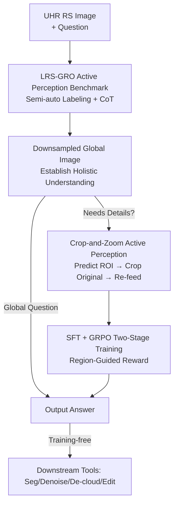

# ZoomEarth: Active Perception for Ultra-High-Resolution Geospatial Vision-Language Tasks

**Conference**: CVPR 2026  
**Paper**: [CVF Open Access](https://openaccess.thecvf.com/content/CVPR2026/html/Liu_ZoomEarth_Active_Perception_for_Ultra-High_Resolution_Geospatial_Vision-Language_Tasks_CVPR_2026_paper.html)  
**Code**: https://earth-insights.github.io/ZoomEarth (Available, commits to open-sourcing data and code)  
**Area**: Remote Sensing / Multimodal VLM  
**Keywords**: Ultra-High-Resolution Remote Sensing, Active Perception, Crop-and-Zoom, GRPO, Region-Guided Reward

## TL;DR
To address the deadlock where ultra-high-resolution (UHR) remote sensing images face "information redundancy when fed as a whole and loss of detail when downsampled," ZoomEarth enables a 3B VLM to mimic human behavior by surveying the global view before "zooming in" on regions of interest: the model predicts ROI boxes, crops the local patches from the original high-definition image, and re-feeds them for inspection. Trained via a two-stage SFT + GRPO process with a new "Region-Guided Reward" to alleviate the sparse IoU reward problem in UHR, it achieves zero-shot SOTA on the self-built LRS-GRO benchmark and three public UHR remote sensing benchmarks.

## Background & Motivation

**Background**: Applying Multimodal Large Language Models (MLLM/VLM) to remote sensing images has enabled tasks such as VQA, grounding, and segmentation. However, satellite/aerial images often cover vast geographical areas with resolutions up to 5000×5000 or even tens of thousands of pixels. Efficiently "feeding" and processing these is a core challenge. Existing approaches fall into two categories: **dynamic resolution** (processing high-resolution input directly, leading to computational explosion) and **token pruning** (removing background tokens based on heuristic rules like clustering).

**Limitations of Prior Work**: The authors classify these categories as the "passive perception" paradigm, where the model has only **one** visual input. When the model requires finer visual information, it is forced to increase the overall input resolution, consuming a large amount of irrelevant redundant tokens that interfere with reasoning. Rule-based token pruning is only effective in specific scenarios (e.g., finding bridges in large water bodies) and fails in complex backgrounds.

**Key Challenge**: There is a trade-off between "seeing clearly" and "not being overwhelmed by redundancy" in the single-input paradigm. Higher resolution provides detail but introduces redundancy; lower resolution reduces redundancy but obscures small targets. In remote sensing, where small targets are dense and objects are often large areas like "industrial zones" rather than isolated items, this contradiction is particularly acute.

**Goal**: Replace passive perception with a mechanism allowing the model to **revisit** task-relevant regions. Implementing this in UHR remote sensing faces two hurdles: (1) lack of remote sensing datasets recording explicit "active perception processes"; (2) difficulty in training the model to adaptively select regions and explore actively. Existing tool-augmentation methods (calling OCR or object detection) rely on textual clues and discrete object instances, which are absent in remote sensing images where targets are often large spatial regions.

**Key Insight**: Humans survey a large image first to gain a "holistic understanding" before focusing on "suspicious areas for a closer look." This visual search behavior is transferred to the VLM: it first views a downsampled global image, then actively boxes an ROI, which is cropped from the original HD image and zoomed in for review.

**Core Idea**: Use "active perception" instead of passive perception—the model adaptively calls a "crop-and-zoom" tool to revisit information-dense small areas. To enable training, a UHR remote sensing benchmark LRS-GRO with ROI boxes and Chain-of-Thought (CoT) annotations was created. Furthermore, a "Region-Guided Reward" adapted to remote sensing spatial distributions was designed to densify sparse IoU rewards.

## Method

### Overall Architecture
ZoomEarth addresses how to maintain both a global view and local details in UHR remote sensing. The system follows two main lines: **data construction** (LRS-GRO benchmark + semi-automatic labeling pipeline) and **model training** (SFT → GRPO two-stage training on Qwen2.5-VL-3B + Region-Guided Reward).

The inference process is straightforward: the model first receives a **downsampled global image** to establish holistic understanding. For questions requiring detail, it outputs an ROI bounding box `{"bbox_2d": [...], "label": ...}`. The system crops this box from the **original high-definition image** (referred to as "zooming" to restore native high resolution) and feeds it back to the model. Global questions (e.g., counting bridges, urban vs. rural classification) are answered directly without cropping. The trained model can also use this "crop-and-zoom" capability as a unified interface to connect with downstream models for segmentation, denoising, cloud removal, or image editing as a remote sensing agent.

### Key Designs

**1. LRS-GRO: Explicitly Labeling the "Active Perception Process"**

A major pain point is the lack of remote sensing datasets recording "where to look and how to look step-by-step," making active perception unsupervised. The LRS-GRO benchmark was constructed with images from FAIR1M-1.0, GLH-Bridge, and STAR, containing 1,224 HD images (4000–5000 px), 3,592 bounding boxes, and 13,245 questions. Questions are categorized into 17 types across three spatial hierarchies: **Global / Region / Object** (e.g., Global includes counting/season/urban-rural; Region includes existence/status/function; Object includes material/color/shape/relative position). Crucially, detail-oriented questions are paired with precise ROI boxes, distinguishing between "region-level boxes" (e.g., airports, residential areas) and "object-level boxes" (e.g., houses, planes). This hierarchy allows the model to **adaptively judge whether to crop** based on the question's scale. The SFT subset (1,000 samples) includes CoT annotations—first locating the ROI, then reasoning on the cropped details.

**2. Semi-Automatic Labeling Pipeline: Avoiding GPT Hallucinations on UHR**

Fully automatic labeling on UHR images often leads to severe GPT hallucinations regarding BBox precision. A semi-automatic approach was adopted: first, **manually** labeling BBoxes and categories with spatial descriptions (e.g., "topmost bridge," "yellow roof building") and distinguishing region/object levels. Second, the full image, cropped region, and enlarged object patches are fed to GPT-4o to generate candidate QAs regarding attributes. 40,000 candidates were generated, followed by **manual filtering and refinement** to keep 13,000 high-quality samples while balancing answers.

**3. Loss & Training (SFT + GRPO Two-stage Training)**

Complex behaviors like "viewing globally, locating, cropping, then answering" are difficult to learn in one step. **Stage 1 SFT** finetunes Qwen2.5-VL-3B to absorb remote sensing domain knowledge and learn fixed output formats for tool calls. **Stage 2 RL** uses GRPO (Group Relative Policy Optimization). Its critic-free design saves VRAM, which is essential for the ultra-long visual token sequences generated by UHR images. RL teaches **robust, generalizable decision strategies**. Table 5 shows that SFT alone might slightly degrade performance (Overall 42.80 → 41.30) when using tools; RL is what makes tool-augmented inference effective.

**4. Region-Guided Reward: Densifying Null IoU Rewards**

BBox rewards in VLM RL typically use IoU, but because VLMs are initially weak at locating objects on UHR images, predicted boxes often have zero overlap with ground truth (GT), resulting in no learning signal (Fig 5, $r_{IoU}=0$). The authors observed that geospatial objects have strong spatial correlations (e.g., planes near terminals), so **predictions closer to the GT should be rewarded**. The Region-Guided Reward provides dense signals based on the Euclidean distance between the predicted and GT centers:

$$r_{R\text{-}G} = \mathrm{sigmoid}\left(\frac{\alpha}{\text{distance} + \epsilon}\right)$$

where $\alpha$ is a resolution-dependent scale coefficient and $\text{distance}$ is the center-to-center Euclidean distance. The final weighted reward is:

$$\text{Reward} = r_{IoU} + r_{R\text{-}G} + r_{answer} + \beta \, r_{pattern}$$

$r_{answer}$ is based on word similarity normalization, and $r_{pattern}$ rewards correct output formatting ($\beta=0.05$). Ablations (Table 6) show that removing the Region-Guided Reward causes a 0.97% drop, more significant than removing the IoU reward (0.82%).

## Key Experimental Results

### Main Results

On LRS-GRO, the 3B ZoomEarth outperforms larger models even with a low initial input resolution of 512, particularly in Region/Object tasks requiring active localization:

| Model | Scale/Max Input | Global | Region | Object | Avg. Acc | APO IoU |
| :--- | :--- | :--- | :--- | :--- | :--- | :--- |
| InternVL3-8B | 3200×3200 | 71.60 | 44.58 | 47.80 | 53.67 | - |
| Qwen2.5-VL-3B | 3333×3333 | 58.90 | 31.76 | 38.66 | 42.83 | - |
| VLM-R3 (w/ tools) | 512×512 | 69.72 | 44.83 | 37.40 | 50.17 | 19.93 |
| **Ours** | **512×512** | 63.09 | **46.11** | **51.80** | **53.76** | **34.39** |

Zero-shot generalization on three public >5000×5000 UHR benchmarks also achieves SOTA:

| Model | MME-RealWorld-RS | XLRS-bench | GeoLLava-8k | Avg. Acc |
| :--- | :--- | :--- | :--- | :--- |
| InternVL3-8B | 41.00 | 36.70 | 37.60 | 38.43 |
| VLM-R3 (w/ tools) | 39.80 | 39.10 | 34.74 | 37.88 |
| **Ours** | **44.10** | **40.20** | **38.61** | **40.97** |

### Ablation Study

| Config | LRS-GRO | MME-R-W | XLRS | GeoLLaVA-8k | Note |
| :--- | :--- | :--- | :--- | :--- | :--- |
| Ours (no crop) | 51.10 | 42.10 | 30.00 | 34.30 | Remove active perception |
| + Cropping | 53.64 ↑2.57| 44.10 ↑2.00| 40.20 ↑10.20| 38.61 ↑4.31| Restore active perception |

### Key Findings
- **Crop-and-zoom is the primary contributor**, and RL is the prerequisite for its effectiveness. SFT alone only learns formatting; RL enables actual decision-making.
- **Region-Guided Reward > IoU Reward**: On UHR images where IoU is often zero, dense rewards based on distance are more effective, particularly for region-level comprehension (+2.44%).
- **Increasing resolution blindly is ineffective** (Table 7): Increasing input from 512 to 3333 without cropping barely improves accuracy while nearly halving speeds. Active perception with 512 input achieves better results more efficiently.

## Highlights & Insights
- **Paradigm Reframing**: Classifying dynamic resolution and token pruning as "passive perception" contrasts them effectively with "revisiting active perception," supported by data showing that passive scaling hits a bottleneck.
- **Solving the Sparse Reward Problem**: The "center distance sigmoid" densifies rewards in a simple yet effective way, grounded in geographical spatial intuition.
- **Efficiency**: A 3B model with 512 input outperforms an 8B model with 3200 input on local tasks, making it attractive for compute-limited applications.
- **Unified Tool Interface**: Treating the crop-and-zoom capability as an interface for other models (de-clouding, segmentation) creates a versatile remote sensing agent.

## Limitations & Future Work
- **Qualitative Downstream Tools**: Downstream capabilities (cloud removal/denoising) are demonstrated only qualitatively without training-free quantitative benchmarks.
- **Single-step Cropping**: The method uses a single "global → crop" step, lacking iterative zoom-in/zoom-out capabilities for complex reasoning.
- **Manual Annotation Dependency**: Despite the semi-automatic pipeline, manual BBox and filter costs remain high for scaling.
- **Global Context Weakness**: Active perception provides limited gains for global contextual questions, where larger models still hold an advantage.

## Related Work & Insights
- **vs. Dynamic Resolution**: Methods like Qwen2.5-VL process high-resolution inputs directly but suffer from high compute and redundancy interference. ZoomEarth uses low-res global views + selective high-res crops.
- **vs. Token Pruning (GeoLLava-8k)**: Rule-based pruning lacks generalization to complex backgrounds. ZoomEarth allows the model to **autonomously** decide where to look.
- **vs. Tool-Augmented VLM (VLM-R3)**: These rely on OCR and discrete objects. ZoomEarth introduces multi-scale localization and rewards specifically designed for remote sensing spatial distributions, doubling the APO IoU.

## Rating
- Novelty: ⭐⭐⭐⭐ Solid domain adaptation of active perception with a novel dense reward.
- Experimental Thoroughness: ⭐⭐⭐⭐ Good coverage of main, zero-shot, and ablation results.
- Writing Quality: ⭐⭐⭐⭐ Clear paradigm comparison and well-explained reward design.
- Value: ⭐⭐⭐⭐ Provides a high-quality benchmark and a practical small-model solution for the community.

<!-- RELATED:START -->

## Related Papers

- [\[CVPR 2026\] GeoDiT: A Diffusion-based Vision-Language Model for Geospatial Understanding](geodit_a_diffusion-based_vision-language_model_for_geospatial_understanding.md)
- [\[ICLR 2026\] Towards Faithful Reasoning in Remote Sensing: A Perceptually-Grounded Geospatial Chain-of-Thought for Vision-Language Models](../../ICLR2026/remote_sensing/towards_faithful_reasoning_in_remote_sensing_a_perceptually-grounded_geospatial_.md)
- [\[CVPR 2026\] YieldSAT: A Multimodal Benchmark Dataset for High-Resolution Crop Yield Prediction](yieldsat_a_multimodal_benchmark_dataset_for_high-resolution_crop_yield_predictio.md)
- [\[CVPR 2026\] AVION: Aerial Vision-Language Instruction from Offline Teacher to Prompt-Tuned Network](avion_aerial_visionlanguage_instruction_from_offli.md)
- [\[CVPR 2026\] LookasideVLN: Direction-Aware Aerial Vision-and-Language Navigation](lookasidevln_direction-aware_aerial_vision-and-language_navigation.md)

<!-- RELATED:END -->
