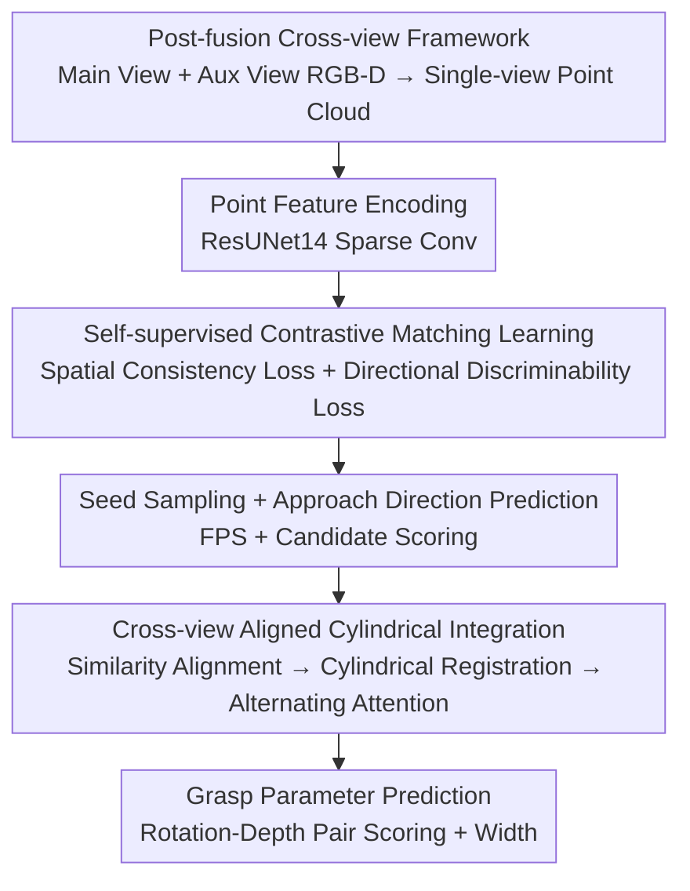

# A Cross-view Fusion Framework for Robust 6-DoF Grasp Pose Estimation

**Conference**: CVPR 2026  
**Paper**: [CVF Open Access](https://openaccess.thecvf.com/content/CVPR2026/html/Zhu_A_Cross-view_Fusion_Framework_for_Robust_6-DoF_Grasp_Pose_Estimation_CVPR_2026_paper.html)  
**Code**: Available (Open sourced per paper, link in GitHub body)  
**Area**: Robotics / Embodied AI  
**Keywords**: 6-DoF Grasping, Cross-view Fusion, Self-supervised Contrastive Learning, Point Cloud Registration, Cylindrical Coordinates

## TL;DR
Addressing the issue of unstable 6-DoF grasping caused by occluded geometric information in "corner views" of single-view point clouds, this paper proposes a **post-fusion** framework utilizing an **auxiliary view** captured easily by a robotic arm. By employing self-supervised contrastive learning, cross-view point features are mapped to be "spatially consistent + directionally discriminable." A "Cross-view Aligned Cylindrical Integration" module fuses geometry from two views within a grasp-related cylindrical neighborhood. On GraspNet-1Billion, the Seen split AP reaches 74.08 (RealSense, +3.55 Gain), with a 96% clearing success rate on a real robotic arm.

## Background & Motivation

**Background**: 6-DoF grasp pose estimation is a foundational task for robotic manipulation, rearrangement, and embodied AI. Early CNN methods detected graspable rectangles in 2D images (3-DoF); current mainstream approaches directly predict 6-DoF poses from single-view RGB-D back-projected scene point clouds (GraspNet, GSNet, EconomicGrasp, etc.), with GraspNet-1Billion providing large-scale real annotations.

**Limitations of Prior Work**: Single-view observations inherently suffer from occlusions—especially in "corner views" where the camera views the scene diagonally. This leads to substantial self-occlusion of objects and the loss of critical grasping geometry (approach surfaces, symmetric structures), resulting in non-robust estimation. One remedy is "simultaneous grasping and scene reconstruction" (predicting while completing geometry), which requires reconstruction labels and slows down execution due to post-processing. Another is "multi-view reconstruction before grasping" (VGN, GeneGN), but complete reconstruction is time-consuming (5.4 s in paper tests). Approaches like RVT rely on multiple calibrated external cameras, increasing hardware costs and reducing environmental flexibility.

**Key Challenge**: The desire to complement geometry using multiple views without the temporal cost of "reconstructing the complete scene first." Furthermore, without specific constraints on cross-view features, features from corner views deviate from the training distribution, preventing alignment and fusion with clear views. This creates tensions between **Geometric Completeness ↔ Grasp Latency** and **Cross-view Feature Consistency ↔ Grasp Direction Discriminability**.

**Goal**: (1) Supplement corner-view geometry using **a single auxiliary view** obtained conveniently by the robotic arm, without complete reconstruction; (2) Ensure cross-view point features are both spatially consistent and directionally discriminable to support fusion; (3) Perform fine-grained cross-view interaction on grasp-related local geometry.

**Key Insight**: The authors noted that a wrist-mounted camera can easily capture an auxiliary view by changing posture via arm movement. Thus, they abandoned "reconstruction-then-grasp" **pre-fusion** in favor of **post-fusion**, where features are extracted independently and fused only in grasp-related regions. This preserves high-resolution single-view geometric details, requires only one auxiliary view, and is latency-friendly.

**Core Idea**: Replace "complete reconstruction + pre-fusion" with "auxiliary view + post-fusion." Use **cross-view association** for self-supervised point feature regularization and fuse geometry from two views in a **cylindrical coordinate grasp neighborhood**, specifically targeting corner-view robustness.

## Method

### Overall Architecture
The input consists of a pair of cross-view RGB-D observations (Main View + Auxiliary View), back-projected into single-view point clouds. The output is a set of 6-DoF grasps $g=\{R,t,w\}$ (rotation, translation, gripper width). Following the decoupling logic of GraspNet, rotation is split into an **approach direction** $A\in\mathbb{R}^3$ and **in-plane rotation** $r$. Translation is determined by a seed point $p_s$ and approach depth $d$ along $A$. The network scores a set of **pre-defined candidates** rather than directly regressing these continuous variables.

The pipeline comprises three stages: ① Sparse convolutional ResUNet14 extracts features for each single-view point cloud, predicting objectness/graspability, sampling seeds, and predicting approach directions (scaffolding); ② During training, **Self-supervised Contrastive Matching Learning** uses cross-view point pairs (match/non-match) to regularize point features for spatial consistency and directional discriminability; ③ In the cylindrical neighborhood of each seed, the **Cross-view Aligned Cylindrical Integration Module** fuses main, auxiliary, and aligned region geometries into a comprehensive representation, followed by an MLP to predict grasp scores and widths for "rotation-depth" pairs. Stage ② serves as training-time feature regularization, while ③ is inference-time geometric fusion; together they ensure robust prediction under corner views.

### Key Designs

**1. Post-fusion Cross-view Framework: Complementing geometry with one auxiliary view without reconstruction latency**

The pain point is that single-view corner views lose geometry due to occlusion, while "reconstruction-then-grasp" pre-fusion requires reconstruction labels and is slow (5.4 s). Ours uses **post-fusion**: two views pass through a shared backbone to extract **high-resolution single-view point features**, and fusion occurs only in local regions related to the grasp. This avoids the loss of geometric detail often seen when multi-view data is flattened in pre-fusion and limits overhead to simply "capturing one extra view." In ablations, direct pre-fusion (with the same auxiliary view) only increased AP by 0.32, whereas the proposed framework gained 6.41. The authors attribute this to pre-fusion losing geometric details and the network's poor generalization to relative cross-view transformations—highlighting the necessity of "independent feature extraction + local post-fusion." In real experiments, reconstruction overhead dropped from 5.4 s (multi-view) to 1.2 s, which is only 1.4 s more than single-view but yields a +14% success rate.

**2. Self-supervised Contrastive Matching Learning: Pulling features to be "spatially consistent + directionally discriminable"**

Relying solely on single-view supervision has two risks: features in partially visible areas of corner views easily deviate from the training distribution, and graspable points with different approach directions on the same object share identical labels, causing features to become indistinguishable. The authors use a shared backbone to encode cross-view point clouds and generate match/non-match pairs during training: **match** pairs are points from both views corresponding to the same 3D location; **non-match** pairs are points on the same object with significantly different approach directions. Two losses are defined—the Spatial Consistency Loss pulls match points closer:

$$\mathcal{L}_{con}=\frac{1}{N_{mat}}\sum_{N_{mat}}\|f^{1}_{mat}-f^{2}_{mat}\|_2^2,$$

allowing feature learning in occluded areas of the corner view to be "supervised" by corresponding points in the clear view, maintaining consistency in 3D space. The Directional Discriminability Loss uses an adaptive hinge loss to push non-match points with different directions apart:

$$\mathcal{L}_{dis}=\frac{1}{N_{non}}\sum_{N_{non}}\max(0,\,M-\|f^{1}_{non}-f^{2}_{non}\|_2)^2,$$

where the adaptive margin $M=1-\cos(\theta)$ and $\theta$ is the angle between approach directions. A larger angular difference leads to a larger push, restoring directional discriminability. Total loss: $\mathcal{L}=\mathcal{L}_{sup}+\lambda_{self}(\mathcal{L}_{con}+\mathcal{L}_{dis})$ ($\lambda_{self}=0.2$). t-SNE visualizations show: baseline features are inconsistent across views; adding only consistency loss achieves consistency but lacks discriminability; only both together achieve both.

**3. Cross-view Aligned Cylindrical Integration: Aligning, registering, and fusing cross-view geometry via alternating attention**

Accurate grasp parameter prediction requires a comprehensive representation of local geometry, which might be occluded in a single-view neighborhood. This module incorporates the auxiliary view in three steps. **Similarity Alignment (SimAli)**: Defines a fixed-scale cylindrical region centered at seed $p_s$ along direction $A$, samples $K$ neighbors, and projects both views into an aligned coordinate system. Recognizing that sensor noise and robot motion error accumulate, the authors use **joint coordinate and feature similarity** to establish cross-view correspondences based on point cloud registration logic:

$$\mathbf{S}_{ij}=-\|p_i^{v_1}-p_j^{v_2}\|_2^2+\lambda_{feat}\left\langle \tfrac{f_i^{v_1}}{\|f_i^{v_1}\|_2}, \tfrac{f_j^{v_2}}{\|f_j^{v_2}\|_2}\right\rangle,$$

Matching pairs above a threshold are averaged to obtain denoised aligned pairs $\bar{\mathcal P}_K,\bar{\mathcal F}_K$. **Cylindrical Coordinates Registration (CylReg)**: Converts Euclidean coordinates $p=(x,y,z)$ to cylindrical coordinates $p'=(\theta,r,d)$, where $\theta=\mathrm{atan2}(z,y)$, $r=\sqrt{y^2+z^2}$, and $d=x$. The elegance lies in $(\theta, r, d)$ **directly corresponding to in-plane rotation, grasp width, and grasp depth**, respectively. This relieves the network from deriving parameters from Euclidean space and explicitly emphasizes rotational symmetry. Features are updated as $\hat f=f+\mathrm{MLP}(p')$. **Alternating Attention (AltAtt)**: To maintain fine-grained geometry, long sequences are needed, but global self-attention is costly. Borrowing from VGGT's multi-frame transformer design, it alternates between **Local Self-Attention** (extracting structures within each view and the overlap) and **Seed Cross-Attention** (aggregating cross-view context into the seed feature $\tilde f_s$), achieving explicit interaction with reduced computation.

### Loss & Training
Total Loss = Supervised Loss $\mathcal{L}_{sup}$ (point-level object classification cross-entropy + grasp quality $L_2$ regression; seed-level $L_2$ for pre-defined direction, width, and rotation-depth scores) + Self-supervised term $\lambda_{self}(\mathcal{L}_{con}+\mathcal{L}_{dis})$. Key hyperparameters: $N=15000$ points, feature dimension $C=512$, $N_s=1024$ seeds, $N_A=300$ directions, $K=8$ cylindrical neighbors, $N_r=12$ in-plane rotations, $N_d=4$ depths; weights $\lambda_g=10, \lambda_A=100, \lambda_w=10, \lambda_G=15, \lambda_{self}=0.2$. Trained for 8 epochs on GraspNet-1Billion training set using an RTX TITAN; auxiliary views are sampled randomly from 256 views of the same scene during testing.

## Key Experimental Results

### Main Results
GraspNet-1Billion (190 scenes, 256 views, RealSense/Kinect cameras), categorized by Seen/Similar/Novel objects. AP table (RealSense/Kinect):

| Method | Seen AP | Similar AP | Novel AP |
|------|---------|-----------|----------|
| GSNet | 65.70/61.19 | 53.75/47.39 | 23.98/19.01 |
| EconomicGrasp | 68.21/62.59 | 61.19/51.73 | 25.48/19.54 |
| ZeroGrasp | 70.53/— | 62.15/— | 26.46/— |
| **Ours (2 views)** | **74.08/64.20** | **62.38/53.41** | **27.27/21.38** |

Compared to the SOTA on RealSense (ZeroGrasp), Seen/Similar/Novel improved by +3.55/+0.23/+0.81. Compared to EconomicGrasp on Kinect, improvements were +1.61/+1.68/+1.84.

Real robot clearing (Dobot CR5 + RealSense D435, 12 unseen objects, 3 repetitions per scene):

| Method | Success Rate SR | Reconstruction Time |
|------|-----------|----------|
| GraspNet-Baseline | 77% | — |
| GSNet (Single-view) | 82% | — |
| Multi-view (6 views) | — | 5.4 s |
| **Ours** | **96%** | **1.2 s** |

Ours outperforms GSNet/GraspNet-Baseline by 14%/19%. Reconstruction time dropped from 5.4 s (multi-view) to 1.2 s, with a total latency of 4.6 s (vs 3.2 s for single-view). Spending 1.4 s more yields a +14% SR, showing a good efficiency-accuracy trade-off.

### Ablation Study
RealSense test set, cumulative components (based on baseline; last two columns are ΔAP and cumulative Gain vs. baseline):

| Configuration | Seen AP | ΔAP (Current) | Cumulative Gain |
|------|---------|-------------|----------|
| baseline | 63.80 | 0.00 | 0.00 |
| Direct pre-fusion (Aux view) | 64.34 | +0.32 | +0.32 |
| + SpaCon (Consistency Loss) | 67.26 | +1.97 | +2.29 |
| + DirDis (Discriminability Loss) | 69.36 | +1.20 | +3.49 |
| + SimAli + CylReg (Align+Cyl-Reg) | 70.61 | +0.82 | +4.31 |
| + AltAtt (Alt-Attention) | 72.39 | +1.34 | +5.65 |
| + Auxi-view (Auxiliary View enabled) | **74.08** | +0.76 | **+6.41** |

### Key Findings
- **Post-fusion ≫ Pre-fusion**: Given the same auxiliary view, direct pre-fusion only yields +0.32, whereas the full framework yields +6.41. This validates the necessity of "independent feature extraction + local post-fusion."
- **Self-supervised Contrastive Learning is the primary contributor**: Even with single-view observation, SpaCon+DirDis improves Seen/Similar/Novel by +5.56/+2.63/+2.28; the cylindrical module plus auxiliary view adds another +4.72/+2.85/+1.19.
- **Solving Corner Views**: In Seen, for 20 difficult "corner view" samples where baseline AP < 40, the average gain was 28.11, far exceeding the global average gain of 10.28.
- **Significance of Cylindrical Coordinates**: $(\theta, r, d)$ maps directly to grasp parameters (rotation/width/depth), reducing the burden of regressing from Euclidean coordinates and explicitly utilizing rotational symmetry.

## Highlights & Insights
- **"Just one more look" instead of "Complete Reconstruction"**: Leverages arm-mounted camera mobility for post-fusion. Using only one auxiliary view significantly reduces occlusion with much lower latency—a great example of design informed by system constraints (latency, hardware).
- **Cross-view correspondence as free supervision**: Aligning match points across views "borrows" features from clear views for occluded ones. Using angular differences for non-match adaptive margins directly addresses the "blurred directional discriminability" issue.
- **Cylindrical coordinates for grasp semantics**: Registering local geometry into a cylindrical system aligns coordinate axes with grasp parameters, which is transferable to any pose regression task with rotational symmetry or polar semantics.
- **Alternating attention for efficiency**: Alternating between local self-attention and seed cross-attention preserves fine-grained detail while managing computational cost.

## Limitations & Future Work
- **Dependency on relative transformations**: The module requires known relative transforms to project views. While calibration or kinematics can provide this, errors may limit the effectiveness of SimAli (⚠️ The paper lacks a sensitivity curve for transformation noise).
- **Auxiliary view acquisition**: Requires an arm to move the camera, making it inapplicable to fixed-camera or stationary platforms; optimal strategy for selecting the auxiliary view position was not explored.
- **Random sampling of auxiliary view**: Testing used random sampling; investigating "active perception" to select the optimal auxiliary view is a natural extension.
- **Candidate scoring paradigm**: Accuracy is capped by the granularity of pre-defined candidates ($N_A=300, N_r=12, N_d=4$).

## Related Work & Insights
- **vs GSNet/EconomicGrasp (Single-view 6-DoF)**: These suffer from corner-view occlusions. Ours adopts their seed+candidate framework but introduces auxiliary views and cross-view regularization for superior robustness.
- **vs VGN/GeneGN (Multi-view Pre-fusion Reconstruction)**: They reconstruct first, which is slow and loses local detail. Ours uses post-fusion to keep fine-grained geometry in cylindrical regions, reducing latency from 5.4 s to 1.2 s.
- **vs Simultaneous Reconstruction (ZeroGrasp, etc.)**: Those require reconstruction labels and post-processing. Ours uses self-supervised cross-view correspondence to regularize features without labels or post-processing.
- **vs Point Cloud Registration (DCP/Predator)**: Borrows the idea of establishing correspondences to establish SimAli, but targets geometric fusion rather than pose registration.

## Rating
- Novelty: ⭐⭐⭐⭐ Combination of "Auxiliary view post-fusion + Self-supervised cross-view regularization + Cylindrical coordinate alignment" is novel and well-motivated.
- Experimental Thoroughness: ⭐⭐⭐⭐ Comprehensive testing on GraspNet-1Billion, real robot clearing, ablations, and corner-view analysis; lacks transformation error sensitivity.
- Writing Quality: ⭐⭐⭐⭐ Logical flow from motivation to method; Fig 2 is clear.
- Value: ⭐⭐⭐⭐ 96% success rate and low latency provide direct engineering value for mobile robotic grasping systems.

<!-- RELATED:START -->

## Related Papers

- [\[CVPR 2026\] GraspGen-X: Cross-Embodiment 6-DOF Diffusion-based Grasping](graspgen-x_cross-embodiment_6-dof_diffusion-based_grasping.md)
- [\[CVPR 2026\] RoboTAG: End-to-end Robot Pose Estimation via Topological Alignment Graph](robotag_end-to-end_robot_pose_estimation_via_topological_alignment_graph.md)
- [\[ECCV 2024\] An Economic Framework for 6-DoF Grasp Detection](../../ECCV2024/robotics/an_economic_framework_for_6-dof_grasp_detection.md)
- [\[CVPR 2026\] Learning to Act Robustly with View-Invariant Latent Actions](learning_to_act_robustly_with_view-invariant_latent_actions.md)
- [\[CVPR 2026\] HQC-NBV: A Hybrid Quantum-Classical View Planning Approach](hqc-nbv_a_hybrid_quantum-classical_view_planning_approach.md)

<!-- RELATED:END -->
