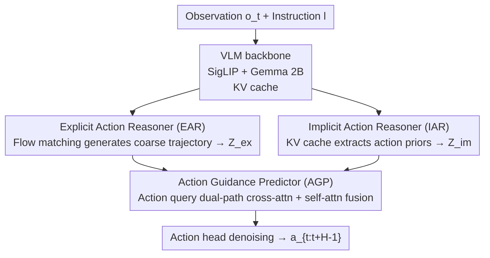

# ACoT-VLA: Action Chain-of-Thought for Vision-Language-Action Models

**Conference**: CVPR 2026  
**Paper**: [CVF Open Access](https://openaccess.thecvf.com/content/CVPR2026/html/Zhong_ACoT-VLA_Action_Chain-of-Thought_for_Vision-Language_Models_CVPR_2026_paper.html)  
**Code**: https://github.com/AgibotTech/ACoT-VLA  
**Area**: Robotics / Embodied AI  
**Keywords**: VLA, Action Chain-of-Thought, Robotic Manipulation, Flow Matching, Explicit/Implicit Reasoning

## TL;DR
The "intermediate reasoning" of VLA is replaced from language subtasks or target images with **coarse-grained reference action sequences in the action space** (Action Chain-of-Thought). An explicit action reasoner generates reference trajectories, while an implicit action reasoner extracts action priors from the VLM's KV cache. These two pathways jointly condition the action head, achieving SOTA on LIBERO/LIBERO-Plus/VLABench simulation benchmarks and real-world hardware.

## Background & Motivation

**Background**: Mainstream Vision-Language-Action (VLA) models use pre-trained VLMs to encode images and instructions into latent representations, which are then used by an action decoder to directly predict actions. To improve this "input $\to$ action" mapping, two categories of "intermediate reasoning" have emerged: **Language CoT** (predicting subtasks first, e.g., $\pi_{0.5}$, ThinkAct) and **Visual CoT / World Models** (synthesizing target images or predicting future observations, e.g., CoT-VLA, WorldVLA, DreamVLA).

**Limitations of Prior Work**: Whether language subtasks or synthesized target images, these intermediate products reside in the **vision-language (input) space**, which is heterogeneous relative to the **low-level action (output) space**. VLM backbones are pre-trained on web-scale corpora for "semantic alignment and Q&A," making their representations excellent for language understanding but **unsuitable for physical dynamics**. World models also predict visual states. Thus, these intermediate steps provide only "indirect, abstract" guidance and fail to transmit fine-grained motion information required for precise execution.

**Key Challenge**: The paper identifies this as the **semantic-kinematic gap**—a fundamental disconnect between high-level abstract inputs and low-level executable motor commands. To bridge this gap, guidance signals must be **kinematically consistent** rather than purely semantic or visual.

**Goal + Core Idea**: Instead of detouring through the input space, the "thinking" process should occur directly in the action space. The authors propose **Action Chain-of-Thought (ACoT)**: redefining the "thought" in CoT as a sequence of **explicit, kinematically grounded action intentions (coarse-grained reference action sequences)** that feed motion cues directly to the policy. The challenge is synthesizing high-dimensional motion cues robustly and efficiently from raw multimodal inputs. The solution involves extracting action information in two forms: explicit (observable trajectories) and implicit (action distributions implied in language/vision, like "reach" or "grasp").

## Method

### Overall Architecture

ACoT-VLA is built upon $\pi_{0.5}$. Inputs consist of current visual observation $o_t$ and language instruction $l$, and the output is an action sequence $a_{t:t+H-1}$. All modules share the key-value cache extracted from the same VLM backbone (SigLIP visual encoder + Gemma 2B, $N=18$ layers). The pipeline consists of three components:

1. **Explicit Action Reasoner (EAR)**: A lightweight Transformer that takes a noisy reference action sequence and uses cross-attention with the VLM's KV cache. It uses flow matching to generate a **coarse-grained reference trajectory** $a^{ref}$, which is projected into explicit action guidance $Z^{ex}$. This functions as a "draft" in the action space.
2. **Implicit Action Reasoner (IAR)**: Uses learnable queries to perform cross-attention on the KV cache of every VLM layer, extracting action semantics (affordance, action tendencies) hidden in vision-language representations to aggregate implicit action guidance $Z^{im}$. This "squeezes" the implied action distribution out of the VLM.
3. **Action Guidance Predictor (AGP)**: Treats noisy action segments as queries to perform dual-path cross-attention with $Z^{ex}$ and $Z^{im}$, followed by self-attention fusion to feed the action head for denoising and final execution.

The core concept is that ACoT expands the guidance signal $g$ from traditional language-level $g_{lang}$ and visual-level $g_{vis}$ to a third category—**action-level $g_{action}$**, further split into explicit $g^{ex}_{action}$ and implicit $g^{im}_{action}$.

### Key Designs

**1. Explicit Action Reasoner (EAR): Generating a "Draft Trajectory" in Action Space**

EAR addresses the indirect nature of language/visual guidance by generating a **coarse-grained reference action sequence** as an explicit cue. It is implemented as a lightweight Transformer ($N=18$ layers) that takes noisy reference actions $\tilde a_{t:t+H^{ref}-1}$ and embeds them into initial latent representations $h^{ref}_0$. Each layer performs self-attention for temporal dependencies and cross-attention with the **corresponding VLM layer** to inject multimodal context:

$$\tilde h^{ref}_i = \text{Self-Attn}(h^{ref}_{i-1}) + \text{CrossAttn}(h^{ref}_{i-1}, K^{VLM}_i, V^{VLM}_i)$$

Followed by a residual FFN: $h^{ref}_i = h^{ref}_{i-1} + \text{FFN}(\tilde h^{ref}_i)$. EAR is trained via **flow matching** to learn a trajectory distribution, outputting a denoised reference $a^{ref}$ projected into $Z^{ex}$ via MLP. This is effectively the "action-space version" of **self-conditioning** in generative models—providing a prior estimate before refinement.

**2. Implicit Action Reasoner (IAR): Extracting Hidden Action Priors from KV Cache**

Multimodal latent spaces in VLMs contain implicit action cues (visual affordance, "reach"/"grasp" semantics). IAR operates on the VLM KV cache: for each layer $i$, it initializes a learnable matrix $Q_i \in \mathbb{R}^{M \times d}$ ($M=1$). To handle redundancy, key-values are downsampled to $d' \ll d$ ($d'=128$):

$$Q_i' = Q_i W_Q^{(i)}, \quad K_i' = K_i^{VLM} W_K^{(i)}, \quad V_i' = V_i^{VLM} W_V^{(i)}$$

Cross-attention extracts action-related info, followed by average pooling and MLP projection to obtain layer-wise implicit semantics $z^{im}_i = \text{MLP}(\text{Pool}(\text{CrossAttn}(Q_i', K_i', V_i')))$, which are then aggregated into $Z^{im}$. EAR provides kinematic cues ("how to move"), while IAR provides action tendencies (distribution of feasible actions).

**3. Action Guidance Predictor (AGP): Dual-Path Retrieval of Priors**

AGP treats a noisy action embedding as an **action query** $Q_{action}$ to "retrieve" information from both guidance paths via cross-attention:

$$S^{ex} = \text{CrossAttn}(Q_{action}, Z^{ex}, Z^{ex}), \quad S^{im} = \text{CrossAttn}(Q_{action}, Z^{im}, Z^{im})$$

These represent kinematic cues and action tendencies, respectively. They are concatenated and passed through a self-attention fusion block $\bar h = \text{Self-Attn}([S^{ex};S^{im}])$ before being fed to the action head $\pi^{head}_\theta$ for denoising into $a_{t:t+H-1}$.

### Loss & Training

The framework is trained under a standard **Flow Matching MSE** objective. The loss consists of two parts—the flow matching MSE for EAR ($\pi^{ref}_\theta$) and the action head ($\pi^{head}_\theta$):

$$\mathcal{L}_{total} = \lambda_1 \mathcal{L}_{\pi^{ref}_\theta} + \lambda_2 \mathcal{L}_{\pi^{head}_\theta}$$

$\lambda_1=\lambda_2=0.5$.

**Teacher Forcing Stabilization**: During early training, EAR outputs are unstable. To avoid interference with action head optimization, $Z^{ex}$ is calculated using **ground-truth reference trajectories** (teacher forcing). During inference, it switches to **full self-conditioning mode**. Training was conducted on 8×H100 GPUs with bf16 and AdamW. Default reference horizon $H^{ref}=15$, policy horizon $H=10$.

## Key Experimental Results

### Main Results

Success rates (%) on four LIBERO tracks (10 tasks each, 50 trials per task, 2000 total rollouts). Ours† denotes frozen LLM backbone.

| Method | Guidance Type | Spatial | Object | Goal | Long | Avg. |
|------|---------|---------|--------|------|------|------|
| Diffusion Policy | – | 78.3 | 92.5 | 68.3 | 50.5 | 72.4 |
| CoT-VLA | Visual | 87.5 | 91.6 | 87.6 | 69.0 | 81.1 |
| $\pi_{0.5}$ (baseline) | Language | 98.8 | 98.2 | 98.0 | 92.4 | 96.9 |
| VLA-Adapter | Language | 97.8 | 99.2 | 97.2 | 95.0 | 97.3 |
| **Ours†** (frozen LLM) | **Action** | **99.4** | **99.6** | 98.8 | 96.0 | **98.5** |
| **Ours** | **Action** | 98.6 | 99.0 | **99.4** | **97.0** | **98.5** |

Compared to the previous SOTA $\pi_{0.5}$, average success increased by +1.6%. In the difficult **LIBERO-Long** track, it improved from 92.4 to 97.0 (+4.6), confirming that action-level reasoning significantly aids long-horizon robustness.

### Ablation Study

Module ablation (LIBERO, baseline=$\pi_{0.5}$):

| Config | EAR | IAR | Avg. Success Rate | Note |
|------|-----|-----|-----------|------|
| Baseline | | | 96.9 | $\pi_{0.5}$ |
| #1 | ✓ | | 98.3 | EAR only, +1.4 |
| #2 | | ✓ | 98.1 | IAR only, +1.2 |
| #3 | ✓ | ✓ | **98.5** | Complementary, best |

### Key Findings
- **EAR and IAR are complementary**: Adding either provides +1.2~1.4%; together they provide +1.6%, showing kinematic cues and action priors capture different facets.
- **Downsampling is optimal for IAR**: "Downsample then aggregate" (98.1) outperformed "Attention Pooling" (97.3) and direct querying (97.0), suggesting VLM KV caches contain significant redundancy for action prediction.
- **Real-robot and cross-platform effectiveness**: Achieved a 66.7% success rate on AgiBot G1 across three tasks (wipe/pour/open-set grasp), outperforming $\pi_{0.5}$ (61.0). The method also showed improvements on the AgileX platform.

## Highlights & Insights
- **Reframing thinking in the action space**: Shifting the CoT intermediate product from language/vision to "coarse action sequences" directly addresses the semantic-kinematic gap.
- **EAR as Action-Space Self-Conditioning**: Porting the "rough estimate then refine" concept to action trajectories provides a strong inductive bias.
- **Utilizing VLM KV Cache**: Instead of adding modules to "understand" actions, IAR extracts existing action priors from the VLM, discovering that downsampling to remove redundancy actually improves performance.

## Limitations & Future Work
- **Coarse granularity**: Whether EAR's coarse trajectories suffice for tasks requiring extreme contact precision (e.g., flexible bodies, high-precision assembly) remains unprobed. ⚠️
- **Inference overhead**: EAR requires an additional flow matching generation step; the specific latency compared to $\pi_{0.5}$ was not quantified.
- **Backbone dependency**: Results are tied to $\pi_{0.5}$ + Gemma 2B; scaling to smaller/larger backbones is not yet validated.

## Related Work & Insights
- **vs. Language CoT ($\pi_{0.5}$ / ThinkAct)**: These predict text subtasks. ACoT-VLA uses action sequences. The latter bridges the semantic gap more effectively, especially in long-horizon tasks (LIBERO-Long +4.6%).
- **vs. Visual CoT / World Models (CoT-VLA / DreamVLA)**: These synthesize images. ACoT-VLA argues visual guidance is still indirect and that action-space cues are more efficient; CoT-VLA's performance (81.1) was significantly lower than Ours (98.5).

## Rating
- Novelty: ⭐⭐⭐⭐⭐ First VLA paradigm to place CoT intermediate reasoning in the action space.
- Experimental Thoroughness: ⭐⭐⭐⭐⭐ Three simulation benchmarks + real robot + cross-platform + exhaustive ablations.
- Writing Quality: ⭐⭐⭐⭐ Clear motivation and derivation of the semantic-kinematic gap.
- Value: ⭐⭐⭐⭐⭐ SOTA results and open-sourced, providing a clean, reusable paradigm for the VLA community.

<!-- RELATED:START -->

## Related Papers

- [\[CVPR 2026\] TRM-VLA: Temporal-Aware Chain-of-Thought Reasoning and Memorization for Vision-Language-Action Models](trm-vla_temporal-aware_chain-of-thought_reasoning_and_memorization_for_vision-la.md)
- [\[CVPR 2026\] Unifying Perception and Action: A Hybrid-Modality Pipeline with Implicit Visual Chain-of-Thought for Robotic Action Generation (VITA)](unifying_perception_and_action_a_hybrid-modality_pipeline_with_implicit_visual_c.md)
- [\[CVPR 2025\] CoT-VLA: Visual Chain-of-Thought Reasoning for Vision-Language-Action Models](../../CVPR2025/robotics/cot-vla_visual_chain-of-thought_reasoning_for_vision-language-action_models.md)
- [\[CVPR 2026\] AT-VLA: Adaptive Tactile Injection for Enhanced Feedback Reaction in Vision-Language-Action Models](at-vla_adaptive_tactile_injection_for_enhanced_feedback_reaction_in_vision-langu.md)
- [\[CVPR 2026\] MoEActok: A MoE-based Action Tokenizer for Vision-Language-Action Models](moeactok_a_moe-based_action_tokenizer_for_vision-language-action_models.md)

<!-- RELATED:END -->
