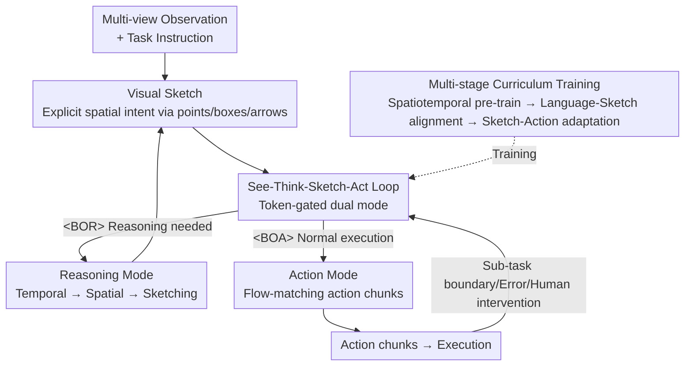

# Action-Sketcher: From Reasoning to Action via Visual Sketches for Robotic Manipulation

**Conference**: CVPR 2026  
**Paper**: [CVF Open Access](https://openaccess.thecvf.com/content/CVPR2026/html/Tan_Action-Sketcher_From_Reasoning_to_Action_via_Visual_Sketches_for_Robotic_CVPR_2026_paper.html)  
**Code**: [Project Page](https://action-sketcher.github.io) (Code status to be confirmed)  
**Area**: Robotics / Embodied AI  
**Keywords**: VLA, Visual Sketch, Long-horizon Manipulation, Human-in-the-loop, See-Think-Sketch-Act

## TL;DR
This paper proposes Action-Sketcher, which enables VLA models to operate in a "See-Think-Sketch-Act" loop. It first draws spatial intent as a **Visual Sketch** (composed of points, boxes, and arrows) as a human-readable and editable intermediate representation before generating actions. It significantly outperforms strong baselines like π0.5 and OpenVLA-OFT on long-horizon, cluttered, and referentially ambiguous real-world manipulation tasks. Furthermore, sketches allow for direct human intervention to further improve success rates.

## Background & Motivation

**Background**: Current mainstream Vision-Language-Action (VLA) models directly map multi-view observations and language instructions to actions. End-to-end policies (OpenVLA, Octo, Diffusion Policy) perform well on short-horizon tasks. Hierarchical VLAs attempt to improve long-horizon behavior using a "planner + controller" setup. Recently, a "think-before-act" paradigm has emerged (e.g., EO-1, OneTwoVLA, ThinkAct), inserting explicit reasoning before action execution.

**Limitations of Prior Work**: These methods share a common issue where "intent is hidden." ① End-to-end policies compress planning intent into latent representations, making task decomposition difficult and actions lack causal explanation. ② Reasoning in hierarchical VLAs is often instantaneous and local, lacking continuous modeling of global intent (changing human goals, accumulating errors, historical states). ③ Even in "think-before-act" models, if the intermediate evidence is **only text**, spatial references (where to contact, how to approach, relationships between objects) remain implicit—unverifiable by humans and lacking low-entropy geometric guidance for the controller.

**Key Challenge**: Long-horizon manipulation is difficult for two reasons. Spatially, natural language instructions are inherently ambiguous (which cup is "the cup" when multiple are present?) or under-determined (what exact pose is "left of the cup"?); text-only cues cannot translate linguistic relations into executable constraints. Temporally, human-in-the-loop collaboration is weak, and interpretable planning outputs are rarely exposed, allowing small errors to propagate and accumulate into failures.

**Goal**: To create an intermediate interface that makes "intent both visible and actionable," resolving spatial reference disambiguation (where/how to act) and temporal error correction (early detection and recovery).

**Key Insight**: The authors advocate for **externalizing** spatial intent onto the "language → control" interface—not leaving it in text or latent vectors, but drawing it directly on the robot's current view. A sketch that humans can understand, approve, and modify is essentially a "verifiable contract" between high-level reasoning and low-level control.

**Core Idea**: Use a **Visual Sketch** consisting of points/boxes/arrows instead of pure text intermediate representations to anchor spatial intent, and adaptively interlace reasoning and action using a token-gated "See-Think-Sketch-Act" loop.

## Method

### Overall Architecture

Action-Sketcher models long-horizon manipulation as a sequence modeling problem over a **hybrid output space** (discrete tokens + continuous actions). It learns a policy $\pi_\theta$ where the agent autonomously decides whether to "reason" or "act" at each step. The input context is a sequence of tokens: multi-view images (left wrist, right wrist, base camera), task instructions, history of completed sub-tasks, the current sub-task, and the visual sketch image. Using π0 as a backbone, the model auto-regressively generates text within a single model (reasoning chains, sub-task plans, structural descriptions of sketches) and predicts continuous action chunks using flow-matching.

The system runs a dual-mode event-driven loop gated by special tokens:

- **Reasoning Mode**: When the model decides thinking is needed (completing a sub-task, encountering an error, or receiving human intervention), it generates `<BOR>` (begin-of-reasoning). It then performs **temporal reasoning** (inferring the next sub-task from instructions and history) and **spatial reasoning** (analyzing object layouts and relationships to produce text-based points/boxes/arrows), ending with `<EOR>`. The text sketch is then rendered onto the current reference view as a visual sketch image and updated into the context.
- **Action Mode**: When the model deems further reasoning unnecessary (e.g., scene consistency, normal sub-task execution), it generates `<BOA>` (begin-of-action), triggering the action expert to generate action chunks via flow-matching.

Initially, history, current sub-tasks, and sketch images are empty, forcing the model to start in Reasoning Mode to fill these fields before fluently switching between modes.

### Key Designs

**1. Visual Sketch: A Verifiable Contract via Points, Boxes, and Arrows**

The design addresses the failure of "text-only intermediate representations to explain space." A visual sketch at step $t$ is a tuple of sparse geometric primitives $S_t = (B_t, P_t, A_t)$, all defined on the robot’s ego-view image plane:

- **Boxes $B_t$**: Object-level affordance cues. Each box $b_i=(x_{1,i},y_{1,i},x_{2,i},y_{2,i})$ uses pixel coordinates to identify manipulable regions. It disambiguates object references in cluttered scenes—"pick the one closest to the cup" can be locked to a target (e.g., an apple) with a box, stripping away appearance details while retaining scale and position.
- **Points $P_t$**: Keypoints $p_i=(x_i,y_i)$ specify precise interaction/reference locations, representing part-level affordances, motion landmarks, or geometric references. For "pouring tea," this includes the teapot spout $p_{spout}$, cup center $p_{cup}$, and stable handle contact $p_{handle}$.
- **Arrows $A_t$**: Dynamic links connecting static keypoints to actual actions. The authors **factorize** complex SE(3) operations into 2D plane projections of translation trajectories and rotation cues, $A_t = A^{trans}_t \cup A^{rot}_t$. Translation arrows $a^{trans}_i=(p^{start}_i, p^{end}_i)$ are ordered sequences anchored on keypoints. Rotation arrows $a^{rot}_i=(p_i, \text{axis}\in\{x,y,z\}, \text{dir}\in\{\circlearrowright,\circlearrowleft\})$ specify rotation around canonical axes (e.g., tilting the teapot around the ego-view x-axis).

**Mechanism**: Sketches are **continuous, human-editable, and generated one sub-task at a time**. By not encoding the entire trajectory at once, they express richer and more precise action primitives (contact points, rotation arrows) than coarse trajectories, providing low-entropy geometric guidance to the controller and an entry point for human verification.

**2. See-Think-Sketch-Act Loop: Token-Gated Adaptive Switching**

To balance "deliberate reasoning vs. real-time execution," the model uses `<BOR>`/`<BOA>` gated tokens instead of a fixed reasoning frequency. The model **itself** decides to switch modes based on observations, predicted risks, or user feedback. `<BOR>` triggers full spatiotemporal reasoning and a sketch refresh when global re-planning is needed; `<BOA>` allows the action expert to output action chunks via flow-matching during routine execution without redundant reasoning.

**Mechanism**: This event-driven design ensures "slow thinking" occurs only when necessary (sub-task boundaries, scene changes, errors, human intervention), maintaining low-latency action prediction otherwise. Rendering the sketch back into the view and feeding it into the context closes the reasoning-action loop: if a human or the model detects an incorrect sketch, it can be intercepted and corrected before execution.

**3. Multi-stage Curriculum Training + Mode Balanced Sampling + Sketch Perturbation Enhancement**

Training a single model to master spatiotemporal reasoning, precise language-to-sketch binding, robust sketch-to-action mapping, and mode switching is difficult. The authors use a three-stage curriculum:

- **Stage 1: Basic Spatiotemporal Learning**: Uses 3.4M spatial samples (visual grounding for boxes, pointing for keypoints, scene understanding, VQA) and 870k temporal sequences (EgoPlan, ShareRobot, AgiBot-World). GPT-4o is used to label 20% with text reasoning.
- **Stage 2: Reasoning-to-Sketch Enhancement**: On 21k samples (including 2.6k real-world 2–16 sub-task episodes), the model is trained to complete the "temporal reasoning → spatial reasoning → text sketch generation" pipeline.
- **Stage 3: Sketch-to-Action + Mode Adaptation**: Jointly trains the action policy and mode switching. It teaches the model when to output `<BOR>` or `<BOA>` while training the action expert on labeled action data.

Two key reinforcements: **Sketch Perturbation Enhancement** simulates reasoning errors (randomly perturbing boxes while keeping IoU≥0.8, resampling points within radius $c$) to make the action expert robust. **Mode Balanced Sampling** prevents the model from biasing toward the more frequent `<BOA>` steps by sampling reasoning $D_R$ and action $D_A$ sets equally:

$$P(d) = \begin{cases} \dfrac{1}{2|D_R|}, & d \in D_R \\[6pt] \dfrac{1}{2|D_A|}, & d \in D_A \end{cases}$$

## Key Experimental Results

### Main Results

On the LIBERO benchmark, Action-Sketcher's average success rate is comparable to the strongest baselines, but it leads significantly in the **Long** subset:

| Dataset / Subset | Metric | Ours | π0.5 | OpenVLA-OFT |
|---------------|------|------|------|-------------|
| LIBERO-Long | Success % | **96.0** | 92.4 | 94.5 |
| LIBERO-Object | Success % | **99.6** | 98.2 | 98.4 |
| LIBERO-Avg | Success % | 96.9 | 96.8 | 97.1 |

The gap widens on harder long-horizon/spatial tasks (RoboTwin 2.0 simulation + real-world dual-arm platform):

| Task | π0 | π0.5 | OpenVLA-OFT | Ours |
|------|----|----|-------------|------|
| Stack Blocks (Sim) | 4.0 | 7.0 | 12.4 | **34.5** |
| Place A2B Left (Sim) | 12.0 | 11.0 | 21.0 | **43.0** |
| Tidy Table (Real) | 23.0 | 31.2 | 36.0 | **52.0** |
| Pick & Place (Real) | 30.0 | 34.5 | 52.5 | **67.0** |
| Pour Tea (Real) | 16.0 | 20.0 | 15.0 | **27.6** |

### Human-in-the-Loop (RQ2)

Failure analysis shows 66% of failures originate in Reasoning Mode, with the vast majority (61% of total failures) occurring in spatial reasoning—i.e., sketch generation itself. However, because the sketch is an explicit interface, it is a natural entry point for human intervention. Allowing humans to pause and slightly modify sketches nearly doubles the success rate on the hardest real-world tasks:

| Real-world Task | Original % | + Human-in-the-loop % | Gain |
|----------|--------|--------------|------|
| Tidy Table | 52.0 | 75.0 | +23.0 |
| Pour Tea | 27.6 | 44.0 | +16.4 |
| Pick & Place | 67.0 | 85.5 | +18.5 |

### Ablation Study

| Configuration | Success % (Stack Blocks) | Progress % (Tidy Table) | Note |
|------|---------|---------|------|
| Action-Sketcher (Full) | 34.5 | 52.0 | Full model |
| w/o Spatial Reasoning | 13.8 | 23.9 | Drops to ~1/3 |
| w/o Visual Sketch | 9.8 | 15.0 | Lowest performance |
| w/o Boxes | 31.2 | 49.0 | Disambiguation capability drops |
| w/o Keypoints | 26.6 | 43.6 | Largest drop—coordinate grounding is key |
| w/o Arrows | 29.9 | 48.2 | Dynamic guidance impaired |
| w/o Stage 1 | 29.2 | 39.7 | Skip spatiotemporal pre-training |
| w/o Stage 2 | 18.1 | 21.9 | No reasoning finetuning, inconsistent sketches |
| w/o Stage 3 | 0.0 | 0.0 | Complete failure without adaptation |

### Key Findings
- **Visual sketches are essential**: Removing them causes success rates to plummet from 34.5% to 9.8%, proving they are a fundamental bridge for grounding language into executable actions, not just a visualization aid.
- **Keypoints are the most critical primitive**: Removing them results in the largest drop (to 26.6%) as they provide precise coordinate grounding.
- **Stage 3 is indispensable**: Removing it leads to 0% success, identifying the sketch-to-action adaptation phase as the bottleneck for deployment.
- **Errors concentrate in sketch generation**: 61% of failures stem from inaccurate sketches during spatial reasoning. This disadvantage is mitigated by the explicit interface, allowing human corrections to push performance near 100%.

## Highlights & Insights
- **The "verifiable contract" concept is clever**: Moving intermediate representations from latent vectors to visible points/boxes/arrows provides three benefits: disambiguation, supervisability (easy to label), and debuggability.
- **Factorization of SE(3) into 2D translation + rotation arrows**: Projecting 6-DOF motion onto 2D planes allows the sketch to remain in the image space while retaining complex semantics.
- **Token-gated adaptive switching**: Using `<BOR>`/`<BOA>` allows the model to learn when to think slowly versus act fast, treating reasoning frequency as a learnable behavior rather than a hyperparameter.
- **One sub-task at a time**: Generating local sketches instead of full trajectories allows for more precise primitives (contact points, rotation), proving "local over global" can be beneficial.

## Limitations & Future Work
- Sketch generation (spatial reasoning) is the primary bottleneck. Current autonomous grounding accuracy is insufficient, often requiring human-in-the-loop fallback.
- Absolute success rates on difficult long-horizon tasks (e.g., Pour Tea at 27.6%) are still low, indicating a gap before practical utility.
- Sketch perturbation uses heuristic values (IoU≥0.8); the distribution of real reasoning errors may not be fully covered.
- Ego-view 2D projection handles occlusion poorly and has limited expressive power for 3D depth-wise fine movements.
- Future Work: Implementing active assistance (model requests human help when sketch confidence is low) or multi-view sketch fusion.

## Related Work & Insights
- **vs. Text-based think-before-act**: Action-Sketcher externalizes spatial intent, which text-based methods (EO-1, ThinkAct) keep implicit or compressed.
- **vs. Visual prompts/trajectories (RT-Trajectory, RT-Sketch)**: These often either use static prompts or compress trajectories into non-editable forms; Action-Sketcher generates dynamic, editable, sub-task-specific primitives.
- **vs. Hierarchical VLA**: Traditional planners lack continuous global intent modeling; this model maintains a verifiable intent loop through the See-Think-Sketch-Act process.

## Rating
- Novelty: ⭐⭐⭐⭐⭐ An intuitive and persuasive interface for externalizing spatial intent.
- Experimental Thoroughness: ⭐⭐⭐⭐ Strong ablation and human-in-the-loop studies, though absolute real-world success rates remain modest.
- Writing Quality: ⭐⭐⭐⭐ Logical flow with clear definitions of primitives.
- Value: ⭐⭐⭐⭐⭐ High utility for long-horizon tasks and human-robot collaboration.

<!-- RELATED:START -->

## Related Papers

- [\[CVPR 2026\] Unifying Perception and Action: A Hybrid-Modality Pipeline with Implicit Visual Chain-of-Thought for Robotic Action Generation (VITA)](unifying_perception_and_action_a_hybrid-modality_pipeline_with_implicit_visual_c.md)
- [\[CVPR 2026\] Language-Grounded Decoupled Action Representation for Robotic Manipulation (LaDA)](lada_robotic_manipulation.md)
- [\[CVPR 2026\] FLARE: A Failure-Aware Framework for Autonomous Correction and Recovery in Visual-Language Robotic Manipulation](flare_a_failure-aware_framework_for_autonomous_correction_and_recovery_in_visual.md)
- [\[CVPR 2026\] Localizing, Structuring, and Rendering: Bridging 3D and 2D Vision-Language-Action Models for Robotic Manipulation](localizing_structuring_and_rendering_bridging_3d_and_2d_vision-language-action_m.md)
- [\[CVPR 2026\] ActiveVLA: Injecting Active Perception into Vision-Language-Action Models for Precise 3D Robotic Manipulation](activevla_injecting_active_perception_into_vision-language-action_models_for_pre.md)

<!-- RELATED:END -->
