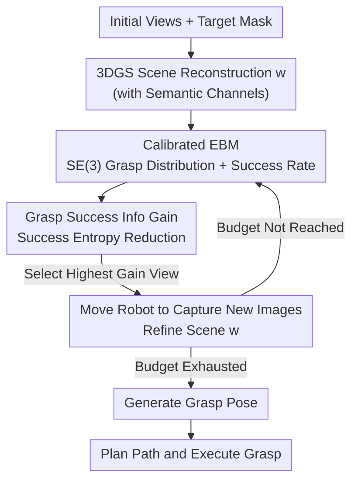

# ActiveGrasp: Information-Guided Active Grasping with Calibrated Energy-based Model

**Conference**: CVPR 2026  
**arXiv**: [2511.12795](https://arxiv.org/abs/2511.12795)  
**Code**: https://rpfey.github.io/activegrasp/ (Project Page)  
**Area**: Robotics / Active Perception / Grasping  
**Keywords**: Active Grasping, Next-Best-View, Energy-based Models, SE(3) Manifold, Model Calibration

## TL;DR
Addressing the challenge of grasping targets in cluttered scenes with limited viewpoints, ActiveGrasp employs a **calibrated energy-based model** to directly model grasp distributions on the SE(3) manifold. It defines the information gain of the "Next-Best-View" (NBV) as the **reduction in grasp success entropy**, guiding the robot to regions of highest uncertainty. This approach achieves superior success rates with fewer view budgets in both simulation (79% SR) and real-world experiments.

## Background & Motivation
**Background**: Grasping target objects in dense, cluttered tabletop environments is difficult as initial viewpoints often fail to observe graspable parts. One approach relies on scaling data and model size (e.g., VLA models like π0.5), yet the authors note that inaccuracies persist without active information gathering. Another approach is **Next-Best-View (NBV)** active perception, which selects views with the "highest information gain" to supplement observations before generating grasp poses.

**Limitations of Prior Work**: The core of NBV is estimating the information gain of candidate views for the grasping task. Existing methods provide "biased" estimates. From an information-theoretic perspective, the authors identify three essential criteria that existing methods violate at least one: 1) Many use **visibility or scene completeness** for information gain, biasing towards "completing the scene" rather than "clarifying the grasp"; 2) Methods based on grasp distributions often project onto **2D or 3D planes**, losing the rotational structure on the SE(3) manifold and biasing towards grasp positions; 3) Even if the grasp distribution is modeled, it is often **not calibrated** to true success rates, leading to biased information gain calculations.

**Key Challenge**: To achieve "unbiased" information gain, one must satisfy three criteria simultaneously: calculation from the grasp distribution, modeling on SE(3), and calibration to true success rates. However, energy-based models (EBMs) that estimate density $p(g\mid w)$ do not inherently provide the **success rate** $s(g,w)$ of each grasp—high density does not equate to high success.

**Goal**: Construct a model that represents multi-modal grasp distributions on the SE(3) manifold with energy **calibrated** to true success rates, providing a clean, non-heuristic NBV information gain.

**Key Insight**: Information gain is redefined as the **reduction in grasp success entropy** rather than the Shannon entropy of the grasp distribution. The authors illustrate that the Shannon entropy $\tilde{\mathbf{H}}$ of a grasp distribution may actually **increase** after observation (discovering more candidates), contradicting the intuition of becoming "more certain." Conversely, the entropy $\mathbf{H}$ conditioned on successful events **decreases** as more successful grasps are discovered, which truly represents the uncertainty reduction desired for grasping.

**Core Idea**: Utilizing a "calibrated EBM + Gaussian posterior approximation" to compute the second-order expansion of grasp success entropy, **maximizing the reduction in success entropy after new observations** as the information gain for view selection.

## Method

### Overall Architecture
ActiveGrasp is a closed-loop pipeline of "active observation - reconstruction - view selection." Inputs are initial fixed views $\mathcal{D}$ and target masks; the output is the executed grasp on the target. The process involves: reconstruct the scene $w$ with semantic channels using **3D Gaussian Splatting (3DGS)**; use the calibrated EBM to estimate **grasp success entropy** $\eta(w)$ on $w$ and sampled grasps $g$; compute the **information gain** $\mathbf{I}$ for $K$ candidate views using $\nabla_w^2\eta(w)$ combined with a Gaussian approximation of the scene posterior; select the view with the highest gain to refine $w$; repeat until the budget is exhausted; finally, predict the grasp pose and execute it.

### Key Designs

**1. Scene-Augmented SE(3) Energy-Based Model: Modeling Multi-modal Distributions Directly on the Manifold**

Existing methods often collapse grasp distributions onto 2D/3D projections, losing rotational structure. The authors use an energy model $E_\theta: w\times g\to\mathbb{R}$ to directly model the conditional distribution $p(g\mid w)=e^{-E_\theta(g,w)}/Z$ on the SE(3) manifold, where $g\in SE(3)$ and $w$ is the 3DGS scene. The model extends SE(3) Diffusion Fields, conditioned on noise scale $\sigma_k$, trained via **denoising score matching**: noise is added to ground-truth successful grasps $\hat g=g\exp(\sigma_k\hat\epsilon)$, aligning the energy gradient with the log-gradient of the perturbation distribution $\zeta$ ($\mathcal{L}_{\text{dsm}}$). Sampling uses annealed Langevin dynamics. "Scene-augmentation" fuses 3DGS Gaussian means with one-hot semantic vectors into $\mathcal{P}\in\mathbb{R}^{N\times2\times3}$ ($N=1024$), using VNNs for features. The gripper uses fixed anchors transformed by $g$ to the world frame, processed by an MLP and fused via PointNet, allowing the EBM to "see" the full scene rather than isolated points.

**2. Grasp Success Entropy and Second-Order Information Gain: Minimizing Success Uncertainty**

The authors define grasp entropy as **conditional entropy** $\eta(w)=\mathbf{H}[S\mid G,W]=\mathbb{E}_{p(g\mid w)}[h(g,w)]$, where the success $S$ of a single grasp is a Bernoulli distribution parameterized by the success rate $s(g,w)$, with entropy $h(g,w)=-s\log s-(1-s)\log(1-s)$. This is **fundamentally different** from the Shannon entropy $\tilde{\mathbf{H}}[G\mid W]$ of the grasp distribution: $\tilde{\mathbf{H}}$ increases with more candidates, while $\eta$ decreases as successful grasps are confirmed. When the scene is estimated from observations, the total entropy is $\mathbf{H}[S\mid G,W,\mathcal{D}]=\mathbb{E}_{p(w\mid\mathcal{D})}[\eta(w)]$. Using a second-order Taylor expansion of $\eta(w)$ at the MAP estimate $w^*$ and a **Gaussian approximation (GAP)** of the scene posterior $p(w\mid\mathcal{D})\sim\mathcal{N}(w^*,\mathbf{H}''[w\mid\mathcal{D}]^{-1})$, they derive:

$$\mathbf{H}[S\mid G,W,\mathcal{D}]=\eta(w^*)+\tfrac{1}{2}\,\mathrm{tr}\!\left(\nabla_w^2\eta(w^*)\,\mathbf{H}''[w^*\mid\mathcal{D}]^{-1}\right).$$

The information gain for candidate $x_{\text{acq}}$ is the **reduction** in this entropy:

$$\mathbf{I}\approx\tfrac{1}{2}\,\mathrm{tr}\!\left\{\nabla_w^2\eta(w^*)\left[\mathbf{H}''[w^*\mid\mathcal{D}]^{-1}-\mathbf{H}''[w^*\mid x_{\text{acq}},\mathcal{D}]^{-1}\right]\right\},$$

where the scene Hessian is approximated via Gauss-Newton as diagonal $\mathbf{H}''[w\mid\mathcal{D}]\approx\sum_x\mathrm{diag}(\nabla_w f\,\nabla_w f^T)+\lambda I$ ($f$ is the 3DGS rendering equation). This provides a non-heuristic NBV selection criteria.

**3. Energy Calibration: Equating Energy to Success Rate for Unbiased Gain**

To calculate $\eta$, the success rate $s(g,w)$ must be known, but standard EBMs only provide density. The authors **calibrate** the energy to the success rate by treating grasping as a binary classification. Scaling network outputs to logits $(a_S,a_F)$, they define $p_S=\frac{e^{a_S}}{e^{a_S}+e^{a_F}+2}$ and $p_F=\frac{e^{a_F}}{e^{a_S}+e^{a_F}+2}$, with energy $E_S=-\log p_S$ and $E_F=-\log p_F$, allowing energy to represent success probability. Training uses **bidirectional score matching** $\mathcal{L}^+/\mathcal{L}^-$, aligning gradients with successful grasps while pushing away from failures. To preserve the learned energy structure from DSM, they use **AP (Average Precision) Loss** instead of cross-entropy, optimizing a differentiable average precision by softly assigning grasps to equidistant bins. A **learnable temperature** $T$ is introduced for numerical stability. The final loss is $\mathcal{L}_{\mathrm{EBM}}=\frac{\mathcal{L}^++\mathcal{L}^-}{2}+\lambda_1\mathcal{L}_{\text{ap}}+\lambda_2\mathcal{L}_{\text{sdf}}$. Calibration reduces ECE from 0.40 to 0.02.

### Loss & Training
The EBM is trained on the Acronym dataset for 200k steps (batch 24, Adam, LR 1e-3, $\lambda_1=1, \lambda_2=0.1$). Noise scheduling: $\sigma_k=(\sigma^{2k}-1)/\log\sigma, \sigma=0.5$. AP Loss is computed on low-noise samples only. 3DGS is refined for 1k steps per new view. 128 candidate views are sampled on a spherical Fibonacci grid at 0.3–0.5m radius.

## Key Experimental Results

### Main Results
Simulation uses PyBullet with YCB objects in 10-item clutter across 400 trials. Each trial provides 2 initial fixed views plus 2 active views. (Higher SR and lower ECE are better):

| Method Combination | Success | SR | ECE |
|----------|---------|------|------|
| ACE + ACE | 90 | 22.50% | 0.35 |
| Contact GraspNet + ActiveNGF | 130 | 32.50% | 0.32 |
| GSNet + ActiveNGF | 249 | 62.00% | 0.30 |
| Se3diff + ActiveNGF | 233 | 58.25% | 0.40 |
| Se3diff Calib + ActiveNGF | 296 | 74.00% | 0.06 |
| Se3diff Calib + Random | 297 | 74.25% | 0.06 |
| Se3diff Calib + Random† (8 views) | 306 | 76.50% | 0.05 |
| **Ours (Se3diff Calib + ActiveGrasp)** | **316** | **79.00%** | **0.02** |

Ours achieves 79% SR, outperforming the best calibrated baseline (74.25%). Even with 8 views, Random (76.5%) fails to match Ours with 4 views, confirming the accuracy of the information gain.

### Ablation Study
Evaluation of EBM components on Acronym:

| Configuration | AP ↑ | ECE ↓ | ECE (Bullet) ↓ | Description |
|------|------|-------|----------------|------|
| Se3diff | 34.69 | 0.17 | 0.35 | Original SE(3) Diffusion |
| +Scene | 66.00 | 0.15 | 0.30 | + Scene Augmentation |
| +Scene+AP | 83.31 | 0.14 | 0.17 | + AP Loss |
| +Scene+FSM+AP | 83.13 | 0.03 | 0.08 | + Bidirectional Score Matching (FSM) |
| +Scene+FSM+AP+T | **87.84** | **0.03** | **0.05** | + Learnable Temperature (Full Model) |

### Key Findings
- **Calibration drives success**: The calibrated Se3diff-Calib outperforms off-the-shelf models in detection because it executes grasps with the highest predicted (and calibrated) success rate.
- **Scene augmentation is critical**: Integrating 3DGS into the EBM improved AP from 34.69 to 66.00.
- **FSM + Learnable Temperature ensure calibration**: Bidirectional matching reduced ECE from 0.14 to 0.03, and learnable temperature further refined it to 0.05 in Bullet.
- **Real-world consistency**: In real-world tests (cups, canisters), Ours succeeded in 9/10, 8/10, and 9/10 trials, outperforming Breyer, ActiveNGF, and ACE.

## Highlights & Insights
- **Redefining "Useful Entropy"**: Switching information gain from Shannon entropy to success conditional entropy targets the task requirement—entropy increases with new candidates but decreases upon success confirmation.
- **Energy as Success Probability**: The logit design and $(a_S, a_F)$ normalization elegantly solve the problem of density models being unaware of success rates.
- **AP Loss as a "Lazy Calibrator"**: Using AP loss reinforces ranking without over-constraining the distribution structure, a strategy applicable to other tasks requiring calibration without structural disruption.
- **Efficient Second-order Computation**: Combining GAP with diagonal Gauss-Newton approximations makes the Hessian of the 3DGS rendering feasible for real-time robotic systems.

## Limitations & Future Work
- **Dependence on 3DGS and Segmentation**: Relies on 3DGS quality and 2D segmentation; robustness to segmentation noise is not fully quantified.
- **Approximation Stack**: The use of diagonal Hessians, outer-product approximations for $\nabla_w^2\eta$, and Gaussian posteriors introduces errors whose theoretical impact requires more discussion.
- **Small View Budget**: Experiments focused on a budget of 4 views; diminishing returns in larger budgets or denser clutter remain unexplored.

## Related Work & Insights
- **vs. ActiveNGF**: ActiveNGF uses graspness/TSDF inconsistencies, which are proxies. Ours calculates success entropy reduction on SE(3), resulting in higher SR (79% vs 74%).
- **vs. Breyer (Visibility)**: Breyer counts occluded voxels, biasing towards scene completion. Ours specifically optimizes for the grasp task.
- **vs. ACE**: ACE predicts affordance scores for unobserved views. Ours derives gain from a calibrated distribution without relying on affordance proxies.
- **vs. SE(3) Diffusion Fields**: Ours extends the energy function from generation to information gain calculation and success rate calibration.
- **vs. JEM**: While JEM found EBMs can self-calibrate for classification, this work is the first to achieve **grasp detection (regression) calibration** on high-dimensional continuous conditions.

## Rating
- Novelty: ⭐⭐⭐⭐⭐ Redefining info gain as success entropy reduction and calibrating EBMs for grasping is highly original and consistent.
- Experimental Thoroughness: ⭐⭐⭐⭐ Extensive simulation trials and real-world tests, though scene scale and view budgets are relatively small.
- Writing Quality: ⭐⭐⭐⭐ Clear information-theoretic derivation; however, discussion on approximation costs is slightly limited.
- Value: ⭐⭐⭐⭐⭐ Provides a theoretically grounded NBV framework and reproducible active grasping benchmarks.

<!-- RELATED:START -->

## Related Papers

- [\[CVPR 2026\] QuantVLA: Scale-Calibrated Post-Training Quantization for Vision-Language-Action Models](quantvla_scale-calibrated_post-training_quantization_for_vision-language-action_.md)
- [\[CVPR 2026\] EnergyAction: Unimanual to Bimanual Composition with Energy-Based Models](energyaction_unimanual_to_bimanual_composition_with_energy-based_models.md)
- [\[CVPR 2026\] GeniNav: Generative Model Driven Image-Goal Navigation via Imagination-Guided Consistency Flow Matching](geninav_generative_model_driven_image-goal_navigation_via_imagination-guided_con.md)
- [\[ICLR 2026\] Spatially Guided Training for Vision-Language-Action Model](../../ICLR2026/robotics/spatially_guided_training_for_vision-language-action_model.md)
- [\[CVPR 2026\] Obstruction Reasoning for Robotic Grasping](obstruction_reasoning_for_robotic_grasping.md)

<!-- RELATED:END -->
