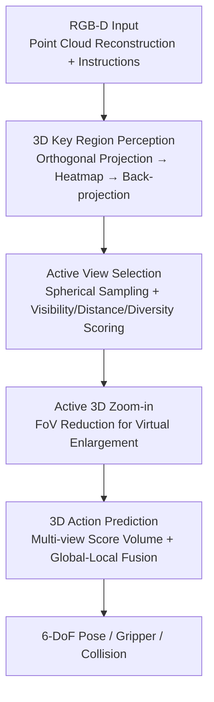

# ActiveVLA: Injecting Active Perception into Vision-Language-Action Models for Precise 3D Robotic Manipulation

**Conference**: CVPR 2026  
**Paper**: [CVF Open Access](https://openaccess.thecvf.com/content/CVPR2026/html/Liu_ActiveVLA_Injecting_Active_Perception_into_Vision-Language-Action_Models_for_Precise_3D_CVPR_2026_paper.html)  
**Code**: [Project Page](https://ZhenyangLiu.github.io/ActiveVLA) (No open-source repository found)  
**Area**: Robotics / Embodied AI  
**Keywords**: VLA, Active Perception, 3D Manipulation, View Selection, Virtual Zoom-in

## TL;DR
ActiveVLA integrates "active perception" into 3D Vision-Language-Action (VLA) models: it first utilizes multi-view orthogonal projections and heatmaps to locate 3D key regions, then actively selects optimal virtual camera views around these regions and performs virtual Zoom-in to enhance resolution. This approach significantly improves success rates in scenarios involving occlusions and fine manipulations (achieving a 91.8% average on RLBench).

## Background & Motivation
**Background**: Connecting pre-trained VLMs with action heads to form VLAs has become a mainstream paradigm in robotic manipulation. Further incorporating 3D point cloud structural cues (3D-aware policy) is a currently active research direction, offering better sample efficiency and spatial reasoning.

**Limitations of Prior Work**: Most VLAs rely on **fixed or wrist-mounted cameras**, providing a constant viewpoint centered on the end-effector. This implies that the model cannot adaptively switch viewpoints or adjust resolution during task execution. If the target is occluded (e.g., an apple blocked by a stuffed sheep in Fig. 1) or involves small parts (e.g., screwing a bulb, inserting a peg), fixed viewpoints either lose sight or clarity, leading to failures in long-horizon tasks and fine manipulations.

**Key Challenge**: Perception is traditionally treated as a process of "passively receiving sensor inputs." However, true embodied intelligence requires "active hypothesis testing"—actively seeking, selecting, and verifying information relevant to the current task (citing Richard Gregory's "perception as an active process of hypothesis testing"). Fixed cameras fundamentally sever this proactivity.

**Goal**: To enable robots during execution to (1) independently decide which viewpoint to observe from and (2) decide whether to zoom in on key regions for better clarity.

**Key Insight**: Given that 3D point clouds are already reconstructed, one is not restricted by physical cameras. One can **freely place virtual cameras and synthesize images from any viewpoint** within the 3D scene. Thus, "active perception" simplifies into a geometric problem of selecting viewpoints and adjusting the Field of View (FoV) on the point cloud, without requiring actual physical movement of the robotic arm for exploration.

**Core Idea**: A "coarse-to-fine" two-stage process transforms passive VLA into active VLA. The coarse stage locates 3D key regions, while the fine stage involves **active view selection + active Zoom-in** around those regions before predicting actions.

## Method

### Overall Architecture
ActiveVLA addresses the issue of fixed views being "unable to see/see clearly" through a **coarse-to-fine perception-action closed loop**. The input consists of RGB-D from multiple calibrated cameras to reconstruct the scene point cloud. The **coarse stage** projects the point cloud into multi-view 2D images and feeds them into a PaliGemma backbone to predict heatmaps, which are then back-projected to 3D to locate the "key 3D region" for the task. The **fine stage** centers on this region, first actively selecting several optimal virtual viewpoints via hypothesis-testing scoring, and then performing virtual Zoom-in to enlarge the key area. Finally, these refined views are processed by the (weight-shared) PaliGemma to generate heatmaps, which are accumulated into a 3D score volume. This, combined with global-local fusion, predicts the 6-DoF pose, gripper state, and collision flags.

The primary contributions of this work are "3D Key Region Perception," "Active View Selection," and "Active 3D Zoom-in." Point cloud reconstruction, orthogonal projection, PaliGemma encoding, and action decoding serve as the general framework.

### Key Designs

**1. 3D Key Region Perception: Coarse Localization of "Where to Look"**

The limitation is that the global representation of the VLM backbone is insufficient for precise spatial localization, yet the model must first identify which part of the scene is task-relevant for subsequent active perception. ActiveVLA's approach: given the reconstructed point cloud, it renders three images from **Top, Front, and Right orthogonal directions**. Each image contains 7 channels: RGB(3) + Depth(1) + World Coordinates (x,y,z)(3). The coordinate channels are crucial: if pixels in different views share the same $(x,y,z)$, they correspond to the same point in 3D, enabling cross-view alignment. During rendering, each pixel takes the color of the point with the **minimum depth projected to that pixel**, naturally handling occlusions:

$$I^{(v)}(u_x,u_y)=\sum_{i=1}^{N}\mathbf{c}_i\cdot\delta\big((u_x,u_y)-\pi^{(v)}(\mathbf{p}_i)\big)$$

After feeding the three images to the VLM, the output patch tokens are rearranged into feature grids. A **convex upsampling block** $\mathcal{U}(\cdot)$ restores them to the input resolution, yielding heatmaps $\mathbf{H}=\mathcal{U}\big(\mathrm{Rearrange}(\{\mathbf{t}_i\})\big)$. Convex upsampling utilizes learned pixel-wise weights (rather than fixed interpolation) to recover finer spatial details. Heatmaps are trained via cross-entropy supervision. The intersection of the three back-projected heatmaps identifies the "key 3D region." This step lifts the "where to look" problem from 2D to 3D, providing anchors for virtual camera placement.

**2. Active View Selection: Scoring for the "Most Comprehensive and Least Occluded" View**

Fixed/wrist cameras suffer from fixed perspectives. ActiveVLA formalizes "where to look" as a multi-objective optimization on a sphere surrounding the key region $p_f$. Candidate camera positions are **uniformly sampled on the sphere** centered at $p_f$ using geodesic sampling (recursive subdivision of an icosahedron) to avoid the sampling bias of longitude-latitude parameterization. The number of vertices after $k$ levels of subdivision is $V(k)=12+\tfrac{20}{3}(4^k-1)$, allowing smooth control over view density.

Each candidate $c_i$ is scored based on three criteria:
- **Visibility**: Sampling $N$ points $q_k$ uniformly along the line of sight $c_i \to p_f$ and performing KDTree nearest neighbor queries for the distance $d_k=\min_{s\in\mathcal{S}}\|q_k-s\|$ to the point cloud surface. If all points are sufficiently far from the surface ($d_k\ge r,\forall k$), the line of sight is unobstructed ($v(c_i,p_f)=1$), otherwise 0.
- **Distance**: The distance $\|c_i-p_f\|$ is normalized to prefer "moderate" observation distances (balancing field of view and detail).
- **Diversity**: Selected views should be oriented as divergently as possible, $S_{\text{div}}(c_i)=\sum_{j\ne i}\arccos(\mathbf{v}_i\cdot\mathbf{v}_j)$.

These three Z-normalized terms are combined: $s_i=w_{\text{vis}}s_{\text{vis}}+w_{\text{dis}}s_{\text{dis}}+w_{\text{div}}s_{\text{div}}$ (sum of weights = 1). The top-K are chosen as observation poses using a look-at configuration (eye=$c_i$, target=$p_f$). This allows the robot to "revolve around the target in virtual space and pick clear, complementary angles." The highest-scoring view is reserved for Zoom-in.

**3. Active 3D Zoom-in: Lossless "Optical Zoom" for Small Targets**

While view selection solves visibility, fine-grained tasks (e.g., inserting a tool into a hole) require clarity. Fixed camera resolution is limited, and small objects occupy few pixels. ActiveVLA's solution: after selecting the optimal viewpoint, **re-render from the same pose but with a narrower FoV**. A narrower FoV enlarges the key region in the frame while maintaining pixel resolution, achieving "optical zoom" in virtual space. Let $\alpha$ be the original FoV, $z>1$ be the zoom factor, and $d$ be the distance to the target; the horizontal coverage width $W(z)$ is:

$$W(z)=2d\tan\!\Big(\frac{\alpha}{2z}\Big)$$

$W(z)$ decreases as $z$ increases, elevating the resolution $R=\text{image\_width}/W(z)$. Since it is based on scale-invariant view synthesis from point clouds, zooming introduces no geometric loss. The authors emphasize decoupling **exploration (view selection)** and **exploitation (Zoom-in clarity)** into a hierarchical perception strategy.

> Action Prediction (Supporting Framework): Heatmaps from refined views are back-projected and accumulated into a multi-view score volume $S(\mathbf{g})=\sum_{v=1}^{3}w_v\,h_v(\pi_v(\mathbf{g}))$. The $\arg\max$ provides the translation target. Rotation is discretized into 72 bins per Euler angle, processed via a fusion of global (max-pooled tokens from projections) and local (fine-grained ROI tokens) features through an MLP head to output rotation, gripper state, and collision flags.

### Loss & Training
The key region perception phase uses **cross-entropy loss** for heatmap prediction (treating ground-truth keypoint positions as classification targets). The VLM backbone follows BridgeVLA: based on PaliGemma (SigLIP encoder + Gemma decoder), pre-trained on 120K images from the RoboPoint subset. The PaliGemma in both coarse and fine stages **shares weights**. Hyperparameters include selecting 3 views and setting the Zoom-in factor to 4.

## Key Experimental Results

### Main Results
Evaluated on three simulation benchmarks: RLBench (18 tasks), COLOSSEUM (14 types of perturbation generalization), and GemBench (hierarchical generalization L1–L4). Success rates (%) are reported.

| Benchmark | Metric | ActiveVLA | Prev. SOTA (BridgeVLA) | Gain |
|-----------|--------|-----------|-----------------------|------|
| RLBench | Avg. Success Rate ↑ | **91.8** | 88.2 | +3.6 |
| RLBench | Mean Rank ↓ | **1.22** | 2.44 | — |
| COLOSSEUM | Avg. Success Rate ↑ | **65.9** | 64.0 | +1.9 |
| COLOSSEUM | Mean Rank ↓ | **1.07** | 2.07 | — |
| GemBench | Avg. Success Rate ↑ | **51.3** | 50.0 | +1.3 |

In RLBench, ActiveVLA ranked first in 10 out of 18 tasks. Improvement was most significant in occlusion-sensitive tasks (Place Cups 58.4→65.6, Insert Peg 88.0→92.4, Stack Cups 81.6→84.8). On COLOSSEUM, it demonstrated robustness to size/color/lighting/texture perturbations (MO-SIZE 72.4%, Camera Pose 76.3%, Table Color 78.3%). In GemBench, it led across L1–L3 (92.4/66.3/45.1), though L4 remained at 1.2% (nearly all methods approached zero).

### Ablation Study
A-VS = Active View Selection, A-3Z = Active 3D Zoom-in; reported as "Success Rate (%) / Single Inference Time (s)".

| Configuration | RLBench | COLOSSEUM | GemBench |
|---------------|---------|-----------|----------|
| Fixed View Baseline | 87.6 / 0.26 | 63.6 / 0.33 | 48.9 / 0.21 |
| + A-VS | 89.4 / 0.45 | 64.5 / 0.51 | 49.4 / 0.48 |
| + A-VS + A-3Z (Full) | **91.8 / 0.53** | **65.9 / 0.62** | **51.3 / 0.59** |

Hyperparameter Analysis (RLBench): Increasing views from 1 to 3 boosted success from 82.2% to 91.8%, saturating beyond 3 (4/5/6 views ~ 92.0/91.7/91.8%). A Zoom-in factor of 4 reached 91.8%, while larger factors (5/6) dropped to 91.4/90.9% due to loss of context.

### Key Findings
- **Modules are Complementary**: A-VS decides "where to look" (+1.8% on RLBench) and A-3Z decides "how close to look" (+2.4%), forming a hierarchical perception. Inference time increases from 0.26s to 0.53s (approx. double).
- **Highest Gains in Occluded Tasks**: Tasks like Place Cups see the most significant gains, validating the hypothesis of "active view switching to resolve occlusion."
- **Diminishing Returns for Multi-view**: Three views are sufficient for spatial coverage and occlusion mitigation; additional views increase computation without performance gains. Zoom-in has a "sweet spot" before losing context.
- **Widespread Failure on L4**: All methods (including Ours) struggled on the most difficult compositional generalization tasks, suggesting active perception improves perception quality and occlusion handling rather than fundamental compositional reasoning.

## Highlights & Insights
- **Zero-cost Active Perception in 3D-VLA**: Since point clouds are available, view selection and zooming reduce to geometric operations in virtual rendering, avoiding physical robot movement. This is the most clever aspect.
- **Exploration/Exploitation Decoupling**: A-VS (obtaining a complete view, resisting occlusion) and A-3Z (obtaining precision, resisting low resolution) work orthogonally, addressing "long-horizon occlusion" and "fine manipulation" failure modes separately.
- **Coordinate Channels for Alignment**: Including world coordinates in the 7-channel projection allows 2D heatmaps to be back-projected to 3D without ambiguity, bypassing explicit multi-view matching.
- **Geodesic Spherical Sampling**: Avoids the bias of longitude-latitude sampling at the poles and allows smooth control of candidate density via subdivision levels.

## Limitations & Future Work
- **Dependency on Point Cloud Quality**: Active perception relies on "clean point clouds." In real-world settings, depth noise and reconstruction errors directly contaminate scoring and Zoom-in.
- **Compositional Generalization Unsolved**: The 1.2% success on L4 indicates improvements in perception quality rather than task-level reasoning. New action primitive combinations still lead to failure.
- **Latency**: Inference is roughly twice as slow (0.26→0.53s per step). Re-rendering refined views in the fine stage adds pressure for real-time performance in long tasks.
- **Heuristic Parameters**: Sensitivity analysis for weights $w_{\text{vis}},w_{\text{dis}},w_{\text{div}}$ and threshold $r$ is lacking in the paper ⚠️. Whether these require retuning for different scene geometries is unclear.
- **Future Direction**: Replacing rule-based scoring with a learnable/differentiable policy and optimizing perception and action end-to-end might reduce latency and improve generalization.

## Related Work & Insights
- **vs BridgeVLA**: BridgeVLA uses 2D heatmap alignment for efficient 3D VLA but remains passive. ActiveVLA reuses the PaliGemma backbone and adds active selection + Zoom-in, outperforming it across all benchmarks (RLBench +3.6%). The core change is "passive to active."
- **vs SpatialVLA / PointVLA / Lift3D**: These inject 3D information (Ego3D, point cloud encoders, implicit 3D features) into 2D models to enhance spatial reasoning but lack "perceptual flexibility." ActiveVLA emphasizes "actively acquiring better observations" rather than just "encoding more 3D features."
- **vs RVT / RVT-2 / Act3D**: These also use multi-view projections plus coarse-to-fine strategies but with **fixed** views. ActiveVLA's views are task-dependent and selected online, accounting for the performance gap (RVT-2 81.4 vs. 91.8).
- **Inspiration**: The concept of "virtual camera active perception on reconstructed 3D representations" is transferable to any task with 3D/NeRF/point cloud representations, such as active VQA or detection under occlusion.

## Rating
- Novelty: ⭐⭐⭐⭐ Implementation of "active perception" into 3D-VLA is clean; the combination of view selection and virtual Zoom-in addresses occlusion and fine manipulation effectively.
- Experimental Thoroughness: ⭐⭐⭐⭐ Three simulation benchmarks plus real-world tests; ablation clearly explains the contribution of modules and hyperparameter sweet spots.
- Writing Quality: ⭐⭐⭐⭐ Coarse-to-fine structure is clear; motivations align with the formulas.
- Value: ⭐⭐⭐⭐ Universal approach with almost zero additional hardware cost; highly practical for occlusion and precision-dependent scenarios.

<!-- RELATED:START -->

## Related Papers

- [\[CVPR 2026\] SaPaVe: Towards Active Perception and Manipulation in Vision-Language-Action Models for Robotics](sapave_active_perception_manipulation_vla_roboti.md)
- [\[CVPR 2026\] GeoPredict: Leveraging Predictive Kinematics and 3D Gaussian Geometry for Precise VLA Manipulation](geopredict_leveraging_predictive_kinematics_and_3d_gaussian_geometry_for_precise.md)
- [\[CVPR 2026\] MoEActok: A MoE-based Action Tokenizer for Vision-Language-Action Models](moeactok_a_moe-based_action_tokenizer_for_vision-language-action_models.md)
- [\[CVPR 2026\] ACoT-VLA: Action Chain-of-Thought for Vision-Language-Action Models](acot-vla_action_chain-of-thought_for_vision-language-action_models.md)
- [\[CVPR 2026\] Language-Grounded Decoupled Action Representation for Robotic Manipulation (LaDA)](lada_robotic_manipulation.md)

<!-- RELATED:END -->
