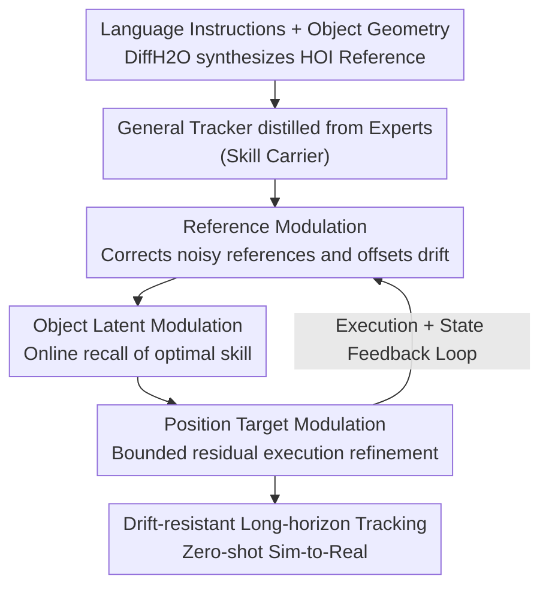

# AdaDexTrack: Dynamic Modulation for Adaptive and Generalizable Dexterous Manipulation Tracking

**Conference**: CVPR 2026  
**Paper**: [CVF Open Access](https://openaccess.thecvf.com/content/CVPR2026/html/Adalibieke_AdaDexTrack_Dynamic_Modulation_for_Adaptive_and_Generalizable_Dexterous_Manipulation_Tracking_CVPR_2026_paper.html)  
**Code**: Project Page https://janebek.github.io/AdaDexTrack (Public repository not yet available)  
**Area**: Robotics / Embodied AI  
**Keywords**: Dexterous Manipulation, Hand-Object Interaction Tracking, Language Guidance, In-loop Modulation, Sim-to-real  

## TL;DR
AdaDexTrack redefines the "Language Command → Dexterous Hand-Object Interaction" pipeline as **modulated tracking**. A distilled general tracker acts as the "skill carrier," while an RL-trained modulator is integrated into the feedback loop. This modulator performs real-time correction through three interfaces—reference trajectory, object latent variables, and position targets—enabling the stable execution of noisy text-generated references for long-horizon, drift-resistant manipulation and achieving zero-shot sim-to-real transfer.

## Background & Motivation

**Background**: Directing multi-fingered dexterous hands for hand-object interaction (HOI) via natural language is highly attractive. Given a command and object geometry, a text-to-motion model first synthesizes a time-indexed hand-object reference trajectory, which the dexterous hand then tracks. Representative methods like DexTrack have expanded coverage by distilling multiple expert policies into a single general tracker.

**Limitations of Prior Work**: This two-stage system faces two critical issues. First, **the reference itself is noisy**: motion synthesis is imperfect, and human-to-robot retargeting introduces "embodiment bias," meaning the reference trajectory may not be precisely reproducible by the robot hand. Second, **fixed reference tracking under open-loop assumptions**: most trackers treat the reference as an immutable goal [17,20]. Once the execution deviates, the controller is forced to "chase" a trajectory it can no longer follow. This leads to aggressive behavior, unstable contact, and accelerated drift, with small errors accumulating like a snowball over long horizons, eventually causing a total loss of tracking.

**Key Challenge**: The tracker is "imperfect but broad-coverage," while the reference is "noisy and embodiment-biased." Coupling these two imperfections in an open-loop pipeline leaves no room for error correction, resulting in unidirectional error accumulation.

**Goal**: To provide the system with online correction capabilities without discarding the clean "tracking" interface—simultaneously refining noisy references and pulling the controller back to feasible trajectories when execution deviates, thereby stabilizing long-horizon, text-guided movements.

**Key Insight**: The authors observe that trackers actually possess high "short-range precision" but suffer from long-range drift. Instead of forcing the tracker to follow a fixed reference exactly, the system should dynamically adjust "what it sees and what it executes" within the feedback loop, using short-range precision to offset long-term cumulative errors.

**Core Idea**: Replace "fixed-reference tracking" with "modulation." Retain a distilled general tracker as the skill library carrier, and prepend an **aligned** in-loop modulator. This modulator performs real-time correction across three interfaces: the reference, object latent variables, and position targets.

## Method

### Overall Architecture
AdaDexTrack addresses the "noisy text reference + embodiment mismatch → long-horizon drift" problem through two stages. **Stage 1 (Offline) - Tracker Construction**: Large-scale HOI trajectories are synthesized from language prompts using DiffH2O. After retargeting, a **PPO expert tracking policy** is trained for each reference. Success trajectories from thousands of experts are distilled into a **single general tracker** $\pi_{\text{track}}$ via behavior cloning (BC). This generalist has wide coverage but is imperfect—which is precisely where the modulator provides value. **Stage 2 (In-loop) - Modulator Addition**: An RL-trained modulator $\pi_{\text{modulate}}$ is placed before the general tracker, forming a hierarchical policy. At each step, it corrects error through three interfaces: modifying the reference, the object latent variables, and the position targets. Crucially, the modulator and tracker **share the same task goal** (the same tracking reward), ensuring tight coupling rather than optimizing disjoint objectives.

The diagram below illustrates the data and control flow from top to bottom: offline distillation creates the skill carrier, and the online modulator progressively corrects errors within the feedback loop before execution by the tracker.

### Key Designs

**1. Expert-to-General Distilled Tracker: Building a Strong but Imperfect "Skill Carrier"**

Training a generalized tracker directly on language-conditioned references is difficult due to noise, diversity, and scale. The authors adopt a "divide and conquer" approach: for each reference synthesized by DiffH2O (augmented with GPT-5 semantic paraphrasing to increase linguistic diversity while staying within the DiffH2O distribution to minimize shift), a specific **expert** $\pi_{\text{track}}^{i}$ is trained using PPO. Each expert handles a narrow, semantically consistent behavior, significantly compressing the RL exploration space. The expert's observation $o_t^{\text{track}}=(s_t^{\text{track}}, \hat s_t^{\text{track}})$ concatenates proprioception $s_t^{\text{prop}}$, object pose $s_t^{o}$, and an **object latent variable** $f^{o}=E_{pc}(P)$ (encoded from point clouds). The reference state also includes **near-future references** for $k\in\{1,2,4,12\}$. The reward aligns hand/object states and encourages proximity:

$$r_t = \omega_1\|q_t^{h}-\hat q_t^{h}\|_2^2 + \omega_2\|p_t^{h}-\hat p_t^{h}\|_2^2 + \omega_3\|p_t^{o}-\hat p_t^{o}\|_2^2 + \omega_4\|p_t^{h}-p_t^{o}\|_2^2$$

Successful expert trajectories are distilled into a single general policy via **offline BC** (rather than DAgger, which requires repeated expert queries). Given the massive number of experts, offline BC is more efficient at this scale. The generalist's observation space is identical to the experts', allowing real-world deployment without oracle states. The value of this step is not "perfection" but creating a carrier that learns $(o_t^{\text{track}}, f^o)\to a_t$ as a **continuous mapping**—a prerequisite for effective object latent modulation.

**2. Reference Modulation: Offsetting Long-range Cumulative Error with Short-range Precision**

Since the tracker is imperfect, it may drift over long horizons, moving the state significantly out-of-distribution (OOD). The insight for reference modulation is: if the tracker is accurate in the short term, **dynamically push the target toward the near future**. At each step, a uniform update rule $\hat s_{t+k}^{x}\leftarrow \hat s_{t+k}^{x}+\lambda^{x} a_{t+k}^{\text{ref},x}$ ($x\in\{h,o\}$ for hand and object) is applied to near-future references $k\in\{1,2,4,12\}$. $a_{t+k}^{\text{ref},x}$ is the reference residual output by the modulator, and $\lambda^{x}$ controls the adjustment magnitude, constraining the modification near the original path. Intuitively (as seen in the "signature" in Fig. 4), when the execution drifts, the modulated reference **intersects** the executed path in the x–y plane, creating a low-error "re-convergence point" that pulls the policy back. Unlike "dead tracking" of a fixed reference, this moves the line itself toward a followable direction for the controller.

**3. Object Latent Modulation: Turning a Discrete "Skill Menu" into a Continuous Interpolatable Manifold**

During inference, a standard general tracker computes the object latent $f^{o}$ once and freezes it, locking the behavior. However, during distillation, $f^{o}$ is explicitly embedded in the $(o_t^{\text{track}}, a_t)$ data, forming an **object-latent-conditioned state-action skill library**. The modulator relaxes this constraint by producing a modulated latent $\tilde f_t^{o}\in\mathbb{R}^{64}$ online, feeding $\tilde s_t^{\text{track}}=(s_t^{\text{prop}}, s_t^{o}, \tilde f_t^{o})$ to the tracker. Since BC learns a continuous mapping, changing $f_t^{o}$ allows the tracker's behavior to **slide smoothly** between different experts—effectively "recalling" the most suitable skill primitive for the current state. While the library is built from finite anchors $\{f_i^{o}\}$, the modulator treats $\tilde f_t^{o}$ as a **continuous control variable**, transforming a discrete "capability menu" into a continuous manifold interpolated between object anchors.

**4. Target Position Modulation: Absorbing High-frequency Execution Biases**

Even with reference and latent adjustments, execution may face rapid, local, non-ideal factors (contact transients, latency) that the tracker cannot capture. Position target modulation adds a **small, bounded residual** to the tracker's command: given $a_t=\pi_{\text{track}}(o_t^{\text{track}})$, the modulator outputs $\Delta a_t$, and the final command is $a_t' = a_t + \Delta a_t$. $a_t$ carries the low-frequency structure of the distilled skill, while $\Delta a_t$ provides smooth, small-scale compensation for accuracy and robustness.

### Loss & Training
Tracker side: Experts are trained with PPO to minimize the gap between robot state and reference (see reward above); the generalist is distilled from successful expert trajectories using offline BC. Modulator side: Trained with RL, **sharing the same task reward as the tracker** to ensure goal alignment. Sim-to-real side: System identification via CMA-ES minimizes the sim-to-real joint state gap $L=\sum_{m}\sum_{t}\|q_{m,t}^{s}-q_{m,t}^{r}\|_2^2$ to calibrate stiffness $P$ and damping $D$. This is supplemented with domain randomization (dynamics, Gaussian noise on observations/actions, pose randomization) and high-friction tape on fingertips/objects.

## Key Experimental Results

Dataset: 505 single-handed, collision-free, reachable references filtered from 1,333 DiffH2O annotations, each expanded with 9 semantically equivalent texts (5,050 total). After feasibility filtering, 2,765 valid sequences across 50 objects remain. Two test sets: unseen-trajectory (2,212 train / 553 test) and unseen-object (45 objects for training / 5 held-out for test). Simulation in Isaac Gym. Success rate reported via Mean-error and Completion variants (%).

### Main Results (Isaac Gym, Simulation)

| Test Set | Method | To (cm↓) | Th (cm↓) | E_finger (rad↓) | Succ.% (Mean/Compl.↑) |
|--------|------|----------|----------|------------------|------------------------|
| Unseen Traj. | ObjDex | 4.95 | 8.02 | 0.6872 | 51.72 / 44.59 |
| Unseen Traj. | DexTrack | 6.93 | 9.17 | 0.2823 | 76.13 / 73.89 |
| Unseen Traj. | Vanilla RL (PPO) | 12.10 | 13.30 | 0.3595 | 43.03 / 53.94 |
| Unseen Traj. | **Ours (R+O+T)** | **4.49** | 8.77 | 0.2714 | **88.99 / 77.92** |
| Unseen Obj. | ObjDex | 20.29 | 11.24 | 0.6833 | 28.16 / 37.82 |
| Unseen Obj. | DexTrack | 18.06 | 10.32 | 0.2953 | 39.59 / 47.37 |
| Unseen Obj. | Vanilla RL (PPO) | 23.20 | 9.63 | 0.2533 | 25.71 / 44.24 |
| Unseen Obj. | **Ours (R+O+T)** | **15.45** | **9.21** | 0.2922 | **46.12 / 53.78** |

AdaDexTrack significantly outperforms ObjDex, DexTrack, and Vanilla RL. Particularly on unseen-trajectory, the Mean-error success rate of 88.99% far exceeds DexTrack's 76.13%.

### Ablation Study (Incremental modulation interfaces, Table 1)

| Configuration | Unseen-Traj Succ.% | Unseen-Obj Succ.% | Description |
|------|--------------------|--------------------|------|
| General Tracker | 62.20 / 65.01 | 24.08 / 42.52 | Only general tracker, no modulation |
| + R | 67.09 / 68.14 | 25.71 / 42.89 | Add reference modulation |
| + R + T | 84.45 / 80.42 | 37.55 / 47.51 | Add position target modulation |
| + R + O + T | 88.99 / 77.92 | **46.12 / 53.78** | Full model (all three interfaces) |

### Main Experimental Results: Zero-shot Sim-to-Real (Table 2, Completion %)

| Method | Unseen Traj | Unseen Obj |
|------|-------------|-------------|
| Ours (w/o modulator) | 26.63% | 22.27% |
| **Ours** | **52.36%** | **36.71%** |

In real-world tests (XArm6 + LEAP Hand), adding the modulator nearly doubled the completion rate, validating the "in-loop modulation" against perception noise and calibration drift.

### Key Findings
- **Position Target Modulation (T) provides the largest gain**: On unseen-trajectory, success rose from 67.09% (+R) to 84.45% (+R+T), highlighting the importance of execution-level residual compensation.
- **Object Latent Modulation (O) is most effective for generalization**: On unseen-object, it boosted success from 37.55% to 46.12%, confirming its role in "recalling the right skill" for novel objects.
- **Gains stem from adaptation, not just model size**: Ablations show consistent improvements with added interfaces, arguing that benefits come from "in-loop correction."
- **Data scaling is beneficial**: Success rates rise steadily with dataset size.

## Highlights & Insights
- **"Modulated Tracking" Reframing**: Instead of striving for a perfect tracker, the design acknowledges tracker imperfections and delegates error correction to a lightweight in-loop modulator.
- **Object Latent as a Continuous Control Knob**: Using the distilled $f^o$ as a continuous variable $\tilde f_t^o$ transforms a "discrete skill menu" into a "continuous skill manifold."
- **Three-interface Hierarchy**: Reference (what to watch), Latent (which skill), and Position Target (how to execute) provide a clean, layered decomposition for correction.
- **Shared Task Goal**: Shared rewards ensure alignment between the modulator and tracker, preventing the "objective mismatch" typical in decoupled hierarchical planners.

## Limitations & Future Work
- **Dependency on Explicit 6-DoF Pose**: Requires pose estimators like FoundationPose, which struggles with **axis-symmetric objects** (e.g., bottles). Such objects were excluded from the study.
- **Future Direction**: Moving toward "pose-free" approaches, driving tracking and modulation directly from point clouds using symmetry-aware or SE(3)-equivariant embeddings.
- **Heuristic Constraints**: Modulation magnitudes are manually constrained; the sensitivity of these hyperparameters is not fully analyzed.

## Related Work & Insights
- **vs. DexTrack**: Both distill experts into a general tracker. However, DexTrack uses a fixed reference during inference, making it fragile to noise. This work adds in-loop modulation across three interfaces for better stability.
- **vs. ObjDex**: ObjDex is a decoupled planner-over-controller. This work ensures tight coupling by sharing the tracking reward and modulating through multiple layers of abstraction.
- **vs. Classic Trajectory Modulation (DMP/RMP)**: Those rely on manually designed dynamics; this work learns an in-loop modulator.

## Rating
- Novelty: ⭐⭐⭐⭐⭐ Reframing language-conditioned manipulation as "modulated tracking" is original.
- Experimental Thoroughness: ⭐⭐⭐⭐⭐ Comprehensive sim/real evaluations and thorough ablations.
- Writing Quality: ⭐⭐⭐⭐ Concepts are clear, though some latent modulation explanations rely heavily on qualitative figures.
- Value: ⭐⭐⭐⭐⭐ High reference value for drift-resistant tracking and zero-shot real-world transfer.

<!-- RELATED:START -->

## Related Papers

- [\[AAAI 2026\] Dexterous Manipulation Transfer via Progressive Kinematic-Dynamic Alignment](../../AAAI2026/robotics/dexterous_manipulation_transfer_via_progressive_kinematic-dynamic_alignment.md)
- [\[CVPR 2026\] Structural Action Transformer for 3D Dexterous Manipulation](structural_action_transformer_for_3d_dexterous_manipulation.md)
- [\[CVPR 2026\] Dexterous World Models](dexterous_world_models.md)
- [\[CVPR 2026\] AffordGen: Generating Diverse Demonstrations for Generalizable Object Manipulation with Affordance Correspondence](affordgen_generating_diverse_demonstrations_for_generalizable_object_manipulatio.md)
- [\[CVPR 2026\] Humanoid Generative Pre-Training for Zero-Shot Motion Tracking](humanoid_generative_pre-training_for_zero-shot_motion_tracking.md)

<!-- RELATED:END -->
