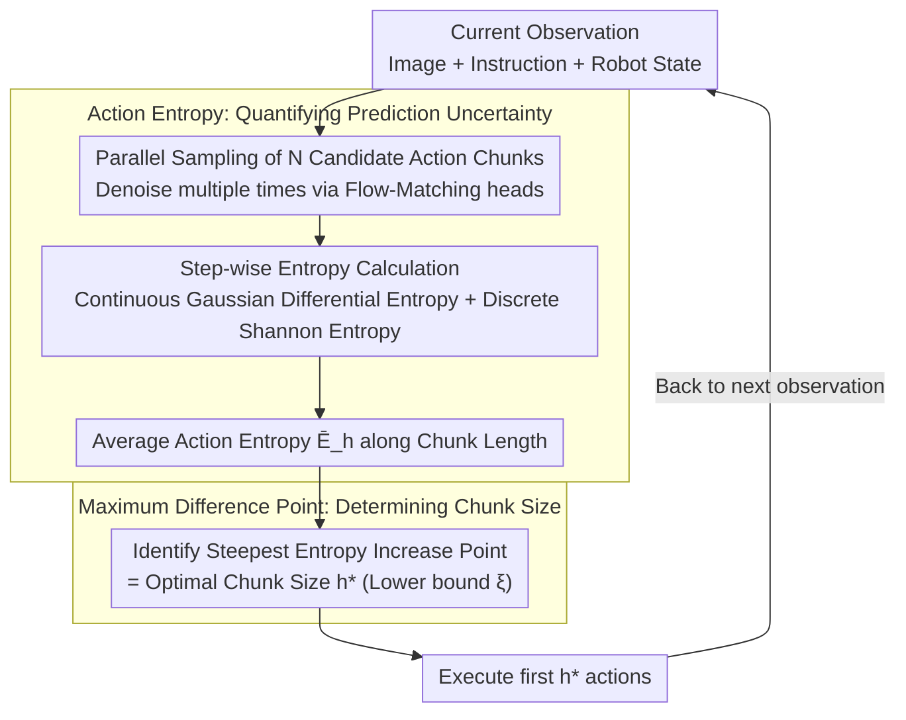

# Adaptive Action Chunking at Inference-time for Vision-Language-Action Models

**Conference**: CVPR 2026  
**arXiv**: [2604.04161](https://arxiv.org/abs/2604.04161)  
**Code**: [https://lance-lot.github.io/adaptive-chunking.github.io/](https://lance-lot.github.io/adaptive-chunking.github.io/)  
**Area**: Robotics / VLA Models  
**Keywords**: Action Chunking, VLA Models, Adaptive Inference, Action Entropy, Robotic Manipulation

## TL;DR
The paper proposes Adaptive Action Chunking (AAC), which utilizes action entropy as a cue to dynamically determine the optimal chunk size during inference without additional training or architectural modifications. It consistently improves success rates for GR00T N1.5 and π0.5 on benchmarks such as RoboCasa and LIBERO.

## Background & Motivation

**Background**: In VLA models, action chunking (executing a set of actions at once without intermediate re-planning) is a key technique for enhancing robotic manipulation. Current mainstream VLA models (GR00T N1.5, π0, SmolVLA) use fixed chunk sizes.

**Limitations of Prior Work**: (1) Large chunks $\rightarrow$ poor responsiveness, failing to adapt to new information timely; (2) Small chunks $\rightarrow$ mode-jumping, where discontinuity between chunks leads to jittering; (3) **Optimal chunk sizes vary across different tasks** (experiments show that for the same model, the optimal chunk size ranges from 4 to 16 on different RoboCasa tasks). Existing methods like ACT use EMA smoothing or BID search for the best chunk, but they all still utilize a fixed size.

**Key Challenge**: The need to dynamically balance consistency (large chunks) and reactivity (small chunks), which cannot be achieved with fixed chunk sizes.

**Key Insight**: Action entropy reflects prediction uncertainty—low entropy indicates high reliability, allowing for large chunks; high entropy indicates low reliability, requiring smaller chunks and frequent re-planning.

**Core Idea**: Calculate the average action entropy corresponding to different chunk sizes and identify the point of maximum difference to determine the optimal chunk size.

## Method

### Overall Architecture
AAC aims to address the issue of fixed chunk size hyperparameters in existing VLAs by integrating a selection mechanism into the inference loop without affecting training or architecture. For each new observation, the model first samples $N$ candidate action chunks in parallel. It then calculates the **action entropy** along each future time step within the chunks to derive an "entropy vs. chunk length" curve. The inflection point with the steepest entropy increase (**maximum difference point**) is identified as the optimal chunk size $h^*$ for the current step. After executing the first $h^*$ actions, the system returns to observation and re-samples. The intuition is to let the model proceed as far as its own confidence allows.

### Key Designs

**1. Action Entropy: Quantifying "How Certain the Model is about the Future" as a Curve**

The core issue is that chunk size selection requires determining at which step future predictions become unreliable, a metric for which no standard scale exists. AAC measures uncertainty through the divergence of $N$ candidate chunks at each time step, calculating entropy separately for two types of actions. Continuous actions (translation, rotation) follow a Gaussian distribution, using differential entropy $E_t = \frac{1}{2}\log\!\big[(2\pi e)^d \det(\Sigma_t)\big]$, where covariance $\Sigma_t$ is estimated from the values of the $N$ candidate chunks at that step. Discrete actions (gripper open/close) use Shannon entropy $E_{dis} = -\sum p(a)\log p(a)$, where probability $p(a)$ is estimated by the frequency of values in the candidates. By summing the translation, rotation, and gripper components at each step and averaging them along the chunk length $h$, the average action entropy is obtained:

$$\bar{E}_h = \frac{1}{h}\sum_{i=t}^{t+h-1}\sum_{j \in \{t,r,g\}} E_j^i$$

This curve is the basis for chunk size selection. The advantage of this approach is that entropy is estimated entirely from existing multi-sampling, and the unified summation framework for continuous and discrete actions is agnostic to robot morphology.

**2. Maximum Difference Point: When is it no longer reliable to proceed?**

With the $\bar{E}_h$ curve, the criterion for truncation is finding the step with the fastest growth in average entropy:

$$h^* = \max\Big(\arg\max_h(\bar{E}_{h+1} - \bar{E}_h),\ \xi\Big)$$

The position where the difference $\bar{E}_{h+1} - \bar{E}_h$ is maximized represents a point where executing one more step results in a sharp spike in uncertainty. This is the optimal switching point between consistency (saving re-planning costs with large chunks) and reactivity (correcting errors timely with small chunks). A lower bound $\xi$ is applied to ensure chunks do not become too small, maintaining minimum movement amplitude and avoiding excessive computational overhead from per-step re-planning. After calculating $h^*$, the first $h^*$ actions are executed before returning to the next observation.

The effectiveness of this criterion is evident in emergent behaviors on real hardware: chunk size follows entropy. When the arm approaches an object requiring precise alignment, predictions diverge and entropy increases, causing $h^*$ to automatically decrease for frequent re-planning. During long-distance transport with smooth trajectories, entropy remains low, and $h^*$ increases for efficient movement. This alignment with human intuition—"big steps for coarse movement, small steps for fine movement"—validates that using the maximum difference point of entropy is physically reasonable.

### Loss & Training
AAC introduces no training objectives. All calculations occur at inference time—entropy is estimated directly from multiple samplings of flow-matching action heads. Consequently, it is an "out-of-the-box" solution compatible with any VLA model based on diffusion or flow-matching.

## Key Experimental Results

### Main Results (RoboCasa + LIBERO)

| Method | RoboCasa Avg | LIBERO Avg |
|------|-------------|------------|
| GR00T (h=16, Default) | 59.7% | 94.1% |
| GR00T (h=2) | 47.0% | 90.2% |
| GR00T (h=4) | 56.2% | 92.6% |
| GR00T (h=8) | 61.2% | 94.7% |
| **GR00T + AAC (Ours)** | **62.0%** | **95.0%** |

LIBERO-Long (Hardest subset): 88.8% $\rightarrow$ **92.8%** (+4.0% Gain)

### Cross-Backbone Validation

| Method | LIBERO Avg |
|------|------------|
| π0.5 (Baseline) | 97.0% |
| **π0.5 + AAC (Ours)** | **97.9%** |

### OOD Robustness (LIBERO-Pro Position Perturbation)

| Perturbation Level | GR00T | GR00T+AAC (Ours) |
|----------|-------|-----------|
| ×0.2 | Baseline | + Gain |
| ×0.3 | Baseline | + Gain |
| ×0.4 | Baseline | + Gain |

### Key Findings
- **No single fixed chunk size is optimal for all tasks**: Optimal $h=4$ for LIBERO-Spatial, while optimal $h=16$ for LIBERO-Goal.
- AAC outperforms the average of all fixed chunk sizes without requiring manual parameter tuning.
- The most significant improvement occurs in long-horizon tasks (LIBERO-Long, +4%), which demand the highest reactivity.
- The temporal distribution of chunk sizes aligns closely with the semantic phases of the task: large chunks for transport, small chunks for manipulation.

## Highlights & Insights
- **Inference Optimization with Zero Training Cost**: AAC operates entirely during inference, requiring no structural changes or retraining, making it plug-and-play.
- **Action Entropy as a Universal Uncertainty Metric**: A unified entropy calculation framework across continuous/discrete action spaces that generalizes to different robot morphologies (single-arm, dual-arm, humanoid).
- **Consistency with Human Intuition**: Visual analysis shows that chunk size corresponds perfectly to semantic phases—coarse operations use large chunks, while fine operations use small chunks—validating the physical rationality of the method.

## Limitations & Future Work
- Parallel sampling of $N$ candidate chunks introduces additional inference latency ($N$ improves estimation accuracy but increases delay).
- The maximum difference point strategy is heuristic and does not guarantee global optimality.
- The minimum chunk size lower bound $\xi$ is a hyperparameter that may vary across tasks.
- Evaluation has focused on tabletop manipulation; more complex mobile manipulation (e.g., combined navigation and manipulation) remains to be explored.

## Related Work & Insights
- **vs ACT (EMA Smoothing)**: ACT generates new chunks at each step and fuses them via EMA, but the chunk size remains fixed. AAC selects the size adaptively.
- **vs BID/TV-BID**: BID selects the best chunk from multiple candidates but uses a fixed size; AAC adapts the size dynamically.
- **vs RL-based Adaptive Methods**: These require additional training and task-specific reward signals, whereas AAC requires no training.

## Rating
- Novelty: ⭐⭐⭐⭐ Action entropy-driven chunk selection is simple and effective, though the principle is relatively intuitive.
- Experimental Thoroughness: ⭐⭐⭐⭐⭐ Comprehensive evaluation across multiple benchmarks, backbones, OOD tests, real-world experiments, and qualitative analyses.
- Writing Quality: ⭐⭐⭐⭐⭐ Clear motivation, concise methodology, and excellent visualizations.
- Value: ⭐⭐⭐⭐⭐ Directly practical for VLA deployment with zero-cost plug-and-play utility.

<!-- RELATED:START -->

## Related Papers

- [\[CVPR 2026\] ACoT-VLA: Action Chain-of-Thought for Vision-Language-Action Models](acot-vla_action_chain-of-thought_for_vision-language-action_models.md)
- [\[CVPR 2026\] Test-Time Perturbation Tuning with Delayed Feedback for Vision-Language-Action Models](test-time_perturbation_tuning_with_delayed_feedback_for_vision-language-action_m.md)
- [\[ICLR 2026\] Real-Time Robot Execution with Masked Action Chunking](../../ICLR2026/robotics/real-time_robot_execution_with_masked_action_chunking.md)
- [\[CVPR 2026\] AT-VLA: Adaptive Tactile Injection for Enhanced Feedback Reaction in Vision-Language-Action Models](at-vla_adaptive_tactile_injection_for_enhanced_feedback_reaction_in_vision-langu.md)
- [\[CVPR 2026\] QuantVLA: Scale-Calibrated Post-Training Quantization for Vision-Language-Action Models](quantvla_scale-calibrated_post-training_quantization_for_vision-language-action_.md)

<!-- RELATED:END -->
