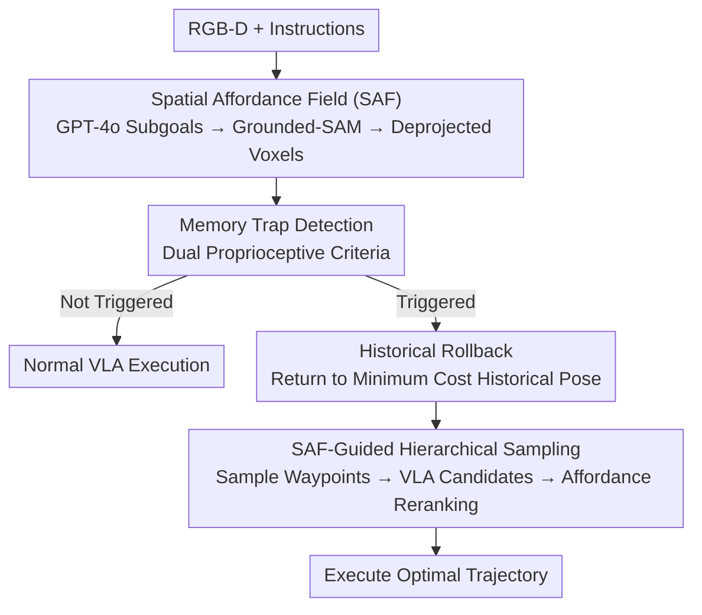

# Affordance Field Intervention: Enabling VLAs to Escape Memory Traps in Robotic Manipulation

**Conference**: CVPR 2026  
**Paper**: [CVF Open Access](https://openaccess.thecvf.com/content/CVPR2026/html/Xu_Affordance_Field_Intervention_Enabling_VLAs_to_Escape_Memory_Traps_in_CVPR_2026_paper.html)  
**Code**: https://vla-afi.github.io/ (Project Page)  
**Area**: Embodied AI / VLA Robotic Manipulation  
**Keywords**: VLA, Spatial Affordance Field, Memory Trap, Distribution Shift, Plug-and-play Intervention

## TL;DR
Addressing the "Memory Trap" issue where VLA models rigidly follow training trajectories towards old object locations under scene perturbations, this paper proposes a training-free 3D Spatial Affordance Field (SAF) as a plug-and-play plugin. The system uses proprioception to detect traps, rolls back to safe historical poses, and employs SAF to sample waypoints and rerank VLA candidate trajectories based on cumulative affordance, achieving an average improvement of 23.5% in real-world OOD scenarios.

## Background & Motivation
**Background**: Vision-Language-Action (VLA) models map visual observations and language instructions end-to-end into action sequences. Leveraging large-scale imitation learning, they have become the mainstream "motion planners" for robotic manipulation, capable of completing diverse tasks like picking and rearranging without per-task engineering.

**Limitations of Prior Work**: Such end-to-end models are fragile under out-of-distribution (OOD) shifts. When target objects are moved, recolored, or placed against new backgrounds, VLAs often fail to adapt and instead **mechanically replicate trajectories remembered during training**, driving the end-effector (EEF) toward the object's original location. The authors define this failure mode as a "Memory Trap."

**Key Challenge**: The root cause lies in the end-to-end design itself—VLAs only implicitly fit the "vision-language input to action" mapping, lacking explicit perception and reasoning of "where to interact" in 3D space. Consequently, they lack true planning capabilities in unfamiliar environments and default to reciting memorized paths. Existing affordance solutions (e.g., VLM planners like VoxPoser or ReKep) show low success rates because VLM-generated motion plans lack fine-grained geometric understanding, often yielding physically infeasible actions, and rely heavily on fragile, non-transferable per-task prompt engineering.

**Goal**: Enable VLAs to escape memory traps and navigate to high-affordance regions to improve success rates **without retraining, adding demonstration data, or modifying VLA parameters**.

**Key Insight**: Establish a division of labor between the VLA (strong semantic understanding, weak geometry) and the affordance field (strong geometric constraints, weak motion planning). The SAF intervenes only when necessary to provide 3D geometric cues as "soft constraints," while concrete actions remain the responsibility of the VLA, leveraging the strengths of both.

**Core Idea**: Treat the 3D Spatial Affordance Field (SAF) as an **on-demand plugin** for the VLA. A closed-loop intervention involving "rollback + SAF-guided sampling + affordance-based reranking" is triggered only upon detecting a memory trap, using explicit spatial anchors to break the VLA’s rigid recitation.

## Method

### Overall Architecture
The system takes RGB-D observations and language instructions as input and outputs executed action trajectories. Any pretrained VLA (e.g., $\pi_0$, $\pi_{0.5}$) serves as the backbone, with the SAF attached as a sidecar plugin.

The pipeline operates in two layers. The **offline/pre-processing layer** constructs the SAF: GPT-4o decomposes instructions into ordered subgoals (pick → move → place) and extracts target terms (e.g., "carrot," "blue pan"). These terms are fed into Grounded-SAM for open-vocabulary segmentation to obtain 2D masks, which are then deprojected into 3D using depth maps and camera intrinsics. Combined with scene point clouds, a continuous affordance cost field $V_\text{SAF}$ is calculated on an $N \times N \times N$ voxel grid (lower values indicate "better" regions: closer to targets, further from obstacles). The **online intervention layer** is the core contribution: it monitors EEF states at each timestep to detect memory traps. Once triggered, the system rolls back to a low-cost historical pose, performs a two-stage tree search—sampling intermediate waypoints via SAF and generating multiple VLA candidate trajectories—and finally executes the optimal path selected by SAF ranking. This intervention requires no parameter updates and relies purely on geometric "soft correction."

### Key Designs

**1. SAF Construction: Mapping Language Goals to Scorable 3D Cost Fields**

This serves as the "metric" for all subsequent interventions, addressing the VLA's lack of spatial interaction awareness. The SAF is a weighted fusion of two complementary sub-fields. The **target guidance field** $V_\text{target}$ encodes attraction to the goal: for each voxel $v_{ijk}$, it calculates the Euclidean distance to the target centroid $c_\text{target}=\frac{1}{|P_\text{target}|}\sum_{p\in P_\text{target}}p$ and applies a distance transform. Higher costs are assigned further from the goal to "pull" the EEF toward it. The **obstacle avoidance field** $V_\text{obst}$ encodes repulsion from scene obstacles: voxels occupied by or near the point cloud are assigned high costs. To avoid excessive conservatism, heuristic masking exempts the immediate vicinity of the EEF (allowing close-range manipulation) and maintains a buffer around the target (allowing approach for grasping). The fields are fused linearly:

$$V_\text{SAF} = w_\text{target} V_\text{target} + w_\text{obst} V_\text{obst}$$

Euclidean distance transforms and Gaussian smoothing (kernel $\sigma$) ensure smooth spatial gradients, followed by normalization to $[0,1]$. Lower values indicate higher "affordance." When the VLM detects a subgoal transition (e.g., from grasping a lid to placing it), targets are automatically updated, and the SAF is reconstructed dynamically.

**2. Proprioception-Based Memory Trap Detection: Intervening Only When Necessary**

To avoid disrupting fine-grained manipulation near targets, precise identification of traps is required. Using the robot's proprioception, a trap is identified only when **two conditions are met simultaneously**: (1) EEF displacement $\lVert p_t - p_{t-\Delta t}\rVert$ within a time window $\Delta t$ is below a threshold $\epsilon_\text{stuck}$; (2) the current distance to the target $\lVert p_t - c_\text{target}\rVert$ exceeds a threshold $\epsilon_\text{far}$. The first condition identifies "quasi-static" states, which could indicate either precision grasping or a stuck state; the second condition disambiguates—if the EEF is static yet **far from the goal**, it is likely stuck or tracking the wrong object.

**3. Affordance-Guided Historical Rollback: Returning to a Safe Starting Point**

Upon trap detection, the VLA's current pose is often suboptimal; sampling waypoints from a failed pose is often ineffective (removing rollback drops success rates from 65% to 40%). The system maintains a history buffer of $M$ poses $P_\text{hist}=\{p_{t-M},\dots,p_{t-1}\}$ and selects the pose with the lowest SAF cost as the rollback target:

$$p_\text{rollback} = \arg\min_{p\in P_\text{hist}} V_\text{SAF}(p)$$

The robot executes a short rollback trajectory to $p_\text{rollback}$, providing a safe root node for subsequent tree searches and neutralizing the impact of the previous drift.

**4. Hierarchical Exploration for Optimal Trajectories: Waypointing, Completion, and Reranking**

This combines SAF spatial reasoning with VLA task capabilities. From $p_\text{rollback}$, a two-stage tree search is conducted. **Phase I: SAF Local Sampling**: Intermediate waypoints are sampled in a local neighborhood $\mathcal{N}(p_{rollback}, r)$. The $N$ positions with the lowest costs are selected as primary nodes ($N=10$ is empirically optimal):

$$\{p_i^\text{way}\}_{i=1}^N = \mathop{\arg\min{}^N}_{p\in\mathcal{N}(p_\text{rollback}, r)} V_\text{SAF}(p)$$

These waypoints act as "spatially advantageous targets" that redirect the robot toward low-cost zones. **Phase II: VLA Trajectory Generation**: For each waypoint $p_i^\text{way}$, the VLA generates $K$ diverse candidate actions based on updated observations (sampling via noise temperatures/seeds for diffusion policies). Each candidate is an action chunk (joint sequence of horizon $H$), converted to an EEF trajectory $\xi_{i,k}=\{p_j^{i,k}\}_{j=1}^H$ via forward kinematics. Its cumulative cost is calculated:

$$\mathcal{V}(\xi_{i,k}) = \sum_{j=1}^{H} V_\text{SAF}(p_j^{i,k})$$

The candidate with the minimum cumulative cost $\xi^*$ is selected for execution.

## Key Experimental Results

### Main Results (Real-world AgileX Piper)
Each task/scenario consists of 20 trials. The table shows average success rates across four tasks under five conditions (In-distribution + 4 OOD shifts: Location, Color, Attribute, Background). AFI consistently outperforms the vanilla VLA.

| Task | Method | Avg Success Rate | Relative Gain |
|------|-------|------------------|---------------|
| Place Carrot | ReKep (VLM Planner) | 36.0% | — |
| Place Carrot | $\pi_0$ | 61.0% | — |
| Place Carrot | $\pi_0$-AFI | **87.0%** | ↑26.0% |
| Remove Lid | $\pi_0 \rightarrow \pi_0$-AFI | 63.0% $\rightarrow$ **80.0%** | ↑17.0% |
| Slot Pen | $\pi_0 \rightarrow \pi_0$-AFI | 60.0% $\rightarrow$ **82.0%** | ↑22.0% |
| Stack Tape | $\pi_0 \rightarrow \pi_0$-AFI | 64.0% $\rightarrow$ **86.0%** | ↑22.0% |
| Stack Tape | $\pi_{0.5} \rightarrow \pi_{0.5}$-AFI | 61.0% $\rightarrow$ **82.0%** | ↑21.0% |
| Stack Tape | $\pi_0+\pi_{0.5}$-AFI (Ensemble) | — $\rightarrow$ **89.0%** | ↑25.0% |

Overall, real-world OOD performance improved by 23.5%. Significant gains were observed in "Task shift" (physical attribute changes + distractors); e.g., Remove Lid with distractors rose from 25% to 55%. Pure VLM planners like ReKep managed only 36%, confirming that while VLMs understand semantics, they lack fine-grained motion planning.

### Simulation (LIBERO-Pro with Spatial Perturbations)

| Suite | $\pi_{0.5}$ | $\pi_{0.5}$-AFI |
|-------|------------|----------------|
| LIBERO-Spatial (Average) | 54.0% | 75.7% |
| LIBERO-Object (Average) | 56.4% | 73.2% |

⚠️ *Note*: There is a discrepancy between the text narrative and the table values in the original paper regarding simulation means (Text: Spatial 78.2% vs 52.4%, Object 82.5% vs 67.3%; Table: 75.7% vs 54.0% and 73.2% vs 56.4%). Regardless of the specific metric, the trend indicates significant improvement with AFI.

### Ablation Study

| Configuration (Positional Shift, 20 trials) | Success Rate | Note |
|---------------------------------------------|--------------|------|
| $\pi_0$ (Vanilla) | 6/20 (30%) | Baseline |
| $\pi_0$-AFI (Full) | 13/20 (65%) | Ours |
| w/o Rollback | 8/20 (40%) | -25% Drop |
| Fixed-step at 30 | 12/20 (60%) | Intervene at step 30 |
| Fixed-step at 60 | 11/20 (55%) | Intervene at step 60 |
| Fixed-step at 90 | 9/20 (45%) | Intervene at step 90 |

| Number of Waypoints | 3 | 8 | 10 | 13 |
|--------------------|---|---|---|---|
| Success Rate | 35.0% | 50.0% | **65.0%** | 60.0% |

### Key Findings
- **Rollback is the most critical component**: Removal causes a drop from 65% to 40%. Rollback provides a safe "restart point" when the VLA has drifted too far.
- **Adaptive detection outperforms fixed-step intervention**: Real-time monitoring (65%) is superior to fixed steps (max 60% at Step 30), highlighting the importance of precise intervention.
- **Waypoint count requires balance**: 3 is too few (35%); 10 is optimal (65%); 13 causes degradation (60%). Excessive waypoints over-constrain the VLA to a linear path, which may be spatially optimal in SAF but detrimental to actual grasping geometry.
- **Low latency for real-time deployment**: SAF reconstruction takes 120ms/frame, and waypoint generation takes 15ms. The end-to-end latency of 185ms supports 5Hz control, much faster than MPC-based optimization.

## Highlights & Insights
- **Effective Nomenclature**: "Memory Trap" clearly defines the OOD failure mode. The dual-criterion detection (quasi-static + far from target) effectively disambiguates traps from intentional precision pauses.
- **SAF as a "Scorer/Selector" rather than an "Actor"**: Using geometric constraints for evaluation while leaving action generation to the VLA avoids the "geometrically infeasible" trajectories common in pure VLM planners.
- **Plug-and-play and Model-agnostic**: The method requires no retraining or data and is applicable across different backbones ($\pi_0, \pi_{0.5}$, OpenVLA, SpatialVLA). It also naturally supports policy ensembling.

## Limitations & Future Work
- **Dependency on Perception Chain**: SAF construction relies on GPT-4o, Grounded-SAM, and depth deprojection. Failures in any stage (segmentation misses or depth noise) propagate to the affordance field.
- **Linear Path Bias**: SAF waypoints favor direct reachability over complex grasping. The tension between geometric guidance and actual grasping poses remains a challenge for tasks like precision insertion.
- **Data Consistency**: Numerical discrepancies between the paper's text and tables regarding simulation averages should be noted (readers should defer to the tables).

## Related Work & Insights
- **vs. ReKep / VoxPoser**: These direct VLM planners suffer from poor geometric feasibility. This work moves "motion generation" back to the VLA, using the VLM only for affordance scoring.
- **vs. RL Fine-tuning**: While RL adapts to OOD via interaction, it is data-intensive and requires hard-to-obtain reward signals. This work is training-free and relies on geometric priors.
- **vs. SpatialVLA**: While SpatialVLA integrates 3D features into the model, AFI treats 3D reasoning as an external plugin. The two are complementary, as evidenced by further gains when combined.

## Rating
- Novelty: ⭐⭐⭐⭐ The "Memory Trap" concept and the specific division of labor for VLA intervention are insightful, though individual components are established tools.
- Experimental Thoroughness: ⭐⭐⭐⭐ Comprehensive real-world and simulation testing across multiple backbones, though docked for numerical inconsistencies.
- Writing Quality: ⭐⭐⭐⭐ Clear descriptions and diagrams; undermined slightly by data discrepancy.
- Value: ⭐⭐⭐⭐ High practical value for making existing VLA deployments robust to OOD environments without retraining.

<!-- RELATED:START -->

## Related Papers

- [\[CVPR 2026\] Beyond Success: Refining Elegant Robot Manipulation from Mixed-Quality Data via Just-in-Time Intervention](beyond_success_refining_elegant_robot_manipulation_from_mixed-quality_data_via_j.md)
- [\[CVPR 2026\] PALM: Progress-Aware Policy Learning via Affordance Reasoning for Long-Horizon Robotic Manipulation](palm_progress-aware_policy_learning_via_affordance_reasoning_for_long-horizon_ro.md)
- [\[CVPR 2026\] CycleManip: Enabling Cycle-based Manipulation via Effective History Perception and Understanding](cyclemanip_enabling_cycle-based_manipulation_via_effective_history_perception_an.md)
- [\[CVPR 2026\] CycleManip: Enabling Cyclic Task Manipulation via Effective Historical Perception and Understanding](cyclemanip_enabling_cyclic_task_manipulation_via_effective_historical_percepti.md)
- [\[ICLR 2026\] MemoryVLA: Perceptual-Cognitive Memory in Vision-Language-Action Models for Robotic Manipulation](../../ICLR2026/robotics/memoryvla_perceptual-cognitive_memory_in_vision-language-action_models_for_robot.md)

<!-- RELATED:END -->
